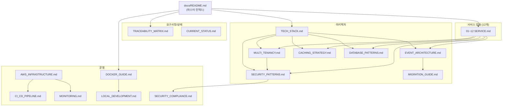

# HR SaaS Platform 문서 인덱스

> **최종 업데이트**: 2026-02-09
> **플랫폼**: Enterprise-grade 멀티테넌트 HR SaaS (100+ 계열사)

---

## 문서 구조

```
docs/
├── README.md                          ← 현재 문서 (마스터 인덱스)
├── architecture/                      # 공통 아키텍처 패턴
│   ├── TECH_STACK.md                 # 기술 스택 및 선택 근거
│   ├── MULTI_TENANCY.md              # PostgreSQL RLS 멀티테넌시
│   ├── SECURITY_PATTERNS.md          # JWT, RBAC, 마스킹 구현
│   ├── EVENT_ARCHITECTURE.md         # SNS/SQS 이벤트 아키텍처
│   ├── CACHING_STRATEGY.md           # Redis 캐싱 전략
│   ├── DATABASE_PATTERNS.md          # HikariCP, Flyway, 엔티티 패턴
│   └── MIGRATION_GUIDE.md            # 기술 전환 가이드 (Kafka→SQS 등)
├── operations/                        # DevOps 및 운영 가이드
│   ├── DOCKER_GUIDE.md               # Docker Compose 로컬 개발
│   ├── AWS_INFRASTRUCTURE.md         # AWS 프로덕션 인프라
│   ├── CI_CD_PIPELINE.md             # CI/CD 파이프라인
│   ├── MONITORING.md                 # Prometheus/Grafana 모니터링
│   ├── LOCAL_DEVELOPMENT.md          # 로컬 개발 환경 설정
│   └── SECURITY_COMPLIANCE.md        # ISMS-P, PIPA 컴플라이언스
├── modules/                           # 서비스별 상세 문서 (12개)
│   ├── 01-AUTH-SERVICE.md ~ 12-APPOINTMENT-SERVICE.md
│   └── (⚠️ 수정 금지 — 백엔드 개발 진행 중)
├── api/                               # API 문서
│   └── API_INTEGRATION_GUIDE.md      # FE-BE 통합 패턴, REST API 규칙
├── requirements/                      # 요구사항
│   └── TRACEABILITY_MATRIX.md        # 요구사항 → 구현 추적 매트릭스
├── decisions/                         # 아키텍처 결정 기록 (ADR)
│   ├── README.md                     # ADR 가이드 및 목록
│   ├── 001-use-rls-for-multitenancy.md
│   ├── 002-migrate-kafka-to-sqs.md
│   ├── 003-custom-jwt-vs-keycloak.md
│   └── 004-hikaricp-pool-sizing.md
├── status/                            # 프로젝트 상태 추적
│   └── CURRENT_STATUS.md             # 통합 개발 현황
└── deprecated/                        # Deprecated 문서 (아카이브)
    ├── README.md                     # Deprecated 문서 활용 가이드
    ├── SDD_*.md (9개)                # 초기 설계 문서 (Kafka/Keycloak 기반)
    └── (13개 추가)                    # PRD, 갭분석, Phase 리뷰 등
```

---

## 역할별 빠른 시작 가이드

### 신규 백엔드 개발자

1. **[LOCAL_DEVELOPMENT.md](operations/LOCAL_DEVELOPMENT.md)** - IDE 설정, 도구 설치
2. **[DOCKER_GUIDE.md](operations/DOCKER_GUIDE.md)** - Docker로 로컬 인프라 구동
3. **[TECH_STACK.md](architecture/TECH_STACK.md)** - 기술 스택 이해
4. **[MULTI_TENANCY.md](architecture/MULTI_TENANCY.md)** - RLS 멀티테넌시 패턴
5. **[SECURITY_PATTERNS.md](architecture/SECURITY_PATTERNS.md)** - JWT, RBAC, SecurityConfig
6. **[DATABASE_PATTERNS.md](architecture/DATABASE_PATTERNS.md)** - 엔티티, Flyway, HikariCP
7. 담당 서비스 문서: `modules/XX-SERVICE.md`

### 신규 프론트엔드 개발자

1. **[LOCAL_DEVELOPMENT.md](operations/LOCAL_DEVELOPMENT.md)** - 환경 설정 (pnpm)
2. **[API_INTEGRATION_GUIDE.md](api/API_INTEGRATION_GUIDE.md)** - FE-BE 통합 패턴, REST API 규칙

### DevOps 엔지니어

1. **[DOCKER_GUIDE.md](operations/DOCKER_GUIDE.md)** - Docker Compose 구성
2. **[AWS_INFRASTRUCTURE.md](operations/AWS_INFRASTRUCTURE.md)** - AWS 프로덕션 아키텍처
3. **[CI_CD_PIPELINE.md](operations/CI_CD_PIPELINE.md)** - 빌드/배포 파이프라인
4. **[MONITORING.md](operations/MONITORING.md)** - Prometheus/Grafana 모니터링
5. **[SECURITY_COMPLIANCE.md](operations/SECURITY_COMPLIANCE.md)** - 보안 컴플라이언스

### 프로젝트 관리자 / QA

1. **[CURRENT_STATUS.md](status/CURRENT_STATUS.md)** - 전체 개발 현황
2. **[TRACEABILITY_MATRIX.md](requirements/TRACEABILITY_MATRIX.md)** - 요구사항 추적
3. **[PRD.md](deprecated/PRD.md)** - 제품 요구사항 (deprecated, 참고용)

### 보안 감사자

1. **[SECURITY_COMPLIANCE.md](operations/SECURITY_COMPLIANCE.md)** - ISMS-P, PIPA 대응
2. **[SECURITY_PATTERNS.md](architecture/SECURITY_PATTERNS.md)** - 보안 구현 상세
3. **[MULTI_TENANCY.md](architecture/MULTI_TENANCY.md)** - 테넌트 격리 (RLS)
4. **[TRACEABILITY_MATRIX.md](requirements/TRACEABILITY_MATRIX.md)** - NFR-SEC 충족 현황

---

## 주요 문서 요약

### 아키텍처 (architecture/)

| 문서 | 설명 | 대상 |
|------|------|------|
| [TECH_STACK.md](architecture/TECH_STACK.md) | Java 17, Spring Boot 3.2, PostgreSQL 15, Redis 7, SQS/SNS 등 기술 선택과 근거 | 전체 |
| [MULTI_TENANCY.md](architecture/MULTI_TENANCY.md) | PostgreSQL RLS 정책, TenantContext, TenantFilter, Flyway 마이그레이션 패턴 | 백엔드 |
| [SECURITY_PATTERNS.md](architecture/SECURITY_PATTERNS.md) | JWT 인증, SecurityFilter 이중 등록 해결, 7단계 RBAC, 마스킹/암호화 | 백엔드 |
| [EVENT_ARCHITECTURE.md](architecture/EVENT_ARCHITECTURE.md) | SNS/SQS 이벤트 발행/소비, 7개 토픽, 5개 큐, DLQ, 테넌트 컨텍스트 전파 | 백엔드 |
| [CACHING_STRATEGY.md](architecture/CACHING_STRATEGY.md) | Redis 키 네이밍, TTL 전략, 테넌트 격리 캐시, Spring Cache 어노테이션 | 백엔드 |
| [DATABASE_PATTERNS.md](architecture/DATABASE_PATTERNS.md) | HikariCP 풀 사이징, Flyway V1-V4, 엔티티 상속, 트랜잭션 관리 | 백엔드 |
| [MIGRATION_GUIDE.md](architecture/MIGRATION_GUIDE.md) | Kafka→SQS, Keycloak→JWT, Gateway→Traefik 전환 배경과 향후 계획 | 아키텍트 |

### 운영 (operations/)

| 문서 | 설명 | 대상 |
|------|------|------|
| [DOCKER_GUIDE.md](operations/DOCKER_GUIDE.md) | docker-compose 구성, 서비스 시작/정지, 포트 매핑, 트러블슈팅 | 전체 |
| [AWS_INFRASTRUCTURE.md](operations/AWS_INFRASTRUCTURE.md) | ECS Fargate, RDS Multi-AZ, ElastiCache, ALB, VPC, 비용 추정 | DevOps |
| [CI_CD_PIPELINE.md](operations/CI_CD_PIPELINE.md) | GitHub Actions, Gradle 빌드, Docker 이미지, 배포 전략 | DevOps |
| [MONITORING.md](operations/MONITORING.md) | Prometheus 메트릭, Grafana 대시보드, Jaeger 분산 추적, 알림 규칙 | DevOps |
| [LOCAL_DEVELOPMENT.md](operations/LOCAL_DEVELOPMENT.md) | IDE 설정, 서비스 실행, 디버깅, 테스트 계정, FAQ | 개발자 |
| [SECURITY_COMPLIANCE.md](operations/SECURITY_COMPLIANCE.md) | ISMS-P 매핑, PIPA 준수, OWASP Top 10, 보안 체크리스트 | 보안 |

### 서비스 모듈 (modules/)

| 문서 | 서비스 | 포트 |
|------|--------|------|
| [01-AUTH-SERVICE.md](modules/01-AUTH-SERVICE.md) | 인증/세션/비밀번호 | 8081 |
| [02-TENANT-SERVICE.md](modules/02-TENANT-SERVICE.md) | 멀티테넌시/정책 | 8082 |
| [03-MDM-SERVICE.md](modules/03-MDM-SERVICE.md) | 기준정보/공통코드 | 8087 |
| [04-ORGANIZATION-SERVICE.md](modules/04-ORGANIZATION-SERVICE.md) | 조직/부서/직급 | 8083 |
| [05-EMPLOYEE-SERVICE.md](modules/05-EMPLOYEE-SERVICE.md) | 인사/개인정보 | 8084 |
| [06-ATTENDANCE-SERVICE.md](modules/06-ATTENDANCE-SERVICE.md) | 근태/휴가 | 8085 |
| [07-APPROVAL-SERVICE.md](modules/07-APPROVAL-SERVICE.md) | 전자결재/워크플로우 | 8086 |
| [08-NOTIFICATION-SERVICE.md](modules/08-NOTIFICATION-SERVICE.md) | 알림/SSE | 8088 |
| [09-FILE-SERVICE.md](modules/09-FILE-SERVICE.md) | 파일/S3 | 8089 |
| [10-RECRUITMENT-SERVICE.md](modules/10-RECRUITMENT-SERVICE.md) | 채용 | 8093 |
| [11-CERTIFICATE-SERVICE.md](modules/11-CERTIFICATE-SERVICE.md) | 증명서 | 8092 |
| [12-APPOINTMENT-SERVICE.md](modules/12-APPOINTMENT-SERVICE.md) | 발령 | 8091 |

---

## 문서 관계도



---

## Deprecated 문서

`docs/deprecated/` 디렉토리에는 다음이 보존되어 있습니다:

- **SDD 문서 (9개)**: 초기 Kafka/Keycloak 기반 설계 문서 — 도메인 모델과 비즈니스 규칙은 여전히 유효
- **PRD 및 갭 분석**: 초기 요구사항 문서 → `requirements/TRACEABILITY_MATRIX.md`로 대체
- **Phase 리뷰/액션**: Phase 1-2 리뷰 결과 → `status/CURRENT_STATUS.md`로 통합
- **프론트엔드 문서**: 화면 인벤토리, Select 감사 등 → 프론트엔드 리포지토리로 이관 예정
- **상태 파일**: 프로젝트 루트 CURRENT_STATUS 2개 → `status/CURRENT_STATUS.md`로 통합

상세 안내: **[deprecated/README.md](deprecated/README.md)**

---

## 문서 기여 가이드

### 언어

- 모든 문서는 **한국어**로 작성
- 기술 용어는 영문 병기: "멀티테넌시 (Multi-tenancy)"
- 코드 예제의 변수명/메서드명은 영문 유지, 주석만 한국어

### 형식

- Markdown 사용 (GitHub-flavored)
- 각 문서 상단에 업데이트 일자, 대상 독자 명시
- 코드 블록에 언어 태그 포함 (```java, ```yaml 등)
- Mermaid 다이어그램 활용

### 갱신 원칙

- 코드 변경 시 관련 문서 동시 업데이트
- 공통 패턴 변경 → `architecture/` 문서 업데이트
- 서비스 변경 → 해당 `modules/XX-SERVICE.md` 업데이트
- 인프라 변경 → `operations/` 문서 업데이트

---

## 관련 링크

| 항목 | 위치 |
|------|------|
| 프로젝트 루트 | `CLAUDE.md` (개발 컨벤션, 프로젝트 구조) |
| 백엔드 코드 | `common/` (공통 모듈), `services/` (마이크로서비스) |
| 프론트엔드 코드 | `frontend/apps/web/` |
| Docker 설정 | `docker/docker-compose.yml` |
| Gradle 빌드 | `build.gradle`, `settings.gradle` |
