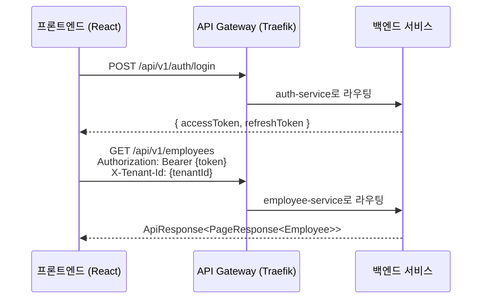

# 프론트엔드-백엔드 통합 가이드

> **최종 업데이트**: 2026-02-09
> **대상**: 프론트엔드 개발자, 풀스택 개발자

---

## 목차

- [1. 개요](#1-개요)
- [2. API 기본 규칙](#2-api-기본-규칙)
- [3. 인증 (JWT)](#3-인증-jwt)
- [4. 멀티테넌트 요청](#4-멀티테넌트-요청)
- [5. 응답 형식 (ApiResponse)](#5-응답-형식-apiresponse)
- [6. 에러 처리](#6-에러-처리)
- [7. 페이징](#7-페이징)
- [8. MSW에서 실제 API로 전환](#8-msw에서-실제-api로-전환)
- [9. Axios 설정 예시](#9-axios-설정-예시)
- [10. 관련 문서](#10-관련-문서)

---

## 1. 개요

HR SaaS 플랫폼의 프론트엔드(React)와 백엔드(Spring Boot) 간 통합 패턴을 설명합니다.

### 통신 흐름



---

## 2. API 기본 규칙

### URL 패턴

```
{protocol}://{host}/api/v{version}/{resource}
```

| 규칙 | 예시 | 설명 |
|------|------|------|
| 소문자 | `/api/v1/employees` | 대문자 사용 금지 |
| 복수형 | `/api/v1/employees` | 단수형 사용 금지 |
| 하이픈 구분 | `/api/v1/job-postings` | 카멜케이스, 언더스코어 금지 |
| 동사 금지 | `/api/v1/employees` (GET) | `/api/v1/getEmployees` 금지 |

### HTTP 메서드

| 메서드 | 용도 | 예시 |
|--------|------|------|
| GET | 조회 | `GET /api/v1/employees` |
| POST | 생성 | `POST /api/v1/employees` |
| PUT | 전체 수정 | `PUT /api/v1/employees/{id}` |
| PATCH | 부분 수정 | `PATCH /api/v1/employees/{id}` |
| DELETE | 삭제 | `DELETE /api/v1/employees/{id}` |

> 상세 API 설계 규칙은 [API_CONVENTIONS.md](../deprecated/API_CONVENTIONS.md) 참조 (deprecated, 주요 내용은 본 문서에 통합됨)

---

## 3. 인증 (JWT)

### 로그인

```typescript
// POST /api/v1/auth/login
const response = await axios.post('/api/v1/auth/login', {
  username: 'hr.admin.elec',
  password: 'HrAdmin@2025!'
});

const { accessToken, refreshToken } = response.data.data;
// accessToken: 30분 유효
// refreshToken: 7일 유효
```

### 테스트 계정

| 역할 | Username | Password | 설명 |
|------|----------|----------|------|
| 시스템관리자 | `superadmin` | `Admin@2025!` | 전체 시스템 관리 |
| CEO | `ceo.elec` | `Ceo@2025!` | 한성전자 대표이사 |
| HR 관리자 | `hr.admin.elec` | `HrAdmin@2025!` | 인사팀장 |
| HR 담당자 | `hr.manager.elec` | `HrMgr@2025!` | 인사팀 과장 |
| 부서장 | `dev.manager.elec` | `DevMgr@2025!` | DRAM개발팀장 |
| 선임 | `dev.senior.elec` | `DevSr@2025!` | 개발팀 대리 |
| 사원 | `dev.staff.elec` | `DevStaff@2025!` | 개발팀 사원 |

> 전체 테스트 계정 목록은 `scripts/sample-data/README.md` 참조

### 토큰 갱신

```typescript
// POST /api/v1/auth/refresh
const response = await axios.post('/api/v1/auth/refresh', {
  refreshToken: storedRefreshToken
});

const { accessToken, refreshToken } = response.data.data;
```

### 요청 헤더

모든 인증된 요청에 다음 헤더를 포함합니다:

```
Authorization: Bearer {accessToken}
X-Tenant-Id: {tenantId}
Content-Type: application/json
```

---

## 4. 멀티테넌트 요청

### 테넌트 ID 전달

모든 API 요청에 `X-Tenant-Id` 헤더를 포함해야 합니다:

```typescript
axios.defaults.headers.common['X-Tenant-Id'] = currentTenantId;
```

### 테넌트 전환

SUPER_ADMIN, GROUP_ADMIN 계정은 여러 테넌트에 접근 가능합니다:

```typescript
// 테넌트 목록 조회
const tenants = await axios.get('/api/v1/tenants');

// 테넌트 전환
setCurrentTenant(selectedTenantId);
axios.defaults.headers.common['X-Tenant-Id'] = selectedTenantId;
```

### 테스트용 테넌트 ID

| 계열사 | 테넌트 ID | 코드 |
|--------|-----------|------|
| 한성홀딩스 | `tenant-hansung-hd` | HANSUNG_HD |
| 한성전자 | `tenant-hansung-elec` | HANSUNG_ELEC |
| 한성SDI | `tenant-hansung-sdi` | HANSUNG_SDI |
| 한성엔지니어링 | `tenant-hansung-eng` | HANSUNG_ENG |
| 한성바이오 | `tenant-hansung-bio` | HANSUNG_BIO |
| 한성화학 | `tenant-hansung-chem` | HANSUNG_CHEM |
| 한성IT서비스 | `tenant-hansung-it` | HANSUNG_IT |
| 한성생명 | `tenant-hansung-life` | HANSUNG_LIFE |

> 주력 테스트 계열사: 한성전자 (`tenant-hansung-elec`)

---

## 5. 응답 형식 (ApiResponse)

### 성공 응답

모든 API 응답은 `ApiResponse<T>` 래퍼를 사용합니다:

```json
{
  "success": true,
  "data": { ... },
  "message": null,
  "errorCode": null,
  "timestamp": "2026-02-09T10:00:00Z"
}
```

### 페이징 응답

```json
{
  "success": true,
  "data": {
    "content": [ ... ],
    "pageNumber": 0,
    "pageSize": 20,
    "totalElements": 150,
    "totalPages": 8,
    "first": true,
    "last": false
  },
  "message": null,
  "errorCode": null,
  "timestamp": "2026-02-09T10:00:00Z"
}
```

### TypeScript 타입

```typescript
interface ApiResponse<T> {
  success: boolean;
  data: T;
  message: string | null;
  errorCode: string | null;
  timestamp: string;
}

interface PageResponse<T> {
  content: T[];
  pageNumber: number;
  pageSize: number;
  totalElements: number;
  totalPages: number;
  first: boolean;
  last: boolean;
}
```

---

## 6. 에러 처리

### 에러 응답 형식

```json
{
  "success": false,
  "data": null,
  "message": "직원을 찾을 수 없습니다.",
  "errorCode": "EMP_001",
  "timestamp": "2026-02-09T10:00:00Z"
}
```

### HTTP 상태 코드

| 코드 | 의미 | 프론트엔드 처리 |
|------|------|---------------|
| 200 | 성공 | 데이터 표시 |
| 201 | 생성 성공 | 성공 알림 + 리다이렉트 |
| 400 | 잘못된 요청 | 유효성 검증 에러 표시 |
| 401 | 인증 필요 | 로그인 페이지로 리다이렉트 |
| 403 | 권한 없음 | 접근 거부 페이지 표시 |
| 404 | 리소스 없음 | 404 페이지 표시 |
| 409 | 충돌 | 중복 알림 표시 |
| 500 | 서버 오류 | 오류 페이지 표시 |

### 에러 코드 체계

```
{서비스}_{번호}

예시:
- EMP_001: 직원 미발견
- EMP_002: 중복 사원번호
- AUTH_001: 인증 실패
- AUTH_002: 토큰 만료
- APV_001: 결재 문서 미발견
- TNT_001: 테넌트 미발견
```

### Axios 에러 인터셉터

```typescript
axios.interceptors.response.use(
  response => response,
  async error => {
    const { status, data } = error.response;

    if (status === 401) {
      // 토큰 만료 → 갱신 시도
      const newToken = await refreshToken();
      if (newToken) {
        error.config.headers.Authorization = `Bearer ${newToken}`;
        return axios.request(error.config);
      }
      // 갱신 실패 → 로그아웃
      logout();
    }

    if (status === 403) {
      // 권한 없음
      navigate('/403');
    }

    return Promise.reject(error);
  }
);
```

---

## 7. 페이징

### 요청 파라미터

```
GET /api/v1/employees?page=0&size=20&sort=name,asc
```

| 파라미터 | 기본값 | 설명 |
|---------|-------|------|
| `page` | 0 | 페이지 번호 (0부터 시작) |
| `size` | 20 | 페이지 크기 |
| `sort` | - | 정렬 (`필드,방향`) |

### TanStack Query 사용 예시

```typescript
const { data, isLoading } = useQuery({
  queryKey: ['employees', page, size, sort],
  queryFn: () => employeeService.getList({ page, size, sort }),
});
```

---

## 8. MSW에서 실제 API로 전환

### 현재 상태

프론트엔드는 MSW(Mock Service Worker)로 22개 핸들러, 318개 엔드포인트를 목업하고 있습니다.

### 전환 절차

1. **환경 변수로 MSW 활성/비활성 제어**:
   ```env
   VITE_ENABLE_MSW=true   # 목업 사용
   VITE_ENABLE_MSW=false  # 실제 API 사용
   ```

2. **서비스 파일 수정 없음**: API 경로가 동일하므로 서비스 파일 변경 불필요
3. **응답 형식 검증**: MSW 응답이 `ApiResponse<T>` 형식을 준수하는지 확인
4. **인증 토큰 처리**: MSW는 토큰 검증을 건너뛰므로, 실제 API에서는 로그인 후 토큰 설정 필요

### 서비스별 전환 우선순위

```
1단계: auth (로그인/인증) → 모든 API의 기반
2단계: employee, organization (핵심 HR 데이터)
3단계: attendance, approval (업무 프로세스)
4단계: 나머지 서비스
```

---

## 9. Axios 설정 예시

### 기본 설정

```typescript
import axios from 'axios';

const api = axios.create({
  baseURL: import.meta.env.VITE_API_URL || 'http://localhost:18080',
  timeout: 30000,
  headers: {
    'Content-Type': 'application/json',
  },
});

// 요청 인터셉터 - 토큰/테넌트 자동 설정
api.interceptors.request.use(config => {
  const token = getAccessToken();
  const tenantId = getCurrentTenantId();

  if (token) {
    config.headers.Authorization = `Bearer ${token}`;
  }
  if (tenantId) {
    config.headers['X-Tenant-Id'] = tenantId;
  }
  return config;
});
```

---

## 10. 관련 문서

| 문서 | 설명 |
|------|------|
| [API_CONVENTIONS.md](../deprecated/API_CONVENTIONS.md) | REST API 설계 규칙 상세 (deprecated) |
| [SECURITY_PATTERNS.md](../architecture/SECURITY_PATTERNS.md) | JWT 인증, 권한 체계 |
| [MULTI_TENANCY.md](../architecture/MULTI_TENANCY.md) | 테넌트 ID 처리 |
