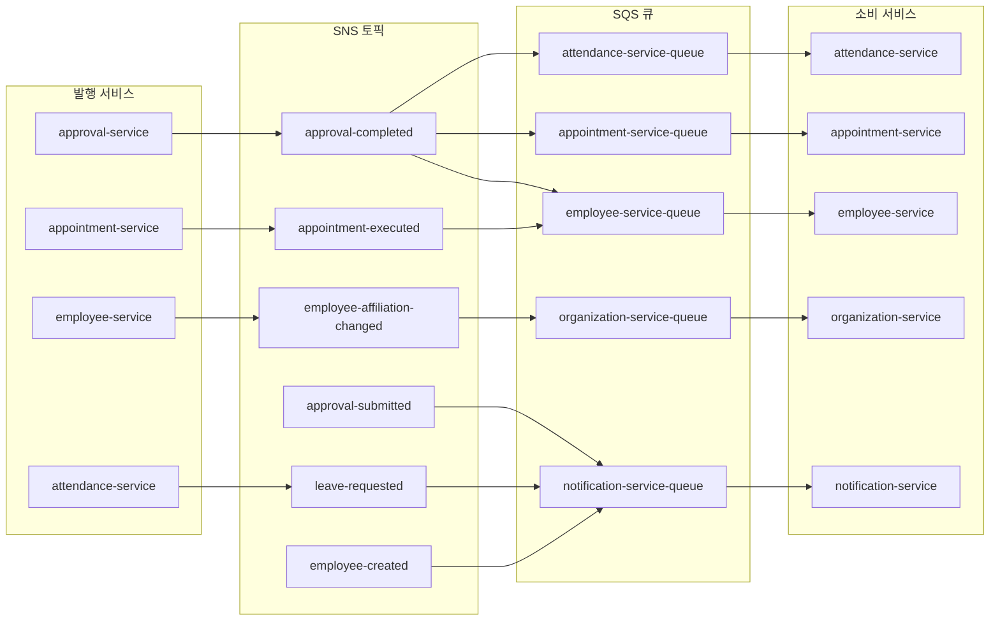

# 이벤트 기반 아키텍처 (SNS/SQS)

> **최종 업데이트**: 2026-02-09
> **대상**: 백엔드 개발자
> **소스 코드**: `common/common-event/`, `docker/localstack/init-aws.sh`

---

## 목차

- [1. 개요](#1-개요)
- [2. 아키텍처](#2-아키텍처)
- [3. 토픽 및 큐 구성](#3-토픽-및-큐-구성)
- [4. 이벤트 발행 (Publisher)](#4-이벤트-발행-publisher)
- [5. 이벤트 소비 (Consumer)](#5-이벤트-소비-consumer)
- [6. DomainEvent 기본 클래스](#6-domainevent-기본-클래스)
- [7. 이벤트 토픽 상수](#7-이벤트-토픽-상수)
- [8. Dead Letter Queue (DLQ)](#8-dead-letter-queue-dlq)
- [9. LocalStack 로컬 개발](#9-localstack-로컬-개발)
- [10. 에러 처리 및 재시도](#10-에러-처리-및-재시도)
- [11. 테넌트 컨텍스트 전파](#11-테넌트-컨텍스트-전파)
- [12. 관련 문서](#12-관련-문서)

---

## 1. 개요

서비스 간 비동기 통신에 AWS SNS(발행) + SQS(소비) 패턴을 사용합니다. Kafka에서 전환한 이유는 운영 복잡도 감소와 관리형 서비스의 이점 때문입니다.

### 핵심 패턴

```
서비스 A → SNS 토픽 → SQS 큐 → 서비스 B
                    → SQS 큐 → 서비스 C (팬아웃)
```

---

## 2. 아키텍처



---

## 3. 토픽 및 큐 구성

### SNS 토픽 (7개)

| 토픽 | 발행 서비스 | 설명 |
|------|-----------|------|
| `approval-completed` | approval-service | 결재 최종 완료 |
| `approval-submitted` | approval-service | 결재 상신 |
| `appointment-executed` | appointment-service | 발령 실행 |
| `employee-affiliation-changed` | employee-service | 직원 소속 변경 |
| `employee-created` | employee-service | 신규 직원 생성 |
| `leave-requested` | attendance-service | 휴가 신청 |
| `notification-send` | (다수) | 알림 발송 트리거 |

### SQS 큐 (5개)

| 큐 | 소비 서비스 | 구독 토픽 |
|----|-----------|---------|
| `attendance-service-queue` | attendance | approval-completed |
| `appointment-service-queue` | appointment | approval-completed |
| `employee-service-queue` | employee | approval-completed, appointment-executed |
| `organization-service-queue` | organization | employee-affiliation-changed |
| `notification-service-queue` | notification | approval-submitted, leave-requested, employee-created |

### SNS → SQS 구독 매핑

| 토픽 | → 큐 | 용도 |
|------|------|------|
| `approval-completed` | attendance-service-queue | 휴가 결재 완료 → 연차 차감 |
| `approval-completed` | appointment-service-queue | 발령 결재 완료 → 발령 실행 |
| `approval-completed` | employee-service-queue | 인사 변경 결재 완료 → 반영 |
| `appointment-executed` | employee-service-queue | 발령 실행 → 직원 정보 반영 |
| `employee-affiliation-changed` | organization-service-queue | 소속 변경 → 조직 현원 갱신 |
| `approval-submitted` | notification-service-queue | 결재 상신 알림 |
| `leave-requested` | notification-service-queue | 휴가 신청 알림 |
| `employee-created` | notification-service-queue | 신규 직원 알림 |

---

## 4. 이벤트 발행 (Publisher)

### SnsEventPublisher

```java
// common/common-event/SnsEventPublisher.java
@Service
public class SnsEventPublisher implements EventPublisher {

    private final SnsTemplate snsTemplate;

    @Override
    public void publish(DomainEvent event) {
        String topic = event.getTopic();
        String payload = JsonUtils.toJson(event);
        snsTemplate.sendNotification(topic, payload, null);
        // Fire-and-forget: 실패 시 로그만 기록
    }
}
```

### 사용 예시

```java
@Service
@RequiredArgsConstructor
public class ApprovalService {

    private final EventPublisher eventPublisher;

    @Transactional
    public void complete(UUID documentId) {
        // 비즈니스 로직...

        eventPublisher.publish(ApprovalCompletedEvent.builder()
            .documentId(documentId)
            .tenantId(TenantContext.getCurrentTenant())
            .actorId(SecurityContextHolder.getCurrentUserId())
            .build());
    }
}
```

---

## 5. 이벤트 소비 (Consumer)

### SQS 리스너

```java
@Service
@RequiredArgsConstructor
public class ApprovalCompletedListener {

    @SqsListener("attendance-service-queue")
    public void handleApprovalCompleted(String message) {
        DomainEvent event = JsonUtils.fromJson(message, DomainEvent.class);

        // 테넌트 컨텍스트 설정 (필수!)
        TenantContext.setCurrentTenant(event.getTenantId());
        try {
            // 비즈니스 로직 (예: 연차 차감)
            leaveService.confirmUsedDays(event.getDocumentId());
        } finally {
            TenantContext.clear();
        }
    }
}
```

---

## 6. DomainEvent 기본 클래스

```java
// common/common-event/DomainEvent.java
@SuperBuilder
public abstract class DomainEvent {
    private String eventId;        // UUID (자동 생성)
    private String eventType;      // 클래스명 (자동 설정)
    private Instant timestamp;     // 현재 시각 (자동 설정)
    private UUID tenantId;         // 테넌트 ID
    private UUID actorId;          // 실행자 ID
    private String correlationId;  // 상관 관계 ID (추적용)

    // 서브클래스가 SNS 토픽 이름을 정의
    public abstract String getTopic();
}
```

---

## 7. 이벤트 토픽 상수

```java
// common/common-event/EventTopics.java
public final class EventTopics {
    // 테넌트
    public static final String TENANT_CREATED = "tenant-created";
    public static final String TENANT_STATUS_CHANGED = "tenant-status-changed";

    // 직원
    public static final String EMPLOYEE_CREATED = "employee-created";
    public static final String EMPLOYEE_UPDATED = "employee-updated";
    public static final String EMPLOYEE_AFFILIATION_CHANGED = "employee-affiliation-changed";

    // 결재
    public static final String APPROVAL_SUBMITTED = "approval-submitted";
    public static final String APPROVAL_COMPLETED = "approval-completed";

    // 근태
    public static final String LEAVE_REQUESTED = "leave-requested";

    // 발령
    public static final String APPOINTMENT_EXECUTED = "appointment-executed";

    // 알림
    public static final String NOTIFICATION_SEND = "notification-send";
    // ... 기타
}
```

---

## 8. Dead Letter Queue (DLQ)

처리 실패한 메시지는 DLQ로 이동합니다:

| 원본 큐 | DLQ |
|---------|-----|
| `attendance-service-queue` | `attendance-service-dlq` |
| `appointment-service-queue` | `appointment-service-dlq` |
| `employee-service-queue` | `employee-service-dlq` |
| `organization-service-queue` | `organization-service-dlq` |
| `notification-service-queue` | `notification-service-dlq` |

### DLQ 모니터링

```bash
# DLQ 메시지 수 확인
awslocal sqs get-queue-attributes \
  --queue-url http://localhost:14566/000000000000/employee-service-dlq \
  --attribute-names ApproximateNumberOfMessages
```

---

## 9. LocalStack 로컬 개발

### 자동 초기화

`docker/localstack/init-aws.sh`가 컨테이너 시작 시 자동으로 토픽/큐/구독을 생성합니다.

### 수동 검증

```bash
# 토픽 목록
docker exec hr-saas-localstack awslocal sns list-topics

# 큐 목록
docker exec hr-saas-localstack awslocal sqs list-queues

# 수동 메시지 발행 (테스트)
docker exec hr-saas-localstack awslocal sns publish \
  --topic-arn arn:aws:sns:ap-northeast-2:000000000000:employee-created \
  --message '{"eventId":"test","eventType":"EmployeeCreated","tenantId":"..."}'
```

### 로컬 vs 프로덕션 전환

Spring 프로파일로 자동 전환:

```yaml
# application-dev.yml
spring.cloud.aws:
  sns.endpoint: http://localhost:14566
  sqs.endpoint: http://localhost:14566

# application-aws.yml (프로덕션)
spring.cloud.aws:
  region.static: ap-northeast-2
  # 엔드포인트 미설정 → AWS 기본 사용
```

---

## 10. 에러 처리 및 재시도

### 재시도 정책

| 항목 | 값 |
|------|------|
| 최대 재시도 | 3회 |
| 가시성 타임아웃 | 60초 |
| DLQ 이동 조건 | 3회 실패 |

### 멱등성

같은 이벤트가 여러 번 처리될 수 있으므로 소비자는 멱등성을 보장해야 합니다:

```java
// eventId 기반 중복 처리 방지
if (eventProcessingRepository.existsByEventId(event.getEventId())) {
    log.info("이벤트 이미 처리됨: {}", event.getEventId());
    return;
}
```

---

## 11. 테넌트 컨텍스트 전파

비동기 이벤트 처리 시 HTTP 요청 컨텍스트가 없으므로, 이벤트 메시지에 `tenantId`를 포함하여 소비자가 직접 설정해야 합니다:

```java
// 발행 시: tenantId 포함
DomainEvent event = SomeEvent.builder()
    .tenantId(TenantContext.getCurrentTenant())  // 현재 HTTP 요청의 tenantId
    .build();

// 소비 시: tenantId 복원
TenantContext.setCurrentTenant(event.getTenantId());
try {
    // DB 쿼리 시 RLS가 정상 작동
} finally {
    TenantContext.clear();
}
```

---

## 12. 관련 문서

| 문서 | 설명 |
|------|------|
| [MULTI_TENANCY.md](./MULTI_TENANCY.md) | 이벤트 소비 시 테넌트 컨텍스트 |
| [DOCKER_GUIDE.md](../operations/DOCKER_GUIDE.md) | LocalStack 설정 |
| [AWS_INFRASTRUCTURE.md](../operations/AWS_INFRASTRUCTURE.md) | 프로덕션 SNS/SQS |
