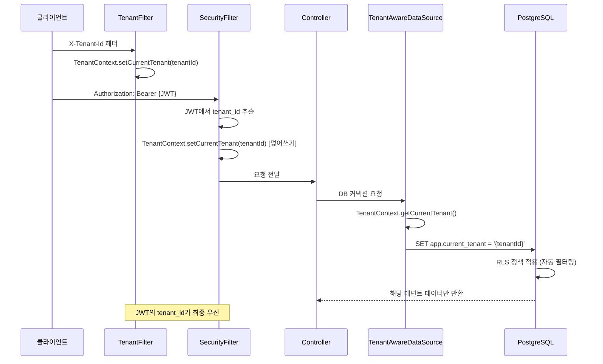
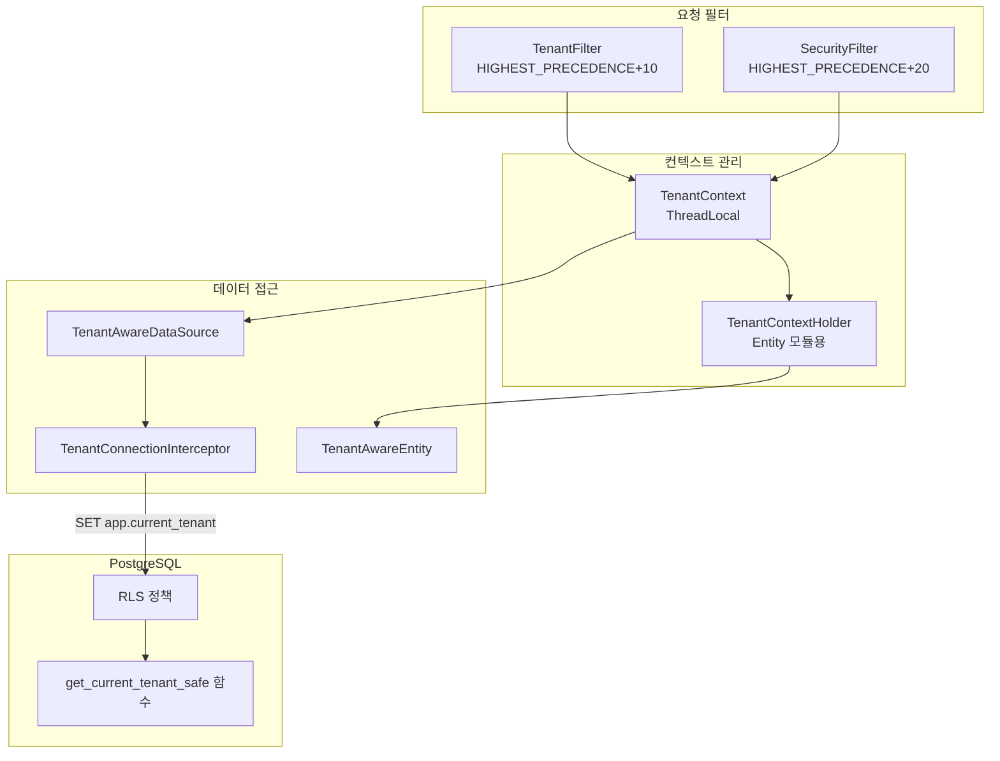

# 멀티테넌시 (PostgreSQL RLS) 구현 가이드

> **최종 업데이트**: 2026-02-09
> **대상**: 백엔드 개발자
> **소스 코드**: `common/common-tenant/`, `common/common-database/`, `common/common-entity/`

---

## 목차

- [1. 개요](#1-개요)
- [2. 아키텍처](#2-아키텍처)
- [3. TenantContext](#3-tenantcontext)
- [4. TenantFilter](#4-tenantfilter)
- [5. RLS (Row Level Security)](#5-rls-row-level-security)
- [6. TenantAwareDataSource](#6-tenantawaredatasource)
- [7. TenantAwareEntity](#7-tenantawareentity)
- [8. Flyway 마이그레이션 구조](#8-flyway-마이그레이션-구조)
- [9. 서비스별 RLS 적용 현황](#9-서비스별-rls-적용-현황)
- [10. 특수 케이스](#10-특수-케이스)
- [11. 캐시와 테넌트 격리](#11-캐시와-테넌트-격리)
- [12. 테스트 패턴](#12-테스트-패턴)
- [13. 새 테이블 추가 시 체크리스트](#13-새-테이블-추가-시-체크리스트)
- [14. 관련 문서](#14-관련-문서)

---

## 1. 개요

HR SaaS 플랫폼은 100개 이상의 테넌트(계열사)를 단일 데이터베이스에서 운영합니다. 데이터 격리를 위해 **PostgreSQL Row Level Security (RLS)**를 사용합니다.

### 멀티테넌시 전략 비교

| 전략 | 데이터 격리 | 운영 비용 | 스케일링 | 채택 |
|------|-----------|----------|---------|------|
| DB-per-tenant | 높음 | 높음 (DB x N) | 어려움 | ✗ |
| Schema-per-tenant | 중간 | 중간 | 보통 | ✗ |
| **RLS (행 레벨)** | **높음 (DB 레벨 강제)** | **낮음 (단일 DB)** | **쉬움** | **✓** |
| 앱 레벨 필터링 | 낮음 (실수 가능) | 낮음 | 쉬움 | ✗ |

### 핵심 원칙

1. **DB 레벨 격리**: 애플리케이션 코드 실수와 관계없이 PostgreSQL이 테넌트 데이터를 격리
2. **투명한 필터링**: 개발자가 WHERE 절에 `tenant_id` 조건을 수동 추가할 필요 없음
3. **자동 컨텍스트 전파**: JWT → TenantContext → DB 세션까지 자동 전파

---

## 2. 아키텍처

### 요청 처리 흐름



### 컴포넌트 관계



---

## 3. TenantContext

**소스**: `common/common-tenant/src/.../TenantContext.java`

ThreadLocal 기반 테넌트 컨텍스트 저장소입니다.

### 주요 API

```java
// 테넌트 ID 설정 및 조회
TenantContext.setCurrentTenant(UUID tenantId);
UUID tenantId = TenantContext.getCurrentTenant();

// 테넌트 코드/이름
TenantContext.setTenantCode("TECH");
TenantContext.setTenantName("HR테크");

// 전체 테넌트 정보
TenantContext.setTenantInfo(TenantInfo.builder()
    .tenantId(tenantId)
    .tenantCode("TECH")
    .tenantName("HR테크")
    .active(true)
    .build());

// 테넌트 설정 여부 확인
boolean hasTenant = TenantContext.hasTenant();

// 정리 (필수 - finally 블록에서 호출)
TenantContext.clear();
```

### @RequireTenant 어노테이션

테넌트 컨텍스트가 필수인 메서드/클래스에 적용합니다:

```java
@RequireTenant
@GetMapping("/api/v1/employees")
public ResponseEntity<ApiResponse<List<EmployeeResponse>>> list() {
    // TenantContext가 설정되지 않으면 ForbiddenException("TNT_003") 발생
}
```

---

## 4. TenantFilter

**소스**: `common/common-tenant/src/.../TenantFilter.java`

### 동작

1. HTTP 요청의 `X-Tenant-Id` 헤더에서 테넌트 ID 추출
2. UUID로 파싱하여 `TenantContext`에 설정
3. 요청 처리 완료 후 `TenantContext.clear()` 호출

### 실행 순서

| 필터 | 우선순위 | 동작 |
|------|---------|------|
| `TenantFilter` | HIGHEST_PRECEDENCE + 10 | X-Tenant-Id 헤더에서 설정 |
| `SecurityFilter` | HIGHEST_PRECEDENCE + 20 | JWT의 tenant_id로 **덮어쓰기** |

> **JWT의 tenant_id가 최종 우선**: SecurityFilter가 나중에 실행되므로 JWT에 포함된 tenant_id가 최종 사용됩니다. X-Tenant-Id 헤더는 JWT 없이 테넌트 전환이 필요한 경우에 사용됩니다.

---

## 5. RLS (Row Level Security)

### PostgreSQL RLS 기본 개념

RLS는 행(row) 수준에서 접근 제어를 적용하는 PostgreSQL 기능입니다. 테이블에 RLS를 활성화하면, 모든 쿼리에 자동으로 필터 조건이 추가됩니다.

### 핵심 함수

```sql
-- 현재 세션의 tenant_id를 안전하게 조회 (설정 없으면 NULL 반환)
CREATE OR REPLACE FUNCTION get_current_tenant_safe()
RETURNS UUID AS $$
BEGIN
  RETURN NULLIF(current_setting('app.current_tenant', true), '')::uuid;
EXCEPTION WHEN OTHERS THEN
  RETURN NULL;
END;
$$ LANGUAGE plpgsql STABLE;
```

### 테넌트 컨텍스트 설정 함수

```sql
-- 테넌트 컨텍스트 설정 (TenantConnectionInterceptor가 호출)
CREATE OR REPLACE FUNCTION set_tenant_context(tenant_uuid UUID)
RETURNS VOID AS $$
BEGIN
    PERFORM set_config('app.current_tenant', tenant_uuid::TEXT, false);
END;
$$ LANGUAGE plpgsql;
```

### 표준 RLS 정책 템플릿

```sql
-- 1. RLS 활성화
ALTER TABLE {schema}.{table} ENABLE ROW LEVEL SECURITY;

-- 2. 슈퍼유저 강제 적용 (선택적)
ALTER TABLE {schema}.{table} FORCE ROW LEVEL SECURITY;

-- 3. 테넌트 격리 정책 생성
CREATE POLICY tenant_isolation ON {schema}.{table}
    FOR ALL
    TO PUBLIC
    USING (tenant_id = get_current_tenant_safe());
```

### RLS가 적용되는 SQL 동작

| SQL 명령 | 영향 |
|---------|------|
| `SELECT` | 해당 테넌트 데이터만 반환 |
| `INSERT` | tenant_id 자동 체크 (불일치 시 실패) |
| `UPDATE` | 해당 테넌트 데이터만 수정 가능 |
| `DELETE` | 해당 테넌트 데이터만 삭제 가능 |

---

## 6. TenantAwareDataSource

**소스**: `common/common-database/src/.../TenantAwareDataSource.java`, `TenantConnectionInterceptor.java`

### 동작 메커니즘

1. `TenantAwareDataSource`가 `DataSource`를 래핑
2. `getConnection()` 호출 시 JDK Dynamic Proxy로 커넥션 래핑
3. `prepareStatement()` 또는 `createStatement()` 호출 시 테넌트 컨텍스트 설정
4. `close()` 시 컨텍스트 정리

### SQL 실행 흐름

```
[서비스] → getConnection()
  → [TenantAwareDataSource] → 원본 커넥션 획득 + Proxy 래핑
    → [prepareStatement("SELECT * FROM employees")]
      → [TenantConnectionInterceptor]
        → "SET app.current_tenant = '{tenantId}'"  (한 번만 실행)
        → 원본 prepareStatement 호출
    → [close()]
      → "RESET app.current_tenant"
      → 원본 close 호출
```

### 핵심 코드 (간략화)

```java
// TenantConnectionInterceptor.java
public class TenantConnectionInterceptor implements InvocationHandler {
    private boolean tenantSet = false;

    @Override
    public Object invoke(Object proxy, Method method, Object[] args) {
        if (isPrepareOrCreate(method) && !tenantSet) {
            setTenantContext();  // SET app.current_tenant = '{tenantId}'
            tenantSet = true;
        }
        if ("close".equals(method.getName())) {
            clearTenantContext();  // RESET app.current_tenant
        }
        return method.invoke(connection, args);
    }
}
```

---

## 7. TenantAwareEntity

**소스**: `common/common-entity/src/.../TenantAwareEntity.java`

### 엔티티 상속 구조

```
BaseEntity (UUID id)
  └── AuditableEntity (createdAt, updatedAt, createdBy, updatedBy)
        └── TenantAwareEntity (tenantId)
              └── SoftDeleteEntity (deletedAt, deletedBy)
```

### TenantAwareEntity

```java
@MappedSuperclass
public abstract class TenantAwareEntity extends AuditableEntity {

    @Column(name = "tenant_id", nullable = false, updatable = false)
    private UUID tenantId;

    @PrePersist
    protected void prePersist() {
        if (this.tenantId == null) {
            this.tenantId = TenantContextHolder.getCurrentTenant();
        }
        if (this.tenantId == null) {
            throw new IllegalStateException("Tenant ID is required");
        }
    }
}
```

### 사용 방법

```java
// 테넌트 데이터가 있는 엔티티는 TenantAwareEntity를 상속
@Entity
@Table(name = "employees", schema = "hr_core")
public class Employee extends TenantAwareEntity {
    private String name;
    private String email;
    // tenant_id는 자동 설정됨
}
```

---

## 8. Flyway 마이그레이션 구조

각 서비스의 `src/main/resources/db/migration/` 디렉토리에 4단계 마이그레이션을 관리합니다:

| 파일 | 단계 | 내용 |
|------|------|------|
| `V1__create_schema.sql` | 스키마 생성 | `CREATE SCHEMA IF NOT EXISTS ...` |
| `V2__create_{entity}_tables.sql` | 테이블 생성 | 테이블, 인덱스, 제약조건 |
| `V3__enable_rls.sql` | RLS 활성화 | `ALTER TABLE ... ENABLE ROW LEVEL SECURITY` |
| `V4__create_rls_policies.sql` | RLS 정책 | `CREATE POLICY tenant_isolation ...` |

### Flyway 설정

```java
// FlywayConfig.java
@Configuration
@ConditionalOnProperty(name = "spring.flyway.enabled", havingValue = "true")
public class FlywayConfig {
    // baselineOnMigrate: true  → 기존 스키마에 Flyway 적용
    // validateOnMigrate: false → 멀티 서비스 스키마 호환
    // outOfOrder: true         → 순서 무관 마이그레이션 허용
}
```

### 마이그레이션 명령

```bash
# 마이그레이션 상태 확인
./gradlew :services:employee-service:flywayInfo

# 마이그레이션 실행
./gradlew :services:employee-service:flywayMigrate

# 베이스라인 설정 (기존 DB)
./gradlew :services:employee-service:flywayBaseline
```

---

## 9. 서비스별 RLS 적용 현황

### RLS 적용 서비스

| 서비스 | 스키마 | RLS 적용 테이블 | Flyway |
|--------|--------|---------------|--------|
| tenant-service | tenant_common | tenant_policy, tenant_feature | V1-V4 |
| organization-service | hr_core | department, position, grade, committee, announcement, headcount | V1-V4 |
| employee-service | hr_core | employee, employee_history, employee_family, employee_education, employee_career, employee_certificate, employee_affiliation, employee_number_rule, employee_change_request, condolence_policy, condolence_request | V1-V4 |
| attendance-service | hr_attendance | attendance, leave_request, overtime, holiday, work_schedule | V1-V4 |
| approval-service | hr_approval | approval_document, approval_template, delegation_rule, arbitrary_approval_rule, conditional_route | V1-V4 |
| mdm-service | hr_core | code_group, common_code, tenant_code, menu | V1-V4 |
| notification-service | hr_notification | notification, notification_template | V1-V4 |
| file-service | hr_file | file_metadata | V1-V4 |
| appointment-service | hr_appointment | appointment_draft, appointment_item, appointment_history | V1-V4 |
| certificate-service | hr_certificate | certificate, certificate_type, certificate_template | V1-V4 |
| recruitment-service | hr_recruitment | job_posting, application, interview, interview_score, offer | V1-V4 |

### RLS 미적용 서비스/테이블

| 서비스/테이블 | 사유 |
|-------------|------|
| auth-service (users, user_sessions 등) | 인증 시점에 tenant_id 미확정 |
| tenant 테이블 자체 | SUPER_ADMIN만 접근, 서비스 레벨 필터링 |
| gateway-service | 라우팅만 수행, DB 미사용 |

---

## 10. 특수 케이스

### 10.1 다중 테넌트 접근 (계열사 간 이동)

`transfer_request` 테이블은 출발/도착 테넌트 모두 조회해야 합니다:

```sql
CREATE POLICY tenant_isolation ON hr_core.transfer_request
    FOR ALL
    TO PUBLIC
    USING (
        tenant_id = get_current_tenant_safe()
        OR source_tenant_id = get_current_tenant_safe()
        OR target_tenant_id = get_current_tenant_safe()
    );
```

### 10.2 SUPER_ADMIN 전체 접근

SUPER_ADMIN은 RLS를 우회하여 전체 테넌트 데이터에 접근해야 합니다. 이는 **TenantContext를 설정하지 않음**으로써 처리됩니다:

```
TenantContext.getCurrentTenant() = null
→ get_current_tenant_safe() = NULL
→ tenant_id = NULL → 모든 행 필터링됨 (의도치 않은 동작!)
```

> **현재 구현**: SUPER_ADMIN도 특정 테넌트를 선택하여 접근합니다. 전체 테넌트 집계가 필요한 경우 별도 관리자 쿼리를 사용합니다.

### 10.3 비동기 이벤트 처리

SNS/SQS 이벤트 소비 시 TenantContext가 설정되지 않을 수 있습니다. 이벤트 메시지에 `tenantId`를 포함하고 소비자가 설정해야 합니다:

```java
@SqsListener("employee-service-queue")
public void handleEvent(DomainEvent event) {
    TenantContext.setCurrentTenant(event.getTenantId());
    try {
        // 비즈니스 로직
    } finally {
        TenantContext.clear();
    }
}
```

---

## 11. 캐시와 테넌트 격리

Redis 캐시에서도 테넌트 격리를 보장해야 합니다. `CacheKeyGenerator`가 자동으로 테넌트 ID를 포함합니다:

```
캐시 키 형식: {prefix}:{tenantId}:{key}

예시:
- employee:550e8400-e29b-41d4-a716-446655440000:emp-001
- tenant:550e8400-e29b-41d4-a716-446655440000:policy
```

> 상세 내용은 [CACHING_STRATEGY.md](./CACHING_STRATEGY.md) 참조

---

## 12. 테스트 패턴

### 단위 테스트

```java
@Test
void findAll_shouldReturnOnlyCurrentTenantData() {
    UUID tenantA = UUID.randomUUID();
    UUID tenantB = UUID.randomUUID();

    // 테넌트 A 데이터 생성
    TenantContext.setCurrentTenant(tenantA);
    repository.save(createEmployee("직원A"));

    // 테넌트 B 데이터 생성
    TenantContext.setCurrentTenant(tenantB);
    repository.save(createEmployee("직원B"));

    // 테넌트 A로 조회 → 직원A만 반환
    TenantContext.setCurrentTenant(tenantA);
    List<Employee> result = repository.findAll();
    assertThat(result).hasSize(1);
    assertThat(result.get(0).getName()).isEqualTo("직원A");
}
```

### 통합 테스트 (Testcontainers)

```java
@SpringBootTest
@Testcontainers
class EmployeeRlsTest {

    @Container
    static PostgreSQLContainer<?> postgres = new PostgreSQLContainer<>("postgres:15-alpine")
        .withInitScript("db/init.sql");

    @Test
    void rls_shouldIsolateTenantData() {
        // RLS 정책이 적용된 실제 PostgreSQL에서 테스트
    }
}
```

---

## 13. 새 테이블 추가 시 체크리스트

새 테넌트 데이터 테이블을 추가할 때:

- [ ] `tenant_id UUID NOT NULL` 컬럼 포함
- [ ] `tenant_id`에 인덱스 생성
- [ ] Entity가 `TenantAwareEntity` 상속
- [ ] Flyway V3에 `ALTER TABLE ... ENABLE ROW LEVEL SECURITY` 추가
- [ ] Flyway V4에 `CREATE POLICY tenant_isolation ...` 추가
- [ ] 통합 테스트에서 RLS 격리 검증
- [ ] 캐시 키에 테넌트 ID 포함 (Redis 사용 시)

---

## 14. 관련 문서

| 문서 | 설명 |
|------|------|
| [SECURITY_PATTERNS.md](./SECURITY_PATTERNS.md) | JWT 인증, 권한 체계 |
| [CACHING_STRATEGY.md](./CACHING_STRATEGY.md) | Redis 캐시 테넌트 격리 |
| [DATABASE_PATTERNS.md](./DATABASE_PATTERNS.md) | HikariCP, Flyway 설정 |
| [DOCKER_GUIDE.md](../operations/DOCKER_GUIDE.md) | PostgreSQL 로컬 설정 |
| [docs/modules/02-TENANT-SERVICE.md](../modules/02-TENANT-SERVICE.md) | Tenant 서비스 상세 |
