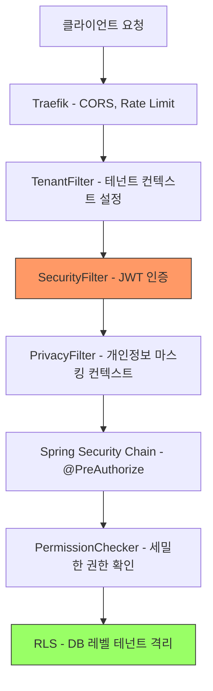
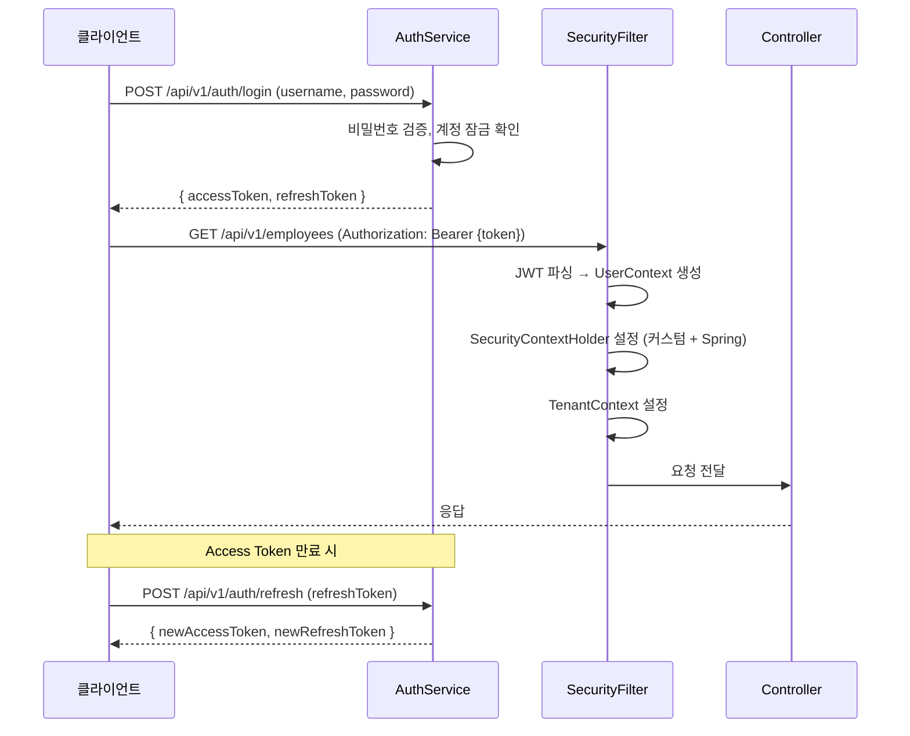
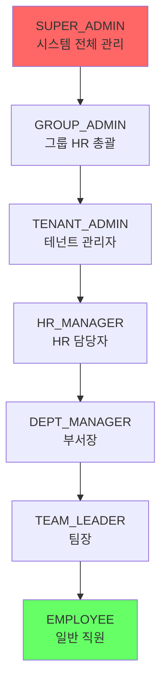

# 보안 패턴 통합 가이드

> **최종 업데이트**: 2026-02-09
> **대상**: 백엔드 개발자, 보안 엔지니어
> **소스 코드**: `common/common-security/`, `common/common-privacy/`

---

## 목차

- [1. 개요](#1-개요)
- [2. 인증 흐름 (JWT)](#2-인증-흐름-jwt)
- [3. SecurityFilter](#3-securityfilter)
- [4. SecurityConfig 템플릿](#4-securityconfig-템플릿)
- [5. SecurityFilter 이중 등록 문제 (403 수정)](#5-securityfilter-이중-등록-문제-403-수정)
- [6. 권한 체계 (RBAC)](#6-권한-체계-rbac)
- [7. PermissionChecker](#7-permissionchecker)
- [8. 세션 관리](#8-세션-관리)
- [9. 개인정보 보호 (Privacy)](#9-개인정보-보호-privacy)
- [10. CORS 설정](#10-cors-설정)
- [11. 레이트 리밋](#11-레이트-리밋)
- [12. 계정 보안](#12-계정-보안)
- [13. 새 서비스 추가 시 체크리스트](#13-새-서비스-추가-시-체크리스트)
- [14. 관련 문서](#14-관련-문서)

---

## 1. 개요

HR SaaS 플랫폼의 보안은 다음 계층으로 구성됩니다:



### 필터 실행 순서

| 순서 | 필터 | Priority | 역할 |
|------|------|----------|------|
| 1 | `TenantFilter` | HIGHEST_PRECEDENCE + 10 | X-Tenant-Id 헤더에서 테넌트 ID 추출 |
| 2 | `SecurityFilter` | HIGHEST_PRECEDENCE + 20 | JWT 토큰 검증, 사용자 컨텍스트 설정 |
| 3 | `PrivacyFilter` | 100 | 역할 기반 마스킹 컨텍스트 설정 |
| 4 | Spring Security 체인 | - | 인가 처리 (`@PreAuthorize`) |

---

## 2. 인증 흐름 (JWT)

### 토큰 구조

`JwtTokenProvider` (`common/common-security/`)가 JWT 토큰을 생성하고 검증합니다.

| 항목 | 값 |
|------|------|
| 알고리즘 | HMAC-SHA256 (HS256) |
| 시크릿 키 | 최소 256비트 (`${jwt.secret}`) |
| Access Token 만료 | 30분 (기본, `${jwt.access-token-expiry:1800}`) |
| Refresh Token 만료 | 7일 (기본, `${jwt.refresh-token-expiry:604800}`) |

### Access Token Claims

```json
{
  "sub": "userId (UUID)",
  "tenant_id": "테넌트 UUID",
  "employee_id": "직원 UUID",
  "department_id": "부서 UUID",
  "preferred_username": "사용자명",
  "email": "이메일",
  "employee_name": "직원명",
  "department_name": "부서명",
  "roles": ["ROLE_HR_ADMIN", "ROLE_EMPLOYEE"],
  "permissions": ["employee:read", "employee:write"],
  "token_type": "access",
  "iat": 1707000000,
  "exp": 1707001800
}
```

### 인증 시퀀스 다이어그램



---

## 3. SecurityFilter

### 핵심 동작

`SecurityFilter`는 모든 HTTP 요청에서 JWT 토큰을 검증하고 사용자 컨텍스트를 설정합니다.

**소스**: `common/common-security/src/.../SecurityFilter.java`

```java
// SecurityFilter 핵심 로직 (간략화)
public class SecurityFilter extends OncePerRequestFilter {

    @Override
    protected void doFilterInternal(HttpServletRequest request, ...) {
        try {
            String token = extractToken(request);  // Authorization: Bearer {token}
            if (token != null) {
                UserContext context = jwtTokenProvider.parseToken(token);

                // 1. 커스텀 SecurityContextHolder 설정 (애플리케이션 로직용)
                com.hrsaas.common.security.SecurityContextHolder.setContext(context);

                // 2. Spring Security SecurityContextHolder 설정 (프레임워크 통합용)
                var authentication = new UsernamePasswordAuthenticationToken(
                    context, null, authorities
                );
                org.springframework.security.core.context.SecurityContextHolder
                    .getContext().setAuthentication(authentication);

                // 3. TenantContext 설정 (RLS용)
                TenantContext.setCurrentTenant(context.getTenantId());
            }
            filterChain.doFilter(request, response);
        } finally {
            // 반드시 컨텍스트 정리 (메모리 누수 방지)
            com.hrsaas.common.security.SecurityContextHolder.clear();
            org.springframework.security.core.context.SecurityContextHolder.clearContext();
            TenantContext.clear();
        }
    }
}
```

### 제외 경로

다음 경로는 JWT 인증을 건너뜁니다:
- `/actuator/**` (헬스체크/메트릭)
- `/health` (헬스체크)
- `/favicon.ico`

### Dual SecurityContextHolder 패턴

이 프로젝트는 **두 개의 SecurityContextHolder**를 사용합니다:

| 컨텍스트 홀더 | 패키지 | 용도 |
|-------------|--------|------|
| `com.hrsaas.common.security.SecurityContextHolder` | 커스텀 | 애플리케이션 로직 (`getCurrentUser()`, `hasRole()`) |
| `org.springframework.security.core.context.SecurityContextHolder` | Spring Security | 프레임워크 통합 (`@PreAuthorize`, `@Secured`) |

> **중요**: `SecurityFilter`에서 **양쪽 모두** 설정해야 합니다. Spring Security 측만 설정하면 커스텀 컨텍스트가 비어 있고, 커스텀만 설정하면 Spring Security 인가가 실패합니다.

---

## 4. SecurityConfig 템플릿

모든 서비스의 `SecurityConfig`는 동일한 패턴을 따릅니다.

### 표준 템플릿

```java
@Configuration
@EnableWebSecurity
@EnableMethodSecurity
@RequiredArgsConstructor
public class SecurityConfig {

    private final SecurityFilter securityFilter;

    @Bean
    public SecurityFilterChain filterChain(HttpSecurity http) throws Exception {
        http
            .csrf(csrf -> csrf.disable())  // JWT 기반 → CSRF 불필요
            .sessionManagement(session ->
                session.sessionCreationPolicy(SessionCreationPolicy.STATELESS))
            .authorizeHttpRequests(auth -> auth
                .requestMatchers("/actuator/**").permitAll()
                .requestMatchers("/swagger-ui/**").permitAll()
                .requestMatchers("/v3/api-docs/**").permitAll()
                .anyRequest().authenticated()
            )
            .addFilterBefore(securityFilter,
                UsernamePasswordAuthenticationFilter.class);

        return http.build();
    }

    // ⚠️ 필수: SecurityFilter 서블릿 자동 등록 차단
    @Bean
    public FilterRegistrationBean<SecurityFilter> securityFilterRegistration(
            SecurityFilter securityFilter) {
        FilterRegistrationBean<SecurityFilter> registration =
            new FilterRegistrationBean<>(securityFilter);
        registration.setEnabled(false);
        return registration;
    }
}
```

### 서비스별 차이점

대부분의 서비스는 위 템플릿을 그대로 사용합니다. 차이가 있는 경우:

| 서비스 | 추가 설정 | 설명 |
|--------|----------|------|
| auth-service | 로그인 엔드포인트 `permitAll()` | `/api/v1/auth/login`, `/api/v1/auth/refresh` |
| file-service | 파일 다운로드 인증 완화 | 일부 공개 파일 접근 허용 |

---

## 5. SecurityFilter 이중 등록 문제 (403 수정)

### 증상

JWT 토큰이 유효하고 로그에 `JWT authenticated: userId=...`가 출력되지만, 인증된 엔드포인트에서 **403 Forbidden** 응답이 반환됩니다.

### 원인

`SecurityFilter`가 `@Component`이므로 Spring Boot가 **두 곳**에서 등록합니다:

1. **서블릿 필터**로 자동 등록 (Spring Security 체인 **밖**에서 먼저 실행)
2. `SecurityConfig`의 `.addFilterBefore()`로 체인 **안**에도 등록

### 실행 순서 (문제 발생 시)

```
1. SecurityFilter (서블릿 필터) → SecurityContext 설정 ✓
2. SecurityContextHolderFilter (체인 3/13) → SecurityContextRepository에서 로드
   → 비어 있으므로 컨텍스트 초기화! ✗
3. SecurityFilter (체인 7/13) → OncePerRequestFilter라 스킵 ✗
4. AnonymousAuthenticationFilter → Anonymous 인증 설정
5. AuthorizationFilter → 403 반환 ✗
```

### 해결 방법 (2가지 모두 필요)

**1. SecurityFilter에서 Spring SecurityContextHolder도 설정**:

```java
// SecurityFilter.java의 doFilterInternal()
var authentication = new UsernamePasswordAuthenticationToken(
    context, null, authorities
);
org.springframework.security.core.context.SecurityContextHolder
    .getContext().setAuthentication(authentication);
```

**2. 각 서비스 SecurityConfig에서 서블릿 자동 등록 차단**:

```java
@Bean
public FilterRegistrationBean<SecurityFilter> securityFilterRegistration(
        SecurityFilter securityFilter) {
    FilterRegistrationBean<SecurityFilter> registration =
        new FilterRegistrationBean<>(securityFilter);
    registration.setEnabled(false);  // 서블릿 필터 자동 등록 방지
    return registration;
}
```

> **새 서비스 추가 시**: 반드시 `SecurityConfig`에 `FilterRegistrationBean`을 추가해야 합니다. 누락하면 동일한 403 문제가 발생합니다.

---

## 6. 권한 체계 (RBAC)

### 역할 계층



> 상위 역할은 하위 역할의 모든 권한을 자동으로 상속합니다 (`RoleHierarchyConfig`).

### 권한 매핑

| 역할 | 주요 권한 | 범위 |
|------|----------|------|
| SUPER_ADMIN | `*:*` (모든 권한) | 전체 테넌트 |
| GROUP_ADMIN | `tenant:*`, `organization:*`, `employee:*`, `audit:read` | 전체 테넌트 |
| TENANT_ADMIN | `organization:*`, `employee:*`, `attendance:*`, `recruitment:*` | 단일 테넌트 |
| HR_MANAGER | `employee:*`, `attendance:*`, `recruitment:*` | 단일 테넌트 |
| DEPT_MANAGER | `employee:read:department`, `attendance:approve:department` | 소속 부서 |
| TEAM_LEADER | `employee:read:team`, `attendance:approve:team` | 소속 팀 |
| EMPLOYEE | `employee:read:self`, `attendance:request`, `approval:request` | 본인 |

### 권한 문자열 형식

```
{resource}:{action}:{scope}
```

- `resource`: 대상 리소스 (employee, attendance, approval 등)
- `action`: 동작 (read, write, delete, approve, admin)
- `scope`: 범위 (self, team, department, 생략 시 전체)

### 와일드카드 매칭

`PermissionMappingService`는 와일드카드 권한 매칭을 지원합니다:

| 보유 권한 | 요청 권한 | 결과 |
|----------|----------|------|
| `*:*` | `employee:read` | 허용 |
| `employee:*` | `employee:read` | 허용 |
| `employee:read` | `employee:read:department` | 허용 (상위 범위) |
| `employee:read:team` | `employee:read:department` | 거부 (하위 범위) |

---

## 7. PermissionChecker

`@PreAuthorize` 어노테이션과 함께 SpEL(Spring Expression Language)에서 사용하는 빈입니다.

### 사용 예시

```java
// 역할 기반 접근 제어
@PreAuthorize("hasAnyRole('HR_ADMIN', 'TENANT_ADMIN', 'SUPER_ADMIN')")
public ResponseEntity<ApiResponse<EmployeeResponse>> create(...) { }

// 동적 권한 체크 (본인 데이터 접근)
@PreAuthorize("@permissionChecker.canAccessEmployee(#employeeId)")
public ResponseEntity<ApiResponse<EmployeeResponse>> getById(
    @PathVariable UUID employeeId) { }

// 권한 문자열 체크
@PreAuthorize("@permissionChecker.hasPermission('recruitment:write')")
public ResponseEntity<ApiResponse<JobPostingResponse>> createJobPosting(...) { }
```

### 범위 기반 접근 제어

`canAccessEmployee(UUID employeeId)` 메서드의 동작:

```
SUPER_ADMIN/GROUP_ADMIN → 전체 직원 접근 가능
TENANT_ADMIN/HR_MANAGER → 같은 테넌트 직원 접근 가능
DEPT_MANAGER → 같은 부서 직원 접근 가능
TEAM_LEADER → 같은 팀 직원 접근 가능
EMPLOYEE → 본인만 접근 가능
```

### 헬퍼 메서드

```java
// 역할 확인
permissionChecker.isSuperAdmin()
permissionChecker.isGroupAdmin()
permissionChecker.isTenantAdmin()
permissionChecker.isHrManager()
permissionChecker.isDeptManager()
permissionChecker.isTeamLeader()

// 조직 확인 (Feign 호출)
permissionChecker.isSameDepartment(UUID departmentId)
permissionChecker.isSameTeam(UUID teamId)

// 특수 권한
permissionChecker.canModifyEmployee(UUID employeeId)
permissionChecker.canApproveAttendance(UUID attendanceId)
```

---

## 8. 세션 관리

### Redis 기반 세션

| 항목 | 값 |
|------|------|
| 최대 동시 세션 | 5개/사용자 |
| 세션 TTL | 24시간 |
| 초과 시 | 가장 오래된 세션 자동 종료 |

### 토큰 블랙리스트

로그아웃 또는 토큰 폐기 시 Redis에 블랙리스트 등록:

| Redis 키 | TTL | 설명 |
|----------|-----|------|
| `token:blacklist:{tokenHash}` | Access Token 남은 만료 시간 | 로그아웃된 토큰 |
| `token:refresh:{userId}` | 7일 | 리프레시 토큰 |
| `session:{accessToken}` | 24시간 | 활성 세션 |

---

## 9. 개인정보 보호 (Privacy)

### 마스킹 시스템

`PrivacyFilter`가 요청자의 역할에 따라 `PrivacyContext`를 설정하고, `@Masked` 어노테이션이 적용된 필드가 응답 시 자동 마스킹됩니다.

#### 마스킹 규칙

| 조건 | 마스킹 적용 |
|------|-----------|
| SUPER_ADMIN, TENANT_ADMIN, HR_ADMIN | 미적용 (원본 반환) |
| 본인 데이터 조회 | 미적용 (원본 반환) |
| 그 외 | 적용 |

#### 마스킹 유형

| 유형 | 입력 | 출력 |
|------|------|------|
| `NAME` | 홍길동 | 홍\*동 |
| `EMAIL` | user@example.com | us\*\*\*@example.com |
| `PHONE` | 010-1234-5678 | 010-\*\*\*\*-5678 |
| `RESIDENT_NUMBER` | 900101-1234567 | 900101-\*\*\*\*\*\*\* |
| `ACCOUNT_NUMBER` | 123-456-789012 | 123-\*\*\*-\*\*\*012 |
| `ADDRESS` | 서울시 강남구 삼성동 123-45 | 서울시 강남구 \*\*\* |
| `CARD_NUMBER` | 1234-5678-9012-3456 | 1234-\*\*\*\*-\*\*\*\*-3456 |

#### 사용 방법

```java
// DTO 필드에 어노테이션 적용
@Masked(type = MaskType.PHONE)
@JsonSerialize(using = MaskedFieldSerializer.class)
private String phone;

@Masked(type = MaskType.RESIDENT_NUMBER)
@JsonSerialize(using = MaskedFieldSerializer.class)
private String residentNumber;
```

### 암호화 (AES-GCM)

민감 데이터(주민등록번호 등)는 DB 저장 시 AES-GCM으로 암호화합니다.

| 항목 | 값 |
|------|------|
| 알고리즘 | AES/GCM/NoPadding |
| 키 크기 | 256비트 |
| IV | 12바이트 (랜덤) |
| 태그 | 128비트 (무결성 검증) |

```java
// EncryptionService 사용
@Autowired
private EncryptionService encryptionService;

String encrypted = encryptionService.encrypt(plaintext);  // Base64(IV + ciphertext)
String decrypted = encryptionService.decrypt(encrypted);
```

> **주의**: `${app.encryption.key}`는 Base64로 인코딩된 256비트 키여야 합니다. 프로덕션에서는 AWS Secrets Manager에서 관리합니다.

---

## 10. CORS 설정

### 개발 환경 (Traefik)

`docker/traefik/dynamic/middlewares.yml`에서 CORS를 설정합니다:

```yaml
http:
  middlewares:
    cors-headers:
      headers:
        accessControlAllowOriginList: ["*"]  # 개발 환경만!
        accessControlAllowMethods: [GET, POST, PUT, DELETE, PATCH, OPTIONS]
        accessControlAllowHeaders: [Authorization, Content-Type, X-Tenant-ID, X-Request-ID]
        accessControlExposeHeaders: [X-Request-ID, X-Correlation-ID]
        accessControlAllowCredentials: true
        accessControlMaxAge: 3600
```

### 프로덕션 환경

프로덕션에서는 `*` 대신 명시적 Origin을 지정해야 합니다:

```yaml
accessControlAllowOriginList:
  - "https://hr.example.com"
  - "https://admin.hr.example.com"
```

---

## 11. 레이트 리밋

Traefik 미들웨어에서 레이트 리밋을 적용합니다:

| 대상 | 평균 (req/s) | 버스트 | 적용 서비스 |
|------|-------------|-------|-----------|
| 일반 API | 100 | 200 | 전체 서비스 (auth 제외) |
| 인증 API | 10 | 20 | auth-service만 |

> 인증 API에 더 낮은 한도를 적용하여 브루트포스 공격을 방지합니다.

---

## 12. 계정 보안

### 로그인 실패 잠금

| 항목 | 값 |
|------|------|
| 최대 실패 횟수 | 5회 |
| 잠금 시간 | 30분 |
| 잠금 해제 | 자동 (시간 경과) 또는 관리자 수동 해제 |

### 비밀번호 정책

- 최소 8자, 영문 대소문자 + 숫자 + 특수문자 조합
- 비밀번호 이력 관리 (최근 N개 재사용 불가)
- 만료 기간 설정 가능 (테넌트별 정책)

> 상세 비밀번호 정책은 `docs/modules/01-AUTH-SERVICE.md` 참조

---

## 13. 새 서비스 추가 시 체크리스트

새로운 마이크로서비스를 추가할 때 보안 관련 필수 항목:

- [ ] `common-security` 의존성 추가 (`build.gradle`)
- [ ] `SecurityConfig` 클래스 생성 (표준 템플릿 사용)
- [ ] **`FilterRegistrationBean` 빈 추가** (403 방지, 필수!)
- [ ] `@EnableMethodSecurity` 활성화
- [ ] 컨트롤러에 `@PreAuthorize` 적용
- [ ] `common-privacy` 의존성 추가 (개인정보 포함 시)
- [ ] DTO에 `@Masked` 어노테이션 적용 (민감 필드)
- [ ] `common-tenant` 의존성 추가 (테넌트 데이터 포함 시)
- [ ] Flyway V3/V4로 RLS 정책 생성
- [ ] Traefik 라우팅 규칙 추가 (`docker/traefik/dynamic/services.yml`)
- [ ] Prometheus 스크랩 대상 추가 (`docker/prometheus/prometheus.yml`)

---

## 14. 관련 문서

| 문서 | 설명 |
|------|------|
| [MULTI_TENANCY.md](./MULTI_TENANCY.md) | PostgreSQL RLS 멀티테넌시 |
| [CACHING_STRATEGY.md](./CACHING_STRATEGY.md) | Redis 캐싱 (토큰 블랙리스트 포함) |
| [DOCKER_GUIDE.md](../operations/DOCKER_GUIDE.md) | 로컬 개발 환경 |
| [docs/modules/01-AUTH-SERVICE.md](../modules/01-AUTH-SERVICE.md) | Auth 서비스 상세 (비밀번호, 세션 정책) |
| [docs/modules/05-EMPLOYEE-SERVICE.md](../modules/05-EMPLOYEE-SERVICE.md) | 직원 서비스 (개인정보 마스킹 구현) |
