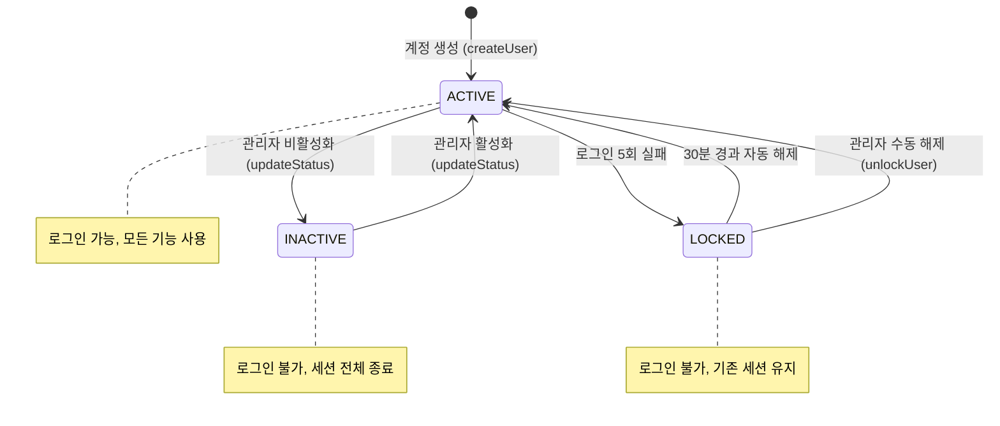
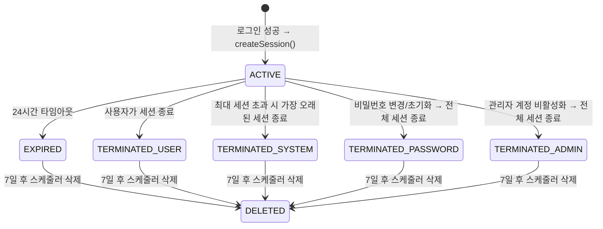
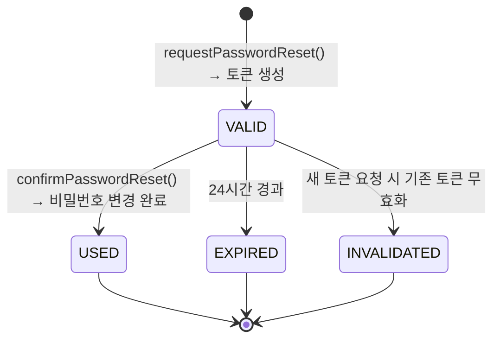
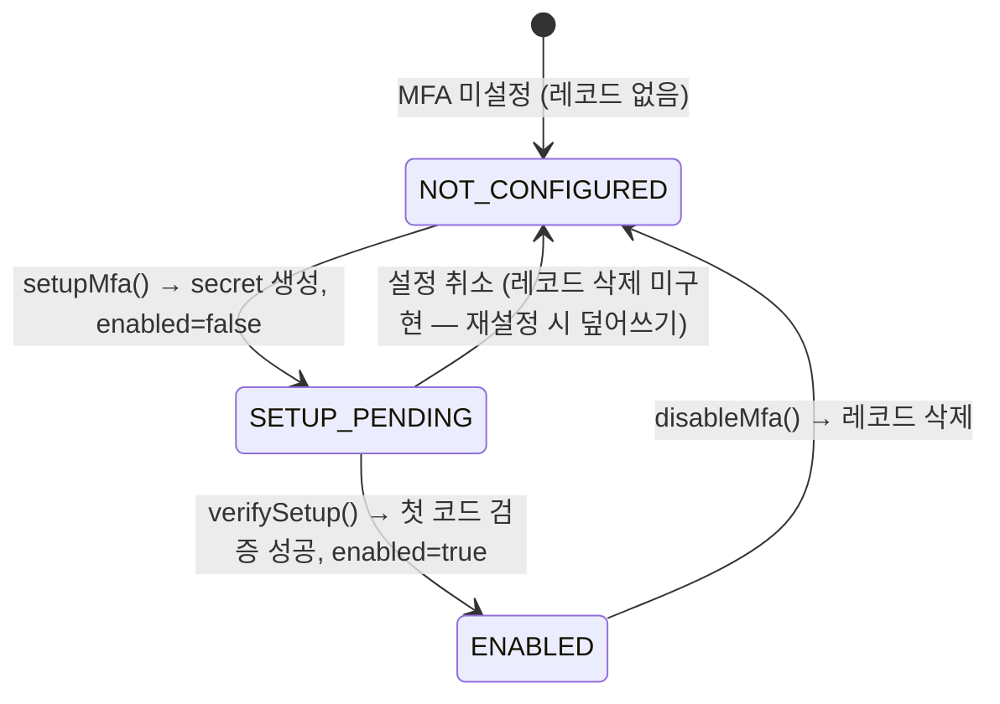
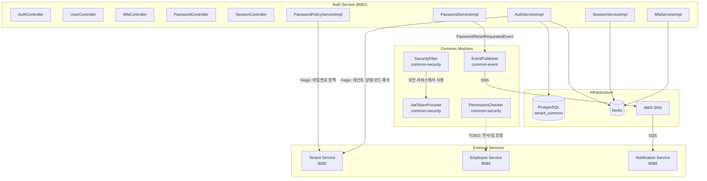
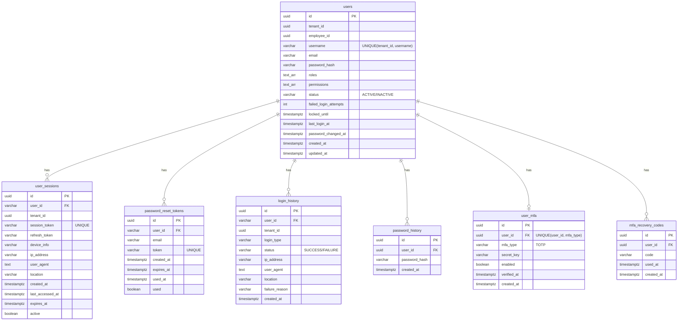

# Module 01: Auth Service — PRD 및 프로덕션 정책 분석

> **최종 업데이트**: 2026-02-10
> **분석 범위**: `services/auth-service/`, `common/common-security/`
> **문서 버전**: v2.0 (Phase A/B/C 확장)

---

## 목차

- [1. 현재 구현 상태 요약](#1-현재-구현-상태-요약)
- [2. 정책 결정사항](#2-정책-결정사항)
- [3. 기능 요구사항 Gap 분석 (Phase A)](#3-기능-요구사항-gap-분석-phase-a)
- [4. 비즈니스 규칙 상세 (Phase B)](#4-비즈니스-규칙-상세-phase-b)
- [5. 서비스 연동 명세 (Phase C)](#5-서비스-연동-명세-phase-c)
- [6. 데이터 모델](#6-데이터-모델)
- [7. API 명세](#7-api-명세)
- [8. 보안/프라이버시](#8-보안프라이버시)
- [9. 성능/NFR](#9-성능nfr)
- [10. 추적성 매트릭스](#10-추적성-매트릭스)
- [11. 변경 이력](#11-변경-이력)

---

## 1. 현재 구현 상태 요약

### 1.1 구현 완료

| 기능 | 상태 | 위치 |
|------|------|------|
| 로그인 (username/password) | ✅ 완료 | `AuthServiceImpl.login()` |
| JWT 발급 (Access + Refresh) | ✅ 완료 | `JwtTokenProvider.generateAccessToken/RefreshToken()` |
| 토큰 갱신 (Refresh) | ✅ 완료 | `AuthServiceImpl.refreshToken()` |
| 로그아웃 (토큰 블랙리스트) | ✅ 완료 | `AuthServiceImpl.logout()` |
| 현재 사용자 정보 조회 | ✅ 완료 | `AuthServiceImpl.getCurrentUser()` |
| 비밀번호 변경 | ✅ 완료 | `PasswordServiceImpl.changePassword()` |
| 비밀번호 초기화 요청/확인 | ✅ 완료 | `PasswordServiceImpl.requestPasswordReset/confirmPasswordReset()` |
| 세션 관리 (생성/조회/종료) | ✅ 완료 | `SessionServiceImpl` |
| 계정 잠금 (5회 실패/30분) | ✅ 완료 | `AuthServiceImpl.login()` |
| 역할 계층 (7단계) | ✅ 완료 | `RoleHierarchyConfig` |
| 권한 매핑 (역할→권한) | ✅ 완료 | `PermissionMappingService` |
| 스코프 기반 권한 체크 | ✅ 완료 | `PermissionChecker` |
| JWT 필터 (모든 서비스 공통) | ✅ 완료 | `SecurityFilter` |
| 토큰 블랙리스트 (Redis) | ✅ 완료 | Redis `token:blacklist:` prefix |
| IP 주소 마스킹 (세션 응답) | ✅ 완료 | `SessionServiceImpl.maskIpAddress()` |
| 비밀번호 초기화 이벤트 발행 | ✅ 완료 | `PasswordResetRequestedEvent` → Notification |
| MFA (TOTP 기반 다중 인증) | ✅ 완료 | `MfaServiceImpl` |
| MFA 복구 코드 | ✅ 완료 | `MfaRecoveryCode` 엔티티 |
| 사용자 계정 CRUD (관리자용) | ✅ 완료 | `UserController` / `UserManagementServiceImpl` |
| 로그인 이력 기록 | ✅ 완료 | `LoginHistoryServiceImpl` |
| 비밀번호 만료 체크 | ✅ 완료 | `AuthServiceImpl.login()` 내 passwordExpiryDays 체크 |
| 비밀번호 이력 관리 | ✅ 완료 | `PasswordHistoryServiceImpl` |
| Refresh Token Rotation | ✅ 완료 | 이전 토큰 블랙리스트 처리 |
| 로그인 시 세션 생성 연결 | ✅ 완료 | `AuthServiceImpl.login()` → `SessionService.createSession()` |
| 테넌트 상태 검증 (로그인 시) | ✅ 완료 | Feign → TenantServiceClient.getTenantStatus() |
| username 테넌트별 유니크 | ✅ 완료 | V23 마이그레이션 적용 |
| 만료 세션 정리 스케줄러 | ✅ 완료 | `SessionCleanupScheduler` (1시간 주기) |
| 테넌트별 비밀번호 정책 | ✅ 완료 | `PasswordPolicyServiceImpl` → Feign |
| account_locks 테이블 제거 | ✅ 완료 | V22 마이그레이션 |

### 1.2 미구현 / TODO

| 기능 | 상태 | 위치 | 구현 방향 |
|------|------|------|-----------|
| IP Geolocation | ⚠️ 부분 | `SessionServiceImpl.resolveLocation()` | MaxMind GeoIP2 DB 파일 필요 (코드 구현 완료, DB 파일 미설정 시 "Unknown") |
| 같은 부서 확인 | ❌ TODO | `PermissionChecker.isSameDepartment()` | Employee Service Feign 호출 필요 |
| 같은 팀 확인 | ❌ TODO | `PermissionChecker.isSameTeam()` | Employee Service Feign 호출 필요 |
| CORS 설정 (프로덕션) | ⚠️ 부분 | SecurityConfig | 개발 도메인만 설정, 프로덕션 도메인 추가 필요 |
| Gateway Service 인증 | ❌ 미구현 | gateway-service | JWT 미들웨어 미완 |
| 감사 로그 모듈 (common-audit) | ❌ 미구현 | 설계 완료, 구현 필요 | AOP @Audited + SQS 리스너 |
| Keycloak SSO 연동 | ❌ 미연동 | — | 자체 JWT 유지 결정 (연동 안 함) |

---

## 2. 정책 결정사항

### 2.1 비밀번호 정책 (결정 완료)

| 항목 | 결정 | 비고 |
|------|------|------|
| **정책 관리 수준** | 테넌트별 설정 가능 | 기본 최소 기준 이상으로만 강화 허용 |
| **시스템 최소 기준** | 8자 이상, 대문자+소문자+숫자+특수문자 각 1개 | 이 기준 아래로는 설정 불가 |
| **테넌트 설정 가능 항목** | 최소 길이 (8~20), 조합 규칙 (3종/4종), 만료 기간, 재사용 금지 개수 | Tenant Service Feign 연동 |
| **비밀번호 만료** | 기본 90일 | 테넌트별 미사용/30/60/90일 설정 가능 |
| **재사용 금지** | 기본 5개 | 테넌트별 0~10 설정 가능 |
| **만료 알림** | 만료 7일 전 알림 | Notification Service 연동 (미구현) |

#### 테넌트 비밀번호 정책 기본값
```yaml
password-policy:
  min-length: 8              # 최소 길이 (시스템 최소: 8)
  max-length: 100             # 최대 길이
  require-uppercase: true     # 대문자 필수
  require-lowercase: true     # 소문자 필수
  require-digit: true         # 숫자 필수
  require-special-char: true  # 특수문자 필수
  min-char-types: 4           # 최소 문자 종류 (시스템 최소: 3)
  expiry-days: 90             # 만료 기간 (0=미사용, 시스템 최소: 0)
  history-count: 5            # 재사용 금지 개수 (시스템 최소: 0)
  expiry-warning-days: 7      # 만료 경고 일수
```

### 2.2 계정 잠금 정책 (결정 완료)

| 항목 | 결정 | 비고 |
|------|------|------|
| 최대 실패 횟수 | 5회 | 현행 유지 |
| 잠금 시간 | 30분 | 현행 유지 |
| 잠금 해제 | 시간 경과 시 자동 해제 + 관리자 수동 해제 | `UserController.unlockUser()` |

### 2.3 JWT 토큰 정책 (결정 완료)

| 항목 | 결정 | 비고 |
|------|------|------|
| Access Token 만료 | 1800초 (30분) | 현행 유지 |
| Refresh Token 만료 | 604800초 (7일) | 현행 유지 |
| 서명 알고리즘 | HMAC-SHA256 | 현행 유지 |
| Token Type | Bearer | 현행 유지 |
| Refresh Token Rotation | 갱신 시 이전 토큰 블랙리스트 처리 | 구현 완료 |

### 2.4 세션 정책 (결정 완료)

| 항목 | 결정 | 비고 |
|------|------|------|
| 최대 동시 세션 | 5개 | `auth.session.max-sessions` |
| 초과 시 처리 | 가장 오래된 세션 자동 종료 | 현행 유지 |
| 세션 타임아웃 | 24시간 | `auth.session.timeout-hours` |
| 만료 세션 정리 | 1시간마다 (비활성 7일 후 삭제) | `SessionCleanupScheduler` |

### 2.5 MFA 정책 (결정 완료)

| 항목 | 결정 | 비고 |
|------|------|------|
| MFA 방식 | TOTP (Google Authenticator 호환) | RFC 6238, GoogleAuthenticator 라이브러리 |
| 정책 수준 | 사용자 자율 (선택적) | 테넌트 레벨 강제 미구현 |
| 복구 코드 | 설정 시 10개 발급 | 8자 영숫자, 일회용 |
| MFA 대기 토큰 | Redis 5분 TTL | `mfa:pending:{mfaToken}` |

### 2.6 인증 시스템 (결정 완료)

| 항목 | 결정 | 비고 |
|------|------|------|
| 인증 방식 | 자체 JWT 인증 유지 | Keycloak 전환 안 함 |

---

## 3. 기능 요구사항 Gap 분석 (Phase A)

### 3.1 PRD vs 코드 비교표

> **PRD 출처**: `docs/deprecated/PRD.md` (섹션 4: 사용자 정의, 섹션 6.4: 보안, 섹션 7: 아키텍처)
> **참고**: PRD에는 Auth Service 전용 FR 시리즈(FR-AUTH-xxx)가 정의되어 있지 않음. 인증 관련 요구사항은 사용자 역할 정의(§4), 보안 NFR(§6.4), 아키텍처(§7)에 분산.

| ID | PRD 요구사항 | PRD 출처 | 코드 구현 상태 | 구현 위치 | Gap |
|----|-------------|---------|---------------|----------|-----|
| FR-AUTH-001 | 로그인/로그아웃 | §4 (암시적) | ✅ 완전 구현 | `AuthController.login/logout()` | — |
| FR-AUTH-002 | JWT 토큰 발급/갱신 | §7 아키텍처 | ✅ 완전 구현 | `JwtTokenProvider`, `AuthServiceImpl.refreshToken()` | — |
| FR-AUTH-003 | 세션 관리 (동시 제한) | 없음 (코드 전용) | ✅ 완전 구현 | `SessionServiceImpl` (최대 5, 24h timeout) | PRD에 명시 없음 |
| FR-AUTH-004 | 비밀번호 변경/초기화 | 없음 (코드 전용) | ✅ 완전 구현 | `PasswordServiceImpl` | PRD에 명시 없음 |
| FR-AUTH-005 | 계정 잠금 (5회/30분) | 없음 (코드 전용) | ✅ 완전 구현 | `AuthServiceImpl.login()` | PRD에 명시 없음 |
| FR-AUTH-006 | 7단계 계층적 RBAC | §4.2.1 | ✅ 완전 구현 | `RoleHierarchyConfig` (7 roles, 100+ permissions) | — |
| FR-AUTH-007 | 데이터 접근 제어 (scope) | §4.2.2 | ✅ 완전 구현 | `PermissionChecker` (self/team/dept/org) | 부서/팀 실제 조회 TODO |
| FR-AUTH-008 | Keycloak SSO / OAuth 2.0 | §6.4 NFR-SEC-001 | ❌ 미구현 | — | **자체 JWT 유지 결정** (의도적 미구현) |
| FR-AUTH-009 | Gateway JWT 검증 | §7.1 Gateway Layer | 🟡 부분 | Traefik 라우팅 존재, JWT 미들웨어 미완 | Gateway Service 미완 |
| FR-AUTH-010 | MFA (다중 인증) | 없음 (코드 전용) | ✅ 완전 구현 | `MfaServiceImpl` (TOTP + 복구코드) | PRD에 명시 없음 |
| FR-AUTH-011 | 사용자 계정 관리 (CRUD) | §4.1 역할 정의 (암시적) | ✅ 완전 구현 | `UserController` / `UserManagementServiceImpl` | — |
| FR-AUTH-012 | 비밀번호 정책 (테넌트별) | 없음 (코드 전용) | ✅ 완전 구현 | `PasswordPolicyServiceImpl` → Feign | PRD에 명시 없음 |
| FR-AUTH-013 | 비밀번호 이력 (재사용 방지) | 없음 (코드 전용) | ✅ 완전 구현 | `PasswordHistoryServiceImpl` | PRD에 명시 없음 |
| FR-AUTH-014 | 비밀번호 만료 체크 | 없음 (코드 전용) | ✅ 완전 구현 | `AuthServiceImpl` (passwordExpiryDays) | PRD에 명시 없음 |
| FR-AUTH-015 | 로그인 이력 기록 | 없음 (코드 전용) | ✅ 완전 구현 | `LoginHistoryServiceImpl` | PRD에 명시 없음 |
| FR-AUTH-016 | 감사 로그 (비즈니스 레벨) | §6.4 NFR-SEC-005 | ❌ 미구현 | 설계 완료 (섹션 13), 코드 없음 | Auth에 저장/조회 API 필요 |
| FR-AUTH-017 | 테넌트 상태 검증 (로그인 시) | §5.1 테넌트 관리 (암시적) | ✅ 완전 구현 | `AuthServiceImpl` → TenantServiceClient | — |

### 3.2 코드에만 있는 기능 (역분석)

PRD에 명시적 요구사항이 없지만, 코드에 구현된 기능들:

| 기능 | 구현 위치 | 비즈니스 가치 | PRD 반영 권장 |
|------|----------|-------------|--------------|
| Refresh Token Rotation + 블랙리스트 | `AuthServiceImpl.refreshToken()` | 토큰 탈취 방어 (OAuth2 보안 모범사례) | ✅ 반영 필요 |
| IP 마스킹 (세션 응답) | `SessionServiceImpl.maskIpAddress()` | 개인정보보호 (PIPA 준수) | ✅ 반영 필요 |
| 관리자 비밀번호 초기화 | `UserController.resetPassword()` | 운영 편의성 | ✅ 반영 필요 |
| MFA 복구 코드 (10개, 일회용) | `MfaRecoveryCodeRepository` | MFA 분실 대응 | ✅ 반영 필요 |
| MFA 대기 토큰 (Redis 5분 TTL) | `mfa:pending:{token}` | 2단계 인증 UX | ✅ 반영 필요 |
| 다중 테넌트 username 유니크 | V23 마이그레이션 | 100+ 계열사 지원 핵심 | ✅ 반영 필요 |
| 세션 정리 스케줄러 (1시간 주기) | `SessionCleanupScheduler` | 자원 관리 | 내부 운영 사항 |
| 비밀번호 복잡도 DTO 검증 | `ChangePasswordRequest` `@Pattern` | 입력 유효성 | 정책 문서에 포함 |
| Feign 인증 헤더 전파 | `FeignClientConfig` | 서비스 간 인증 전파 | 아키텍처 문서에 포함 |
| 에러 코드 체계 (AUTH_001~014) | `ErrorCode` enum | API 규격 | API 규격 문서에 포함 |

### 3.3 Gap 해소 우선순위 로드맵

| 우선순위 | Gap ID | 항목 | 현재 상태 | 해소 방향 | 의존성 | 예상 복잡도 |
|---------|--------|------|----------|----------|--------|-----------|
| **HIGH** | AUTH-G01 | 감사 로그 모듈 (common-audit + Auth 저장/조회) | 설계 완료, 미구현 | common-audit AOP + Auth SQS 리스너 + 조회 API | 전 서비스 영향 | 높음 |
| **HIGH** | AUTH-G02 | 부서/팀 기반 권한 체크 | `isSameDepartment()` 항상 true | Employee Service Feign Client 추가 | Employee Service | 중간 |
| **MEDIUM** | AUTH-G03 | Gateway JWT 미들웨어 | Traefik 라우팅만 존재 | JWT 검증 미들웨어 구현 | Gateway Service | 중간 |
| **MEDIUM** | AUTH-G04 | 비밀번호 만료 7일 전 알림 | 만료 체크만 구현, 알림 미발행 | `PasswordExpiredEvent` → Notification | Notification Service | 낮음 |
| **LOW** | AUTH-G05 | CORS 프로덕션 설정 | 개발 도메인만 | 환경별 CORS 도메인 설정 | 배포 환경 확정 | 낮음 |
| **LOW** | AUTH-G06 | IP Geolocation DB 설정 | 코드 완료, DB 파일 미설정 | MaxMind GeoIP2 Lite 파일 배포 | 외부 파일 | 낮음 |
| **DEFERRED** | AUTH-G07 | Keycloak SSO | 의도적 미구현 | 자체 JWT 유지 결정. 향후 SSO 필요 시 재검토 | — | — |

---

## 4. 비즈니스 규칙 상세 (Phase B)

### 4.1 상태 머신

#### 4.1.1 사용자 계정 상태 (UserEntity.status)



**상태 설명**:

| 상태 | DB 표현 | 로그인 | 기존 세션 | 전이 조건 |
|------|---------|--------|----------|----------|
| ACTIVE | `status='ACTIVE'`, `locked_until IS NULL OR < NOW()` | ✅ | 유지 | 정상 상태 |
| INACTIVE | `status='INACTIVE'` | ❌ (AUTH_008) | 전체 종료 | 관리자 비활성화 |
| LOCKED | `status='ACTIVE'`, `locked_until > NOW()` | ❌ (AUTH_009) | 유지 | 5회 로그인 실패 |

**참고**: LOCKED은 별도 상태 컬럼이 아닌 `locked_until` 타임스탬프로 관리됨. `UserEntity.isLocked()` 메서드가 `lockedUntil != null && lockedUntil.isAfter(now)` 체크.

#### 4.1.2 세션 생명주기 (UserSession.active)



**DB 표현**: `active = true/false` (소프트 삭제). 비활성화된 세션의 토큰은 Redis 블랙리스트에 24h TTL로 추가.

#### 4.1.3 비밀번호 초기화 토큰 (PasswordResetToken)



**DB 표현**: `used = true/false`, `expires_at` 타임스탬프. `isValid()` = `!used && expiresAt.isAfter(now)`.

#### 4.1.4 MFA 설정 상태 (UserMfa.enabled)



### 4.2 유효성 검증 규칙 카탈로그

#### 4.2.1 로그인 요청 (LoginRequest)

| 필드 | 규칙 | 어노테이션/코드 | 에러 |
|------|------|---------------|------|
| `username` | 필수, 비어있지 않음 | `@NotBlank` | 400 |
| `password` | 필수, 비어있지 않음 | `@NotBlank` | 400 |
| `tenantCode` | 선택 (UUID 또는 테넌트 코드 문자열) | 없음 | — |

**서비스 레벨 검증** (순서대로):

| # | 검증 | 실패 시 | 에러 코드 |
|---|------|--------|----------|
| 1 | `tenantCode` → tenantId 해석 (Feign) | 테넌트 미존재 | AUTH_001 |
| 2 | `findByUsernameAndTenantId()` 조회 | 사용자 미존재 | AUTH_001 |
| 3 | 미조회 시 `findByUsername()` 폴백 | 사용자 미존재 | AUTH_001 |
| 4 | `user.isActive()` | 비활성 계정 | AUTH_008 |
| 5 | `user.isLocked()` | 잠긴 계정 | AUTH_009 |
| 6 | `passwordEncoder.matches()` | 비밀번호 불일치 → `failedAttempts++` | AUTH_001 |
| 7 | `failedAttempts >= 5` | 계정 잠금 (30분) | AUTH_009 |
| 8 | 테넌트 상태 확인 (Feign) | SUSPENDED → AUTH_010, TERMINATED → AUTH_011 | AUTH_010/011 |
| 9 | MFA 활성화 여부 | MFA 필요 → `mfaRequired: true` 반환 | — |
| 10 | 비밀번호 만료 여부 | 만료 → `passwordExpired: true` 반환 | — |

#### 4.2.2 비밀번호 변경 (ChangePasswordRequest)

| 필드 | 규칙 | 어노테이션/코드 |
|------|------|---------------|
| `currentPassword` | 필수, 비어있지 않음 | `@NotBlank` |
| `newPassword` | 8~100자, 대문자+소문자+숫자+특수문자 각 1개 | `@Size(min=8, max=100)`, `@Pattern(regexp=...)` |
| `confirmPassword` | `newPassword`와 동일 | 서비스 레벨 비교 |

**서비스 레벨 검증**:

| # | 검증 | 에러 |
|---|------|------|
| 1 | 현재 비밀번호 BCrypt 매칭 | AUTH_012 |
| 2 | newPassword == confirmPassword | 400 |
| 3 | 테넌트 비밀번호 정책 검증 (Feign) | AUTH_011 |
| 4 | 비밀번호 이력 확인 (최근 N개 재사용 금지) | AUTH_014 |
| 5 | BCrypt 인코딩 + 저장 | — |
| 6 | 이전 해시 → password_history 저장 | — |
| 7 | 전체 세션 종료 | — |

#### 4.2.3 사용자 생성 (CreateUserRequest)

| 필드 | 규칙 | 어노테이션 |
|------|------|-----------|
| `username` | 필수, 3~100자 | `@NotBlank`, `@Size(min=3, max=100)` |
| `email` | 선택, 이메일 형식 | `@Email` |
| `password` | 필수, 8~100자 | `@NotBlank`, `@Size(min=8, max=100)` |
| `tenantId` | 필수, UUID | `@NotNull` |
| `employeeId` | 선택, UUID | — |
| `roles` | 선택, 기본값 `["USER"]` | — |

**서비스 레벨 검증**:

| # | 검증 | 에러 |
|---|------|------|
| 1 | username 전역 유니크 확인 | COMMON_005 (409) |
| 2 | email + tenantId 유니크 확인 | COMMON_005 (409) |

#### 4.2.4 비밀번호 정책 검증 (PasswordPolicyServiceImpl)

| 규칙 | 시스템 최소값 | 테넌트 설정 가능 |
|------|-------------|----------------|
| 최소 길이 | 8 | 8~20 |
| 최대 길이 | 100 | 고정 |
| 대문자 포함 | false (시스템 최소 3종) | true/false |
| 소문자 포함 | false (시스템 최소 3종) | true/false |
| 숫자 포함 | false (시스템 최소 3종) | true/false |
| 특수문자 포함 | false (시스템 최소 3종) | true/false |
| 최소 문자 종류 | 3 | 3~4 |
| 만료 기간 | 0 (무제한) | 0~365일 |
| 이력 보관 수 | 0 | 0~10 |

### 4.3 계산 공식/로직 명세

#### 4.3.1 계정 잠금 판정

```
IF failedLoginAttempts >= MAX_FAILED_ATTEMPTS (5):
    lockedUntil = NOW() + LOCK_DURATION_MINUTES (30분)

로그인 시 잠금 확인:
    IF lockedUntil IS NOT NULL AND lockedUntil > NOW():
        → AUTH_009 (계정 잠김)
    ELSE:
        → 잠금 해제 상태 (failedAttempts 유지)
```

**참고**: 잠금 기간 경과 후에도 `failedAttempts`는 자동 리셋되지 않음. 다음 로그인 성공 시 `resetFailedAttempts()` 호출하여 초기화.

#### 4.3.2 비밀번호 만료 판정

```
passwordExpiryDays = auth.password-expiry-days (기본 90)

IF passwordExpiryDays > 0 AND passwordChangedAt IS NOT NULL:
    expiryDate = passwordChangedAt + passwordExpiryDays
    remainingDays = expiryDate - NOW() (일 단위)

    IF remainingDays <= 0:
        → passwordExpired = true
    ELSE:
        → passwordExpiresInDays = remainingDays
```

**참고**: 비밀번호 만료 시 로그인 자체는 허용됨. 응답의 `passwordExpired: true` 플래그로 프론트엔드에서 강제 변경 유도.

#### 4.3.3 세션 최대 수 관리

```
현재 활성 세션 수 = countByUserIdAndActiveTrue(userId)
maxSessions = auth.session.max-sessions (기본 5)

IF 현재 활성 세션 수 >= maxSessions:
    가장 오래된 세션 = findByUserIdAndActiveTrue(userId).sortBy(createdAt ASC).first()
    가장 오래된 세션.active = false
    관련 토큰 블랙리스트 추가
```

#### 4.3.4 관리자 비밀번호 초기화 (임시 비밀번호 생성)

```
tempPassword = UUID.randomUUID().toString().replace("-", "").substring(0, 12) + "A1!"
// 결과: 12자 UUID 문자열 + 대문자(A) + 숫자(1) + 특수문자(!) = 15자
// 예: "a3b4c5d6e7f8A1!"
```

### 4.4 데이터 생명주기 정책

| 데이터 | 생성 시점 | 보존 기간 | 삭제 방식 | 비고 |
|--------|----------|----------|----------|------|
| **users** | 관리자 생성 | 영구 (논리 삭제: INACTIVE) | 물리 삭제 없음 | 퇴직 시 INACTIVE 전환 |
| **user_sessions** | 로그인 시 | 활성: 24h, 비활성: 7일 | 스케줄러 물리 삭제 | `SessionCleanupScheduler` |
| **password_reset_tokens** | 초기화 요청 시 | 24시간 (토큰 만료) | 별도 정리 미구현 | 정리 스케줄러 추가 권장 |
| **login_history** | 로그인 시도 시 | 별도 정리 정책 없음 | 물리 삭제 없음 | 5년 보관 권장 (감사) |
| **password_history** | 비밀번호 변경 시 | 별도 정리 정책 없음 | 물리 삭제 없음 | 실질적으로 최근 N개만 사용 |
| **user_mfa** | MFA 설정 시 | 영구 (비활성화 시 삭제) | 물리 삭제 | `disableMfa()` |
| **mfa_recovery_codes** | MFA 설정 시 | 사용 시 soft-delete (used_at 기록) | MFA 재설정 시 전체 물리 삭제 | `deleteAllByUserId()` |

### 4.5 엣지 케이스 카탈로그

| # | 시나리오 | 현재 동작 | 기대 동작 | 상태 |
|---|---------|----------|----------|------|
| EC-01 | tenantCode 미제공 + username 글로벌 중복 | `findByUsername()`으로 첫 번째 매칭 반환 | 테넌트 지정 요구 또는 에러 | ⚠️ 모호 |
| EC-02 | 잠금 중 비밀번호 초기화 | 초기화 토큰 발급 가능, 확인 시 failedAttempts 리셋 | 현행 유지 (의도된 설계) | ✅ 정상 |
| EC-03 | 비밀번호 만료 + MFA 활성화 | MFA 검증 후 로그인 → passwordExpired 플래그 | 현행: MFA 먼저, 이후 만료 처리 | ✅ 정상 |
| EC-04 | 세션 5개 + 동시 로그인 2건 | 동시성 제어 없음 → 7개 세션 가능 | 비관적 락 또는 최대 수 초과 허용 후 비동기 정리 | ⚠️ 동시성 |
| EC-05 | Feign 호출 실패 (Tenant Service 다운) | 비밀번호 정책: 기본값 폴백 / 테넌트 상태: 무시? | 기본값 폴백 (현행) 또는 로그인 차단 | ⚠️ 정책 필요 |
| EC-06 | Refresh Token 갱신 중 동시 요청 | 둘 다 성공 가능 (이전 토큰 블랙리스트는 후처리) | Race condition → 한 쪽 실패 가능 | ⚠️ 동시성 |
| EC-07 | 관리자가 자기 자신을 INACTIVE | 현재 세션 종료 안 됨 (서비스 레벨) | 자기 자신 비활성화 방지 | ⚠️ 미구현 |
| EC-08 | 비밀번호 이력 5개 미만 상태에서 이전 비밀번호 재사용 | 이력이 있는 만큼만 비교 | 현행 유지 (정상) | ✅ 정상 |
| EC-09 | MFA 설정 중 (enabled=false) 다시 setup 호출 | 기존 secret 덮어쓰기 | 현행 유지 (QR 재생성) | ✅ 정상 |
| EC-10 | 복구 코드 10개 모두 사용 후 TOTP 기기 분실 | MFA 비활성화 불가 (코드 필요) | 관리자 MFA 강제 해제 API 필요 | ❌ 미구현 |

---

## 5. 서비스 연동 명세 (Phase C)

### 5.1 연동 아키텍처



### 5.2 REST API 연동 (Feign Client 기반)

#### 5.2.1 Auth → Tenant Service

| Feign Client | 메서드 | 엔드포인트 | 용도 | 호출 시점 | 폴백 전략 |
|-------------|--------|----------|------|----------|----------|
| `TenantServiceClient` | `getPasswordPolicy(UUID)` | `GET /api/v1/tenants/{tenantId}/password-policy` | 테넌트별 비밀번호 정책 조회 | 비밀번호 변경/초기화/검증 시 | 기본값 반환 (PasswordPolicyDto 디폴트) |
| `TenantServiceClient` | `getByTenantCode(String)` | `GET /api/v1/tenants/code/{tenantCode}` | 테넌트 코드 → UUID 변환 | 로그인 시 (tenantCode 제공된 경우) | 예외 발생 (AUTH_001) |
| `TenantServiceClient` | `getTenantStatus(UUID)` | `GET /api/v1/tenants/{tenantId}/status` | 테넌트 상태 확인 (ACTIVE/SUSPENDED/TERMINATED) | 로그인 시 | 예외 무시 (로그인 허용) |

**Feign 설정**:
- URL: `${feign.client.tenant-service.url:http://localhost:8082}`
- 인증 헤더 전파: `FeignClientConfig.authenticationRequestInterceptor()` → 현재 요청의 Authorization 헤더를 Feign 호출에 전달
- 타임아웃: Spring Cloud 기본값 (10초)

#### 5.2.2 Auth → Employee Service (TODO)

| Feign Client | 메서드 | 엔드포인트 | 용도 | 현재 상태 |
|-------------|--------|----------|------|----------|
| (미구현) | `getAffiliation(UUID)` | `GET /api/v1/employees/{employeeId}/affiliation` | 부서/팀 정보 조회 (PermissionChecker용) | `isSameDepartment()`/`isSameTeam()` → 항상 true |

#### 5.2.3 다른 서비스 → Auth Service

Auth Service는 다른 서비스에서 직접 호출되지 않음. 대신:
- **인증**: 모든 서비스가 `common-security`의 `SecurityFilter` + `JwtTokenProvider`를 사용하여 자체 JWT 검증
- **사용자 정보**: JWT 페이로드에서 추출 (`UserContext`)

### 5.3 이벤트 연동 (SNS/SQS)

#### 5.3.1 Auth Service가 발행하는 이벤트

| 이벤트 | SNS 토픽 | 발행 시점 | 페이로드 스키마 | 소비자 |
|--------|---------|----------|---------------|--------|
| `PasswordResetRequestedEvent` | `hr-saas.notification.send` | 비밀번호 초기화 요청 시 | `{ userId, email, resetToken, tenantId, timestamp }` | Notification Service |

#### 5.3.2 Auth Service가 소비하는 이벤트

현재 없음. 향후 감사 로그 구현 시:

| 이벤트 | SQS 큐 | 발행자 | 용도 |
|--------|--------|--------|------|
| `AuditEvent` (미구현) | `auth-service-audit-queue` | 전 서비스 (common-audit) | 감사 로그 DB 저장 |

#### 5.3.3 미구현 이벤트 (설계 완료)

| 이벤트 | 토픽 | 발행 시점 | 소비자 |
|--------|------|----------|--------|
| `LoginSuccessEvent` | `hr-saas.auth.login-success` | 로그인 성공 | Audit, Analytics |
| `LoginFailedEvent` | `hr-saas.auth.login-failed` | 로그인 실패 | Audit, Security |
| `AccountLockedEvent` | `hr-saas.auth.account-locked` | 계정 잠금 | Notification, Admin |
| `PasswordExpiredEvent` | `hr-saas.auth.password-expired` | 비밀번호 만료 감지 | Notification |

### 5.4 데이터 동기화 흐름

#### 5.4.1 사용자 → 직원 연결

```
Auth Service (users.employee_id) → Employee Service (employees.id)

- 연결 시점: 사용자 생성 시 employeeId 지정 (관리자가 수동 매핑)
- 데이터 방향: 단방향 참조 (Auth → Employee)
- 동기화: 없음 (Auth는 employeeId만 참조, 직원 정보는 JWT에 미포함)
- 정합성: 약한 참조 (FK 없음, employeeId가 존재하지 않아도 허용)
```

#### 5.4.2 테넌트 비밀번호 정책 동기화

```
Tenant Service (password_policy) → Auth Service (Feign 호출)

- 동기화 방식: 호출 시 조회 (캐싱 없음)
- 폴백: Tenant Service 다운 시 기본 정책 적용
- 최종 일관성: 즉시 (호출 시점 최신 정책 적용)
```

#### 5.4.3 테넌트 상태 동기화

```
Tenant Service (tenant.status) → Auth Service (로그인 시 Feign 확인)

- SUSPENDED → 로그인 차단 (AUTH_010), 기존 세션 유지
- TERMINATED → 로그인 차단 (AUTH_011), 기존 세션 유지
- 주의: 테넌트 상태 변경 이벤트 미소비 → 기존 세션은 토큰 만료까지 유효
```

### 5.5 통합 테스트 시나리오

| # | 시나리오 | 관련 서비스 | 기대 결과 | 상태 |
|---|---------|-----------|----------|------|
| IT-01 | 로그인 → tenantCode 해석 → 테넌트 상태 확인 → 토큰 발급 | Auth + Tenant | 정상 토큰 발급 + 세션 생성 + 로그인 이력 | ❌ 미작성 |
| IT-02 | SUSPENDED 테넌트 사용자 로그인 시도 | Auth + Tenant | AUTH_010 에러 반환 | ❌ 미작성 |
| IT-03 | 비밀번호 변경 → 테넌트 정책 적용 → 이력 확인 → 세션 종료 | Auth + Tenant | 정책 위반 시 AUTH_011, 이력 재사용 시 AUTH_014 | ❌ 미작성 |
| IT-04 | 비밀번호 초기화 → 이벤트 발행 → 알림 수신 | Auth + Notification | 이메일 알림 발송 | ❌ 미작성 |
| IT-05 | MFA 설정 → 로그인 → MFA 검증 → 토큰 발급 | Auth 단독 | 2단계 인증 완료 | ❌ 미작성 |
| IT-06 | 5회 로그인 실패 → 계정 잠금 → 30분 후 자동 해제 → 로그인 성공 | Auth 단독 | 잠금/해제 정상 동작 | ❌ 미작성 |
| IT-07 | 세션 5개 상태에서 6번째 로그인 → 가장 오래된 세션 종료 | Auth 단독 | 세션 5개 유지, 블랙리스트 추가 | ❌ 미작성 |
| IT-08 | 관리자 사용자 비활성화 → 해당 사용자 세션 전체 종료 | Auth 단독 | 세션 종료, 로그인 불가 | ❌ 미작성 |
| IT-09 | Refresh Token Rotation → 이전 토큰으로 재시도 | Auth 단독 | 이전 토큰 거부 (AUTH_002) | ❌ 미작성 |
| IT-10 | 부서/팀 기반 권한 → Employee Service 조회 | Auth + Employee | 같은 부서인 경우만 접근 허용 | ❌ (Feign 미구현) |

---

## 6. 데이터 모델

### 6.1 테이블 목록 (tenant_common 스키마)

| 테이블 | 상태 | 용도 | RLS |
|--------|------|------|-----|
| `users` | ✅ 사용 중 | 사용자 계정 | N/A (서비스 레벨 tenant_id 필터) |
| `user_sessions` | ✅ 사용 중 | 활성 세션 | N/A |
| `password_reset_tokens` | ✅ 사용 중 | 초기화 토큰 | N/A |
| `login_history` | ✅ 사용 중 | 로그인 이력 | N/A |
| `password_history` | ✅ 사용 중 | 비밀번호 재사용 방지 | N/A |
| `user_mfa` | ✅ 사용 중 | MFA 설정 (TOTP secret) | N/A |
| `mfa_recovery_codes` | ✅ 사용 중 | MFA 복구 코드 | N/A |

**RLS 미적용 이유**: 인증 과정에서 tenant_id가 확정되기 전에 조회가 필요하므로 서비스 레벨에서 필터링.

### 6.2 ERD



### 6.3 인덱스

| 테이블 | 인덱스 | 컬럼 |
|--------|--------|------|
| users | `uq_users_tenant_username` (UNIQUE) | `(tenant_id, username)` |
| users | `idx_users_email` | `(email)` |
| users | `idx_users_employee_id` | `(employee_id)` |
| users | `idx_users_status` | `(status)` |
| users | `idx_users_tenant_id` | `(tenant_id)` |
| user_sessions | `idx_sessions_user_id` | `(user_id)` |
| user_sessions | `idx_sessions_tenant_id` | `(tenant_id)` |
| user_sessions | `idx_sessions_token` | `(session_token)` |
| user_sessions | `idx_sessions_expires` | `(expires_at)` |
| user_sessions | `idx_sessions_active` | `(active)` |
| password_reset_tokens | `idx_prt_user_id` | `(user_id)` |
| password_reset_tokens | `idx_prt_email` | `(email)` |
| password_reset_tokens | `idx_prt_token` | `(token)` |
| login_history | `idx_lh_user_id` | `(user_id)` |
| login_history | `idx_lh_tenant_id` | `(tenant_id)` |
| login_history | `idx_lh_status` | `(status)` |
| login_history | `idx_lh_created_at` | `(created_at)` |
| password_history | `idx_ph_user_id` | `(user_id)` |
| user_mfa | `uq_user_mfa` (UNIQUE) | `(user_id, mfa_type)` |
| mfa_recovery_codes | `idx_mrc_user_id` | `(user_id)` |

### 6.4 Flyway 마이그레이션 이력

| 버전 | 파일 | 내용 |
|------|------|------|
| V20 | `V20__init_auth.sql` | 초기 테이블 5개 (users, user_sessions, password_reset_tokens, login_history, account_locks) + 시드 데이터 |
| V22 | `V22__remove_account_locks.sql` | account_locks 테이블 제거 (UserEntity 필드로 대체) |
| V23 | `V23__username_tenant_unique.sql` | username 유니크 제약을 (tenant_id, username) 복합으로 변경 |
| V24 | `V24__add_mfa_tables.sql` | user_mfa, mfa_recovery_codes 테이블 생성 |
| V35 | `V35__add_password_history.sql` | password_history 테이블 생성 |

---

## 7. API 명세

### 7.1 인증 API (`/api/v1/auth`)

| Method | Path | 인증 | 설명 | 요청 | 응답 |
|--------|------|------|------|------|------|
| `POST` | `/login` | ❌ 공개 | 로그인 | `LoginRequest` | `TokenResponse` |
| `POST` | `/token/refresh` | ❌ 공개 | 토큰 갱신 | `RefreshTokenRequest` | `TokenResponse` |
| `POST` | `/logout` | ✅ | 로그아웃 | Authorization 헤더 | void |
| `GET` | `/me` | ✅ | 현재 사용자 정보 | — | `UserResponse` |

### 7.2 비밀번호 API (`/api/v1/auth/password`)

| Method | Path | 인증 | 설명 | 요청 | 응답 |
|--------|------|------|------|------|------|
| `POST` | `/change` | ✅ | 비밀번호 변경 | `ChangePasswordRequest` | void |
| `POST` | `/reset` | ❌ 공개 | 비밀번호 초기화 요청 | `ResetPasswordRequest` | void |
| `POST` | `/reset/confirm` | ❌ 공개 | 비밀번호 초기화 확인 | `ResetPasswordConfirmRequest` | void |

### 7.3 세션 API (`/api/v1/auth/sessions`)

| Method | Path | 인증 | 설명 | 요청 | 응답 |
|--------|------|------|------|------|------|
| `GET` | `` | ✅ | 활성 세션 조회 | Authorization 헤더 | `List<SessionResponse>` |
| `DELETE` | `/{sessionId}` | ✅ | 특정 세션 종료 | — | void |
| `DELETE` | `` | ✅ | 전체 세션 종료 | — | void |
| `DELETE` | `/others` | ✅ | 다른 세션 종료 | Authorization 헤더 | void |

### 7.4 MFA API (`/api/v1/auth/mfa`)

| Method | Path | 인증 | 설명 | 요청 | 응답 |
|--------|------|------|------|------|------|
| `POST` | `/setup` | ✅ | MFA 설정 시작 | — | `{ secretKey, qrCodeUri }` |
| `POST` | `/verify-setup` | ✅ | MFA 설정 확인 | `{ code }` | `List<String>` (복구코드) |
| `POST` | `/verify` | ❌ 공개 (mfaToken) | 로그인 MFA 검증 | `{ mfaToken, code }` | `TokenResponse` |
| `POST` | `/disable` | ✅ | MFA 비활성화 | `{ code }` | void |
| `GET` | `/status` | ✅ | MFA 상태 조회 | — | `{ enabled, recoveryCodesRemaining }` |

### 7.5 사용자 관리 API (`/api/v1/auth/users`)

| Method | Path | 인증 | 권한 | 설명 | 요청 | 응답 |
|--------|------|------|------|------|------|------|
| `POST` | `` | ✅ | HR_MANAGER+ | 사용자 생성 | `CreateUserRequest` | `UserDetailResponse` |
| `GET` | `` | ✅ | HR_MANAGER+ | 사용자 목록 | — | `List<UserDetailResponse>` |
| `GET` | `/{userId}` | ✅ | HR_MANAGER+ | 사용자 상세 | — | `UserDetailResponse` |
| `PUT` | `/{userId}/status` | ✅ | HR_MANAGER+ | 상태 변경 | `UpdateUserStatusRequest` | void |
| `PUT` | `/{userId}/roles` | ✅ | HR_MANAGER+ | 역할 변경 | `UpdateUserRolesRequest` | void |
| `POST` | `/{userId}/unlock` | ✅ | HR_MANAGER+ | 잠금 해제 | — | void |
| `POST` | `/{userId}/reset-password` | ✅ | HR_MANAGER+ | 비밀번호 초기화 | — | void |

### 7.6 에러 코드 카탈로그

| 코드 | HTTP | 메시지 | 발생 상황 |
|------|------|--------|----------|
| `AUTH_001` | 401 | 아이디 또는 비밀번호가 올바르지 않습니다 | 사용자 미존재, 비밀번호 불일치 |
| `AUTH_002` | 401 | 토큰이 만료되었습니다 / 유효하지 않은 리프레시 토큰 | Refresh token 만료, 블랙리스트, 비리프레시 토큰 |
| `AUTH_003` | 401 | 인증 정보를 찾을 수 없습니다 | SecurityContextHolder 미설정 |
| `AUTH_004` | 404 | 사용자를 찾을 수 없습니다 | userId로 조회 실패 |
| `AUTH_006` | 400 | 유효하지 않은 토큰입니다 | 비밀번호 초기화 토큰 미존재 |
| `AUTH_007` | 400 | 만료되었거나 이미 사용된 토큰입니다 | 비밀번호 초기화 토큰 만료/사용됨 |
| `AUTH_008` | 401 | 비활성화된 계정입니다 | user.status = INACTIVE |
| `AUTH_009` | 401 | 계정이 잠겨있습니다 | lockedUntil > now |
| `AUTH_010` | 403 | 테넌트가 일시 중지되었습니다 | Tenant status = SUSPENDED |
| `AUTH_011` | 403 | 테넌트 계약이 종료되었습니다 / 비밀번호 정책 위반 | Tenant TERMINATED 또는 비밀번호 정책 불충족 |
| `AUTH_012` | 400 | 현재 비밀번호가 올바르지 않습니다 | changePassword 시 현재 비밀번호 불일치 |
| `AUTH_013` | 404 | 세션을 찾을 수 없습니다 | sessionId 조회 실패 |
| `AUTH_014` | 400 | 최근 사용한 비밀번호는 재사용할 수 없습니다 | 비밀번호 이력 재사용 감지 |
| `COMMON_005` | 409 | 이미 존재하는 사용자명/이메일입니다 | 중복 username 또는 email |

---

## 8. 보안/프라이버시

### 8.1 인증 보안

| 항목 | 구현 | 상세 |
|------|------|------|
| 비밀번호 해싱 | BCrypt | `PasswordEncoder` (Spring Security) |
| JWT 서명 | HMAC-SHA256 | `jwt.secret` 환경변수 (256bit+) |
| 토큰 블랙리스트 | Redis TTL | 로그아웃/갱신 시 이전 토큰 무효화 |
| CSRF | 비활성화 | JWT 기반 stateless → CSRF 불필요 |
| CORS | 도메인 제한 | 개발 환경: localhost:5173, localhost:3000 |
| Rate Limiting | ❌ 미구현 | 로그인 엔드포인트 brute-force 방어 필요 |
| SQL Injection | JPA Parameterized Query | Spring Data JPA 자동 파라미터 바인딩 |

### 8.2 데이터 보호

| 항목 | 구현 | 상세 |
|------|------|------|
| IP 마스킹 | `xxx.xxx.*.*` | 세션 응답에서 마스킹 처리 |
| MFA Secret | 평문 저장 | ⚠️ 암호화 저장 권장 (`@Encrypted` 미적용) |
| 비밀번호 초기화 토큰 | UUID | 추측 불가 (UUID v4) |
| Redis 데이터 | 평문 | ⚠️ Redis TLS 및 암호화 권장 |

### 8.3 보안 개선 필요사항

| 우선순위 | 항목 | 현재 | 권장 |
|---------|------|------|------|
| HIGH | Rate Limiting | 없음 | 로그인 API에 IP/사용자 기반 Rate Limit |
| HIGH | MFA Secret 암호화 | 평문 저장 | `@Encrypted` 또는 AES 암호화 |
| MEDIUM | Redis TLS | 비활성화 | TLS 활성화 (프로덕션) |
| MEDIUM | JWT Secret 관리 | 환경변수 | AWS Secrets Manager |
| LOW | 감사 로그 | 미구현 | common-audit 모듈 구현 |

---

## 9. 성능/NFR

### 9.1 설정값

| 설정 | 값 | 위치 |
|------|-----|------|
| DB 커넥션 풀 | max 20, min 5 | HikariCP (application.yml) |
| JPA DDL | validate | Flyway로 스키마 관리 |
| Redis | 단일 인스턴스 | 개발 환경 |
| JWT 캐싱 | 없음 | 매 요청마다 파싱/검증 |

### 9.2 Redis 키 패턴

| 패턴 | 용도 | TTL |
|------|------|-----|
| `token:blacklist:{token}` | 무효화된 토큰 | Access: 1800s, Session: 24h |
| `token:refresh:{userId}` | Refresh Token 저장 | 604800s (7일) |
| `session:{accessToken}` | 세션 캐시 | 24시간 |
| `mfa:pending:{mfaToken}` | MFA 대기 토큰 | 300s (5분) |

### 9.3 환경변수

| 변수 | 설명 | 필수 | 기본값 |
|------|------|------|--------|
| `DB_HOST` | PostgreSQL 호스트 | ✅ | localhost |
| `DB_PORT` | PostgreSQL 포트 | ❌ | 15432 (로컬), 5432 (AWS) |
| `DB_USERNAME` | DB 사용자 | ✅ | hr_saas |
| `DB_PASSWORD` | DB 비밀번호 | ✅ | hr_saas_password |
| `REDIS_HOST` | Redis 호스트 | ✅ | localhost |
| `REDIS_PORT` | Redis 포트 | ❌ | 16379 (로컬), 6379 (AWS) |
| `REDIS_PASSWORD` | Redis 비밀번호 | ✅ | redis_password |
| `JWT_SECRET` | JWT 서명 키 (256bit+) | ✅ | 개발용 기본값 |
| `AWS_REGION` | AWS 리전 | ❌ | ap-northeast-2 |
| `AWS_SNS_ENDPOINT` | SNS 엔드포인트 | ❌ | LocalStack |
| `AWS_SQS_ENDPOINT` | SQS 엔드포인트 | ❌ | LocalStack |

### 9.4 성능 최적화 권장사항

| 항목 | 현재 | 권장 | 기대 효과 |
|------|------|------|----------|
| 비밀번호 정책 캐싱 | Feign 매 호출 | Redis 캐시 (TTL 1h) | Feign 호출 감소 |
| JWT 검증 | 매 요청 파싱 | 서명 검증 후 Redis 캐시 (선택적) | CPU 절감 (미미) |
| 로그인 이력 비동기 | `REQUIRES_NEW` 트랜잭션 | `@Async` 또는 이벤트 | 로그인 응답 시간 단축 |

---

## 10. 추적성 매트릭스

### FR ID → 코드 매핑

| FR ID | 요구사항 | Controller | Service | Entity | 상태 |
|-------|---------|------------|---------|--------|------|
| FR-AUTH-001 | 로그인/로그아웃 | `AuthController` | `AuthServiceImpl` | `UserEntity`, `UserSession` | ✅ |
| FR-AUTH-002 | JWT 토큰 발급/갱신 | `AuthController` | `AuthServiceImpl`, `JwtTokenProvider` | — | ✅ |
| FR-AUTH-003 | 세션 관리 | `SessionController` | `SessionServiceImpl` | `UserSession` | ✅ |
| FR-AUTH-004 | 비밀번호 변경/초기화 | `PasswordController` | `PasswordServiceImpl` | `PasswordResetToken`, `PasswordHistory` | ✅ |
| FR-AUTH-005 | 계정 잠금 | `AuthController` | `AuthServiceImpl` | `UserEntity` (failedAttempts, lockedUntil) | ✅ |
| FR-AUTH-006 | 계층적 RBAC | — | `RoleHierarchyConfig`, `PermissionMappingService` | — (common-security) | ✅ |
| FR-AUTH-007 | 데이터 접근 제어 | — | `PermissionChecker` | — (common-security) | 🟡 (부서/팀 TODO) |
| FR-AUTH-008 | Keycloak SSO | — | — | — | ❌ (의도적) |
| FR-AUTH-009 | Gateway JWT 검증 | — | — | — | 🟡 |
| FR-AUTH-010 | MFA | `MfaController` | `MfaServiceImpl` | `UserMfa`, `MfaRecoveryCode` | ✅ |
| FR-AUTH-011 | 사용자 관리 CRUD | `UserController` | `UserManagementServiceImpl` | `UserEntity` | ✅ |
| FR-AUTH-012 | 테넌트별 비밀번호 정책 | — | `PasswordPolicyServiceImpl` | — (Feign) | ✅ |
| FR-AUTH-013 | 비밀번호 이력 | — | `PasswordHistoryServiceImpl` | `PasswordHistory` | ✅ |
| FR-AUTH-014 | 비밀번호 만료 체크 | `AuthController` | `AuthServiceImpl` | `UserEntity.passwordChangedAt` | ✅ |
| FR-AUTH-015 | 로그인 이력 | — | `LoginHistoryServiceImpl` | `LoginHistory` | ✅ |
| FR-AUTH-016 | 감사 로그 | — | — | — | ❌ |
| FR-AUTH-017 | 테넌트 상태 검증 | `AuthController` | `AuthServiceImpl` | — (Feign) | ✅ |

### 요약

| 상태 | 수 | 비율 |
|------|---|------|
| ✅ 완전 구현 | 14 | 82% |
| 🟡 부분 구현 | 1 | 6% |
| ❌ 미구현 | 2 | 12% |

**미구현 중 의도적**: FR-AUTH-008 (Keycloak) — 자체 JWT 유지 결정
**실질 미구현**: FR-AUTH-016 (감사 로그)

---

## 11. 변경 이력

| 날짜 | 버전 | 변경 내용 | 작성자 |
|------|------|----------|--------|
| 2026-02-06 | v1.0 | 초기 프로덕션 정책/설정 분석 | Claude |
| 2026-02-10 | v2.0 | Phase A (Gap 분석), Phase B (비즈니스 규칙), Phase C (서비스 연동) 추가. 코드 최신 상태 반영: MFA/사용자관리/로그인이력/비밀번호이력/비밀번호정책 구현 완료 확인. 추적성 매트릭스 추가. | Claude |

---

## 부록: 감사 로그 설계 (미구현)

> 아래 내용은 v1.0에서 섹션 13으로 존재하던 감사 로그 설계안을 보존한 것입니다.
> 구현 시 이 설계를 기반으로 common-audit 모듈 + Auth Service 저장/조회 API를 개발합니다.

### A.1 아키텍처

```
[각 서비스]                        [Auth Service]
┌─────────────────┐               ┌─────────────────┐
│ common-audit    │               │ audit_logs 테이블│
│ @Audited AOP    │──SNS/SQS──→  │ AuditLogListener│
│ 이벤트 자동 발행 │               │ AuditLogService │
└─────────────────┘               │ AuditLogAPI     │
                                  └─────────────────┘
```

### A.2 테이블 설계

```sql
CREATE TABLE audit_logs (
    id UUID PRIMARY KEY DEFAULT gen_random_uuid(),
    tenant_id VARCHAR(50) NOT NULL,
    user_id UUID NOT NULL,
    user_name VARCHAR(100),
    user_email VARCHAR(200),
    ip_address VARCHAR(45),
    user_agent TEXT,
    action VARCHAR(30) NOT NULL,
    target_type VARCHAR(50),
    target_id VARCHAR(100),
    target_name VARCHAR(200),
    result VARCHAR(10) NOT NULL,
    error_message TEXT,
    details JSONB,
    request_method VARCHAR(10),
    request_url VARCHAR(500),
    created_at TIMESTAMPTZ DEFAULT CURRENT_TIMESTAMP
) PARTITION BY RANGE (created_at);
```

### A.3 AuditAction (12종)

LOGIN, LOGOUT, CREATE, READ, UPDATE, DELETE, EXPORT, IMPORT, APPROVE, REJECT, PASSWORD_CHANGE, PERMISSION_CHANGE

### A.4 API

| Method | Path | 권한 | 설명 |
|--------|------|------|------|
| GET | `/api/v1/audit/logs` | HR_ADMIN+ | 목록 조회 |
| GET | `/api/v1/audit/logs/{id}` | HR_ADMIN+ | 상세 조회 |
| GET | `/api/v1/audit/logs/export` | HR_ADMIN+ | CSV/Excel 내보내기 |
| GET | `/api/v1/audit/logs/statistics` | TENANT_ADMIN+ | 통계 |

### A.5 설정

- 보존 기간: 5년 (개인정보보호법)
- 파티셔닝: 월별 자동 파티션
- SNS 토픽: `hr-saas.audit.event`
- SQS 큐: `auth-service-audit-queue`
