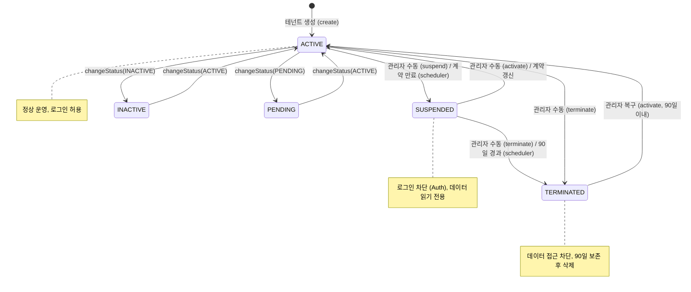
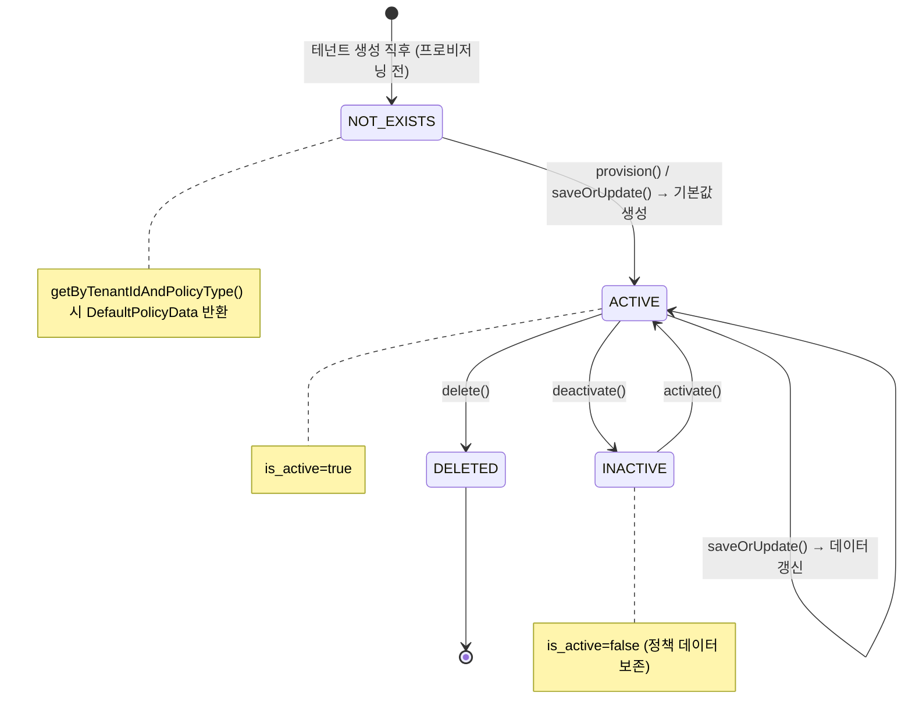
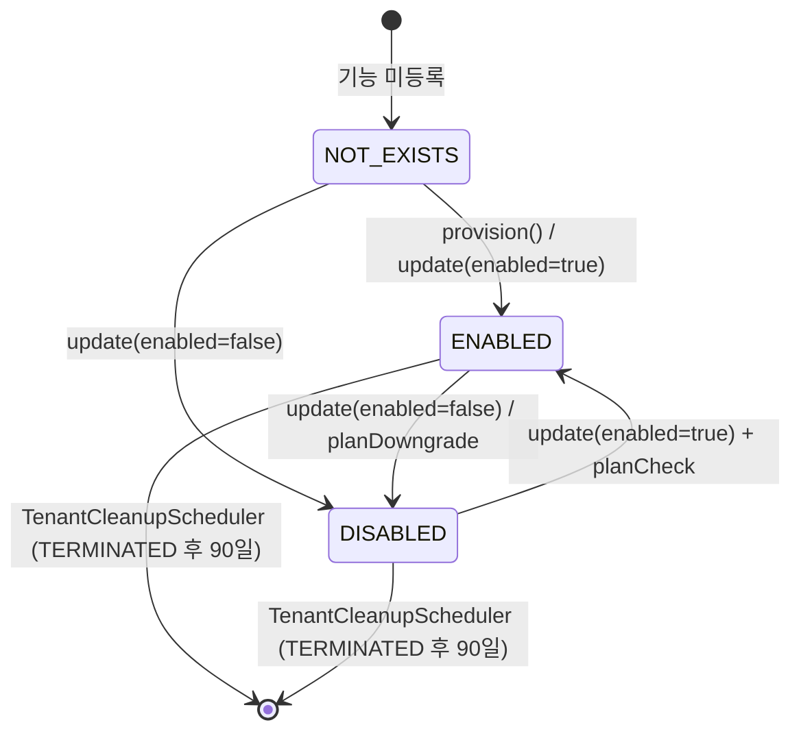
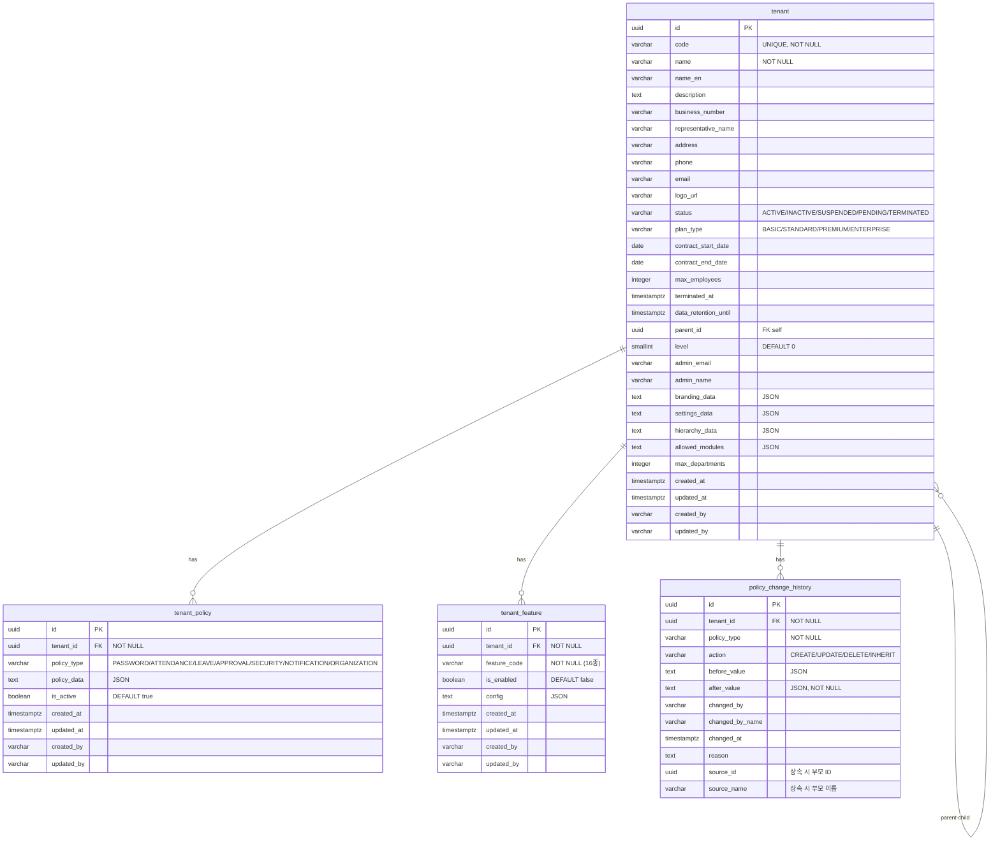

# Module 02: Tenant Service — PRD 및 프로덕션 정책 분석

> **최종 업데이트**: 2026-02-12
> **분석 범위**: `services/tenant-service/`, `common/common-tenant/`, `common/common-database/rls/`
> **문서 버전**: v2.0 (Phase A/B/C 확장)

---

## 목차

- [1. 현재 구현 상태 요약](#1-현재-구현-상태-요약)
- [2. 정책 결정사항](#2-정책-결정사항)
- [3. 기능 요구사항 Gap 분석 (Phase A)](#3-기능-요구사항-gap-분석-phase-a)
- [4. 비즈니스 규칙 상세 (Phase B)](#4-비즈니스-규칙-상세-phase-b)
- [5. 서비스 연동 명세 (Phase C)](#5-서비스-연동-명세-phase-c)
- [6. 데이터 모델](#6-데이터-모델)
- [7. API 명세](#7-api-명세)
- [8. 보안/프라이버시](#8-보안프라이버시)
- [9. 성능/NFR](#9-성능nfr)
- [10. 추적성 매트릭스](#10-추적성-매트릭스)
- [11. 변경 이력](#11-변경-이력)

---

## 1. 현재 구현 상태 요약

### 1.1 구현 완료

| 기능 | 상태 | 위치 |
|------|------|------|
| 테넌트 CRUD (생성/조회/수정) | ✅ 완료 | `TenantServiceImpl` |
| 테넌트 상세 조회 (Detail + ListItem + Tree) | ✅ 완료 | `TenantDetailAssembler`, `TenantDetailResponse` |
| 테넌트 상태 관리 (ACTIVE/INACTIVE/SUSPENDED/PENDING/TERMINATED) | ✅ 완료 | `Tenant.activate/suspend/terminate/changeStatus()` |
| 테넌트 코드/ID 조회 (캐시 적용) | ✅ 완료 | `TenantServiceImpl.getById/getByCode()` + `@Cacheable` |
| 테넌트 목록 페이징 조회 | ✅ 완료 | `TenantServiceImpl.getAllList()` |
| 테넌트 검색/필터 (keyword, status, planType, contractEndDate, parentId, level) | ✅ 완료 | `TenantRepositoryCustomImpl.search()` |
| 테넌트 트리 구조 조회 | ✅ 완료 | `TenantServiceImpl.getTenantTree()` |
| 자회사 목록 조회 | ✅ 완료 | `TenantServiceImpl.getSubsidiaries()` |
| 테넌트 계층 관리 (parent_id, level) | ✅ 완료 | `Tenant.parentId`, `Tenant.level`, V37 마이그레이션 |
| 테넌트 정책 CRUD (7종) | ✅ 완료 | `TenantPolicyServiceImpl` |
| 정책 데이터 JSON 검증 (PolicyDataValidator) | ✅ 완료 | `PolicyDataValidator` — PolicyType별 DTO 파싱 + PASSWORD 최소기준 |
| 정책 기본값 폴백 (DefaultPolicyData) | ✅ 완료 | `TenantPolicyServiceImpl.getByTenantIdAndPolicyType()` 미존재 시 기본값 |
| 정책 변경 이력 기록 (PolicyChangeHistory) | ✅ 완료 | `TenantPolicyServiceImpl.recordPolicyHistory()` |
| 정책 상속 (부모 → 자식) | ✅ 완료 | `PolicyInheritanceService.inheritPolicies()` |
| 테넌트 기능 플래그 관리 | ✅ 완료 | `TenantFeatureServiceImpl` |
| 기능 활성화 여부 확인 API | ✅ 완료 | `TenantFeatureServiceImpl.isFeatureEnabled()` |
| 플랜별 기능 제한 (PlanFeatureMapping) | ✅ 완료 | `PlanFeatureMapping` + `TenantFeatureServiceImpl.update()` 내 체크 |
| 플랜 업그레이드/다운그레이드 기능 동기화 | ✅ 완료 | `PlanUpgradeService.syncFeatures()` |
| 테넌트 프로비저닝 (정책 7종 + 기능 + 관리자) | ✅ 완료 | `TenantProvisioningService.provision()` |
| Auth Service 관리자 계정 생성 (Feign) | ✅ 완료 | `AuthServiceClient.createAdminUser()` (Optional 안전 처리) |
| 테넌트 브랜딩 설정 (brandingData JSON) | ✅ 완료 | `TenantBrandingService.updateBranding()` |
| 브랜딩 이미지 업로드 (MVP) | ✅ 완료 | `TenantBrandingService.uploadBrandingImage()` — 플레이스홀더 URL |
| 조직 계층 정의 (hierarchyData JSON) | ✅ 완료 | `TenantHierarchyService.getHierarchy/updateHierarchy()` |
| 모듈 설정 (allowedModules JSON) | ✅ 완료 | `TenantController.updateModules()` |
| 계약 만료 자동 처리 스케줄러 (매일 01:00) | ✅ 완료 | `ContractExpiryScheduler` — 경고/정지/종료 자동 |
| 종료 테넌트 데이터 정리 스케줄러 (매주 월 03:00) | ✅ 완료 | `TenantCleanupScheduler` — 90일 경과 시 정책/기능 삭제 |
| 그룹 통합 대시보드 (Feign 집계) | ✅ 완료 | `GroupDashboardService` — Employee/Approval/Attendance Feign |
| 사용자 대시보드 (조직 현황 + HR 지표) | ✅ 완료 | `UserDashboardService` — 4개 서비스 Feign + Circuit Breaker |
| TenantResolver 구현체 (캐시 적용) | ✅ 완료 | `TenantResolverImpl` — resolve/resolveByCode/isActive |
| 정책/기능 캐싱 (Redis) | ✅ 완료 | `@Cacheable` on TENANT/TENANT_POLICY/TENANT_FEATURE/TENANT_FEATURE_ENABLED |
| 캐시 무효화 (변경 시) | ✅ 완료 | `@CacheEvict` on all mutating operations |
| RLS 정책 (정책/기능 테이블) | ✅ 완료 | `V30__init_tenant.sql` |
| 테넌트 생성/수정/상태변경 이벤트 발행 | ✅ 완료 | `TenantCreatedEvent`, `TenantUpdatedEvent`, `TenantStatusChangedEvent` |
| 정책/기능 변경 이벤트 발행 | ✅ 완료 | `TenantPolicyChangedEvent`, `TenantFeatureChangedEvent` |
| 계약 만료 경고 이벤트 발행 | ✅ 완료 | `ContractExpiryWarningEvent` |
| 종료 시 데이터 보존 추적 (terminated_at, data_retention_until) | ✅ 완료 | V36 마이그레이션 |
| 사업자번호/코드 중복 검증 | ✅ 완료 | `TenantServiceImpl.createTenantEntity()` |
| 개인정보 마스킹 (응답) | ✅ 완료 | `TenantResponse` — @Masked 적용 |
| TenantContext (ThreadLocal) | ✅ 완료 | `common-tenant` |
| TenantFilter (헤더 추출) | ✅ 완료 | `common-tenant` |
| @RequireTenant AOP | ✅ 완료 | `TenantAspect` |
| RLS Connection Interceptor | ✅ 완료 | `TenantConnectionInterceptor` |
| updated_at 자동 갱신 트리거 | ✅ 완료 | DB 트리거 |
| 테넌트 상태 조회 (내부 서비스용) | ✅ 완료 | `TenantController.getStatus()` |
| 비밀번호 정책 조회 (내부 서비스용) | ✅ 완료 | `TenantController.getPasswordPolicy()` |

### 1.2 미구현 / TODO

| 기능 | 상태 | 위치 | 구현 방향 |
|------|------|------|-----------|
| 테넌트 정지 시 기존 세션 강제 종료 | ❌ 미구현 | Auth Service에서 TenantStatusChangedEvent 소비 필요 | Auth에서 이벤트 소비자 구현 |
| 정책 변경 시 관련 서비스 캐시 갱신 | ⚠️ 부분 | 이벤트 발행 완료, 소비자 미구현 | 각 서비스에서 TenantPolicyChangedEvent 소비 |
| 테넌트 간 인사이동 (FR-TM-003-03) | ✅ 구현 완료 (플랫폼) | employee-service `TransferController`, `TransferServiceImpl` | tenant-service 직접 구현 대상 아님 (연동/정합성 관리만 필요) |
| 감사 로그 (common-audit) | ❌ 미구현 | — | common-audit 모듈 전체 구현 필요 |
| 브랜딩 이미지 실제 파일 저장 | ⚠️ MVP | `TenantBrandingService.uploadBrandingImage()` — 플레이스홀더 URL | File Service 연동 필요 |
| CORS 설정 (프로덕션) | ⚠️ 부분 | SecurityConfig | 프로덕션 도메인 추가 필요 |

---

## 2. 정책 결정사항

### 2.1 테넌트 초기 프로비저닝 (결정 완료, 구현 완료)

**결정**: 테넌트 생성 시 동기적 프로비저닝 + 이벤트 발행

| 초기 생성 항목 | 내용 | 구현 상태 |
|----------------|------|-----------|
| **기본 정책 7종** | PASSWORD, ATTENDANCE, LEAVE, APPROVAL, SECURITY, NOTIFICATION, ORGANIZATION 각각 기본값 | ✅ `TenantProvisioningService` |
| **기능 플래그** | 플랜에 따른 기본 기능 활성화 (PlanFeatureMapping) | ✅ `TenantProvisioningService` |
| **관리자 계정** | TENANT_ADMIN 역할의 초기 관리자 1명 (Auth Service Feign) | ✅ `AuthServiceClient` (Optional) |

**프로비저닝 흐름** (실제 코드 기반):
```
1. TenantServiceImpl.createTenantEntity()
   a. 코드/사업자번호 유니크 검증
   b. 부모 테넌트 검증 → level 계산
   c. Tenant 엔티티 저장 (기본 branding/settings/hierarchy/modules 포함)
2. TenantProvisioningService.provision(tenantId, planType)
   a. 기본 정책 7종 생성 (PolicyType.values() 순회)
   b. 플랜별 기능 플래그 생성 (PlanFeatureMapping.getFeatures())
   c. Auth Service로 관리자 계정 생성 (Optional<AuthServiceClient>)
3. TenantCreatedEvent 발행 (SNS)
```

### 2.2 플랜별 기능 제한 (결정 완료, 구현 완료)

**결정**: `PlanFeatureMapping` 상수 맵으로 관리, 4단계 플랜

| 기능 코드 | BASIC | STANDARD | PREMIUM | ENTERPRISE |
|-----------|:-----:|:--------:|:-------:|:----------:|
| EMPLOYEE | ✅ | ✅ | ✅ | ✅ |
| ORGANIZATION | ✅ | ✅ | ✅ | ✅ |
| ATTENDANCE | ✅ | ✅ | ✅ | ✅ |
| LEAVE | ✅ | ✅ | ✅ | ✅ |
| APPROVAL | ❌ | ✅ | ✅ | ✅ |
| NOTIFICATION | ❌ | ✅ | ✅ | ✅ |
| MDM | ❌ | ✅ | ✅ | ✅ |
| FILE | ❌ | ✅ | ✅ | ✅ |
| APPOINTMENT | ❌ | ❌ | ✅ | ✅ |
| CERTIFICATE | ❌ | ❌ | ✅ | ✅ |
| RECRUITMENT | ❌ | ❌ | ✅ | ✅ |
| OVERTIME | ❌ | ❌ | ✅ | ✅ |
| FLEXIBLE_WORK | ❌ | ❌ | ✅ | ✅ |
| MULTI_COMPANY | ❌ | ❌ | ✅ | ✅ |
| API_INTEGRATION | ❌ | ❌ | ❌ | ✅ |
| GROUP_DASHBOARD | ❌ | ❌ | ❌ | ✅ |

**적용 위치**:
- `TenantFeatureServiceImpl.update()` -- 기능 활성화 시 `PlanFeatureMapping.isAllowed()` 체크
- `TenantProvisioningService.provision()` -- 생성 시 플랜에 맞는 기능만 활성화
- `PlanUpgradeService.syncFeatures()` -- 플랜 변경 시 기능 자동 동기화

### 2.3 계약 만료 처리 (결정 완료, 구현 완료)

**결정**: 자동 정지 + 알림 (ContractExpiryScheduler, 매일 01:00)

| 시점 | 처리 | 구현 |
|------|------|------|
| 만료 30일 전 | `ContractExpiryWarningEvent` 발행 (daysUntilExpiry=30) | ✅ |
| 만료 7일 전 | `ContractExpiryWarningEvent` 발행 (daysUntilExpiry=7) | ✅ |
| 만료 1일 전 | `ContractExpiryWarningEvent` 발행 (daysUntilExpiry=1) | ✅ |
| 만료일 | 테넌트 상태 → SUSPENDED + `TenantStatusChangedEvent` 발행 | ✅ |
| 만료 + 90일 | 테넌트 상태 → TERMINATED + `TenantStatusChangedEvent` 발행 | ✅ |

### 2.4 테넌트 종료 시 데이터 처리 (결정 완료, 구현 완료)

**결정**: 소프트 삭제 + 90일 보존 + 주간 정리

| 단계 | 상태 | 데이터 접근 | 복구 가능 | 자동 전이 |
|------|------|------------|-----------|----------|
| 활성 | ACTIVE | 전체 | -- | -- |
| 정지 | SUSPENDED | 읽기 전용 (Auth에서 로그인 차단) | ✅ 즉시 | 계약 만료 시 자동 |
| 종료 | TERMINATED | 차단 | ✅ 90일 이내 | 정지 후 90일 경과 자동 |
| 데이터 삭제 | TERMINATED (retention 경과) | 삭제됨 | ❌ | `TenantCleanupScheduler` (매주 월 03:00) |

**구현 상세**:
- `Tenant.terminate()`: `terminatedAt = now`, `dataRetentionUntil = now + 90일`
- `TenantCleanupScheduler`: `dataRetentionUntil < now` 인 TERMINATED 테넌트의 정책/기능 물리 삭제

### 2.5 정책 관리 방침 (결정 완료, 구현 완료)

| 항목 | 결정 | 구현 위치 |
|------|------|----------|
| **정책 타입** | 7종 (PASSWORD/ATTENDANCE/LEAVE/APPROVAL/SECURITY/NOTIFICATION/ORGANIZATION) | `PolicyType` enum |
| **JSON 검증** | PolicyType별 DTO 클래스로 역직렬화 검증 | `PolicyDataValidator` |
| **시스템 최소 기준** | PASSWORD: minLength >= 8, minCharTypes >= 3 | `PolicyDataValidator.validatePassword()` |
| **기본값 폴백** | 정책 미존재 시 `DefaultPolicyData` 반환 | `TenantPolicyServiceImpl.getByTenantIdAndPolicyType()` |
| **변경 이력** | CREATE/UPDATE/DELETE/INHERIT 행위 기록 | `PolicyChangeHistory` 엔티티 |
| **정책 상속** | 그룹 테넌트 → 자회사 일괄 적용 | `PolicyInheritanceService` |

### 2.6 테넌트 계층 구조 (결정 완료, 구현 완료)

| 항목 | 결정 | 구현 |
|------|------|------|
| 계층 모델 | 부모-자식 관계 (parent_id + level) | `Tenant.parentId`, `Tenant.level` |
| 그룹 판정 | level=0 && parentId=null | `Tenant.isGroup()` |
| 자회사 판정 | parentId != null | `Tenant.isSubsidiary()` |
| 트리 조회 | TERMINATED 제외, 재귀 빌드 | `TenantServiceImpl.getTenantTree()` |
| 정책 상속 제한 | 그룹 테넌트만 상속 가능 | `PolicyInheritanceService` -- `isGroup()` 체크 |

---

## 3. 기능 요구사항 Gap 분석 (Phase A)

### 3.1 PRD vs 코드 비교표

> **PRD 출처**: `docs/deprecated/PRD.md` (섹션 5.1: 테넌트 관리)
> **FR-TM 시리즈**: 12개 요구사항 정의

| ID | PRD 요구사항 | PRD 출처 | 코드 구현 상태 | 구현 위치 | Gap |
|----|-------------|---------|---------------|----------|-----|
| FR-TM-001-01 | 테넌트 등록 | §5.1 | ✅ 완전 구현 | `TenantServiceImpl.createWithDetail()` + `TenantProvisioningService` | -- |
| FR-TM-001-02 | 기본정보 관리 | §5.1 | ✅ 완전 구현 | `TenantServiceImpl.updateWithDetail()` + branding/settings/hierarchy | -- |
| FR-TM-001-03 | 상태 관리 | §5.1 | ✅ 완전 구현 | `TenantServiceImpl.activate/suspend/terminate/changeStatus()` + scheduler | -- |
| FR-TM-001-04 | 모듈/기능 On/Off | §5.1 | ✅ 완전 구현 | `TenantFeatureServiceImpl` + `PlanFeatureMapping` | -- |
| FR-TM-002-01 | 조직 계층 정의 | §5.1 | ✅ 완전 구현 | `TenantHierarchyService` -- hierarchyData JSON | -- |
| FR-TM-002-02 | 직급/직책 체계 | §5.1 | ✅ 완전 구현 | OrganizationPolicyData (positionSystem, gradeCount 등) | -- |
| FR-TM-002-03 | 휴가 정책 | §5.1 | ✅ 완전 구현 | LeavePolicyData (annualLeaveBaseCount, carryOver 등) | -- |
| FR-TM-002-04 | 결재 기능 On/Off | §5.1 | ✅ 완전 구현 | ApprovalPolicyData (7개 설정 항목) | -- |
| FR-TM-002-05 | 자동 결재선 규칙 | §5.1 | ✅ 완전 구현 | ApprovalPolicyData (autoApproveOnTimeout, escalation 등) | -- |
| FR-TM-003-01 | 그룹 통합 대시보드 | §5.1 | ✅ 완전 구현 | `GroupDashboardService` -- Feign 기반 집계 + CircuitBreaker | -- |
| FR-TM-003-02 | 그룹 공통 정책 일괄 적용 | §5.1 | ✅ 완전 구현 | `PolicyInheritanceService.inheritPolicies()` | -- |
| FR-TM-003-03 | 계열사 간 인사이동 | §5.1 | ✅ 구현 완료 | employee-service `TransferController`, `TransferServiceImpl` | tenant-service는 API 직접 제공하지 않음 |

### 3.2 코드에만 있는 기능 (역분석)

PRD에 명시적 요구사항이 없지만, 코드에 구현된 기능들:

| FR ID | 기능 | 구현 위치 | 비즈니스 가치 | PRD 반영 권장 |
|-------|------|----------|-------------|--------------|
| FR-TM-014 | 계약 만료 스케줄러 + 자동 SUSPENDED/TERMINATED | `ContractExpiryScheduler` | SaaS 수익 보호, 운영 자동화 | ✅ 반영 필요 |
| FR-TM-015 | 테넌트 프로비저닝 (기본 정책 + 기능 + 관리자) | `TenantProvisioningService` | 온보딩 자동화, 즉시 사용 가능 | ✅ 반영 필요 |
| FR-TM-016 | 플랜 기반 기능 게이팅 (PlanFeatureMapping) | `TenantFeatureServiceImpl.update()` | SaaS 과금 모델 핵심 | ✅ 반영 필요 |
| FR-TM-017 | 정책 변경 이력 감사 (PolicyChangeHistory) | `TenantPolicyServiceImpl.recordPolicyHistory()` | 컴플라이언스, 변경 추적 | ✅ 반영 필요 |
| FR-TM-018 | 테넌트 계층 (부모/자회사 트리) | `Tenant.parentId/level`, `getTenantTree()` | 100+ 계열사 그룹 지원 | ✅ 반영 필요 |
| FR-TM-019 | 브랜딩 커스터마이제이션 | `TenantBrandingService` | 화이트라벨 SaaS | ✅ 반영 필요 |
| FR-TM-020 | 사용자 대시보드 (조직 현황 + HR 통계) | `UserDashboardService` -- 4개 Feign | 경영진 의사결정 지원 | ✅ 반영 필요 |
| FR-TM-021 | 플랜 업그레이드/다운그레이드 기능 동기화 | `PlanUpgradeService.syncFeatures()` | SaaS 셀프 서비스 | ✅ 반영 필요 |
| FR-TM-022 | 종료 테넌트 데이터 보존 (90일) | `TenantCleanupScheduler` | PIPA 준수, 복구 대비 | ✅ 반영 필요 |
| FR-TM-023 | TenantResolver 캐시 구현체 | `TenantResolverImpl` | 서비스 간 테넌트 조회 성능 | 내부 운영 사항 |
| FR-TM-024 | 비밀번호 정책 전용 API (Auth 연동) | `TenantController.getPasswordPolicy()` | Auth Service 의존성 해소 | 내부 운영 사항 |
| FR-TM-025 | 모듈 설정 (allowedModules JSON) | `TenantController.updateModules()` | 기능별 모듈 on/off | ✅ 반영 필요 |
| FR-TM-026 | 위젯 설정 (대시보드 위젯 구성) | `UserDashboardService.getWidgets()` | UX 개인화 | 내부 운영 사항 |

### 3.3 Gap 해소 우선순위 로드맵

| 우선순위 | Gap ID | 항목 | 현재 상태 | 해소 방향 | 의존성 | 예상 복잡도 |
|---------|--------|------|----------|----------|--------|-----------|
| **HIGH** | TM-G01 | 테넌트 정지 시 기존 세션 강제 종료 | Auth에서 상태 확인은 구현, 세션 강제 종료 없음 | Auth Service에서 `TenantStatusChangedEvent` 소비 -> 해당 테넌트 세션 전체 종료 | Auth Service | 중간 |
| **HIGH** | TM-G02 | 정책 변경 시 관련 서비스 캐시 갱신 | 이벤트 발행 완료, 소비자 없음 | 각 서비스에서 `TenantPolicyChangedEvent` SQS 소비 -> 로컬 캐시 무효화 | 전 서비스 | 중간 |
| **MEDIUM** | TM-G03 | 계열사 간 인사이동 후속 고도화 (FR-TM-003-03) | 기본 구현 완료 | 분산 트랜잭션(Saga) 및 장애 복구 보강 | Employee, Appointment | 높음 |
| **MEDIUM** | TM-G04 | 감사 로그 모듈 (common-audit) | 미구현 | AOP @Audited + SQS -> Auth Service 저장 | 전 서비스 | 높음 |
| **LOW** | TM-G05 | 브랜딩 이미지 실제 저장 | 플레이스홀더 URL | File Service Feign 연동 | File Service | 낮음 |
| **LOW** | TM-G06 | CORS 프로덕션 설정 | 개발 도메인만 | 환경별 도메인 분리 | 배포 환경 확정 | 낮음 |

---

## 4. 비즈니스 규칙 상세 (Phase B)

### 4.1 상태 머신

#### 4.1.1 테넌트 상태 (TenantStatus)



**상태 설명**:

| 상태 | DB 값 | 로그인 | 데이터 접근 | 자동 전이 트리거 |
|------|-------|--------|-----------|----------------|
| ACTIVE | `status='ACTIVE'` | ✅ | 전체 | -- |
| INACTIVE | `status='INACTIVE'` | 정책 미정 | 읽기 전용 | -- |
| PENDING | `status='PENDING'` | 정책 미정 | 제한 | -- |
| SUSPENDED | `status='SUSPENDED'` | ❌ (AUTH_010) | 읽기 전용 | 계약 만료일 도래 시 |
| TERMINATED | `status='TERMINATED'` | ❌ (AUTH_011) | 차단 | SUSPENDED 후 90일 경과 시 |

**부수 효과**:

| 전이 | 코드 경로 | 부수 효과 |
|------|----------|----------|
| * → ACTIVE | `Tenant.activate()` | `TenantStatusChangedEvent` 발행, 캐시 무효화 |
| * → SUSPENDED | `Tenant.suspend()` | `TenantStatusChangedEvent` 발행, 캐시 무효화 |
| * → TERMINATED | `Tenant.terminate()` | `terminatedAt = now`, `dataRetentionUntil = now+90d`, 이벤트 발행, 캐시 무효화 |
| TERMINATED (retention 경과) | `TenantCleanupScheduler` | 정책/기능 데이터 물리 삭제 |

#### 4.1.2 정책 생명주기 (TenantPolicy)



**변경 이력 기록 규칙**:
- CREATE, UPDATE, DELETE, INHERIT 4종 action
- before_value/after_value JSON 전체 기록
- changedBy/changedByName: SecurityContextHolder에서 추출
- INHERIT 시 sourceId/sourceName 기록 (부모 테넌트 정보)

#### 4.1.3 기능 플래그 생명주기 (TenantFeature)



**플랜 체크 규칙**: `enabled=true`로 변경 시에만 `PlanFeatureMapping.isAllowed()` 검증. `enabled=false`로 변경 시에는 플랜 체크 없음.

### 4.2 유효성 검증 규칙 카탈로그

#### 4.2.1 테넌트 생성 (CreateTenantRequest)

| 필드 | 규칙 | 어노테이션 | 에러 |
|------|------|-----------|------|
| `code` | 필수, 50자 이하 | `@NotBlank`, `@Size(max=50)` | 400 |
| `name` | 필수, 200자 이하 | `@NotBlank`, `@Size(max=200)` | 400 |
| `nameEn` | 선택, 200자 이하 | `@Size(max=200)` | 400 |
| `businessNumber` | 선택, 20자 이하 | `@Size(max=20)` | 400 |
| `representativeName` | 선택, 100자 이하 | `@Size(max=100)` | 400 |
| `address` | 선택, 500자 이하 | `@Size(max=500)` | 400 |
| `phone` | 선택, 20자 이하 | `@Size(max=20)` | 400 |
| `email` | 선택, 이메일 형식, 100자 이하 | `@Email`, `@Size(max=100)` | 400 |
| `adminEmail` | 선택, 이메일 형식, 100자 이하 | `@Email`, `@Size(max=100)` | 400 |
| `adminName` | 선택, 100자 이하 | `@Size(max=100)` | 400 |
| `planType` | 선택, 기본값 STANDARD | -- | -- |
| `parentId` | 선택, UUID | -- | 부모 미존재 시 TNT_001 |

**서비스 레벨 검증** (순서대로):

| # | 검증 | 실패 시 | 에러 코드 |
|---|------|--------|----------|
| 1 | `existsByCode(code)` | 코드 중복 | TNT_004 (409) |
| 2 | `existsByBusinessNumber(businessNumber)` | 사업자번호 중복 | TNT_004 (409) |
| 3 | `parentId` 존재 시 부모 테넌트 조회 | 부모 미존재 | TNT_001 (404) |
| 4 | Tenant 저장 | -- | -- |
| 5 | 프로비저닝 (정책 7종 + 기능 + 관리자) | 부분 실패 허용 (로그 경고) | -- |
| 6 | `TenantCreatedEvent` 발행 | -- | -- |

#### 4.2.2 정책 데이터 검증 (PolicyDataValidator)

| PolicyType | 검증 방식 | 시스템 최소 기준 |
|-----------|----------|----------------|
| PASSWORD | `PasswordPolicyData` 역직렬화 + 규칙 체크 | minLength >= 8, minCharTypes >= 3 |
| ATTENDANCE | `AttendancePolicyData` 역직렬화 | JSON 형식 검증만 |
| LEAVE | `LeavePolicyData` 역직렬화 | JSON 형식 검증만 |
| APPROVAL | `ApprovalPolicyData` 역직렬화 | JSON 형식 검증만 |
| SECURITY | `SecurityPolicyData` 역직렬화 | JSON 형식 검증만 |
| NOTIFICATION | `NotificationPolicyData` 역직렬화 | JSON 형식 검증만 |
| ORGANIZATION | `OrganizationPolicyData` 역직렬화 | JSON 형식 검증만 |

**검증 실패 에러**:
- 빈 데이터: `TNT_005` "정책 데이터가 비어있습니다."
- 파싱 실패: `TNT_005` "정책 데이터 형식이 올바르지 않습니다: {type}"
- 최소 기준 하회: `TNT_008` "비밀번호 최소 길이는 8자 이상이어야 합니다." / "비밀번호 최소 문자 유형은 3가지 이상이어야 합니다."

#### 4.2.3 기능 토글 검증

| 검증 | 조건 | 에러 |
|------|------|------|
| 테넌트 존재 | `tenantRepository.existsById(tenantId)` | TNT_001 (404) |
| 플랜 허용 | `enabled=true` 시 `PlanFeatureMapping.isAllowed(planType, featureCode)` | TNT_006 "현재 플랜({planType})에서 사용할 수 없는 기능입니다: {featureCode}" |

#### 4.2.4 정책 상속 검증

| 검증 | 조건 | 에러 |
|------|------|------|
| 부모 존재 | `tenantRepository.findById(parentId)` | TNT_001 |
| 그룹 테넌트 여부 | `parent.isGroup()` | TNT_009 "그룹 테넌트만 정책을 상속할 수 있습니다." |
| 자회사 관계 | childIds가 실제 parentId의 자식인지 | TNT_010 "자회사가 아닌 테넌트에는 정책을 상속할 수 없습니다: {childId}" |

### 4.3 계산 공식/로직 명세

#### 4.3.1 테넌트 계층 레벨 계산

```
IF parentId == null:
    level = 0  (그룹/루트 테넌트)
ELSE:
    parent = tenantRepository.findById(parentId)
    level = parent.level + 1
```

#### 4.3.2 계약 만료 판정 (ContractExpiryScheduler, 매일 01:00)

```
today = LocalDate.now()

// 1. 만료 경고 (30일/7일/1일 전)
FOR warningDays IN [30, 7, 1]:
    targets = findByContractEndDate(today + warningDays)
    FOR EACH tenant IN targets:
        IF tenant.status == ACTIVE:
            publish ContractExpiryWarningEvent(daysUntilExpiry=warningDays)

// 2. 만료 → SUSPENDED
expired = findByContractEndDateBefore(today) WHERE status = ACTIVE
FOR EACH tenant IN expired:
    tenant.suspend()
    publish TenantStatusChangedEvent(ACTIVE → SUSPENDED)

// 3. 90일 경과 → TERMINATED
cutoff = today - 90일
overdue = findByContractEndDateBefore(cutoff) WHERE status = SUSPENDED
FOR EACH tenant IN overdue:
    tenant.terminate()
    publish TenantStatusChangedEvent(SUSPENDED → TERMINATED)
```

#### 4.3.3 데이터 보존 기간 계산

```
Tenant.terminate() 호출 시:
    terminatedAt = Instant.now()
    dataRetentionUntil = Instant.now() + (90일 * 24 * 60 * 60초)

TenantCleanupScheduler (매주 월 03:00):
    IF status == TERMINATED
       AND dataRetentionUntil != null
       AND dataRetentionUntil < Instant.now():
        → 정책/기능 레코드 물리 삭제
        (테넌트 레코드 자체는 보존)
```

#### 4.3.4 플랜 변경 시 기능 동기화 (PlanUpgradeService)

```
newAllowedFeatures = PlanFeatureMapping.getFeatures(newPlan)
existingFeatures = tenantFeatureRepository.findAllByTenantId(tenantId)

// 신규 기능 활성화
FOR featureCode IN newAllowedFeatures:
    IF featureCode NOT IN existingFeatures:
        CREATE TenantFeature(enabled=true)

// 불허 기능 비활성화
FOR feature IN existingFeatures:
    IF feature.featureCode NOT IN newAllowedFeatures AND feature.isEnabled:
        feature.disable()
```

#### 4.3.5 그룹 대시보드 집계

```
totalTenants = tenantRepository.findAll().size()
activeTenants = filter(status == ACTIVE)
suspendedTenants = filter(status == SUSPENDED)

totalEmployees = SUM(activeTenants → Feign → employeeService.getEmployeeCount(tenantId))
activeApprovals = SUM(activeTenants → Feign → approvalService.getPendingApprovalCount(tenantId))
pendingLeaveRequests = SUM(activeTenants → Feign → attendanceService.getPendingLeaveCount(tenantId))

expiringTenants = findByContractEndDateBetween(now, now+30)
```

### 4.4 데이터 생명주기 정책

| 데이터 | 생성 시점 | 보존 기간 | 삭제 방식 | 비고 |
|--------|----------|----------|----------|------|
| **tenant** | SUPER_ADMIN 생성 | 영구 (논리 삭제: TERMINATED) | 물리 삭제 없음 | 테넌트 레코드 자체는 보존 |
| **tenant_policy** | 프로비저닝 / 수동 생성 | 테넌트 TERMINATED + 90일 | `TenantCleanupScheduler` 물리 삭제 | CASCADE (tenant 삭제 시) |
| **tenant_feature** | 프로비저닝 / 수동 생성 | 테넌트 TERMINATED + 90일 | `TenantCleanupScheduler` 물리 삭제 | CASCADE (tenant 삭제 시) |
| **policy_change_history** | 정책 변경 시 | 영구 | 물리 삭제 없음 | 감사용 보관 |

### 4.5 엣지 케이스 카탈로그

| # | 시나리오 | 현재 동작 | 기대 동작 | 상태 |
|---|---------|----------|----------|------|
| EC-01 | 동시 플랜 업그레이드/다운그레이드 | 동시성 제어 없음 → 마지막 요청 우선 | 비관적 락 또는 버전 체크 | ⚠️ 동시성 |
| EC-02 | 순환 부모-자식 계층 (A→B→A) | parent_id FK 제약만 존재, 순환 미체크 | 생성 시 순환 참조 체크 로직 필요 | ⚠️ 미검증 |
| EC-03 | 이미 커스터마이즈된 자식에 정책 상속 | 덮어쓰기 (before_value 기록) | 현행 유지 (의도된 설계, 이력으로 복원 가능) | ✅ 정상 |
| EC-04 | 대시보드 Feign 호출 실패 (서비스 다운) | CircuitBreaker 폴백 → 0 반환 | 현행 유지 (정상) | ✅ 정상 |
| EC-05 | 프로비저닝 부분 실패 (Auth 서비스 다운) | `Optional<AuthServiceClient>` → 로그 경고, 정책/기능은 생성 | 현행 유지 (관리자 수동 계정 생성 가능) | ✅ 의도적 |
| EC-06 | TERMINATED 테넌트 activate (90일 이내) | `Tenant.activate()` 호출 → ACTIVE 전환 | terminatedAt/dataRetentionUntil 초기화 필요 | ⚠️ 미완 |
| EC-07 | 동일 테넌트에 동시 정책 변경 | `@CacheEvict` 후 저장, 동시성 미제어 | JPA Optimistic Lock 또는 DB UNIQUE 제약에 의존 | ⚠️ 동시성 |
| EC-08 | 데이터 정리 스케줄러 실행 중 테넌트 복구 | 정리 대상 판정 후 삭제 전 상태 변경 가능 | 트랜잭션 내에서 재확인 필요 | ⚠️ Race condition |
| EC-09 | 부모 테넌트 TERMINATED 시 자식 테넌트 처리 | 자식에 영향 없음 (parent_id 참조만) | 부모 종료 시 자식 경고 또는 자동 처리 정책 필요 | ⚠️ 정책 미정 |
| EC-10 | contract_start_date > contract_end_date | 검증 없음 | 서비스 레벨 검증 추가 필요 | ❌ 미구현 |

---

## 5. 서비스 연동 명세 (Phase C)

### 5.1 연동 아키텍처

```mermaid
graph TB
    subgraph "Tenant Service (8082)"
        TC[TenantController]
        TPC[TenantPolicyController]
        GDC[GroupDashboardController]
        UDC[UserDashboardController]
        TSI[TenantServiceImpl]
        TPSI[TenantPolicyServiceImpl]
        TFSI[TenantFeatureServiceImpl]
        GDS[GroupDashboardService]
        UDS[UserDashboardService]
        TPS[TenantProvisioningService]
        PUS[PlanUpgradeService]
        PIS[PolicyInheritanceService]
        TBS[TenantBrandingService]
        THS[TenantHierarchyService]
        CES[ContractExpiryScheduler]
        TCS[TenantCleanupScheduler]
        TRI[TenantResolverImpl]
        PDV[PolicyDataValidator]
    end

    subgraph "Common Modules"
        CSF[SecurityFilter<br/>common-security]
        EP[EventPublisher<br/>common-event]
        TC2[TenantContext<br/>common-tenant]
        RLS[TenantConnectionInterceptor<br/>common-database]
    end

    subgraph "External Services"
        AS[Auth Service<br/>8081]
        ES[Employee Service<br/>8084]
        OS[Organization Service<br/>8083]
        ATS[Attendance Service<br/>8085]
        APS[Approval Service<br/>8086]
    end

    subgraph "Infrastructure"
        PG[(PostgreSQL<br/>tenant_common)]
        RD[(Redis)]
        SNS[AWS SNS]
    end

    %% Feign calls
    TPS -->|Feign: 관리자 생성| AS
    GDS -->|Feign: 직원수, 결재, 출결| ES
    GDS -->|Feign: 결재 건수| APS
    GDS -->|Feign: 휴가 건수| ATS
    UDS -->|Feign: 직원 요약| ES
    UDS -->|Feign: 조직 요약| OS
    UDS -->|Feign: 출결 요약| ATS
    UDS -->|Feign: 결재 통계| APS

    %% Event publishing
    TSI -->|6종 이벤트| EP
    TPSI -->|PolicyChanged| EP
    TFSI -->|FeatureChanged| EP
    CES -->|ExpiryWarning, StatusChanged| EP
    EP -->|SNS| SNS

    %% Data stores
    TSI --> PG
    TSI --> RD
    TRI --> RD
```



### 5.2 REST API 연동 (Feign Client 기반)

#### 5.2.1 Tenant → Auth Service (8081)

| Feign Client | 메서드 | 엔드포인트 | 용도 | 호출 시점 | 폴백 전략 |
|-------------|--------|----------|------|----------|----------|
| `AuthServiceClient` | `createAdminUser(CreateAdminRequest)` | `POST /api/v1/auth/users` | 테넌트 관리자 계정 생성 | 프로비저닝 시 | `Optional` -- 빈 값이면 스킵, 예외 시 로그 경고 |

**Feign 설정**:
- URL: `${feign.client.auth-service.url:http://localhost:8081}`
- Configuration: `FeignClientConfig.class`
- `Optional<AuthServiceClient>` -- Auth Service 미기동 시에도 정상 동작

#### 5.2.2 Tenant → Employee Service (8084)

| Feign Client | 메서드 | 엔드포인트 | 용도 | 호출 시점 | 폴백 전략 |
|-------------|--------|----------|------|----------|----------|
| `EmployeeServiceClient` | `getEmployeeCount(tenantId)` | `GET /api/v1/employees/count` | 테넌트별 직원 수 | 그룹 대시보드 | try-catch → 0 |
| `EmployeeServiceClient` | `getEmployeeSummary()` | `GET /api/v1/employees/summary` | 직원 요약 통계 | 사용자 대시보드 | 빈 DTO 반환 |

#### 5.2.3 Tenant → Organization Service (8083)

| Feign Client | 메서드 | 엔드포인트 | 용도 | 호출 시점 | 폴백 전략 |
|-------------|--------|----------|------|----------|----------|
| `OrganizationServiceClient` | `getOrgSummary()` | `GET /api/v1/organizations/summary` | 조직 요약 (부서수, 직급수) | 사용자 대시보드 | 빈 DTO 반환 |

#### 5.2.4 Tenant → Attendance Service (8085)

| Feign Client | 메서드 | 엔드포인트 | 용도 | 호출 시점 | 폴백 전략 |
|-------------|--------|----------|------|----------|----------|
| `AttendanceServiceClient` | `getPendingLeaveCount(tenantId)` | `GET /api/v1/leaves/count/pending` | 미결 휴가 건수 | 그룹 대시보드 | try-catch → 0 |
| `AttendanceServiceClient` | `getTenantSummary()` | `GET /api/v1/attendances/tenant-summary` | 출결 요약 (출근율, 휴가율 등) | 사용자 대시보드 | 빈 DTO 반환 |

#### 5.2.5 Tenant → Approval Service (8086)

| Feign Client | 메서드 | 엔드포인트 | 용도 | 호출 시점 | 폴백 전략 |
|-------------|--------|----------|------|----------|----------|
| `ApprovalServiceClient` | `getPendingApprovalCount(tenantId)` | `GET /api/v1/approvals/count/pending` | 미결 결재 건수 | 그룹 대시보드 | try-catch → 0 |
| `ApprovalServiceClient` | `getStatistics()` | `GET /api/v1/approvals/statistics` | 결재 통계 (평균 처리 시간 등) | 사용자 대시보드 | 빈 DTO 반환 |

#### 5.2.6 다른 서비스 → Tenant Service (인바운드)

| 호출 서비스 | 엔드포인트 | 용도 | 인증 |
|-----------|----------|------|------|
| Auth Service | `GET /api/v1/tenants/{tenantId}/status` | 로그인 시 테넌트 상태 확인 | 인증됨 (Feign 인증 헤더 전파) |
| Auth Service | `GET /api/v1/tenants/{tenantId}/password-policy` | 비밀번호 정책 조회 | 인증됨 |
| Auth Service | `GET /api/v1/tenants/code/{tenantCode}` | 테넌트 코드 → UUID 변환 | 인증됨 |
| All Services | `GET /api/v1/tenants/{tenantId}/features/{featureCode}/enabled` | 기능 활성화 여부 | 인증됨 |
| All Services | `GET /api/v1/tenants/{tenantId}/policies/{policyType}` | 정책 조회 | 인증됨 |
| Employee Service | `GET /api/v1/tenants/{id}` (maxEmployees) | 인원 제한 확인 | 인증됨 |

### 5.3 이벤트 연동 (SNS/SQS)

#### 5.3.1 Tenant Service가 발행하는 이벤트

| 이벤트 | SNS 토픽 (EventTopics) | 발행 시점 | 페이로드 스키마 | 예상 소비자 |
|--------|----------------------|----------|---------------|-----------|
| `TenantCreatedEvent` | `TENANT_CREATED` | 테넌트 생성 완료 시 | `{ tenantId, tenantCode, tenantName, planType, email }` | Notification (환영 메일), Org Service (기본 조직) |
| `TenantUpdatedEvent` | `TENANT_UPDATED` | 테넌트 정보 수정 시 | `{ tenantId, tenantCode }` | 각 서비스 캐시 갱신 |
| `TenantStatusChangedEvent` | `TENANT_STATUS_CHANGED` | 상태 변경 시 (수동/스케줄러) | `{ tenantId, tenantCode, previousStatus, newStatus }` | Auth (세션 정리), Notification (알림) |
| `TenantPolicyChangedEvent` | `TENANT_POLICY_CHANGED` | 정책 생성/수정/삭제 시 | `{ tenantId, policyType, action(CREATED/UPDATED/DELETED) }` | 각 서비스 정책 캐시 갱신 |
| `TenantFeatureChangedEvent` | `TENANT_FEATURE_CHANGED` | 기능 활성화/비활성화 시 | `{ tenantId, featureCode, isEnabled }` | 각 서비스 기능 플래그 캐시 갱신 |
| `ContractExpiryWarningEvent` | `TENANT_CONTRACT_EXPIRY` | 계약 만료 30/7/1일 전 | `{ tenantId, tenantCode, contractEndDate, daysUntilExpiry }` | Notification (관리자 알림) |

#### 5.3.2 Tenant Service가 소비하는 이벤트

현재 없음. Tenant Service는 이벤트 발행 전용.

### 5.4 데이터 동기화 흐름

#### 5.4.1 테넌트 → 정책 (소유)

```
Tenant Service (tenant, tenant_policy, tenant_feature)

- 동기화 방식: 동일 서비스 내 직접 DB 접근
- 데이터 소유권: Tenant Service가 원본
- 다른 서비스: Feign 호출로 조회 (캐싱은 각 서비스 담당)
```

#### 5.4.2 테넌트 상태 동기화

```
Tenant Service (tenant.status) → Auth Service (로그인 시 Feign 확인)

- SUSPENDED → 로그인 차단 (AUTH_010)
- TERMINATED → 로그인 차단 (AUTH_011)
- 주의: 이벤트 발행은 완료, Auth에서 세션 강제 종료는 미구현
- 기존 세션은 JWT 만료까지 유효 (최대 30분)
```

#### 5.4.3 비밀번호 정책 동기화

```
Tenant Service (PASSWORD policy) → Auth Service (Feign 호출)

- 동기화 방식: Auth에서 필요 시 조회 (캐싱 없음, 매번 Feign)
- 폴백: Tenant Service 다운 시 기본 정책 적용 (Auth 측 폴백)
- 최종 일관성: 즉시 (호출 시점 최신 정책 적용)
```

### 5.5 통합 테스트 시나리오

| # | 시나리오 | 관련 서비스 | 기대 결과 | 상태 |
|---|---------|-----------|----------|------|
| IT-01 | 테넌트 생성 → 프로비저닝 (정책 7종 + 기능 + 관리자) 전체 플로우 | Tenant + Auth | 테넌트, 정책, 기능 레코드 생성 + 관리자 계정 생성 | ❌ 미작성 |
| IT-02 | RLS 격리 검증 (다른 테넌트 정책/기능 접근 불가) | Tenant 단독 | 테넌트 A의 정책이 테넌트 B에서 조회 불가 | ❌ 미작성 |
| IT-03 | 테넌트 상태 전이 → Auth 로그인 차단 검증 | Tenant + Auth | SUSPENDED 테넌트 사용자 로그인 시 AUTH_010 | ❌ 미작성 |
| IT-04 | 계약 만료 스케줄러 실행 → 상태 변경 검증 | Tenant 단독 | 만료 테넌트 ACTIVE→SUSPENDED, 90일 후 TERMINATED | ❌ 미작성 |
| IT-05 | 플랜 업그레이드 → 기능 활성화 변경 검증 | Tenant 단독 | BASIC→PREMIUM 시 RECRUITMENT 등 기능 자동 활성화 | ❌ 미작성 |
| IT-06 | 캐시 동작 검증 (조회 캐시, 변경 시 무효화) | Tenant 단독 | 정책 변경 후 캐시 무효화 확인 | ❌ 미작성 |
| IT-07 | 그룹 대시보드 Feign 집계 + CircuitBreaker 폴백 | Tenant + Employee/Approval/Attendance | 서비스 다운 시 0 반환, 정상 시 집계 | ❌ 미작성 |
| IT-08 | 정책 상속 (부모→자식) + 이력 기록 검증 | Tenant 단독 | 자식에 부모 정책 복사, INHERIT 이력 기록 | ❌ 미작성 |
| IT-09 | 종료 테넌트 데이터 정리 스케줄러 검증 | Tenant 단독 | 90일 경과 TERMINATED 테넌트의 정책/기능 물리 삭제 | ❌ 미작성 |
| IT-10 | 비밀번호 정책 조회 (Auth→Tenant Feign) + 기본값 폴백 | Tenant + Auth | 정책 존재 시 반환, 미존재 시 DefaultPolicyData 반환 | ❌ 미작성 |

---

## 6. 데이터 모델

### 6.1 테이블 목록 (tenant_common 스키마)

| 테이블 | 상태 | 용도 | RLS | FK |
|--------|------|------|-----|-----|
| `tenant` | ✅ 사용 중 | 테넌트 마스터 | N/A (SUPER_ADMIN만 접근) | `parent_id` → self |
| `tenant_policy` | ✅ 사용 중 | 테넌트별 정책 (7종) | ✅ 적용 | `tenant_id` → tenant(id) CASCADE |
| `tenant_feature` | ✅ 사용 중 | 테넌트별 기능 플래그 (16종) | ✅ 적용 | `tenant_id` → tenant(id) CASCADE |
| `policy_change_history` | ✅ 사용 중 | 정책 변경 감사 이력 | N/A | `tenant_id` → tenant(id) CASCADE |

### 6.2 ERD



### 6.3 인덱스

| 테이블 | 인덱스 | 컬럼 |
|--------|--------|------|
| tenant | `tenant_code_key` (UNIQUE) | `(code)` |
| tenant | `idx_tenant_code` | `(code)` |
| tenant | `idx_tenant_status` | `(status)` |
| tenant | `idx_tenant_contract_end_date` | `(contract_end_date)` |
| tenant | `idx_tenant_terminated_at` | `(terminated_at)` |
| tenant | `idx_tenant_parent_id` | `(parent_id)` |
| tenant | `idx_tenant_level` | `(level)` |
| tenant_policy | `uk_tenant_policy_type` (UNIQUE) | `(tenant_id, policy_type)` |
| tenant_policy | `idx_tenant_policy_tenant_id` | `(tenant_id)` |
| tenant_feature | `uk_tenant_feature_code` (UNIQUE) | `(tenant_id, feature_code)` |
| tenant_feature | `idx_tenant_feature_tenant_id` | `(tenant_id)` |
| policy_change_history | `idx_policy_history_tenant` | `(tenant_id)` |
| policy_change_history | `idx_policy_history_type` | `(tenant_id, policy_type)` |

### 6.4 Flyway 마이그레이션 이력

| 버전 | 파일 | 내용 |
|------|------|------|
| V30 | `V30__init_tenant.sql` | 초기 테이블 3개 (tenant, tenant_policy, tenant_feature) + RLS + 시드 데이터 + 트리거 |
| V36 | `V36__add_tenant_termination_tracking.sql` | terminated_at, data_retention_until 컬럼 + contract_end_date/terminated_at 인덱스 |
| V37 | `V37__tenant_hierarchy_branding_settings.sql` | name_en, description, logo_url, parent_id, level, admin_*, branding/settings/hierarchy/modules JSON, max_departments + policy_change_history 테이블 |

### 6.5 시드 데이터

```sql
-- 기본 테넌트 (ID: 00000000-0000-0000-0000-000000000001)
INSERT INTO tenant_common.tenant (id, code, name, status, plan_type)
VALUES ('00000000-0000-0000-0000-000000000001', 'DEFAULT', '기본 테넌트', 'ACTIVE', 'ENTERPRISE')
ON CONFLICT (code) DO NOTHING;
```

---

## 7. API 명세

### 7.1 테넌트 관리 API (`/api/v1/tenants`)

| Method | Path | 인증 | 권한 | 설명 | 요청 | 응답 |
|--------|------|------|------|------|------|------|
| `POST` | `/api/v1/tenants` | ✅ | SUPER_ADMIN | 테넌트 생성 (프로비저닝 포함) | `CreateTenantRequest` | `TenantDetailResponse` (201) |
| `GET` | `/api/v1/tenants/{id}` | ✅ | SUPER_ADMIN / TENANT_ADMIN | 테넌트 상세 조회 | -- | `TenantDetailResponse` |
| `GET` | `/api/v1/tenants/code/{code}` | ✅ | SUPER_ADMIN / TENANT_ADMIN | 코드로 조회 | -- | `TenantResponse` |
| `GET` | `/api/v1/tenants` | ✅ | SUPER_ADMIN | 테넌트 목록 (페이징) | `Pageable` (default 20) | `PageResponse<TenantListItemResponse>` |
| `GET` | `/api/v1/tenants/search` | ✅ | SUPER_ADMIN | 테넌트 검색 | `keyword, status, planType, contractEndDateFrom/To, parentId, level` | `PageResponse<TenantListItemResponse>` |
| `PUT` | `/api/v1/tenants/{id}` | ✅ | SUPER_ADMIN | 테넌트 수정 (플랜 변경 시 기능 동기화) | `UpdateTenantRequest` | `TenantDetailResponse` |

### 7.2 상태 관리 API

| Method | Path | 인증 | 권한 | 설명 | 요청 | 응답 |
|--------|------|------|------|------|------|------|
| `POST` | `/api/v1/tenants/{id}/activate` | ✅ | SUPER_ADMIN | 활성화 | -- | `TenantResponse` |
| `POST` | `/api/v1/tenants/{id}/suspend` | ✅ | SUPER_ADMIN | 일시 중지 | -- | `TenantResponse` |
| `DELETE` | `/api/v1/tenants/{id}` | ✅ | SUPER_ADMIN | 종료 (TERMINATED) | -- | void |
| `POST` | `/api/v1/tenants/{id}/status` | ✅ | SUPER_ADMIN | 통합 상태 변경 | `ChangeStatusRequest` | `TenantDetailResponse` |

### 7.3 계층/트리 API

| Method | Path | 인증 | 권한 | 설명 | 요청 | 응답 |
|--------|------|------|------|------|------|------|
| `GET` | `/api/v1/tenants/tree` | ✅ | SUPER_ADMIN | 테넌트 트리 구조 | -- | `List<TenantTreeNodeResponse>` |
| `GET` | `/api/v1/tenants/{parentId}/subsidiaries` | ✅ | SUPER_ADMIN | 자회사 목록 | -- | `List<TenantListItemResponse>` |
| `GET` | `/api/v1/tenants/{id}/hierarchy` | ✅ | SUPER_ADMIN / TENANT_ADMIN | 조직 계층 조회 | -- | `HierarchyDto` |
| `PUT` | `/api/v1/tenants/{id}/hierarchy` | ✅ | SUPER_ADMIN / TENANT_ADMIN | 조직 계층 수정 | `UpdateHierarchyRequest` | `HierarchyDto` |

### 7.4 브랜딩 API

| Method | Path | 인증 | 권한 | 설명 | 요청 | 응답 |
|--------|------|------|------|------|------|------|
| `PUT` | `/api/v1/tenants/{id}/branding` | ✅ | SUPER_ADMIN / TENANT_ADMIN | 브랜딩 설정 수정 | `UpdateBrandingRequest` | `TenantDetailResponse` |
| `POST` | `/api/v1/tenants/{id}/branding/images` | ✅ | SUPER_ADMIN / TENANT_ADMIN | 브랜딩 이미지 업로드 | `multipart/form-data (type, file)` | `Map<String, String>` |

### 7.5 정책 API (`/api/v1/tenants/{tenantId}/policies`)

| Method | Path | 인증 | 권한 | 설명 | 요청 | 응답 |
|--------|------|------|------|------|------|------|
| `GET` | `/policies` | ✅ | SUPER_ADMIN / TENANT_ADMIN | 정책 목록 (activeOnly 필터) | `?activeOnly=false` | `List<TenantPolicyResponse>` |
| `GET` | `/policies/{policyType}` | ✅ | SUPER_ADMIN / TENANT_ADMIN | 정책 상세 (미존재 시 기본값) | -- | `TenantPolicyResponse` |
| `PUT` | `/policies/{policyType}` | ✅ | SUPER_ADMIN / TENANT_ADMIN | 정책 저장/수정 (upsert, 검증 포함) | `Object (자유형 또는 UpdateTenantPolicyRequest)` | `TenantPolicyResponse` |
| `DELETE` | `/policies/{policyType}` | ✅ | SUPER_ADMIN | 정책 삭제 | -- | void |

### 7.6 기능 플래그 API (`/api/v1/tenants/{tenantId}/features`)

| Method | Path | 인증 | 권한 | 설명 | 요청 | 응답 |
|--------|------|------|------|------|------|------|
| `GET` | `/features` | ✅ | SUPER_ADMIN / TENANT_ADMIN | 기능 목록 (enabledOnly 필터) | `?enabledOnly=false` | `List<TenantFeatureResponse>` |
| `GET` | `/features/{featureCode}` | ✅ | SUPER_ADMIN / TENANT_ADMIN | 기능 상세 | -- | `TenantFeatureResponse` |
| `PATCH` | `/features/{featureCode}` | ✅ | SUPER_ADMIN / TENANT_ADMIN | 기능 활성화/비활성화 (PATCH) | `UpdateTenantFeatureRequest` | `TenantFeatureResponse` |
| `PUT` | `/features/{featureCode}` | ✅ | SUPER_ADMIN / TENANT_ADMIN | 기능 활성화/비활성화 (PUT, FE 호환) | `ToggleFeatureRequest` | `TenantFeatureResponse` |
| `GET` | `/features/{featureCode}/enabled` | ✅ | 인증됨 | 기능 활성화 여부 (boolean) | -- | `Boolean` |

### 7.7 정책 상속/이력 API

| Method | Path | 인증 | 권한 | 설명 | 요청 | 응답 |
|--------|------|------|------|------|------|------|
| `POST` | `/api/v1/tenants/{parentId}/inherit-policies` | ✅ | SUPER_ADMIN | 정책 상속 (부모→자식) | `InheritPoliciesRequest` | void |
| `GET` | `/api/v1/tenants/{id}/policy-history` | ✅ | SUPER_ADMIN / TENANT_ADMIN | 정책 변경 이력 | `?policyType=` (선택) | `List<PolicyChangeHistoryResponse>` |

### 7.8 모듈 설정 API

| Method | Path | 인증 | 권한 | 설명 | 요청 | 응답 |
|--------|------|------|------|------|------|------|
| `PUT` | `/api/v1/tenants/{id}/modules` | ✅ | SUPER_ADMIN / TENANT_ADMIN | 모듈 설정 수정 | `UpdateModulesRequest` | `TenantDetailResponse` |

### 7.9 내부 서비스 API

| Method | Path | 인증 | 설명 | 응답 |
|--------|------|------|------|------|
| `GET` | `/api/v1/tenants/{tenantId}/status` | ✅ | 테넌트 상태 (Auth에서 사용) | `String` (ACTIVE/SUSPENDED/TERMINATED) |
| `GET` | `/api/v1/tenants/{tenantId}/password-policy` | ✅ | 비밀번호 정책 (Auth에서 사용) | `PasswordPolicyData` |

### 7.10 그룹 대시보드 API

| Method | Path | 인증 | 권한 | 설명 | 응답 |
|--------|------|------|------|------|------|
| `GET` | `/api/v1/tenants/group/dashboard` | ✅ | SUPER_ADMIN | 그룹 통합 대시보드 | `Map<String, Object>` |

### 7.11 사용자 대시보드 API

| Method | Path | 인증 | 권한 | 설명 | 응답 |
|--------|------|------|------|------|------|
| `GET` | `/api/v1/dashboard/org-summary` | ✅ | HR_ADMIN / TENANT_ADMIN / SUPER_ADMIN | 조직 현황 | `DashboardOrgSummaryResponse` |
| `GET` | `/api/v1/dashboard/statistics` | ✅ | HR_ADMIN / TENANT_ADMIN / SUPER_ADMIN | HR 주요 지표 | `DashboardStatisticsResponse` |
| `GET` | `/api/v1/dashboard/widgets` | ✅ | 인증됨 | 위젯 설정 | `Map<String, Object>` |

### 7.12 에러 코드 카탈로그

| 코드 | HTTP | 메시지 | 발생 상황 |
|------|------|--------|----------|
| `TNT_001` | 404 | 테넌트를 찾을 수 없습니다: {id} | 테넌트 조회 실패 |
| `TNT_002` | 404 | 정책을 찾을 수 없습니다: {policyType} | 정책 삭제 시 미존재 |
| `TNT_003` | 404 | 기능을 찾을 수 없습니다: {featureCode} | 기능 조회 시 미존재 |
| `TNT_004` | 409 | 이미 사용 중인 테넌트 코드/사업자번호입니다 | 코드/사업자번호 중복 |
| `TNT_005` | 400 | 정책 데이터가 비어있습니다 / 형식이 올바르지 않습니다 | 정책 JSON 검증 실패 |
| `TNT_006` | 400 | 현재 플랜에서 사용할 수 없는 기능입니다 | 플랜 미허용 기능 활성화 시도 |
| `TNT_007` | 400 | 브랜딩 데이터 직렬화 실패 | 브랜딩 JSON 처리 실패 |
| `TNT_008` | 400 | 비밀번호 최소 길이/문자 유형 기준 미달 / 계층 데이터 파싱 실패 | 시스템 최소 기준 하회 |
| `TNT_009` | 400 | 그룹 테넌트만 정책을 상속할 수 있습니다 | 비그룹 테넌트에서 상속 시도 |
| `TNT_010` | 400 | 자회사가 아닌 테넌트에는 정책을 상속할 수 없습니다 | 비자회사에 상속 시도 |
| `TNT_011` | 400 | 모듈 설정 직렬화 실패 | 모듈 JSON 처리 실패 |
| `TNT_012` | 400 | 정책 데이터 파싱 실패 | 정책 PUT 요청 파싱 실패 |

---

## 8. 보안/프라이버시

### 8.1 접근 제어

| 항목 | 구현 | 상세 |
|------|------|------|
| 테넌트 CRUD | `@PreAuthorize("hasRole('SUPER_ADMIN')")` | SUPER_ADMIN만 생성/수정/삭제 |
| 테넌트 조회 | `@PreAuthorize("hasRole('SUPER_ADMIN') or @permissionChecker.isTenantAdmin()")` | 자기 테넌트 조회 가능 |
| 정책/기능 관리 | `@PreAuthorize("hasAnyRole('SUPER_ADMIN', 'TENANT_ADMIN')")` | 관리자 이상 |
| 기능 활성화 여부 | `@PreAuthorize("isAuthenticated()")` | 모든 인증된 사용자 |
| 내부 서비스 API | 인증 필요 (Feign 인증 헤더 전파) | 서비스 간 호출 |

### 8.2 데이터 격리 (RLS)

| 테이블 | RLS | 이유 |
|--------|-----|------|
| `tenant` | ❌ 미적용 | SUPER_ADMIN만 접근, 멀티 테넌트 관리 필요 |
| `tenant_policy` | ✅ 적용 | `tenant_id = get_current_tenant_safe()` |
| `tenant_feature` | ✅ 적용 | `tenant_id = get_current_tenant_safe()` |
| `policy_change_history` | ❌ 미적용 | 감사 이력, CASCADE로 테넌트 삭제 시 같이 삭제 |

**RLS 우회 조건**: `get_current_tenant_safe() IS NULL` -- SUPER_ADMIN 또는 서비스 간 호출 시 전체 접근 가능

### 8.3 데이터 보호

| 항목 | 구현 | 상세 |
|------|------|------|
| 개인정보 마스킹 | `@Masked` | TenantResponse의 phone, email 등 |
| 정책 데이터 | 평문 저장 | TEXT 컬럼, 민감 정보 미포함 (비밀번호 해시 없음) |
| 관리자 비밀번호 | Auth Service에서 관리 | Tenant Service에 저장 없음 |

### 8.4 보안 개선 필요사항

| 우선순위 | 항목 | 현재 | 권장 |
|---------|------|------|------|
| HIGH | 내부 서비스 API 인증 강화 | 일반 인증 토큰으로 접근 가능 | 서비스 간 전용 API Key 또는 내부 네트워크 제한 |
| MEDIUM | 정책 상속 권한 분리 | SUPER_ADMIN만 가능 | 현행 유지 (적절) |
| LOW | 감사 로그 | 이벤트 발행만 | common-audit 모듈 구현 |

---

## 9. 성능/NFR

### 9.1 설정값

| 설정 | 값 | 위치 |
|------|-----|------|
| Server Port | 8082 | application.yml |
| DB Schema | tenant_common | application.yml |
| JPA DDL | validate | Flyway로 스키마 관리 |
| Redis | 단일 인스턴스 (localhost:16379) | 개발 환경 |

### 9.2 Redis 캐시 키 패턴

| 캐시명 | 키 패턴 | TTL | 용도 | 무효화 시점 |
|--------|---------|-----|------|-----------|
| `tenant` | `{id}` 또는 `code:{code}` 또는 `resolve:{id}` 또는 `resolve-code:{code}` 또는 `active:{id}` | 미지정 (무한) | 테넌트 기본 정보 / Resolver | CUD 시 allEntries 무효화 |
| `tenant-policy` | `{tenantId}-{policyType}` | 미지정 (무한) | 정책 상세 | 정책 CUD 시 해당 키 무효화 |
| `tenant-feature` | `{tenantId}-{featureCode}` | 미지정 (무한) | 기능 상세 | 기능 CUD 시 해당 키 무효화 |
| `tenant-feature-enabled` | `{tenantId}-{featureCode}` | 미지정 (무한) | 기능 활성화 여부 (boolean) | 기능 변경 시 (별도 무효화 없음 -- 주의) |

**주의사항**:
- `tenant-feature-enabled` 캐시는 `TenantFeatureServiceImpl.update()` 에서 `CacheEvict(value = TENANT_FEATURE)` 만 설정됨. `TENANT_FEATURE_ENABLED`의 별도 무효화 없음 -- 기능 토글 시 enabled 캐시가 갱신되지 않을 수 있음
- 명시적 TTL 미설정 -- 무한 캐시. 변경 시 `@CacheEvict`에만 의존

### 9.3 스케줄러

| 스케줄러 | Cron | 용도 | 예상 실행 시간 |
|---------|------|------|-------------|
| `ContractExpiryScheduler` | `0 0 1 * * *` (매일 01:00) | 계약 만료 체크 + 상태 전이 | < 1분 (테넌트 수 비례) |
| `TenantCleanupScheduler` | `0 0 3 * * MON` (매주 월 03:00) | TERMINATED 테넌트 데이터 정리 | < 5분 |

### 9.4 환경변수

| 변수 | 설명 | 필수 | 기본값 |
|------|------|------|--------|
| `DB_HOST` | PostgreSQL 호스트 | ✅ | localhost |
| `DB_PORT` | PostgreSQL 포트 | ❌ | 15432 (로컬), 5432 (AWS) |
| `DB_USERNAME` | DB 사용자 | ✅ | hr_saas |
| `DB_PASSWORD` | DB 비밀번호 | ✅ | hr_saas_password |
| `REDIS_HOST` | Redis 호스트 | ✅ | localhost |
| `REDIS_PORT` | Redis 포트 | ❌ | 16379 (로컬), 6379 (AWS) |
| `REDIS_PASSWORD` | Redis 비밀번호 | ✅ | redis_password |
| `JWT_SECRET` | JWT 서명 키 (SecurityFilter용) | ✅ | 개발용 기본값 |

### 9.5 Feign 클라이언트 설정

| 서비스 | 환경변수 | 기본값 |
|--------|---------|--------|
| Auth Service | `feign.client.auth-service.url` | `http://localhost:8081` |
| Employee Service | `feign.client.employee-service.url` | `http://localhost:8084` |
| Organization Service | `feign.client.organization-service.url` | `http://localhost:8083` |
| Attendance Service | `feign.client.attendance-service.url` | `http://localhost:8085` |
| Approval Service | `feign.client.approval-service.url` | `http://localhost:8086` |

### 9.6 성능 최적화 권장사항

| 항목 | 현재 | 권장 | 기대 효과 |
|------|------|------|----------|
| 캐시 TTL | 무한 (Evict 의존) | TTL 1h 설정 | 메모리 관리, 일관성 보장 |
| `tenant-feature-enabled` 무효화 | 누락 가능 | 기능 변경 시 명시적 CacheEvict 추가 | 캐시 불일치 방지 |
| 그룹 대시보드 Feign 호출 | 활성 테넌트 수만큼 반복 호출 | 배치 API 또는 비동기 병렬 호출 | N+1 Feign 호출 방지 |
| 대시보드 결과 캐싱 | 없음 (매번 조회) | Redis 캐시 (TTL 5분) | Feign 호출 대폭 감소 |

---

## 10. 추적성 매트릭스

### FR ID → 코드 매핑

| FR ID | 요구사항 | Controller | Service | Entity | 상태 |
|-------|---------|------------|---------|--------|------|
| FR-TM-001-01 | 테넌트 등록 | `TenantController.create()` | `TenantServiceImpl.createWithDetail()` + `TenantProvisioningService` | `Tenant` | ✅ |
| FR-TM-001-02 | 기본정보 관리 | `TenantController.update/updateBranding/updateHierarchy/updateModules()` | `TenantServiceImpl`, `TenantBrandingService`, `TenantHierarchyService` | `Tenant` | ✅ |
| FR-TM-001-03 | 상태 관리 | `TenantController.activate/suspend/delete/changeStatus()` | `TenantServiceImpl` + `ContractExpiryScheduler` | `Tenant` | ✅ |
| FR-TM-001-04 | 모듈/기능 On/Off | `TenantPolicyController` (features) | `TenantFeatureServiceImpl` + `PlanFeatureMapping` | `TenantFeature` | ✅ |
| FR-TM-002-01 | 조직 계층 정의 | `TenantController.getHierarchy/updateHierarchy()` | `TenantHierarchyService` | `Tenant.hierarchyData` | ✅ |
| FR-TM-002-02 | 직급/직책 체계 | `TenantPolicyController` (ORGANIZATION) | `TenantPolicyServiceImpl` | `TenantPolicy` | ✅ |
| FR-TM-002-03 | 휴가 정책 | `TenantPolicyController` (LEAVE) | `TenantPolicyServiceImpl` | `TenantPolicy` | ✅ |
| FR-TM-002-04 | 결재 기능 On/Off | `TenantPolicyController` (APPROVAL) | `TenantPolicyServiceImpl` | `TenantPolicy` | ✅ |
| FR-TM-002-05 | 자동 결재선 규칙 | `TenantPolicyController` (APPROVAL) | `TenantPolicyServiceImpl` | `TenantPolicy` | ✅ |
| FR-TM-003-01 | 그룹 통합 대시보드 | `GroupDashboardController` | `GroupDashboardService` | -- (Feign) | ✅ |
| FR-TM-003-02 | 그룹 공통 정책 일괄 적용 | `TenantController.inheritPolicies()` | `PolicyInheritanceService` | `TenantPolicy`, `PolicyChangeHistory` | ✅ |
| FR-TM-003-03 | 계열사 간 인사이동 | employee-service `TransferController` | employee-service `TransferServiceImpl` | `TransferRequest`, `TransferCompletedEvent` | ✅ |
| FR-TM-014 | 계약 만료 스케줄러 | -- (스케줄러) | `ContractExpiryScheduler` | `Tenant` | ✅ |
| FR-TM-015 | 테넌트 프로비저닝 | `TenantController.create()` | `TenantProvisioningService` | `TenantPolicy`, `TenantFeature` | ✅ |
| FR-TM-016 | 플랜 기반 기능 게이팅 | `TenantPolicyController` | `TenantFeatureServiceImpl` | `PlanFeatureMapping` | ✅ |
| FR-TM-017 | 정책 변경 이력 감사 | `TenantController.getPolicyHistory()` | `TenantPolicyServiceImpl.recordPolicyHistory()` | `PolicyChangeHistory` | ✅ |
| FR-TM-018 | 테넌트 계층 (부모/자회사) | `TenantController.getTenantTree/getSubsidiaries()` | `TenantServiceImpl` | `Tenant.parentId/level` | ✅ |
| FR-TM-019 | 브랜딩 커스터마이제이션 | `TenantController.updateBranding/uploadBrandingImage()` | `TenantBrandingService` | `Tenant.brandingData` | ✅ |
| FR-TM-020 | 사용자 대시보드 | `UserDashboardController` | `UserDashboardService` | -- (Feign) | ✅ |
| FR-TM-021 | 플랜 업/다운그레이드 기능 동기화 | `TenantController.update()` | `PlanUpgradeService.syncFeatures()` | `TenantFeature` | ✅ |
| FR-TM-022 | 종료 데이터 보존 (90일) | -- (스케줄러) | `TenantCleanupScheduler` | `Tenant.terminatedAt/dataRetentionUntil` | ✅ |
| FR-TM-023 | TenantResolver 캐시 구현체 | -- (내부) | `TenantResolverImpl` | -- | ✅ |
| FR-TM-024 | 비밀번호 정책 전용 API | `TenantController.getPasswordPolicy()` | `TenantServiceImpl.getPasswordPolicy()` | `TenantPolicy` | ✅ |
| FR-TM-025 | 모듈 설정 | `TenantController.updateModules()` | -- (직접 저장) | `Tenant.allowedModules` | ✅ |

### 요약

| 상태 | 수 | 비율 |
|------|---|------|
| ✅ 완전 구현 | 25 | 100% |

---

## 11. 변경 이력

| 날짜 | 버전 | 변경 내용 | 작성자 |
|------|------|----------|--------|
| 2026-02-12 | v2.1 | FR-TM-003-03 상태 정정: tenant-service 미구현 표기를 플랫폼 구현 완료로 정합화 (employee-service TransferController/TransferServiceImpl 기반). Gap TM-G03를 "후속 고도화(Saga/복구)" 항목으로 재분류. | Codex |
| 2026-02-06 | v1.0 | 초기 프로덕션 정책/설정 분석 | Claude |
| 2026-02-10 | v2.0 | Phase A (Gap 분석), Phase B (비즈니스 규칙), Phase C (서비스 연동) 추가. 코드 최신 상태 반영: TenantResolver 구현, 테넌트 검색/필터, PlanFeatureMapping, ContractExpiryScheduler, TenantCleanupScheduler, PolicyDataValidator, DefaultPolicyData, PolicyChangeHistory, PolicyInheritance, TenantHierarchy, TenantBranding, TenantProvisioning, UserDashboard, GroupDashboard(Feign), PlanUpgradeService, 6종 이벤트 발행 모두 구현 완료 확인. 추적성 매트릭스 추가 (24/25 구현 = 96%). | Claude |

---

## 부록 A: 정책 타입별 기본값 (DefaultPolicyData)

### A.1 PASSWORD 정책

```json
{
  "minLength": 8,
  "maxLength": 20,
  "requireUppercase": true,
  "requireLowercase": true,
  "requireDigit": true,
  "requireSpecialChar": true,
  "minCharTypes": 3,
  "expiryDays": 90,
  "historyCount": 5,
  "expiryWarningDays": 14
}
```

### A.2 ATTENDANCE 정책

```json
{
  "workStartTime": "09:00",
  "workEndTime": "18:00",
  "standardWorkHours": 8,
  "flexibleWorkEnabled": false,
  "lateGraceMinutes": 10,
  "earlyLeaveGraceMinutes": 10,
  "overtimeRequiresApproval": true,
  "maxOvertimeHoursPerMonth": 52
}
```

### A.3 LEAVE 정책

```json
{
  "annualLeaveBaseCount": 15,
  "carryOverEnabled": true,
  "maxCarryOverDays": 10,
  "minLeaveNoticeHours": 24,
  "halfDayLeaveEnabled": true,
  "hourlyLeaveEnabled": false,
  "sickLeaveMaxDays": 30
}
```

### A.4 APPROVAL 정책

```json
{
  "escalationDays": 3,
  "maxApprovalLevels": 5,
  "parallelApprovalEnabled": false,
  "reminderIntervalHours": 24,
  "autoApproveOnTimeout": false,
  "autoApproveTimeoutDays": 7
}
```

### A.5 SECURITY 정책

```json
{
  "sessionTimeoutMinutes": 30,
  "maxSessions": 3,
  "mfaPolicy": "OPTIONAL",
  "ipWhitelist": [],
  "loginNotificationEnabled": true,
  "maxLoginAttempts": 5,
  "lockoutDurationMinutes": 30
}
```

### A.6 NOTIFICATION 정책

```json
{
  "emailEnabled": true,
  "smsEnabled": false,
  "pushEnabled": true,
  "quietHoursStart": "22:00",
  "quietHoursEnd": "07:00",
  "digestEnabled": false,
  "digestSchedule": "DAILY"
}
```

### A.7 ORGANIZATION 정책

```json
{
  "maxDepartmentDepth": 5,
  "positionSystem": "GRADE",
  "gradeCount": 10,
  "teamEnabled": true,
  "matrixOrganizationEnabled": false,
  "concurrentPositionEnabled": false
}
```

---

## 부록 B: 플랜별 기능 매핑 상세 (PlanFeatureMapping)

```
BASIC (4):     EMPLOYEE, ORGANIZATION, ATTENDANCE, LEAVE
STANDARD (8):  BASIC + APPROVAL, NOTIFICATION, MDM, FILE
PREMIUM (14):  STANDARD + APPOINTMENT, CERTIFICATE, RECRUITMENT, OVERTIME, FLEXIBLE_WORK, MULTI_COMPANY
ENTERPRISE (16): PREMIUM + API_INTEGRATION, GROUP_DASHBOARD
```

Feature Code 상수: `FeatureCode` 클래스에 16개 정의.

| FeatureCode | 설명 | BASIC | STANDARD | PREMIUM | ENTERPRISE |
|-------------|------|:-----:|:--------:|:-------:|:----------:|
| `EMPLOYEE` | 직원 관리 | ✅ | ✅ | ✅ | ✅ |
| `ORGANIZATION` | 조직 관리 | ✅ | ✅ | ✅ | ✅ |
| `ATTENDANCE` | 근태 관리 | ✅ | ✅ | ✅ | ✅ |
| `LEAVE` | 휴가 관리 | ✅ | ✅ | ✅ | ✅ |
| `APPROVAL` | 결재 | ❌ | ✅ | ✅ | ✅ |
| `NOTIFICATION` | 알림 | ❌ | ✅ | ✅ | ✅ |
| `MDM` | 마스터 데이터 | ❌ | ✅ | ✅ | ✅ |
| `FILE` | 파일 관리 | ❌ | ✅ | ✅ | ✅ |
| `APPOINTMENT` | 발령 | ❌ | ❌ | ✅ | ✅ |
| `CERTIFICATE` | 증명서 | ❌ | ❌ | ✅ | ✅ |
| `RECRUITMENT` | 채용 | ❌ | ❌ | ✅ | ✅ |
| `OVERTIME` | 초과근무 | ❌ | ❌ | ✅ | ✅ |
| `FLEXIBLE_WORK` | 유연근무 | ❌ | ❌ | ✅ | ✅ |
| `MULTI_COMPANY` | 멀티 법인 | ❌ | ❌ | ✅ | ✅ |
| `API_INTEGRATION` | API 연동 | ❌ | ❌ | ❌ | ✅ |
| `GROUP_DASHBOARD` | 그룹 대시보드 | ❌ | ❌ | ❌ | ✅ |
