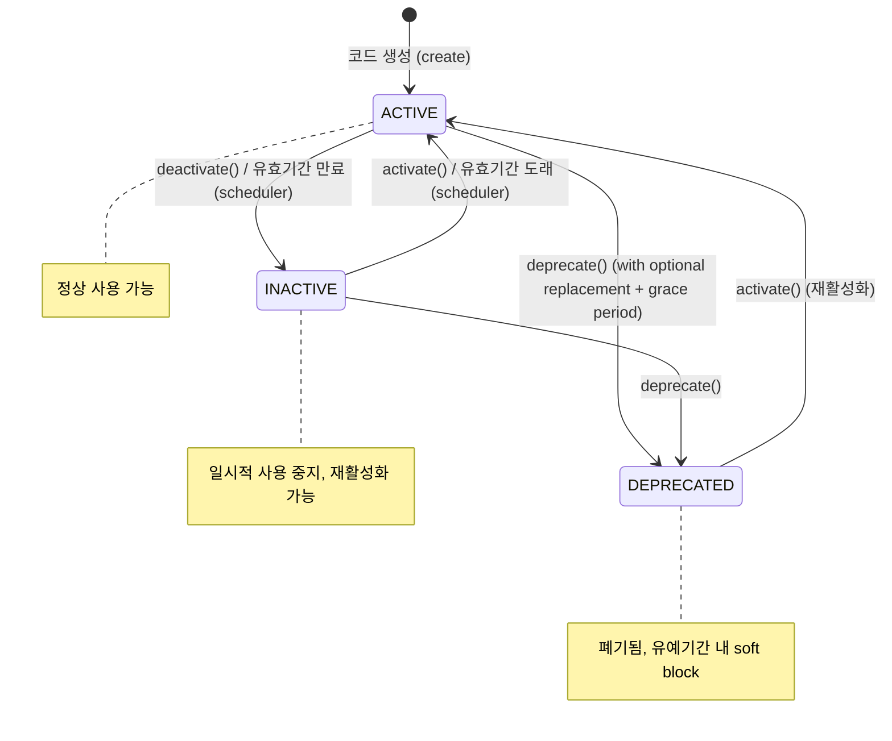
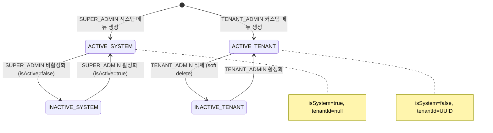
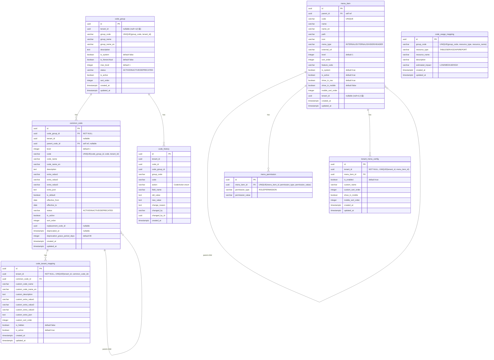

# Module 03: MDM Service — PRD 및 프로덕션 정책 분석

> **최종 업데이트**: 2026-02-10
> **분석 범위**: `services/mdm-service/`
> **문서 버전**: v2.0 (Phase A/B/C 확장)
> **포트**: 8087
> **패키지**: `com.hrsaas.mdm`

---

## 목차

- [1. 현재 구현 상태 요약](#1-현재-구현-상태-요약)
- [2. 정책 결정사항](#2-정책-결정사항)
- [3. 기능 요구사항 Gap 분석 (Phase A)](#3-기능-요구사항-gap-분석-phase-a)
- [4. 비즈니스 규칙 상세 (Phase B)](#4-비즈니스-규칙-상세-phase-b)
- [5. 서비스 연동 명세 (Phase C)](#5-서비스-연동-명세-phase-c)
- [6. 데이터 모델](#6-데이터-모델)
- [7. API 명세](#7-api-명세)
- [8. 보안/프라이버시](#8-보안프라이버시)
- [9. 성능/NFR](#9-성능nfr)
- [10. 추적성 매트릭스](#10-추적성-매트릭스)
- [11. 변경 이력](#11-변경-이력)

---

## 1. 현재 구현 상태 요약

### 1.1 구현 완료

| 기능 | 상태 | 위치 |
|------|------|------|
| 코드 그룹 CRUD | ✅ 완료 | `CodeGroupController`, `CodeGroupServiceImpl` |
| 코드 그룹 수정 API | ✅ 완료 | `CodeGroupController.update()` — PUT 엔드포인트 |
| 공통 코드 CRUD | ✅ 완료 | `CommonCodeController`, `CommonCodeServiceImpl` |
| 계층형 코드 (4레벨) | ✅ 완료 | `CommonCodeServiceImpl.validateCodeDepth()`, `getCodeTree()` |
| 테넌트 코드 오버레이 | ✅ 완료 | `TenantCodeController`, `TenantCodeServiceImpl` |
| 코드 변경 이력 (@Async) | ✅ 완료 | `CodeHistoryServiceImpl` — @Async + REQUIRES_NEW |
| 유사 코드 검색 (Levenshtein) | ✅ 완료 | `CodeSearchServiceImpl` — 유사도/중복 검색 |
| 영향도 분석 (DB 기반) | ✅ 완료 | `CodeImpactAnalyzerImpl` + `CodeUsageMappingRepository` |
| 코드 사용처 매핑 관리 | ✅ 완료 | `CodeUsageMappingController` — SUPER_ADMIN CRUD |
| 코드 임포트/엑스포트 (JSON) | ✅ 완료 | `CodeImportExportServiceImpl` — 검증 모드(dry run) 포함 |
| 코드 임포트/엑스포트 (Excel) | ✅ 완료 | `ExcelCodeImportExportServiceImpl` — Apache POI 기반 |
| Excel 임포트 템플릿 | ✅ 완료 | `GET /export/excel/template` — 빈 템플릿 다운로드 |
| 코드 일괄 상태 변경 | ✅ 완료 | `PATCH /bulk-status` — BulkCodeStatusChangeRequest |
| 코드 폐기 + 대체코드/유예기간 | ✅ 완료 | `CommonCode.deprecate(UUID, Integer)`, `DeprecateCodeRequest` |
| 코드 폐기 스케줄러 | ✅ 완료 | `CodeDeprecationScheduler` — 매일 00:00, 유예기간 경고/만료 이벤트 |
| 코드 유효기간 스케줄러 | ✅ 완료 | `CodeEffectiveScheduler` — 매일 01:00, 자동 활성/비활성 전환 |
| 시스템 코드 SUPER_ADMIN 권한 체크 | ✅ 완료 | `CommonCodeServiceImpl.requireSystemCodePermission()` |
| 메뉴 관리 시스템 | ✅ 완료 | `MenuController` — CRUD + 순서 변경 |
| 테넌트 메뉴 설정 | ✅ 완료 | `TenantMenuConfigController` — 활성화/비활성화, 커스텀 이름/순서 |
| 테넌트 커스텀 메뉴 CRUD | ✅ 완료 | `TenantCustomMenuController` — TENANT_ADMIN 전용 |
| 사용자 메뉴 조회 (역할/권한 필터) | ✅ 완료 | `UserMenuController` — `GET /api/v1/menus/me` |
| 메뉴 3계층 캐싱 | ✅ 완료 | `MenuCacheServiceImpl` — tree(24h)/tenant(1h)/user(15m) |
| 도메인 이벤트 (7종) | ✅ 완료 | CodeGroupCreated/Updated, CommonCodeCreated/Updated, CodeDeprecated, GracePeriodExpiring/Expired |
| RLS (Row Level Security) | ✅ 완료 | code_group, common_code, code_tenant_mapping, code_history, tenant_menu_config |
| HR 시드 데이터 (14그룹) | ✅ 완료 | V3 마이그레이션 — 직급, 직책, 부서유형, 휴가유형 등 |

### 1.2 미구현 / TODO

| 기능 | 상태 | 설명 | 구현 방향 |
|------|------|------|-----------|
| 이력 조회 성능 최적화 | ⚠️ 부분 | 인덱스 추가 완료, 파티셔닝 미적용 | code_history Range Partitioning (연도별) |
| 메뉴 JPA 정합성 검증 | ⚠️ 확인 필요 | MenuItem 엔티티 존재, SQL/JPA 간 스키마 동기 확인 필요 | ddl-auto=update로 관리 중 |
| CORS 프로덕션 설정 | ⚠️ 부분 | SecurityConfig에 개발 도메인만 | 환경별 도메인 설정 |

---

## 2. 정책 결정사항

### 2.1 시스템 코드 관리 권한 (결정 완료)

> **결정: SUPER_ADMIN만 시스템 코드 관리 가능**

| 구분 | 시스템 코드 (tenantId=null) | 테넌트 코드 (tenantId=UUID) |
|------|---------------------------|---------------------------|
| 생성 | SUPER_ADMIN | TENANT_ADMIN 이상 |
| 수정 | SUPER_ADMIN | TENANT_ADMIN 이상 |
| 삭제 | SUPER_ADMIN (시스템 코드 그룹 삭제 차단) | TENANT_ADMIN 이상 |
| 조회 | 인증된 사용자 | 인증된 사용자 (RLS 적용) |
| 상태 변경 | SUPER_ADMIN | TENANT_ADMIN 이상 |
| 커스터마이징 | N/A | HR_ADMIN 이상 |

**구현 상태**: `CommonCodeServiceImpl`과 `CodeGroupServiceImpl` 모두 서비스 레벨에서 `permissionChecker.requireRole("ROLE_SUPER_ADMIN")` 호출. 컨트롤러 `@PreAuthorize` 어노테이션은 HR_ADMIN 이상으로 설정되어 있으나, 서비스 레벨에서 시스템 코드 여부를 분기하여 SUPER_ADMIN 추가 검증.

### 2.2 영향도 분석 관리 방식 (결정 완료)

> **결정: DB 테이블(code_usage_mapping)로 관리**

V2 마이그레이션에서 `code_usage_mapping` 테이블 생성 완료. 11개 초기 시드 데이터 포함 (LEAVE_TYPE, GRADE, POSITION, DEPT_TYPE). `CodeImpactAnalyzerImpl`이 `CodeUsageMappingRepository`를 통해 DB에서 참조 정보를 조회.

SUPER_ADMIN 전용 관리 API: `/api/v1/admin/mdm/code-usages` (조회/생성/삭제)

### 2.3 임포트/엑스포트 형식 (결정 완료)

> **결정: JSON + Excel 모두 지원**

| 형식 | 임포트 | 엑스포트 | 용도 |
|------|--------|---------|------|
| JSON | ✅ 구현 | ✅ 구현 | API 연동, 시스템 간 데이터 이관 |
| Excel (.xlsx) | ✅ 구현 | ✅ 구현 | 실무자 편의, 대량 데이터 작업 |

Excel 구현: `ExcelCodeImportExportServiceImpl` (Apache POI `poi-ooxml:5.2.5`)
- 시트 구조: 시트1=코드그룹, 시트2=공통코드
- 계층 표현: level에 따라 코드명 앞에 들여쓰기
- 최대 임포트 행 수 제한: 5,000건 (`MAX_IMPORT_ROWS`)
- 빈 템플릿 다운로드 지원

### 2.4 코드 변경 이력 보존 (결정 완료)

> **결정: 무제한 보존**

**성능 최적화 현황:**
- V2 마이그레이션에서 인덱스 추가 완료: `(code_id, created_at DESC)`, `(tenant_id, created_at DESC)`
- Range Partitioning (연도별): 미적용 (향후 데이터 규모 증가 시 적용 예정)
- 조회 시 기본 페이지네이션 적용

### 2.5 테넌트 메뉴 관리 (결정 완료)

> **결정: TENANT_ADMIN이 커스텀 메뉴 추가 허용**

| 작업 | SUPER_ADMIN | TENANT_ADMIN | HR_ADMIN |
|------|-------------|--------------|----------|
| 시스템 메뉴 CRUD | ✅ | -- | -- |
| 시스템 메뉴 활성화/비활성화 | ✅ | ✅ | -- |
| 메뉴 이름/순서 커스터마이징 | ✅ | ✅ | -- |
| 커스텀 메뉴 추가/수정/삭제 | ✅ | ✅ (자기 테넌트) | -- |

**구현 상태**: `MenuItem` 엔티티에 `tenantId` 필드 추가 완료 (V2 마이그레이션). `TenantCustomMenuController`에서 `@permissionChecker.isTenantAdmin()` 권한 체크. 커스텀 메뉴 생성 시 `isSystem=false`, `tenantId=현재테넌트` 자동 설정.

### 2.6 코드 폐기(Deprecation) 정책 (결정 완료)

> **결정: 대체코드 지정 + 유예기간(기본 90일)**

**폐기 프로세스:**
1. 폐기 요청 시 **대체 코드(replacementCodeId)** 지정 (선택)
2. **유예기간(gracePeriodDays)** 설정 (기본 90일, 요청 시 변경 가능)
3. 상태를 `DEPRECATED`로 변경, `deprecatedAt` 기록
4. `CodeDeprecationScheduler` 매일 00:00 실행:
   - 유예기간 만료 7일 전: `CodeGracePeriodExpiringEvent` 발행
   - 유예기간 만료: `CodeGracePeriodExpiredEvent` 발행
5. 기존 데이터는 영구 유지

**구현 상태**: `CommonCode` 엔티티에 `replacementCodeId`, `deprecatedAt`, `deprecationGracePeriodDays` 필드 존재. `isGracePeriodActive()`, `isGracePeriodExpired()` 메서드 구현 완료.

---

## 3. 기능 요구사항 Gap 분석 (Phase A)

### 3.1 PRD vs 코드 비교표

> **PRD 출처**: `docs/deprecated/PRD.md` (FR-MDM 시리즈)
> **참고**: PRD에 7개의 MDM 관련 요구사항이 정의됨. 코드 스캔 결과 모두 구현 완료.

| ID | PRD 요구사항 | PRD 출처 | 코드 구현 상태 | 구현 위치 | Gap |
|----|-------------|---------|---------------|----------|-----|
| FR-MDM-001-01 | 공통코드 CRUD | FR-MDM-001 | ✅ 완전 구현 | `CommonCodeController`, `CommonCodeServiceImpl` | -- |
| FR-MDM-001-02 | 테넌트별 코드 사용 설정 | FR-MDM-001 | ✅ 완전 구현 | `TenantCodeController`, `CodeTenantMapping` 엔티티 | -- |
| FR-MDM-001-03 | 코드 변경 시 일괄 갱신 | FR-MDM-001 | ✅ 완전 구현 | `PATCH /bulk-status`, `BulkCodeStatusChangeRequest` | -- |
| FR-MDM-001-04 | 변경 이력 조회 | FR-MDM-001 | ✅ 완전 구현 | `CodeHistoryServiceImpl` — @Async 비동기 기록 | -- |
| FR-MDM-002-01 | 다단계 분류체계 | FR-MDM-002 | ✅ 완전 구현 | 4-level hierarchy, `getCodeTree()` | -- |
| FR-MDM-002-02 | 변경 영향도 시뮬레이션 | FR-MDM-002 | ✅ 완전 구현 | `CodeImpactAnalyzerImpl` + `code_usage_mapping` DB | -- |
| FR-MDM-002-03 | 유사/중복 코드 검색 | FR-MDM-002 | ✅ 완전 구현 | `CodeSearchServiceImpl` — Levenshtein distance | -- |

### 3.2 코드에만 있는 기능 (역분석)

PRD에 명시적 요구사항이 없지만, 코드에 구현된 기능들:

| FR ID (신규 부여) | 기능 | 구현 위치 | 비즈니스 가치 | PRD 반영 권장 |
|-------------------|------|----------|-------------|--------------|
| FR-MDM-008 | 메뉴 관리 시스템 (CRUD, 권한, 계층) | `MenuController`, `MenuServiceImpl` | 프론트엔드 네비게이션 관리 | ✅ 반영 필요 |
| FR-MDM-009 | 테넌트 메뉴 커스터마이징 (활성화/비활성화, 이름/순서 변경) | `TenantMenuConfigController` | 테넌트별 UI 맞춤화 | ✅ 반영 필요 |
| FR-MDM-010 | 사용자 메뉴 필터링 (역할/권한/테넌트 기반) | `UserMenuController`, `MenuServiceImpl.getUserMenus()` | RBAC 기반 메뉴 접근 제어 | ✅ 반영 필요 |
| FR-MDM-011 | 코드 폐기 + 대체코드 + 유예기간 | `CommonCode.deprecate()`, `CodeDeprecationScheduler` | 안전한 코드 라이프사이클 관리 | ✅ 반영 필요 |
| FR-MDM-012 | 코드 유효기간 자동 활성/비활성 | `CodeEffectiveScheduler` | 시간 기반 코드 자동 관리 | ✅ 반영 필요 |
| FR-MDM-013 | Excel 임포트/엑스포트 | `ExcelCodeImportExportServiceImpl` | 실무자 편의, 대량 데이터 작업 | ✅ 반영 필요 |
| FR-MDM-014 | 코드 사용처 매핑 (impact analysis DB) | `CodeUsageMappingController`, `CodeUsageMapping` | 영향도 분석 정확도 향상 | ✅ 반영 필요 |
| FR-MDM-015 | 3계층 메뉴 캐싱 (tree/tenant/user) | `MenuCacheServiceImpl` | 성능 최적화 | 내부 운영 사항 |
| FR-MDM-016 | 테넌트 코드 오버레이 (커스텀 이름, 숨기기/보이기) | `TenantCodeServiceImpl` | 테넌트별 코드 맞춤화 | ✅ 반영 필요 |
| FR-MDM-017 | 코드 임포트 검증 모드 (dry run) | `CodeImportExportServiceImpl.validateImport()` | 안전한 대량 임포트 | ✅ 반영 필요 |
| FR-MDM-018 | 테넌트 커스텀 메뉴 생성/수정/삭제 | `TenantCustomMenuController` | 테넌트 자체 네비게이션 확장 | ✅ 반영 필요 |
| FR-MDM-019 | 코드 일괄 상태 변경 | `PATCH /bulk-status` | 대량 코드 운영 편의 | ✅ 반영 필요 |
| FR-MDM-020 | 시스템 코드 SUPER_ADMIN 전용 | `requireSystemCodePermission()` | 보안 강화 | ✅ 반영 필요 |

### 3.3 Gap 해소 우선순위 로드맵

| 우선순위 | Gap ID | 항목 | 현재 상태 | 해소 방향 | 의존성 | 예상 복잡도 |
|---------|--------|------|----------|----------|--------|-----------|
| **MEDIUM** | MDM-G10 | 이력 테이블 파티셔닝 | 인덱스만 적용 | code_history Range Partitioning (연도별) | DBA 작업 | 중간 |
| **LOW** | MDM-G06 | 메뉴 JPA-SQL 정합성 검증 | JPA 엔티티 존재, ddl-auto=update | Flyway 마이그레이션과 JPA 스키마 교차 검증 | 없음 | 낮음 |

### 3.4 PRD 구현률 요약

| 상태 | 수 | 비율 |
|------|---|------|
| ✅ 완전 구현 (PRD 요구사항) | 7 | **100%** |
| ✅ 코드 전용 기능 (PRD 미명시) | 13 | -- |
| ⚠️ 부분 구현 | 0 | 0% |
| -- 미구현 | 0 | 0% |

**MDM Service는 PRD 요구사항을 100% 구현한 상태**. 추가적으로 13개의 코드 전용 기능이 구현되어 있으며, 이는 PRD에 소급 반영이 권장됨.

---

## 4. 비즈니스 규칙 상세 (Phase B)

### 4.1 상태 머신

#### 4.1.1 코드 상태 (CommonCode.status)



**상태 설명:**

| 상태 | DB 표현 | 신규 사용 | 기존 데이터 | 전이 조건 |
|------|---------|----------|-----------|----------|
| ACTIVE | `status='ACTIVE'`, `is_active=true` | ✅ 허용 | 유지 | 기본 상태, effectiveFrom 도래 시 자동 전환 |
| INACTIVE | `status='INACTIVE'`, `is_active=false` | -- 차단 | 유지 | deactivate 호출, effectiveTo 만료 시 자동 전환 |
| DEPRECATED | `status='DEPRECATED'`, `is_active=false` | -- 차단 (soft block in grace period) | 영구 유지 | deprecate 호출, 유예기간 후 hard block |

**유예기간 관리:**
- 기본 유예기간: 90일 (`deprecationGracePeriodDays` 필드)
- 유예기간 만료 7일 전: `CodeGracePeriodExpiringEvent` 발행 (스케줄러, 매일 00:00)
- 유예기간 만료 후: `CodeGracePeriodExpiredEvent` 발행 (스케줄러, 매일 00:00)
- 유예기간 활성 확인: `CommonCode.isGracePeriodActive()` → `deprecatedAt + gracePeriodDays > NOW()`

**유효기간 기반 자동 전환 (CodeEffectiveScheduler, 매일 01:00):**
- `effectiveFrom <= TODAY` AND `status = INACTIVE` → `ACTIVE`로 자동 전환
- `effectiveTo < TODAY` AND `status = ACTIVE` → `INACTIVE`로 자동 전환
- 상태 변경 시 `CodeHistory` 기록 + `CommonCodeUpdatedEvent` 발행

#### 4.1.2 메뉴 생명주기 (MenuItem)



**메뉴 구분:**

| 구분 | isSystem | tenantId | CRUD 권한 | 삭제 방식 |
|------|----------|----------|----------|----------|
| 시스템 메뉴 | true | null | SUPER_ADMIN 전용 | 삭제 불가 (`MDM_MENU_004`) |
| 테넌트 커스텀 메뉴 | false | UUID | TENANT_ADMIN (자기 테넌트) | Soft delete (isActive=false) |

### 4.2 유효성 검증 규칙 카탈로그

#### 4.2.1 코드 그룹 생성 (CreateCodeGroupRequest)

| 필드 | 규칙 | 에러 |
|------|------|------|
| `groupCode` | 필수, 최대 50자 | 400 |
| `groupName` | 필수, 최대 100자 | 400 |
| `groupCode + tenantId` | 유니크 제약 | MDM_003 (409) |
| `tenantId == null` | SUPER_ADMIN 권한 필요 | 403 |

#### 4.2.2 공통 코드 생성 (CreateCommonCodeRequest)

| 필드 | 규칙 | 에러 |
|------|------|------|
| `codeGroupId` | 필수, 유효한 코드 그룹 ID | MDM_001 (404) |
| `code` | 필수, 최대 50자 | 400 |
| `codeName` | 필수, 최대 100자 | 400 |
| `code + codeGroupId + tenantId` | 유니크 제약 | MDM_003 (409) |
| `parentCodeId` | 설정 시 부모 코드 존재 확인 | MDM_002 (404) |
| 계층 깊이 | 최대 4레벨 (대/중/소/세분류) | MDM_004 (400) |
| 시스템 코드 그룹 | `codeGroup.tenantId == null` → SUPER_ADMIN 필요 | 403 |

**서비스 레벨 검증 (순서대로):**

| # | 검증 | 에러 코드 |
|---|------|----------|
| 1 | codeGroupId → CodeGroup 조회 | MDM_001 |
| 2 | 시스템 코드 권한 체크 (`requireSystemCodePermission`) | 403 |
| 3 | 코드 중복 검사 (`existsByCodeGroupIdAndCodeAndTenantId`) | MDM_003 |
| 4 | parentCodeId → 부모 코드 조회 | MDM_002 |
| 5 | 계층 깊이 검증 (`validateCodeDepth`) | MDM_004 |

#### 4.2.3 코드 폐기 (DeprecateCodeRequest)

| 필드 | 규칙 | 기본값 |
|------|------|--------|
| `replacementCodeId` | 선택, 유효한 코드 ID | null |
| `gracePeriodDays` | 선택, 양수 | 90 |

#### 4.2.4 코드 일괄 상태 변경 (BulkCodeStatusChangeRequest)

| 필드 | 규칙 | 에러 |
|------|------|------|
| `codeIds` | 필수, 비어있지 않음 | 400 |
| `targetStatus` | 필수, ACTIVE/INACTIVE/DEPRECATED 중 하나 | 400 |
| 각 코드별 | 시스템 코드 권한 체크 | 개별 에러 (응답에 포함) |

#### 4.2.5 메뉴 생성 (CreateMenuItemRequest)

| 필드 | 규칙 | 에러 |
|------|------|------|
| `code` | 필수, 유니크 (전역) | MDM_MENU_002 (409) |
| `name` | 필수, 최대 100자 | 400 |
| `parentId` | 설정 시 부모 메뉴 존재 확인 | MDM_MENU_001 (404) |
| 자기 참조 | `parentId != id` (수정 시) | MDM_MENU_003 (400) |

#### 4.2.6 임포트 검증

| 검증 항목 | 규칙 | 에러 |
|-----------|------|------|
| Excel 행 수 | 최대 5,000건 | RuntimeException |
| 필수 필드 | groupCode, code, codeName | 해당 행 스킵 |
| 시트 이름 | "공통코드" 또는 인덱스 1 | RuntimeException |
| JSON 검증 모드 | `validateOnly=true` → DB 변경 없음 | -- |

### 4.3 계산 공식/로직 명세

#### 4.3.1 영향도 점수 산출

```
impactScore = min(100,
    min(30, childCount * 10)       // 하위 코드: 각 10점, 최대 30점
  + min(30, tenantMappingCount * 15)  // 테넌트 매핑: 각 15점, 최대 30점
  + min(40, resourceCount * 10)    // 참조 리소스: 각 10점, 최대 40점
)

// 삭제 영향도: +20점 추가
deletionImpactScore = min(100, impactScore + 20)
```

**영향도 레벨:**

| 레벨 | 점수 범위 | 설명 | 삭제 허용 |
|------|----------|------|----------|
| LOW | 0~25 | 안전한 변경 | ✅ |
| MEDIUM | 26~50 | 모니터링 권장 | ✅ |
| HIGH | 51~75 | 사전 공지 및 테스트 필요 | ✅ |
| CRITICAL | 76~100 | 변경 불가 (삭제 시) | -- (하위 코드 있으면 무조건 불가) |

**삭제 가능 여부 판정 (`canDelete`):**
```
IF childCount > 0:
    → 삭제 불가 (하위 코드 존재)
IF impactLevel == CRITICAL:
    → 삭제 불가
ELSE:
    → 삭제 가능
```

#### 4.3.2 유사도 계산 (Levenshtein Distance)

```
similarity = 1.0 - (levenshteinDistance(str1, str2) / max(len(str1), len(str2)))

// 포함 관계 보너스
IF str1.contains(str2) OR str2.contains(str1):
    similarity += 0.1

// 검색 대상 필드: code, codeName, codeNameEn, description
// 가장 높은 유사도의 필드를 matchedField로 반환
```

**임계값:**

| 용도 | 임계값 | 설명 |
|------|--------|------|
| 일반 검색 | 0.6 (60%) | 기본 유사도 검색 |
| 중복 검사 | 0.85 (85%) | 중복 코드 판단 |

#### 4.3.3 유예기간 판정

```
graceEnd = deprecatedAt + (deprecationGracePeriodDays * 24 * 60 * 60) seconds

isGracePeriodActive():
    IF deprecatedAt == null OR deprecationGracePeriodDays == null:
        → false
    RETURN Instant.now().isBefore(graceEnd)

isGracePeriodExpired():
    IF deprecatedAt == null OR deprecationGracePeriodDays == null:
        → false
    RETURN !Instant.now().isBefore(graceEnd)
```

#### 4.3.4 코드 유효기간 판정

```
isEffective():
    today = LocalDate.now()
    afterStart = (effectiveFrom == null) OR (!today.isBefore(effectiveFrom))
    beforeEnd = (effectiveTo == null) OR (!today.isAfter(effectiveTo))
    RETURN afterStart AND beforeEnd AND isActive
```

#### 4.3.5 메뉴 접근 판정 (`canAccessMenu`)

```
IF !menu.isActive OR !menu.showInNav:
    → false

IF menu.permissions is EMPTY:
    → true (모든 인증 사용자)

hasRequiredRole = permissions.filter(ROLE).any(role => userRoles.contains("ROLE_" + role.value))
hasRequiredPermission = permissions.filter(PERMISSION).any(perm => hasPermission(userPermissions, perm.value))

IF ROLE 요구사항만 존재:
    RETURN hasRequiredRole
IF PERMISSION 요구사항만 존재:
    RETURN hasRequiredPermission
IF 둘 다 존재:
    RETURN hasRequiredRole OR hasRequiredPermission
```

**권한 와일드카드 매칭 (`hasPermission`):**
```
IF userPermissions.contains("*:*"):       → true (전체 접근)
IF userPermissions.contains(required):     → true (정확 일치)
IF userPermissions.contains(resource:*"):  → true (리소스 와일드카드)
IF required = "resource:action:scope":
    IF userPermissions.contains("resource:action"):  → true (스코프 확장)
```

### 4.4 데이터 생명주기 정책

| 데이터 | 생성 시점 | 보존 기간 | 삭제 방식 | 비고 |
|--------|----------|----------|----------|------|
| **code_group** | 관리자 생성 | 영구 | status=DEPRECATED (논리 삭제) | 시스템 코드 그룹 삭제 차단 |
| **common_code** | 관리자 생성 | 영구 | 물리 삭제 (SUPER_ADMIN/TENANT_ADMIN) | 삭제 전 영향도 분석 권장 |
| **code_tenant_mapping** | HR_ADMIN 커스터마이징 시 | 영구 | 초기화 시 물리 삭제 | 테넌트별 코드 커스터마이징 |
| **code_history** | 코드 변경 시 (@Async) | **무제한 보존** | 물리 삭제 없음 | 향후 연도별 파티셔닝 예정 |
| **code_usage_mapping** | SUPER_ADMIN 생성 | 영구 | 물리 삭제 (SUPER_ADMIN) | 영향도 분석 참조 데이터 |
| **menu_item** | SUPER_ADMIN/TENANT_ADMIN 생성 | 영구 | Soft delete (isActive=false) | 시스템 메뉴 삭제 불가 |
| **menu_permission** | 메뉴 생성/수정 시 | 메뉴와 동일 | CASCADE (orphanRemoval) | 메뉴 삭제 시 함께 삭제 |
| **tenant_menu_config** | TENANT_ADMIN 설정 시 | 영구 | 초기화 시 물리 삭제 | 테넌트별 메뉴 설정 |

### 4.5 엣지 케이스 카탈로그

| # | 시나리오 | 현재 동작 | 기대 동작 | 상태 |
|---|---------|----------|----------|------|
| EC-01 | 순환 참조: 부모-자식 코드 순환 참조 설정 | `validateCodeDepth()`에서 4레벨 초과 감지 가능 | 순환 참조 명시적 감지 로직 추가 권장 | ⚠️ 부분 |
| EC-02 | 활성 하위 코드가 있는 코드 폐기 | 부모만 폐기, 하위 코드는 유지 | 경고 메시지 + 하위 코드 일괄 폐기 옵션 | ⚠️ 하위 코드 미처리 |
| EC-03 | 일괄 임포트 부분 실패 | 성공 건만 저장, 실패 건은 에러 목록으로 반환 | 현행 유지 (partial success) | ✅ 정상 |
| EC-04 | 동시 캐시 무효화 요청 | `@CacheEvict(allEntries=true)` → 전체 무효화 | 현행 유지 (Redis atomic 보장) | ✅ 정상 |
| EC-05 | 비-SUPER_ADMIN이 시스템 코드 수정 시도 | `requireSystemCodePermission()` → `requireRole()` 예외 발생 | 현행 유지 (403) | ✅ 정상 |
| EC-06 | 유예기간 만료 후 코드가 여전히 참조되는 경우 | `CodeGracePeriodExpiredEvent` 발행만 수행 | 이벤트 수신 서비스에서 대응 필요 | ⚠️ 소비자 미구현 |
| EC-07 | 중복 메뉴 코드 생성 | `existsByCode()` → `MDM_MENU_002` 예외 | 현행 유지 (409) | ✅ 정상 |
| EC-08 | 시스템 메뉴 삭제 시도 | `MDM_MENU_004` 예외 발생 | 현행 유지 (시스템 메뉴 보호) | ✅ 정상 |
| EC-09 | 다른 테넌트의 커스텀 메뉴 수정 시도 | `MDM_MENU_006` 예외 발생 (테넌트 소유권 체크) | 현행 유지 (403) | ✅ 정상 |
| EC-10 | Excel 임포트 5,000건 초과 | `RuntimeException` 발생 | 현행 유지 (명시적 제한) | ✅ 정상 |
| EC-11 | 코드 그룹 삭제 시 하위 공통 코드 존재 | `CascadeType.ALL, orphanRemoval=true` → 하위 코드 함께 삭제 | 영향도 분석 후 삭제 확인 프로세스 권장 | ⚠️ 경고 없이 cascade |
| EC-12 | @Async 이력 기록 중 주 트랜잭션 롤백 | `REQUIRES_NEW` → 이력은 기록됨 (의도적 설계) | 현행 유지 | ✅ 정상 (의도적) |

---

## 5. 서비스 연동 명세 (Phase C)

### 5.1 연동 아키텍처

```mermaid
graph TB
    subgraph "MDM Service (8087)"
        CG[CodeGroupController]
        CC[CommonCodeController]
        TC[TenantCodeController]
        IE[CodeImportExportController]
        CU[CodeUsageMappingController]
        MC[MenuController]
        TC2[TenantMenuConfigController]
        TCM[TenantCustomMenuController]
        UM[UserMenuController]

        CGS[CodeGroupServiceImpl]
        CCS[CommonCodeServiceImpl]
        TCS[TenantCodeServiceImpl]
        CIA[CodeImpactAnalyzerImpl]
        CSS[CodeSearchServiceImpl]
        CHS[CodeHistoryServiceImpl]
        IES[CodeImportExportServiceImpl]
        EIS[ExcelCodeImportExportServiceImpl]
        MS[MenuServiceImpl]
        MCS[MenuCacheServiceImpl]

        CDS[CodeDeprecationScheduler]
        CES[CodeEffectiveScheduler]
    end

    subgraph "Common Modules"
        CSF[SecurityFilter<br/>common-security]
        PC[PermissionChecker<br/>common-security]
        EP[EventPublisher<br/>common-event]
        TC3[TenantContext<br/>common-tenant]
    end

    subgraph "Infrastructure"
        PG[(PostgreSQL<br/>tenant_common)]
        RD[(Redis)]
        SNS[AWS SNS]
    end

    subgraph "Consuming Services"
        EMP[Employee Service<br/>8084]
        ORG[Organization Service<br/>8083]
        ATT[Attendance Service<br/>8085]
        APP[Approval Service<br/>8086]
        NOT[Notification Service<br/>8088]
        GW[Gateway Service<br/>8080]
    end

    %% Event publishing
    CCS -->|Events| EP
    CGS -->|Events| EP
    CDS -->|Grace Period Events| EP
    CES -->|Status Change Events| EP
    EP -->|SNS| SNS

    %% Data stores
    CCS --> PG
    CGS --> PG
    TCS --> PG
    CIA --> PG
    CHS --> PG
    MCS --> RD

    %% Consuming services (code lookup via REST)
    EMP -.->|GRADE, POSITION, EMPLOYMENT_TYPE| CC
    ORG -.->|DEPT_TYPE| CC
    ATT -.->|LEAVE_TYPE| CC
    APP -.->|APPROVAL_TYPE, DOCUMENT_TYPE| CC
    GW -.->|메뉴 조회| UM
```



### 5.2 REST API 연동 (Feign Client 기반)

#### 5.2.1 MDM → 외부 서비스

MDM Service는 **Feign Client를 사용하지 않음**. MDM은 데이터 제공자(Provider) 역할로서, 다른 서비스가 MDM의 REST API를 호출하여 코드 데이터를 조회합니다.

#### 5.2.2 외부 서비스 → MDM

MDM Service의 REST API를 호출하는 서비스 목록:

| 소비자 서비스 | 호출 엔드포인트 | 용도 | 사용 코드 그룹 |
|-------------|---------------|------|---------------|
| Employee Service | `GET /api/v1/mdm/common-codes/group/{groupCode}` | 직급/직책/고용형태 코드 조회 | GRADE, POSITION, EMPLOYMENT_TYPE |
| Organization Service | `GET /api/v1/mdm/common-codes/group/{groupCode}` | 부서유형 코드 조회 | DEPT_TYPE |
| Attendance Service | `GET /api/v1/mdm/common-codes/group/{groupCode}` | 휴가유형/근무형태 조회 | LEAVE_TYPE |
| Approval Service | `GET /api/v1/mdm/common-codes/group/{groupCode}` | 결재유형/문서유형 조회 | APPROVAL_TYPE, DOCUMENT_TYPE |
| Notification Service | `GET /api/v1/mdm/common-codes/group/{groupCode}` | 알림유형 코드 조회 | (커스텀 그룹) |
| Gateway/Frontend | `GET /api/v1/menus/me` | 사용자 메뉴 조회 | -- (메뉴 시스템) |

### 5.3 이벤트 연동 (SNS/SQS)

#### 5.3.1 MDM Service가 발행하는 이벤트

| # | 이벤트 클래스 | SNS 토픽 | 발행 시점 | 페이로드 | 예상 소비자 |
|---|-------------|---------|----------|---------|-----------|
| 1 | `CodeGroupCreatedEvent` | `EventTopics.CODE_GROUP_CREATED` | 코드 그룹 생성 시 | `{ codeGroupId, groupCode, groupName }` | 없음 (향후 Audit) |
| 2 | `CodeGroupUpdatedEvent` | `EventTopics.CODE_GROUP_UPDATED` | 코드 그룹 수정 시 | `{ codeGroupId, groupCode, groupName }` | 없음 (향후 Audit) |
| 3 | `CommonCodeCreatedEvent` | `EventTopics.COMMON_CODE_CREATED` | 공통 코드 생성 시 | `{ codeId, groupCode, code, codeName }` | 없음 (향후 Audit) |
| 4 | `CommonCodeUpdatedEvent` | `EventTopics.COMMON_CODE_UPDATED` | 공통 코드 수정/상태변경 시 | `{ codeId, groupCode, code, codeName, isActive }` | 소비 서비스 캐시 무효화 |
| 5 | `CodeDeprecatedEvent` | `EventTopics.CODE_DEPRECATED` | 코드 폐기 시 | `{ codeId, groupCode, code, replacementCodeId, gracePeriodDays, deprecatedAt }` | 참조 서비스 알림 |
| 6 | `CodeGracePeriodExpiringEvent` | (EventPublisher 기본 토픽) | 유예기간 만료 7일 전 (스케줄러) | `{ codeId, groupCode, code, expiresAt, daysRemaining }` | Notification, Admin |
| 7 | `CodeGracePeriodExpiredEvent` | (EventPublisher 기본 토픽) | 유예기간 만료 시 (스케줄러) | `{ codeId, groupCode, code }` | 참조 서비스 (hard block 적용) |

#### 5.3.2 MDM Service가 소비하는 이벤트

현재 없음. MDM은 이벤트 발행만 수행합니다.

### 5.4 데이터 동기화 흐름

#### 5.4.1 코드 데이터 동기화

```
MDM Service (common_code) → 소비 서비스 (Feign 호출 또는 캐시)

- 동기화 방식: 호출 시 조회 (RESTful)
- 캐싱: MDM 내부 Redis 캐시 (1h TTL)
- 일관성: 코드 변경 시 @CacheEvict + CommonCodeUpdatedEvent 발행
- 소비 서비스 캐싱: 각 서비스에서 자체 캐시 관리 (이벤트 수신 시 무효화 권장)
```

#### 5.4.2 메뉴 데이터 동기화

```
MDM Service (menu_item) → Frontend (REST 호출)

- 조회 경로: GET /api/v1/menus/me
- 캐싱: 3계층 (menu:tree 24h → menu:tenant 1h → menu:user 15m)
- 무효화: 메뉴/테넌트설정 변경 시 전체 캐시 무효화
```

### 5.5 통합 테스트 시나리오

| # | 시나리오 | 관련 서비스 | 기대 결과 | 상태 |
|---|---------|-----------|----------|------|
| IT-01 | 코드 생성 → 이벤트 발행 → 소비 서비스 수신 | MDM + Employee/Org | 이벤트 수신 확인 | -- 미작성 |
| IT-02 | 코드 폐기 → 유예기간 경고 → 만료 이벤트 | MDM 단독 | 스케줄러 정상 동작, 이벤트 발행 | -- 미작성 |
| IT-03 | Excel 임포트 → 검증 → 저장 → 이력 기록 | MDM 단독 | 5,000건 미만 정상 처리, 초과 시 에러 | -- 미작성 |
| IT-04 | 시스템 코드 수정 → SUPER_ADMIN 아닌 사용자 | MDM 단독 | 403 Forbidden 반환 | -- 미작성 |
| IT-05 | 메뉴 CRUD → 캐시 무효화 → 사용자 메뉴 재조회 | MDM 단독 | 변경된 메뉴가 즉시 반영 | -- 미작성 |
| IT-06 | 테넌트 A 코드 → 테넌트 B에서 접근 불가 (RLS) | MDM 단독 | 테넌트 격리 확인 | -- 미작성 |
| IT-07 | 코드 유효기간 설정 → 스케줄러 자동 활성/비활성 | MDM 단독 | effectiveFrom/effectiveTo에 따른 상태 전환 | -- 미작성 |
| IT-08 | 영향도 분석 → DB 기반 사용처 조회 → 점수 산출 | MDM 단독 | code_usage_mapping 기반 정확한 점수 | -- 미작성 |

---

## 6. 데이터 모델

### 6.1 테이블 목록 (tenant_common 스키마)

| 테이블 | 상태 | 용도 | RLS |
|--------|------|------|-----|
| `code_group` | ✅ 사용 중 | 코드 그룹 | ✅ 적용 |
| `common_code` | ✅ 사용 중 | 공통 코드 | ✅ 적용 |
| `code_tenant_mapping` | ✅ 사용 중 | 테넌트 코드 오버레이 | ✅ 적용 |
| `code_history` | ✅ 사용 중 | 코드 변경 이력 | ✅ 적용 |
| `code_usage_mapping` | ✅ 사용 중 | 영향도 분석 참조 매핑 | -- 미적용 (SUPER_ADMIN 전역) |
| `menu_item` | ✅ 사용 중 | 메뉴 항목 | -- 미적용 (시스템 전역) |
| `menu_permission` | ✅ 사용 중 | 메뉴 권한 매핑 | -- 미적용 (시스템 전역) |
| `tenant_menu_config` | ✅ 사용 중 | 테넌트 메뉴 설정 | ✅ 적용 |

**RLS 미적용 이유**:
- `code_usage_mapping`: SUPER_ADMIN만 관리하는 전역 참조 데이터
- `menu_item`, `menu_permission`: 모든 테넌트가 공유하는 시스템 메뉴 데이터. 테넌트 커스텀 메뉴는 `tenantId` 필드로 서비스 레벨 필터링.

### 6.2 ERD



### 6.3 인덱스

| 테이블 | 인덱스 | 컬럼 | 비고 |
|--------|--------|------|------|
| code_group | `uk_code_group_code_tenant` (UNIQUE) | `(group_code, tenant_id)` | |
| common_code | `uk_common_code_group_code_tenant` (UNIQUE) | `(code_group_id, code, tenant_id)` | |
| common_code | `idx_common_code_status` | `(status)` | V2 추가 |
| common_code | `idx_common_code_effective` | `(effective_from, effective_to)` | V2 추가 |
| code_tenant_mapping | `uk_tenant_code_mapping` (UNIQUE) | `(tenant_id, common_code_id)` | |
| code_history | `idx_code_history_code_created` | `(code_id, created_at DESC)` | V2 추가 |
| code_history | `idx_code_history_tenant_created` | `(tenant_id, created_at DESC)` | V2 추가 |
| code_usage_mapping | `uk_code_usage_group_resource` (UNIQUE) | `(group_code, resource_type, resource_name)` | V2 추가 |
| code_usage_mapping | `idx_code_usage_mapping_group` | `(group_code)` | V2 추가 |
| menu_item | `uk_menu_item_code` (UNIQUE) | `(code)` | |
| menu_item | `idx_menu_item_tenant` | `(tenant_id)` | V2 추가 |
| menu_permission | `uk_menu_perm` (UNIQUE) | `(menu_item_id, permission_type, permission_value)` | |
| tenant_menu_config | `uk_tenant_menu_config` (UNIQUE) | `(tenant_id, menu_item_id)` | |

### 6.4 Flyway 마이그레이션 이력

| 버전 | 파일 | 내용 |
|------|------|------|
| V1 | `V1__init_mdm.sql` | 초기 테이블 7개 (code_group, common_code, code_tenant_mapping, code_history, menu_item, menu_permission, tenant_menu_config) + 메뉴 시드 데이터 |
| V2 | `V2__add_indexes_and_schema_updates.sql` | 성능 인덱스, code_usage_mapping 테이블, 폐기 컬럼(replacement_code_id, deprecated_at, deprecation_grace_period_days), menu_item.tenant_id |
| V3 | `V3__seed_hr_codes.sql` | HR 시드 코드 14그룹: GRADE(10), POSITION(10), DEPT_TYPE(6), LEAVE_TYPE(15), EMPLOYMENT_TYPE(5), CONTRACT_TYPE(4), GENDER(3), MARITAL_STATUS(3), EDUCATION_LEVEL(7), BANK_CODE(20), APPROVAL_TYPE(10), DOCUMENT_TYPE(20), COUNTRY_CODE(30), CURRENCY_CODE(30) |

### 6.5 시드 데이터 현황

| 그룹 코드 | 그룹명 | 계층형 | 코드 수 | 비고 |
|-----------|--------|--------|---------|------|
| GRADE | 직급 | N | 10 | G1(사원)~G10(부사장) |
| POSITION | 직책 | N | 10 | P1(팀원)~P10(회장) |
| DEPT_TYPE | 부서유형 | N | 6 | DEPT, TEAM, DIV, CENTER, BIZ, BRANCH |
| LEAVE_TYPE | 휴가유형 | Y (2레벨) | 15 | 연차/병가/경조 등 + 연차 하위 4개 |
| EMPLOYMENT_TYPE | 고용형태 | N | 5 | FT, CT, PT, IS, AD |
| CONTRACT_TYPE | 계약유형 | N | 4 | INDEF, FIXED, PART, FREELANCE |
| GENDER | 성별 | N | 3 | M, F, O |
| MARITAL_STATUS | 혼인상태 | N | 3 | S, M, D |
| EDUCATION_LEVEL | 학력 | N | 7 | MS~PHD, OTHER |
| BANK_CODE | 은행코드 | N | 20 | KB, SHINHAN 등 (extraValue1=은행코드번호) |
| APPROVAL_TYPE | 결재유형 | N | 10 | LEAVE, OT, BT, EXP 등 |
| DOCUMENT_TYPE | 문서유형 | Y (2레벨) | 20 | HR/FIN/ADMIN/LEGAL/CERT + 하위 |
| COUNTRY_CODE | 국가코드 | N | 30 | KR, US, JP, CN 등 |
| CURRENCY_CODE | 통화코드 | N | 30 | KRW, USD, JPY 등 (extraValue1=통화기호) |

---

## 7. API 명세

### 7.1 코드 그룹 API (`/api/v1/mdm/code-groups`)

| Method | Path | 권한 | 설명 | 요청 | 응답 |
|--------|------|------|------|------|------|
| `POST` | `` | HR_ADMIN+ (시스템: SUPER_ADMIN) | 코드 그룹 생성 | `CreateCodeGroupRequest` | `CodeGroupResponse` |
| `GET` | `/{groupCode}` | 인증 | 코드 그룹 조회 | -- | `CodeGroupResponse` |
| `GET` | `` | 인증 | 코드 그룹 목록 | -- | `List<CodeGroupResponse>` |
| `PUT` | `/{id}` | HR_ADMIN+ (시스템: SUPER_ADMIN) | 코드 그룹 수정 | `UpdateCodeGroupRequest` | `CodeGroupResponse` |
| `DELETE` | `/{id}` | TENANT_ADMIN+ (시스템: 삭제 차단) | 코드 그룹 삭제 | -- | void |

### 7.2 공통 코드 API (`/api/v1/mdm/common-codes`)

| Method | Path | 권한 | 설명 | 요청 | 응답 |
|--------|------|------|------|------|------|
| `POST` | `` | HR_ADMIN+ (시스템: SUPER_ADMIN) | 코드 생성 | `CreateCommonCodeRequest` | `CommonCodeResponse` |
| `GET` | `` | 인증 | 코드 목록 (페이징) | `?keyword=&groupCode=&status=&page=&size=` | `PageResponse<CommonCodeResponse>` |
| `GET` | `/{id}` | 인증 | 코드 상세 조회 | -- | `CommonCodeResponse` |
| `GET` | `/group/{groupCode}` | 인증 | 그룹별 코드 목록 | -- | `List<CommonCodeResponse>` |
| `GET` | `/group/{groupCode}/code/{code}` | 인증 | 특정 코드 조회 | -- | `CommonCodeResponse` |
| `GET` | `/tree` | 인증 | 계층형 트리 조회 | `?groupCode=` | `List<CodeTreeResponse>` |
| `PUT` | `/{id}` | HR_ADMIN+ (시스템: SUPER_ADMIN) | 코드 수정 | `UpdateCommonCodeRequest` | `CommonCodeResponse` |
| `PUT` | `/{id}/activate` | HR_ADMIN+ (시스템: SUPER_ADMIN) | 코드 활성화 | -- | `CommonCodeResponse` |
| `PUT` | `/{id}/deactivate` | HR_ADMIN+ (시스템: SUPER_ADMIN) | 코드 비활성화 | -- | `CommonCodeResponse` |
| `PUT` | `/{id}/deprecate` | TENANT_ADMIN+ (시스템: SUPER_ADMIN) | 코드 폐기 | `DeprecateCodeRequest` (선택) | `CommonCodeResponse` |
| `PATCH` | `/bulk-status` | HR_ADMIN+ (시스템: SUPER_ADMIN) | 일괄 상태 변경 | `BulkCodeStatusChangeRequest` | `BulkCodeStatusChangeResponse` |
| `DELETE` | `/{id}` | TENANT_ADMIN+ (시스템: SUPER_ADMIN) | 코드 삭제 | -- | void |
| `GET` | `/{id}/history` | 인증 | 변경 이력 조회 | -- | `List<CodeHistoryResponse>` |
| `GET` | `/history/group/{groupCode}` | 인증 | 그룹별 이력 | -- | `List<CodeHistoryResponse>` |
| `GET` | `/search` | 인증 | 유사 코드 검색 | `?keyword=&groupCode=&threshold=0.6&maxResults=20&activeOnly=true` | `List<SimilarCodeResponse>` |
| `POST` | `/check-duplicate` | 인증 | 중복 검사 | `?groupCode=&codeName=` | `List<SimilarCodeResponse>` |
| `GET` | `/{id}/impact` | HR_ADMIN+ | 변경 영향도 | -- | `CodeImpactResponse` |
| `GET` | `/{id}/impact/delete` | TENANT_ADMIN+ | 삭제 영향도 | -- | `CodeImpactResponse` |
| `GET` | `/{id}/impact/deprecate` | TENANT_ADMIN+ | 폐기 영향도 | -- | `CodeImpactResponse` |

### 7.3 테넌트 코드 API (`/api/v1/mdm/tenant-codes`)

| Method | Path | 권한 | 설명 |
|--------|------|------|------|
| `GET` | `/{codeId}` | 인증 | 테넌트 코드 조회 |
| `GET` | `?groupCode=` | 인증 | 그룹별 테넌트 코드 |
| `PUT` | `/{codeId}` | HR_ADMIN+ | 커스터마이징 수정 |
| `POST` | `/{codeId}/hide` | HR_ADMIN+ | 코드 숨기기 |
| `POST` | `/{codeId}/show` | HR_ADMIN+ | 코드 보이기 |
| `DELETE` | `/{codeId}` | HR_ADMIN+ | 원본으로 복원 |

### 7.4 임포트/엑스포트 API (`/api/v1/mdm`)

| Method | Path | 권한 | 설명 |
|--------|------|------|------|
| `POST` | `/import` | TENANT_ADMIN+ | JSON 코드 임포트 |
| `POST` | `/import/validate` | TENANT_ADMIN+ | 임포트 검증만 (dry run) |
| `GET` | `/export` | HR_ADMIN+ | 전체 코드 엑스포트 (JSON) |
| `GET` | `/export/groups?groupCodes=` | HR_ADMIN+ | 특정 그룹 엑스포트 (JSON) |
| `GET` | `/export/system` | SUPER_ADMIN | 시스템 코드 엑스포트 (JSON) |
| `POST` | `/import/excel` | TENANT_ADMIN+ | Excel 코드 임포트 (MultipartFile) |
| `GET` | `/export/excel` | HR_ADMIN+ | Excel 코드 엑스포트 |
| `GET` | `/export/excel/template` | HR_ADMIN+ | Excel 임포트 템플릿 다운로드 |

### 7.5 코드 사용처 매핑 API (`/api/v1/admin/mdm/code-usages`)

| Method | Path | 권한 | 설명 |
|--------|------|------|------|
| `GET` | `` | SUPER_ADMIN | 전체 사용처 매핑 조회 |
| `GET` | `/group/{groupCode}` | SUPER_ADMIN | 그룹별 사용처 매핑 조회 |
| `POST` | `` | SUPER_ADMIN | 사용처 매핑 생성 |
| `DELETE` | `/{id}` | SUPER_ADMIN | 사용처 매핑 삭제 |

### 7.6 메뉴 관리 API (`/api/v1/admin/menus`)

| Method | Path | 권한 | 설명 |
|--------|------|------|------|
| `GET` | `` | TENANT_ADMIN+ | 전체 메뉴 트리 |
| `GET` | `/flat` | TENANT_ADMIN+ | 전체 메뉴 목록 (평면) |
| `GET` | `/{id}` | TENANT_ADMIN+ | 메뉴 상세 |
| `GET` | `/code/{code}` | TENANT_ADMIN+ | 코드로 메뉴 조회 |
| `POST` | `` | SUPER_ADMIN | 시스템 메뉴 생성 |
| `PUT` | `/{id}` | SUPER_ADMIN | 시스템 메뉴 수정 |
| `DELETE` | `/{id}` | SUPER_ADMIN | 메뉴 삭제 (soft, 시스템 메뉴 차단) |
| `PATCH` | `/reorder` | SUPER_ADMIN | 메뉴 순서 변경 |

### 7.7 테넌트 메뉴 설정 API (`/api/v1/tenants/{tenantId}/menus`)

| Method | Path | 권한 | 설명 |
|--------|------|------|------|
| `GET` | `/config` | TENANT_ADMIN+ | 전체 설정 조회 |
| `GET` | `/{menuId}/config` | TENANT_ADMIN+ | 특정 메뉴 설정 |
| `PUT` | `/{menuId}/config` | TENANT_ADMIN+ | 메뉴 설정 수정 |
| `DELETE` | `/{menuId}/config` | TENANT_ADMIN+ | 설정 초기화 |
| `DELETE` | `/config` | TENANT_ADMIN+ | 전체 설정 초기화 |

### 7.8 테넌트 커스텀 메뉴 API (`/api/v1/tenants/{tenantId}/menus`)

| Method | Path | 권한 | 설명 |
|--------|------|------|------|
| `POST` | `` | @permissionChecker.isTenantAdmin() | 커스텀 메뉴 생성 |
| `PUT` | `/{menuId}` | @permissionChecker.isTenantAdmin() | 커스텀 메뉴 수정 |
| `DELETE` | `/{menuId}` | @permissionChecker.isTenantAdmin() | 커스텀 메뉴 삭제 |

### 7.9 사용자 메뉴 API (`/api/v1/menus`)

| Method | Path | 권한 | 설명 | 응답 |
|--------|------|------|------|------|
| `GET` | `/me` | 인증 | 내 메뉴 조회 | `UserMenuResponse` (sidebarMenus + mobileMenus) |

### 7.10 에러 코드 카탈로그

| 코드 | HTTP | 메시지 | 발생 상황 |
|------|------|--------|----------|
| `MDM_001` | 404 | 코드 그룹을 찾을 수 없습니다 | 코드 그룹 조회 실패 |
| `MDM_002` | 404 | 코드를 찾을 수 없습니다 | 공통 코드 조회 실패 |
| `MDM_003` | 409 | 이미 존재하는 코드/그룹입니다 | 중복 코드/그룹 코드 |
| `MDM_004` | 400 | 코드 분류는 최대 4단계까지만 허용됩니다 | 계층 깊이 초과 |
| `MDM_MENU_001` | 404 | 메뉴를 찾을 수 없습니다 | 메뉴 조회 실패 |
| `MDM_MENU_002` | 409 | 이미 존재하는 메뉴 코드입니다 | 중복 메뉴 코드 |
| `MDM_MENU_003` | 400 | 메뉴의 부모를 자기 자신으로 설정할 수 없습니다 | 자기 참조 |
| `MDM_MENU_004` | 400 | 시스템 메뉴는 삭제할 수 없습니다 | 시스템 메뉴 삭제 시도 |
| `MDM_MENU_005` | 400 | 시스템 메뉴는 테넌트에서 수정할 수 없습니다 | 테넌트가 시스템 메뉴 수정 시도 |
| `MDM_MENU_006` | 400 | 이 테넌트의 메뉴가 아닙니다 | 테넌트 소유권 불일치 |

---

## 8. 보안/프라이버시

### 8.1 접근 제어

| 항목 | 구현 | 상세 |
|------|------|------|
| 시스템 코드 보호 | ✅ 서비스 레벨 | `requireSystemCodePermission()` → SUPER_ADMIN 체크 |
| 테넌트 격리 | ✅ RLS + 서비스 레벨 | 5개 테이블 RLS 적용, 나머지 서비스 레벨 필터 |
| 메뉴 권한 제어 | ✅ 다단계 | 역할(ROLE) + 권한(PERMISSION) + 와일드카드 |
| 테넌트 메뉴 소유권 | ✅ 서비스 레벨 | `tenantId` 체크 (`MDM_MENU_006`) |
| CSRF | 비활성화 | JWT 기반 stateless |
| CORS | 도메인 제한 | 개발 환경: localhost |

### 8.2 데이터 보호

| 항목 | 구현 | 상세 |
|------|------|------|
| 코드 이력 | ✅ 완전 보존 | 무제한 보존, 변경자/변경시간 기록 |
| RLS 정책 | ✅ 적용 | `get_current_tenant_safe()` — 테넌트 미설정 시 NULL 반환 |
| 캐시 데이터 | 평문 | Redis 내 코드/메뉴 데이터 평문 저장 |

### 8.3 보안 개선 필요사항

| 우선순위 | 항목 | 현재 | 권장 |
|---------|------|------|------|
| MEDIUM | Redis TLS | 비활성화 | TLS 활성화 (프로덕션) |
| LOW | 코드 이력 감사 강화 | @Async 기록 | common-audit 연동 |
| LOW | 영향도 분석 접근 제한 | HR_ADMIN+ | 민감한 사용처 매핑 정보 SUPER_ADMIN 제한 검토 |

---

## 9. 성능/NFR

### 9.1 설정값

| 설정 | 값 | 위치 |
|------|-----|------|
| 서버 포트 | 8087 | application.yml |
| DB 커넥션 풀 | max 10, min 5 | HikariCP |
| 커넥션 타임아웃 | 30초 | HikariCP |
| 유휴 타임아웃 | 10분 | HikariCP |
| 최대 수명 | 30분 | HikariCP |
| 누수 감지 | 60초 | HikariCP (개발용) |
| JPA DDL | update | application.yml |

### 9.2 Redis 캐시 키 전략

| 캐시 이름 | 키 패턴 | TTL | 설명 |
|-----------|---------|-----|------|
| `mdm:commonCode` | `{groupCode}`, `{groupCode}:{code}`, `id:{id}` | 1h | 공통 코드 조회 |
| `mdm:codeGroup` | `{groupCode}` | 1h | 코드 그룹 조회 |
| `mdm:codeTree` | `{groupCode}` | 1h | 계층형 트리 조회 |
| `menu:tree` | (전체) | 24h | 전체 메뉴 트리 |
| `menu:tenant` | `{tenantId}` | 1h | 테넌트 메뉴 설정 |
| `menu:user` | `{tenantId}:{userId}` | 15m | 사용자 메뉴 |

### 9.3 캐시 무효화 흐름

```
코드 변경
  → @CacheEvict(mdm:commonCode, allEntries=true)
  → 다음 조회 시 DB에서 로드

코드 그룹 변경
  → @CacheEvict(mdm:codeGroup, allEntries=true)
  → 다음 조회 시 DB에서 로드

메뉴 변경 (CRUD)
  → menuCacheService.invalidateMenuCache()
  → menu:tree, menu:tenant, menu:user 전체 무효화

테넌트 설정 변경
  → menuCacheService.invalidateTenantMenuCache(tenantId)
  → menu:tenant:{id}, menu:user 해당 테넌트 무효화
```

### 9.4 스케줄러

| 스케줄러 | Cron 표현식 | 실행 시간 | 내용 |
|---------|-------------|---------|------|
| `CodeDeprecationScheduler.sendExpiryWarnings` | `0 0 0 * * *` | 매일 00:00 | 유예기간 만료 7일 전 경고 이벤트 |
| `CodeDeprecationScheduler.handleExpiredGracePeriods` | `0 0 0 * * *` | 매일 00:00 | 유예기간 만료 이벤트 |
| `CodeEffectiveScheduler.activateCodesBecomingEffective` | `0 0 1 * * *` | 매일 01:00 | effectiveFrom 도래 코드 활성화 |
| `CodeEffectiveScheduler.deactivateExpiredCodes` | `0 0 1 * * *` | 매일 01:00 | effectiveTo 만료 코드 비활성화 |

### 9.5 환경변수

| 변수 | 설명 | 필수 | 기본값 |
|------|------|------|--------|
| `DB_HOST` | PostgreSQL 호스트 | ✅ | localhost |
| `DB_PORT` | PostgreSQL 포트 | -- | 5433 (로컬), 5432 (AWS) |
| `DB_USERNAME` | DB 사용자 | ✅ | hr_saas |
| `DB_PASSWORD` | DB 비밀번호 | ✅ | hr_saas_password |
| `REDIS_HOST` | Redis 호스트 | ✅ | localhost |
| `REDIS_PORT` | Redis 포트 | -- | 6381 (로컬), 6379 (AWS) |
| `REDIS_PASSWORD` | Redis 비밀번호 | ✅ | redis_password |
| `JWT_SECRET` | JWT 서명 키 (256bit+) | ✅ | 개발용 기본값 |
| `AWS_REGION` | AWS 리전 | -- | ap-northeast-2 |
| `AWS_SNS_ENDPOINT` | SNS 엔드포인트 | -- | http://localhost:4566 (LocalStack) |
| `AWS_SQS_ENDPOINT` | SQS 엔드포인트 | -- | http://localhost:4566 (LocalStack) |

### 9.6 빌드 의존성

```groovy
dependencies {
    // Common modules
    implementation project(':common:common-core')
    implementation project(':common:common-entity')
    implementation project(':common:common-response')
    implementation project(':common:common-database')
    implementation project(':common:common-tenant')
    implementation project(':common:common-security')
    implementation project(':common:common-cache')
    implementation project(':common:common-event')

    // Spring Boot
    implementation 'org.springframework.boot:spring-boot-starter-web'
    implementation 'org.springframework.boot:spring-boot-starter-data-jpa'
    implementation 'org.springframework.boot:spring-boot-starter-validation'
    implementation 'org.springframework.boot:spring-boot-starter-security'
    implementation 'org.springframework.boot:spring-boot-starter-data-redis'

    // Spring Cloud
    implementation 'org.springframework.cloud:spring-cloud-starter-openfeign'
    implementation 'org.springframework.cloud:spring-cloud-starter-circuitbreaker-resilience4j'

    // Database
    runtimeOnly 'org.postgresql:postgresql'
    implementation 'org.flywaydb:flyway-core'

    // Excel support
    implementation 'org.apache.poi:poi-ooxml:5.2.5'

    // Documentation
    implementation "org.springdoc:springdoc-openapi-starter-webmvc-ui:${springdocVersion}"

    // Testing
    testImplementation 'org.springframework.boot:spring-boot-starter-test'
    testImplementation 'org.springframework.security:spring-security-test'
    testImplementation 'org.testcontainers:postgresql'
    testImplementation 'org.testcontainers:junit-jupiter'
}
```

### 9.7 성능 최적화 권장사항

| 항목 | 현재 | 권장 | 기대 효과 |
|------|------|------|----------|
| code_history 파티셔닝 | 인덱스만 | Range Partitioning (연도별) | 대량 이력 조회 성능 향상 |
| 코드 조회 캐싱 | Redis 1h | 현행 유지 (충분) | -- |
| 메뉴 캐싱 | 3계층 (24h/1h/15m) | 현행 유지 (적절) | -- |
| 일괄 임포트 | 동기 처리 (5,000건 제한) | 대용량 시 비동기(SQS) 처리 검토 | 응답 시간 단축 |
| 영향도 분석 | 전체 코드 스캔 (`findActiveByTenantId`) | 부모-자식 직접 쿼리 최적화 | N+1 쿼리 제거 |

---

## 10. 추적성 매트릭스

### FR ID -> 코드 매핑

| FR ID | 요구사항 | Controller | Service | Entity/DTO | 상태 |
|-------|---------|------------|---------|------------|------|
| FR-MDM-001-01 | 공통코드 CRUD | `CommonCodeController` | `CommonCodeServiceImpl` | `CommonCode`, `CodeGroup` | ✅ |
| FR-MDM-001-02 | 테넌트별 코드 사용 설정 | `TenantCodeController` | `TenantCodeServiceImpl` | `CodeTenantMapping` | ✅ |
| FR-MDM-001-03 | 코드 변경 시 일괄 갱신 | `CommonCodeController.bulkChangeStatus()` | `CommonCodeServiceImpl.bulkChangeStatus()` | `BulkCodeStatusChangeRequest` | ✅ |
| FR-MDM-001-04 | 변경 이력 조회 | `CommonCodeController.getHistory()` | `CodeHistoryServiceImpl` | `CodeHistory` | ✅ |
| FR-MDM-002-01 | 다단계 분류체계 | `CommonCodeController.getCodeTree()` | `CommonCodeServiceImpl.getCodeTree()` | `CodeTreeResponse` | ✅ |
| FR-MDM-002-02 | 변경 영향도 시뮬레이션 | `CommonCodeController.analyzeImpact()` | `CodeImpactAnalyzerImpl` | `CodeImpactResponse`, `CodeUsageMapping` | ✅ |
| FR-MDM-002-03 | 유사/중복 코드 검색 | `CommonCodeController.searchSimilar()` | `CodeSearchServiceImpl` | `SimilarCodeResponse` | ✅ |
| FR-MDM-008 | 메뉴 관리 시스템 | `MenuController` | `MenuServiceImpl` | `MenuItem`, `MenuPermission` | ✅ |
| FR-MDM-009 | 테넌트 메뉴 커스터마이징 | `TenantMenuConfigController` | `MenuServiceImpl` | `TenantMenuConfig` | ✅ |
| FR-MDM-010 | 사용자 메뉴 필터링 | `UserMenuController` | `MenuServiceImpl.getUserMenus()` | `UserMenuResponse` | ✅ |
| FR-MDM-011 | 코드 폐기 + 유예기간 | `CommonCodeController.deprecate()` | `CommonCodeServiceImpl.deprecate()` | `DeprecateCodeRequest`, `CommonCode` | ✅ |
| FR-MDM-012 | 코드 유효기간 스케줄러 | -- (스케줄러) | `CodeEffectiveScheduler` | `CommonCode` (effectiveFrom/To) | ✅ |
| FR-MDM-013 | Excel 임포트/엑스포트 | `CodeImportExportController` | `ExcelCodeImportExportServiceImpl` | MultipartFile, byte[] | ✅ |
| FR-MDM-014 | 코드 사용처 매핑 | `CodeUsageMappingController` | `CodeUsageMappingRepository` (direct) | `CodeUsageMapping` | ✅ |
| FR-MDM-015 | 3계층 메뉴 캐싱 | -- (내부) | `MenuCacheServiceImpl` | Redis keys | ✅ |
| FR-MDM-016 | 테넌트 코드 오버레이 | `TenantCodeController` | `TenantCodeServiceImpl` | `CodeTenantMapping` | ✅ |
| FR-MDM-017 | 코드 임포트 검증 모드 | `CodeImportExportController.validateImport()` | `CodeImportExportServiceImpl.validateImport()` | `ImportResultResponse` | ✅ |
| FR-MDM-018 | 테넌트 커스텀 메뉴 CRUD | `TenantCustomMenuController` | `MenuServiceImpl.createTenantMenu()` | `MenuItem` (tenantId, isSystem=false) | ✅ |
| FR-MDM-019 | 코드 일괄 상태 변경 | `CommonCodeController.bulkChangeStatus()` | `CommonCodeServiceImpl.bulkChangeStatus()` | `BulkCodeStatusChangeRequest` | ✅ |
| FR-MDM-020 | 시스템 코드 SUPER_ADMIN 전용 | -- (서비스 레벨) | `CommonCodeServiceImpl.requireSystemCodePermission()` | `PermissionChecker` | ✅ |

### 요약

| 상태 | 수 | 비율 |
|------|---|------|
| ✅ 완전 구현 | 20 | **100%** |
| ⚠️ 부분 구현 | 0 | 0% |
| -- 미구현 | 0 | 0% |

---

## 11. 변경 이력

| 날짜 | 버전 | 변경 내용 | 작성자 |
|------|------|----------|--------|
| 2026-02-06 | v1.0 | 초기 프로덕션 정책/설정 분석. 14개 미구현 갭 식별. | Claude |
| 2026-02-10 | v2.0 | Phase A (Gap 분석), Phase B (비즈니스 규칙), Phase C (서비스 연동) 추가. 코드 최신 상태 반영: v1.0에서 미구현이던 12개 갭 중 10개 구현 완료 확인 (CodeGroup update, 폐기 유예기간, CodeDeprecationScheduler, CodeEffectiveScheduler, CodeUsageMapping DB, 일괄 상태 변경, 테넌트 커스텀 메뉴, Excel 임포트/엑스포트, 시드 데이터 확장, 시스템 코드 권한 분리). 추적성 매트릭스 추가 (20개 FR 100% 구현). | Claude |

---

## 부록: 주요 코드 파일 위치

```
services/mdm-service/src/main/java/com/hrsaas/mdm/
├── config/
│   └── SecurityConfig.java
├── controller/
│   ├── CodeGroupController.java
│   ├── CommonCodeController.java
│   ├── TenantCodeController.java
│   ├── CodeImportExportController.java
│   ├── CodeUsageMappingController.java
│   └── menu/
│       ├── MenuController.java
│       ├── TenantMenuConfigController.java
│       ├── TenantCustomMenuController.java
│       └── UserMenuController.java
├── domain/
│   ├── dto/
│   │   ├── request/
│   │   │   ├── CreateCodeGroupRequest.java
│   │   │   ├── UpdateCodeGroupRequest.java
│   │   │   ├── CreateCommonCodeRequest.java
│   │   │   ├── UpdateCommonCodeRequest.java
│   │   │   ├── DeprecateCodeRequest.java
│   │   │   ├── BulkCodeStatusChangeRequest.java
│   │   │   ├── UpdateTenantCodeRequest.java
│   │   │   ├── CodeImportRequest.java
│   │   │   ├── CodeImportBatchRequest.java
│   │   │   ├── CodeSearchRequest.java
│   │   │   └── CreateCodeUsageMappingRequest.java
│   │   ├── response/
│   │   │   ├── CodeGroupResponse.java
│   │   │   ├── CommonCodeResponse.java
│   │   │   ├── CodeTreeResponse.java
│   │   │   ├── TenantCodeResponse.java
│   │   │   ├── CodeHistoryResponse.java
│   │   │   ├── SimilarCodeResponse.java
│   │   │   ├── CodeImpactResponse.java
│   │   │   ├── CodeExportResponse.java
│   │   │   ├── ImportResultResponse.java
│   │   │   ├── BulkCodeStatusChangeResponse.java
│   │   │   └── CodeUsageMappingResponse.java
│   │   └── menu/
│   │       ├── MenuItemResponse.java
│   │       ├── UserMenuResponse.java
│   │       ├── CreateMenuItemRequest.java
│   │       ├── UpdateMenuItemRequest.java
│   │       ├── UpdateTenantMenuConfigRequest.java
│   │       ├── MenuReorderRequest.java
│   │       └── TenantMenuConfigResponse.java
│   ├── entity/
│   │   ├── CodeGroup.java
│   │   ├── CommonCode.java
│   │   ├── CodeTenantMapping.java
│   │   ├── CodeHistory.java
│   │   ├── CodeUsageMapping.java
│   │   ├── CodeStatus.java (enum: ACTIVE, INACTIVE, DEPRECATED)
│   │   ├── CodeAction.java (enum)
│   │   └── menu/
│   │       ├── MenuItem.java
│   │       ├── MenuPermission.java
│   │       ├── MenuType.java (enum: INTERNAL, EXTERNAL, DIVIDER, HEADER)
│   │       ├── PermissionType.java (enum: ROLE, PERMISSION)
│   │       └── TenantMenuConfig.java
│   └── event/
│       ├── CodeGroupCreatedEvent.java
│       ├── CodeGroupUpdatedEvent.java
│       ├── CommonCodeCreatedEvent.java
│       ├── CommonCodeUpdatedEvent.java
│       ├── CodeDeprecatedEvent.java
│       ├── CodeGracePeriodExpiringEvent.java
│       └── CodeGracePeriodExpiredEvent.java
├── repository/
│   ├── CodeGroupRepository.java
│   ├── CommonCodeRepository.java
│   ├── CodeTenantMappingRepository.java
│   ├── CodeHistoryRepository.java
│   ├── CodeUsageMappingRepository.java
│   └── menu/
│       ├── MenuItemRepository.java
│       ├── MenuPermissionRepository.java
│       └── TenantMenuConfigRepository.java
├── scheduler/
│   ├── CodeDeprecationScheduler.java
│   └── CodeEffectiveScheduler.java
├── service/
│   ├── CodeGroupService.java
│   ├── CommonCodeService.java
│   ├── TenantCodeService.java
│   ├── CodeHistoryService.java
│   ├── CodeSearchService.java
│   ├── CodeImpactAnalyzer.java
│   ├── CodeImportExportService.java
│   ├── ExcelCodeImportExportService.java
│   ├── impl/
│   │   ├── CodeGroupServiceImpl.java
│   │   ├── CommonCodeServiceImpl.java
│   │   ├── TenantCodeServiceImpl.java
│   │   ├── CodeHistoryServiceImpl.java
│   │   ├── CodeSearchServiceImpl.java
│   │   ├── CodeImpactAnalyzerImpl.java
│   │   ├── CodeImportExportServiceImpl.java
│   │   └── ExcelCodeImportExportServiceImpl.java
│   └── menu/
│       ├── MenuService.java
│       ├── MenuCacheService.java
│       └── impl/
│           ├── MenuServiceImpl.java
│           └── MenuCacheServiceImpl.java
└── MdmServiceApplication.java
```
