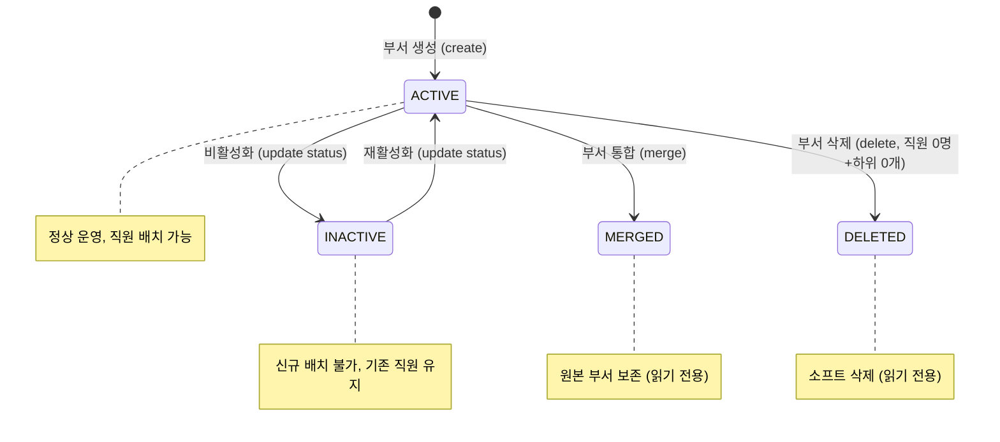
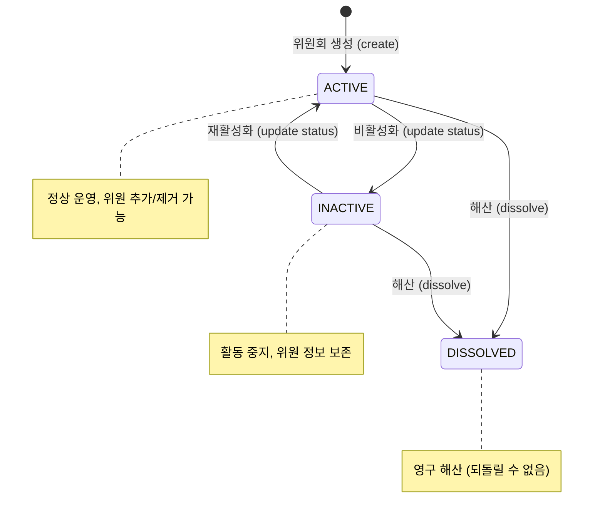
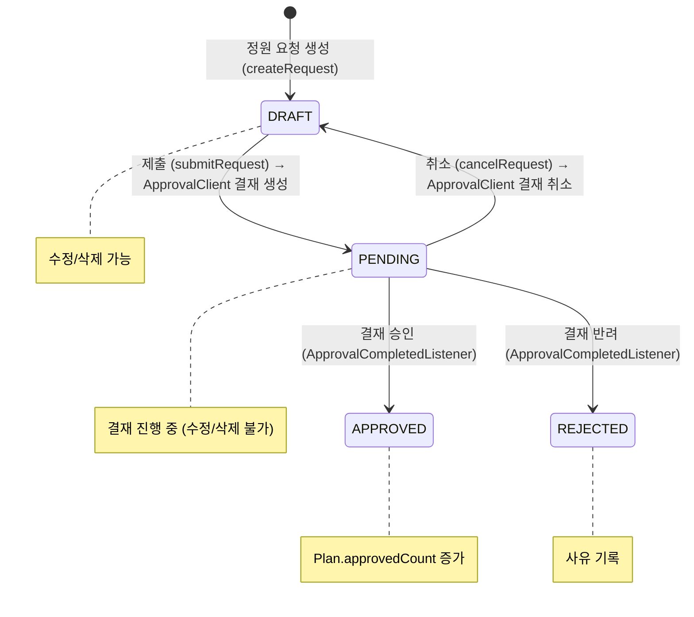
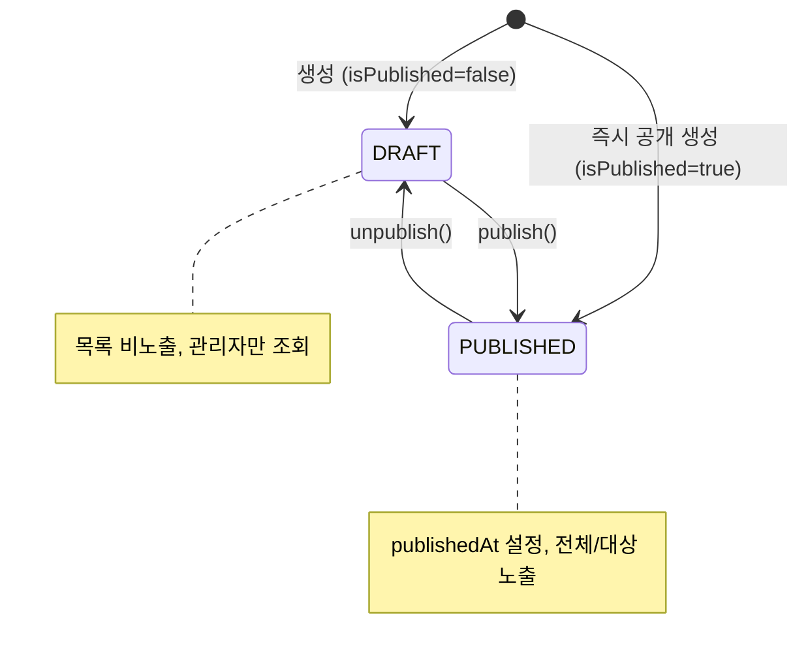
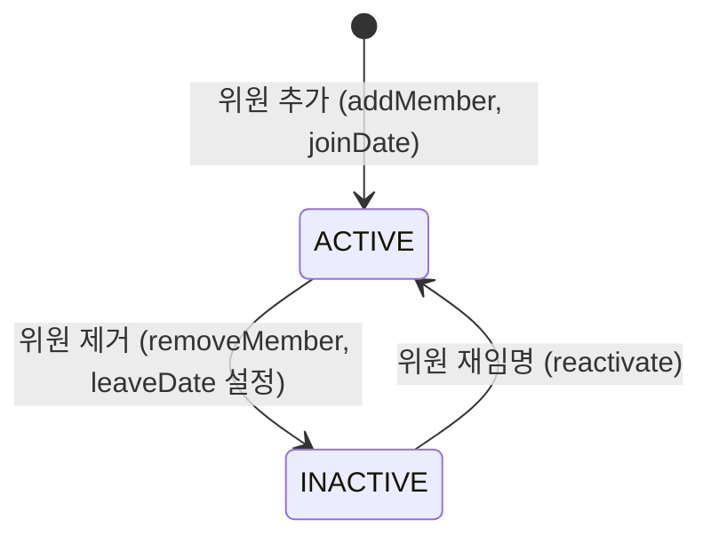
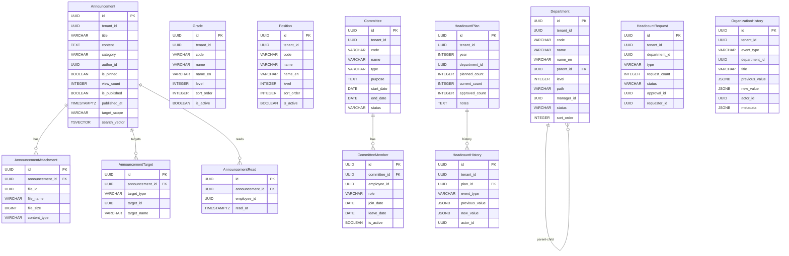

# Module 04: Organization Service — PRD 및 프로덕션 정책 분석

> **최종 업데이트**: 2026-02-10
> **분석 범위**: `services/organization-service/`, `common/` 모듈
> **문서 버전**: v2.0 (Phase A/B/C 확장)
> **포트**: 8083
> **패키지**: `com.hrsaas.organization`
> **DB 스키마**: `hr_core`

---

## 목차

- [1. 현재 구현 상태 요약](#1-현재-구현-상태-요약)
- [2. 정책 결정사항](#2-정책-결정사항)
- [3. 기능 요구사항 Gap 분석 (Phase A)](#3-기능-요구사항-gap-분석-phase-a)
- [4. 비즈니스 규칙 상세 (Phase B)](#4-비즈니스-규칙-상세-phase-b)
- [5. 서비스 연동 명세 (Phase C)](#5-서비스-연동-명세-phase-c)
- [6. 데이터 모델](#6-데이터-모델)
- [7. API 명세](#7-api-명세)
- [8. 보안/프라이버시](#8-보안프라이버시)
- [9. 성능/NFR](#9-성능nfr)
- [10. 추적성 매트릭스](#10-추적성-매트릭스)
- [11. 변경 이력](#11-변경-이력)

---

## 1. 현재 구현 상태 요약

### 1.1 구현 완료

| 기능 | 상태 | 위치 |
|------|------|------|
| 부서 CRUD + 계층 트리 | ✅ 완료 | `DepartmentController` / `DepartmentServiceImpl` |
| 부서 계층 깊이 제한 (10단계) | ✅ 완료 | `DepartmentServiceImpl.create/update()` MAX_DEPTH=10 |
| 부서 삭제 시 직원 검증 | ✅ 완료 | `EmployeeClient.countByDepartmentId()` → 0명만 삭제 가능 |
| 부서 코드 변경 불가 | ✅ 완료 | `UpdateDepartmentRequest`에 code 필드 없음 (불변) |
| 부서 관리자 검증 | ✅ 완료 | `EmployeeClient.existsById()` → 유효한 직원만 |
| 부서 통합/분리 | ✅ 완료 | `DepartmentServiceImpl.merge()/split()` + 직원 일괄 이동 |
| 조직 변경 이력 | ✅ 완료 | `OrganizationHistoryService` + `@TransactionalEventListener` |
| 조직도 API | ✅ 완료 | `DepartmentController.getOrgChart()` + 배치 직원 수 조회 |
| 조직개편 영향도 분석 | ✅ 완료 | `ReorgImpactAnalyzer.analyzeImpact()` |
| 직급 CRUD | ✅ 완료 | `GradeController` / `GradeServiceImpl` |
| 직책 CRUD | ✅ 완료 | `PositionController` / `PositionServiceImpl` |
| 직급/직책 사용 중 삭제 방지 | ✅ 완료 | `EmployeeClient.countByGradeId/PositionId()` |
| 공지사항 CRUD + 전문 검색 | ✅ 완료 | `AnnouncementServiceImpl` + PostgreSQL FTS (tsvector+GIN) |
| 공지 대상 범위 지정 | ✅ 완료 | `AnnouncementTarget` + targetScope (ALL/TARGETED) |
| 공지 읽음 확인 | ✅ 완료 | `AnnouncementRead` 테이블 + 읽음 추적 |
| 위원회 관리 | ✅ 완료 | `CommitteeController` / `CommitteeServiceImpl` |
| 정원 계획 CRUD + 이력 | ✅ 완료 | `HeadcountServiceImpl` + `HeadcountHistory` |
| 정원 요청 → 결재 연동 | ✅ 완료 | `ApprovalClient` Feign + `ApprovalCompletedListener` SQS |
| 정원 요약 대시보드 | ✅ 완료 | `HeadcountServiceImpl.getSummary()` |
| 대시보드 서비스 | ✅ 완료 | `OrganizationDashboardService` (공지+조직 요약) |
| 도메인 이벤트 | ✅ 완료 | Created/Updated/Merged/Split 이벤트 → SNS 발행 |
| Feign Client (Employee, Approval) | ✅ 완료 | `EmployeeClient`, `ApprovalClient` + Fallback 클래스 |
| RLS (Row Level Security) | ✅ 완료 | 모든 테넌트 데이터 테이블에 적용 |
| 캐싱 | ✅ 완료 | Department, Grade, Position, Committee, Organization Tree |

### 1.2 미구현 / TODO

| 기능 | 상태 | 위치 | 구현 방향 |
|------|------|------|-----------|
| 보직 발령 → 위원회 당연직 갱신 | ❌ TODO | `AffiliationChangedListener` | Employee Service 이벤트 소비 → 위원회 자동 갱신 |
| 직급별 호봉 체계 | ❌ 미구현 | — | 급여 모듈과 함께 구현 필요 |
| 겸직 관리 UI 연동 | 🟡 부분 | employee-service | BE 구현 완료, FE UI 미확인 |
| 주/부 소속 구분 UI | 🟡 부분 | employee-service | `EmployeeAffiliation.affiliationType` 존재, FE 미확인 |
| 부서명 변경 시 하위 path 재계산 | ⚠️ 알려진 이슈 | `DepartmentServiceImpl.update()` | 부서명 변경 시 하위 부서 path 업데이트 로직 미구현 |

---

## 2. 정책 결정사항

### 2.1 부서 삭제 정책 ✅ 결정완료 / 구현완료

> **결정: 소속 직원이 있으면 삭제 차단**

**규칙:**
1. 부서 삭제 요청 시 `EmployeeClient.countByDepartmentId()`로 소속 직원 수 조회
2. 소속 직원 ≥ 1명이면 `ORG_010` 예외
3. 하위 부서가 존재하면 삭제 차단 (기존 로직 유지)
4. 삭제 가능 조건: 소속 직원 0명 AND 하위 부서 0개
5. 삭제 시 상태를 `DELETED`로 변경 (소프트 삭제)
6. `EmployeeClientFallback`: employee-service 장애 시 삭제 차단 (안전 기본값)

### 2.2 조직 변경 이력 관리 ✅ 결정완료 / 구현완료

> **결정: 이벤트 기반 이력 테이블**

**이력 기록 대상:**
| 이벤트 | 설명 | 이벤트 리스너 |
|--------|------|--------------|
| DEPARTMENT_CREATED | 부서 생성 | `onDepartmentCreated()` |
| DEPARTMENT_UPDATED | 부서 정보 수정 | `onDepartmentUpdated()` |
| DEPARTMENT_MERGED | 부서 통합 | `onDepartmentMerged()` |
| DEPARTMENT_SPLIT | 부서 분리 | `onDepartmentSplit()` |
| DEPARTMENT_MOVED | 부서 상위 부서 변경 | DepartmentUpdated 이벤트 내 처리 |
| DEPARTMENT_DELETED | 부서 삭제 | `DepartmentServiceImpl.delete()` 직접 기록 |

**구현**: `OrganizationHistoryServiceImpl`에서 `@TransactionalEventListener` + `REQUIRES_NEW` 트랜잭션으로 이력 자동 기록. JSONB으로 `previousValue/newValue` 저장.

### 2.3 정원 요청 → 결재 서비스 연동 ✅ 결정완료 / 구현완료

> **결정: Approval Service와 양방향 연동**

**연동 흐름:**
```
1. 정원 요청 제출 (submit)
   └→ HeadcountServiceImpl.submitRequest()
      └→ ApprovalClient.createApproval(type="HEADCOUNT_REQUEST", refId=requestId)
      └→ HeadcountRequest.status = PENDING

2. 결재 완료 이벤트 수신 (SQS)
   └→ ApprovalCompletedListener.onApprovalCompleted()
      ├→ APPROVED: headcountService.approveRequest() + Plan.approvedCount 증가
      └→ REJECTED: headcountService.rejectRequest(reason)

3. 결재 취소
   └→ HeadcountServiceImpl.cancelRequest()
      └→ ApprovalClient.cancelApproval(approvalId)
      └→ HeadcountRequest.status = DRAFT
```

### 2.4 부서 계층 깊이 제한 ✅ 결정완료 / 구현완료

> **결정: 최대 10단계**

- 부서 생성/이동 시 `level ≤ 10` 검증
- 루트 부서(parent=null): level = 0
- 하위 부서: parent.level + 1
- 10단계 초과 시: `ORG_011` 예외
- 부서 이동 시 하위 전체 트리의 level + 최대 깊이 재계산

### 2.5 공지사항 대상 범위 ✅ 결정완료 / 구현완료

> **결정: 테넌트 전체 + 부서/직급별 대상 지정**

| 범위 | 설명 |
|------|------|
| ALL | 테넌트 전체 (기본값) |
| TARGETED | 특정 부서/직급 대상 → `AnnouncementTarget` 테이블 참조 |

**Target Type**: `DEPARTMENT` 또는 `GRADE`

### 2.6 부서 통합/분리 ✅ 결정완료 / 구현완료

> **결정: 통합 + 분리 모두 지원**

#### 통합 (Merge)
1. 신규 대상 부서 생성 또는 기존 부서 지정
2. `EmployeeClient.bulkTransferDepartment()`: 소속 직원 일괄 이동
3. 원본 부서 상태 → `MERGED`
4. 이력 기록 + `DepartmentMergedEvent` 발행
5. 통합 대상은 ACTIVE 상태만 가능 (`ORG_014`)

#### 분리 (Split)
1. 새 부서 생성 (code, name, 직원 배치 지정)
2. `EmployeeClient.bulkTransferDepartment()`: 직원 이동
3. 원본 부서: `keepSource=true`면 유지, `false`면 비활성화
4. 이력 기록 + `DepartmentSplitEvent` 발행

### 2.7 직급/직책 vs MDM 코드 ✅ 결정완료

> **결정: organization-service 자체 엔티티 유지**

- 직급/직책은 `level`, `sortOrder` 등 추가 속성이 필요하여 MDM 코드 체계와 별도 관리
- MDM Service의 GRADE/POSITION 코드 그룹은 참조 데이터로만 사용

---

## 3. 기능 요구사항 Gap 분석 (Phase A)

### 3.1 PRD vs 코드 비교표

> **PRD 출처**: `docs/deprecated/PRD.md` (섹션 5.3: 조직 관리)
> **참고**: PRD의 FR-ORG 시리즈는 11개 요구사항 (3개 그룹)

| ID | PRD 요구사항 | PRD 출처 | 코드 구현 상태 | 구현 위치 | Gap |
|----|-------------|---------|---------------|----------|-----|
| FR-ORG-001-01 | 부서/팀 CRUD | §5.3 L294 | ✅ 완전 구현 | `DepartmentController` CRUD + tree + merge/split | — |
| FR-ORG-001-02 | 조직도 트리 시각화 | §5.3 L295 | ✅ 완전 구현 | `getTree()` (계층형) + `getOrgChart()` (직원 수 포함) | — |
| FR-ORG-001-03 | 시점별 조직 변경 이력 | §5.3 L296 | ✅ 완전 구현 | `OrganizationHistoryService` + 이벤트 리스너 자동 기록 | — |
| FR-ORG-001-04 | 조직 개편 영향 미리보기 | §5.3 L297 | ✅ 완전 구현 | `ReorgImpactAnalyzer.analyzeImpact()` (직원 수, 경고, 결재건) | — |
| FR-ORG-002-01 | 보직(직책) 관리 | §5.3 L303 | ✅ 완전 구현 | `PositionController` / `PositionServiceImpl` | — |
| FR-ORG-002-02 | 1인 다보직(겸직) 지원 | §5.3 L304 | 🟡 부분 구현 | employee-service `EmployeeAffiliation` (BE 완료, FE 미확인) | FE UI 연동 필요 |
| FR-ORG-002-03 | 주/부 소속 구분 관리 | §5.3 L305 | 🟡 부분 구현 | `affiliationType` (PRIMARY/SECONDARY/CONCURRENT) | FE UI 연동 필요 |
| FR-ORG-002-04 | 보직 발령 → 위원회 당연직 자동 갱신 | §5.3 L306 | ❌ 미구현 | `AffiliationChangedListener` 스텁만 존재 | 이벤트 소비 로직 구현 필요 |
| FR-ORG-003-01 | 테넌트별 직급 체계 정의 | §5.3 L312 | ✅ 완전 구현 | `GradeController` / `GradeServiceImpl` (tenant_id + RLS) | — |
| FR-ORG-003-02 | 직급/직책 분리 관리 | §5.3 L313 | ✅ 완전 구현 | `Grade` + `Position` 별도 엔티티/컨트롤러/서비스 | — |
| FR-ORG-003-03 | 직급별 호봉 체계 설정 | §5.3 L314 | ❌ 미구현 | — | 급여 모듈과 함께 구현 필요 |

**구현률**: 73% (8/11 완전 구현, 2개 부분, 1개 미구현) — *v1.0 대비 55% → 73% 상향*

### 3.2 코드에만 있는 기능 (역분석)

PRD에 명시적 요구사항이 없지만, 코드에 구현된 기능들:

| FR ID (신규) | 기능 | 구현 위치 | 비즈니스 가치 | PRD 반영 권장 |
|-------------|------|----------|-------------|--------------|
| FR-ORG-EX-001 | 공지사항 CRUD + 전문 검색 (FTS) | `AnnouncementServiceImpl` + V28 tsvector+GIN | 사내 커뮤니케이션 핵심 기능 | ✅ 반영 필요 |
| FR-ORG-EX-002 | 공지 대상 범위 지정 (부서/직급) | `AnnouncementTarget` + targetScope | 대규모 조직 정보 전달 효율화 | ✅ 반영 필요 |
| FR-ORG-EX-003 | 공지 읽음 확인/추적 | `AnnouncementRead` 테이블 | 커뮤니케이션 효과 측정 | ✅ 반영 필요 |
| FR-ORG-EX-004 | 위원회 관리 (상설/한시/프로젝트) | `CommitteeServiceImpl` | 기업 거버넌스 필수 기능 | ✅ 반영 필요 |
| FR-ORG-EX-005 | 정원 계획/요청 워크플로우 | `HeadcountServiceImpl` + Approval 연동 | 인력 운영 계획 핵심 | ✅ 반영 필요 |
| FR-ORG-EX-006 | 부서 통합/분리 + 직원 이동 | `DepartmentServiceImpl.merge/split()` | 조직개편 운영 필수 | ✅ 반영 필요 |
| FR-ORG-EX-007 | 조직도 API (직원 수 + 관리자 정보) | `getOrgChart()` + 배치 Feign API | 조직 시각화 UX 향상 | ✅ 반영 필요 |
| FR-ORG-EX-008 | 부서 삭제 시 직원 검증 (Feign) | `EmployeeClient.countByDepartmentId()` | 데이터 무결성 보호 | 운영 안전장치 |
| FR-ORG-EX-009 | 직급/직책 사용 중 삭제 방지 | `EmployeeClient.countByGradeId/PositionId()` | 데이터 무결성 보호 | 운영 안전장치 |
| FR-ORG-EX-010 | 부서 코드 불변 정책 | `UpdateDepartmentRequest` code 필드 없음 | 이력 단절 방지 | 정책 문서에 포함 |
| FR-ORG-EX-011 | 대시보드 서비스 (공지+조직 요약) | `OrganizationDashboardService` | 운영 대시보드 | ✅ 반영 필요 |
| FR-ORG-EX-012 | 정원 변동 이력 관리 | `HeadcountHistory` 테이블 + JSONB 이전/이후 값 | 정원 감사 추적 | ✅ 반영 필요 |
| FR-ORG-EX-013 | N+1 방지 전략 (배치 API, Fetch Join, @BatchSize) | Repository + Feign Client | 성능 최적화 | 아키텍처 문서에 포함 |

### 3.3 Gap 해소 우선순위 로드맵

| 우선순위 | Gap ID | 항목 | 현재 상태 | 해소 방향 | 의존성 | 예상 복잡도 |
|---------|--------|------|----------|----------|--------|-----------|
| **HIGH** | ORG-G15 | 보직 발령 → 위원회 당연직 자동 갱신 | `AffiliationChangedListener` 스텁 | Employee 이벤트 소비 → 위원회 멤버 자동 추가/제거 | Employee Service 이벤트 | 중간 |
| **HIGH** | ORG-G16 | 부서명 변경 시 하위 path 재계산 | 미구현 | `update()`에서 name 변경 감지 → 하위 부서 path 일괄 업데이트 | — | 중간 |
| **MEDIUM** | ORG-G17 | 직급별 호봉 체계 | 미구현 | 급여/보상 모듈 설계 시 함께 구현 | 급여 모듈 | 높음 |
| **MEDIUM** | ORG-G18 | 겸직 관리 FE 연동 | BE 완료 (employee-service) | FE 겸직 추가/해제 UI 구현 | Frontend | 낮음 |
| **LOW** | ORG-G19 | 공지 알림 발송 (Notification 연동) | 미구현 | 공지 publish 시 NotificationService 이벤트 발행 | Notification Service | 낮음 |
| **LOW** | ORG-G20 | 정원 현재 인원 자동 동기화 | 수동 입력 | Employee 이벤트 소비하여 currentCount 자동 갱신 | Employee Service 이벤트 | 중간 |
| **RESOLVED** | ORG-G01~G14 | v1.0에서 식별된 14개 Gap | ✅ 모두 구현 완료 | — | — | — |

---

## 4. 비즈니스 규칙 상세 (Phase B)

### 4.1 상태 머신

#### 4.1.1 부서 상태 (Department.status)



**상태 설명:**

| 상태 | DB 표현 | 직원 배치 | 수정 가능 | 전이 조건 |
|------|---------|----------|----------|----------|
| ACTIVE | `status='ACTIVE'` | ✅ | ✅ | 정상 운영 상태 |
| INACTIVE | `status='INACTIVE'` | ❌ | ✅ (재활성화 가능) | 관리자 비활성화 |
| MERGED | `status='MERGED'` | ❌ | ❌ | 통합 대상 부서 (원본 보존) |
| DELETED | `status='DELETED'` | ❌ | ❌ | 삭제 (직원 0 + 하위 0) |

#### 4.1.2 위원회 상태 (Committee.status)



#### 4.1.3 정원 요청 상태 (HeadcountRequest.status)



**상태별 허용 동작:**

| 상태 | 수정 | 삭제 | 제출 | 취소 | 승인/반려 |
|------|------|------|------|------|----------|
| DRAFT | ✅ | ✅ | ✅ | — | — |
| PENDING | ❌ | ❌ | — | ✅ | ✅ (결재 서비스) |
| APPROVED | ❌ | ❌ | — | — | — |
| REJECTED | ❌ | ❌ | — | — | — |

#### 4.1.4 공지사항 생명주기 (Announcement)



#### 4.1.5 위원 멤버 생명주기 (CommitteeMember)



### 4.2 유효성 검증 규칙 카탈로그

#### 4.2.1 부서 (Department)

| 필드 | 검증 규칙 | 에러 코드 | 검증 위치 |
|------|----------|----------|----------|
| code | `@NotBlank`, 50자 이내, 테넌트 내 유니크 | ORG_001 | DTO + Service |
| name | `@NotBlank`, 200자 이내 | — | DTO |
| parentId | 유효한 부서 ID (존재 + ACTIVE), 자기 참조 불가 | ORG_004 | Service |
| managerId | employee-service에서 존재 확인 (`existsById`) | ORG_012 | Service (Feign) |
| level | `0 ≤ level ≤ 10`, parent 변경 시 자동 계산 | ORG_011 | Service |
| 삭제 조건 | 하위 부서 0개 AND 소속 직원 0명 | ORG_010 | Service (Feign) |
| code 변경 | 불가 (UpdateDepartmentRequest에 code 필드 없음) | — | DTO 구조 |

#### 4.2.2 직급/직책 (Grade/Position)

| 필드 | 검증 규칙 | 에러 코드 | 검증 위치 |
|------|----------|----------|----------|
| code | `@NotBlank`, 50자 이내, 테넌트 내 유니크 | ORG_002/003 | DTO + Service |
| name | `@NotBlank`, 100자 이내 | — | DTO |
| level | `@NotNull`, 정수 | — | DTO |
| 비활성화 | 사용 중인 직원 있으면 비활성화 불가 (`countByGradeId/PositionId > 0`) | ORG_013/014 | Service (Feign) |

#### 4.2.3 공지사항 (Announcement)

| 필드 | 검증 규칙 | 에러 코드 | 검증 위치 |
|------|----------|----------|----------|
| title | `@NotBlank`, 500자 이내 | — | DTO |
| content | `@NotBlank` | — | DTO |
| category | NOTICE / EVENT / UPDATE / URGENT (nullable) | — | DTO |
| targetScope | ALL (기본값) / TARGETED | — | DTO |
| targetDepartmentIds | targetScope=TARGETED일 때 필수 (OR targetGradeIds) | — | Service |
| 첨부파일 | `fileId` 필수, `fileName` 필수, `fileSize` 필수 | — | DTO |

#### 4.2.4 위원회 (Committee)

| 필드 | 검증 규칙 | 에러 코드 | 검증 위치 |
|------|----------|----------|----------|
| code | `@NotBlank`, 50자 이내, 테넌트 내 유니크 | ORG_005 | DTO + Service |
| name | `@NotBlank`, 200자 이내 | — | DTO |
| type | PERMANENT / TEMPORARY / PROJECT | — | DTO |
| 위원 추가 | 동일 위원회 내 중복 활성 위원 불가 | ORG_006 | Service |
| 위원 역할 | CHAIR / VICE_CHAIR / SECRETARY / MEMBER | — | DTO |

#### 4.2.5 정원 요청 (HeadcountRequest)

| 필드 | 검증 규칙 | 에러 코드 | 검증 위치 |
|------|----------|----------|----------|
| departmentId | `@NotNull`, 유효한 부서 ID | — | DTO |
| type | INCREASE / DECREASE / TRANSFER | — | DTO |
| requestCount | `@NotNull`, 양수 | — | DTO |
| 수정/삭제 | DRAFT 상태에서만 가능 | ORG_009 | Service |
| 연도+부서 중복 | 동일 테넌트+연도+부서에 계획 1건만 | ORG_008 | Service |

### 4.3 계산 공식/로직 명세

#### 4.3.1 부서 계층 Level 계산

```
level(root) = 0                              // parent == null
level(child) = level(parent) + 1             // parent != null
MAX_DEPTH = 10

// 생성 시 검증
if parent != null && parent.level >= MAX_DEPTH:
    throw ORG_011

// 이동 시 검증
maxChildDepth = getMaxChildDepth(department)  // 하위 트리 최대 깊이
newLevel = newParent.level + 1
if newLevel + maxChildDepth > MAX_DEPTH:
    throw ORG_011

// 이동 후 하위 트리 level 재계산
recalculateSubTreeLevels(department, newLevel)
```

#### 4.3.2 부서 Path 계산

```
path(root) = "/" + root.name
path(child) = path(parent) + "/" + child.name

// 예: /본부/경영본부/인사팀/채용파트
// 부서 생성/이동 시 Department.updateHierarchy() 호출
```

#### 4.3.3 정원 계산

```
variance = plannedCount - currentCount           // 과부족 (양수=결원, 음수=초과)
availableCount = plannedCount - currentCount + approvedCount  // 가용 정원

// 요약 대시보드
totalPlannedCount = SUM(plans.plannedCount)       // 전사 계획 인원
totalCurrentCount = SUM(plans.currentCount)       // 전사 현재 인원
totalApprovedCount = SUM(approvedRequests)        // 전사 승인된 증원
totalVariance = totalPlannedCount - totalCurrentCount
```

#### 4.3.4 공지 정렬 규칙

```sql
ORDER BY is_pinned DESC, published_at DESC NULLS LAST, created_at DESC
-- 1순위: 고정 공지 상단
-- 2순위: 공개일시 최신순
-- 3순위: 생성일시 최신순
```

#### 4.3.5 공지 전문 검색 (PostgreSQL FTS)

```sql
-- search_vector는 트리거로 자동 업데이트
search_vector =
    setweight(to_tsvector('simple', title), 'A') ||   -- 제목: 가중치 A
    setweight(to_tsvector('simple', content), 'B')     -- 본문: 가중치 B

-- 검색 쿼리
WHERE search_vector @@ plainto_tsquery('simple', :keyword)
```

### 4.4 데이터 생명주기 정책

| 데이터 | 생성 시점 | 보존 기간 | 삭제 방식 | 비고 |
|--------|----------|----------|----------|------|
| Department | 관리자 생성 | 영구 | 소프트 삭제 (status=DELETED) | 이력 보존 필수 |
| Grade | 관리자 생성 | 영구 | 소프트 삭제 (isActive=false) | 기존 직원 데이터 유지 |
| Position | 관리자 생성 | 영구 | 소프트 삭제 (isActive=false) | 기존 직원 데이터 유지 |
| Announcement | 관리자 작성 | 영구 | 하드 삭제 | 첨부파일 cascade 삭제 |
| AnnouncementRead | 공지 조회 시 | 영구 | 공지 삭제 시 cascade | (announcement_id, employee_id) UNIQUE |
| AnnouncementTarget | 공지 생성 시 | 영구 | 공지 삭제 시 cascade | — |
| Committee | 관리자 생성 | 영구 | 하드 삭제 | 멤버 cascade 삭제 |
| CommitteeMember | 위원 추가 시 | 영구 | 소프트 삭제 (isActive=false) | leaveDate 기록 |
| HeadcountPlan | 관리자 생성 | 영구 | 하드 삭제 | 이력은 HeadcountHistory에 보존 |
| HeadcountRequest | 관리자 요청 | 영구 | DRAFT만 하드 삭제 가능 | PENDING 이후 삭제 불가 |
| OrganizationHistory | 이벤트 발생 시 자동 | 영구 | 삭제 없음 | 감사 추적용 |
| HeadcountHistory | 계획 변경 시 자동 | 영구 | 삭제 없음 | 감사 추적용 |

### 4.5 엣지 케이스 카탈로그

| # | 시나리오 | 현재 동작 | 기대 동작 | 상태 |
|---|---------|----------|----------|------|
| 1 | 루트 부서 삭제 시도 (하위 부서 존재) | 하위 부서 존재 → 삭제 차단 | 하위 부서 존재 시 삭제 차단 | ✅ 정상 |
| 2 | 소속 직원 있는 부서 삭제 시도 | EmployeeClient 조회 → ORG_010 | 직원 존재 시 삭제 차단 | ✅ 정상 |
| 3 | employee-service 장애 중 부서 삭제 시도 | Fallback → 삭제 차단 (안전 기본값) | 장애 시 삭제 차단 | ✅ 정상 |
| 4 | 11레벨 부서 생성 시도 | ORG_011 예외 | 10단계 초과 거부 | ✅ 정상 |
| 5 | 부서 이동으로 하위 트리가 10단계 초과 | 하위 트리 깊이 + 새 레벨 검증 → ORG_011 | 하위 포함 깊이 검증 | ✅ 정상 |
| 6 | 부서명 변경 후 하위 부서 path | 하위 부서 path 미갱신 | 하위 부서 path도 업데이트 필요 | ⚠️ 알려진 이슈 (ORG-G16) |
| 7 | 통합 시 INACTIVE 부서 포함 | ORG_014: ACTIVE 상태만 통합 가능 | 비활성 부서 통합 거부 | ✅ 정상 |
| 8 | 분리 시 employeeIds 미지정 | 직원 이동 없이 빈 부서 생성 | 선택적 직원 배치 | ✅ 정상 |
| 9 | 정원 요청 PENDING 상태에서 수정 시도 | ORG_009 예외 | DRAFT만 수정 가능 | ✅ 정상 |
| 10 | 동일 연도+부서 정원 계획 중복 생성 | ORG_008 예외 (UNIQUE 제약) | 중복 방지 | ✅ 정상 |
| 11 | 위원회에 같은 직원 중복 추가 | ORG_006 예외 (활성 멤버 중복 체크) | 중복 방지 | ✅ 정상 |
| 12 | 퇴임 위원 재임명 | isActive=true + joinDate 재설정 | 재임명 허용 | ✅ 정상 |
| 13 | 사용 중인 직급 비활성화 시도 | EmployeeClient 조회 → ORG_013 | 사용 중 비활성화 차단 | ✅ 정상 |
| 14 | 공지 읽음 중복 기록 시도 | UNIQUE(announcement_id, employee_id) 제약 | 중복 읽음 무시 | ✅ 정상 |
| 15 | 조직도 조회 시 부서가 많은 경우 | 배치 Feign API (`countByDepartmentIds`) → 1회 호출 | N+1 방지 | ✅ 정상 |
| 16 | 결재 완료 이벤트 중 referenceType 불일치 | HEADCOUNT_REQUEST 아니면 무시 | 다른 결재 유형 무시 | ✅ 정상 |
| 17 | 빈 컬렉션 캐시 역직렬화 | `unless = "#result == null \|\| #result.isEmpty()"` | 빈 리스트 캐시 안 함 | ✅ 정상 |

---

## 5. 서비스 연동 명세 (Phase C)

### 5.1 연동 아키텍처

```mermaid
graph TB
    subgraph "Organization Service (8083)"
        DC[DepartmentController]
        GC[GradeController]
        PC[PositionController]
        AC[AnnouncementController]
        CC[CommitteeController]
        HC[HeadcountController]
        DBC[DashboardController]
        DS[DepartmentServiceImpl]
        HS[HeadcountServiceImpl]
        OHS[OrganizationHistoryService]
        RIA[ReorgImpactAnalyzer]
        ACL[ApprovalCompletedListener]
    end

    subgraph "Common Modules"
        CSF[SecurityFilter<br/>common-security]
        EP[EventPublisher<br/>common-event]
        TC[TenantContext<br/>common-tenant]
        RC[RedisCache<br/>common-cache]
    end

    subgraph "External Services"
        ES[Employee Service<br/>8084]
        AS[Approval Service<br/>8086]
        NS[Notification Service<br/>8088]
    end

    subgraph "Infrastructure"
        PG[(PostgreSQL<br/>hr_core)]
        RD[(Redis)]
        SNS[AWS SNS]
        SQS[AWS SQS]
    end

    %% Feign calls (동기)
    DS -->|Feign: 직원 수, 관리자 검증, 일괄 이동| ES
    HS -->|Feign: 결재 생성/취소| AS
    RIA -->|Feign: 영향받는 직원 수| ES

    %% Event publishing (비동기)
    DS -->|DepartmentCreated/Updated/Merged/Split| EP
    EP -->|SNS| SNS

    %% Event consuming (비동기)
    SQS -->|approval-completed| ACL
    ACL --> HS

    %% Event listeners (내부)
    EP -.->|@TransactionalEventListener| OHS

    %% Data stores
    DS --> PG
    DS --> RC
    HS --> PG
```

### 5.2 REST API 연동 (Feign Client 기반)

#### 5.2.1 Organization → Employee Service

| Feign Client | 메서드 | 엔드포인트 | 용도 | 호출 시점 | 폴백 전략 |
|-------------|--------|----------|------|----------|----------|
| `EmployeeClient` | `countByDepartmentId(UUID)` | `GET /api/v1/employees/count?departmentId=` | 부서별 직원 수 조회 | 부서 삭제 검증 | -1L 반환 (삭제 차단) |
| `EmployeeClient` | `existsById(UUID)` | `GET /api/v1/employees/{id}/exists` | 관리자 존재 확인 | 부서 생성/수정 (managerId 지정 시) | false 반환 (검증 실패) |
| `EmployeeClient` | `bulkTransferDepartment(BulkTransferRequest)` | `POST /api/v1/employees/bulk-transfer` | 직원 일괄 부서 이동 | 부서 통합/분리 | 0 반환 (이동 실패) |
| `EmployeeClient` | `countByGradeId(UUID)` | `GET /api/v1/employees/count-by-grade?gradeId=` | 직급별 직원 수 조회 | 직급 비활성화 검증 | -1L 반환 (비활성화 차단) |
| `EmployeeClient` | `countByPositionId(UUID)` | `GET /api/v1/employees/count-by-position?positionId=` | 직책별 직원 수 조회 | 직책 비활성화 검증 | -1L 반환 (비활성화 차단) |
| `EmployeeClient` | `countByDepartmentIds(List<UUID>)` | `POST /api/v1/employees/count-by-departments` | 배치 직원 수 조회 | 조직도 API (N+1 방지) | 빈 Map 반환 |

**Feign 설정**:
- URL: `${services.employee-service.url:http://localhost:8084}`
- Fallback: `EmployeeClientFallback` (안전 기본값 - 삭제/비활성화 차단)

#### 5.2.2 Organization → Approval Service

| Feign Client | 메서드 | 엔드포인트 | 용도 | 호출 시점 | 폴백 전략 |
|-------------|--------|----------|------|----------|----------|
| `ApprovalClient` | `createApproval(CreateApprovalRequest)` | `POST /api/v1/approvals` | 정원 요청 결재 생성 | 정원 요청 제출 (submit) | 예외 발생 (제출 차단) |
| `ApprovalClient` | `cancelApproval(UUID)` | `DELETE /api/v1/approvals/{id}` | 정원 요청 결재 취소 | 정원 요청 취소 (cancel) | 예외 발생 (취소 차단) |

**Feign 설정**:
- URL: `${services.approval-service.url:http://localhost:8086}`
- Fallback: `ApprovalClientFallback` (결재 서비스 장애 시 제출/취소 차단)

#### 5.2.3 다른 서비스 → Organization Service

Organization Service는 다른 서비스에서 부서/직급/직책 정보를 조회하기 위해 호출됨:

| 호출자 | 용도 | 엔드포인트 |
|--------|------|----------|
| employee-service | 부서 정보 조회 | `GET /api/v1/departments/{id}` |
| employee-service | 직급/직책 목록 | `GET /api/v1/grades`, `GET /api/v1/positions` |
| attendance-service | 부서별 근태 집계 참조 | `GET /api/v1/departments/tree` |
| approval-service | 조직 관련 결재 참조 | `GET /api/v1/departments/{id}` |
| Frontend | 조직도, 부서 트리, 직급/직책 드롭다운, 공지사항 | 전체 API |

### 5.3 이벤트 연동 (SNS/SQS)

#### 5.3.1 발행하는 이벤트

| 이벤트 | SNS 토픽 | 발행 시점 | 페이로드 스키마 | 소비자 |
|--------|---------|----------|---------------|--------|
| `DepartmentCreatedEvent` | `EventTopics.DEPARTMENT_CREATED` | 부서 생성 | `{ departmentId, code, name, parentId, level }` | OrganizationHistoryService (내부), Employee Service |
| `DepartmentUpdatedEvent` | `EventTopics.DEPARTMENT_UPDATED` | 부서 수정 | `{ departmentId, code, name, status }` | OrganizationHistoryService (내부), Employee Service |
| `DepartmentMergedEvent` | `EventTopics.DEPARTMENT_MERGED` | 부서 통합 | `{ sourceIds: List<UUID>, targetId, targetName, reason }` | OrganizationHistoryService (내부) |
| `DepartmentSplitEvent` | `EventTopics.DEPARTMENT_SPLIT` | 부서 분리 | `{ sourceId, newDepartmentIds: List<UUID>, reason }` | OrganizationHistoryService (내부) |

#### 5.3.2 소비하는 이벤트

| 이벤트 | SQS 큐 | 발행자 | 처리 로직 |
|--------|--------|--------|----------|
| ApprovalCompletedEvent | `organization-approval-completed-queue` | Approval Service | `referenceType=HEADCOUNT_REQUEST` → APPROVED: `approveRequest()`, REJECTED: `rejectRequest(reason)` |
| AffiliationChangedEvent (TODO) | `organization-affiliation-changed-queue` | Employee Service | 보직 변경 → 위원회 당연직 자동 갱신 (미구현) |

#### 5.3.3 미구현 이벤트 (설계 완료)

| 이벤트 | 토픽 | 발행 시점 | 소비자 |
|--------|------|----------|--------|
| `AnnouncementPublishedEvent` | `hr-saas.organization.announcement-published` | 공지 공개 시 | Notification Service (알림 발송) |
| `HeadcountApprovedEvent` | `hr-saas.organization.headcount-approved` | 정원 승인 시 | Notification Service (관련자 알림) |
| `EmployeeCreatedEvent` (소비) | `hr-saas.employee.created` | 직원 생성 | HeadcountPlan.currentCount 자동 갱신 |
| `EmployeeTerminatedEvent` (소비) | `hr-saas.employee.terminated` | 직원 퇴사 | HeadcountPlan.currentCount 자동 감소 |

### 5.4 데이터 동기화 흐름

#### 5.4.1 부서 → 직원 연결

```
Organization Service (departments.id) ← Employee Service (employees.department_id)

- 연결 방향: Employee가 Department를 참조 (Organization → Employee는 Feign 조회)
- 동기화: 부서 삭제/비활성화 시 Employee에 직접 영향 없음
- 정합성: Feign 호출로 실시간 검증 (삭제 전 직원 수 확인)
```

#### 5.4.2 정원 요청 → 결재 워크플로우

```
1. Organization → Approval: Feign POST /api/v1/approvals (동기)
   - type: HEADCOUNT_REQUEST
   - referenceId: headcountRequest.id
   - 실패 시: 요청 제출 차단

2. Approval → Organization: SQS 이벤트 (비동기)
   - 큐: organization-approval-completed-queue
   - APPROVED: approveRequest() + Plan.approvedCount++
   - REJECTED: rejectRequest(reason)
   - 최종 일관성: 결재 완료 후 비동기 처리 (수초 이내)
```

#### 5.4.3 조직도 직원 수 동기화

```
Organization Service → Employee Service: 배치 Feign API (동기)

- 조회 방식: POST /api/v1/employees/count-by-departments (배치)
- 캐싱: 없음 (실시간 조회)
- N+1 방지: 전체 부서 ID 목록을 1회 호출로 처리
- 폴백: 빈 Map (직원 수 0으로 표시)
```

#### 5.4.4 직급/직책 → MDM 코드 관계

```
Organization Service (Grade, Position) ↔ MDM Service (CommonCode)

- 현재: 독립 관리 (organization-service 자체 엔티티)
- MDM의 GRADE/POSITION 코드 그룹: 참조 데이터 (시드)
- 이중 관리 리스크: 인지됨, organization-service 엔티티 유지 결정
  (level, sortOrder 등 추가 속성 필요)
```

### 5.5 통합 테스트 시나리오

| # | 시나리오 | 관련 서비스 | 기대 결과 | 상태 |
|---|---------|-----------|----------|------|
| IT-01 | 부서 생성 → 이벤트 발행 → 이력 기록 | Organization 단독 | DepartmentCreatedEvent + OrganizationHistory 레코드 | ❌ 미작성 |
| IT-02 | 부서 삭제 → Employee 직원 수 확인 → 차단/허용 | Organization + Employee | 직원 존재 시 ORG_010, 0명일 때 삭제 성공 | ❌ 미작성 |
| IT-03 | 부서 통합 → 직원 일괄 이동 → 원본 MERGED | Organization + Employee | 직원 이동 완료, 원본 부서 MERGED 상태 | ❌ 미작성 |
| IT-04 | 부서 분리 → 신규 부서 생성 → 직원 배치 | Organization + Employee | 신규 부서 생성, 지정 직원 이동 | ❌ 미작성 |
| IT-05 | 정원 요청 제출 → 결재 생성 → 승인 이벤트 → 계획 반영 | Organization + Approval | DRAFT→PENDING→APPROVED, Plan.approvedCount 증가 | ❌ 미작성 |
| IT-06 | 정원 요청 반려 이벤트 → 상태 변경 + 사유 기록 | Organization + Approval | PENDING→REJECTED, 반려 사유 저장 | ❌ 미작성 |
| IT-07 | 11레벨 부서 생성 시도 → 깊이 초과 거부 | Organization 단독 | ORG_011 에러 반환 | ❌ 미작성 |
| IT-08 | 조직도 조회 → 배치 직원 수 조회 (N+1 방지) | Organization + Employee | 1회 Feign 호출로 전체 부서 직원 수 반환 | ❌ 미작성 |
| IT-09 | 테넌트 간 부서 데이터 격리 (RLS) | Organization 단독 | 테넌트 A 부서가 테넌트 B에서 조회 불가 | ❌ 미작성 |
| IT-10 | 사용 중인 직급 비활성화 시도 | Organization + Employee | 사용 중이면 ORG_013, 미사용이면 비활성화 성공 | ❌ 미작성 |
| IT-11 | 공지 대상 지정 → 해당 부서/직급 직원만 조회 | Organization 단독 | targetScope=TARGETED → 매칭 사용자만 조회 | ❌ 미작성 |
| IT-12 | 공지 전문 검색 (FTS) → 결과 반환 | Organization 단독 | tsvector+GIN 인덱스 검색 정상 동작 | ❌ 미작성 |

---

## 6. 데이터 모델

### 6.1 테이블 목록 (hr_core 스키마)

| 테이블 | 상태 | 용도 | RLS |
|--------|------|------|-----|
| `department` | ✅ 사용 중 | 계층형 부서 관리 | ✅ |
| `grade` | ✅ 사용 중 | 직급 관리 | ✅ |
| `position` | ✅ 사용 중 | 직책 관리 | ✅ |
| `announcement` | ✅ 사용 중 | 공지사항 | ✅ |
| `announcement_attachment` | ✅ 사용 중 | 공지 첨부파일 | — (FK cascade) |
| `announcement_target` | ✅ 사용 중 | 공지 대상 범위 (G05) | — (FK cascade) |
| `announcement_read` | ✅ 사용 중 | 공지 읽음 추적 (G12) | — (FK cascade) |
| `committee` | ✅ 사용 중 | 위원회 | ✅ |
| `committee_member` | ✅ 사용 중 | 위원회 위원 | — (FK cascade) |
| `headcount_plan` | ✅ 사용 중 | 정원 계획 | ✅ |
| `headcount_request` | ✅ 사용 중 | 정원 변경 요청 | ✅ |
| `headcount_history` | ✅ 사용 중 | 정원 변동 이력 (G13) | ✅ |
| `organization_history` | ✅ 사용 중 | 조직 변경 이력 (G02) | ✅ |

### 6.2 ERD



### 6.3 Flyway 마이그레이션

| 버전 | 파일명 | 내용 |
|------|--------|------|
| V20 | `V20__init_organization.sql` | 초기 스키마 (department, grade, position, announcement, committee, headcount_plan/request) + 45개 인덱스 + RLS 정책 |
| V27 | `V27__organization_history_and_targets.sql` | organization_history, announcement_target, announcement_read, headcount_history 테이블 추가 + announcement.target_scope 컬럼 |
| V28 | `V28__add_performance_indexes.sql` | 성능 인덱스 (공지 정렬, 부서 계층) + PostgreSQL FTS (tsvector + GIN + 트리거) |

---

## 7. API 명세

### 7.1 부서 API

| Method | Path | 권한 | 설명 |
|--------|------|------|------|
| POST | `/api/v1/departments` | HR_ADMIN+ | 부서 생성 |
| GET | `/api/v1/departments/{id}` | 인증 | 부서 상세 조회 |
| GET | `/api/v1/departments` | 인증 | 부서 목록 (평면) |
| GET | `/api/v1/departments/tree` | 인증 | 부서 트리 (계층형, 캐시) |
| PUT | `/api/v1/departments/{id}` | HR_ADMIN+ | 부서 수정 (code 불변) |
| DELETE | `/api/v1/departments/{id}` | HR_ADMIN+ | 부서 삭제 (직원 0 + 하위 0) |
| GET | `/api/v1/departments/history` | HR_ADMIN+ | 조직 전체 변경 이력 (페이징) |
| GET | `/api/v1/departments/{id}/history` | HR_ADMIN+ | 특정 부서 변경 이력 |
| POST | `/api/v1/departments/{id}/reorg-impact` | HR_ADMIN+ | 조직개편 영향도 분석 |
| POST | `/api/v1/departments/merge` | TENANT_ADMIN+ | 부서 통합 |
| POST | `/api/v1/departments/split` | TENANT_ADMIN+ | 부서 분리 |
| GET | `/api/v1/departments/org-chart` | 인증 | 조직도 (직원 수 + 관리자 정보) |

### 7.2 직급 API

| Method | Path | 권한 | 설명 |
|--------|------|------|------|
| POST | `/api/v1/grades` | HR_ADMIN+ | 직급 생성 |
| GET | `/api/v1/grades/{id}` | 인증 | 직급 상세 조회 |
| GET | `/api/v1/grades/code/{code}` | 인증 | 코드로 직급 조회 |
| GET | `/api/v1/grades` | 인증 | 직급 목록 (전체/활성만) |
| PUT | `/api/v1/grades/{id}` | HR_ADMIN+ | 직급 수정 |
| DELETE | `/api/v1/grades/{id}` | HR_ADMIN+ | 직급 비활성화 (사용 중 차단) |

### 7.3 직책 API

| Method | Path | 권한 | 설명 |
|--------|------|------|------|
| POST | `/api/v1/positions` | HR_ADMIN+ | 직책 생성 |
| GET | `/api/v1/positions/{id}` | 인증 | 직책 상세 조회 |
| GET | `/api/v1/positions/code/{code}` | 인증 | 코드로 직책 조회 |
| GET | `/api/v1/positions` | 인증 | 직책 목록 |
| PUT | `/api/v1/positions/{id}` | HR_ADMIN+ | 직책 수정 |
| DELETE | `/api/v1/positions/{id}` | HR_ADMIN+ | 직책 비활성화 (사용 중 차단) |

### 7.4 공지사항 API

| Method | Path | 권한 | 설명 |
|--------|------|------|------|
| POST | `/api/v1/announcements` | HR_ADMIN+ | 공지 생성 (대상 지정 가능) |
| GET | `/api/v1/announcements/{id}` | 인증 | 공지 상세 (조회수 +1, 읽음 기록) |
| GET | `/api/v1/announcements` | HR_ADMIN+ | 전체 공지 (페이징) |
| GET | `/api/v1/announcements/published` | 인증 | 공개 공지 (페이징) |
| GET | `/api/v1/announcements/pinned` | 인증 | 고정 공지 목록 |
| GET | `/api/v1/announcements/search` | 인증 | 공지 검색 (FTS, 카테고리) |
| PUT | `/api/v1/announcements/{id}` | HR_ADMIN+ | 공지 수정 |
| DELETE | `/api/v1/announcements/{id}` | HR_ADMIN+ | 공지 삭제 |
| POST | `/api/v1/announcements/{id}/publish` | HR_ADMIN+ | 공지 공개 |
| POST | `/api/v1/announcements/{id}/unpublish` | HR_ADMIN+ | 공지 비공개 |
| GET | `/api/v1/announcements/{id}/reads` | HR_ADMIN+ | 공지 읽음 목록 |

### 7.5 위원회 API

| Method | Path | 권한 | 설명 |
|--------|------|------|------|
| POST | `/api/v1/committees` | HR_ADMIN+ | 위원회 생성 |
| GET | `/api/v1/committees/{id}` | 인증 | 위원회 상세 (멤버 포함) |
| GET | `/api/v1/committees` | 인증 | 위원회 목록 (상태/유형 필터) |
| PUT | `/api/v1/committees/{id}` | HR_ADMIN+ | 위원회 수정 |
| DELETE | `/api/v1/committees/{id}` | HR_ADMIN+ | 위원회 삭제 |
| POST | `/api/v1/committees/{id}/dissolve` | HR_ADMIN+ | 위원회 해산 |
| GET | `/api/v1/committees/{id}/members` | 인증 | 위원 목록 |
| POST | `/api/v1/committees/{id}/members` | HR_ADMIN+ | 위원 추가 |
| DELETE | `/api/v1/committees/{id}/members/{memberId}` | HR_ADMIN+ | 위원 제거 |

### 7.6 정원 관리 API

| Method | Path | 권한 | 설명 |
|--------|------|------|------|
| POST | `/api/v1/headcounts/plans` | HR_ADMIN+ | 정원 계획 생성 |
| GET | `/api/v1/headcounts/plans/{id}` | HR_ADMIN+ | 정원 계획 상세 |
| GET | `/api/v1/headcounts/plans?year=` | HR_ADMIN+ | 연도별 정원 계획 목록 |
| PUT | `/api/v1/headcounts/plans/{id}` | HR_ADMIN+ | 정원 계획 수정 |
| DELETE | `/api/v1/headcounts/plans/{id}` | HR_ADMIN+ | 정원 계획 삭제 |
| POST | `/api/v1/headcounts/plans/{id}/approve` | TENANT_ADMIN+ | 정원 계획 승인 |
| GET | `/api/v1/headcounts/plans/{id}/history` | HR_ADMIN+ | 정원 계획 변동 이력 |
| POST | `/api/v1/headcounts/requests` | HR_ADMIN+ | 정원 요청 생성 |
| GET | `/api/v1/headcounts/requests/{id}` | HR_ADMIN+ | 정원 요청 상세 |
| GET | `/api/v1/headcounts/requests` | HR_ADMIN+ | 정원 요청 목록 (페이징) |
| PUT | `/api/v1/headcounts/requests/{id}` | HR_ADMIN+ | 정원 요청 수정 (DRAFT만) |
| DELETE | `/api/v1/headcounts/requests/{id}` | HR_ADMIN+ | 정원 요청 삭제 (DRAFT만) |
| POST | `/api/v1/headcounts/requests/{id}/submit` | HR_ADMIN+ | 정원 요청 제출 → 결재 |
| POST | `/api/v1/headcounts/requests/{id}/cancel` | HR_ADMIN+ | 정원 요청 취소 |
| POST | `/api/v1/headcounts/requests/{id}/approve` | TENANT_ADMIN+ | 정원 요청 승인 |
| POST | `/api/v1/headcounts/requests/{id}/reject` | TENANT_ADMIN+ | 정원 요청 반려 |
| GET | `/api/v1/headcounts/summary?year=` | HR_ADMIN+ | 정원 요약 대시보드 |

### 7.7 대시보드 API

| Method | Path | 권한 | 설명 |
|--------|------|------|------|
| GET | `/api/v1/dashboard/announcements` | 인증 | 대시보드 공지 (고정+최신) |
| GET | `/api/v1/dashboard/org-summary` | 인증 | 조직 요약 (부서 수, 직책 수) |

---

## 8. 보안/프라이버시

### 8.1 인증/인가

- **인증**: JWT 기반 (common-security `SecurityFilter`)
- **인가**: 엔드포인트별 권한 레벨 (HR_ADMIN+, TENANT_ADMIN+, 인증)
- **SecurityConfig**: FilterRegistrationBean으로 이중 등록 방지 (CLAUDE.md 참조)
- **CORS**: SecurityConfig에서 설정

### 8.2 데이터 보호

- **RLS**: 모든 테넌트 데이터 테이블에 Row Level Security 적용
- **테넌트 격리**: `app.current_tenant` 세션 변수 기반 자동 필터링
- **관리자 정보**: `managerId`는 UUID 참조만 저장 (개인정보 최소화)
- **위원 정보**: `employeeName`, `departmentName` 등 비정규화 저장 (조회 편의)

### 8.3 Feign Client 보안

- **Fallback 전략**: 외부 서비스 장애 시 안전 기본값 (삭제/비활성화 차단)
- **인증 전파**: FeignClientConfig에서 Authorization 헤더 전파

---

## 9. 성능/NFR

### 9.1 캐시 전략

| 캐시 이름 | TTL | 무효화 조건 | 비고 |
|-----------|-----|------------|------|
| `CacheNames.DEPARTMENT` | 1h | 부서 CUD/merge/split | 테넌트별 키 |
| `CacheNames.ORGANIZATION_TREE` | 1h | 부서 CUD/merge/split | 테넌트별 키 |
| `CacheNames.GRADE` | 1h | 직급 CUD | 테넌트별 키 (ID/code) |
| `CacheNames.POSITION` | 1h | 직책 CUD | 테넌트별 키 (ID/code) |
| `CacheNames.COMMITTEE` | 1h | 위원회 CUD/dissolve/멤버 변경 | 테넌트별 키 (status/type) |

**빈 컬렉션 방어**: `unless = "#result == null || #result.isEmpty()"` + `Collectors.toList()` 사용

### 9.2 N+1 방지 전략

| 시나리오 | 전략 | 구현 |
|----------|------|------|
| 부서 트리 로딩 | Fetch Join + 인메모리 트리 빌딩 | `findAllWithParent()` LEFT JOIN FETCH parent |
| 위원회 멤버 로딩 | Fetch Join | `findByIdWithMembers()` LEFT JOIN FETCH members |
| 조직도 직원 수 | 배치 Feign API | `countByDepartmentIds(List<UUID>)` 1회 호출 |
| @BatchSize | 연관 컬렉션 배치 로딩 | Department.children(50), Committee.members(25), Announcement.attachments(10) |

### 9.3 인덱스 최적화

| 인덱스 | 대상 | 용도 |
|--------|------|------|
| `idx_announcement_tenant_pinned_published` | announcement | 공개 공지 정렬 (WHERE is_published=true) |
| `idx_department_tenant_status_parent_sort` | department | 계층 구조 조회 |
| `idx_announcement_search_vector` (GIN) | announcement.search_vector | 전문 검색 |
| 기타 45+ 인덱스 | 전체 테이블 | tenant_id, FK, status, created_at 등 |

### 9.4 DB 성능

- **Atomic 조회수 증가**: `@Modifying @Query` (엔티티 로드 없이 UPDATE)
- **Paginated 쿼리**: 이력, 요청 목록, 공지 읽음 등 대량 데이터 페이징 처리
- **Connection Pool**: HikariCP (max=20, min=5)

---

## 10. 추적성 매트릭스

### 10.1 PRD → 코드 매핑

| FR ID | 요구사항 | Controller | Service | Entity | Migration | 상태 |
|-------|---------|------------|---------|--------|-----------|------|
| FR-ORG-001-01 | 부서 CRUD | `DepartmentController` | `DepartmentServiceImpl` | `Department` | V20 | ✅ |
| FR-ORG-001-02 | 조직도 트리 | `DepartmentController.getTree/getOrgChart` | `DepartmentServiceImpl` | `Department` | V20 | ✅ |
| FR-ORG-001-03 | 조직 변경 이력 | `DepartmentController.getHistory` | `OrganizationHistoryServiceImpl` | `OrganizationHistory` | V27 | ✅ |
| FR-ORG-001-04 | 조직개편 영향 분석 | `DepartmentController.analyzeReorgImpact` | `ReorgImpactAnalyzer` | — | — | ✅ |
| FR-ORG-002-01 | 직책 관리 | `PositionController` | `PositionServiceImpl` | `Position` | V20 | ✅ |
| FR-ORG-002-02 | 겸직 지원 | (employee-service) | `EmployeeAffiliationService` | `EmployeeAffiliation` | — | 🟡 |
| FR-ORG-002-03 | 주/부 소속 구분 | (employee-service) | `EmployeeAffiliationService` | affiliationType | — | 🟡 |
| FR-ORG-002-04 | 보직→위원회 갱신 | — | `AffiliationChangedListener` (stub) | — | — | ❌ |
| FR-ORG-003-01 | 테넌트별 직급 | `GradeController` | `GradeServiceImpl` | `Grade` | V20 | ✅ |
| FR-ORG-003-02 | 직급/직책 분리 | `GradeController` + `PositionController` | 별도 Service | `Grade` + `Position` | V20 | ✅ |
| FR-ORG-003-03 | 호봉 체계 | — | — | — | — | ❌ |

### 10.2 코드 전용 기능 매핑

| FR ID | 기능 | Controller | Service | Entity | Migration |
|-------|------|------------|---------|--------|-----------|
| FR-ORG-EX-001 | 공지사항 | `AnnouncementController` | `AnnouncementServiceImpl` | `Announcement` | V20, V28 |
| FR-ORG-EX-002 | 공지 대상 범위 | `AnnouncementController` | `AnnouncementServiceImpl` | `AnnouncementTarget` | V27 |
| FR-ORG-EX-003 | 공지 읽음 확인 | `AnnouncementController` | `AnnouncementServiceImpl` | `AnnouncementRead` | V27 |
| FR-ORG-EX-004 | 위원회 관리 | `CommitteeController` | `CommitteeServiceImpl` | `Committee`, `CommitteeMember` | V20 |
| FR-ORG-EX-005 | 정원 관리 | `HeadcountController` | `HeadcountServiceImpl` | `HeadcountPlan`, `HeadcountRequest` | V20 |
| FR-ORG-EX-006 | 부서 통합/분리 | `DepartmentController` | `DepartmentServiceImpl` | `Department` | V20 |
| FR-ORG-EX-007 | 조직도 API | `DepartmentController` | `DepartmentServiceImpl` | — | — |
| FR-ORG-EX-011 | 대시보드 | `DashboardController` | `OrganizationDashboardService` | — | — |
| FR-ORG-EX-012 | 정원 이력 | `HeadcountController` | `HeadcountServiceImpl` | `HeadcountHistory` | V27 |

---

## 11. 변경 이력

| 날짜 | 버전 | 변경 내용 |
|------|------|----------|
| 2026-02-06 | v1.0 | 초기 모듈 분석 문서 작성 |
| 2026-02-10 | v2.0 | Phase A/B/C 확장: Gap 분석 (14개 Gap 해소 확인), 비즈니스 규칙 상세화 (5개 상태 머신, 검증 규칙 카탈로그, 계산 공식 5종, 엣지 케이스 17건), 서비스 연동 명세 (Feign Client 8개 메서드, SNS/SQS 이벤트 6종, 통합 테스트 시나리오 12건). 문서 구조를 Tier 1 (Auth/Tenant/MDM) 포맷으로 통일 |

---

## 12. 에러 코드

| 코드 | 설명 | 발생 위치 |
|------|------|----------|
| ORG_001 | 부서를 찾을 수 없음 / 부서 코드 중복 | DepartmentService |
| ORG_002 | 직급을 찾을 수 없음 / 직급 코드 중복 | GradeService |
| ORG_003 | 직책을 찾을 수 없음 / 직책 코드 중복 | PositionService |
| ORG_004 | 공지사항을 찾을 수 없음 | AnnouncementService |
| ORG_005 | 위원회를 찾을 수 없음 / 위원회 코드 중복 | CommitteeService |
| ORG_006 | 이미 위원회에 등록된 직원 | CommitteeService.addMember |
| ORG_007 | 위원회 멤버를 찾을 수 없음 | CommitteeService.removeMember |
| ORG_008 | 정원 계획을 찾을 수 없음 / 연도+부서 중복 | HeadcountService |
| ORG_009 | 정원 요청을 찾을 수 없음 / DRAFT만 수정/삭제 가능 | HeadcountService |
| ORG_010 | 소속 직원이 있어 삭제 불가 | DepartmentService.delete |
| ORG_011 | 부서 계층 깊이 초과 (최대 10단계) | DepartmentService.create/update |
| ORG_012 | 유효하지 않은 관리자 ID | DepartmentService (Feign) |
| ORG_013 | 사용 중인 직급은 비활성화 불가 | GradeService.delete (Feign) |
| ORG_014 | 사용 중인 직책 비활성화 불가 / ACTIVE만 통합 가능 | PositionService / DepartmentService.merge |

---

## 13. 설정값 목록

### 13.1 application.yml

```yaml
server:
  port: 8083

spring:
  application:
    name: organization-service
  datasource:
    url: jdbc:postgresql://${DB_HOST:localhost}:${DB_PORT:15432}/hr_saas
    hikari:
      maximum-pool-size: 20
      minimum-idle: 5
  jpa:
    hibernate:
      ddl-auto: validate
    properties:
      hibernate:
        default_schema: hr_core
  flyway:
    schemas: hr_core
  data:
    redis:
      port: ${REDIS_PORT:16379}
  cloud:
    aws:
      sns/sqs: LocalStack 연동 (http://localhost:14566)

services:
  employee-service:
    url: http://localhost:8084
  approval-service:
    url: http://localhost:8086

jwt:
  access-token-expiry: 1800
  refresh-token-expiry: 604800
```

### 13.2 빌드 의존성

```groovy
dependencies {
    // Common 모듈 전체 (core, entity, response, database, tenant, security, privacy, cache, event)
    // Spring Boot (web, jpa, validation, security, redis)
    // Spring Cloud (openfeign, circuitbreaker-resilience4j)
    // PostgreSQL, Flyway
    // SpringDoc OpenAPI
    // TestContainers
}
```

---

## 14. 주요 코드 파일 위치

```
services/organization-service/src/main/java/com/hrsaas/organization/
├── config/
│   └── SecurityConfig.java
├── controller/
│   ├── DepartmentController.java
│   ├── GradeController.java
│   ├── PositionController.java
│   ├── AnnouncementController.java
│   ├── CommitteeController.java
│   ├── HeadcountController.java
│   └── DashboardController.java
├── domain/
│   ├── dto/
│   │   ├── request/ (16+ files)
│   │   └── response/ (12+ files)
│   ├── entity/
│   │   ├── Department.java, DepartmentStatus.java
│   │   ├── Grade.java, Position.java
│   │   ├── Announcement.java, AnnouncementAttachment.java
│   │   ├── AnnouncementTarget.java, AnnouncementRead.java
│   │   ├── AnnouncementCategory.java
│   │   ├── Committee.java, CommitteeMember.java
│   │   ├── CommitteeType.java, CommitteeStatus.java, CommitteeMemberRole.java
│   │   ├── HeadcountPlan.java, HeadcountRequest.java
│   │   ├── HeadcountRequestType.java, HeadcountRequestStatus.java
│   │   ├── HeadcountHistory.java
│   │   └── OrganizationHistory.java
│   └── event/
│       ├── DepartmentCreatedEvent.java
│       ├── DepartmentUpdatedEvent.java
│       ├── DepartmentMergedEvent.java
│       └── DepartmentSplitEvent.java
├── repository/ (13 repositories)
├── service/
│   ├── DepartmentService.java
│   ├── GradeService.java
│   ├── PositionService.java
│   ├── AnnouncementService.java
│   ├── CommitteeService.java
│   ├── HeadcountService.java
│   ├── OrganizationHistoryService.java
│   ├── OrganizationDashboardService.java
│   ├── ReorgImpactAnalyzer.java
│   └── impl/ (8 impl files)
├── client/
│   ├── EmployeeClient.java
│   ├── EmployeeClientFallback.java
│   ├── ApprovalClient.java
│   ├── ApprovalClientFallback.java
│   └── dto/ (BulkTransferRequest, CreateApprovalRequest, ApprovalResponse)
└── listener/
    ├── ApprovalCompletedListener.java
    └── AffiliationChangedListener.java (stub)
```
