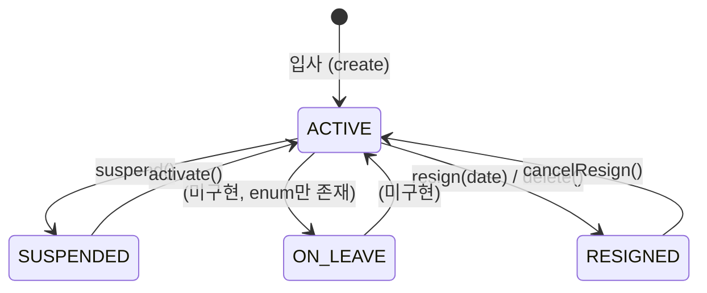
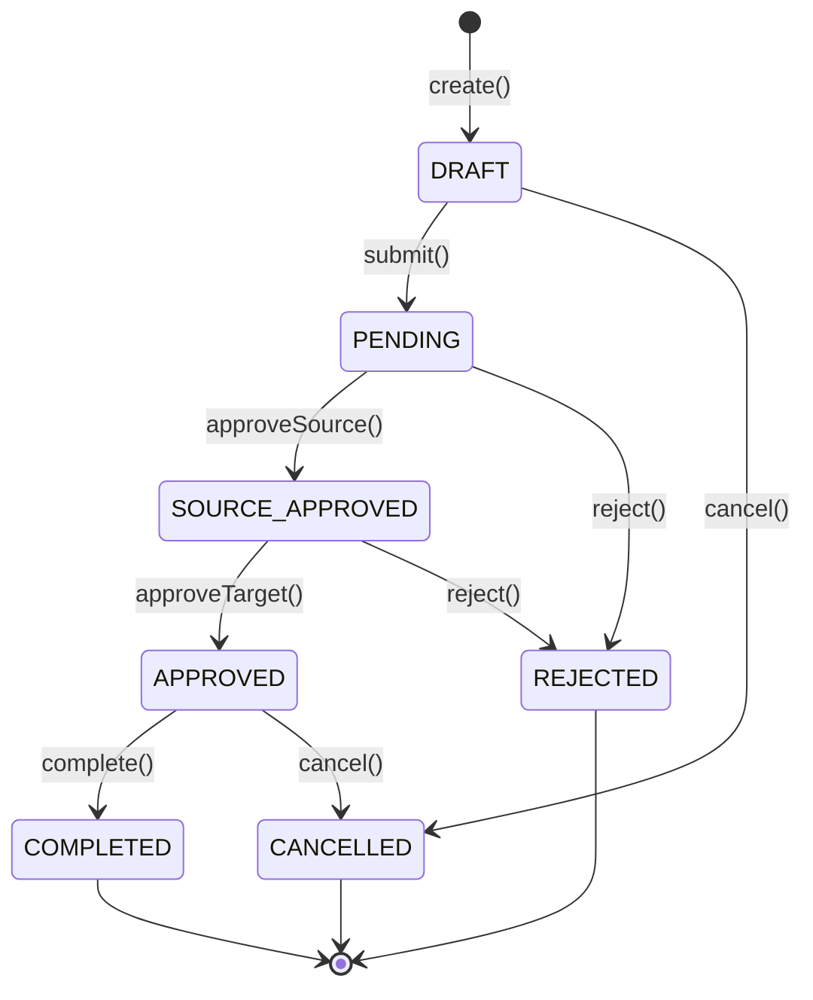
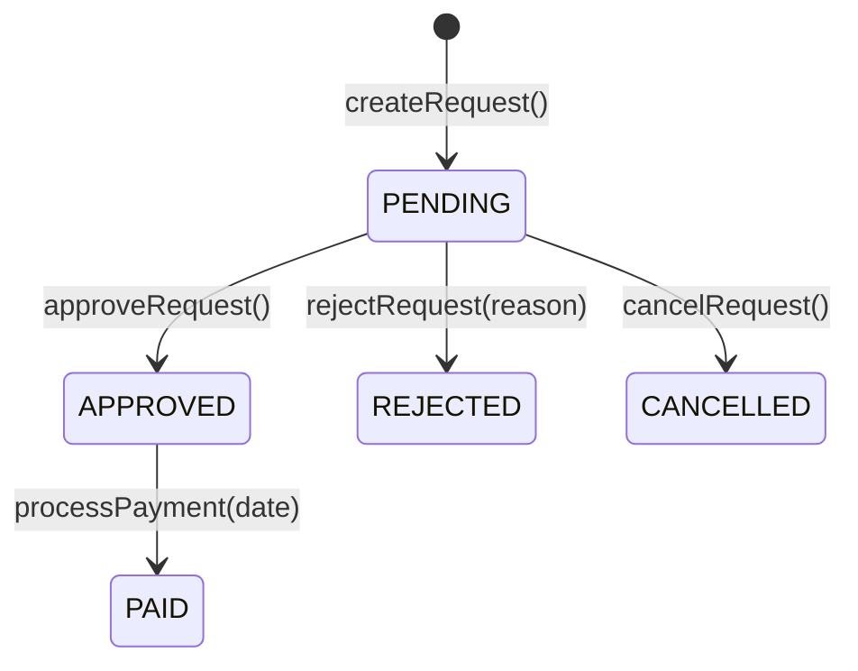
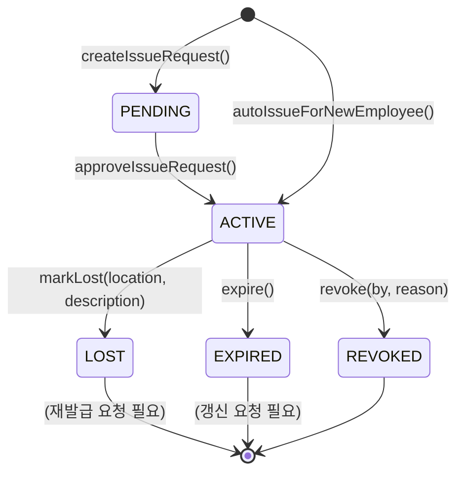
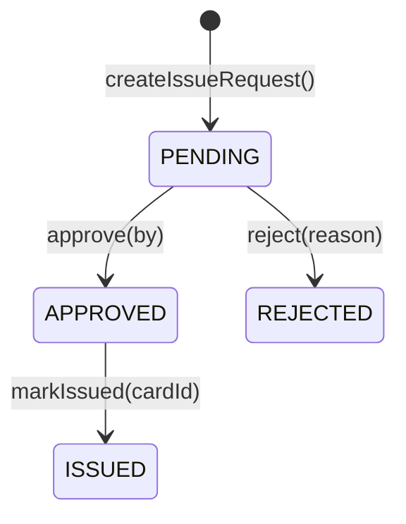
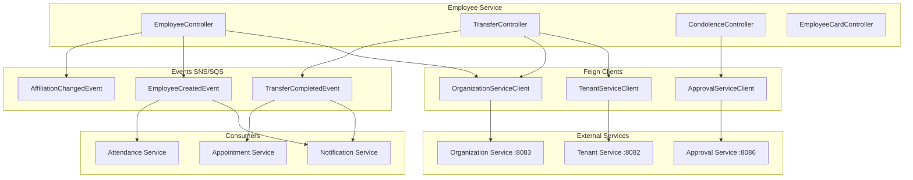

# Module 05: Employee Service -- PRD 및 프로덕션 정책 분석

> **최종 업데이트**: 2026-02-10
> **분석 범위**: `services/employee-service/`, `common/` 모듈
> **문서 버전**: v2.0 (Phase A/B/C 확장)
> **포트**: 8084
> **패키지**: `com.hrsaas.employee`
> **DB 스키마**: `hr_core`

---

## 목차
- [1. 현재 구현 상태 요약](#1-현재-구현-상태-요약)
- [2. 정책 결정사항](#2-정책-결정사항)
- [3. 기능 요구사항 Gap 분석 (Phase A)](#3-기능-요구사항-gap-분석-phase-a)
- [4. 비즈니스 규칙 상세 (Phase B)](#4-비즈니스-규칙-상세-phase-b)
- [5. 서비스 연동 명세 (Phase C)](#5-서비스-연동-명세-phase-c)
- [6. 데이터 모델](#6-데이터-모델)
- [7. API 명세](#7-api-명세)
- [8. 보안/프라이버시](#8-보안프라이버시)
- [9. 성능/NFR](#9-성능nfr)
- [10. 추적성 매트릭스](#10-추적성-매트릭스)
- [11. 변경 이력](#11-변경-이력)

---

## 1. 현재 구현 상태 요약

### 1.1 완료된 기능

| 기능 | 상태 | 설명 |
|------|------|------|
| 직원 CRUD | ✅ 완료 | 생성/조회/수정/삭제, 사번 조회, 본인 조회(/me) |
| 직원 검색 | ✅ 완료 | 이름, 부서, 상태별 페이징 검색 + pg_trgm GIN 인덱스 |
| 직원 퇴사/복직 | ✅ 완료 | resign(), cancelResign() 상태 관리 |
| 소프트 삭제 | ✅ 완료 | delete()가 resign(LocalDate.now()) 호출, bulkDelete()도 동일 |
| 인사이력 관리 | ✅ 완료 | 이력 CRUD + 자동 기록 (EmployeeHistoryRecorderImpl) |
| 가족정보 관리 | ✅ 완료 | 가족 CRUD (관계, 생년월일, 부양가족 여부) |
| 경력정보 관리 | ✅ 완료 | 경력 CRUD (회사명, 부서, 직책, 기간) |
| 학력정보 관리 | ✅ 완료 | 학력 CRUD (학교, 전공, 학위, 졸업상태) |
| 자격증 관리 | ✅ 완료 | 자격증 CRUD (자격증명, 발급기관, 번호) |
| 겸직/소속 관리 | ✅ 완료 | 주/부 소속, 겸직 관리, PRIMARY/SECONDARY/CONCURRENT |
| 사번 규칙 관리 | ✅ 완료 | 접두사, 연도포함, 시퀀스 자릿수, 리셋정책 설정 |
| 사번 자동 생성 | ✅ 완료 | 비관적 잠금(PESSIMISTIC_WRITE)으로 동시성 안전 |
| 본인정보 변경요청 | ✅ 완료 | 셀프서비스 변경 -> 승인 워크플로우 |
| 경조비 정책 | ✅ 완료 | 경조 유형별 금액/휴가일수 정책 CRUD + 활성/비활성 관리 |
| 경조비 신청 | ✅ 완료 | 신청/승인/반려/지급완료/취소 워크플로우 |
| 경조비 지급 관리 | ✅ 완료 | 개별/일괄 지급, 미지급 조회, 지급 이력 |
| 경조비 -> 결재 연동 | ✅ 완료 | ApprovalServiceClient Feign 연동, 결재 생성/승인/반려 |
| 전출/전입 요청 | ✅ 완료 | 계열사 간 전출입 전체 워크플로우 (양측 승인) |
| 전출 완료 자동 처리 | ✅ 완료 | 대상 테넌트 직원 생성 + 원본 RESIGNED + 이벤트 발행 |
| 인사기록카드 | ✅ 완료 | 종합 인사정보 조회 + PDF 생성 (PDFBox) + 한글 폰트 지원 |
| 일괄 처리 | ✅ 완료 | 일괄 등록 (validate-only 모드, 최대 1000건) |
| Excel Import/Export | ✅ 완료 | Apache POI 기반 내보내기/가져오기/템플릿 생성 |
| 직원 수 API | ✅ 완료 | 부서별/직책별/직급별 카운트 + 존재 확인 API |
| 주민번호 암호화 | ✅ 완료 | ResidentNumberConverter + EncryptionService 연동 |
| 마스킹 해제 감사 로그 | ✅ 완료 | PrivacyAccessLog 엔티티 + PrivacyAuditServiceImpl |
| 부서/직급/직책 검증 | ✅ 완료 | OrganizationValidationServiceImpl org-service Feign 검증 |
| 인사이력 자동 기록 | ✅ 완료 | EmployeeHistoryRecorderImpl: 부서/직급/직책 변경 시 자동 이력 |
| 사원증 관리 | ✅ 완료 | EmployeeCard BE: CRUD, 발급/분실/회수, 자동 발급 |
| 생년월일 관리 | ✅ 완료 | Employee.birthDate + 월-일 기반 생일 인덱스 |
| Feign Client | ✅ 완료 | tenant-service, organization-service, approval-service 연동 + 폴백 |
| 도메인 이벤트 | ✅ 완료 | EmployeeCreatedEvent, AffiliationChangedEvent, TransferCompletedEvent |
| RLS | ✅ 완료 | 모든 테넌트 테이블 적용, transfer_request 다중 테넌트 조건 |
| 캐싱 | ✅ 완료 | Employee 조회 결과 Redis 캐싱 |
| 개인정보 마스킹 | ✅ 완료 | PrivacyContext 연동, unmask API + 감사 로그 |
| SecurityFilter 이중 등록 방지 | ✅ 완료 | FilterRegistrationBean.setEnabled(false) 적용 |

### 1.2 미구현 / 갭

| 갭 ID | 기능 | 우선순위 | 설명 |
|--------|------|----------|------|
| EMP-G06 | PDF 한글 폰트 완전 지원 | LOW | Pretendard-Regular.ttf 로딩 구현됨, Bold 폰트 미분리 |
| EMP-G07 | ddl-auto: update -> validate | HIGH | 프로덕션 환경에서 ddl-auto: validate로 변경 필요 |
| EMP-G10 | 본인정보 변경 -> 결재 연동 | MEDIUM | ChangeRequest 승인 시 Approval Service 이벤트 연동 미구현 |
| EMP-G15 | 사원증 만료 임박 알림 | MEDIUM | 만료 30일 전 notification-service 연동 미구현 |
| EMP-G16 | 주민번호 열람 시 알림 | LOW | residentNumber unmask 시 notification-service 알림 미구현 |
| EMP-G17 | CircuitBreaker 본격 적용 | MEDIUM | Feign Client에 @CircuitBreaker 미적용 (try-catch 폴백만) |
| EMP-G18 | 동명이인 식별 기능 | LOW | PRD FR-EMP-003-04 요구, 미구현 |
| EMP-G19 | 퇴직 시 급여/근태 분리 보관 | LOW | PRD FR-EMP-003-02 요구, 미구현 |
| EMP-G20 | 가족 정보 수당 연계 | LOW | PRD FR-EMP-004-03 요구, 미구현 |
| EMP-G21 | 사원증 FE 상세/신청/승인 페이지 | MEDIUM | BE 완료, FE 상세/발급신청/승인 페이지 미구현 |

---

## 2. 정책 결정사항

### 2.1 경조비 승인 정책 ✅ 결정완료 + 구현완료

> **결정: Approval Service와 Feign 연동**

**구현 코드**: `CondolenceServiceImpl.createRequest()` -> `ApprovalServiceClient.createApproval()`

```
1. 경조비 신청 제출
   +-> CondolenceServiceImpl.createRequest()
      +-> ApprovalServiceClient.createApproval(type="CONDOLENCE", refId=requestId)
      +-> CondolenceRequest.status = PENDING, approvalId 저장
      +-> (실패 시 신청은 유지, 결재 연동 로그 경고)

2. 결재 완료 시 처리
   +-> CondolenceServiceImpl.approveByApproval(referenceId)
   +-> CondolenceServiceImpl.rejectByApproval(referenceId, reason)

3. 지급 처리
   +-> CondolenceServiceImpl.processPayment(id, paidDate)
   +-> CondolenceRequest.status = PAID
```

### 2.2 전출 완료 처리 정책 ✅ 결정완료 + 구현완료

> **결정: 대상 테넌트에 자동 생성 + 원본 RESIGNED 처리 + 이벤트 발행**

**구현 코드**: `TransferServiceImpl.complete()`

```
1. TransferRequest.status == APPROVED 검증
2. 원본 직원(source) 조회
3. TenantContext -> targetTenantId 전환
4. 대상 테넌트에 새 직원 생성 (새 사번 자동 채번)
5. 전입 이력 기록 (EmployeeHistoryRecorderImpl.recordHire)
6. TenantContext -> sourceTenantId 복원
7. 원본 직원 resign(transferDate)
8. 전출 이력 기록 (EmployeeHistoryRecorderImpl.recordResign)
9. TransferRequest.complete()
10. TransferCompletedEvent 발행
11. TenantContext 원본 복원
```

### 2.3 직원 삭제 정책 ✅ 결정완료 + 구현완료

> **결정: 소프트 삭제만 허용**

**구현 코드**: `EmployeeServiceImpl.delete()`, `EmployeeServiceImpl.bulkDelete()`

```java
// 현재 구현 (소프트 삭제)
public void delete(UUID id) {
    Employee employee = findById(id);
    employee.resign(LocalDate.now());
    employeeRepository.save(employee);
    log.info("Employee soft-deleted (resigned): id={}", id);
}
```

- `SUPER_ADMIN` 권한만 삭제(소프트) 가능 (`@PreAuthorize("hasRole('SUPER_ADMIN')")`)
- `bulkDelete()`도 동일한 소프트 삭제 패턴 적용

### 2.4 개인정보 마스킹 해제 정책 ✅ 결정완료 + 구현완료

> **결정: 사유 검증 + 감사 로그 기록**

**구현 코드**: `EmployeeServiceImpl.unmask()` + `PrivacyAuditServiceImpl.logAccess()`

1. 사유 최소 10자 검증 (EMP_030)
2. `PrivacyAuditServiceImpl.logAccess()` -> `PrivacyAccessLog` 저장 (REQUIRES_NEW 트랜잭션)
3. 감사 로그 필드: tenantId, actorId, actorName, employeeId, fieldName, reason, accessedAt, ipAddress
4. 지원 필드: phone, mobile, email, residentNumber (그 외 EMP_005 오류)

### 2.5 주민번호 암호화 정책 ✅ 결정완료 + 구현완료

> **결정: JPA AttributeConverter 기반 투명 암호화**

**구현 코드**: `ResidentNumberConverter` + `common-privacy/EncryptionService`

- `Employee.residentNumber`에 `@Convert(converter = ResidentNumberConverter.class)` 적용
- DB 컬럼 VARCHAR(500)으로 확장 (V3 마이그레이션)
- 레거시 평문 데이터 호환: `isEncrypted()` 체크 후 평문이면 그대로 반환

### 2.6 사원증 발급 정책 ✅ 결정완료 + 구현완료

> **결정: HR 직접 승인 방식, 입사 시 자동 발급 지원**

- **신규 발급 (NEW)**: `autoIssueForNewEmployee()` 호출 시 ACTIVE 카드 생성 (유효기간 3년)
- **재발급 (REISSUE)**: 분실 신고 후 발급 요청 -> HR 승인 -> 기존 카드 REVOKED + 새 카드 발급
- **갱신 (RENEWAL)**: 발급 요청 -> HR 승인 -> 새 카드 발급
- 카드번호 채번: `CARD-{YYYY}-{4자리 시퀀스}`

### 2.7 부서/직급/직책 검증 정책 ✅ 결정완료 + 구현완료

> **결정: Best-effort 검증 (org-service 장애 시 허용)**

**구현 코드**: `OrganizationValidationServiceImpl`

- 직원 수정(update) 시 departmentId, positionCode, jobTitleCode 변경 시 org-service 검증
- org-service 장애 시 로그 경고 후 허용 (서비스 가용성 우선)
- 검증 실패 에러코드: EMP_031 (부서), EMP_032 (직위), EMP_033 (직급)

---

## 3. 기능 요구사항 Gap 분석 (Phase A)

### 3.1 PRD vs 코드 비교표

| FR ID | PRD 요구사항 | 구현 상태 | 코드 위치 | 비고 |
|-------|-------------|-----------|-----------|------|
| FR-EMP-001-01 | 사원 정보 등록/수정/삭제 | ✅ 구현 | `EmployeeServiceImpl.create/update/delete` | 삭제는 소프트 삭제 |
| FR-EMP-001-02 | Excel/CSV 일괄 등록/수정 | ✅ 구현 | `ExcelEmployeeServiceImpl` | POI 기반, CSV 미지원 |
| FR-EMP-001-03 | 인사기록카드 조회/출력(PDF) | ✅ 구현 | `RecordCardServiceImpl` | PDFBox, 한글 폰트 로딩 구현 |
| FR-EMP-001-04 | 본인 정보 조회/변경 요청 | ✅ 구현 | `EmployeeChangeRequestController` | /me + change-requests |
| FR-EMP-001-05 | 변경 요청 HR 승인 후 반영 | ✅ 부분 | `EmployeeChangeRequestController.approve` | Approval Service 연동 미완 |
| FR-EMP-002-01 | 민감 개인정보 마스킹 | ✅ 구현 | `PrivacyContext` + `EmployeeServiceImpl.unmask()` | 4개 필드 지원 |
| FR-EMP-002-02 | 개인정보 조회 승인 절차 | ✅ 구현 | `unmask()` 사유 검증 | 별도 승인 워크플로우 없이 사유+로그 |
| FR-EMP-002-03 | 개인정보 조회 이력 기록/조회 | ✅ 구현 | `PrivacyAuditServiceImpl` + `PrivacyAccessLogRepository` | 조회 API는 서비스에만 존재 |
| FR-EMP-002-04 | 개인정보 Row Level 암호화 | ✅ 구현 | `ResidentNumberConverter` | JPA Converter 방식 |
| FR-EMP-003-01 | 사번 규칙 테넌트별 설정 | ✅ 구현 | `EmployeeNumberRuleController` + `EmployeeNumberGenerator` | 비관적 잠금 |
| FR-EMP-003-02 | 퇴직 시 급여/근태 분리 보관 | ❌ 미구현 | - | 별도 아카이빙 로직 필요 |
| FR-EMP-003-03 | 재입사 시 사번 재활용 선택 | ✅ 구현 | `EmployeeNumberRule.allowReuse` | 규칙에 필드 존재 |
| FR-EMP-003-04 | 동명이인 식별/관리 | ❌ 미구현 | - | 동명이인 경고 로직 없음 |
| FR-EMP-004-01 | 가족 정보 등록/수정/삭제 | ✅ 구현 | `EmployeeFamilyController` | CRUD 완료 |
| FR-EMP-004-02 | 가족관계 코드 관리 | ✅ 구현 | `FamilyRelationType` enum | 6가지 관계 유형 |
| FR-EMP-004-03 | 가족 정보 수당 연계 | ❌ 미구현 | - | 급여 서비스와 연동 필요 |
| FR-ORG-002-02 | 1인 다보직(겸직) 지원 | ✅ 구현 | `AffiliationController` | PRIMARY/SECONDARY/CONCURRENT |
| FR-ORG-002-03 | 주/부 소속 구분 관리 | ✅ 구현 | `EmployeeAffiliation.isPrimary` | 유니크 인덱스 보장 |
| FR-TM-003-03 | 계열사 간 인사이동 워크플로우 | ✅ 구현 | `TransferServiceImpl` | 전체 워크플로우 + 자동 완료 |

### 3.2 코드에만 있는 기능 (역분석)

| 기능 | 코드 위치 | 설명 |
|------|-----------|------|
| 경조비 시스템 | `CondolenceServiceImpl`, `CondolenceController` | 경조비 정책 + 신청 + 지급 관리 전체, PRD에 명시 없음 |
| 경조비 일괄 지급 | `CondolenceController.bulkProcessPayment` | 다건 동시 지급 처리 |
| 경조비 지급 이력 | `CondolenceController.getPaymentHistory` | 지급 완료 이력 조회 |
| 사원증 관리 | `EmployeeCardServiceImpl`, `EmployeeCardController` | BE 전체 구현 (FE 미완) |
| 생년월일 + 생일 조회 | `Employee.birthDate`, `EmployeeRepository.findUpcomingBirthdays()` | 월-일 인덱스 기반 |
| 직원 수 카운트 API | `EmployeeController.count()` | 부서/직책/직급별 카운트 |
| 직원 존재 여부 API | `EmployeeController.exists()` | 타 서비스 연동용 |
| 부서별 직원 그룹 카운트 | `EmployeeRepository.countByDepartmentGrouped()` | 대시보드용 |
| 신규/퇴사 통계 | `EmployeeRepository.countNewHires/countResigned` | 기간별 입사/퇴사 카운트 |
| Approval Service 연동 | `ApprovalServiceClient` | 결재 생성/취소 Feign Client |
| 조직 검증 서비스 | `OrganizationValidationServiceImpl` | 부서/직위/직급 유효성 검증 |
| 인사이력 자동 기록 | `EmployeeHistoryRecorderImpl` | 5가지 변경 유형 자동 기록 |

### 3.3 미구현 Gap 목록

| Gap ID | 설명 | 우선순위 | 영향도 |
|--------|------|----------|--------|
| EMP-G07 | ddl-auto: update -> validate 전환 | HIGH | 프로덕션 스키마 안전성 |
| EMP-G10 | 본인정보 변경 -> Approval Service 연동 | MEDIUM | 승인 워크플로우 일관성 |
| EMP-G15 | 사원증 만료 임박 알림 (30일 전) | MEDIUM | 사용자 경험 |
| EMP-G16 | 주민번호 열람 시 알림 발송 | LOW | 개인정보 보호 강화 |
| EMP-G17 | CircuitBreaker 어노테이션 적용 | MEDIUM | 서비스 복원력 |
| EMP-G18 | 동명이인 식별/경고 기능 | LOW | 데이터 품질 |
| EMP-G19 | 퇴직 시 급여/근태 분리 보관 | LOW | 법적 요구 |
| EMP-G20 | 가족 정보 기반 수당 연계 | LOW | 급여 서비스 연동 |
| EMP-G21 | 사원증 FE 상세/신청/승인 페이지 | MEDIUM | 사용자 접근성 |
| EMP-G22 | CSV import 지원 | LOW | Excel만 지원, CSV 미지원 |
| EMP-G23 | 개인정보 열람 이력 조회 컨트롤러 | LOW | 서비스 존재, REST API 미노출 |

### 3.4 v1.0 Gap 재검증

| v1.0 Gap ID | v1.0 설명 | v2.0 상태 | 비고 |
|-------------|-----------|-----------|------|
| EMP-G01 | 경조비 -> 결재 서비스 연동 | ✅ 해소 | `ApprovalServiceClient` + `CondolenceServiceImpl` |
| EMP-G02 | 전출 완료 시 자동 처리 | ✅ 해소 | `TransferServiceImpl.complete()` 전체 구현 |
| EMP-G03 | 물리 삭제 -> 소프트 삭제 | ✅ 해소 | `delete()`, `bulkDelete()` 모두 소프트 삭제 |
| EMP-G04 | 마스킹 해제 감사 로그 | ✅ 해소 | `PrivacyAuditServiceImpl` + `PrivacyAccessLog` |
| EMP-G05 | Excel Import/Export | ✅ 해소 | `ExcelEmployeeServiceImpl` (Apache POI) |
| EMP-G06 | PDF 한글 폰트 | ✅ 부분해소 | Pretendard-Regular.ttf 로딩, Bold 미분리 |
| EMP-G07 | ddl-auto: update -> validate | ❌ 미해소 | 여전히 `ddl-auto: update` |
| EMP-G08 | 전출 완료 시 이벤트 발행 | ✅ 해소 | `TransferCompletedEvent` 발행 구현 |
| EMP-G09 | 부서/직급/직책 검증 | ✅ 해소 | `OrganizationValidationServiceImpl` |
| EMP-G10 | 본인정보 변경 -> 결재 연동 | ❌ 미해소 | Approval Service 연동 미구현 |
| EMP-G11 | 주민번호 암호화 | ✅ 해소 | `ResidentNumberConverter` + V3 마이그레이션 |
| EMP-G12 | 일괄 퇴사 처리 | ✅ 해소 | `bulkDelete()` -> 소프트 삭제 |
| EMP-G13 | 직원 수 API | ✅ 해소 | `EmployeeController.count()` 3가지 기준 |
| EMP-G14 | 인사이력 자동 기록 | ✅ 해소 | `EmployeeHistoryRecorderImpl` 5가지 유형 |

### 3.5 Gap 해소 로드맵

**HIGH 우선순위** (즉시)
1. **EMP-G07**: `application.yml` 프로파일별 ddl-auto 설정 분리 (prod: validate)

**MEDIUM 우선순위** (1-2 스프린트)
2. **EMP-G10**: ChangeRequest 승인 시 Approval Service 이벤트 연동
3. **EMP-G15**: 사원증 만료 임박 알림 스케줄러 + notification-service 연동
4. **EMP-G17**: Feign Client에 @CircuitBreaker 어노테이션 적용
5. **EMP-G21**: 사원증 FE 상세/발급신청/관리자승인 페이지 구현

**LOW 우선순위** (백로그)
6. **EMP-G16**: unmask 시 주민번호 열람 알림
7. **EMP-G18**: 동명이인 식별 기능
8. **EMP-G19**: 퇴직 시 급여/근태 데이터 분리 보관
9. **EMP-G20**: 가족 정보 수당 연계
10. **EMP-G22**: CSV import 지원
11. **EMP-G23**: 개인정보 열람 이력 조회 REST API 노출

---

## 4. 비즈니스 규칙 상세 (Phase B)

### 4.1 상태 머신

#### 4.1.1 직원 상태 (EmployeeStatus)



| 상태 | 설명 | 조회 대상 | 전이 메서드 |
|------|------|-----------|-------------|
| ACTIVE | 재직 중 | 기본 조회 대상 | `Employee.activate()` |
| SUSPENDED | 휴직 중 | 조회 가능 | `Employee.suspend()` |
| ON_LEAVE | 휴가 중 | 조회 가능 | (enum만 존재, 메서드 미구현) |
| RESIGNED | 퇴사/전출/소프트삭제 | 명시적 필터링 시에만 | `Employee.resign(date)` |

#### 4.1.2 전출/전입 상태 (TransferStatus)



> 참고: `TransferStatus.TARGET_APPROVED` enum 값은 존재하나 코드에서 사용되지 않음. `approveTarget()`은 APPROVED로 직접 전이.

#### 4.1.3 경조비 신청 상태 (CondolenceStatus)



#### 4.1.4 사원증 상태 (CardStatus)



#### 4.1.5 카드 발급 요청 상태 (CardIssueRequestStatus)



### 4.2 유효성 검증 규칙 카탈로그

| Rule ID | 필드/조건 | 규칙 | 코드 위치 |
|---------|-----------|------|-----------|
| VR-001 | employeeNumber | 테넌트 내 유일성 | `EmployeeServiceImpl.create()` |
| VR-002 | email | 테넌트 내 유일성 | `EmployeeServiceImpl.create()` |
| VR-003 | cancelResign | status == RESIGNED 인 경우만 | `EmployeeServiceImpl.cancelResign()` |
| VR-004 | unmask.reason | 최소 10자 이상 | `EmployeeServiceImpl.unmask()` |
| VR-005 | unmask.field | phone/mobile/email/residentNumber만 허용 | `EmployeeServiceImpl.unmask()` |
| VR-006 | transfer.update | DRAFT 상태만 수정 가능 | `TransferRequest.canBeModified()` |
| VR-007 | transfer.delete | DRAFT 상태만 삭제 가능 | `TransferRequest.canBeDeleted()` |
| VR-008 | transfer.submit | DRAFT 상태만 제출 가능 | `TransferRequest.canBeSubmitted()` |
| VR-009 | transfer.approveSource | PENDING 상태만 승인 가능 | `TransferServiceImpl.approveSource()` |
| VR-010 | transfer.approveTarget | SOURCE_APPROVED 상태만 승인 가능 | `TransferServiceImpl.approveTarget()` |
| VR-011 | transfer.complete | APPROVED 상태만 완료 가능 | `TransferServiceImpl.complete()` |
| VR-012 | transfer.cancel | COMPLETED 제외 취소 가능 | `TransferServiceImpl.cancel()` |
| VR-013 | transfer.reject | COMPLETED/REJECTED/CANCELLED 제외 | `TransferServiceImpl.reject()` |
| VR-014 | condolence.update | PENDING 상태만 수정 가능 | `CondolenceRequest.canBeModified()` |
| VR-015 | condolence.processPayment | APPROVED 상태만 지급 가능 | `CondolenceServiceImpl.processPayment()` |
| VR-016 | condolencePolicy | 테넌트 내 eventType 유일성 | `CondolenceServiceImpl.createPolicy()` |
| VR-017 | departmentId | org-service 존재 검증 (best-effort) | `OrganizationValidationServiceImpl` |
| VR-018 | positionCode | org-service 존재 검증 (best-effort) | `OrganizationValidationServiceImpl` |
| VR-019 | jobTitleCode | org-service 존재 검증 (best-effort) | `OrganizationValidationServiceImpl` |
| VR-020 | card.approve | PENDING 상태만 승인 가능 | `EmployeeCardServiceImpl` |
| VR-021 | card.revoke | ACTIVE 상태만 회수 가능 | `EmployeeCardServiceImpl` |
| VR-022 | affiliation.primary | 테넌트당 직원당 1개 PRIMARY 소속 | DB 유니크 인덱스 |

### 4.3 계산 공식/로직 명세

#### 4.3.1 근속연수 계산

```
입력: hireDate (입사일), 기준일 (현재 날짜)
출력: yearsOfService (년), monthsOfService (개월)

공식:
  Period period = Period.between(hireDate, LocalDate.now())
  yearsOfService = period.getYears()
  monthsOfService = period.getMonths()
```

**코드**: `RecordCardResponse.calculateServiceYears()`

#### 4.3.2 사번 자동 생성

```
입력: EmployeeNumberRule (prefix, includeYear, yearFormat, sequenceDigits, separator, sequenceResetPolicy)
출력: employeeNumber (예: "EMP-2026-0001")

로직:
  1. PESSIMISTIC_WRITE 잠금으로 EmployeeNumberRule 조회
  2. sequenceResetPolicy == YEARLY && currentYear != thisYear:
     -> currentSequence = 0, currentYear = thisYear
  3. currentSequence++
  4. 포맷: prefix + separator + year(yearFormat) + separator + sequence(sequenceDigits)
```

**코드**: `EmployeeNumberGenerator.generate()`

#### 4.3.3 카드번호 채번

```
입력: tenantId, 현재 연도
출력: cardNumber (예: "CARD-2026-0001")

로직:
  1. findTopByTenantIdOrderByCardNumberDesc(tenantId)
  2. 마지막 카드번호 파싱 (CARD-YYYY-SSSS)
  3. 같은 연도면 sequence + 1, 다른 연도면 1부터
  4. String.format("CARD-%d-%04d", year, sequence)
```

**코드**: `EmployeeCardServiceImpl.generateCardNumber()`

#### 4.3.4 경조비 금액 자동 설정

```
입력: policyId 또는 eventType
출력: amount (금액), leaveDays (휴가일수)

로직:
  1. policyId 지정 시: 해당 정책에서 amount, leaveDays 가져옴
  2. policyId 미지정 시: eventType으로 테넌트별 정책 조회
  3. 정책 미존재 시: amount=null, leaveDays=null
```

**코드**: `CondolenceServiceImpl.createRequest()`

### 4.4 데이터 생명주기 정책

| 데이터 | 삭제 방식 | 보존 기간 | 비고 |
|--------|-----------|-----------|------|
| Employee | 소프트 삭제 (RESIGNED) | 무기한 | 법적 보존 의무 |
| EmployeeHistory | CASCADE (부모 삭제 시) | 무기한 | 소프트 삭제 정책 적용으로 연쇄 삭제 방지 |
| EmployeeFamily | CASCADE (부모 삭제 시) | 무기한 | 소프트 삭제 정책 적용으로 연쇄 삭제 방지 |
| EmployeeEducation | CASCADE (부모 삭제 시) | 무기한 | 소프트 삭제 정책 적용으로 연쇄 삭제 방지 |
| EmployeeCareer | CASCADE (부모 삭제 시) | 무기한 | 소프트 삭제 정책 적용으로 연쇄 삭제 방지 |
| EmployeeCertificate | CASCADE (부모 삭제 시) | 무기한 | 소프트 삭제 정책 적용으로 연쇄 삭제 방지 |
| EmployeeAffiliation | 소프트 삭제 (isActive=false) | 무기한 | endDate 설정 |
| CondolenceRequest | 물리 삭제 (PENDING만) | 무기한 | PENDING 외 상태는 삭제 불가 |
| CondolencePolicy | 물리 삭제 | N/A | 삭제 시 연관 신청 정책 참조 소실 주의 |
| TransferRequest | 물리 삭제 (DRAFT만) | 무기한 | DRAFT 외 상태는 삭제 불가 |
| PrivacyAccessLog | 삭제 불가 | 5년 (개인정보보호법) | 감사 로그 |
| EmployeeCard | 상태 변경만 | 무기한 | REVOKED/LOST/EXPIRED |
| CardIssueRequest | 삭제 불가 | 무기한 | 이력 보존 |

### 4.5 엣지 케이스 카탈로그

| EC ID | 시나리오 | 현재 동작 | 권장 조치 |
|-------|----------|-----------|-----------|
| EC-001 | 전출 완료 중 대상 테넌트 직원 생성 실패 | 예외 발생, 전체 트랜잭션 롤백 | 현재 단일 트랜잭션 (Saga 미적용) |
| EC-002 | 전출 완료 시 대상 테넌트 사번 규칙 미설정 | EmployeeNumberGenerator에서 기본 규칙 적용 | 명시적 오류 반환 고려 |
| EC-003 | 경조비 신청 시 Approval Service 장애 | 신청 생성, approvalId=null, 로그 경고 | 비동기 재시도 메커니즘 추가 |
| EC-004 | 동일 직원 중복 전출 요청 | 제한 없음, 중복 생성 가능 | 활성 전출 요청 존재 시 차단 |
| EC-005 | 소프트 삭제된 직원 연관 데이터 | RESIGNED 직원의 가족/경력 등 유지 | 정상 동작 (의도된 설계) |
| EC-006 | 캐시 무효화 시점 | CUD 시 allEntries 전체 무효화 | 개별 키 무효화로 최적화 가능 |
| EC-007 | 사번 재사용 허용 시 퇴사자 사번 재부여 | allowReuse 플래그만 존재, 실제 로직 미구현 | 재사용 로직 구현 필요 |
| EC-008 | 생일 조회 시 연도 경계 (12월->1월) | startMonthDay > endMonthDay 시 처리 미구현 | BETWEEN 조건 수정 필요 |
| EC-009 | org-service 장애 시 직원 생성 | departmentId 검증 스킵, 생성 허용 | 현재 best-effort (의도된 설계) |
| EC-010 | 사원증 카드번호 동시 채번 | 비관적 잠금 미적용, 중복 가능성 | PESSIMISTIC_WRITE 또는 DB 시퀀스 적용 |

---

## 5. 서비스 연동 명세 (Phase C)

### 5.1 연동 아키텍처



### 5.2 REST API 연동 (Feign Client)

| Client | Method | 호출 대상 | 용도 | 폴백 |
|--------|--------|-----------|------|------|
| `TenantServiceClient` | `GET /api/v1/tenants` | tenant-service:8082 | 전출 가능 계열사 목록 조회 | 하드코딩 4개 테넌트 반환 |
| `OrganizationServiceClient` | `GET /api/v1/departments` | organization-service:8083 | 대상 테넌트 부서 목록 조회 | 하드코딩 5개 부서 반환 |
| `OrganizationServiceClient` | `GET /api/v1/positions` | organization-service:8083 | 대상 테넌트 직책 목록 조회 | 하드코딩 5개 직책 반환 |
| `OrganizationServiceClient` | `GET /api/v1/grades` | organization-service:8083 | 대상 테넌트 직급 목록 조회 | 하드코딩 5개 직급 반환 |
| `OrganizationServiceClient` | (검증용) | organization-service:8083 | 직원 수정 시 부서/직위/직급 유효성 | org-service 장애 시 허용 |
| `ApprovalServiceClient` | `POST /api/v1/approvals` | approval-service:8086 | 경조비 결재 요청 생성 | 실패 시 로그 경고, 신청 유지 |
| `ApprovalServiceClient` | `DELETE /api/v1/approvals/{id}` | approval-service:8086 | 결재 요청 취소 | - |

**Feign 공통 설정** (`FeignClientConfig`):
- JWT 헤더 전파 (Authorization 헤더 포워딩)
- connectTimeout: 5,000ms
- readTimeout: 5,000ms
- loggerLevel: basic

### 5.3 이벤트 연동 (SNS/SQS)

**발행하는 이벤트:**

| 이벤트 | 토픽 | 페이로드 | 발행 시점 |
|--------|------|----------|-----------|
| `EmployeeCreatedEvent` | `EventTopics.EMPLOYEE_CREATED` | employeeId, employeeNumber, name, tenantId | `EmployeeServiceImpl.create()` |
| `EmployeeAffiliationChangedEvent` | `EventTopics.AFFILIATION_CHANGED` | employeeId, affiliationType, departmentId | `AffiliationService` 소속 변경 시 |
| `TransferCompletedEvent` | `EventTopics.EMPLOYEE_TRANSFER_COMPLETED` | transferRequestId, sourceEmployeeId, targetEmployeeId, sourceTenantId, targetTenantId | `TransferServiceImpl.complete()` |

**구독하는 이벤트:**

| 이벤트 | 토픽 | 처리 | 현재 상태 |
|--------|------|------|-----------|
| `ApprovalCompletedEvent` | `hr-saas.approval.completed` | `CondolenceServiceImpl.approveByApproval/rejectByApproval` | 메서드 존재, SQS 리스너 미구현 |

### 5.4 데이터 동기화 흐름

#### 5.4.1 직원 생성 -> 타 서비스 동기화

```
EmployeeServiceImpl.create()
  -> employeeRepository.save()
  -> eventPublisher.publish(EmployeeCreatedEvent)
     -> SNS: hr-saas-employee-created
        -> SQS: attendance-service (근태 대상 등록)
        -> SQS: notification-service (환영 알림)
```

#### 5.4.2 전출 완료 -> 크로스 테넌트 동기화

```
TransferServiceImpl.complete()
  -> [Target Tenant] 새 직원 생성 + 입사 이력
  -> [Source Tenant] 원본 퇴사 + 퇴사 이력
  -> eventPublisher.publish(TransferCompletedEvent)
     -> SNS: hr-saas-employee-transfer-completed
```

> 주의: 전출 완료는 단일 트랜잭션 내 TenantContext 전환으로 처리. 분산 트랜잭션(Saga) 미적용.

#### 5.4.3 경조비 -> 결재 서비스 동기화

```
CondolenceServiceImpl.createRequest()
  -> condolenceRequestRepository.save()
  -> approvalServiceClient.createApproval() [try-catch]
     -> 성공: approvalId 저장
     -> 실패: 로그 경고, 신청 유지 (approvalId=null)
```

### 5.5 통합 테스트 시나리오

| # | 시나리오 | 연동 서비스 | 기대 결과 |
|---|---------|------------|-----------|
| 1 | 직원 생성 -> EmployeeCreatedEvent 발행 | SNS/SQS | 이벤트 메시지 발행, 구독 서비스 수신 |
| 2 | 전출 DRAFT -> COMPLETED 전체 흐름 | tenant-service, org-service | 대상 테넌트 직원 생성 + 원본 퇴사 + TransferCompletedEvent |
| 3 | 경조비 신청 -> approval-service 결재 생성 | approval-service | 결재 요청 생성, approvalId 저장 |
| 4 | approval-service 장애 시 경조비 신청 | approval-service (장애) | 신청 성공, approvalId=null, 로그 경고 |
| 5 | 직원 수정 시 부서 유효성 검증 | org-service | 유효하지 않은 부서 -> EMP_031 오류 |
| 6 | org-service 장애 시 직원 수정 | org-service (장애) | 수정 성공, 로그 경고 |
| 7 | 전출 시 대상 테넌트 부서/직책/직급 조회 | org-service | 목록 반환 또는 폴백 데이터 |
| 8 | tenant-service 장애 시 전출 가능 계열사 조회 | tenant-service (장애) | 폴백 테넌트 목록 반환 |
| 9 | 사원증 자동 발급 -> 카드 생성 | (내부) | ACTIVE 카드 생성, 카드번호 채번 |
| 10 | 전출 완료 실패 시 전체 롤백 | 내부 트랜잭션 | 대상 직원 미생성, 원본 상태 유지 |

---

## 6. 데이터 모델

### 6.1 테이블 목록

| # | 테이블 | 마이그레이션 | RLS | 설명 |
|---|--------|------------|-----|------|
| 1 | `employee` | V1, V3(컬럼 확장), V6(birth_date) | ✅ | 직원 마스터 |
| 2 | `employee_history` | V1 | ✅ | 인사이력 (FK CASCADE) |
| 3 | `employee_family` | V1 | ✅ | 가족정보 (FK CASCADE) |
| 4 | `employee_education` | V1 | ✅ | 학력정보 (FK CASCADE) |
| 5 | `employee_career` | V1 | ✅ | 경력정보 (FK CASCADE) |
| 6 | `employee_certificate` | V1 | ✅ | 자격증정보 (FK CASCADE) |
| 7 | `condolence_policy` | V1 | ✅ | 경조비 정책 |
| 8 | `condolence_request` | V1 | ✅ | 경조비 신청 (FK -> policy) |
| 9 | `transfer_request` | V1 | ✅ (다중 조건) | 전출/전입 요청 |
| 10 | `employee_affiliation` | V2 | ✅ | 겸직/소속 |
| 11 | `employee_number_rule` | V2 | - | 사번 규칙 (테넌트당 1개) |
| 12 | `employee_change_request` | V2 | ✅ | 본인정보 변경요청 |
| 13 | `privacy_access_log` | V3 | ✅ | 개인정보 열람 감사 로그 |
| 14 | `employee_card` | V4 | ✅ | 사원증 |
| 15 | `card_issue_request` | V4 | ✅ | 카드 발급 요청 |

### 6.2 RLS 정책

| 테이블 | 정책 | 조건 |
|--------|------|------|
| employee 외 12개 | `{table}_tenant_isolation` | `tenant_id = get_current_tenant_safe()` |
| transfer_request | `transfer_request_tenant_isolation` | `tenant_id OR source_tenant_id OR target_tenant_id` |
| privacy_access_log | `privacy_access_log_tenant_isolation` | `tenant_id = current_setting('app.current_tenant')` |

### 6.3 인덱스

| 테이블 | 인덱스 | 유형 | 목적 |
|--------|--------|------|------|
| employee | `uq_employee_tenant_number` | UNIQUE | 테넌트 내 사번 유일성 |
| employee | `idx_employee_tenant_id` | B-tree | 테넌트별 조회 |
| employee | `idx_employee_status` | B-tree | 상태별 필터 |
| employee | `idx_employee_department_id` | B-tree | 부서별 조회 |
| employee | `idx_employee_name` | B-tree | 이름 검색 |
| employee | `idx_employee_name_trgm` | GIN (pg_trgm) | LIKE '%name%' 검색 최적화 (V5) |
| employee | `idx_employees_birth_date_md` | 함수 인덱스 | 월-일 기반 생일 조회 (V6) |
| employee | `idx_employee_manager_id` | B-tree | 관리자 조회 |
| employee | `idx_employee_user_id` | B-tree | 인증 계정 매핑 |
| employee | `idx_employee_hire_date` | B-tree | 입사일 조회 |
| transfer_request | `idx_transfer_request_source_tenant_status` | B-tree | 전출 상태별 조회 (V5) |
| transfer_request | `idx_transfer_request_target_tenant_status` | B-tree | 전입 상태별 조회 (V5) |
| privacy_access_log | `idx_privacy_access_log_employee` | B-tree | 직원별 감사 로그 (V3) |
| privacy_access_log | `idx_privacy_access_log_actor` | B-tree | 접근자별 감사 로그 (V3) |
| privacy_access_log | `idx_privacy_access_log_accessed_at` | B-tree | 시간대별 조회 (V3) |
| employee_card | `UNIQUE(tenant_id, card_number)` | UNIQUE | 테넌트 내 카드번호 유일성 (V4) |
| employee_card | `idx_employee_card_employee` | B-tree | 직원별 카드 조회 (V4) |
| employee_card | `idx_employee_card_tenant_status` | B-tree | 테넌트+상태 조회 (V4) |
| card_issue_request | `UNIQUE(tenant_id, request_number)` | UNIQUE | 요청번호 유일성 (V4) |
| card_issue_request | `idx_card_issue_request_tenant` | B-tree | 테넌트+상태 조회 (V4) |
| card_issue_request | `idx_card_issue_request_employee` | B-tree | 직원별 요청 조회 (V4) |

### 6.4 주요 엔티티 구조

```
Employee (extends TenantAwareEntity)
+-- id: UUID (PK)
+-- tenant_id: UUID (RLS)
+-- employee_number: VARCHAR(50) [UNIQUE(tenant_id)]
+-- name, name_en, email, phone, mobile
+-- birth_date: DATE (V6)
+-- department_id: UUID
+-- position_code, job_title_code: VARCHAR(50)
+-- hire_date, resign_date: DATE
+-- status: EmployeeStatus (ACTIVE/SUSPENDED/ON_LEAVE/RESIGNED)
+-- employment_type: EmploymentType (REGULAR/CONTRACT/PART_TIME/INTERN)
+-- manager_id, user_id: UUID
+-- resident_number: VARCHAR(500) [@Convert ResidentNumberConverter]
|
+-- EmployeeHistory (1:N, ON DELETE CASCADE)
+-- EmployeeFamily (1:N, ON DELETE CASCADE)
+-- EmployeeEducation (1:N, ON DELETE CASCADE)
+-- EmployeeCareer (1:N, ON DELETE CASCADE)
+-- EmployeeCertificate (1:N, ON DELETE CASCADE)
+-- EmployeeAffiliation (1:N, soft delete)
+-- EmployeeCard (1:N)
+-- CondolenceRequest (1:N)
+-- EmployeeChangeRequest (1:N)
```

---

## 7. API 명세

### 7.1 직원 기본 API (`/api/v1/employees`)

| Method | Path | 권한 | 설명 |
|--------|------|------|------|
| GET | `/me` | 인증 | 본인 정보 조회 |
| GET | `/{id}` | EMPLOYEE/HR_ADMIN+ | 직원 상세 조회 |
| GET | `/employee-number/{num}` | HR_ADMIN+ | 사번으로 조회 |
| GET | (search) | EMPLOYEE/HR_ADMIN+ | 직원 검색 (페이징) |
| POST | | HR_ADMIN/TENANT_ADMIN/SUPER_ADMIN | 직원 생성 |
| PUT | `/{id}` | HR_ADMIN+ 또는 본인 | 직원 수정 |
| DELETE | `/{id}` | SUPER_ADMIN | 직원 소프트 삭제 |
| POST | `/{id}/resign` | HR_ADMIN+ | 퇴사 처리 |
| POST | `/{id}/resign/cancel` | HR_ADMIN+ | 퇴사 취소 |
| POST | `/{id}/unmask` | HR_ADMIN+ | 마스킹 해제 |
| GET | `/export` | HR_ADMIN+ | Excel 내보내기 |
| POST | `/import` | HR_ADMIN+ | Excel 가져오기 |
| GET | `/import/template` | HR_ADMIN+ | 가져오기 템플릿 |
| POST | `/bulk-delete` | SUPER_ADMIN | 일괄 소프트 삭제 |
| GET | `/count` | HR_ADMIN+ | 직원 수 조회 (부서/직책/직급) |
| GET | `/{id}/exists` | HR_ADMIN+ | 직원 존재 확인 |

### 7.2 직원 상세정보 API (`/api/v1/employees/{employeeId}`)

| Method | Path | 권한 | 설명 |
|--------|------|------|------|
| POST | `/careers` | HR_ADMIN+ | 경력 추가 |
| GET | `/careers` | 인증 | 경력 목록 |
| DELETE | `/careers/{id}` | HR_ADMIN+ | 경력 삭제 |
| POST | `/educations` | HR_ADMIN+ | 학력 추가 |
| GET | `/educations` | 인증 | 학력 목록 |
| DELETE | `/educations/{id}` | HR_ADMIN+ | 학력 삭제 |
| POST | `/certificates` | HR_ADMIN+ | 자격증 추가 |
| GET | `/certificates` | 인증 | 자격증 목록 |
| DELETE | `/certificates/{id}` | HR_ADMIN+ | 자격증 삭제 |

### 7.3 인사이력 API (`/api/v1/employees/{employeeId}/histories`)

| Method | Path | 권한 | 설명 |
|--------|------|------|------|
| GET | | 인증 | 인사이력 목록 |
| POST | | HR_ADMIN+ | 인사이력 추가 |

### 7.4 가족정보 API (`/api/v1/employees/{employeeId}/family`)

| Method | Path | 권한 | 설명 |
|--------|------|------|------|
| GET | | 인증 | 가족 목록 |
| POST | | 인증 (본인) | 가족 추가 |
| PUT | `/{familyId}` | 인증 (본인) | 가족 수정 |
| DELETE | `/{familyId}` | 인증 (본인) | 가족 삭제 |

### 7.5 겸직/소속 API (`/api/v1/employees/{employeeId}/affiliations`)

| Method | Path | 권한 | 설명 |
|--------|------|------|------|
| GET | | 인증 | 소속 목록 |
| POST | | HR_ADMIN+ | 소속 추가 |
| PUT | `/{affiliationId}` | HR_ADMIN+ | 소속 수정 |
| DELETE | `/{affiliationId}` | HR_ADMIN+ | 소속 해제 (비활성화) |

### 7.6 인사기록카드 API (`/api/v1/employees/{employeeId}/record-card`)

| Method | Path | 권한 | 설명 |
|--------|------|------|------|
| GET | | HR_ADMIN+ | 인사기록카드 조회 (JSON) |
| GET | `/pdf` | HR_ADMIN+ | 인사기록카드 PDF |

### 7.7 일괄 처리 API (`/api/v1/employees/bulk`)

| Method | Path | 권한 | 설명 |
|--------|------|------|------|
| POST | | HR_ADMIN+ | 일괄 등록 (최대 1000건) |
| POST | `/validate` | HR_ADMIN+ | 검증만 (실제 저장 안 함) |

### 7.8 사번 규칙 API (`/api/v1/employees/number-rules`)

| Method | Path | 권한 | 설명 |
|--------|------|------|------|
| GET | | TENANT_ADMIN+ | 현재 사번 규칙 조회 |
| POST | | TENANT_ADMIN+ | 사번 규칙 생성/수정 |

### 7.9 본인정보 변경 API (`/api/v1/employees/me/change-requests`)

| Method | Path | 권한 | 설명 |
|--------|------|------|------|
| GET | | 인증 (본인) | 변경 요청 목록 |
| POST | | 인증 (본인) | 변경 요청 생성 |
| POST | `/{id}/approve` | HR_ADMIN+ | 변경 요청 승인 |
| POST | `/{id}/reject` | HR_ADMIN+ | 변경 요청 거부 |

### 7.10 경조비 API (`/api/v1/condolences`)

| Method | Path | 권한 | 설명 |
|--------|------|------|------|
| POST | | 인증 | 경조비 신청 |
| GET | `/{id}` | 인증 | 신청 상세 |
| GET | | HR_ADMIN+ | 전체 신청 목록 (status 필터) |
| GET | `/my` | 인증 | 본인 신청 목록 |
| PUT | `/{id}` | 인증 | 신청 수정 (PENDING만) |
| DELETE | `/{id}` | 인증 | 신청 삭제 |
| POST | `/{id}/cancel` | 인증 | 신청 취소 |
| POST | `/{id}/approve` | HR_ADMIN+ | 승인 |
| POST | `/{id}/reject` | HR_ADMIN+ | 반려 |
| POST | `/{id}/pay` | HR_ADMIN+ | 지급 처리 |
| GET | `/payments/pending` | HR_ADMIN+ | 미지급 목록 |
| POST | `/payments/bulk` | HR_ADMIN+ | 일괄 지급 |
| GET | `/payments/history` | HR_ADMIN+ | 지급 이력 |
| GET | `/policies` | 인증 | 정책 목록 (activeOnly) |
| GET | `/policies/{id}` | 인증 | 정책 상세 |
| POST | `/policies` | HR_ADMIN+ | 정책 생성 |
| PUT | `/policies/{id}` | HR_ADMIN+ | 정책 수정 |
| DELETE | `/policies/{id}` | TENANT_ADMIN+ | 정책 삭제 |

### 7.11 전출/전입 API (`/api/v1/transfers`)

| Method | Path | 권한 | 설명 |
|--------|------|------|------|
| POST | | HR_ADMIN+ | 전출 요청 생성 |
| GET | `/{id}` | HR_ADMIN+ | 전출 요청 상세 |
| GET | | HR_ADMIN+ | 전출 요청 목록 (페이징) |
| GET | `/summary` | HR_ADMIN+ | 전출/전입 요약 |
| PUT | `/{id}` | HR_ADMIN+ | 요청 수정 (DRAFT만) |
| DELETE | `/{id}` | HR_ADMIN+ | 요청 삭제 (DRAFT만) |
| POST | `/{id}/submit` | HR_ADMIN+ | 제출 |
| POST | `/{id}/approve-source` | TENANT_ADMIN+ | 전출 승인 |
| POST | `/{id}/approve-target` | TENANT_ADMIN+ | 전입 승인 |
| POST | `/{id}/reject` | TENANT_ADMIN+ | 거부 |
| POST | `/{id}/complete` | TENANT_ADMIN+ | 완료 처리 |
| POST | `/{id}/cancel` | HR_ADMIN+ | 취소 |
| GET | `/available-tenants` | HR_ADMIN+ | 전입 가능 계열사 |
| GET | `/tenants/{id}/departments` | HR_ADMIN+ | 대상 테넌트 부서 |
| GET | `/tenants/{id}/positions` | HR_ADMIN+ | 대상 테넌트 직책 |
| GET | `/tenants/{id}/grades` | HR_ADMIN+ | 대상 테넌트 직급 |

### 7.12 사원증 API (`/api/v1/employee-cards`)

| Method | Path | 권한 | 설명 |
|--------|------|------|------|
| GET | | HR_ADMIN+ | 전체 목록 (상태 필터) |
| GET | `/my` | 인증 | 내 사원증 |
| GET | `/{id}` | 인증 | 상세 조회 |
| GET | `/issue-requests` | HR_ADMIN+ | 발급 요청 목록 |
| POST | `/issue-requests` | 인증 | 발급 요청 (재발급/갱신) |
| POST | `/{id}/approve` | HR_ADMIN+ | 발급 승인 |
| POST | `/{id}/revoke` | HR_ADMIN+ | 카드 회수 |
| POST | `/report-lost` | 인증 | 분실 신고 |

---

## 8. 보안/프라이버시

### 8.1 인증/인가

| 항목 | 설정 |
|------|------|
| SecurityFilter | `common-security/SecurityFilter` + FilterRegistrationBean 이중 등록 방지 |
| 세션 관리 | STATELESS (JWT) |
| 메서드 보안 | `@EnableMethodSecurity(prePostEnabled = true)` |
| 공개 엔드포인트 | `/actuator/**`, `/swagger-ui/**`, `/v3/api-docs/**` |
| 역할 체계 | EMPLOYEE, HR_ADMIN, TENANT_ADMIN, SUPER_ADMIN |

### 8.2 개인정보 보호

| 항목 | 구현 | 코드 |
|------|------|------|
| 주민번호 암호화 | JPA AttributeConverter (AES) | `ResidentNumberConverter` |
| 개인정보 마스킹 | PrivacyContext 기반 조회 시 마스킹 | `common-privacy` |
| 마스킹 해제 | unmask API (사유 10자+, 감사 로그) | `EmployeeServiceImpl.unmask()` |
| 감사 로그 | PrivacyAccessLog (REQUIRES_NEW 트랜잭션) | `PrivacyAuditServiceImpl` |
| 감사 로그 보존 | 5년 (개인정보보호법) | 정책 결정 |

### 8.3 에러 코드

| 코드 | 설명 |
|------|------|
| EMP_001 | 직원을 찾을 수 없음 |
| EMP_002 | 사번 중복 |
| EMP_003 | 이메일 중복 |
| EMP_004 | 퇴사 상태만 퇴사 취소 가능 |
| EMP_005 | 마스킹 해제 미지원 필드 |
| EMP_010 | 경조비 신청 찾을 수 없음 / PDF 생성 실패 |
| EMP_011 | 경조비 수정/삭제/취소 불가 상태 |
| EMP_012 | 경조비 정책 중복/찾을 수 없음 |
| EMP_013 | 승인된 건만 지급 가능 |
| EMP_020 | 전출 요청 수정 불가 상태 |
| EMP_021 | 전출 요청 삭제 불가 상태 |
| EMP_022 | 전출 요청 제출 불가 상태 |
| EMP_023 | 전출 대기 상태만 승인 가능 |
| EMP_024 | 전출 승인 후에만 전입 승인 가능 |
| EMP_025 | 거부 불가 상태 |
| EMP_026 | 승인 상태만 완료 가능 |
| EMP_027 | 완료된 요청 취소 불가 |
| EMP_028 | 전출/전입 요청 조회 실패 |
| EMP_030 | 열람 사유 10자 미만 |
| EMP_031 | 유효하지 않은 부서 |
| EMP_032 | 유효하지 않은 직위 |
| EMP_033 | 유효하지 않은 직급 |
| EMP_040 | Excel 내보내기 실패 |
| EMP_041 | Excel 가져오기 실패 |
| EMP_042 | 템플릿 생성 실패 |
| EMP_050 | 인증 정보 없음 (카드) |
| EMP_051 | 사원증 찾을 수 없음 |
| EMP_052 | 발급 요청 찾을 수 없음 |
| EMP_053 | 대기 상태 요청만 승인 가능 (카드) |
| EMP_054 | 활성 카드만 회수 가능 |

---

## 9. 성능/NFR

### 9.1 설정값

| 항목 | 값 | 설명 |
|------|-----|------|
| Hikari maximum-pool-size | 20 | High-traffic service |
| Hikari minimum-idle | 5 | |
| Hikari connection-timeout | 30,000ms | |
| Hikari idle-timeout | 600,000ms (10분) | |
| Hikari max-lifetime | 1,800,000ms (30분) | |
| Hikari leak-detection-threshold | 60,000ms | Dev only |
| Feign connectTimeout | 5,000ms | |
| Feign readTimeout | 5,000ms | |
| Redis cache TTL | 1h (CacheNames.EMPLOYEE) | |
| JWT access-token-expiry | 1,800s (30분) | |
| JWT refresh-token-expiry | 604,800s (7일) | |
| 일괄 등록 최대 건수 | 1,000건 | BulkEmployeeRequest |
| 페이지 기본 크기 | 20건 | @PageableDefault(size = 20) |

### 9.2 캐시 전략

| 캐시 이름 | 키 | TTL | 무효화 조건 |
|-----------|-----|-----|------------|
| `CacheNames.EMPLOYEE` | `#id` | 1h | 직원 CUD, 퇴사, 소속 변경 (allEntries=true) |
| `CacheNames.EMPLOYEE` | `'empNo:' + #employeeNumber` | 1h | 동일 |

### 9.3 성능 최적화 인덱스 (V5, V6)

- `idx_employee_name_trgm` (GIN, pg_trgm): `LIKE '%name%'` 검색 최적화
- `idx_transfer_request_source_tenant_status`: 전출 상태별 조회
- `idx_transfer_request_target_tenant_status`: 전입 상태별 조회
- `idx_employees_birth_date_md` (함수 인덱스): 월-일 기반 생일 조회

### 9.4 빌드 의존성

```groovy
dependencies {
    // Common 모듈 (9개 전체)
    implementation project(':common:common-core')
    implementation project(':common:common-entity')
    implementation project(':common:common-response')
    implementation project(':common:common-database')
    implementation project(':common:common-tenant')
    implementation project(':common:common-security')
    implementation project(':common:common-privacy')
    implementation project(':common:common-cache')
    implementation project(':common:common-event')

    // Spring Boot (web, jpa, validation, security, redis)
    // Spring Cloud (openfeign, circuitbreaker-resilience4j)
    // PostgreSQL, Flyway
    // Apache PDFBox 3.0.1 -- PDF 생성
    // Apache POI 5.2.5 -- Excel Import/Export
    // SpringDoc OpenAPI
    // TestContainers (postgresql, junit-jupiter)
}
```

---

## 10. 추적성 매트릭스

### 10.1 PRD FR -> 코드 매핑

| FR ID | 요구사항 | 구현 클래스 | 메서드 | 상태 |
|-------|---------|------------|--------|------|
| FR-EMP-001-01 | 사원 CRUD | `EmployeeServiceImpl` | create/update/delete | ✅ |
| FR-EMP-001-02 | Excel 일괄 등록/수정 | `ExcelEmployeeServiceImpl` | exportToExcel/importFromExcel/generateTemplate | ✅ |
| FR-EMP-001-03 | 인사기록카드 조회/PDF | `RecordCardServiceImpl` | getRecordCard/generateRecordCardPdf | ✅ |
| FR-EMP-001-04 | 본인 정보 조회/변경 | `EmployeeChangeRequestController` | POST /change-requests | ✅ |
| FR-EMP-001-05 | 변경 요청 HR 승인 | `EmployeeChangeRequestController` | POST /{id}/approve | ✅ (Approval 미연동) |
| FR-EMP-002-01 | 개인정보 마스킹 | `PrivacyContext` | setViewingEmployeeId | ✅ |
| FR-EMP-002-02 | 개인정보 조회 승인 | `EmployeeServiceImpl` | unmask (사유 검증) | ✅ |
| FR-EMP-002-03 | 조회 이력 기록/조회 | `PrivacyAuditServiceImpl` | logAccess/getLogsByEmployee | ✅ |
| FR-EMP-002-04 | 개인정보 Row Level 암호화 | `ResidentNumberConverter` | convertToDatabaseColumn | ✅ |
| FR-EMP-003-01 | 사번 규칙 테넌트별 | `EmployeeNumberGenerator` | generate | ✅ |
| FR-EMP-003-02 | 퇴직 시 분리 보관 | - | - | ❌ |
| FR-EMP-003-03 | 재입사 시 사번 재활용 | `EmployeeNumberRule` | allowReuse 필드 | ✅ (필드만) |
| FR-EMP-003-04 | 동명이인 식별 | - | - | ❌ |
| FR-EMP-004-01 | 가족 정보 CRUD | `EmployeeFamilyServiceImpl` | create/update/delete | ✅ |
| FR-EMP-004-02 | 가족관계 코드 | `FamilyRelationType` | enum (6 values) | ✅ |
| FR-EMP-004-03 | 가족 수당 연계 | - | - | ❌ |
| FR-ORG-002-02 | 겸직 지원 | `AffiliationService` | create/update/delete | ✅ |
| FR-ORG-002-03 | 주/부 소속 관리 | `EmployeeAffiliation` | isPrimary, affiliationType | ✅ |
| FR-TM-003-03 | 계열사 인사이동 | `TransferServiceImpl` | 전체 워크플로우 | ✅ |

### 10.2 코드 파일 인벤토리

```
services/employee-service/src/main/java/com/hrsaas/employee/
+-- EmployeeServiceApplication.java
+-- config/
|   +-- SecurityConfig.java
|   +-- ResidentNumberConverter.java
+-- client/
|   +-- TenantServiceClient.java
|   +-- OrganizationServiceClient.java
|   +-- ApprovalServiceClient.java
|   +-- FeignClientConfig.java
|   +-- dto/ (6 files)
+-- controller/ (12 controllers)
|   +-- EmployeeController.java
|   +-- EmployeeDetailController.java
|   +-- EmployeeHistoryController.java
|   +-- EmployeeFamilyController.java
|   +-- EmployeeBulkController.java
|   +-- RecordCardController.java
|   +-- CondolenceController.java
|   +-- TransferController.java
|   +-- AffiliationController.java
|   +-- EmployeeNumberRuleController.java
|   +-- EmployeeChangeRequestController.java
|   +-- EmployeeCardController.java
+-- domain/
|   +-- dto/request/ (20+ files)
|   +-- dto/response/ (18+ files)
|   +-- entity/ (25 files including 8 enums)
|   +-- event/ (3 events)
+-- repository/ (15 repositories)
+-- service/ (15 interfaces + 13 implementations)
```

**마이그레이션 파일:**
```
services/employee-service/src/main/resources/db/migration/
+-- V1__init_employee.sql          (9 테이블, 24+ 인덱스, RLS, 트리거)
+-- V2__add_affiliation.sql        (3 테이블: affiliation, number_rule, change_request)
+-- V3__privacy_audit_and_encryption.sql (privacy_access_log, resident_number 확장)
+-- V4__employee_card.sql          (employee_card, card_issue_request)
+-- V5__add_performance_indexes.sql (pg_trgm GIN, transfer 인덱스)
+-- V6__add_birth_date_column.sql  (birth_date 컬럼, 함수 인덱스)
```

---

## 11. 변경 이력

| 날짜 | 버전 | 변경 내용 |
|------|------|-----------|
| 2026-02-06 | v1.0 | 초기 분석 (14개 Gap, 정책 결정, 구현 현황) |
| 2026-02-10 | v2.0 | Phase A/B/C 확장: Gap 재검증 (11/14개 해소), PRD 대비 비교표, 비즈니스 규칙 상세 (5개 상태 머신, 22개 검증 규칙, 4개 계산 로직), 서비스 연동 명세 (3개 Feign Client, 3개 이벤트, 10개 통합 테스트 시나리오), 신규 구현 반영: ResidentNumberConverter, PrivacyAuditService, EmployeeHistoryRecorder, OrganizationValidationService, ExcelEmployeeService, EmployeeCardService, ApprovalServiceClient, TransferCompletedEvent. 마이그레이션 V3-V6 반영. 에러코드 EMP_030-054 추가 |
