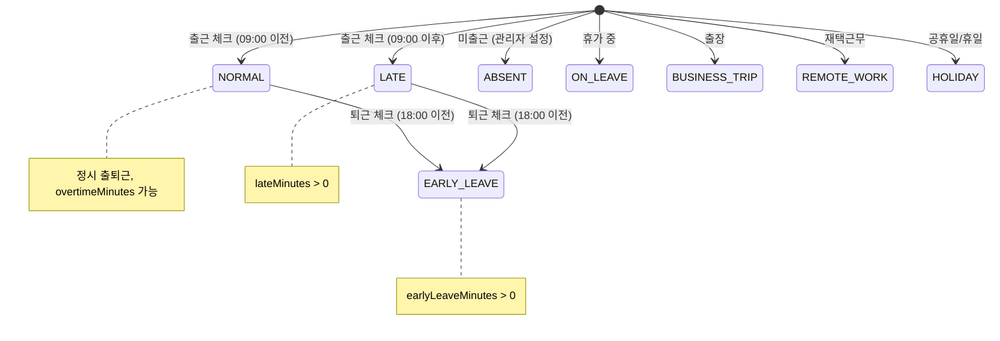
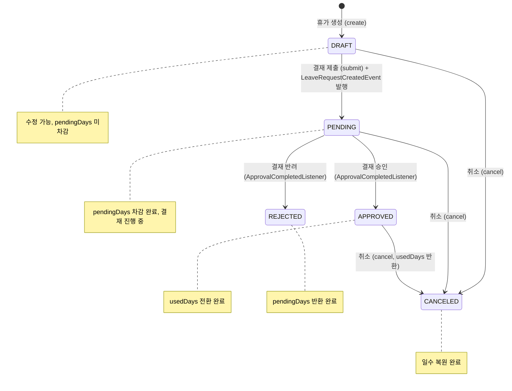
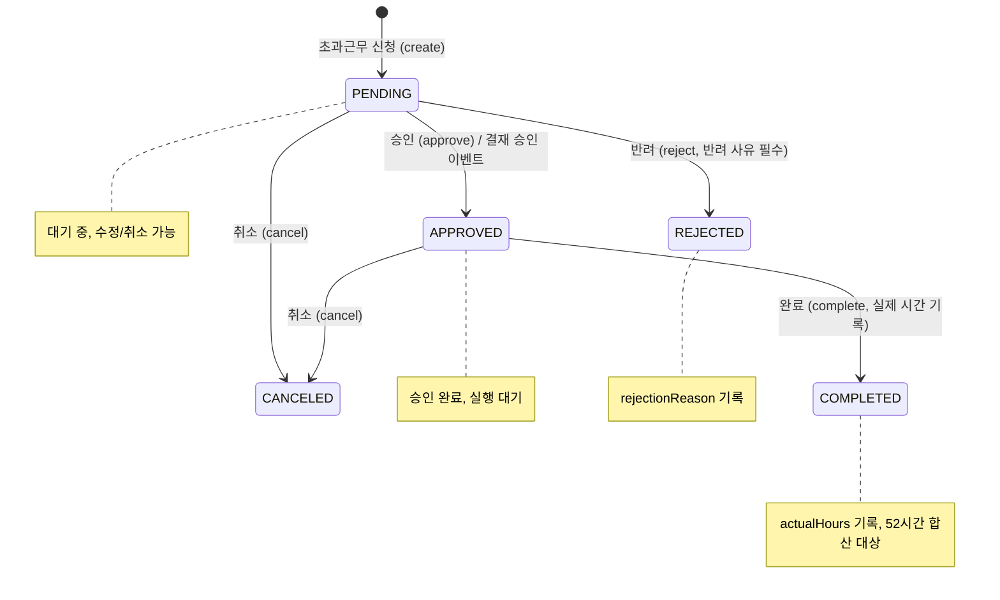
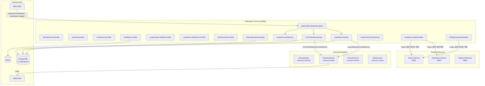

# Module 06: Attendance Service (근태 관리) — PRD 및 프로덕션 정책 분석

> **최종 업데이트**: 2026-02-10
> **분석 범위**: `services/attendance-service/`, `common/` 모듈
> **문서 버전**: v2.0 (Phase A/B/C 확장)
> **포트**: 8085
> **패키지**: `com.hrsaas.attendance`
> **DB 스키마**: `hr_attendance`

---

## 목차

- [1. 현재 구현 상태 요약](#1-현재-구현-상태-요약)
- [2. 정책 결정사항](#2-정책-결정사항)
- [3. 기능 요구사항 Gap 분석 (Phase A)](#3-기능-요구사항-gap-분석-phase-a)
- [4. 비즈니스 규칙 상세 (Phase B)](#4-비즈니스-규칙-상세-phase-b)
- [5. 서비스 연동 명세 (Phase C)](#5-서비스-연동-명세-phase-c)
- [6. 데이터 모델](#6-데이터-모델)
- [7. API 명세](#7-api-명세)
- [8. 보안/프라이버시](#8-보안프라이버시)
- [9. 성능/NFR](#9-성능nfr)
- [10. 추적성 매트릭스](#10-추적성-매트릭스)
- [11. 변경 이력](#11-변경-이력)

---

## 1. 현재 구현 상태 요약

### 1.1 구현 완료

| 기능 | 상태 | 위치 |
|------|------|------|
| 출퇴근 기록 (출근/퇴근 체크) | ✅ 완료 | `AttendanceController` / `AttendanceServiceImpl` |
| 지각/조퇴/초과근무 자동 계산 | ✅ 완료 | `AttendanceRecord.checkIn/checkOut()` |
| 오늘 출근 현황 | ✅ 완료 | `AttendanceController.getToday()` |
| 기간별 근태 이력 조회 | ✅ 완료 | `AttendanceController.getMyAttendance()` |
| 월간 근태 요약 | ✅ 완료 | `AttendanceController.getMonthlySummary()` |
| 52시간 근로 모니터링 | ✅ 완료 | `AttendanceServiceImpl.getWorkHourStatistics()` |
| 공휴일 CRUD + 일괄 등록 | ✅ 완료 | `HolidayController` / `HolidayServiceImpl` |
| 대한민국 공휴일 자동 임포트 | ✅ 완료 | `KoreanHolidayProvider` + `HolidayImportScheduler` |
| 휴가 신청 (10종 유형) | ✅ 완료 | `LeaveController` / `LeaveServiceImpl` |
| 반차/시간차 신청 | ✅ 완료 | `leave_unit` (DAY/HALF_DAY/HOUR) + hours_count |
| 휴가 잔여일수 관리 | ✅ 완료 | `LeaveBalance` (총/사용/대기/이월) |
| 휴가 중복 검사 | ✅ 완료 | `LeaveServiceImpl` PENDING/APPROVED 기간 중복 방지 |
| 초과근무 신청/승인 워크플로우 | ✅ 완료 | `OvertimeController` / `OvertimeServiceImpl` |
| 휴가 유형 설정 (테넌트별) | ✅ 완료 | `LeaveTypeConfigController` / `LeaveTypeConfigService` |
| 휴가 발생 규칙 (3종) | ✅ 완료 | `LeaveAccrualRule` (YEARLY/MONTHLY/HIRE_DATE_BASED) |
| 연차 발생 스케줄러 (연간) | ✅ 완료 | `LeaveAccrualScheduler.generateYearlyLeave()` |
| 연차 발생 스케줄러 (월간) | ✅ 완료 | `LeaveAccrualScheduler.generateMonthlyLeave()` |
| 연차 발생 스케줄러 (입사일 기준) | ✅ 완료 | `LeaveAccrualScheduler.checkHireDateBasedAccrual()` |
| 연차 이월 처리 | ✅ 완료 | `LeaveCarryOverService.processCarryOver()` |
| 결재 연동 (휴가 → Approval) | ✅ 완료 | `LeaveRequestCreatedEvent` SNS 발행 |
| 결재 연동 (초과근무 → Approval) | ✅ 완료 | `OvertimeRequestCreatedEvent` SNS 발행 |
| 결재 완료 수신 (휴가+초과근무) | ✅ 완료 | `ApprovalCompletedListener` SQS |
| 직원 입사 시 잔여일수 자동 생성 | ✅ 완료 | `ApprovalCompletedListener.handleEmployeeCreated()` |
| 대시보드 API | ✅ 완료 | `DashboardController` (출근현황/잔여휴가/팀 휴가) |
| RLS (Row Level Security) | ✅ 완료 | 모든 7개 테이블에 테넌트 격리 정책 |
| 캐싱 (공휴일) | ✅ 완료 | `@Cacheable("holiday")` Redis |
| ddl-auto: validate | ✅ 올바름 | Flyway 마이그레이션 + validate 모드 |

### 1.2 미구현 / TODO

| 기능 | 상태 | 구현 방향 |
|------|------|-----------|
| 에러코드 중복 | ⚠️ 알려진 이슈 | ATT_003/ATT_004/LEV_001 도메인별 분리 필요 |
| 근태 알림 (미출근, 52시간 초과) | ❌ 미구현 | notification-service 이벤트 연동 |
| 시간 단위 휴가 서비스 로직 | 🟡 부분 | usedHours/pendingHours 필드 존재, 서비스 로직 부분 구현 |
| 월간 요약 공휴일 제외 | 🟡 부분 | calculateWorkDays()에서 주말만 제외, 공휴일 미제외 |
| 유연근무제 지원 | ❌ 미구현 | 표준 근무시간 하드코딩 → 테넌트별 설정 필요 |
| 근태 수정 이력 로그 | ❌ 미구현 | 관리자 근태 수정 시 별도 감사 로그 테이블 필요 |

---

## 2. 정책 결정사항

### 2.1 표준 근무시간 정책 ✅ 결정완료 (코드 기반)

> **결정: 09:00~18:00, 점심 1시간 자동 공제**

**현재 코드 하드코딩:**
```java
// AttendanceRecord.java
private static final LocalTime STANDARD_START = LocalTime.of(9, 0);  // 09:00
private static final LocalTime STANDARD_END = LocalTime.of(18, 0);    // 18:00
private static final int LUNCH_BREAK_MINUTES = 60;                     // 1시간
```

**향후 개선사항:**
- 테넌트별 근무시간 설정 가능하도록 확장 필요 (유연근무제 지원)
- 설정 테이블: `work_schedule_config` (tenant_id, start_time, end_time, lunch_break_minutes)

### 2.2 52시간 근로 모니터링 정책 ✅ 결정완료 (코드 기반)

> **결정: 모니터링 전용 (차단 없음), 3단계 상태 분류**

**상태 기준:**
| 상태 | 주간 근로시간 | 의미 |
|------|-------------|------|
| NORMAL | < 40시간 | 정상 |
| WARNING | 40~52시간 | 주의 (관리자 알림 권장) |
| EXCEEDED | > 52시간 | 초과 (근로기준법 위반) |

**계산 방식:**
- 정규 근무: `min(workHours, 8)` / 일
- 초과 근무: OvertimeRequest.actualHours 또는 attendance.overtimeMinutes
- 합산: 정규 + 초과 = 주간 총 근로시간

**정책:**
- 현재: 통계 조회만 제공, 차단 없음
- 초과 시 조치: notification-service 알림 발송 (미구현)
- 법적 근거: 근로기준법 제53조 (주 52시간 상한)

### 2.3 휴가 발생 규칙 정책 ✅ 결정완료 (코드 기반)

> **결정: 근로기준법 기반 연차 발생, 최대 25일 상한**

**연차 발생 공식:**
```
연차일수 = 기본부여일수 + 근속연수 보너스
최대 상한 = 25일 (근로기준법 제60조)
```

**기본 설정값:**
| 항목 | 기본값 | 설명 |
|------|--------|------|
| 기본 부여일수 (baseEntitlement) | 15일 | 1년 미만 근속: 월 1일씩 (별도) |
| 근속 보너스 | JSONB 배열 | `[{"minYears":1,"maxYears":3,"bonusDays":1}, ...]` |
| 최대 이월일수 (maxCarryOverDays) | 0일 | 기본: 이월 불가 (테넌트 설정 가능) |
| 이월 만료 (carryOverExpiryMonths) | 3개월 | 이월분은 3개월 내 사용 |

**발생 유형:**
| 유형 | 실행 시점 | 설명 |
|------|----------|------|
| YEARLY | 매년 1/1 00:10 | 전 직원 연차 일괄 발생 + 전년도 이월 |
| MONTHLY | 매월 1일 00:20 | 월 단위 발생 규칙 처리 |
| HIRE_DATE_BASED | 매일 01:00 | 입사일 기준 기념일 체크 |

### 2.4 휴가 잔여일수 관리 정책 ✅ 결정완료 (코드 기반)

> **결정: 신청 시 대기일수 차감 → 승인 시 사용일수 전환**

**잔여일수 상태 머신:**
```
가용일수 = 총부여일수 + 이월일수 - 사용일수 - 대기일수

[휴가 신청]     → pendingDays += daysCount
[결재 승인]     → usedDays += daysCount, pendingDays -= daysCount
[결재 반려]     → pendingDays -= daysCount
[신청 취소]     → 대기 중이면 pendingDays -= daysCount
                   승인 후면 usedDays -= daysCount
```

### 2.5 대한민국 공휴일 자동 등록 정책 ✅ 결정완료 (코드 기반)

> **결정: 연말 자동 임포트 + 양력/음력/대체공휴일 지원**

**스케줄러:** `HolidayImportScheduler.importNextYearHolidays()` — 매년 12/1 02:00 실행

**지원 공휴일:**
- **양력 고정**: 신정, 삼일절, 어린이날, 현충일, 광복절, 개천절, 한글날, 크리스마스
- **음력 변동**: 설날(3일), 추석(3일), 석가탄신일 — 2025~2030 하드코딩
- **대체공휴일**: 공휴일이 주말과 겹칠 경우 자동 계산

**중복 방지:** `existsByTenantIdAndHolidayDate()` 체크 후 신규만 등록

---

## 3. 기능 요구사항 Gap 분석 (Phase A)

### 3.1 PRD vs 코드 비교표

> **PRD 출처**: `docs/deprecated/PRD.md` (섹션 5.5: 근태/휴가 관리)
> **참고**: PRD의 FR-ATT 시리즈는 13개 요구사항 (3개 그룹)

| ID | PRD 요구사항 | PRD 출처 | 코드 구현 상태 | 구현 위치 | Gap |
|----|-------------|---------|---------------|----------|-----|
| FR-ATT-001-01 | 연차 발생 규칙(일괄/월별) 테넌트별 설정 | §5.5 L360 | ✅ 완전 구현 | `LeaveAccrualRule` (YEARLY/MONTHLY/HIRE_DATE_BASED) + `LeaveAccrualRuleController` | — |
| FR-ATT-001-02 | 연차 잔여일수 실시간 조회 | §5.5 L361 | ✅ 완전 구현 | `LeaveController.getBalances()` + `LeaveBalance` 엔티티 | — |
| FR-ATT-001-03 | 연차 이월 규칙 설정 | §5.5 L362 | ✅ 완전 구현 | `LeaveCarryOverService` + `maxCarryOverDays`/`carryOverExpiryMonths` | — |
| FR-ATT-001-04 | 근속연수별 연차 차등 부여 | §5.5 L363 | ✅ 완전 구현 | `LeaveAccrualService.calculateEntitlement()` + `serviceYearBonuses` JSONB | — |
| FR-ATT-002-01 | 직원이 휴가를 신청할 수 있다 | §5.5 L369 | ✅ 완전 구현 | `LeaveController.create()` + 10종 휴가 유형 | — |
| FR-ATT-002-02 | 반차, 시간차 신청 지원 | §5.5 L370 | ✅ 완전 구현 | `leave_unit` (DAY/HALF_DAY/HOUR) + `hours_count` 필드 | — |
| FR-ATT-002-03 | 휴가 신청 시 결재선 자동 지정 | §5.5 L371 | ✅ 완전 구현 | `LeaveRequestCreatedEvent` → approval-service 자동 생성 | — |
| FR-ATT-002-04 | 결재자가 승인/반려 | §5.5 L372 | ✅ 완전 구현 | `ApprovalCompletedListener` SQS → APPROVED/REJECTED 상태 전환 | — |
| FR-ATT-002-05 | 승인 시 잔여일수 자동 차감 | §5.5 L373 | ✅ 완전 구현 | `handleApprovalCompleted()` → pendingDays→usedDays 전환 | — |
| FR-ATT-002-06 | 휴가 현황 캘린더 조회 | §5.5 L374 | 🟡 부분 구현 | `DashboardController.getTeamLeave()` (calendar events 반환, FE 캘린더 UI 미확인) | FE 캘린더 UI |
| FR-ATT-003-01 | 휴가 유형 정의 | §5.5 L380 | ✅ 완전 구현 | `LeaveTypeConfigController` CRUD + 10종 기본 유형 | — |
| FR-ATT-003-02 | 유형별 사용 조건 설정 | §5.5 L381 | ✅ 완전 구현 | `LeaveTypeConfig` (minNoticeDays, genderRestriction, maxConsecutiveDays, blackoutPeriods) | — |
| FR-ATT-003-03 | 유형별 결재선 규칙 설정 | §5.5 L382 | 🟡 부분 구현 | `approvalTemplateCode` 필드 존재, Approval Service 연동 부분 | 결재 양식 매핑 |

**구현률**: 85% (11/13 완전 구현, 2개 부분) — *v1.0 대비 69% → 85% 상향*

### 3.2 코드에만 있는 기능 (역분석)

PRD에 명시적 요구사항이 없지만, 코드에 구현된 기능들:

| FR ID (신규) | 기능 | 구현 위치 | 비즈니스 가치 | PRD 반영 권장 |
|-------------|------|----------|-------------|--------------|
| FR-ATT-EX-001 | 출퇴근 기록 (위치 포함) | `AttendanceController.checkIn/checkOut()` | 근태 관리 기본 기능 | ✅ 반영 필요 |
| FR-ATT-EX-002 | 52시간 근로 모니터링 (3단계) | `AttendanceServiceImpl.getWorkHourStatistics()` | 근로기준법 컴플라이언스 | ✅ 반영 필요 |
| FR-ATT-EX-003 | 공휴일 관리 + 일괄 등록 | `HolidayController` + batch API | 근태 정확도 향상 | ✅ 반영 필요 |
| FR-ATT-EX-004 | 대한민국 공휴일 자동 임포트 | `KoreanHolidayProvider` + `HolidayImportScheduler` | 운영 자동화 | ✅ 반영 필요 |
| FR-ATT-EX-005 | 초과근무 신청/승인 워크플로우 | `OvertimeController` / `OvertimeServiceImpl` | 초과근무 관리 | ✅ 반영 필요 |
| FR-ATT-EX-006 | 휴가 이월 처리 (상한+만료) | `LeaveCarryOverService.processCarryOver()` | 연차 정책 운영 | ✅ 반영 필요 |
| FR-ATT-EX-007 | 연차 자동 발생 스케줄러 (3종) | `LeaveAccrualScheduler` | 연차 운영 자동화 | ✅ 반영 필요 |
| FR-ATT-EX-008 | 직원 입사 시 잔여일수 자동 생성 | `handleEmployeeCreated()` in SQS Listener | 온보딩 자동화 | ✅ 반영 필요 |
| FR-ATT-EX-009 | 대시보드 API (출근/잔여휴가/팀 휴가) | `DashboardController` (3개 엔드포인트) | UX 향상 | ✅ 반영 필요 |
| FR-ATT-EX-010 | 휴가 업무 인수 정보 | `LeaveRequest` (handoverToId, handoverNotes) | 업무 연속성 보장 | ✅ 반영 필요 |
| FR-ATT-EX-011 | 대체공휴일 자동 계산 | `KoreanHolidayProvider` (주말 겹침 감지) | 정확한 공휴일 관리 | ✅ 반영 필요 |

### 3.3 Gap 해소 우선순위 로드맵

| 우선순위 | Gap ID | 항목 | 현재 상태 | 해소 방향 | 의존성 | 예상 복잡도 |
|---------|--------|------|----------|----------|--------|-----------|
| **HIGH** | ATT-G13 | 에러코드 도메인별 분리 | ATT_003/004, LEV_001 중복 | 출퇴근(ATT), 공휴일(HOL), 초과근무(OVT), 휴가(LEV) 분리 | — | 낮음 |
| **HIGH** | ATT-G14 | 월간 요약 공휴일 제외 | calculateWorkDays() 주말만 제외 | HolidayService 주입 → 기간 내 공휴일 수 차감 | — | 낮음 |
| **MEDIUM** | ATT-G15 | 근태 알림 발송 | 미구현 | 미출근 알림, 52시간 초과 경고 → NotificationService 이벤트 발행 | Notification Service | 중간 |
| **MEDIUM** | ATT-G16 | 유연근무제 지원 | 09:00~18:00 하드코딩 | work_schedule_config 테이블 + 테넌트별 설정 API | MDM Service | 중간 |
| **MEDIUM** | ATT-G17 | 근태 수정 감사 로그 | 미구현 | attendance_modification_log 테이블 + 수정 사유/이전값/이후값 기록 | — | 중간 |
| **LOW** | ATT-G18 | 시간 단위 휴가 로직 보강 | 필드+메서드 존재, 서비스 로직 부분 | LeaveService에서 HOUR 유형 처리 + 시간↔일수 변환 | — | 낮음 |
| **LOW** | ATT-G19 | 휴가 유형별 결재 양식 연동 | approvalTemplateCode 필드 | Approval Service에서 양식 코드로 결재선 자동 매핑 | Approval Service | 낮음 |
| **RESOLVED** | ATT-G01~G12 | v1.0에서 식별된 12개 Gap | ✅ 모두 구현 완료 | — | — | — |

---

## 4. 비즈니스 규칙 상세 (Phase B)

### 4.1 상태 머신

#### 4.1.1 출퇴근 상태 (AttendanceStatus)



**상태 설명:**

| 상태 | DB 표현 | 자동 판정 | 설명 |
|------|---------|----------|------|
| NORMAL | `status='NORMAL'` | 출근 시 lateMinutes=0 | 정상 출퇴근 |
| LATE | `status='LATE'` | 출근 시 lateMinutes>0 | 09:00 이후 출근 |
| EARLY_LEAVE | `status='EARLY_LEAVE'` | 퇴근 시 earlyLeaveMinutes>0 | 18:00 이전 퇴근 |
| ABSENT | `status='ABSENT'` | 수동 설정 | 미출근 |
| ON_LEAVE | `status='ON_LEAVE'` | 수동 설정 | 휴가 중 |
| BUSINESS_TRIP | `status='BUSINESS_TRIP'` | 수동 설정 | 출장 |
| REMOTE_WORK | `status='REMOTE_WORK'` | 수동 설정 | 재택근무 |
| HOLIDAY | `status='HOLIDAY'` | 수동 설정 | 공휴일/회사 휴일 |

#### 4.1.2 휴가 상태 (LeaveStatus)



**상태 전이 규칙:**

| 전이 | 전이 조건 | 잔여일수 변동 | 이벤트 |
|------|----------|-------------|--------|
| DRAFT → PENDING | submit() 호출 | pendingDays += daysCount | `LeaveRequestCreatedEvent` 발행 |
| PENDING → APPROVED | 결재 승인 이벤트 | usedDays += daysCount, pendingDays -= daysCount | — |
| PENDING → REJECTED | 결재 반려 이벤트 | pendingDays -= daysCount | — |
| DRAFT → CANCELED | cancel() 호출 | — (변동 없음) | — |
| PENDING → CANCELED | cancel() 호출 | pendingDays -= daysCount | — |
| APPROVED → CANCELED | cancel() 호출 | usedDays -= daysCount | — |

#### 4.1.3 초과근무 상태 (OvertimeStatus)



**상태별 허용 동작:**

| 상태 | 수정 | 취소 | 승인 | 반려 | 완료 |
|------|------|------|------|------|------|
| PENDING | ❌ | ✅ | ✅ | ✅ | ❌ |
| APPROVED | ❌ | ✅ | — | — | ✅ |
| REJECTED | ❌ | ❌ | ❌ | — | ❌ |
| CANCELED | ❌ | — | ❌ | ❌ | ❌ |
| COMPLETED | ❌ | ❌ | — | — | — |

### 4.2 유효성 검증 규칙 카탈로그

#### 4.2.1 출퇴근 (AttendanceRecord)

| 필드 | 검증 규칙 | 에러 코드 | 검증 위치 |
|------|----------|----------|----------|
| 출근 | 당일 중복 출근 불가 (tenant_id + employee_id + work_date UNIQUE) | ATT_001 | Service |
| 퇴근 | 출근 기록 필수 | ATT_002 | Service |
| 퇴근 | checkInTime이 설정되어야 함 | ATT_003 | Service |
| 퇴근 | 당일 중복 퇴근 불가 | ATT_004 | Service |
| 날짜 범위 | startDate ≤ endDate | ATT_005 | Service |

#### 4.2.2 휴가 신청 (LeaveRequest)

| 필드 | 검증 규칙 | 에러 코드 | 검증 위치 |
|------|----------|----------|----------|
| leaveType | `@NotNull`, 유효한 LeaveType Enum | — | DTO |
| startDate | `@NotNull`, endDate 이후 불가 | — | DTO + Service |
| endDate | `@NotNull` | — | DTO |
| daysCount | `@NotNull`, 양수 | — | DTO |
| 기간 중복 | PENDING/APPROVED 상태 휴가와 기간 중복 불가 | LEV_001 | Service |
| 잔여일수 | availableDays ≥ requestedDays | LEV_003 | Service |
| 소유자 검증 | 본인 휴가만 조작 가능 | LEV_004 | Service |
| 성별 제한 | MATERNITY(F), PATERNITY(M) 등 genderRestriction 체크 | — | Service |
| 최소 사전 신청 | minNoticeDays 이상 사전 신청 | — | Service |
| 연속 사용 제한 | maxConsecutiveDays 이내 | — | Service |
| 사용 불가 기간 | blackoutPeriods 내 신청 불가 | — | Service |

#### 4.2.3 초과근무 (OvertimeRequest)

| 필드 | 검증 규칙 | 에러 코드 | 검증 위치 |
|------|----------|----------|----------|
| overtimeDate | `@NotNull` | — | DTO |
| startTime | `@NotNull` | — | DTO |
| endTime | `@NotNull`, startTime 이후 | — | DTO |
| plannedHours | `@NotNull`, 양수 | — | DTO |
| reason | `@NotBlank` | — | DTO |
| 상태 전이 | 허용 전이만 가능 (IllegalStateException) | — | Entity |
| 완료 시 actualHours | `@NotNull`, 양수 | — | Service |
| 반려 사유 | reject 시 rejectionReason 필수 | — | Service |

#### 4.2.4 공휴일 (Holiday)

| 필드 | 검증 규칙 | 에러 코드 | 검증 위치 |
|------|----------|----------|----------|
| holidayDate | `@NotNull`, 테넌트 내 유니크 | ATT_003* | DTO + Service |
| name | `@NotBlank`, 100자 이내 | — | DTO |
| holidayType | NATIONAL/PUBLIC/COMPANY/SUBSTITUTE | — | DTO |

> *ATT_003 중복 사용 이슈 (ATT-G13)

#### 4.2.5 휴가 유형 설정 (LeaveTypeConfig)

| 필드 | 검증 규칙 | 에러 코드 | 검증 위치 |
|------|----------|----------|----------|
| code | `@NotBlank`, 30자 이내, 테넌트 내 유니크 | — | DTO + Service |
| name | `@NotBlank`, 100자 이내 | — | DTO |
| blackoutPeriods | JSONB 형식 유효성 (`[{startMonth, startDay, endMonth, endDay}]`) | — | Service |

### 4.3 계산 공식/로직 명세

#### 4.3.1 근무시간 계산

```
// 일 근무시간 (분 단위)
workHours = (checkOutTime - checkInTime) - LUNCH_BREAK_MINUTES
          = (checkOutTime - checkInTime) - 60

// 예: 09:00~18:30
workHours = (18:30 - 09:00) - 60분 = 510 - 60 = 450분 (7시간 30분)
```

#### 4.3.2 지각/조퇴/초과 계산

```
// 지각 분 계산
lateMinutes = max(0, checkInTime - STANDARD_START)
            = max(0, checkInTime - 09:00)

// 조퇴 분 계산
earlyLeaveMinutes = max(0, STANDARD_END - checkOutTime)
                  = max(0, 18:00 - checkOutTime)

// 초과근무 분 계산
overtimeMinutes = max(0, checkOutTime - STANDARD_END)
                = max(0, checkOutTime - 18:00)
```

#### 4.3.3 연차 발생 계산

```
// LeaveAccrualService.calculateEntitlement(hireDate, year, rule)
serviceYears = year - hireDate.getYear()

// 1. 기본 부여
entitlement = rule.baseEntitlement  // 기본 15일

// 2. 근속 보너스 계산 (JSONB)
for (bonus in rule.serviceYearBonuses):
    if bonus.minYears <= serviceYears <= bonus.maxYears:
        entitlement += bonus.bonusDays
        break

// 3. 상한 적용
entitlement = min(entitlement, 25)  // 근로기준법 제60조

// 예: 5년차 직원, bonuses = [{min:3, max:5, bonus:2}]
entitlement = 15 + 2 = 17일
```

#### 4.3.4 이월 계산

```
// LeaveCarryOverService.processCarryOver(tenantId, fromYear)
remainingDays = balance.totalDays + balance.carriedOverDays
                - balance.usedDays - balance.pendingDays

carryOverDays = min(remainingDays, rule.maxCarryOverDays)

// 다음 연도 balance 업데이트
nextYearBalance.carriedOverDays = carryOverDays

// 예: 잔여 5일, maxCarryOver = 3일
carryOverDays = min(5, 3) = 3일
```

#### 4.3.5 52시간 근로 통계 계산

```
// ISO 주 기준 (월~일)
weekStart = date.with(DayOfWeek.MONDAY)
weekEnd = date.with(DayOfWeek.SUNDAY)

// 주간 정규 근무시간
regularHours = SUM(min(attendance.workHours, 8시간))  // 일 정규 8시간 상한

// 주간 초과근무시간
overtimeHours = SUM(overtime.actualHours)  // COMPLETED 상태만
              + SUM(attendance.overtimeMinutes / 60)

// 총 주간 근로시간
totalWeeklyHours = regularHours + overtimeHours

// 상태 판정
if totalWeeklyHours < 40: status = NORMAL
elif totalWeeklyHours <= 52: status = WARNING
else: status = EXCEEDED, exceededHours = totalWeeklyHours - 52
```

#### 4.3.6 월간 근태 요약 계산

```
// AttendanceServiceImpl.getMonthlySummary(employeeId, yearMonth)
totalWorkDays = calculateWorkDays(yearMonth)  // 주말 제외 ⚠️ 공휴일 미제외 (ATT-G14)
presentDays = COUNT(attendance WHERE status IN (NORMAL, LATE, EARLY_LEAVE))
lateDays = COUNT(attendance WHERE lateMinutes > 0)
earlyLeaveDays = COUNT(attendance WHERE earlyLeaveMinutes > 0)
totalWorkHours = SUM(attendance.workHours) / 60.0
totalOvertimeHours = SUM(attendance.overtimeMinutes) / 60.0
```

#### 4.3.7 입사일 기념일 체크

```
// LeaveAccrualScheduler.isHireAnniversary(hireDate, today)
return hireDate.getMonthValue() == today.getMonthValue()
    && hireDate.getDayOfMonth() == today.getDayOfMonth()
    && !hireDate.toLocalDate().equals(today)  // 입사 당일 제외
```

### 4.4 데이터 생명주기 정책

| 데이터 | 생성 시점 | 보존 기간 | 삭제 방식 | 비고 |
|--------|----------|----------|----------|------|
| AttendanceRecord | 출근 체크 시 | 영구 | 삭제 없음 | 근로 증빙 (법적 보존) |
| LeaveRequest | 직원 신청 시 | 영구 | 삭제 없음 | CANCELED도 이력 보존 |
| LeaveBalance | 연초 자동 생성 / 입사 시 | 연도별 영구 | 삭제 없음 | 연도별 누적 추적 |
| Holiday | 관리자 등록 / 자동 임포트 | 영구 | 하드 삭제 가능 | 연도별 관리 |
| OvertimeRequest | 직원 신청 시 | 영구 | 삭제 없음 | 52시간 모니터링 근거 |
| LeaveTypeConfig | 관리자 설정 시 | 영구 | 하드 삭제 가능 | is_active로 비활성화 권장 |
| LeaveAccrualRule | 관리자 설정 시 | 영구 | 하드 삭제 가능 | is_active로 비활성화 권장 |

### 4.5 엣지 케이스 카탈로그

| # | 시나리오 | 현재 동작 | 기대 동작 | 상태 |
|---|---------|----------|----------|------|
| 1 | 출근 후 같은 날 다시 출근 | ATT_001 예외 | 중복 출근 차단 | ✅ 정상 |
| 2 | 출근 없이 퇴근 시도 | ATT_002 예외 | 출근 없으면 퇴근 불가 | ✅ 정상 |
| 3 | 23:59에 출근, 다음 날 01:00에 퇴근 | 출근일 기준 기록 (work_date) | 자정 넘김 처리 | ⚠️ 자정 넘김 미처리 |
| 4 | 잔여일수 0일인데 연차 신청 | LEV_003 예외 | 잔여 부족 차단 | ✅ 정상 |
| 5 | PENDING 휴가와 기간 겹치는 신규 신청 | LEV_001 예외 | 중복 기간 차단 | ✅ 정상 |
| 6 | APPROVED 후 취소 → usedDays 복원 | usedDays -= daysCount | 사용일수 정확 복원 | ✅ 정상 |
| 7 | 타인 휴가 취소 시도 | LEV_004 예외 | 소유자 검증 | ✅ 정상 |
| 8 | 남성 직원이 출산휴가 신청 | genderRestriction='F' 체크 | 성별 제한 차단 | ✅ 정상 |
| 9 | REJECTED 상태 초과근무 승인 시도 | IllegalStateException | 허용되지 않은 전이 거부 | ✅ 정상 |
| 10 | PENDING 상태에서 complete() 호출 | IllegalStateException | APPROVED만 완료 가능 | ✅ 정상 |
| 11 | 이월 상한 0일인데 잔여 5일 | carryOverDays = min(5, 0) = 0 | 이월 없음 | ✅ 정상 |
| 12 | 연차 25일 상한 초과 (15+12 보너스) | min(27, 25) = 25일 | 근로기준법 상한 적용 | ✅ 정상 |
| 13 | 공휴일 중복 등록 시도 | UNIQUE(tenant_id, holiday_date) 제약 | 중복 방지 | ✅ 정상 |
| 14 | 설날이 일요일과 겹침 | 대체공휴일 자동 계산 (다음 평일) | 대체공휴일 생성 | ✅ 정상 |
| 15 | employee-service 장애 시 스케줄러 실행 | Feign 호출 실패 → 로그 기록 후 다음 테넌트 진행 | 부분 실패 허용 | ✅ 정상 |
| 16 | 빈 공휴일 목록 캐시 | `unless = "#result == null || #result.isEmpty()"` | 빈 리스트 캐시 안 함 | ✅ 정상 |

---

## 5. 서비스 연동 명세 (Phase C)

### 5.1 연동 아키텍처



### 5.2 REST API 연동 (Feign Client 기반)

#### 5.2.1 Attendance → Tenant Service

| Feign Client | 메서드 | 엔드포인트 | 용도 | 호출 시점 | 폴백 전략 |
|-------------|--------|----------|------|----------|----------|
| `TenantServiceClient` | `getAllTenants()` | `GET /api/v1/tenants` | 활성 테넌트 목록 | 스케줄러 (연차 발생, 공휴일 임포트) | 빈 리스트 (스킵) |

**Feign 설정:**
- URL: `http://localhost:8082`
- 반환: `ApiResponse<PageResponse<TenantBasicDto>>`

#### 5.2.2 Attendance → Employee Service

| Feign Client | 메서드 | 엔드포인트 | 용도 | 호출 시점 | 폴백 전략 |
|-------------|--------|----------|------|----------|----------|
| `EmployeeServiceClient` | `getActiveEmployees(status)` | `GET /api/v1/employees?status=ACTIVE` | 활성 직원 목록 | 스케줄러 (연차 발생) | 빈 리스트 (스킵) |

**Feign 설정:**
- URL: `http://localhost:8084`
- 반환: `ApiResponse<List<EmployeeBasicDto>>`

#### 5.2.3 다른 서비스 → Attendance Service

| 호출자 | 용도 | 엔드포인트 |
|--------|------|----------|
| Frontend | 출퇴근 체크, 근태 이력 조회 | `/api/v1/attendance/*` |
| Frontend | 휴가 신청/조회/취소 | `/api/v1/leaves/*` |
| Frontend | 초과근무 신청/관리 | `/api/v1/overtime/*` |
| Frontend | 대시보드 데이터 | `/api/v1/dashboard/*` |

### 5.3 이벤트 연동 (SNS/SQS)

#### 5.3.1 발행하는 이벤트

| 이벤트 | SNS 토픽 | 발행 시점 | 페이로드 스키마 | 소비자 |
|--------|---------|----------|---------------|--------|
| `LeaveRequestCreatedEvent` | `EventTopics.LEAVE_REQUESTED` | 휴가 결재 제출 (submit) | `{ leaveRequestId, employeeId, employeeName, departmentId, departmentName, leaveType, startDate, endDate, daysCount, reason }` | Approval Service |
| `OvertimeRequestCreatedEvent` | `EventTopics.OVERTIME_REQUESTED` | 초과근무 결재 제출 | `{ overtimeRequestId, employeeId, employeeName, departmentId, overtimeDate, plannedHours, reason }` | Approval Service |

#### 5.3.2 소비하는 이벤트

| 이벤트 | SQS 큐 | 발행자 | 처리 로직 |
|--------|--------|--------|----------|
| `ApprovalCompletedEvent` | `attendance-service-queue` | Approval Service | documentType별 분기: `LEAVE_REQUEST` → leaveService.handleApprovalCompleted(), `OVERTIME_REQUEST` → overtimeService.handleApprovalCompleted() |
| `EmployeeCreatedEvent` | `attendance-service-queue` | Employee Service | 신규 직원 → LeaveAccrualService.generateForEmployee() → 잔여일수 초기 레코드 생성 |

#### 5.3.3 미구현 이벤트 (설계 완료)

| 이벤트 | 토픽 | 발행 시점 | 소비자 |
|--------|------|----------|--------|
| `AttendanceAbsentEvent` | `hr-saas.attendance.absent` | 미출근 감지 시 | Notification Service (알림 발송) |
| `WorkHoursExceededEvent` | `hr-saas.attendance.work-hours-exceeded` | 52시간 초과 시 | Notification Service (경고 알림) |

### 5.4 데이터 동기화 흐름

#### 5.4.1 휴가 → 결재 워크플로우

```
1. Attendance → Approval: SNS 이벤트 (비동기)
   - topic: LEAVE_REQUESTED
   - 페이로드: 휴가 신청 정보
   - Approval Service에서 결재 문서 자동 생성

2. Approval → Attendance: SQS 이벤트 (비동기)
   - 큐: attendance-service-queue
   - documentType: LEAVE_REQUEST
   - APPROVED: pendingDays → usedDays
   - REJECTED: pendingDays 반환
   - 최종 일관성: 결재 완료 후 비동기 처리 (수초 이내)
```

#### 5.4.2 초과근무 → 결재 워크플로우

```
1. Attendance → Approval: SNS 이벤트 (비동기)
   - topic: OVERTIME_REQUESTED
   - 페이로드: 초과근무 신청 정보

2. Approval → Attendance: SQS 이벤트 (비동기)
   - 큐: attendance-service-queue
   - documentType: OVERTIME_REQUEST
   - APPROVED: overtimeRequest.approve()
   - REJECTED: overtimeRequest.reject(reason)
```

#### 5.4.3 직원 입사 → 잔여일수 초기화

```
1. Employee Service → Attendance: SNS/SQS 이벤트 (비동기)
   - 큐: attendance-service-queue
   - eventType: EmployeeCreatedEvent
   - tenantId, employeeId, hireDate 추출

2. Attendance Service 처리:
   - TenantContext 설정
   - LeaveAccrualService.generateForEmployee()
   - 연차 일수 계산 (입사 연도는 월할 계산)
   - LeaveBalance 초기 레코드 생성
```

#### 5.4.4 연차 자동 발생 흐름

```
1. 매년 1/1 00:10 → generateYearlyLeave()
   - TenantServiceClient → 전 테넌트 순회
   - 전년도 이월 처리 (LeaveCarryOverService)
   - EmployeeServiceClient → 직원 목록 조회
   - LeaveAccrualService → 연차 계산 + LeaveBalance 생성

2. 매월 1일 00:20 → generateMonthlyLeave()
   - MONTHLY 유형 규칙만 처리
   - 월할 부여 (baseEntitlement / 12)

3. 매일 01:00 → checkHireDateBasedAccrual()
   - 입사일 기념일 직원 필터링
   - 해당 직원만 연차 발생
```

### 5.5 통합 테스트 시나리오

| # | 시나리오 | 관련 서비스 | 기대 결과 | 상태 |
|---|---------|-----------|----------|------|
| IT-01 | 휴가 신청 → 결재 제출 → 승인 이벤트 → 잔여일수 차감 | Attendance + Approval | DRAFT→PENDING→APPROVED, usedDays 증가 | ❌ 미작성 |
| IT-02 | 휴가 반려 → 잔여일수 복원 | Attendance + Approval | PENDING→REJECTED, pendingDays 반환 | ❌ 미작성 |
| IT-03 | 초과근무 신청 → 결재 승인 → 완료 (실제 시간) | Attendance + Approval | PENDING→APPROVED→COMPLETED, actualHours 기록 | ❌ 미작성 |
| IT-04 | 신규 직원 입사 → LeaveBalance 자동 생성 | Attendance + Employee | EmployeeCreatedEvent → 연차 초기 레코드 생성 | ❌ 미작성 |
| IT-05 | 연초 연차 발생 → 이월 처리 → 새 잔여일수 | Attendance + Tenant + Employee | 전 테넌트 순회, 이월+신규 발생 | ❌ 미작성 |
| IT-06 | 공휴일 자동 임포트 (12/1) → 다음해 공휴일 등록 | Attendance + Tenant | KoreanHolidayProvider → 전 테넌트 공휴일 등록 | ❌ 미작성 |
| IT-07 | 52시간 초과 직원 통계 조회 | Attendance 단독 | NORMAL/WARNING/EXCEEDED 정확 분류 | ❌ 미작성 |
| IT-08 | 반차 신청 → 잔여일수 0.5일 차감 | Attendance 단독 | daysCount=0.5, pendingDays+=0.5 | ❌ 미작성 |
| IT-09 | 잔여일수 부족 상태 휴가 신청 → 거부 | Attendance 단독 | LEV_003 에러 | ❌ 미작성 |
| IT-10 | 테넌트 간 근태 데이터 격리 (RLS) | Attendance 단독 | 테넌트 A 데이터가 테넌트 B에서 조회 불가 | ❌ 미작성 |
| IT-11 | 대시보드 API → 출근현황 + 잔여휴가 + 팀 휴가 | Attendance 단독 | 3개 엔드포인트 정상 응답 | ❌ 미작성 |
| IT-12 | 연차 25일 상한 테스트 (근속 보너스 초과) | Attendance 단독 | min(base+bonus, 25) 적용 | ❌ 미작성 |

---

## 6. 데이터 모델

### 6.1 테이블 목록 (hr_attendance 스키마)

| 테이블 | 상태 | 용도 | RLS |
|--------|------|------|-----|
| `attendance_record` | ✅ 사용 중 | 출퇴근 기록 | ✅ |
| `leave_request` | ✅ 사용 중 | 휴가 신청 | ✅ |
| `leave_balance` | ✅ 사용 중 | 휴가 잔여일수 | ✅ |
| `holiday` | ✅ 사용 중 | 공휴일/회사 휴일 | ✅ |
| `overtime_request` | ✅ 사용 중 | 초과근무 신청 | ✅ |
| `leave_type_config` | ✅ 사용 중 | 휴가 유형 설정 (V2) | ✅ |
| `leave_accrual_rule` | ✅ 사용 중 | 휴가 발생 규칙 (V2) | ✅ |

### 6.2 ERD

```mermaid
erDiagram
    AttendanceRecord {
        UUID id PK
        UUID tenant_id
        UUID employee_id
        DATE work_date
        TIME check_in_time
        TIME check_out_time
        VARCHAR status
        INTEGER late_minutes
        INTEGER early_leave_minutes
        INTEGER overtime_minutes
        INTEGER work_hours
        VARCHAR check_in_location
        VARCHAR check_out_location
        TEXT note
    }

    LeaveRequest {
        UUID id PK
        UUID tenant_id
        UUID employee_id
        VARCHAR employee_name
        UUID department_id
        VARCHAR leave_type
        DATE start_date
        DATE end_date
        DECIMAL days_count
        VARCHAR leave_unit
        DECIMAL hours_count
        TEXT reason
        VARCHAR status
        UUID approval_document_id
        UUID handover_to_id
        TEXT handover_notes
    }

    LeaveBalance {
        UUID id PK
        UUID tenant_id
        UUID employee_id
        INTEGER year
        VARCHAR leave_type
        DECIMAL total_days
        DECIMAL used_days
        DECIMAL pending_days
        DECIMAL carried_over_days
        DECIMAL used_hours
        DECIMAL pending_hours
    }

    Holiday {
        UUID id PK
        UUID tenant_id
        DATE holiday_date
        VARCHAR name
        VARCHAR name_en
        VARCHAR holiday_type
        BOOLEAN is_paid
        INTEGER year
    }

    OvertimeRequest {
        UUID id PK
        UUID tenant_id
        UUID employee_id
        VARCHAR employee_name
        DATE overtime_date
        TIME start_time
        TIME end_time
        DECIMAL planned_hours
        DECIMAL actual_hours
        VARCHAR status
        TEXT reason
        VARCHAR rejection_reason
        UUID approval_document_id
    }

    LeaveTypeConfig {
        UUID id PK
        UUID tenant_id
        VARCHAR code
        VARCHAR name
        BOOLEAN is_paid
        DECIMAL max_days_per_year
        BOOLEAN requires_approval
        INTEGER min_notice_days
        BOOLEAN allow_half_day
        BOOLEAN allow_hourly
        BOOLEAN deduct_from_annual
        VARCHAR gender_restriction
        INTEGER max_consecutive_days
        JSONB blackout_periods
        BOOLEAN is_active
    }

    LeaveAccrualRule {
        UUID id PK
        UUID tenant_id
        VARCHAR leave_type_code
        VARCHAR accrual_type
        DECIMAL base_entitlement
        JSONB service_year_bonuses
        DECIMAL max_carry_over_days
        INTEGER carry_over_expiry_months
        BOOLEAN is_active
    }
```



### 6.3 UNIQUE 제약 조건

| 테이블 | UNIQUE 제약 | 비즈니스 의미 |
|--------|-----------|-------------|
| attendance_record | (tenant_id, employee_id, work_date) | 1인 1일 1출근 |
| leave_balance | (tenant_id, employee_id, year, leave_type) | 연도별 유형별 잔여 1건 |
| holiday | (tenant_id, holiday_date) | 테넌트별 날짜 중복 방지 |
| leave_type_config | (tenant_id, code) | 테넌트별 유형 코드 유니크 |
| leave_accrual_rule | (tenant_id, leave_type_code) | 테넌트별 발생 규칙 유니크 |

### 6.4 인덱스 전략

| 테이블 | 인덱스 | 주요 쿼리 패턴 |
|--------|--------|---------------|
| attendance_record | (tenant_id, employee_id, work_date) | 직원별 일자별 출근 조회 |
| attendance_record | (tenant_id, work_date) | 부서/전사 일별 출근 현황 |
| leave_request | (tenant_id, employee_id) | 내 휴가 목록 |
| leave_request | (tenant_id, status) | 상태별 휴가 조회 |
| leave_balance | (tenant_id, employee_id) | 내 잔여일수 조회 |
| holiday | (tenant_id, year) | 연도별 공휴일 목록 |
| overtime_request | (tenant_id, employee_id) | 내 초과근무 목록 |

---

## 7. API 명세

### 7.1 출퇴근 관리 (`/api/v1/attendance`)

| Method | Path | 설명 | 인증 |
|--------|------|------|------|
| POST | `/check-in` | 출근 체크 | 일반 |
| POST | `/check-out` | 퇴근 체크 | 일반 |
| GET | `/today` | 오늘 출근 현황 | 일반 |
| GET | `/my` | 내 근태 이력 (기간별) | 일반 |
| GET | `/monthly-summary` | 월간 근태 요약 | 일반 |
| GET | `/{id}` | 근태 상세 | 일반 |
| GET | `/work-hours/statistics` | 52시간 근로 통계 | 관리자 |

### 7.2 휴가 관리 (`/api/v1/leaves`)

| Method | Path | 설명 | 인증 |
|--------|------|------|------|
| POST | `/` | 휴가 신청 | 일반 |
| GET | `/{id}` | 휴가 상세 | 일반 |
| GET | `/my` | 내 휴가 목록 | 일반 |
| POST | `/{id}/submit` | 결재 제출 | 일반 |
| POST | `/{id}/cancel` | 휴가 취소 | 일반 |
| GET | `/balances` | 잔여 휴가 조회 | 일반 |

### 7.3 공휴일 관리 (`/api/v1/holidays`)

| Method | Path | 설명 | 인증 |
|--------|------|------|------|
| POST | `/` | 공휴일 등록 | HR관리자 |
| GET | `/{id}` | 공휴일 상세 | 일반 |
| GET | `/year/{year}` | 연도별 공휴일 | 일반 |
| GET | `/year/{year}/type/{type}` | 유형별 공휴일 | 일반 |
| GET | `/range` | 기간별 공휴일 | 일반 |
| GET | `/check` | 특정일 공휴일 여부 | 일반 |
| GET | `/count` | 기간 내 공휴일 수 | 일반 |
| DELETE | `/{id}` | 공휴일 삭제 | HR관리자 |
| POST | `/batch` | 일괄 등록 | HR관리자 |

### 7.4 초과근무 관리 (`/api/v1/overtime`)

| Method | Path | 설명 | 인증 |
|--------|------|------|------|
| POST | `/` | 초과근무 신청 | 일반 |
| GET | `/{id}` | 초과근무 상세 | 일반 |
| GET | `/my` | 내 초과근무 목록 | 일반 |
| GET | `/my/status/{status}` | 상태별 내 초과근무 | 일반 |
| GET | `/department/{departmentId}/status/{status}` | 부서별 상태 조회 | 관리자 |
| GET | `/range` | 기간별 조회 | 관리자 |
| POST | `/{id}/approve` | 승인 | 관리자 |
| POST | `/{id}/reject` | 반려 | 관리자 |
| POST | `/{id}/cancel` | 취소 | 일반 |
| POST | `/{id}/complete` | 완료 (실제 시간 기록) | 관리자 |
| GET | `/total-hours` | 총 초과근무 시간 조회 | 관리자 |

### 7.5 휴가 유형 설정 (`/api/v1/leave-type-configs`)

| Method | Path | 설명 | 인증 |
|--------|------|------|------|
| GET | `/` | 전체 설정 목록 | 관리자 |
| GET | `/active` | 활성 설정 목록 | 일반 |
| GET | `/code/{code}` | 코드별 설정 조회 | 일반 |
| POST | `/` | 설정 생성 | 관리자 |
| PUT | `/{id}` | 설정 수정 | 관리자 |
| DELETE | `/{id}` | 설정 삭제 | 관리자 |

### 7.6 휴가 발생 규칙 (`/api/v1/leave-accrual-rules`)

| Method | Path | 설명 | 인증 |
|--------|------|------|------|
| GET | `/` | 활성 규칙 목록 | 관리자 |
| GET | `/code/{leaveTypeCode}` | 코드별 규칙 조회 | 관리자 |
| POST | `/` | 규칙 생성 | 관리자 |
| PUT | `/{id}` | 규칙 수정 | 관리자 |
| DELETE | `/{id}` | 규칙 삭제 | 관리자 |
| POST | `/generate` | 수동 연차 발생 | 관리자 |
| POST | `/carry-over` | 수동 이월 처리 | 관리자 |

### 7.7 대시보드 (`/api/v1/dashboard`)

| Method | Path | 설명 | 인증 |
|--------|------|------|------|
| GET | `/attendance` | 오늘 출근/퇴근 현황 | 일반 |
| GET | `/leave-balance` | 내 잔여 휴가 + 예정 휴가 | 일반 |
| GET | `/team-leave` | 팀원 휴가 현황 (3일 캘린더) | 일반 |

---

## 8. 보안/프라이버시

### 8.1 인증/인가

| 항목 | 설정 | 비고 |
|------|------|------|
| JWT 인증 | SecurityFilter (common-security) | FilterRegistrationBean으로 이중 등록 방지 |
| 개인 데이터 접근 | 본인 휴가/근태만 조회 가능 | employee_id 검증 |
| 관리자 기능 | 52시간 통계, 휴가 유형 설정, 공휴일 관리 | 권한 체크 |
| RLS | 모든 테넌트 테이블 | `app.current_tenant` 세션 변수 |

### 8.2 개인정보 보호

| 데이터 | 보호 수준 | 처리 방식 |
|--------|----------|----------|
| 출근 위치 정보 | 민감 | 접근 로그 기록 |
| 병가 사유 | 민감 (건강 정보) | 본인+관리자만 조회 |
| 비상 연락처 | 개인정보 | 본인+관리자만 조회 |

---

## 9. 성능/NFR

### 9.1 캐시 전략

| 캐시명 | 적용 대상 | TTL | 무효화 시점 |
|--------|----------|------|-----------|
| holiday | HolidayService (연도별 공휴일) | Redis 기본 | 공휴일 등록/삭제/수정 시 |

### 9.2 비즈니스 상수

| 상수 | 값 | 위치 | 설명 |
|------|-----|------|------|
| STANDARD_START | 09:00 | AttendanceRecord | 표준 출근시간 |
| STANDARD_END | 18:00 | AttendanceRecord | 표준 퇴근시간 |
| LUNCH_BREAK_MINUTES | 60 | AttendanceRecord | 점심시간 (분) |
| MAX_ANNUAL_LEAVE | 25 | LeaveAccrualService | 연차 상한 (근로기준법) |
| BASE_ENTITLEMENT | 15 | LeaveAccrualRule | 기본 연차 부여일수 |
| MAX_CARRY_OVER_DAYS | 0 | LeaveAccrualRule | 기본 이월 상한 |
| CARRY_OVER_EXPIRY_MONTHS | 3 | LeaveAccrualRule | 이월 만료 기간 |
| NORMAL_THRESHOLD | 40h | AttendanceServiceImpl | 정상 상태 상한 |
| WARNING_THRESHOLD | 52h | AttendanceServiceImpl | 경고 상태 상한 |
| DAILY_REGULAR_HOURS | 8h | AttendanceServiceImpl | 일 정규 근무시간 |

### 9.3 스케줄러 Cron 표현식

| 작업 | Cron | 실행 시점 | 상태 |
|------|------|----------|------|
| 연간 연차 발생 | `0 10 0 1 1 *` | 매년 1/1 00:10 | ✅ 구현 완료 |
| 월간 발생 | `0 20 0 1 * *` | 매월 1일 00:20 | ✅ 구현 완료 |
| 입사일 기준 체크 | `0 0 1 * * *` | 매일 01:00 | ✅ 구현 완료 |
| 공휴일 자동 임포트 | `0 0 2 1 12 *` | 매년 12/1 02:00 | ✅ 구현 완료 |

### 9.4 SQS 큐 설정

| 큐 | 값 | 용도 |
|----|-----|------|
| 수신 큐 | `attendance-service-queue` | 결재 완료 + 직원 생성 이벤트 수신 |
| 필터 이벤트 | `ApprovalCompletedEvent`, `EmployeeCreatedEvent` | 결재 완료, 직원 생성 |
| 필터 문서유형 | `LEAVE_REQUEST`, `OVERTIME_REQUEST` | 휴가/초과근무 문서 처리 |

### 9.5 데이터베이스 설정

```yaml
spring:
  datasource:
    url: jdbc:postgresql://${DB_HOST:localhost}:${DB_PORT:5433}/hr_saas
    hikari:
      maximum-pool-size: 10
      minimum-idle: 5
  jpa:
    hibernate:
      ddl-auto: validate
    properties:
      hibernate:
        dialect: org.hibernate.dialect.PostgreSQLDialect
        default_schema: hr_attendance
  flyway:
    enabled: true
    schemas: hr_attendance
```

---

## 10. 추적성 매트릭스

| FR ID | PRD 요구사항 | 구현 상태 | 코드 위치 | 테스트 |
|-------|-------------|----------|----------|--------|
| FR-ATT-001-01 | 연차 발생 규칙 설정 | ✅ | LeaveAccrualRule + Controller | ❌ |
| FR-ATT-001-02 | 잔여일수 실시간 조회 | ✅ | LeaveController.getBalances() | ❌ |
| FR-ATT-001-03 | 이월 규칙 설정 | ✅ | LeaveCarryOverService | ❌ |
| FR-ATT-001-04 | 근속연수 차등 부여 | ✅ | LeaveAccrualService.calculateEntitlement() | ❌ |
| FR-ATT-002-01 | 휴가 신청 | ✅ | LeaveController.create() | ❌ |
| FR-ATT-002-02 | 반차/시간차 지원 | ✅ | leave_unit + hours_count | ❌ |
| FR-ATT-002-03 | 결재선 자동 지정 | ✅ | LeaveRequestCreatedEvent | ❌ |
| FR-ATT-002-04 | 결재자 승인/반려 | ✅ | ApprovalCompletedListener | ❌ |
| FR-ATT-002-05 | 잔여일수 자동 차감 | ✅ | handleApprovalCompleted() | ❌ |
| FR-ATT-002-06 | 캘린더 형태 조회 | 🟡 | DashboardController.getTeamLeave() | ❌ |
| FR-ATT-003-01 | 휴가 유형 정의 | ✅ | LeaveTypeConfigController | ❌ |
| FR-ATT-003-02 | 사용 조건 설정 | ✅ | LeaveTypeConfig 필드 | ❌ |
| FR-ATT-003-03 | 결재선 규칙 설정 | 🟡 | approvalTemplateCode | ❌ |
| FR-ATT-EX-001 | 출퇴근 기록 | ✅ | AttendanceController | ❌ |
| FR-ATT-EX-002 | 52시간 모니터링 | ✅ | AttendanceServiceImpl | ❌ |
| FR-ATT-EX-003 | 공휴일 관리 | ✅ | HolidayController | ❌ |
| FR-ATT-EX-004 | 공휴일 자동 임포트 | ✅ | KoreanHolidayProvider + Scheduler | ❌ |
| FR-ATT-EX-005 | 초과근무 워크플로우 | ✅ | OvertimeController + Service | ❌ |
| FR-ATT-EX-006 | 연차 이월 처리 | ✅ | LeaveCarryOverService | ❌ |
| FR-ATT-EX-007 | 연차 자동 발생 | ✅ | LeaveAccrualScheduler (3종) | ❌ |
| FR-ATT-EX-008 | 입사 시 잔여일수 생성 | ✅ | handleEmployeeCreated() | ❌ |
| FR-ATT-EX-009 | 대시보드 API | ✅ | DashboardController | ❌ |

---

## 11. 변경 이력

| 버전 | 날짜 | 변경 내용 |
|------|------|----------|
| v1.0 | 2026-02-06 | 초기 분석: 정책 결정사항, API, 데이터 모델, 갭 12개 식별 |
| v2.0 | 2026-02-10 | Phase A/B/C 확장: Gap 분석 (PRD 비교, v1.0 갭 전체 해소 확인), 비즈니스 규칙 상세 (상태 머신, 검증 규칙, 계산 공식, 엣지 케이스), 서비스 연동 명세 (Feign/이벤트/동기화), 추적성 매트릭스 |

---

## 12. 에러코드 체계

### 12.1 출퇴근 에러 (ATT_xxx)

| 코드 | 메시지 | 상황 |
|------|--------|------|
| ATT_001 | Already checked in today | 중복 출근 |
| ATT_002 | No check-in record today | 출근 없이 퇴근 |
| ATT_003 | Cannot check out without check-in | 출근시간 미설정 상태 퇴근 |
| ATT_004 | Already checked out today | 중복 퇴근 |
| ATT_005 | Start date after end date | 잘못된 날짜 범위 |
| ATT_006 | Attendance record not found | 근태 기록 미존재 |

### 12.2 휴가 에러 (LEV_xxx)

| 코드 | 메시지 | 상황 |
|------|--------|------|
| LEV_001 | Overlapping leave requests | 기간 중복 신청 |
| LEV_002 | Leave balance not found | 잔여일수 레코드 없음 |
| LEV_003 | Insufficient leave balance | 잔여 일수 부족 |
| LEV_004 | Forbidden - not owner | 타인 휴가 조작 시도 |

### 12.3 에러코드 중복 문제 (ATT-G13)

**현재 문제:**
- `ATT_003`: 출퇴근 도메인 + 공휴일 도메인에서 공용
- `ATT_004`: 출퇴근 도메인 + 초과근무 도메인에서 공용
- `LEV_001`: 휴가 중복 + 휴가 조회에서 공용

**개선 방안:**
```
출퇴근: ATT_001 ~ ATT_010
공휴일: HOL_001 ~ HOL_010
초과근무: OVT_001 ~ OVT_010
휴가: LEV_001 ~ LEV_010
```

---

## 13. 휴가 유형 상세

### 13.1 기본 제공 휴가 유형

| 코드 | 한글명 | 유급 | 연차차감 | 성별제한 | 결재필요 | 비고 |
|------|--------|------|---------|---------|---------|------|
| ANNUAL | 연차 | ✅ | - | 무관 | ✅ | 기본 15일, 근속 보너스, 최대 25일 |
| HALF_DAY_AM | 오전반차 | ✅ | ✅ | 무관 | ✅ | 0.5일 차감 |
| HALF_DAY_PM | 오후반차 | ✅ | ✅ | 무관 | ✅ | 0.5일 차감 |
| SICK | 병가 | ✅ | ❌ | 무관 | ✅ | 진단서 제출 권장 |
| SPECIAL | 경조휴가 | ✅ | ❌ | 무관 | ✅ | employee-service 경조정책 연동 |
| MATERNITY | 출산휴가 | ✅ | ❌ | F | ✅ | 90일 (근로기준법 제74조) |
| PATERNITY | 배우자출산휴가 | ✅ | ❌ | M | ✅ | 10일 (남녀고용평등법) |
| FAMILY_CARE | 가족돌봄휴가 | ✅ | ❌ | 무관 | ✅ | 연 10일 (남녀고용평등법) |
| PUBLIC_DUTY | 공가 | ✅ | ❌ | 무관 | ✅ | 예비군, 투표 등 |
| UNPAID | 무급휴가 | ❌ | ❌ | 무관 | ✅ | 급여 미지급 |

### 13.2 SQL 마이그레이션 요약

| 마이그레이션 | 내용 |
|------------|------|
| V1__init.sql | 스키마 hr_attendance, 5개 테이블, 28개 인덱스, 5개 RLS 정책, updated_at 트리거 |
| V2__add_leave_policy.sql | leave_type_config, leave_accrual_rule 추가, leave_request에 leave_unit/hours_count, leave_balance에 used_hours/pending_hours, 2개 RLS 정책 |
| V8__add_performance_indexes.sql | 성능 인덱스 추가 |
