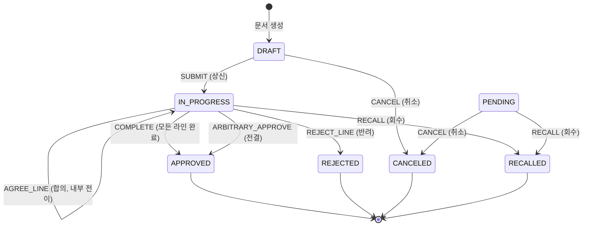
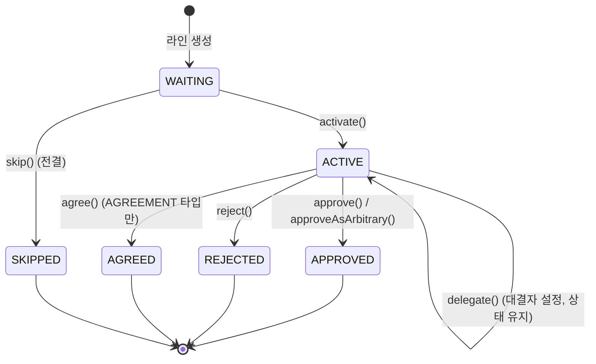
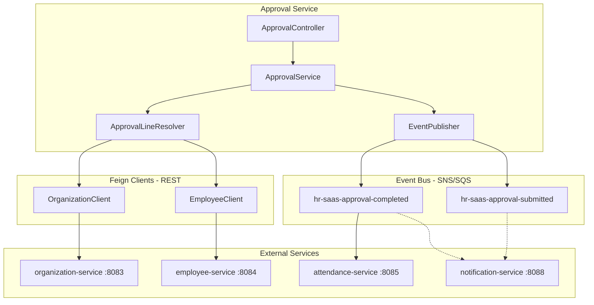
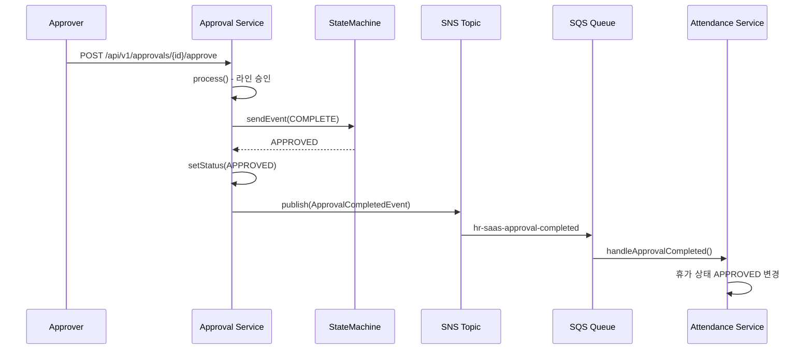
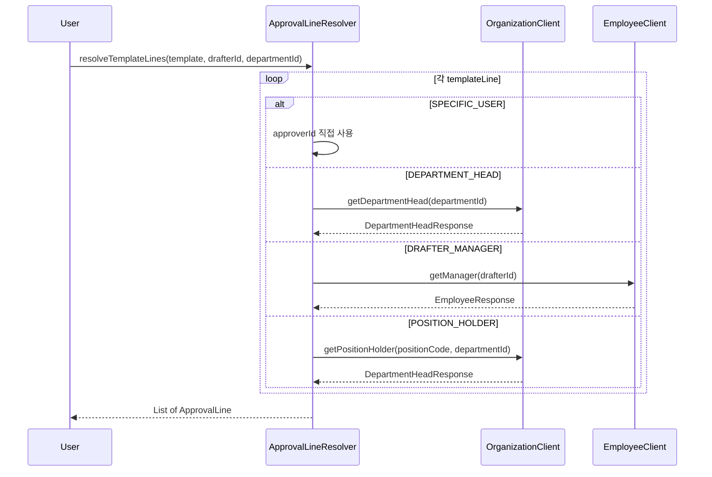
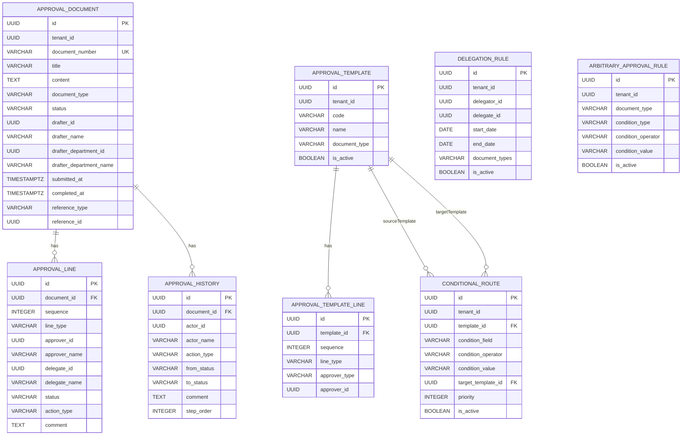

# Module 07: Approval Service -- PRD 및 프로덕션 정책 분석

> **최종 업데이트**: 2026-02-10
> **분석 범위**: `services/approval-service/`, `common/` 모듈
> **문서 버전**: v2.0 (Phase A/B/C 확장)
> **포트**: 8086
> **패키지**: `com.hrsaas.approval`
> **DB 스키마**: `hr_approval`

---

## 목차
- [1. 현재 구현 상태 요약](#1-현재-구현-상태-요약)
- [2. 정책 결정사항](#2-정책-결정사항)
- [3. 기능 요구사항 Gap 분석 (Phase A)](#3-기능-요구사항-gap-분석-phase-a)
- [4. 비즈니스 규칙 상세 (Phase B)](#4-비즈니스-규칙-상세-phase-b)
- [5. 서비스 연동 명세 (Phase C)](#5-서비스-연동-명세-phase-c)
- [6. 데이터 모델](#6-데이터-모델)
- [7. API 명세](#7-api-명세)
- [8. 보안/프라이버시](#8-보안프라이버시)
- [9. 성능/NFR](#9-성능nfr)
- [10. 추적성 매트릭스](#10-추적성-매트릭스)
- [11. 변경 이력](#11-변경-이력)

---

## 1. 현재 구현 상태 요약

### 1.1 완료된 기능

| 기능 | 상태 | 코드 위치 | 설명 |
|------|------|-----------|------|
| 결재 문서 생성 | ✅ 완료 | `ApprovalServiceImpl.create()` | 제목/내용/문서유형/결재선 포함 생성, 즉시 상신 옵션 |
| 문서번호 자동채번 | ✅ 완료 | `ApprovalServiceImpl.generateDocumentNumber()` | `{TYPE}-{yyyyMMdd}-{0001}` 형식, 일자별 순차 번호 |
| 결재 상신 | ✅ 완료 | `ApprovalServiceImpl.submit()` | DRAFT -> IN_PROGRESS 상태 전이, StateMachine 기반 |
| 순차 결재 | ✅ 완료 | `ApprovalAction.activateNextLine()` | SEQUENTIAL 라인 타입, 순서대로 활성화 |
| 병렬 결재 | ✅ 완료 | `ApprovalGuard.parallelGroupCompleted()` | PARALLEL 라인 타입, 같은 sequence의 모든 결재자 동시 활성화 |
| 합의 결재 | ✅ 완료 | `ApprovalLine.agree()` | AGREEMENT 라인 타입, 승인 권한 없이 의견만 제시 |
| 전결 (ARBITRARY) | ✅ 완료 | `ApprovalLine.approveAsArbitrary()` | ARBITRARY 라인 타입, 전결 시 남은 라인 SKIP 처리 |
| 전결 (DIRECT_APPROVE) | ✅ 완료 | `ApprovalController.directApprove()` | DIRECT_APPROVE 액션, 현재 라인 승인 + 이후 라인 모두 SKIP |
| 반려 | ✅ 완료 | `ApprovalLine.reject()` | REJECT 액션 -> IN_PROGRESS -> REJECTED 상태 전이 |
| 회수 | ✅ 완료 | `ApprovalServiceImpl.recall()` | 기안자가 상신 후 회수, IN_PROGRESS/PENDING -> RECALLED |
| 취소 | ✅ 완료 | `ApprovalServiceImpl.cancel()` | 기안자가 임시저장/대기 중 취소, DRAFT/PENDING -> CANCELED |
| 대결 (위임) | ✅ 완료 | `ApprovalLine.delegate()` | DELEGATE 액션, delegateId/delegateName 설정 |
| 결재 이력 추적 | ✅ 완료 | `ApprovalHistory` 엔티티 | 모든 액션 감사 추적, stepOrder 기반 정렬 |
| 결재 요약 통계 | ✅ 완료 | `ApprovalServiceImpl.getSummary()` | 대기/승인/반려/임시저장 건수 집계 |
| 결재 처리시간 통계 | ✅ 완료 | `ApprovalServiceImpl.getStatistics()` | 이번달 vs 지난달 평균 처리 시간 비교 (대시보드) |
| 결재 검색 | ✅ 완료 | `ApprovalDocumentRepository.search()` | 상태, 문서유형, 요청자ID 기반 동적 검색 |
| 결재 템플릿 | ✅ 완료 | `ApprovalTemplateServiceImpl` | 재사용 가능한 결재선 템플릿 CRUD, 코드 유일성 검증 |
| 결재선 자동 해석 | ✅ 완료 | `ApprovalLineResolver` | 4종 결재자 유형 자동 해석 (SPECIFIC_USER, DEPARTMENT_HEAD, DRAFTER_MANAGER, POSITION_HOLDER) |
| 위임 규칙 | ✅ 완료 | `DelegationServiceImpl` | DelegationRule CRUD, 기간/문서유형별 위임, 유효성 검사, 토글 |
| 전결 규칙 | ✅ 완료 | `ArbitraryApprovalRuleService` | ArbitraryApprovalRule CRUD, 조건(금액/일수/등급) 평가 |
| 조건 분기 | ✅ 완료 | `ConditionalRouteService` | ConditionalRoute CRUD, 조건별 다른 템플릿으로 라우팅 |
| 이벤트 발행 | ✅ 완료 | `ApprovalSubmittedEvent`, `ApprovalCompletedEvent` | 상신 시/완료 시 SNS 이벤트 발행 |
| StateMachine | ✅ 완료 | `ApprovalStateMachineConfig` | spring-statemachine-core 4.0.0, Guard/Action 완비 |
| RLS | ✅ 완료 | `V1__init.sql`, `V6__*.sql` | 5개 테이블 (document, template, delegation_rule, arbitrary_rule, conditional_route) |
| 캐싱 | ✅ 완료 | `ApprovalTemplateServiceImpl` | Redis @Cacheable("approval-template"), `unless` 빈 컬렉션 방어 |
| ddl-auto: validate | ✅ 올바름 | `application.yml` | Flyway 마이그레이션 + validate 모드 |
| 대시보드 결재 대기 | ✅ 완료 | `DashboardController.getPendingApprovals()` | 결재 대기 현황 (total + top 5 items with urgency) |
| 승인/반려 전용 API | ✅ 완료 | `ApprovalController.approve()`, `reject()` | 편의 API (내부적으로 `process()` 호출) |
| 대결 전용 API | ✅ 완료 | `ApprovalController.delegateStep()` | `POST /{id}/steps/{stepId}/delegate` 전용 엔드포인트 |

### 1.2 미구현 / 갭

| 갭 ID | 기능 | 우선순위 | 설명 |
|--------|------|----------|------|
| APR-G01 | 결재선 미리보기 | HIGH | `ApprovalLineResolver` 존재하나 컨트롤러에서 미노출 |
| APR-G02 | 결재 문서 수정 | MEDIUM | DRAFT 상태 문서 내용 수정 API 없음 (생성만 가능) |
| APR-G03 | 반송 (RETURN) | HIGH | `ApprovalActionType.RETURN` 정의됨, `process()` 미구현 -> **정책결정: 구현** (S2.7) |
| APR-G04 | 보류 (HOLD) | LOW | `ApprovalActionType.HOLD` 정의됨, `process()` 미구현 |
| APR-G05 | 의견첨부 (COMMENT) | LOW | `ApprovalActionType.COMMENT` 정의됨, `process()` 미구현 |
| APR-G06 | 자기 결재 방지 | HIGH | 결재선에 기안자 포함 방지 로직 없음 -> **정책결정: 항상 차단** (S2.6) |
| APR-G07 | 결재 알림 | HIGH | notification-service 연동 없음 (결재 요청/완료 알림) |
| APR-G08 | 결재 문서 첨부파일 | MEDIUM | file-service 연동 없음 |
| APR-G09 | 관련 문서 조회 | MEDIUM | `related_document_ids` 컬럼 존재하나 서비스 로직/API 미구현 |
| APR-G10 | 결재 기한 관리 | HIGH | 결재 기한 설정 및 초과 시 자동 에스컬레이션 없음 -> **정책결정: 기한+자동에스컬레이션** (S2.8) |
| APR-G11 | 위임 결재 시 원결재자 기록 | LOW | 대결 처리 시 원래 결재자 이력에 기록하는 로직 미흡 |
| APR-G12 | 결재선 수정 (진행 중) | MEDIUM | IN_PROGRESS 상태에서 결재선 추가/삭제 API 없음 |
| APR-G13 | 부서별/유형별 통계 | LOW | 관리자용 결재 통계 대시보드 (부서별, 기간별, 유형별) 없음 |
| APR-G14 | 일괄 결재 | HIGH | 여러 문서 동시 승인/반려 API 없음 -> **정책결정: 구현, 부분실패 허용** (S2.9) |
| APR-G15 | 결재선 템플릿 권한 | LOW | 템플릿별 사용 가능 부서/직급 제한 없음 |

---

## 2. 정책 결정사항

### 2.1 결재 상태 전이 정책 -- 결정완료 (StateMachine 기반)

> **결정: Spring StateMachine으로 엄격한 상태 전이 관리**

**상태 전이 다이어그램:**
```
DRAFT --SUBMIT--> IN_PROGRESS --COMPLETE--> APPROVED (최종)
  |                    |
  |                    +--REJECT_LINE--> REJECTED (최종)
  |                    |
  |                    +--APPROVE_LINE--> IN_PROGRESS (내부 전이, 다음 라인 활성화)
  |                    |
  |                    +--AGREE_LINE--> IN_PROGRESS (내부 전이, 액션 없음)
  |                    |
  |                    +--ARBITRARY_APPROVE--> APPROVED (최종, 잔여 라인 SKIP)
  |                    |
  |                    +--RECALL--> RECALLED (최종)
  |
  +--CANCEL--> CANCELED (최종)

PENDING --RECALL--> RECALLED
        --CANCEL--> CANCELED
```

**가드 조건 (ApprovalGuard):**
- `parallelGroupCompleted()`: 병렬 결재 그룹의 모든 결재자가 처리 완료 시에만 다음 라인 활성화
- `isArbitraryApproval()`: 전결 라인이 승인된 경우에만 APPROVED 전이 허용
- `hasNextLine()`: 다음 결재 라인 존재 여부 확인
- `allLinesCompleted()`: 모든 결재 라인 완료 확인

### 2.2 결재 라인 유형 정책 -- 결정완료

| 유형 | 코드 | 동작 |
|------|------|------|
| 순차 결재 | `SEQUENTIAL` | 이전 결재자 완료 후 다음 결재자 활성화 |
| 병렬 결재 | `PARALLEL` | 같은 sequence의 모든 결재자 동시 활성화, 전원 완료 시 다음 단계 |
| 합의 | `AGREEMENT` | 승인 권한 없는 의견 제시, AGREED 상태로 완료 |
| 전결 | `ARBITRARY` | 승인 시 이후 모든 대기 라인 SKIP -> 문서 즉시 APPROVED |

### 2.3 결재자 해석 정책 -- 결정완료

| 결재자 유형 | 코드 | 해석 방법 | 코드 위치 |
|-------------|------|-----------|-----------|
| 지정 사용자 | `SPECIFIC_USER` | 템플릿의 approverId 직접 사용 | `ApprovalLineResolver` |
| 부서장 | `DEPARTMENT_HEAD` | `OrganizationClient.getDepartmentHead()` | `ApprovalLineResolver` |
| 기안자 상위자 | `DRAFTER_MANAGER` | `EmployeeClient.getManager()` | `ApprovalLineResolver` |
| 직위 보유자 | `POSITION_HOLDER` | `OrganizationClient.getPositionHolder()` | `ApprovalLineResolver` |

**해석 실패 처리:** 해석 불가능한 라인은 `null` 반환 + 경고 로그 (결재선에서 제외)

### 2.4 문서번호 채번 정책 -- 결정완료

> **형식: `{TYPE}-{yyyyMMdd}-{0001}`**

- TYPE: 문서유형 대문자 (예: LEAVE, OVERTIME, GENERAL)
- 날짜: 생성일 기준 yyyyMMdd
- 순번: 4자리 zero-padded, 테넌트+접두사 기준 MAX+1
- 채번 쿼리: `ApprovalDocumentRepository.findMaxDocumentNumberByPrefix(tenantId, prefix)`

**예시:** `LEAVE-20260210-0001`, `OVERTIME-20260210-0002`

### 2.5 위임 규칙 정책 -- 결정완료

- 기간 기반: startDate ~ endDate 범위 내 유효
- 문서유형 필터링: `documentTypes` 필드 (null/blank = 전체 유형)
- 동시 활성 위임 허용 (여러 위임 규칙 공존 가능)
- `isEffective()`: `isActive == true && today BETWEEN startDate AND endDate`
- `isEffectiveForDocumentType()`: `isEffective() && (documentTypes 미지정 || documentTypes.contains(type))`

### 2.6 자기 결재 방지 정책 -- 결정완료

> **결정: 항상 차단**

- 기안자가 결재선에 포함된 경우 자기 자신의 문서를 결재할 수 없음
- 결재 문서 생성 시: 결재선에 기안자가 포함되어 있으면 거부
- 결재 처리 시: `approverId == drafterId`인 경우 `ForbiddenException` 발생
- 에러코드: `APV_004` -- "자기 자신에 대한 결재는 허용되지 않습니다"
- **구현 현황:** 코드에 미적용 -- `process()` 메서드에 해당 검증 로직 없음 (APR-G06)

### 2.7 반송 (RETURN) 정책 -- 결정완료

> **결정: 구현 -- 수정 요청 후 재상신**

- 결재자가 반려 대신 반송 선택 가능
- 반송 시 문서 상태: IN_PROGRESS -> RETURNED (새 상태 추가)
- 기안자가 수정 후 재상신 가능 (RETURNED -> IN_PROGRESS)
- 반송 횟수 제한 없음 (무한 반송/재상신 가능)
- 재상신 시 결재선은 처음부터 다시 시작 (모든 라인 WAITING 초기화)
- ApprovalHistory에 반송/재상신 이력 기록

### 2.8 결재 기한 정책 -- 결정완료

> **결정: 기한 설정 + 자동 에스컬레이션**

- `approval_document`에 `due_date` 컬럼 추가
- `approval_line`에 `due_at` 컬럼 추가 (라인별 기한, 선택적)
- 기한 초과 시 자동 에스컬레이션:
  - 1단계: 결재자에게 독촉 알림 발송
  - 2단계 (추가 n일 초과): 상위 결재자에게 자동 이관 또는 관리자 알림
- 에스컬레이션 설정은 테넌트 정책으로 관리
- 스케줄러: 매일 1회 기한 초과 문서 스캔

### 2.9 일괄 결재 정책 -- 결정완료

> **결정: 구현 -- 부분 실패 허용 방식**

- 선택한 여러 문서를 한 번에 승인/반려 처리
- 각 문서별로 개별 `process()` 호출 (트랜잭션 분리)
- 부분 실패 허용: 성공/실패 문서 목록을 결과에 포함
- 최대 처리 건수: 50건 (과부하 방지)
- 반려 시 일괄 사유 입력 지원

---

## 3. 기능 요구사항 Gap 분석 (Phase A)

### 3.1 PRD vs 코드 비교표

| FR ID | PRD 요구사항 | 구현 상태 | 코드 위치 | 비고 |
|-------|-------------|-----------|-----------|------|
| FR-APR-001-01 | 기안 양식 등록/수정/삭제 | ✅ 구현 | `ApprovalTemplateController` (POST, PUT, DELETE) / `ApprovalTemplateServiceImpl` | CRUD 완비, `@Cacheable` 적용, `CacheEvict` allEntries |
| FR-APR-001-02 | 기안자가 결재 문서를 상신 | ✅ 구현 | `ApprovalController.submit()` / `ApprovalServiceImpl.submit()` | StateMachine DRAFT->IN_PROGRESS, 즉시상신 옵션도 지원 |
| FR-APR-001-03 | 결재 진행 상태를 실시간으로 조회 | ✅ 구현 | `ApprovalController.getById()`, `getPendingApprovals()`, `getSummary()` | 문서 조회 시 `approvalLines` 포함, 상태별 검색 지원 |
| FR-APR-001-04 | 관련 문서를 링크로 연결 | 부분 | `ApprovalDocument.relatedDocumentIds` (UUID[]) 컬럼 존재 | DB 컬럼 존재, 서비스/API 로직 미구현 (APR-G09) |
| FR-APR-002-01 | 결재자가 승인/반려 | ✅ 구현 | `ApprovalController.approve()`, `reject()`, `process()` | `approve()`/`reject()` 편의 API + `process()` 범용 API |
| FR-APR-002-02 | 순차 승인 | ✅ 구현 | `ApprovalAction.activateNextLine()`, `ApprovalDocument.activateNextLines()` | SEQUENTIAL lineType, sequence 기반 순차 활성화 |
| FR-APR-002-03 | 병렬 승인 | ✅ 구현 | `ApprovalGuard.parallelGroupCompleted()` | PARALLEL lineType, 동일 sequence 전원 완료 시 진행 |
| FR-APR-002-04 | 합의 (의견만 제시) | ✅ 구현 | `ApprovalLine.agree()` | AGREEMENT lineType, AGREED 상태로 완료 |
| FR-APR-002-05 | 전결 | ✅ 구현 | `ArbitraryApprovalRuleService.evaluateRules()`, `ApprovalController.directApprove()` | 조건 기반 전결 규칙 + 수동 전결 API 양쪽 지원 |
| FR-APR-002-06 | 대결(위임) | ✅ 구현 | `DelegationServiceImpl`, `ApprovalController.delegateStep()` | 기간/문서유형 기반 위임 규칙, 전용 API 엔드포인트 |
| FR-APR-003-01 | 조직도 기반 결재선 자동 생성 | ✅ 구현 | `ApprovalLineResolver.resolveTemplateLines()` | 4종 approverType 해석 (Feign Client 연동) |
| FR-APR-003-02 | 조건별 결재선 분기 | ✅ 구현 | `ConditionalRouteService.evaluateRoutes()` | 조건 필드/연산자/값 기반 템플릿 라우팅 |
| FR-APR-003-03 | 위임전결 규칙 설정 | ✅ 구현 | `DelegationController` (9 엔드포인트), `ArbitraryApprovalRuleController` (5 엔드포인트) | 위임 규칙 + 전결 규칙 각각 독립 관리 |
| FR-APR-003-04 | 기안자 결재선 수동 수정 | 부분 | 결재선은 생성 시 지정, DRAFT 상태 문서 수정 API 없음 | FE 다이얼로그 존재하나 BE 미구현 (APR-G02, APR-G12) |
| FR-APR-004-01 | State Machine 상태 전이 관리 | ✅ 구현 | `ApprovalStateMachineConfig`, `ApprovalStateMachineFactory` | Spring StateMachine, 10개 전이, Guard/Action 완비 |
| FR-APR-004-02 | 워크플로우 인스턴스별 히스토리 | ✅ 구현 | `ApprovalHistory` 엔티티, `ApprovalController.getHistory()` | 모든 액션에 대한 이력 기록 (actor, from/to status, comment) |
| FR-APR-004-03 | 결재 완료 시 연계 모듈 반영 | 부분 | `ApprovalCompletedEvent` 발행 구현 | 이벤트 발행 완비, attendance-service에서 수신 구현, 기타 서비스 미연동 |

### 3.2 코드에만 있는 기능 (역분석)

| 기능 | 코드 위치 | 설명 | PRD 존재 |
|------|-----------|------|----------|
| 대시보드 결재 대기 현황 | `DashboardController.getPendingApprovals()` | 대기 건수 + 상위 5건 목록 + 긴급도 계산 | ❌ PRD 외 |
| 결재 처리시간 통계 | `ApprovalServiceImpl.getStatistics()` | 이번달/지난달 평균 처리 시간 비교 | ❌ PRD 외 |
| 긴급도 자동 판별 | `DashboardPendingApprovalsResponse.determineUrgency()` | 상신 후 경과시간 기반 (>72h=HIGH, >24h=MEDIUM) | ❌ PRD 외 |
| DIRECT_APPROVE 액션 | `ApprovalActionType.DIRECT_APPROVE`, `ApprovalController.directApprove()` | 수동 전결 전용 액션 (APPROVE와 별도) | ❌ PRD 외 |
| 위임 규칙 상태 토글 | `DelegationController.toggleStatus()` | 위임 규칙 활성/비활성 즉시 전환 | ❌ PRD 외 |
| EntityGraph 최적화 | `ApprovalDocumentRepository.findByIdWithLinesAndHistories()` | N+1 쿼리 방지용 EntityGraph 적용 | ❌ 인프라 |
| 성능 인덱스 | `V7__add_performance_indexes.sql` | `approval_line(approver_id, status) WHERE status='ACTIVE'` 부분 인덱스 | ❌ 인프라 |
| actuator/prometheus 노출 | `application.yml` management.endpoints | health, info, metrics, prometheus | ❌ 인프라 |

### 3.3 미구현 Gap 목록

| Gap ID | 설명 | 우선순위 | 영향도 | PRD 연관 |
|--------|------|----------|--------|----------|
| APR-G01 | 결재선 미리보기 API | HIGH | 사용자 편의성 저하 (결재선 확인 불가) | FR-APR-003-01 관련 |
| APR-G02 | DRAFT 문서 수정 API | MEDIUM | 임시저장 문서 수정 불가 (재생성 필요) | FR-APR-003-04 |
| APR-G03 | 반송 (RETURN) 처리 | HIGH | 수정 요청 워크플로우 불가 | 정책 결정 완료 (S2.7) |
| APR-G04 | 보류 (HOLD) 처리 | LOW | 결재 일시 중단 불가 | -- |
| APR-G05 | 의견첨부 (COMMENT) 처리 | LOW | 상태 변경 없는 코멘트 불가 | -- |
| APR-G06 | 자기 결재 방지 로직 | HIGH | 보안 취약점 (기안자가 자기 문서 승인 가능) | 정책 결정 완료 (S2.6) |
| APR-G07 | 결재 알림 연동 | HIGH | 결재 요청/완료 시 알림 없음 | FR-APR-004-03 |
| APR-G08 | 결재 문서 첨부파일 | MEDIUM | 첨부파일 관리 불가 | -- |
| APR-G09 | 관련 문서 조회 API | MEDIUM | `related_document_ids` 활용 불가 | FR-APR-001-04 |
| APR-G10 | 결재 기한/에스컬레이션 | HIGH | 지연 결재에 대한 관리 수단 없음 | 정책 결정 완료 (S2.8) |
| APR-G11 | 위임 시 원결재자 기록 보강 | LOW | 대결 감사 추적 미흡 | -- |
| APR-G12 | 진행 중 결재선 수정 | MEDIUM | 긴급 결재선 변경 불가 | FR-APR-003-04 |
| APR-G13 | 부서별/유형별 통계 | LOW | 관리자용 상세 통계 없음 | -- |
| APR-G14 | 일괄 결재 | HIGH | 다량 문서 개별 처리 필요 | 정책 결정 완료 (S2.9) |
| APR-G15 | 결재선 템플릿 권한 | LOW | 모든 사용자가 모든 템플릿 사용 가능 | -- |

### 3.4 v1.0 Gap 재검증

| v1.0 Gap ID | v1.0 상태 | v2.0 검증 결과 | 변경사항 |
|-------------|----------|---------------|---------|
| APR-G01 | 미구현 | 미구현 유지 | `ApprovalLineResolver` 존재하나 API 미노출 -- 변경 없음 |
| APR-G02 | 미구현 | 미구현 유지 | PUT 엔드포인트 없음 -- 변경 없음 |
| APR-G03 | 미구현 (정책 결정) | 미구현 유지 | `ApprovalActionType.RETURN` enum만 존재, 처리 로직 없음 |
| APR-G04 | 미구현 | 미구현 유지 | `ApprovalActionType.HOLD` enum만 존재 |
| APR-G05 | 미구현 | 미구현 유지 | `ApprovalActionType.COMMENT` enum만 존재 |
| APR-G06 | 미구현 (정책 결정) | 미구현 유지 | `process()` 메서드에 기안자==결재자 검증 없음 |
| APR-G07 | 미구현 | 미구현 유지 | 이벤트 발행만 구현, notification-service 수신 미구현 |
| APR-G08 | 미구현 | 미구현 유지 | file-service 연동 없음 |
| APR-G09 | 미구현 | 미구현 유지 | `related_document_ids` UUID[] 컬럼은 V6 마이그레이션에서 추가, API 없음 |
| APR-G10 | 미구현 (정책 결정) | 미구현 유지 | `due_date`/`due_at` 컬럼 미추가 |
| APR-G11 | 미구현 | 미구현 유지 | `delegate()` 시 history에 원결재자 정보 미기록 |
| APR-G12 | 미구현 | 미구현 유지 | IN_PROGRESS 결재선 수정 API 없음 |
| APR-G13 | 미구현 | **부분 해소** | `getStatistics()` 추가됨 (처리시간 통계), 단 부서별/유형별 미구현 |
| APR-G14 | 미구현 (정책 결정) | 미구현 유지 | 일괄 결재 API 없음 |
| APR-G15 | 미구현 | 미구현 유지 | 템플릿 권한 제한 없음 |

### 3.5 Gap 해소 로드맵

```
Phase 1 (Critical / Security):
  APR-G06 자기 결재 방지 -----> process()에 drafterId 검증 추가
  APR-G03 반송 (RETURN) -------> RETURNED 상태 + SM 전이 추가
  APR-G07 결재 알림 -----------> notification-service SQS Listener

Phase 2 (Core Workflow):
  APR-G01 결재선 미리보기 -----> POST /templates/{id}/preview
  APR-G14 일괄 결재 -----------> POST /batch/approve, /batch/reject
  APR-G10 결재 기한 관리 ------> due_date/due_at 컬럼 + 스케줄러

Phase 3 (Enhancement):
  APR-G02 문서 수정 -----------> PUT /{id} (DRAFT only)
  APR-G08 첨부파일 ------------> file-service Feign 연동
  APR-G09 관련 문서 조회 ------> related_document_ids 활용 API
  APR-G12 진행 중 결재선 수정 --> WAITING 라인 추가/삭제 API

Phase 4 (Nice to Have):
  APR-G04 보류 (HOLD) ---------> HOLD 상태 + SM 전이
  APR-G05 의견첨부 (COMMENT) --> COMMENT 처리 (상태 변경 없음)
  APR-G11 원결재자 기록 -------> ApprovalHistory에 originalApproverId
  APR-G13 상세 통계 -----------> 부서별/유형별/기간별 통계 API
  APR-G15 템플릿 권한 ---------> 템플릿별 허용 부서/직급 설정
```

---

## 4. 비즈니스 규칙 상세 (Phase B)

### 4.1 상태 머신

#### 4.1.1 ApprovalStatus (문서 상태) 상태 머신



#### 4.1.2 ApprovalLineStatus (결재 라인 상태) 상태 머신



#### 4.1.3 StateMachine 전이 매트릭스

| Source | Event | Target | Guard | Action | 코드 위치 |
|--------|-------|--------|-------|--------|-----------|
| DRAFT | SUBMIT | IN_PROGRESS | -- | `activateFirstLine()` | `ApprovalStateMachineConfig` line 49 |
| DRAFT | CANCEL | CANCELED | -- | -- | line 57 |
| IN_PROGRESS | REJECT_LINE | REJECTED | -- | `rejectDocument()` | line 64 |
| IN_PROGRESS | COMPLETE | APPROVED | -- | `completeApproval()` | line 72 |
| IN_PROGRESS | ARBITRARY_APPROVE | APPROVED | -- | `processArbitraryApproval()` | line 80 |
| IN_PROGRESS | APPROVE_LINE | IN_PROGRESS | `parallelGroupCompleted()` | `activateNextLine()` | line 88 |
| IN_PROGRESS | AGREE_LINE | IN_PROGRESS | -- | -- | line 96 |
| IN_PROGRESS | RECALL | RECALLED | -- | -- | line 102 |
| PENDING | RECALL | RECALLED | -- | -- | line 109 |
| PENDING | CANCEL | CANCELED | -- | -- | line 116 |

### 4.2 유효성 검증 규칙 카탈로그

| 규칙 ID | 검증 대상 | 규칙 | 에러코드 | 코드 위치 |
|---------|----------|------|---------|-----------|
| VAL-001 | CreateApprovalRequest.title | `@NotBlank` | 400 | `CreateApprovalRequest` |
| VAL-002 | CreateApprovalRequest.documentType | `@NotBlank` | 400 | `CreateApprovalRequest` |
| VAL-003 | CreateApprovalRequest.approvalLines | `@NotEmpty` | 400 | `CreateApprovalRequest` |
| VAL-004 | ApprovalLineRequest.approverId | `@NotNull` | 400 | `ApprovalLineRequest` |
| VAL-005 | ProcessApprovalRequest.actionType | `@NotNull` | 400 | `ProcessApprovalRequest` |
| VAL-006 | 결재 권한 검증 | 현재 ACTIVE 라인에 해당 결재자/대결자 존재 | APV_002 | `ApprovalServiceImpl.process()` |
| VAL-007 | 기안자 본인 확인 | 회수/취소 시 drafterId 일치 | APV_003 | `ApprovalServiceImpl.recall()` |
| VAL-008 | 상태 전이 가능 | StateMachine이 이벤트 수락 | IllegalStateException | `ApprovalServiceImpl.submit()` |
| VAL-009 | 합의 라인 타입 검증 | agree() 호출 시 AGREEMENT 타입만 허용 | IllegalStateException | `ApprovalLine.agree()` |
| VAL-010 | ACTIVE 상태 검증 | approve/reject/agree/delegate 시 ACTIVE 상태만 | IllegalStateException | `ApprovalLine.validateActiveStatus()` |
| VAL-011 | WAITING 상태 검증 | activate() 시 WAITING 상태만 | IllegalStateException | `ApprovalLine.activate()` |
| VAL-012 | WAITING 상태 검증 (skip) | skip() 시 WAITING 상태만 | IllegalStateException | `ApprovalLine.skip()` |
| VAL-013 | 템플릿 코드 중복 | 동일 tenantId+code 존재 시 거부 | APV_004 | `ApprovalTemplateServiceImpl.create()` |
| VAL-014 | 템플릿 결재선 필수 | `@NotEmpty` | 400 | `CreateApprovalTemplateRequest` |
| VAL-015 | 위임 요청 필드 검증 | delegateId, delegateName, startDate, endDate `@NotNull`/`@NotBlank` | 400 | `CreateDelegationRuleRequest` |

### 4.3 계산 공식/로직 명세

#### 4.3.1 문서번호 채번 로직
```
generateDocumentNumber(tenantId, documentType):
  1. prefix = documentType.toUpperCase() + "-" + yyyyMMdd + "-"
  2. maxNumber = SELECT MAX(document_number) WHERE tenant_id=? AND document_number LIKE prefix%
  3. nextNumber = PARSE_INT(마지막 4자리) + 1
  4. RETURN prefix + zero-padded(nextNumber, 4)
```
코드 위치: `ApprovalServiceImpl.generateDocumentNumber()`

#### 4.3.2 전결 규칙 평가 로직
```
ArbitraryApprovalRule.evaluate(actualValue):
  1. TRY double 파싱 -> 숫자 비교 (LT, LTE, GT, GTE, EQ)
  2. CATCH NumberFormatException -> EQ 연산자이면 문자열 equals
  3. ELSE -> false
```
코드 위치: `ArbitraryApprovalRule.evaluate()`

#### 4.3.3 조건 분기 평가 로직
```
ConditionalRouteService.evaluateRoutes(templateId, conditions):
  1. 활성 라우트를 priority ASC 순서로 조회
  2. 각 라우트에 대해:
     fieldValue = conditions.get(route.conditionField)
     IF fieldValue != null AND route.evaluate(fieldValue) THEN RETURN route.targetTemplateId
  3. 매칭 없으면 Optional.empty()
```
코드 위치: `ConditionalRouteService.evaluateRoutes()`

#### 4.3.4 결재 처리시간 통계
```
getStatistics():
  1. 이번달 완료 문서 조회 (APPROVED/REJECTED, completedAt between monthStart..monthEnd)
  2. 각 문서별 submittedAt ~ completedAt 시간 차이 (hours)
  3. 합산 / 건수 = 평균 처리 시간 (소수점 1자리, HALF_UP)
  4. 지난달도 동일 로직 적용
```
코드 위치: `ApprovalServiceImpl.getStatistics()`

#### 4.3.5 긴급도 판별 로직
```
determineUrgency(submittedAt):
  hoursSinceSubmitted = Duration.between(submittedAt, now).toHours()
  IF > 72h THEN "HIGH"
  ELIF > 24h THEN "MEDIUM"
  ELSE "NORMAL"
```
코드 위치: `DashboardPendingApprovalsResponse.PendingApprovalItem.determineUrgency()`

### 4.4 데이터 생명주기 정책

| 데이터 | 생성 시점 | 상태 전이 | 보존 기간 | 삭제 정책 |
|--------|----------|----------|----------|----------|
| `approval_document` | `create()` 호출 | DRAFT -> IN_PROGRESS -> APPROVED/REJECTED/CANCELED/RECALLED | 영구 보존 (감사 요건) | 소프트 삭제 미구현, 물리 삭제 없음 |
| `approval_line` | `addApprovalLine()` | WAITING -> ACTIVE -> APPROVED/REJECTED/AGREED/SKIPPED | 문서와 동일 | CASCADE DELETE (document 삭제 시) |
| `approval_history` | `process()`, `submit()` 등 | 추가만 (불변) | 영구 보존 (감사 요건) | CASCADE DELETE (document 삭제 시) |
| `approval_template` | `create()` 호출 | active=true/false | 영구 보존 | 소프트 삭제 (`deactivate()`) |
| `delegation_rule` | `create()` 호출 | active=true/false, 기간 만료 | 영구 보존 | 물리 삭제 (관리자), 소프트 삭제 (취소) |
| `arbitrary_approval_rule` | `create()` 호출 | active=true/false | 영구 보존 | 물리 삭제 (`deleteById()`) |
| `conditional_route` | `create()` 호출 | active=true/false | 영구 보존 | 물리 삭제 (`deleteById()`) |
| 캐시 (`approval-template`) | 템플릿 조회 시 | `@CacheEvict(allEntries=true)` on CUD | Redis TTL 기반 | CUD 시 전체 무효화 |

### 4.5 엣지 케이스 카탈로그

| 엣지 케이스 | 현재 동작 | 위험도 | 설명 |
|------------|----------|--------|------|
| 결재선 0개인 문서 상신 | `activateFirstLine()`에서 empty check 후 return | LOW | 결재선 없으면 IN_PROGRESS로 전이되지만 APPROVED 이벤트 미발생 |
| 동일 결재자 동시 승인 (병렬) | 첫 요청만 처리, 두 번째는 ACTIVE 라인 없어서 APV_002 | MEDIUM | `@Transactional` 수준의 동시성 제어만 존재, 낙관적 락 없음 |
| StateMachine 이벤트 거부 | `IllegalStateException` throw | LOW | SM이 이벤트를 수락하지 않는 경우 명시적 예외 |
| Feign Client 타임아웃 (결재선 해석) | `null` 반환 + warn 로그, 해당 라인 결재선에서 제외 | HIGH | 해석 실패 시 결재선 누락 가능, 사용자에게 알림 없음 |
| 기안자 == 결재자 | 현재 차단 없음, 자기 자신이 자기 문서 결재 가능 | HIGH | APR-G06 -- 보안 취약점 |
| 문서번호 채번 동시 요청 | UNIQUE 제약조건으로 중복 방지, 재시도 로직 없음 | MEDIUM | DB 레벨 중복 방지만 존재, 애플리케이션 레벨 재시도 없음 |
| 전결 후 남은 ACTIVE 라인 | WAITING 라인만 SKIP, ACTIVE 라인은 미처리 | LOW | `DIRECT_APPROVE`에서 WAITING 필터링만 적용 |
| 위임 기간 만료 후 결재 | `delegate()` 시점에 유효성 검사 없음 (수동 위임) | MEDIUM | 자동 위임 적용 로직은 미구현, 수동 delegate만 가능 |
| 대결자가 결재 시 `process()` | `l.getDelegateId().equals(approverId)` 검증 | LOW | 대결자 결재 허용됨, history에 actorId로 기록 |
| 빈 캐시 역직렬화 | `unless = "#result == null || #result.isEmpty()"` | LOW | Redis 빈 컬렉션 방어 완료 |

---

## 5. 서비스 연동 명세 (Phase C)

### 5.1 연동 아키텍처



### 5.2 REST API 연동 (Feign Client)

#### 5.2.1 OrganizationClient

| 메서드 | HTTP | Endpoint | 용도 | Fallback |
|--------|------|----------|------|----------|
| `getDepartmentHead(UUID departmentId)` | GET | `/api/v1/departments/{departmentId}/head` | DEPARTMENT_HEAD 결재자 해석 | try-catch -> `null` + warn log |
| `getPositionHolder(String positionCode, UUID departmentId)` | GET | `/api/v1/departments/position-holder?positionCode=&departmentId=` | POSITION_HOLDER 결재자 해석 | try-catch -> `null` + warn log |

**응답 DTO:** `OrganizationClient.DepartmentHeadResponse`
- `employeeId` (UUID), `employeeName`, `positionName`, `departmentName`

**Feign URL:** `${feign.client.organization-service.url:http://localhost:8083}`

#### 5.2.2 EmployeeClient

| 메서드 | HTTP | Endpoint | 용도 | Fallback |
|--------|------|----------|------|----------|
| `getManager(UUID employeeId)` | GET | `/api/v1/employees/{employeeId}/manager` | DRAFTER_MANAGER 결재자 해석 | try-catch -> `null` + warn log |
| `getEmployee(UUID employeeId)` | GET | `/api/v1/employees/{employeeId}` | 직원 정보 조회 (현재 미사용) | -- |

**응답 DTO:** `EmployeeClient.EmployeeResponse`
- `id` (UUID), `name`, `employeeNumber`, `departmentId`, `departmentName`, `positionCode`, `positionName`, `managerId`

**Feign URL:** `${feign.client.employee-service.url:http://localhost:8084}`

**CircuitBreaker:** `spring-cloud-starter-circuitbreaker-resilience4j` 의존성 포함, 별도 설정 미정의 (기본값 사용)

### 5.3 이벤트 연동 (SNS/SQS)

#### 5.3.1 발행하는 이벤트 (Published Events)

| 이벤트 | 클래스 | 토픽 | 발행 시점 | 코드 위치 |
|--------|--------|------|----------|-----------|
| 결재 상신 | `ApprovalSubmittedEvent` | `EventTopics.APPROVAL_SUBMITTED` | `submit()`, `create(submitImmediately=true)` | `ApprovalServiceImpl` |
| 결재 완료 | `ApprovalCompletedEvent` | `EventTopics.APPROVAL_COMPLETED` | `process()` 결과가 APPROVED 또는 REJECTED | `ApprovalServiceImpl` |

**ApprovalSubmittedEvent 페이로드:**
```json
{
  "documentId": "UUID",
  "documentNumber": "LEAVE-20260210-0001",
  "title": "연차 휴가 신청",
  "documentType": "LEAVE",
  "drafterId": "UUID",
  "drafterName": "홍길동",
  "currentApproverId": "UUID",
  "currentApproverName": "김부장"
}
```

**ApprovalCompletedEvent 페이로드:**
```json
{
  "documentId": "UUID",
  "documentNumber": "LEAVE-20260210-0001",
  "title": "연차 휴가 신청",
  "documentType": "LEAVE",
  "status": "APPROVED",
  "drafterId": "UUID",
  "drafterName": "홍길동",
  "referenceType": "LEAVE_REQUEST",
  "referenceId": "UUID"
}
```

#### 5.3.2 구독하는 이벤트 (Consumed Events)

**없음** -- approval-service는 이벤트를 발행만 하고 외부 이벤트를 구독하지 않음

#### 5.3.3 이벤트 소비자 현황

| 소비 서비스 | 토픽 | 처리 내용 | 구현 상태 |
|------------|------|----------|----------|
| attendance-service | `APPROVAL_COMPLETED` | 휴가/초과근무 승인/반려 처리 (`ApprovalCompletedListener`) | ✅ 구현 |
| notification-service | `APPROVAL_SUBMITTED` | 결재 요청 알림 발송 | ❌ 미구현 (APR-G07) |
| notification-service | `APPROVAL_COMPLETED` | 결재 완료/반려 알림 발송 | ❌ 미구현 (APR-G07) |
| employee-service | `APPROVAL_COMPLETED` | HR 승인 변경 요청 처리 | ❌ 미구현 (`ChangeRequestService` TODO) |

### 5.4 데이터 동기화 흐름

#### 5.4.1 휴가 결재 완료 흐름



#### 5.4.2 결재선 해석 흐름



### 5.5 통합 테스트 시나리오

| 시나리오 | 관련 서비스 | 검증 항목 | 선행 조건 |
|---------|------------|----------|----------|
| 휴가 결재 E2E | approval + attendance | 상신 -> 승인 -> 이벤트 -> 휴가 APPROVED | 휴가 신청 생성, 결재 문서 연결 |
| 결재선 해석 (부서장) | approval + organization | `DEPARTMENT_HEAD` -> Feign 호출 -> 라인 생성 | organization-service 구동, 부서장 데이터 |
| 결재선 해석 (매니저) | approval + employee | `DRAFTER_MANAGER` -> Feign 호출 -> 라인 생성 | employee-service 구동, 매니저 데이터 |
| 결재선 해석 실패 | approval + (서비스 다운) | Feign 타임아웃 -> null 반환, 라인 제외 | 대상 서비스 중단 상태 |
| 반려 이벤트 전파 | approval + attendance | 반려 -> 이벤트 -> 휴가 REJECTED | 결재 진행 중 상태 |
| RLS 테넌트 격리 | approval 단독 | A 테넌트 문서를 B 테넌트에서 조회 불가 | 2개 테넌트 데이터 |
| 병렬 결재 동시성 | approval 단독 | 2명 동시 승인 -> 정확히 1회 다음 라인 활성화 | 병렬 결재선 설정 |

---

## 6. 데이터 모델

### 6.1 ER 다이어그램



### 6.2 RLS 대상 테이블

| 테이블 | RLS 정책명 | 조건 |
|--------|-----------|------|
| `approval_document` | `approval_document_tenant_isolation` | `tenant_id = get_current_tenant_safe()` |
| `approval_template` | `approval_template_tenant_isolation` | `tenant_id = get_current_tenant_safe()` |
| `delegation_rule` | `delegation_rule_tenant_isolation` | `tenant_id = get_current_tenant_safe()` |
| `arbitrary_approval_rule` | `arbitrary_approval_rule_tenant_isolation` | `tenant_id = get_current_tenant_safe()` |
| `conditional_route` | `conditional_route_tenant_isolation` | `tenant_id = get_current_tenant_safe()` |

비 RLS 테이블 (`approval_line`, `approval_history`, `approval_template_line`): 부모 테이블 FK 관계로 간접 격리

### 6.3 SQL 마이그레이션 요약

| 파일 | 버전 | 내용 |
|------|------|------|
| `V1__init.sql` | V1 | 스키마 생성, 6개 테이블 (document, line, history, template, template_line, delegation_rule), RLS 정책 3개, `get_current_tenant_safe()` 함수 |
| `V6__add_arbitrary_approval_rules.sql` | V6 | 2개 테이블 추가 (arbitrary_approval_rule, conditional_route), `related_document_ids` UUID[] 컬럼, RLS 정책 2개, `set_updated_at()` 트리거 |
| `V7__add_performance_indexes.sql` | V7 | 부분 인덱스: `approval_line(approver_id, status) WHERE status='ACTIVE'` |

**총 8개 테이블, 5개 RLS 대상 테이블**

---

## 7. API 명세

### 7.1 결재 문서 (`/api/v1/approvals`) -- ApprovalController

| Method | Path | 설명 | 권한 |
|--------|------|------|------|
| POST | `/` | 결재 문서 생성 (즉시 상신 옵션) | `isAuthenticated()` |
| GET | `/{id}` | 결재 문서 상세 조회 | `isAuthenticated()` |
| GET | `/document-number/{documentNumber}` | 문서번호로 조회 | `isAuthenticated()` |
| GET | `/my-drafts` | 내 임시저장 문서 목록 (페이징) | `isAuthenticated()` |
| GET | `/pending` | 내 결재 대기 목록 (페이징) | `isAuthenticated()` |
| GET | `/processed` | 내 처리 완료 목록 (페이징) | `isAuthenticated()` |
| GET | `/pending/count` | 결재 대기 건수 | `isAuthenticated()` |
| GET | `/summary` | 결재 요약 (대기/승인/반려/임시저장 건수) | `isAuthenticated()` |
| GET | `/{id}/history` | 결재 이력 조회 | `isAuthenticated()` |
| GET | `/` | 결재 검색 (status, type 파라미터) | `isAuthenticated()` |
| GET | `/statistics` | 결재 처리시간 통계 (대시보드) | HR_ADMIN/TENANT_ADMIN/SUPER_ADMIN |
| POST | `/{id}/approve` | 승인 (comment 선택) | `isAuthenticated()` |
| POST | `/{id}/reject` | 반려 (reason 필수) | `isAuthenticated()` |
| POST | `/{id}/submit` | 상신 (DRAFT -> IN_PROGRESS) | `isAuthenticated()` |
| POST | `/{id}/process` | 범용 결재 처리 (actionType 기반) | `isAuthenticated()` |
| POST | `/{id}/steps/{stepId}/delegate` | 대결 (대리결재) | `isAuthenticated()` |
| POST | `/{id}/direct-approve` | 전결 (직접 승인, 잔여 SKIP) | `isAuthenticated()` |
| POST | `/{id}/recall` | 회수 (기안자만) | `isAuthenticated()` |
| POST | `/{id}/cancel` | 취소 (기안자만) | `isAuthenticated()` |

### 7.2 결재 템플릿 (`/api/v1/approvals/templates`) -- ApprovalTemplateController

| Method | Path | 설명 | 권한 |
|--------|------|------|------|
| POST | `/` | 템플릿 생성 | HR_ADMIN/TENANT_ADMIN/SUPER_ADMIN |
| GET | `/{id}` | 템플릿 조회 | `isAuthenticated()` |
| GET | `/code/{code}` | 코드로 조회 | `isAuthenticated()` |
| GET | `/` | 템플릿 목록 (activeOnly, documentType 필터) | `isAuthenticated()` |
| PUT | `/{id}` | 템플릿 수정 | HR_ADMIN/TENANT_ADMIN/SUPER_ADMIN |
| DELETE | `/{id}` | 템플릿 비활성화 | TENANT_ADMIN/SUPER_ADMIN |

### 7.3 위임 규칙 (`/api/v1/approvals/delegations`) -- DelegationController

| Method | Path | 설명 | 권한 |
|--------|------|------|------|
| POST | `/` | 위임 규칙 생성 | `isAuthenticated()` |
| GET | `/{id}` | 위임 규칙 조회 | `isAuthenticated()` |
| PUT | `/{id}` | 위임 규칙 수정 | `isAuthenticated()` |
| GET | `/my` | 내 위임 목록 | `isAuthenticated()` |
| GET | `/my/effective` | 현재 유효 위임 | `isAuthenticated()` |
| GET | `/delegated-to-me` | 나에게 위임된 목록 | `isAuthenticated()` |
| GET | `/` | 전체 위임 목록 | HR_ADMIN/TENANT_ADMIN/SUPER_ADMIN |
| POST | `/{id}/cancel` | 위임 취소 (비활성화) | `isAuthenticated()` |
| DELETE | `/{id}` | 위임 삭제 | TENANT_ADMIN/SUPER_ADMIN |
| POST | `/{id}/toggle-status` | 활성/비활성 토글 | `isAuthenticated()` |

### 7.4 전결 규칙 (`/api/v1/approvals/arbitrary-rules`) -- ArbitraryApprovalRuleController

| Method | Path | 설명 | 권한 |
|--------|------|------|------|
| POST | `/` | 전결 규칙 생성 | HR_ADMIN/TENANT_ADMIN/SUPER_ADMIN |
| GET | `/` | 전결 규칙 목록 | HR_ADMIN/TENANT_ADMIN/SUPER_ADMIN |
| GET | `/{id}` | 전결 규칙 조회 | HR_ADMIN/TENANT_ADMIN/SUPER_ADMIN |
| PUT | `/{id}` | 전결 규칙 수정 | HR_ADMIN/TENANT_ADMIN/SUPER_ADMIN |
| DELETE | `/{id}` | 전결 규칙 삭제 | TENANT_ADMIN/SUPER_ADMIN |

### 7.5 대시보드 (`/api/v1/dashboard`) -- DashboardController

| Method | Path | 설명 | 권한 |
|--------|------|------|------|
| GET | `/pending-approvals` | 결재 대기 현황 (total + top 5) | `isAuthenticated()` |

### 7.6 에러코드

| 코드 | HTTP | 메시지 | 발생 위치 |
|------|------|--------|----------|
| APV_001 | 404 | 결재 문서를 찾을 수 없습니다 | `ApprovalServiceImpl.findById()`, `getByDocumentNumber()` |
| APV_002 | 403 | 결재 권한이 없습니다 | `ApprovalServiceImpl.process()` -- ACTIVE 라인에 해당 결재자 없음 |
| APV_003 | 403 | 본인이 기안한 문서만 회수/취소할 수 있습니다 | `ApprovalServiceImpl.recall()`, `cancel()` |
| APV_004 | 409 | 이미 존재하는 템플릿 코드입니다 / 결재 템플릿을 찾을 수 없습니다 | `ApprovalTemplateServiceImpl.create()`, `getByCode()`, `findById()` |
| APV_005 | 404 | 대결 설정을 찾을 수 없습니다 | `DelegationServiceImpl.findById()` |
| IllegalStateException | 400 | Cannot submit/recall/cancel document in current state | StateMachine 상태 전이 실패 시 |
| IllegalArgumentException | 400 | Unsupported action type / Cannot map action to SM event | `process()` -- 미지원 액션 타입 |

---

## 8. 보안/프라이버시

### 8.1 인증/인가

| 항목 | 설정 | 코드 위치 |
|------|------|-----------|
| 세션 정책 | STATELESS (JWT) | `SecurityConfig` |
| 기본 인가 | `anyRequest().authenticated()` | `SecurityConfig` |
| SecurityFilter 이중 등록 방지 | `FilterRegistrationBean.setEnabled(false)` | `SecurityConfig` |
| CSRF | 비활성화 (stateless) | `SecurityConfig` |
| actuator 공개 | `permitAll()` | `SecurityConfig` |
| swagger-ui 공개 | `permitAll()` | `SecurityConfig` |

### 8.2 권한 매트릭스

| 리소스 | 일반 사용자 | HR_ADMIN | TENANT_ADMIN | SUPER_ADMIN |
|--------|-----------|----------|-------------|-------------|
| 결재 문서 CRUD | ✅ (본인) | ✅ | ✅ | ✅ |
| 결재 승인/반려/회수/취소 | ✅ (권한자/기안자) | ✅ | ✅ | ✅ |
| 결재 통계 (statistics) | ❌ | ✅ | ✅ | ✅ |
| 결재 템플릿 조회 | ✅ | ✅ | ✅ | ✅ |
| 결재 템플릿 생성/수정 | ❌ | ✅ | ✅ | ✅ |
| 결재 템플릿 삭제 | ❌ | ❌ | ✅ | ✅ |
| 위임 규칙 생성/조회/토글 | ✅ (본인) | ✅ | ✅ | ✅ |
| 위임 규칙 전체 목록 | ❌ | ✅ | ✅ | ✅ |
| 위임 규칙 삭제 | ❌ | ❌ | ✅ | ✅ |
| 전결 규칙 CRUD | ❌ | ✅ | ✅ | ✅ |
| 전결 규칙 삭제 | ❌ | ❌ | ✅ | ✅ |

### 8.3 보안 취약점 (알려진)

| 취약점 | 심각도 | 설명 | 대응 상태 |
|--------|--------|------|----------|
| 자기 결재 가능 | HIGH | `process()`에 기안자==결재자 검증 없음 | APR-G06 -- 미해소 |
| JWT Secret 하드코딩 | MEDIUM | `application.yml`에 기본값 존재 | 환경변수 `${JWT_SECRET}` 오버라이드 필수 |
| 결재 문서 권한 미검증 | LOW | 결재 문서 조회 시 본인 관련 문서 필터링 없음 (RLS로만 테넌트 격리) | 테넌트 내 모든 사용자 조회 가능 |
| IP 주소 미기록 | LOW | `ApprovalHistory.ipAddress` 필드 존재하나 `process()`에서 미설정 | 감사 추적 미흡 |

---

## 9. 성능/NFR

### 9.1 DB 설정

| 항목 | 값 | 위치 |
|------|-----|------|
| HikariCP max-pool-size | 10 | `application.yml` |
| HikariCP min-idle | 5 | `application.yml` |
| Hibernate dialect | PostgreSQLDialect | `application.yml` |
| Hibernate ddl-auto | validate | `application.yml` |
| Default schema | hr_approval | `application.yml` |
| Flyway enabled | true | `application.yml` |

### 9.2 캐싱 전략

| 캐시 이름 | 대상 | 키 전략 | 무효화 | 빈 컬렉션 방어 |
|----------|------|---------|--------|---------------|
| `approval-template` | 템플릿 조회 | `{tenantId}:{id}`, `all:{tenantId}`, `active:{tenantId}`, `docType:{type}:{tenantId}` | CUD 시 `@CacheEvict(allEntries=true)` | `unless = "#result == null \|\| #result.isEmpty()"` |

### 9.3 N+1 쿼리 최적화

| 쿼리 | EntityGraph | 용도 |
|------|------------|------|
| `findByIdWithLinesAndHistories(id)` | `ApprovalDocument.withLinesAndHistories` | 문서 상세 조회 (lines + histories 함께 로드) |
| `findByDrafterIdWithLines(tenantId, drafterId)` | `ApprovalDocument.withLines` | 기안 문서 목록 (lines 함께 로드) |
| `findAllByTenantIdWithLines(tenantId)` | `ApprovalTemplate.withLines` | 템플릿 전체 목록 (lines 함께 로드) |
| `findActiveByTenantIdWithLines(tenantId)` | `ApprovalTemplate.withLines` | 활성 템플릿 목록 |
| `findByTenantIdAndDocumentTypeWithLines(tenantId, type)` | `ApprovalTemplate.withLines` | 문서유형별 템플릿 목록 |

### 9.4 인덱스 전략

| 인덱스 | 타입 | 용도 |
|--------|------|------|
| `idx_approval_line_approver_status` | 부분 인덱스 (WHERE status='ACTIVE') | 결재 대기 문서 조회 최적화 (V7) |
| `idx_approval_document_tenant_status` | 복합 인덱스 | 테넌트별 상태 조회 |
| `idx_approval_document_tenant_drafter` | 복합 인덱스 | 테넌트별 기안자 조회 |
| `idx_approval_history_document_step` | 복합 인덱스 | 문서별 이력 순서 조회 |

### 9.5 외부 통신

| 대상 | 방식 | 타임아웃 | 서킷브레이커 |
|------|------|---------|-------------|
| organization-service | Feign (REST) | 기본값 (미설정) | Resilience4j (기본값) |
| employee-service | Feign (REST) | 기본값 (미설정) | Resilience4j (기본값) |
| SNS (이벤트 발행) | AWS SDK | LocalStack (개발) | -- |
| Redis (캐시) | Spring Data Redis | 기본값 | -- |

### 9.6 모니터링

| 엔드포인트 | 설명 |
|-----------|------|
| `/actuator/health` | 헬스 체크 |
| `/actuator/info` | 서비스 정보 |
| `/actuator/metrics` | 메트릭 |
| `/actuator/prometheus` | Prometheus 스크래핑 |

### 9.7 build.gradle 의존성

```groovy
dependencies {
    // Common modules
    implementation project(':common:common-core')
    implementation project(':common:common-entity')
    implementation project(':common:common-response')
    implementation project(':common:common-database')
    implementation project(':common:common-tenant')
    implementation project(':common:common-security')
    implementation project(':common:common-cache')
    implementation project(':common:common-event')

    // Spring Boot
    implementation 'org.springframework.boot:spring-boot-starter-web'
    implementation 'org.springframework.boot:spring-boot-starter-data-jpa'
    implementation 'org.springframework.boot:spring-boot-starter-validation'
    implementation 'org.springframework.boot:spring-boot-starter-security'
    implementation 'org.springframework.boot:spring-boot-starter-data-redis'

    // Spring Cloud (Feign, CircuitBreaker)
    implementation 'org.springframework.cloud:spring-cloud-starter-openfeign'
    implementation 'org.springframework.cloud:spring-cloud-starter-circuitbreaker-resilience4j'

    // State Machine
    implementation 'org.springframework.statemachine:spring-statemachine-core:4.0.0'

    // Database
    runtimeOnly 'org.postgresql:postgresql'
    implementation 'org.flywaydb:flyway-core'

    // API Documentation
    implementation "org.springdoc:springdoc-openapi-starter-webmvc-ui:${springdocVersion}"

    // Testing
    testImplementation 'org.springframework.boot:spring-boot-starter-test'
    testImplementation 'org.springframework.security:spring-security-test'
    testImplementation 'org.testcontainers:postgresql'
    testImplementation 'org.testcontainers:junit-jupiter'
}
```

---

## 10. 추적성 매트릭스

### 10.1 PRD -> 코드 추적

| FR ID | 요구사항 | 우선순위 | 구현 | Controller | Service | Entity/Config |
|-------|---------|----------|------|-----------|---------|--------------|
| FR-APR-001-01 | 기안 양식 CRUD | Must | ✅ | `ApprovalTemplateController` | `ApprovalTemplateServiceImpl` | `ApprovalTemplate`, `ApprovalTemplateLine` |
| FR-APR-001-02 | 결재 문서 상신 | Must | ✅ | `ApprovalController.submit()` | `ApprovalServiceImpl.submit()` | StateMachine DRAFT->IN_PROGRESS |
| FR-APR-001-03 | 결재 진행 실시간 조회 | Must | ✅ | `ApprovalController` (5+ GET) | `ApprovalServiceImpl` | 상태 조회 API |
| FR-APR-001-04 | 관련 문서 링크 | Should | 부분 | -- | -- | `related_document_ids` 컬럼 존재 (APR-G09) |
| FR-APR-002-01 | 승인/반려 | Must | ✅ | `ApprovalController.approve()`, `reject()` | `ApprovalServiceImpl` | `ApprovalLine`, `ApprovalHistory` |
| FR-APR-002-02 | 순차 승인 | Must | ✅ | -- | `ApprovalServiceImpl.process()` | `ApprovalAction.activateNextLine()` |
| FR-APR-002-03 | 병렬 승인 | Must | ✅ | -- | `ApprovalServiceImpl.process()` | `ApprovalGuard.parallelGroupCompleted()` |
| FR-APR-002-04 | 합의 | Must | ✅ | -- | `ApprovalServiceImpl.process()` | `ApprovalLine.agree()` |
| FR-APR-002-05 | 전결 | Must | ✅ | `ApprovalController.directApprove()` | `ArbitraryApprovalRuleService` | `ArbitraryApprovalRule` |
| FR-APR-002-06 | 대결 (위임) | Must | ✅ | `DelegationController` | `DelegationServiceImpl` | `DelegationRule` |
| FR-APR-003-01 | 결재선 자동 생성 | Must | ✅ | -- | `ApprovalLineResolver` | 4종 approverType |
| FR-APR-003-02 | 조건별 결재선 분기 | Must | ✅ | -- | `ConditionalRouteService` | `ConditionalRoute` |
| FR-APR-003-03 | 위임전결 규칙 | Must | ✅ | `DelegationController` | `DelegationServiceImpl` | `DelegationRule` |
| FR-APR-003-04 | 기안자 결재선 수정 | Should | 부분 | -- | -- | FE 존재, BE 미구현 (APR-G02/G12) |
| FR-APR-004-01 | State Machine 상태 전이 | Must | ✅ | -- | -- | `ApprovalStateMachineConfig` |
| FR-APR-004-02 | 워크플로우 히스토리 | Must | ✅ | `ApprovalController.getHistory()` | `ApprovalServiceImpl` | `ApprovalHistory` |
| FR-APR-004-03 | 결재 완료 -> 모듈 반영 | Must | 부분 | -- | `EventPublisher.publish()` | 이벤트 발행 완비, 수신측 일부 미완 |

### 10.2 구현 현황 요약

| 카테고리 | 전체 | 완료 | 부분 | 미구현 | 구현률 |
|---------|------|------|------|--------|--------|
| FR-APR-001 (문서 관리) | 4 | 3 | 1 | 0 | 88% |
| FR-APR-002 (결재 처리) | 6 | 6 | 0 | 0 | 100% |
| FR-APR-003 (결재선 관리) | 4 | 3 | 1 | 0 | 88% |
| FR-APR-004 (워크플로우 엔진) | 3 | 2 | 1 | 0 | 83% |
| **합계** | **17** | **14** | **3** | **0** | **90%** |

---

## 11. 변경 이력

| 버전 | 날짜 | 변경 내용 |
|------|------|----------|
| v1.0 | 2026-02-06 | 초기 분석 문서 작성 (구현 상태, 정책 결정, 아키텍처, API, 엔티티, 갭 분석) |
| v2.0 | 2026-02-10 | Phase A/B/C 확장 -- PRD Gap 분석표 (S3.1), 역분석 기능 목록 (S3.2), Gap 재검증 (S3.4), 해소 로드맵 (S3.5), 상태 머신 Mermaid (S4.1), 유효성 검증 카탈로그 (S4.2), 계산 로직 명세 (S4.3), 데이터 생명주기 (S4.4), 엣지 케이스 (S4.5), 연동 아키텍처 Mermaid (S5.1), Feign/이벤트 상세 (S5.2-5.3), 동기화 흐름 시퀀스 다이어그램 (S5.4), 통합 테스트 (S5.5), ER 다이어그램 (S6.1), 전체 API 카탈로그 갱신 -- DashboardController/statistics 포함 (S7), 보안/권한 매트릭스 (S8), 성능/NFR (S9), 추적성 매트릭스 (S10). 마이그레이션 V7 반영. APR-G13 부분 해소 확인 |
