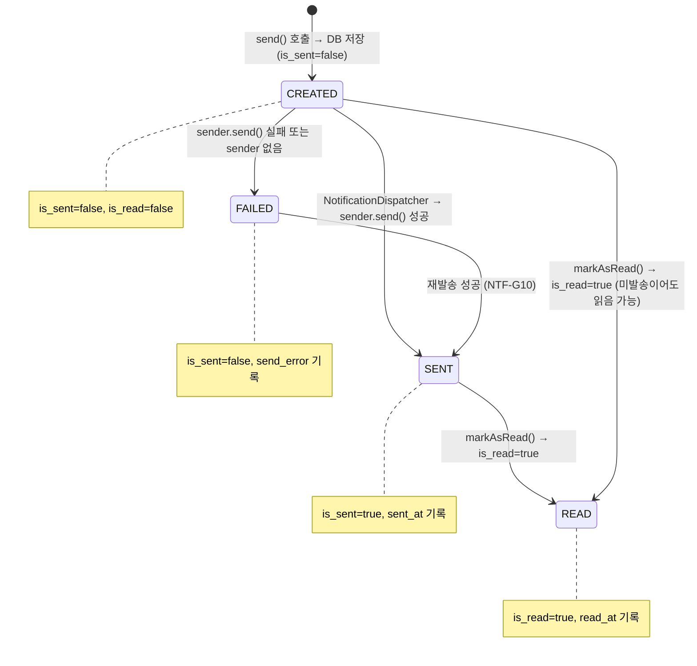
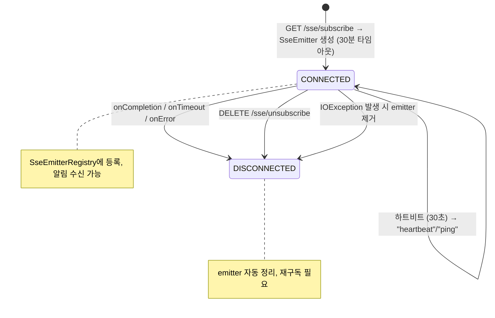
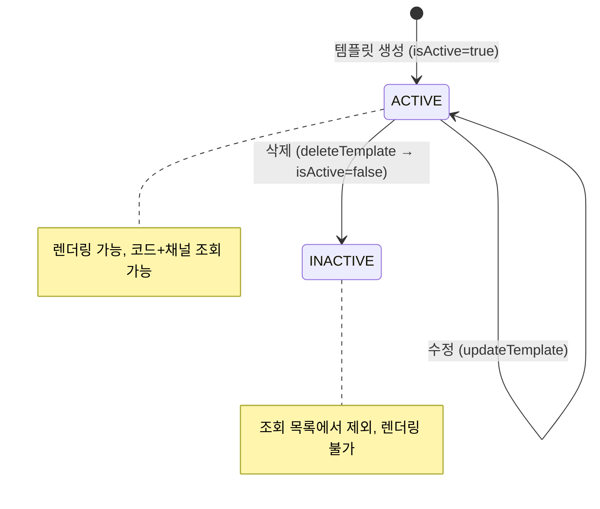
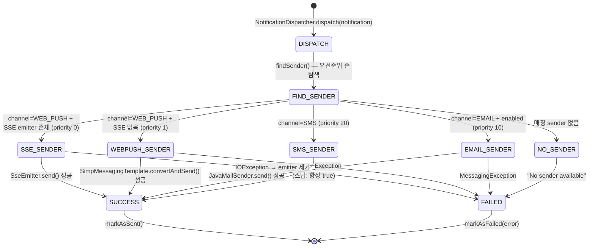
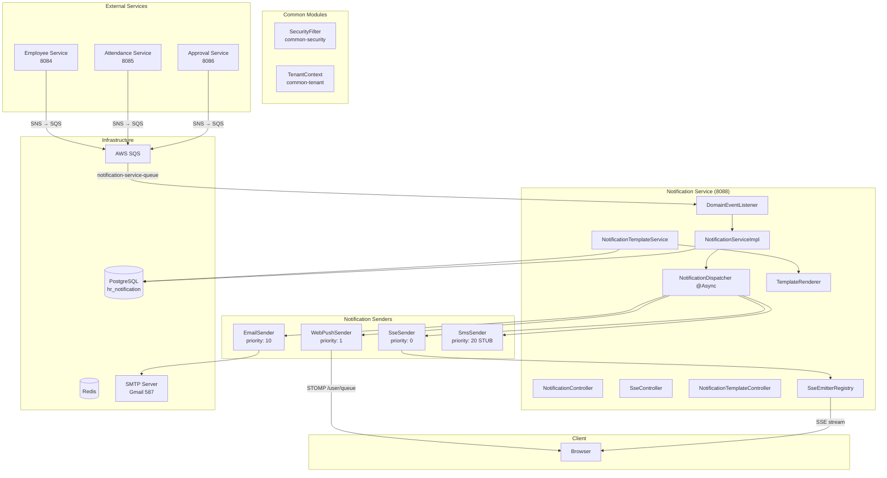
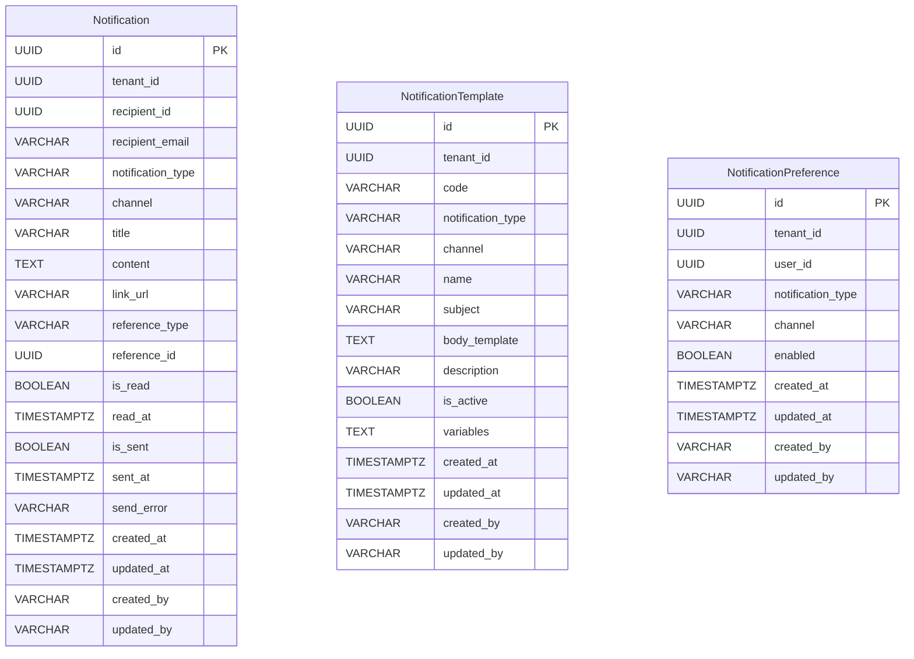

# Module 08: Notification Service (알림 관리) — PRD 및 프로덕션 정책 분석

> **최종 업데이트**: 2026-02-10
> **분석 범위**: `services/notification-service/`, `common/` 모듈
> **문서 버전**: v2.0 (Phase A/B/C 확장)
> **포트**: 8088
> **패키지**: `com.hrsaas.notification`
> **DB 스키마**: `hr_notification`

---

## 목차

- [1. 현재 구현 상태 요약](#1-현재-구현-상태-요약)
- [2. 정책 결정사항](#2-정책-결정사항)
- [3. 기능 요구사항 Gap 분석 (Phase A)](#3-기능-요구사항-gap-분석-phase-a)
- [4. 비즈니스 규칙 상세 (Phase B)](#4-비즈니스-규칙-상세-phase-b)
- [5. 서비스 연동 명세 (Phase C)](#5-서비스-연동-명세-phase-c)
- [6. 데이터 모델](#6-데이터-모델)
- [7. API 명세](#7-api-명세)
- [8. 보안/프라이버시](#8-보안프라이버시)
- [9. 성능/NFR](#9-성능nfr)
- [10. 추적성 매트릭스](#10-추적성-매트릭스)
- [11. 변경 이력](#11-변경-이력)

---

## 1. 현재 구현 상태 요약

### 1.1 구현 완료

| 기능 | 상태 | 위치 |
|------|------|------|
| 알림 발송 (멀티채널) | ✅ 완료 | `NotificationServiceImpl.send()` — 채널별 Notification 생성 + DB 저장 |
| 알림 목록 조회 (페이징) | ✅ 완료 | `NotificationController.getMyNotifications()` — recipientId 기반 |
| 알림 상세 조회 | ✅ 완료 | `NotificationController.getById()` — 수신자 소유권 검증 |
| 읽지 않은 알림 목록/카운트 | ✅ 완료 | `getUnreadNotifications()`, `countUnread()` — isRead=false 필터 |
| 읽음 처리 (단건/전체) | ✅ 완료 | `markAsRead()`, `markAllAsRead()` — JPQL UPDATE 배치 |
| 알림 삭제 (단건/일괄) | ✅ 완료 | `delete()`, `bulkDelete()` — 소유권 검증 후 하드 삭제 |
| SSE 실시간 알림 | ✅ 완료 | `SseController` + `SseEmitterRegistry` + `SseSender` (priority 0) |
| WebSocket/STOMP 알림 | ✅ 완료 | `WebPushSender` (priority 1) — /user/{userId}/queue/notifications |
| 이메일 발송 | ✅ 완료 | `EmailSender` (priority 10) — JavaMailSender + Thymeleaf + 폴백 HTML |
| 이메일 HTML 템플릿 | ✅ 완료 | `templates/email/notification.html` — 반응형 레이아웃, HR SaaS 브랜딩, 링크 버튼, 한국어 푸터 |
| 알림 템플릿 CRUD | ✅ 완료 | `NotificationTemplateController` + `NotificationTemplateService` |
| 템플릿 렌더링 | ✅ 완료 | `TemplateRenderer` — `{{variable}}` 치환, 중첩 속성(dot notation) 지원 |
| 비동기 디스패치 | ✅ 완료 | `NotificationDispatcher` @Async — 우선순위 기반 발송자 선택 |
| 발송 상태 추적 | ✅ 완료 | `isSent/sentAt/sendError` 필드로 성공/실패 추적 |
| SQS 이벤트 수신 | ✅ 완료 | `DomainEventListener` @SqsListener — SNS envelope 파싱 + eventType 분기 |
| RLS 테넌트 격리 | ✅ 완료 | 3개 테이블 모두 RLS 적용 (notifications, templates, preferences) |
| ddl-auto: validate | ✅ 올바름 | Flyway 마이그레이션 + validate 모드 |
| SecurityFilter 이중등록 방지 | ✅ 완료 | `FilterRegistrationBean.setEnabled(false)` 설정 |
| WebSocket 설정 | ✅ 완료 | STOMP + SockJS 폴백, /ws/notifications 엔드포인트 |

### 1.2 미구현 / TODO

| 기능 | 상태 | 구현 방향 |
|------|------|-----------|
| 알림 설정 영속화 | ❌ TODO | getSettings/updateSettings가 하드코딩 기본값 반환 (NTF-G01) |
| SMS 발송 구현 | ❌ 스텁 | SmsSender가 항상 true 반환 — AWS SNS SMS 구현 예정 (NTF-G02) |
| 카카오 알림톡 | ❌ 미구현 | KAKAO enum만 정의, KakaoSender 없음 — Phase 2 (NTF-G03) |
| 알림 보존/자동 삭제 | ❌ 미구현 | 90일 보존 정책 스케줄러 필요 (NTF-G04) |
| 야간 무음 (Quiet Hours) | ❌ 미구현 | DTO에 quietHoursEnabled 필드 존재, 로직 없음 (NTF-G05) |
| 다이제스트 (요약 알림) | ❌ 미구현 | DTO에 digestEnabled 필드 존재, 로직 없음 (NTF-G06) |
| LeaveRequestCreated 처리 | ❌ TODO | DomainEventListener에 TODO 주석만 존재 (NTF-G07) |
| EmployeeCreated 처리 | ❌ TODO | DomainEventListener에 TODO 주석만 존재 (NTF-G08) |
| ApprovalCompleted 수신 | ❌ 미구현 | 결재 완료 이벤트 수신 → 기안자 알림 미구현 (NTF-G09) |
| 알림 재발송 메커니즘 | ❌ 미구현 | findUnsentNotifications 쿼리 존재, 스케줄러 없음 (NTF-G10) |
| Firebase 푸시 | ❌ 미구현 | build.gradle에 firebase-admin 의존성, FirebaseSender 없음 (NTF-G11) |
| 알림 설정 기반 필터링 | ❌ 미구현 | NotificationPreference 테이블 존재, 발송 시 미적용 (NTF-G12) |
| ApprovalSubmitted 실제 알림 생성 | 🟡 부분 | handleApprovalSubmitted()에서 로그만 기록, send() 호출 없음 (NTF-G14) |

---

## 2. 정책 결정사항

### 2.1 SMS 발송 제공자 ✅ 결정완료

> **결정: AWS SNS SMS 사용**

- 이미 SQS/SNS 인프라를 사용 중이므로 SNS SMS 기능 활용
- `SmsSender` 구현 시 `SnsClient.publish()` 호출
- SMS 발송 비용: 건당 ~$0.04 (한국 번호)
- 수신자 전화번호: employee-service에서 조회 (EmployeeClient Feign)
- 발신번호 등록 필요 (한국 통신법 준수)

### 2.2 카카오 알림톡 ✅ 결정완료

> **결정: Phase 2에서 구현**

- 현재는 WEB_PUSH, EMAIL만 활성 채널
- SMS는 AWS SNS로 구현 (2.1)
- KAKAO 채널은 enum에 유지하되 KakaoSender는 Phase 2에서 구현
- Phase 2 시 카카오 비즈메시지 API 연동

### 2.3 알림 보존 정책 ✅ 결정완료

> **결정: 90일 보존 후 자동 삭제**

- 스케줄러로 90일 경과 알림 자동 삭제
- 실행 주기: 매일 새벽 03:00 (테넌트별 순차 처리)
- 삭제 대상: `created_at < NOW() - INTERVAL '90 days'`
- 배치 삭제: 1,000건씩 분할 삭제 (DB 부하 방지)
- 삭제 전 건수 로그 기록

### 2.4 야간 무음 (Quiet Hours) ✅ 결정완료

> **결정: 구현 예정**

- 사용자별 야간 무음 시간대 설정 가능
- 기본값: 22:00 ~ 07:00 (테넌트별 기본 설정 가능)
- 적용 대상: EMAIL, SMS 채널 (WEB_PUSH는 항상 발송)
- 무음 시간대 발송 보류 → 무음 해제 시 일괄 발송
- `notification_preferences` 테이블에 quiet_start_time, quiet_end_time 컬럼 추가 필요
- 보류된 알림은 `is_sent = false` 상태로 유지, 스케줄러가 무음 해제 시 재발송

### 2.5 다이제스트 (요약 알림) ✅ 결정완료

> **결정: 구현 예정**

- 사용자별 다이제스트 활성화 시 개별 이메일 대신 일간 요약 이메일 발송
- 다이제스트 스케줄: 매일 09:00 (출근 시간)
- 요약 내용: 전일 발생한 알림 유형별 건수 + 상위 5건 상세
- 적용 대상: EMAIL 채널만
- WEB_PUSH 알림은 다이제스트 대상에서 제외 (실시간 유지)
- 다이제스트 활성화 사용자의 EMAIL 채널 알림은 `is_sent` 없이 저장만 → 스케줄러가 일괄 발송

### 2.6 실시간 알림 전략 ✅ 결정완료 / 구현완료

> **결정: SSE 우선 + WebSocket 폴백**

- **SSE (SseSender, priority 0)**: SSE 연결이 있는 사용자에게 최우선 전송
- **STOMP (WebPushSender, priority 1)**: SSE 연결이 없을 때 WebSocket으로 전송
- SSE 타임아웃: 30분, 하트비트: 30초
- 사용자당 1개 SSE emitter (신규 등록 시 기존 교체)
- WebSocket 엔드포인트: `/ws/notifications` (SockJS 폴백)

### 2.7 템플릿 관리 정책 ✅ 결정완료 / 구현완료

> **결정: 테넌트별 독립 템플릿 + 코드+채널 유니크**

- 템플릿 코드(code)는 테넌트 내 유니크 제약
- 동일 코드 + 다른 채널: 별도 템플릿 허용 (채널별 본문 차별화)
- 변수 구문: `{{variableName}}`, 중첩 속성 `{{employee.name}}` 지원
- 삭제: 소프트 삭제 (isActive=false)

---

## 3. 기능 요구사항 Gap 분석 (Phase A)

### 3.1 PRD vs 코드 비교표

> **PRD 출처**: `docs/deprecated/PRD.md` (섹션 5.7: 알림 시스템)
> **참고**: PRD의 FR-NTF 시리즈는 5개 요구사항 (1개 그룹)

| ID | PRD 요구사항 | PRD 출처 | 코드 구현 상태 | 구현 위치 | Gap |
|----|-------------|---------|---------------|----------|-----|
| FR-NTF-001-01 | 웹 푸시 알림 발송 | §5.7 L429 | ✅ 완전 구현 | `SseSender` + `WebPushSender` + `NotificationDispatcher` | — |
| FR-NTF-001-02 | 인앱 알림 센터 조회 | §5.7 L430 | ✅ 완전 구현 | `NotificationController` (my, unread, count, detail) | — |
| FR-NTF-001-03 | 읽음/안읽음 관리 | §5.7 L431 | ✅ 완전 구현 | `markAsRead()`, `markAllAsRead()` — JPQL UPDATE | — |
| FR-NTF-001-04 | 이메일 알림 발송 | §5.7 L432 | 🟡 부분 구현 | `EmailSender` — SMTP 구현 완료, AWS SES 미연동 | SES 연동 미완 |
| FR-NTF-001-05 | SMS 알림 발송 | §5.7 L433 | ❌ 스텁만 존재 | `SmsSender` — 항상 true 반환, 실제 발송 없음 | AWS SNS 구현 필요 |

**구현률**: 60% (3/5 완전 구현, 1개 부분, 1개 미구현)

### 3.2 코드에만 있는 기능 (역분석)

PRD에 명시적 요구사항이 없지만, 코드에 구현된 기능들:

| FR ID (신규) | 기능 | 구현 위치 | 비즈니스 가치 | PRD 반영 권장 |
|-------------|------|----------|-------------|--------------|
| FR-NTF-EX-001 | SSE 실시간 스트리밍 | `SseController` + `SseEmitterRegistry` | 지연 없는 실시간 알림 | ✅ 반영 필요 |
| FR-NTF-EX-002 | WebSocket/STOMP 폴백 | `WebPushSender` + `WebSocketConfig` | SSE 미지원 환경 대응 | ✅ 반영 필요 |
| FR-NTF-EX-003 | 알림 템플릿 CRUD | `NotificationTemplateController` | 알림 내용 중앙 관리 | ✅ 반영 필요 |
| FR-NTF-EX-004 | 템플릿 변수 렌더링 (중첩 속성) | `TemplateRenderer` | 동적 알림 본문 생성 | ✅ 반영 필요 |
| FR-NTF-EX-005 | 비동기 멀티채널 디스패치 | `NotificationDispatcher` @Async | 채널별 병렬 발송 | ✅ 반영 필요 |
| FR-NTF-EX-006 | 발송 상태 추적 (성공/실패/에러) | `Notification.markAsSent/markAsFailed` | 발송 모니터링 | ✅ 반영 필요 |
| FR-NTF-EX-007 | 알림 삭제 (단건/일괄) | `NotificationController.delete/bulkDelete` | 사용자 알림 관리 | ✅ 반영 필요 |
| FR-NTF-EX-008 | 알림 설정 API (채널/유형별) | `NotificationController` settings | 사용자 수신 선호도 관리 | ✅ 반영 필요 |
| FR-NTF-EX-009 | SQS 이벤트 리스너 (도메인 이벤트) | `DomainEventListener` @SqsListener | 타 서비스 이벤트 기반 알림 | ✅ 반영 필요 |
| FR-NTF-EX-010 | 이메일 폴백 HTML | `EmailSender.buildFallbackHtml()` | 템플릿 없어도 이메일 발송 가능 | 운영 안전장치 |

### 3.3 Gap 해소 우선순위 로드맵

| 우선순위 | Gap ID | 항목 | 현재 상태 | 해소 방향 | 의존성 | 예상 복잡도 |
|---------|--------|------|----------|----------|--------|-----------|
| **CRITICAL** | NTF-G14 | ApprovalSubmitted 실제 알림 생성 | 로그만 기록, send() 미호출 | handleApprovalSubmitted()에서 NotificationService.send() 호출 | — | 낮음 |
| **CRITICAL** | NTF-G12 | 알림 설정 기반 필터링 | 설정 미적용 | send()에서 PreferenceRepository 조회 + 비활성 채널 건너뛰기 | NTF-G01 | 중간 |
| **HIGH** | NTF-G01 | 알림 설정 영속화 | 하드코딩 기본값 반환 | PreferenceRepository 조회/upsert → 채널x유형 매트릭스 반환 | — | 중간 |
| **HIGH** | NTF-G07 | LeaveRequestCreated 처리 | TODO 주석 | handleLeaveRequested()에서 managerId 추출 → 휴가 알림 발송 | — | 낮음 |
| **HIGH** | NTF-G09 | ApprovalCompleted 수신 | 미구현 | DomainEventListener에 case 추가 → 기안자에게 승인/반려 알림 | Approval Service | 낮음 |
| **HIGH** | NTF-G02 | SMS 발송 (AWS SNS) | 스텁 | SmsSender에서 SnsClient.publish() 호출, recipientPhone 필드 추가 | Employee Service | 중간 |
| **HIGH** | NTF-G04 | 알림 90일 보존 자동 삭제 | 미구현 | NotificationCleanupScheduler @Scheduled(cron=03:00) + 배치 삭제 | — | 낮음 |
| **MEDIUM** | NTF-G08 | EmployeeCreated 처리 | TODO 주석 | handleEmployeeCreated()에서 환영 알림 발송 | — | 낮음 |
| **MEDIUM** | NTF-G05 | 야간 무음 (Quiet Hours) | 필드만 존재 | Dispatcher에서 시간대 체크 + 보류 스케줄러 | NTF-G01 | 중간 |
| **MEDIUM** | NTF-G06 | 다이제스트 (요약 알림) | 필드만 존재 | 일간 요약 스케줄러 + digest 이메일 템플릿 | NTF-G01 | 높음 |
| **MEDIUM** | NTF-G10 | 알림 재발송 메커니즘 | 쿼리만 존재 | NotificationRetryScheduler + findUnsentNotifications 활용 | — | 낮음 |
| **RESOLVED** | ~~NTF-G13~~ | ~~이메일 HTML 템플릿~~ | ✅ 해소 | `templates/email/notification.html` 파일 존재 확인 (반응형 HTML, 한국어) | — | — |
| **LOW** | NTF-G11 | Firebase 푸시 | 의존성만 존재 | FirebaseSender 구현 + FCM 토큰 관리 | Firebase 프로젝트 | 높음 |
| **LOW** | NTF-G03 | 카카오 알림톡 | enum만 존재 | KakaoSender + 카카오 비즈메시지 API 연동 | 카카오 계정 | 높음 |
| **RESOLVED** | — | v1.0에서 식별된 기본 기능 | ✅ 모두 구현 완료 | — | — | — |

---

## 4. 비즈니스 규칙 상세 (Phase B)

### 4.1 상태 머신

#### 4.1.1 알림 발송 상태 (Notification)



**상태 설명:**

| 상태 | DB 표현 | 의미 | 전이 조건 |
|------|---------|------|----------|
| CREATED | `is_sent=false, send_error IS NULL` | 생성됨, 발송 대기 | send() 호출 시 |
| SENT | `is_sent=true, sent_at IS NOT NULL` | 발송 성공 | sender.send() = true |
| FAILED | `is_sent=false, send_error IS NOT NULL` | 발송 실패 | sender.send() = false 또는 예외 |
| READ | `is_read=true, read_at IS NOT NULL` | 수신자가 읽음 | markAsRead() 호출 |

#### 4.1.2 SSE 연결 생명주기



#### 4.1.3 알림 템플릿 생명주기



#### 4.1.4 알림 디스패치 흐름 (Strategy Pattern)



### 4.2 유효성 검증 규칙 카탈로그

#### 4.2.1 알림 발송 (SendNotificationRequest)

| 필드 | 검증 규칙 | 에러 코드 | 검증 위치 |
|------|----------|----------|----------|
| recipientId | `@NotNull`, 유효한 UUID | 400 | DTO |
| notificationType | `@NotNull`, 유효한 NotificationType enum | 400 | DTO |
| title | `@NotBlank` | 400 | DTO |
| content | `@NotBlank` | 400 | DTO |
| channels | null/empty → 기본값 `[WEB_PUSH]` | — | Service |
| recipientEmail | EMAIL 채널 시 필수 (null이면 EmailSender 실패) | — | Sender |
| linkUrl | 선택사항, 1000자 이내 | — | DB 제약 |

#### 4.2.2 알림 읽음/삭제 (소유권 검증)

| 동작 | 검증 규칙 | 에러 코드 | 검증 위치 |
|------|----------|----------|----------|
| markAsRead | notification.recipientId == 요청자 userId | NTF_002 (403) | Service |
| getById | notification.recipientId == 요청자 userId | NTF_002 (403) | Service |
| delete | notification.recipientId == 요청자 userId | NTF_002 (403) | Service |
| bulkDelete | 각 notification별 소유권 검증 — 비소유 알림 건너뛰기 | — | Service |
| notificationId | 존재하지 않으면 NotFoundException | NTF_001 (404) | Service |

#### 4.2.3 알림 템플릿 (NotificationTemplate)

| 필드 | 검증 규칙 | 에러 코드 | 검증 위치 |
|------|----------|----------|----------|
| code | NOT NULL, 100자 이내, 테넌트 내 유니크 | IllegalArgument (400) | Service |
| code+channel | 동일 code+channel 중복 생성 불가 (existsByTenantIdAndCodeAndChannel) | IllegalArgument (400) | Service |
| notificationType | NOT NULL, 유효한 enum | — | DTO/Entity |
| channel | NOT NULL, 유효한 enum | — | DTO/Entity |
| name | NOT NULL, 200자 이내 | — | Entity |
| bodyTemplate | NOT NULL, TEXT | — | Entity |
| templateId | 존재하지 않으면 NotFoundException | NTF_T01 (404) | Service |
| code 조회 | 코드+채널로 찾을 수 없으면 NotFoundException | NTF_T02 (404) | Service |

#### 4.2.4 알림 설정 (NotificationPreference)

| 필드 | 검증 규칙 | 에러 코드 | 검증 위치 |
|------|----------|----------|----------|
| userId | NOT NULL, 본인만 조회/수정 가능 | — | Controller |
| UNIQUE | (tenant_id, user_id, notification_type, channel) | DB 제약 | Entity |
| 기본값 | preference 레코드 없으면 enabled=true (기본 활성) | — | Service |

### 4.3 계산 공식/로직 명세

#### 4.3.1 채널 기본값 결정

```
if (request.channels == null || request.channels.isEmpty()):
    channels = [WEB_PUSH]        // 기본: 웹 푸시만
else:
    channels = request.channels  // 명시적 채널 사용

// 채널별 Notification 개별 생성 (1:N)
for channel in channels:
    notification = new Notification(channel=channel, ...)
    save(notification)
```

#### 4.3.2 발송자 선택 (우선순위 기반)

```
senders = allSenders.sortBy(priority ASC)
// [SseSender(0), WebPushSender(1), EmailSender(10), SmsSender(20)]

selectedSender = senders.stream()
    .filter(s -> s.supports(notification))
    .findFirst()
    .orElse(null)

// SseSender.supports():  channel == WEB_PUSH && emitterRegistry.hasEmitter(recipientId)
// WebPushSender.supports(): channel == WEB_PUSH
// EmailSender.supports():   emailEnabled && channel == EMAIL
// SmsSender.supports():     channel == SMS
```

#### 4.3.3 SSE 하트비트 타이밍

```
SSE_TIMEOUT = 30 * 60 * 1000ms  // 30분
HEARTBEAT_INTERVAL = 30s        // 30초
HEARTBEAT_INITIAL_DELAY = 30s   // 최초 30초 후 시작

heartbeatScheduler = scheduleAtFixedRate(
    task: emitter.send("heartbeat", "ping"),
    initialDelay: 30s,
    period: 30s
)

// emitter lifecycle 종료 시 heartbeat 취소
emitter.onCompletion → heartbeat.cancel()
emitter.onTimeout    → heartbeat.cancel()
emitter.onError      → heartbeat.cancel()
```

#### 4.3.4 미읽음 알림 수 계산

```sql
SELECT COUNT(n) FROM Notification n
WHERE n.tenant_id = :tenantId
  AND n.recipient_id = :recipientId
  AND n.is_read = false
```

#### 4.3.5 전체 읽음 처리 (배치 UPDATE)

```sql
UPDATE Notification n
SET n.is_read = true, n.read_at = CURRENT_TIMESTAMP
WHERE n.tenant_id = :tenantId
  AND n.recipient_id = :recipientId
  AND n.is_read = false
-- 반환: 업데이트된 건수 (int)
```

#### 4.3.6 템플릿 렌더링 공식

```
template = "{{employee.name}}님이 {{leaveType}} 휴가를 신청했습니다"
variables = {employee: {name: "홍길동"}, leaveType: "연차"}

// 정규식: \{\{\s*([^}]+)\s*\}\}
// 1. "employee.name" → dot notation → variables["employee"]["name"] = "홍길동"
// 2. "leaveType" → variables["leaveType"] = "연차"
// 결과: "홍길동님이 연차 휴가를 신청했습니다"

// null 또는 미존재 변수 → 빈 문자열("")로 치환
```

### 4.4 데이터 생명주기 정책

| 데이터 | 생성 시점 | 보존 기간 | 삭제 방식 | 비고 |
|--------|----------|----------|----------|------|
| Notification | 알림 발송 시 (send) | 90일 | 하드 삭제 (스케줄러 + 사용자 직접) | 90일 자동 삭제 정책 (NTF-G04) |
| NotificationTemplate | 관리자 생성 시 | 영구 | 소프트 삭제 (isActive=false) | 기존 알림 참조 유지 |
| NotificationPreference | 사용자 설정 시 | 영구 | 삭제 없음 (enabled 토글) | 미설정 시 기본 활성 |
| SSE Emitter | 사용자 구독 시 | 30분 (타임아웃) | 자동 정리 (completion/timeout/error) | 인메모리만, 영속화 안 함 |

### 4.5 엣지 케이스 카탈로그

| # | 시나리오 | 현재 동작 | 기대 동작 | 상태 |
|---|---------|----------|----------|------|
| 1 | 채널 미지정 시 알림 발송 | channels=null → [WEB_PUSH] 기본값 | 기본 채널 자동 지정 | ✅ 정상 |
| 2 | 3채널 동시 발송 | 채널별 개별 Notification 생성 (3건) | 멀티채널 병렬 발송 | ✅ 정상 |
| 3 | 타인의 알림 읽음 처리 시도 | NTF_002 ForbiddenException | 소유자만 읽음 처리 가능 | ✅ 정상 |
| 4 | 타인의 알림 삭제 시도 | NTF_002 ForbiddenException | 소유자만 삭제 가능 | ✅ 정상 |
| 5 | 존재하지 않는 알림 조회 | NTF_001 NotFoundException | 404 반환 | ✅ 정상 |
| 6 | SSE 연결 중 IOException | emitter 자동 제거 (SseSender) | emitter 정리 후 false 반환 | ✅ 정상 |
| 7 | SSE 30분 타임아웃 | emitter 자동 정리 + heartbeat 취소 | 재구독 필요 | ✅ 정상 |
| 8 | 동일 사용자 SSE 재구독 | 기존 emitter 교체 (ConcurrentHashMap.put) | 신규 emitter로 교체 | ✅ 정상 |
| 9 | 이메일 수신자 주소 없이 EMAIL 채널 발송 | EmailSender returns false → markAsFailed | 실패 기록 | ✅ 정상 |
| 10 | 이메일 발송 비활성화 상태 | EmailSender returns true (무시) | 비활성화 시 성공 처리 | ✅ 정상 |
| 11 | 매칭 sender 없는 채널 | markAsFailed("No sender available") | 실패 기록 | ✅ 정상 |
| 12 | sender.send() 예외 발생 | markAsFailed(e.getMessage()) | 에러 메시지 기록 | ✅ 정상 |
| 13 | 동일 코드+채널 템플릿 중복 생성 | IllegalArgumentException | 중복 방지 | ✅ 정상 |
| 14 | Thymeleaf 템플릿 파일 부재 | 폴백 HTML 생성 (buildFallbackHtml) | 폴백으로 발송 | ✅ 정상 |
| 15 | 템플릿 변수에 없는 키 사용 | 빈 문자열("")로 치환 | 누락 변수 무시 | ✅ 정상 |
| 16 | 일괄 삭제 시 비소유 알림 포함 | 소유 알림만 삭제, 비소유 건너뛰기 | 부분 삭제 허용 | ✅ 정상 |
| 17 | SQS 메시지 파싱 실패 | 예외 로그 + rethrow (SQS 재시도) | 메시지 재처리 | ✅ 정상 |
| 18 | 알림 설정 조회 (미설정 사용자) | 하드코딩 기본값 반환 | 기본 활성 설정 반환 | ⚠️ TODO (NTF-G01) |
| 19 | 알림 설정 기반 채널 필터링 | 미적용 (전 채널 발송) | 비활성 채널 건너뛰기 | ⚠️ TODO (NTF-G12) |
| 20 | ApprovalSubmitted 이벤트 수신 | 로그만 기록, 알림 미생성 | 결재자에게 알림 발송 | ⚠️ TODO (NTF-G14) |

---

## 5. 서비스 연동 명세 (Phase C)

### 5.1 연동 아키텍처



### 5.2 REST API 연동 (Feign Client 기반)

#### 5.2.1 Notification Service의 Feign Client

**현재 Feign Client: 없음**

Notification Service는 이벤트 구독 전용 서비스로, 다른 서비스를 동기 호출하지 않는다. 향후 SMS 구현 시 Employee Service에서 전화번호를 조회하기 위한 Feign Client가 필요하다.

#### 5.2.2 향후 필요 Feign Client (NTF-G02 구현 시)

| Feign Client | 메서드 | 엔드포인트 | 용도 | 호출 시점 | 폴백 전략 |
|-------------|--------|----------|------|----------|----------|
| `EmployeeClient` (미구현) | `getPhoneNumber(UUID)` | `GET /api/v1/employees/{id}/phone` | SMS 수신 번호 조회 | SMS 발송 시 | null (발송 건너뛰기) |

#### 5.2.3 다른 서비스 → Notification Service

| 호출자 | 용도 | 엔드포인트 |
|--------|------|----------|
| Frontend | 알림 목록/읽음/삭제 | `/api/v1/notifications/*` |
| Frontend | SSE 실시간 구독 | `/api/v1/notifications/sse/subscribe` |
| Frontend | WebSocket 연결 | `/ws/notifications` (STOMP) |
| Frontend | 알림 설정 관리 | `/api/v1/notifications/settings` |
| Frontend (관리자) | 알림 템플릿 관리 | `/api/v1/notifications/templates` |
| Frontend (관리자) | 수동 알림 발송 | `POST /api/v1/notifications` |

### 5.3 이벤트 연동 (SNS/SQS)

#### 5.3.1 발행하는 이벤트

**없음** -- Notification Service는 이벤트를 구독만 하고 발행하지 않음

#### 5.3.2 소비하는 이벤트

| 이벤트 | SQS 큐 | 발행자 | 처리 로직 | 구현 상태 |
|--------|--------|--------|----------|----------|
| `ApprovalSubmittedEvent` | `notification-service-queue` | Approval Service | currentApproverId 추출 → 결재 요청 알림 발송 | 🟡 로그만 (NTF-G14) |
| `ApprovalCompletedEvent` | `notification-service-queue` | Approval Service | drafterId 추출 → 승인/반려 결과 알림 발송 | ❌ 미구현 (NTF-G09) |
| `LeaveRequestCreatedEvent` | `notification-service-queue` | Attendance Service | managerId 추출 → 휴가 신청 알림 발송 | ❌ TODO (NTF-G07) |
| `EmployeeCreatedEvent` | `notification-service-queue` | Employee Service | employeeId 추출 → 환영 알림 발송 | ❌ TODO (NTF-G08) |

#### 5.3.3 미구현 이벤트 (설계 완료)

| 이벤트 | 발행자 | 소비 시 처리 | 알림 유형 |
|--------|--------|------------|----------|
| `AttendanceAbsentEvent` | Attendance Service | 미출근 직원에게 알림 | SYSTEM |
| `WorkHoursExceededEvent` | Attendance Service | 52시간 초과 경고 | SYSTEM |
| `AnnouncementPublishedEvent` | Organization Service | 공지 대상자에게 알림 | ANNOUNCEMENT |
| `AppointmentExecutedEvent` | Appointment Service | 발령 대상자에게 알림 | SYSTEM |

### 5.4 데이터 동기화 흐름

#### 5.4.1 결재 요청 → 알림 흐름

```
1. Approval Service: 결재 문서 제출
   └→ ApprovalSubmittedEvent 발행 (SNS)
      - currentApproverId, title, documentNumber

2. SQS: notification-service-queue 수신

3. DomainEventListener:
   └→ handleApprovalSubmitted(event)
      └→ NotificationService.send(
           recipientId = currentApproverId,
           type = APPROVAL_REQUESTED,
           title = "결재 요청: {title}",
           channels = [WEB_PUSH, EMAIL]
         )

4. NotificationDispatcher (비동기):
   └→ SseSender/WebPushSender → 실시간 전달
   └→ EmailSender → 이메일 발송
```

#### 5.4.2 결재 완료 → 알림 흐름 (NTF-G09, 미구현)

```
1. Approval Service: 결재 승인/반려
   └→ ApprovalCompletedEvent 발행 (SNS)
      - drafterId, status (APPROVED/REJECTED), title

2. SQS: notification-service-queue 수신

3. DomainEventListener:
   └→ handleApprovalCompleted(event)
      └→ NotificationService.send(
           recipientId = drafterId,
           type = status == APPROVED ? APPROVAL_APPROVED : APPROVAL_REJECTED,
           title = "결재 {승인/반려}: {title}",
           channels = [WEB_PUSH, EMAIL]
         )
```

#### 5.4.3 SSE 실시간 알림 전달 흐름

```
1. 클라이언트: GET /api/v1/notifications/sse/subscribe
   └→ SseEmitter 생성 (30분 타임아웃)
   └→ SseEmitterRegistry.register(userId, emitter)
   └→ "connected" 이벤트 전송

2. 알림 발생 (send):
   └→ SseSender.send(notification)
      └→ emitterRegistry.get(recipientId)
      └→ emitter.send(event="notification", data={id, type, title, content, linkUrl, ...})

3. 하트비트 (30초 간격):
   └→ emitter.send(event="heartbeat", data="ping")

4. 연결 종료:
   └→ onCompletion/onTimeout/onError
   └→ emitterRegistry.remove(userId)
   └→ heartbeat 스케줄 취소
```

#### 5.4.4 이메일 발송 흐름

```
1. EmailSender.send(notification):
   └→ emailEnabled == false → return true (무시)
   └→ recipientEmail == null → return false (실패)

2. 이메일 본문 생성:
   └→ Thymeleaf 템플릿 처리 시도
      └→ 성공: templates/email/notification.html 렌더링
      └→ 실패: buildFallbackHtml() 폴백

3. JavaMailSender.send():
   └→ SMTP: smtp.gmail.com:587 (STARTTLS)
   └→ From: noreply@hrsaas.com
   └→ 성공: return true → markAsSent()
   └→ 실패: return false → markAsFailed(error)
```

### 5.5 통합 테스트 시나리오

| # | 시나리오 | 관련 서비스 | 기대 결과 | 상태 |
|---|---------|-----------|----------|------|
| IT-01 | 멀티채널 발송 (WEB_PUSH + EMAIL) | Notification 단독 | 2개 Notification 생성, 각각 sender 호출 | ❌ 미작성 |
| IT-02 | SSE 구독 → 알림 발송 → 실시간 수신 | Notification 단독 | subscribe → send → SSE event 수신 확인 | ❌ 미작성 |
| IT-03 | 읽음 처리 → 미읽음 카운트 감소 | Notification 단독 | markAsRead → countUnread 감소 | ❌ 미작성 |
| IT-04 | 전체 읽음 처리 → 미읽음 0건 | Notification 단독 | markAllAsRead → 미읽음 전체 0건 | ❌ 미작성 |
| IT-05 | 타인 알림 읽음/삭제 → 403 | Notification 단독 | NTF_002 ForbiddenException | ❌ 미작성 |
| IT-06 | 이메일 템플릿 렌더링 + 발송 | Notification 단독 | 변수 치환 + SMTP 발송 성공 | ❌ 미작성 |
| IT-07 | SQS ApprovalSubmittedEvent → 알림 생성 | Notification + Approval | SNS envelope 파싱 → Notification 생성 | ❌ 미작성 |
| IT-08 | 템플릿 코드+채널 중복 생성 → 거부 | Notification 단독 | IllegalArgumentException | ❌ 미작성 |
| IT-09 | 채널 미지정 시 기본값 WEB_PUSH | Notification 단독 | channels=null → [WEB_PUSH] 1건 생성 | ❌ 미작성 |
| IT-10 | RLS 테넌트 격리 | Notification 단독 | A 테넌트 알림을 B 테넌트에서 조회 불가 | ❌ 미작성 |
| IT-11 | SSE 타임아웃 후 재구독 | Notification 단독 | 30분 후 emitter 자동 정리, 재구독 성공 | ❌ 미작성 |
| IT-12 | 일괄 삭제 시 부분 소유 | Notification 단독 | 소유 알림만 삭제, 비소유 건 건너뛰기 | ❌ 미작성 |

---

## 6. 데이터 모델

### 6.1 테이블 목록 (hr_notification 스키마)

| 테이블 | 상태 | 용도 | RLS |
|--------|------|------|-----|
| `notifications` | ✅ 사용 중 | 알림 저장 (수신자별, 채널별) | ✅ |
| `notification_templates` | ✅ 사용 중 | 알림 템플릿 (코드+채널 유니크) | ✅ |
| `notification_preferences` | ✅ 사용 중 | 사용자 알림 수신 설정 | ✅ |

### 6.2 ERD



### 6.3 UNIQUE 제약 조건

| 테이블 | UNIQUE 제약 | 비즈니스 의미 |
|--------|-----------|-------------|
| notification_templates | (tenant_id, code) | 테넌트별 템플릿 코드 유니크 |
| notification_preferences | (tenant_id, user_id, notification_type, channel) | 사용자별 유형+채널 설정 1건 |

### 6.4 인덱스 전략

| 테이블 | 인덱스 | 주요 쿼리 패턴 |
|--------|--------|---------------|
| notifications | (tenant_id) | 테넌트 필터링 |
| notifications | (tenant_id, recipient_id) | 내 알림 목록 |
| notifications | (tenant_id, notification_type) | 유형별 알림 조회 |
| notifications | (tenant_id, channel) | 채널별 알림 조회 |
| notifications | (tenant_id, recipient_id, is_read) | 미읽음 알림 필터 |
| notifications | (is_sent) WHERE is_sent = FALSE | 미발송 알림 재시도 |
| notifications | (tenant_id, reference_type, reference_id) | 참조 엔티티별 알림 |
| notifications | (tenant_id, created_at DESC) | 최신순 알림 정렬 |
| notification_templates | (tenant_id) | 테넌트 필터링 |
| notification_templates | (tenant_id, notification_type) | 유형별 템플릿 조회 |
| notification_templates | (tenant_id, channel) | 채널별 템플릿 조회 |
| notification_preferences | (tenant_id) | 테넌트 필터링 |
| notification_preferences | (tenant_id, user_id) | 사용자 설정 목록 |

### 6.5 Flyway 마이그레이션

| 버전 | 파일명 | 내용 |
|------|--------|------|
| V1 | `V1__init.sql` | 스키마 생성, 3개 테이블, 13개 인덱스, `get_current_tenant_safe()` 함수, 3개 RLS 정책 |

**총 3개 테이블, 3개 RLS 대상 테이블, 13개 인덱스**

---

## 7. API 명세

### 7.1 알림 관리 (`/api/v1/notifications`)

| Method | Path | 설명 | 권한 |
|--------|------|------|------|
| POST | `/` | 알림 발송 (멀티채널) | HR_ADMIN, TENANT_ADMIN, SUPER_ADMIN |
| GET | `/my` | 내 알림 목록 (페이징, 20건 기본) | 인증 필요 |
| GET | `/my/unread` | 읽지 않은 알림 목록 | 인증 필요 |
| GET | `/my/unread/count` | 읽지 않은 알림 수 | 인증 필요 |
| GET | `/{id}` | 알림 상세 조회 (소유권 검증) | 인증 필요 |
| POST | `/{id}/read` | 알림 읽음 처리 (소유권 검증) | 인증 필요 |
| POST | `/my/read-all` | 모든 알림 읽음 처리 (JPQL 배치) | 인증 필요 |
| DELETE | `/{id}` | 알림 삭제 (소유권 검증) | 인증 필요 |
| POST | `/bulk-delete` | 알림 일괄 삭제 (소유 알림만) | 인증 필요 |
| GET | `/settings` | 알림 설정 조회 | 인증 필요 |
| PUT | `/settings` | 알림 설정 수정 | 인증 필요 |

### 7.2 SSE 실시간 (`/api/v1/notifications/sse`)

| Method | Path | 설명 | 권한 |
|--------|------|------|------|
| GET | `/subscribe` | SSE 구독 (text/event-stream, 30분 타임아웃) | 인증 필요 |
| DELETE | `/unsubscribe` | SSE 구독 해제 | 인증 필요 |

### 7.3 알림 템플릿 (`/api/v1/notifications/templates`)

| Method | Path | 설명 | 권한 |
|--------|------|------|------|
| GET | `/` | 템플릿 목록 (페이징, 활성만) | HR_ADMIN, TENANT_ADMIN, SUPER_ADMIN |
| GET | `/{templateId}` | 템플릿 상세 | HR_ADMIN, TENANT_ADMIN, SUPER_ADMIN |
| POST | `/` | 템플릿 생성 (코드+채널 유니크 검증) | HR_ADMIN, TENANT_ADMIN, SUPER_ADMIN |
| PUT | `/{templateId}` | 템플릿 수정 | HR_ADMIN, TENANT_ADMIN, SUPER_ADMIN |
| DELETE | `/{templateId}` | 템플릿 비활성화 (소프트 삭제) | TENANT_ADMIN, SUPER_ADMIN |

### 7.4 WebSocket (STOMP)

| 프로토콜 | 엔드포인트 | 설명 |
|---------|----------|------|
| STOMP + SockJS | `/ws/notifications` | WebSocket 연결 (SockJS 폴백) |
| 구독 경로 | `/user/{userId}/queue/notifications` | 사용자별 알림 큐 |
| 브로커 | `/queue`, `/topic` | Simple Broker |
| 앱 접두사 | `/app` | Application Destination Prefix |
| 사용자 접두사 | `/user` | User Destination Prefix |

---

## 8. 보안/프라이버시

### 8.1 인증/인가

| 항목 | 설정 | 비고 |
|------|------|------|
| JWT 인증 | SecurityFilter (common-security) | FilterRegistrationBean으로 이중 등록 방지 |
| 알림 발송 | HR_ADMIN, TENANT_ADMIN, SUPER_ADMIN | 관리자만 수동 발송 가능 |
| 알림 조회/읽음/삭제 | 인증 + 소유권 검증 | recipientId == 현재 userId |
| 템플릿 관리 | HR_ADMIN, TENANT_ADMIN, SUPER_ADMIN | 삭제는 TENANT_ADMIN+ |
| 설정 관리 | 인증 필요 | 본인 설정만 조회/수정 |
| SSE/WebSocket | 인증 필요 | JWT 기반 사용자 식별 |
| Actuator | permitAll | health, info, metrics, prometheus |
| Swagger | permitAll | 개발 환경용 |

### 8.2 데이터 보호

| 데이터 | 보호 수준 | 처리 방식 |
|--------|----------|----------|
| RLS | 모든 테이블 | `app.current_tenant` 세션 변수 기반 자동 필터링 |
| 수신자 이메일 | 개인정보 | recipient_email 필드 — 암호화 미적용 (향후 @Encrypted 적용 권장) |
| 알림 내용 | 민감 가능 | 결재/휴가 등 업무 정보 포함 — RLS로 테넌트 격리 |
| SSE 연결 | 인증 보호 | 인증된 사용자만 구독 가능, 사용자당 1개 emitter |
| WebSocket 연결 | 인증 보호 | STOMP 프로토콜, 사용자별 큐 격리 |

### 8.3 CORS/보안 설정

| 항목 | 설정 |
|------|------|
| CSRF | 비활성화 (Stateless API) |
| 세션 | STATELESS |
| WebSocket CORS | `setAllowedOriginPatterns("*")` (프로덕션에서 도메인 제한 필요) |

---

## 9. 성능/NFR

### 9.1 비동기 처리 전략

| 구성요소 | 방식 | 목적 |
|---------|------|------|
| NotificationDispatcher.dispatch() | @Async | 알림 발송 시 HTTP 응답 지연 방지 |
| SQS 이벤트 수신 | @SqsListener | 비동기 이벤트 소비 |
| SSE 하트비트 | ScheduledExecutorService | 커넥션 유지를 위한 주기적 핑 |

### 9.2 SSE 인프라 성능

| 항목 | 값 | 비고 |
|------|-----|------|
| 최대 동시 SSE 연결 | JVM 메모리 제한 | ConcurrentHashMap 기반, 사용자당 1개 |
| SSE 타임아웃 | 30분 | 재구독 필요 |
| 하트비트 주기 | 30초 | 프록시/LB 타임아웃 방지 |
| 하트비트 스레드풀 | 1개 (ScheduledThreadPool) | 모든 emitter에 대해 공유 |

### 9.3 데이터베이스 성능

| 항목 | 설정 | 비고 |
|------|------|------|
| Connection Pool | HikariCP (max=10, min=5) | 알림 서비스 특성상 충분 |
| 전체 읽음 처리 | @Modifying @Query (JPQL 배치 UPDATE) | 엔티티 로드 없이 직접 UPDATE |
| 미읽음 카운트 | COUNT 쿼리 (인덱스 활용) | (tenant_id, recipient_id, is_read) |
| 미발송 알림 조회 | Partial Index (is_sent = FALSE) | 재발송 용도 |
| 최신순 정렬 | (tenant_id, created_at DESC) 인덱스 | 알림 목록 조회 |

### 9.4 비즈니스 상수

| 상수 | 값 | 위치 | 설명 |
|------|-----|------|------|
| SSE_TIMEOUT | 30분 (1,800,000ms) | SseController | SSE 연결 타임아웃 |
| HEARTBEAT_INTERVAL | 30초 | SseController | 하트비트 주기 |
| SseSender.PRIORITY | 0 | SseSender | 최우선 발송자 |
| WebPushSender.PRIORITY | 1 | WebPushSender | SSE 폴백 |
| EmailSender.PRIORITY | 10 | EmailSender | 이메일 |
| SmsSender.PRIORITY | 20 | SmsSender | SMS |
| DEFAULT_CHANNEL | WEB_PUSH | NotificationServiceImpl | 채널 미지정 시 기본값 |
| RETENTION_DAYS | 90 | 정책 결정 (미구현) | 알림 보존 기간 |
| CLEANUP_BATCH_SIZE | 1,000 | 정책 결정 (미구현) | 배치 삭제 단위 |

### 9.5 스케줄러 Cron 표현식 (미구현, 설계 완료)

| 작업 | Cron | 실행 시점 | 상태 |
|------|------|----------|------|
| 알림 자동 삭제 (90일) | `0 0 3 * * *` | 매일 03:00 | ❌ 미구현 (NTF-G04) |
| 다이제스트 발송 | `0 0 9 * * *` | 매일 09:00 | ❌ 미구현 (NTF-G06) |
| 보류 알림 재발송 (야간 무음 해제) | `0 0 * * * *` | 매 시간 정각 | ❌ 미구현 (NTF-G05) |
| 미발송 알림 재시도 | `0 */5 * * * *` | 5분마다 | ❌ 미구현 (NTF-G10) |

### 9.6 SQS 큐 설정

| 큐 | 값 | 용도 |
|----|-----|------|
| 수신 큐 | `notification-service-queue` | 도메인 이벤트 수신 |
| 필터 이벤트 | `ApprovalSubmittedEvent`, `LeaveRequestCreatedEvent`, `EmployeeCreatedEvent` | 결재/휴가/입사 이벤트 |

### 9.7 데이터베이스 설정

```yaml
server:
  port: 8088

spring:
  application:
    name: notification-service
  datasource:
    url: jdbc:postgresql://${DB_HOST:localhost}:${DB_PORT:15432}/hr_saas
    hikari:
      maximum-pool-size: 10
      minimum-idle: 5
  jpa:
    hibernate:
      ddl-auto: validate
    properties:
      hibernate:
        dialect: org.hibernate.dialect.PostgreSQLDialect
        default_schema: hr_notification
  flyway:
    enabled: true
    schemas: hr_notification
  data:
    redis:
      host: ${REDIS_HOST:localhost}
      port: ${REDIS_PORT:16379}
  mail:
    host: ${MAIL_HOST:smtp.gmail.com}
    port: ${MAIL_PORT:587}
    properties:
      mail.smtp.auth: true
      mail.smtp.starttls.enable: true
  cloud:
    aws:
      region:
        static: ${AWS_REGION:ap-northeast-2}
      sns:
        endpoint: ${AWS_SNS_ENDPOINT:http://localhost:14566}
      sqs:
        endpoint: ${AWS_SQS_ENDPOINT:http://localhost:14566}

notification:
  email:
    enabled: ${NOTIFICATION_EMAIL_ENABLED:false}

jwt:
  access-token-expiry: 1800
  refresh-token-expiry: 604800
```

### 9.8 빌드 의존성

```groovy
dependencies {
    // Common 모듈 전체 (core, entity, response, database, tenant, security, cache, event)
    // Spring Boot (web, jpa, validation, security, redis, mail, websocket, thymeleaf)
    // Spring Cloud (openfeign, circuitbreaker-resilience4j)
    // Firebase Admin SDK 9.2.0 (push notifications - 미사용)
    // PostgreSQL, Flyway
    // SpringDoc OpenAPI
    // TestContainers
}
```

---

## 10. 추적성 매트릭스

### 10.1 PRD -> 코드 매핑

| FR ID | PRD 요구사항 | 구현 상태 | 코드 위치 | 테스트 |
|-------|-------------|----------|----------|--------|
| FR-NTF-001-01 | 웹 푸시 알림 | ✅ | `SseSender` + `WebPushSender` + `NotificationDispatcher` | ❌ |
| FR-NTF-001-02 | 인앱 알림 센터 | ✅ | `NotificationController` (my, unread, count, detail) | ❌ |
| FR-NTF-001-03 | 읽음/안읽음 관리 | ✅ | `markAsRead()`, `markAllAsRead()`, `NotificationRepository` | ❌ |
| FR-NTF-001-04 | 이메일 알림 | 🟡 | `EmailSender` (SMTP 완료, SES 미연동) | ❌ |
| FR-NTF-001-05 | SMS 알림 | ❌ | `SmsSender` (스텁) | ❌ |

### 10.2 코드 전용 기능 매핑

| FR ID | 기능 | Controller | Service | Entity/Infra | Migration |
|-------|------|------------|---------|--------------|-----------|
| FR-NTF-EX-001 | SSE 실시간 스트리밍 | `SseController` | — | `SseEmitterRegistry` | — |
| FR-NTF-EX-002 | WebSocket/STOMP 폴백 | — | `WebPushSender` | `WebSocketConfig` | — |
| FR-NTF-EX-003 | 알림 템플릿 CRUD | `NotificationTemplateController` | `NotificationTemplateService` | `NotificationTemplate` | V1 |
| FR-NTF-EX-004 | 템플릿 변수 렌더링 | — | `NotificationTemplateService` | `TemplateRenderer` | — |
| FR-NTF-EX-005 | 비동기 멀티채널 디스패치 | — | `NotificationDispatcher` | 4개 Sender | — |
| FR-NTF-EX-006 | 발송 상태 추적 | — | `NotificationDispatcher` | `Notification` (isSent, sendError) | V1 |
| FR-NTF-EX-007 | 알림 삭제 (단건/일괄) | `NotificationController` | `NotificationServiceImpl` | `Notification` | V1 |
| FR-NTF-EX-008 | 알림 설정 API | `NotificationController` | `NotificationServiceImpl` | `NotificationPreference` | V1 |
| FR-NTF-EX-009 | SQS 이벤트 리스너 | — | — | `DomainEventListener` | — |
| FR-NTF-EX-010 | 이메일 폴백 HTML | — | `EmailSender` | — | — |

### 10.3 Gap 매핑

| Gap ID | 관련 FR | Controller | Service | Entity/Infra | 상태 |
|--------|---------|------------|---------|--------------|------|
| NTF-G01 | FR-NTF-EX-008 | `NotificationController` settings | `NotificationServiceImpl` | `NotificationPreferenceRepository` | ❌ TODO |
| NTF-G02 | FR-NTF-001-05 | — | `SmsSender` | AWS SNS SnsClient | ❌ 스텁 |
| NTF-G04 | — | — | NotificationCleanupScheduler (미구현) | — | ❌ 미구현 |
| NTF-G07 | — | — | `DomainEventListener` | — | ❌ TODO |
| NTF-G09 | — | — | `DomainEventListener` | — | ❌ 미구현 |
| NTF-G12 | FR-NTF-EX-008 | — | `NotificationServiceImpl.send()` | `NotificationPreferenceRepository` | ❌ 미구현 |
| NTF-G14 | FR-NTF-EX-009 | — | `DomainEventListener` | — | 🟡 로그만 |

---

## 11. 변경 이력

| 버전 | 날짜 | 변경 내용 |
|------|------|----------|
| v1.0 | 2026-02-06 | 초기 모듈 분석 문서 작성: 정책 결정사항 5건, API 18개 엔드포인트, 데이터 모델 3개 테이블, 갭 13개 식별 |
| v2.0 | 2026-02-10 | Phase A/B/C 확장: Gap 분석 (PRD 5개 비교, 코드 전용 10개 역분석, Gap 15개 우선순위 로드맵), 비즈니스 규칙 상세 (4개 상태 머신 Mermaid, 검증 규칙 4개 카탈로그, 계산 공식 6종, 엣지 케이스 20건, 데이터 생명주기 4종), 서비스 연동 명세 (아키텍처 Mermaid, SQS 이벤트 4종, 동기화 흐름 4종, 통합 테스트 시나리오 12건), 추적성 매트릭스 (PRD 매핑 5건, 코드 전용 10건, Gap 7건). 문서 구조를 11섹션 v2.0 포맷으로 통일 |

---

## 12. 에러 코드

| 코드 | HTTP | 메시지 | 발생 위치 |
|------|------|--------|----------|
| NTF_001 | 404 | 알림을 찾을 수 없습니다 | NotificationServiceImpl -- findById 실패 |
| NTF_002 | 403 | 본인의 알림만 처리할 수 있습니다 | NotificationServiceImpl -- 수신자 소유권 검증 실패 |
| NTF_T01 | 404 | 템플릿을 찾을 수 없습니다 (ID) | NotificationTemplateService -- findById 실패 |
| NTF_T02 | 404 | 템플릿을 찾을 수 없습니다 (코드) | NotificationTemplateService -- findByCode 실패 |
| IllegalArgument | 400 | 동일한 코드와 채널의 템플릿이 이미 존재합니다 | NotificationTemplateService.create -- 코드 중복 |

---

## 13. Enum 정의

### 13.1 NotificationType (알림 유형)

| 값 | 설명 | 이벤트 소스 |
|----|------|-----------|
| APPROVAL_REQUESTED | 결재 요청됨 | ApprovalSubmittedEvent |
| APPROVAL_APPROVED | 결재 승인됨 | ApprovalCompletedEvent (NTF-G09) |
| APPROVAL_REJECTED | 결재 반려됨 | ApprovalCompletedEvent (NTF-G09) |
| LEAVE_REQUESTED | 휴가 신청됨 | LeaveRequestCreatedEvent (NTF-G07) |
| LEAVE_APPROVED | 휴가 승인됨 | (attendance-service에서 직접 처리) |
| LEAVE_REJECTED | 휴가 반려됨 | (attendance-service에서 직접 처리) |
| EMPLOYEE_JOINED | 신규 입사 | EmployeeCreatedEvent (NTF-G08) |
| EMPLOYEE_RESIGNED | 퇴사 | (미연동) |
| ANNOUNCEMENT | 공지사항 | 직접 API 호출 |
| SYSTEM | 시스템 알림 | 직접 API 호출 |

### 13.2 NotificationChannel (발송 채널)

| 값 | 발송자 | 우선순위 | 구현 상태 |
|----|--------|---------|----------|
| WEB_PUSH | SseSender + WebPushSender | 0, 1 | ✅ 완료 |
| EMAIL | EmailSender | 10 | ✅ 완료 (SMTP) |
| SMS | SmsSender | 20 | ❌ 스텁 (AWS SNS 예정) |
| KAKAO | (없음) | — | ❌ Phase 2 |

---

## 14. 주요 코드 파일 위치

```
services/notification-service/src/main/java/com/hrsaas/notification/
├── config/
│   ├── SecurityConfig.java              # 보안 설정 (JWT + FilterRegistrationBean)
│   ├── WebSocketConfig.java             # STOMP WebSocket 설정 (SockJS 폴백)
│   └── MailConfig.java                  # Thymeleaf 이메일 템플릿 엔진
├── controller/
│   ├── NotificationController.java      # 알림 CRUD + 설정 (11 엔드포인트)
│   ├── SseController.java              # SSE 구독/해제 (2 엔드포인트)
│   └── NotificationTemplateController.java  # 템플릿 관리 (5 엔드포인트)
├── service/
│   ├── NotificationService.java         # 인터페이스 (11 메서드)
│   ├── impl/NotificationServiceImpl.java  # 구현체
│   └── NotificationTemplateService.java   # 템플릿 서비스 (렌더링 포함)
├── sender/
│   ├── NotificationSender.java          # 발송자 인터페이스 (send, supports, getPriority)
│   ├── NotificationDispatcher.java      # 비동기 디스패처 (@Async)
│   ├── SseSender.java                  # SSE 발송 (priority: 0)
│   ├── WebPushSender.java              # WebSocket/STOMP 발송 (priority: 1)
│   ├── EmailSender.java                # 이메일 발송 (priority: 10)
│   └── SmsSender.java                  # SMS 발송 스텁 (priority: 20)
├── listener/
│   └── DomainEventListener.java         # SQS 이벤트 리스너 (@SqsListener)
├── infrastructure/
│   └── SseEmitterRegistry.java          # SSE 커넥션 레지스트리 (ConcurrentHashMap)
├── template/
│   └── TemplateRenderer.java            # {{variable}} 템플릿 렌더러 (중첩 속성)
├── repository/
│   ├── NotificationRepository.java              # 알림 (5 쿼리)
│   ├── NotificationTemplateRepository.java      # 템플릿 (4 쿼리 + exists)
│   └── NotificationPreferenceRepository.java    # 설정 (2 쿼리)
└── domain/
    ├── entity/
    │   ├── Notification.java            # 알림 엔티티 (markAsRead, markAsSent, markAsFailed)
    │   ├── NotificationTemplate.java    # 템플릿 엔티티
    │   ├── NotificationPreference.java  # 설정 엔티티 (UNIQUE tenant+user+type+channel)
    │   ├── NotificationType.java        # 알림 유형 enum (10종)
    │   └── NotificationChannel.java     # 발송 채널 enum (4종)
    └── dto/
        ├── request/
        │   ├── SendNotificationRequest.java           # 알림 발송 요청
        │   └── UpdateNotificationSettingsRequest.java # 설정 수정 요청
        └── response/
            ├── NotificationResponse.java              # 알림 응답
            └── NotificationSettingsResponse.java      # 설정 응답
```
