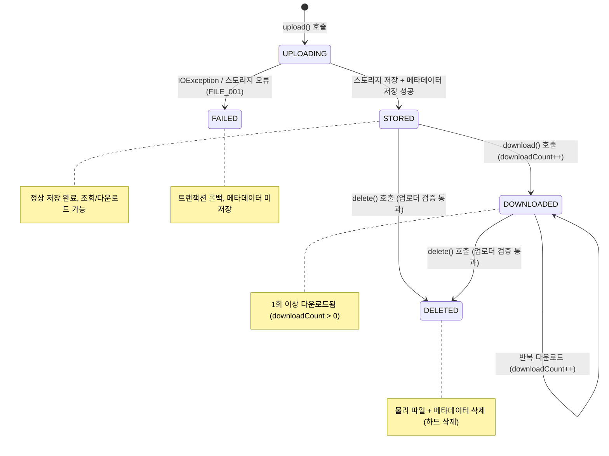
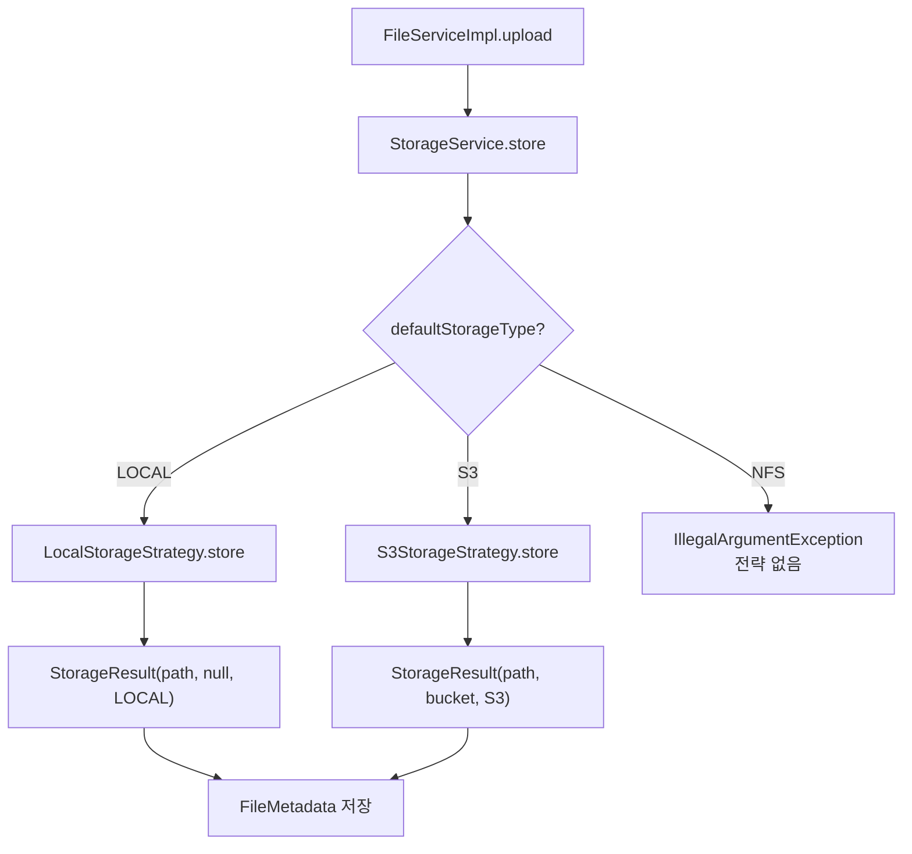
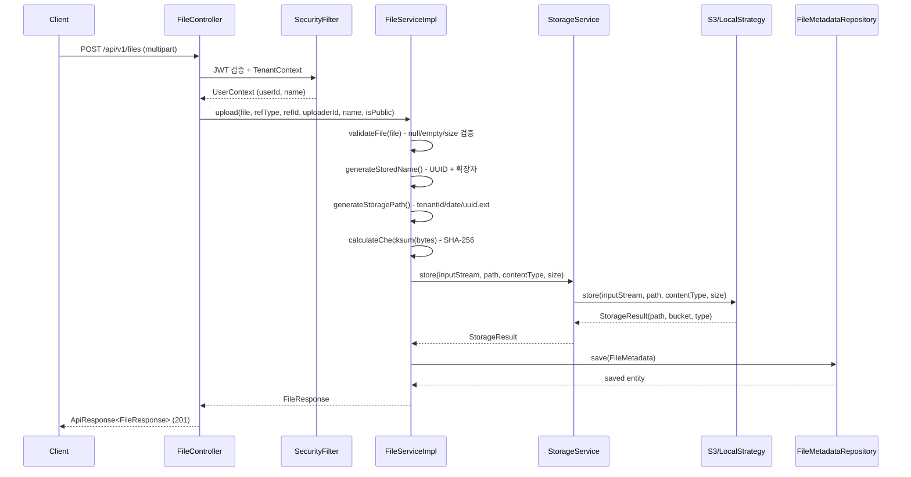
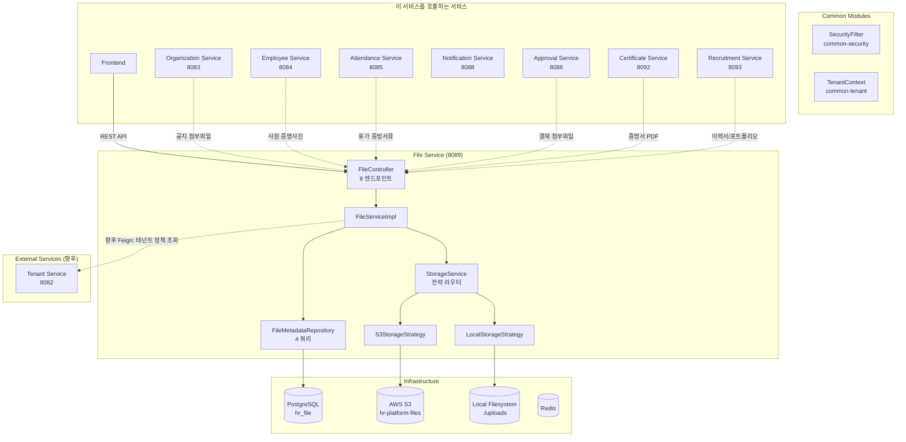
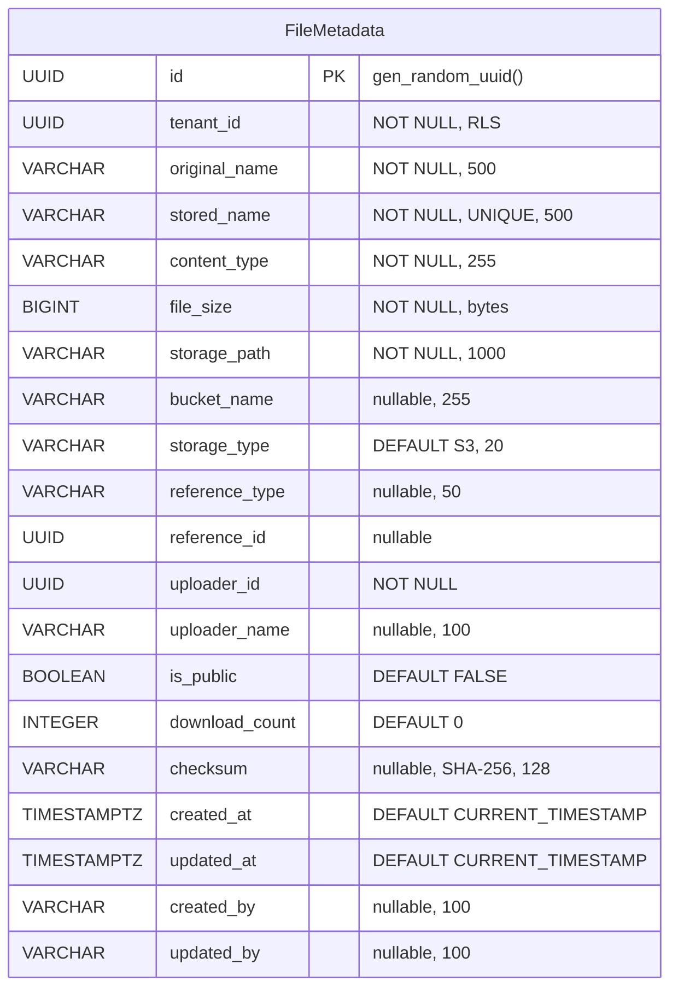
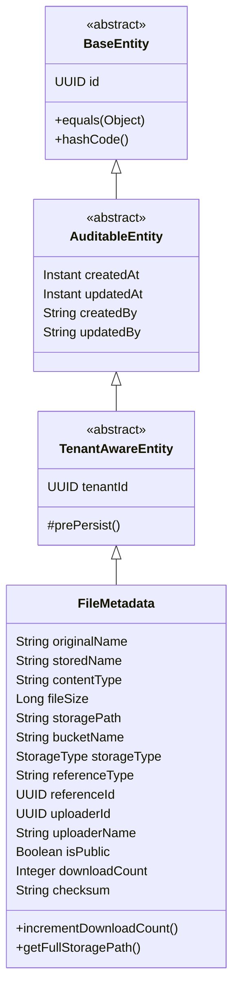

# Module 09: File Service — PRD 및 프로덕션 정책 분석

> **최종 업데이트**: 2026-02-10
> **분석 범위**: `services/file-service/`, `common/` 모듈
> **문서 버전**: v2.0 (Phase A/B/C 확장)
> **포트**: 8089
> **패키지**: `com.hrsaas.file`
> **DB 스키마**: `hr_file`

---

## 목차

- [1. 현재 구현 상태 요약](#1-현재-구현-상태-요약)
- [2. 정책 결정사항](#2-정책-결정사항)
- [3. 기능 요구사항 Gap 분석 (Phase A)](#3-기능-요구사항-gap-분석-phase-a)
- [4. 비즈니스 규칙 상세 (Phase B)](#4-비즈니스-규칙-상세-phase-b)
- [5. 서비스 연동 명세 (Phase C)](#5-서비스-연동-명세-phase-c)
- [6. 데이터 모델](#6-데이터-모델)
- [7. API 명세](#7-api-명세)
- [8. 보안/프라이버시](#8-보안프라이버시)
- [9. 성능/NFR](#9-성능nfr)
- [10. 추적성 매트릭스](#10-추적성-매트릭스)
- [11. 변경 이력](#11-변경-이력)

---

## 1. 현재 구현 상태 요약

### 1.1 구현 완료

| 기능 | 상태 | 위치 |
|------|------|------|
| 파일 업로드 (단건) | ✅ 완료 | `FileController.upload()` / `FileServiceImpl.upload()` |
| 파일 업로드 (다건) | ✅ 완료 | `FileController.uploadMultiple()` / `FileServiceImpl.uploadMultiple()` |
| 파일 다운로드 | ✅ 완료 | `FileController.download()` — Resource 반환, Content-Type + UTF-8 파일명 헤더 |
| Presigned URL 생성 | ✅ 완료 | `FileController.getPresignedUrl()` — 기본 60분 만료 |
| 파일 메타데이터 조회 | ✅ 완료 | `FileController.getById()` — ID 기반 단건 조회 |
| 참조별 파일 목록 조회 | ✅ 완료 | `FileController.getByReference()` — referenceType+referenceId |
| 내 파일 목록 (페이징) | ✅ 완료 | `FileController.getMyFiles()` — 업로더별 페이징 조회 |
| 파일 삭제 (업로더 소유권 검증) | ✅ 완료 | `FileServiceImpl.delete()` — uploaderId 일치 검증 |
| S3 스토리지 | ✅ 완료 | `S3StorageStrategy` — AWS SDK v2 (S3Client, S3Presigner), LocalStack 지원 |
| 로컬 스토리지 | ✅ 완료 | `LocalStorageStrategy` — NIO Path API, 개발 환경용 |
| Strategy Pattern (스토리지 라우팅) | ✅ 완료 | `StorageService` — Map<StorageType, StorageStrategy> 자동 발견 |
| SHA-256 체크섬 | ✅ 완료 | `FileServiceImpl.calculateChecksum()` — 업로드 시 무결성 해시 |
| 다운로드 카운터 | ✅ 완료 | `FileMetadata.incrementDownloadCount()` — 다운로드 시 자동 증가 |
| 테넌트별 경로 분리 | ✅ 완료 | `{tenantId}/{yyyy/MM/dd}/{storedName}` 경로 구조 |
| 파일명 UUID 변환 | ✅ 완료 | `generateStoredName()` — UUID + 원본 확장자 |
| 파일 크기 검증 (글로벌) | ✅ 완료 | `validateFile()` — 100MB 상한 (`file.max-size`) |
| RLS (Row Level Security) | ✅ 완료 | `file_metadata` 테이블 RLS 적용 |
| ddl-auto: validate | ✅ 올바름 | Flyway 마이그레이션 + validate 모드 |
| FilterRegistrationBean 이중 등록 방지 | ✅ 완료 | `SecurityConfig` — `setEnabled(false)` |
| Swagger/OpenAPI 문서 | ✅ 완료 | `springdoc-openapi-starter-webmvc-ui`, `@Tag`, `@Operation` |

### 1.2 미구현 / TODO

| 기능 | 상태 | 구현 방향 |
|------|------|-----------|
| 테넌트별 파일 정책 (확장자/크기/쿼터) | ❌ TODO | `validateFile()` L204에 TODO 주석 존재, tenant-service Feign 연동 필요 (FILE-G01) |
| 확장자/MIME 타입 화이트리스트 | ❌ 미구현 | 현재 모든 파일 허용 — 테넌트 정책으로 관리 (FILE-G02) |
| 스토리지 쿼터 제한 | ❌ 미구현 | `getTotalStorageByTenant()` 쿼리 존재하나 제한 로직 없음 (FILE-G03) |
| NFS 스토리지 구현 | ❌ 미구현 | `StorageType.NFS` enum만 존재, 구현체 없음 (FILE-G04) |
| 파일 버전 관리 | ❌ 미구현 | 동일 reference에 대한 파일 버전/이력 관리 없음 (FILE-G05) |
| 이미지 썸네일/미리보기 | ❌ 미구현 | PRD FR-FILE-001-03 (Should), 이미지 리사이즈 기능 없음 (FILE-G06) |
| 관리자 파일 삭제 | ❌ 미구현 | 현재 업로더만 삭제 가능, 관리자 권한 삭제 미구현 (FILE-G08) |
| 고아 파일 정리 | ❌ 미구현 | reference 삭제 시 연결 파일 자동 정리 없음 (FILE-G09) |
| 파일 이벤트 발행 | ❌ 미구현 | 업로드/삭제 시 도메인 이벤트 없음 (FILE-G10) |
| 파일 사용량 통계 API | ❌ 미구현 | 테넌트별 스토리지 사용량 대시보드 없음 (FILE-G11) |
| 테스트 코드 | ❌ 미작성 | `src/test/` 디렉토리 없음 (FILE-G12) |

---

## 2. 정책 결정사항

### 2.1 테넌트별 파일 업로드 정책 ✅ 결정완료

> **결정: 테넌트별 정책 구현 (향후)**

- 테넌트 정책 항목:
  - `maxFileSize`: 테넌트별 최대 파일 크기 (기본: 100MB, 테넌트별 축소 가능)
  - `allowedExtensions`: 허용 파일 확장자 목록 (기본: `.pdf,.docx,.xlsx,.pptx,.jpg,.jpeg,.png,.gif,.zip`)
  - `maxTotalStorageBytes`: 테넌트별 총 스토리지 쿼터 (기본: 10GB)
- 정책 조회: tenant-service Feign 클라이언트 + Redis 캐시
- 업로드 시 4단계 검증:
  1. 빈 파일 검증 (null, empty)
  2. 글로벌 크기 제한 (100MB)
  3. 테넌트별 크기 제한 (≤ 글로벌)
  4. 확장자 화이트리스트 + 스토리지 쿼터 잔여량
- **현재 구현 상태:** 1~2단계만 구현, 3~4단계는 TODO 주석으로 설계만 존재 (`FileServiceImpl:204-217`)

### 2.2 프로덕션 스토리지 ✅ 결정완료 / 구현완료

> **결정: AWS S3 (프로덕션), LOCAL (개발)**

- 환경별 설정:
  - `dev`: LOCAL (`./uploads`) 또는 LocalStack S3
  - `staging`: S3 (LocalStack 또는 실제 S3)
  - `prod`: AWS S3 (`hr-platform-files` 버킷)
- `file.storage.default` 환경변수로 전환 (`LOCAL` / `S3`)
- S3 설정: SSE-S3 서버 사이드 암호화 권장, `forcePathStyle: true` (LocalStack 호환)
- `StorageService`가 `Map<StorageType, StorageStrategy>`로 전략 자동 발견

### 2.3 파일 접근 권한 ✅ 결정완료 / 부분 구현

> **결정: 같은 테넌트 내 자유 접근**

- **업로드**: 인증된 사용자 누구나
- **다운로드/조회**: 동일 테넌트 사용자는 모든 파일 다운로드 가능 (RLS가 테넌트 격리 보장)
- **삭제**: 현재 업로더 본인만 가능 (향후 HR_ADMIN/TENANT_ADMIN/SUPER_ADMIN 추가 -- FILE-G08)
- **Presigned URL**: 인증된 사용자 누구나 생성 가능 (URL 자체는 인증 없이 접근)
- `isPublic` 플래그: 필드 존재, 향후 테넌트 간 공유 또는 외부 공개 시 사용

### 2.4 바이러스 스캔 ✅ 결정완료

> **결정: 불필요**

- HR 내부 시스템이므로 바이러스 스캔 불필요
- 엔티티에 `virusScanStatus` 필드 없음 (v1.0에서 제거됨)
- 추후 필요 시 AWS S3 Malware Protection 또는 ClamAV 연동 고려

### 2.5 파일 저장 경로 정책 ✅ 결정완료 / 구현완료

> **결정: 테넌트/날짜/UUID 기반 경로**

```
{tenantId}/{yyyy}/{MM}/{dd}/{UUID}.{extension}
예: 550e8400-e29b-41d4-a716-446655440000/2026/02/10/c7e3a4f2-8b1c-4d5e-9f3a-2b6c8d7e1f0a.pdf
```

- 테넌트별 디렉토리 분리 (물리적 격리)
- 날짜별 하위 디렉토리 (파일 분산, 관리 용이)
- UUID 기반 파일명 (충돌 방지, 원본 파일명 노출 방지)
- 원본 확장자 유지 (MIME 타입 인식)

### 2.6 고아 파일 정리 ✅ 결정완료

> **결정: 이벤트 기반 + 스케줄러 보조**

- 이벤트 기반: 엔티티 삭제 시 관련 파일 삭제 이벤트 수신
- 스케줄러 기반 (보조): 매주 1회 참조 유효성 검사
  - reference가 설정된 파일에 대해 해당 엔티티 존재 여부 확인
  - 존재하지 않는 참조의 파일을 후보로 마킹 → 30일 후 삭제
- **현재 구현 상태:** 미구현

---

## 3. 기능 요구사항 Gap 분석 (Phase A)

### 3.1 PRD vs 코드 비교표

> **PRD 출처**: `docs/deprecated/PRD.md` (섹션 5.8: 파일 관리)
> **참고**: PRD의 FR-FILE 시리즈는 4개 요구사항 (1개 그룹)

| ID | PRD 요구사항 | PRD 출처 | 코드 구현 상태 | 구현 위치 | Gap |
|----|-------------|---------|---------------|----------|-----|
| FR-FILE-001-01 | 파일을 업로드할 수 있다 (S3 저장) | §5.8 L441 | ✅ 완전 구현 | `FileController.upload/uploadMultiple()` + `S3StorageStrategy` + `LocalStorageStrategy` | -- |
| FR-FILE-001-02 | 파일을 다운로드할 수 있다 (Pre-signed URL) | §5.8 L442 | ✅ 완전 구현 | `FileController.download()` + `getPresignedUrl()` | -- |
| FR-FILE-001-03 | 이미지 미리보기를 제공한다 | §5.8 L443 | ❌ 미구현 | -- | 이미지 썸네일/리사이즈 기능 없음 (FILE-G06) |
| FR-FILE-001-04 | 파일 용량/형식 제한을 설정할 수 있다 | §5.8 L444 | 🟡 부분 구현 | `FileServiceImpl.validateFile()` -- 글로벌 크기 제한만, 확장자 제한 없음 | 테넌트별 정책 미구현 (FILE-G01/G02) |

**구현률**: 50% (2/4 완전 구현, 1개 부분, 1개 미구현) -- *Traceability Matrix 기준*

### 3.2 코드에만 있는 기능 (역분석)

PRD에 명시적 요구사항이 없지만, 코드에 구현된 기능들:

| FR ID (신규) | 기능 | 구현 위치 | 비즈니스 가치 | PRD 반영 권장 |
|-------------|------|----------|-------------|--------------|
| FR-FILE-EX-001 | Strategy Pattern 스토리지 (S3/LOCAL) | `StorageService` + `StorageStrategy` 인터페이스 | 환경별 유연한 스토리지 전환 | ✅ 반영 필요 |
| FR-FILE-EX-002 | 다중 파일 업로드 | `FileController.uploadMultiple()` → 순차 `upload()` | 사용자 편의성 (결재 첨부파일 등) | ✅ 반영 필요 |
| FR-FILE-EX-003 | 참조 기반 파일 관리 (referenceType + referenceId) | `FileController.getByReference()`, `FileMetadata` 컬럼 | 다른 서비스와의 파일 연동 핵심 | ✅ 반영 필요 |
| FR-FILE-EX-004 | 내 파일 목록 (페이징) | `FileController.getMyFiles()` → `Pageable` 기반 | 개인 파일 관리 | ✅ 반영 필요 |
| FR-FILE-EX-005 | SHA-256 체크섬 (무결성) | `FileServiceImpl.calculateChecksum()` → `FileMetadata.checksum` | 파일 무결성 검증, 위변조 감지 | 보안 문서 |
| FR-FILE-EX-006 | 다운로드 횟수 추적 | `FileMetadata.incrementDownloadCount()` → `download()` 시 +1 | 파일 활용도 분석, 감사 | ✅ 반영 필요 |
| FR-FILE-EX-007 | 테넌트별 스토리지 경로 분리 | `FileServiceImpl.generateStoragePath()` → `{tenantId}/{date}/{uuid}` | 데이터 격리, S3 파티셔닝 | 아키텍처 문서 |
| FR-FILE-EX-008 | Presigned URL 만료 시간 파라미터화 | `getPresignedUrl(id, expirationMinutes)` 기본 60분 | 보안 정책 유연성 | ✅ 반영 필요 |
| FR-FILE-EX-009 | 파일명 UUID 변환 (충돌 방지) | `FileServiceImpl.generateStoredName()` → UUID + 확장자 | 파일명 충돌 방지 + 보안 | 아키텍처 문서 |
| FR-FILE-EX-010 | 테넌트 총 스토리지 사용량 쿼리 | `FileMetadataRepository.getTotalStorageByTenant()` | 쿼터 관리 기반 (미사용) | FILE-G03 해소 시 활용 |

### 3.3 Gap 해소 우선순위 로드맵

| 우선순위 | Gap ID | 항목 | 현재 상태 | 해소 방향 | 의존성 | 예상 복잡도 |
|---------|--------|------|----------|----------|--------|-----------|
| **HIGH** | FILE-G01 | 테넌트별 파일 업로드 정책 | TODO 주석 존재 | tenant-service Feign 연동 → 크기/확장자/쿼터 검증 | Tenant Service | 중간 |
| **HIGH** | FILE-G02 | 확장자/MIME 타입 화이트리스트 | 미구현 | FILE-G01과 함께 구현, 기본 화이트리스트 + 테넌트 커스텀 | FILE-G01 | 낮음 |
| **HIGH** | FILE-G08 | 관리자 파일 삭제 | 업로더만 삭제 가능 | `delete()`에 `SecurityContextHolder.hasAnyRole()` 검증 추가 | -- | 낮음 |
| **HIGH** | FILE-G12 | 테스트 코드 작성 | `src/test/` 없음 | 단위 테스트 + 통합 테스트 (Testcontainers + LocalStack) | -- | 중간 |
| **MEDIUM** | FILE-G03 | 스토리지 쿼터 제한 | 쿼리만 존재 | `getTotalStorageByTenant()` 활용 + 업로드 시 잔여량 검증 | FILE-G01 | 낮음 |
| **MEDIUM** | FILE-G09 | 고아 파일 정리 | 미구현 | 이벤트 수신 (엔티티 삭제) + 주기적 스케줄러 보조 | SNS/SQS 이벤트 | 중간 |
| **MEDIUM** | FILE-G10 | 파일 이벤트 발행 | 미구현 | `FileUploadedEvent`, `FileDeletedEvent` SNS 발행 | common-event | 낮음 |
| **MEDIUM** | FILE-G11 | 파일 사용량 통계 API | 미구현 | 테넌트별 사용량, 유형별 분포, 업로더별 통계 | -- | 낮음 |
| **LOW** | FILE-G04 | NFS 스토리지 구현 | enum만 존재 | `NfsStorageStrategy implements StorageStrategy` | NFS 인프라 | 중간 |
| **LOW** | FILE-G05 | 파일 버전 관리 | 미구현 | 동일 reference 파일 이력 + `version` 컬럼 추가 | 스키마 변경 | 높음 |
| **LOW** | FILE-G06 | 이미지 썸네일/미리보기 | 미구현 | 업로드 시 이미지 리사이즈 (Java ImageIO 또는 Thumbnailator) | -- | 중간 |
| **LOW** | FILE-G07 | 파일 공유/공개 접근 | `isPublic` 필드만 존재 | 공개 파일 인증 없이 접근 API + 공유 링크 생성 | -- | 중간 |

---

## 4. 비즈니스 규칙 상세 (Phase B)

### 4.1 상태 머신

#### 4.1.1 파일 생명주기

> file-service는 명시적 `status` 컬럼 없이 존재 여부로 상태를 판단한다. 삭제는 hard delete 방식.



**생명주기 설명:**

| 단계 | 트리거 | DB 상태 | 물리 파일 | 비고 |
|------|--------|---------|----------|------|
| UPLOADING | `upload()` 호출 | -- | -- | 검증 + 체크섬 계산 + 스토리지 저장 진행 |
| STORED | 업로드 성공 | `file_metadata` INSERT | S3/Local 저장 완료 | `@Transactional` 커밋 |
| DOWNLOADED | `download()` 호출 | `downloadCount++` | 읽기 | `incrementDownloadCount()` |
| DELETED | `delete()` 호출 | `file_metadata` DELETE | 물리 파일 삭제 | 소유권 검증 후 hard delete |
| FAILED | IOException 발생 | 트랜잭션 롤백 | 저장 안됨 | `BusinessException(FILE_001)` |

#### 4.1.2 스토리지 전략 선택 흐름



#### 4.1.3 업로드 처리 시퀀스



### 4.2 유효성 검증 규칙 카탈로그

#### 4.2.1 파일 업로드 (upload)

| # | 필드 | 검증 규칙 | 에러 코드 | 검증 위치 | 상태 |
|---|------|----------|----------|----------|------|
| V1 | file | null 또는 empty 불가 | FILE_006 (400) | `FileServiceImpl.validateFile()` | ✅ 구현 |
| V2 | file.size | `> maxFileSize (100MB)` 불가 | FILE_007 (400) | `FileServiceImpl.validateFile()` | ✅ 구현 |
| V3 | file.size | Spring Multipart 100MB 제한 | 413 | `spring.servlet.multipart.max-file-size` | ✅ 구현 (프레임워크) |
| V4 | file.size | 테넌트별 크기 제한 | FILE_008 (예정) | `validateFile()` TODO | ❌ 미구현 |
| V5 | file.extension | 확장자 화이트리스트 | FILE_009 (예정) | `validateFile()` TODO | ❌ 미구현 |
| V6 | tenant storage | 스토리지 쿼터 초과 | FILE_010 (예정) | `validateFile()` TODO | ❌ 미구현 |

#### 4.2.2 파일 삭제 (delete)

| # | 필드 | 검증 규칙 | 에러 코드 | 검증 위치 | 상태 |
|---|------|----------|----------|----------|------|
| V7 | id | 존재하는 파일 ID | FILE_002 (404) | `FileServiceImpl.findById()` | ✅ 구현 |
| V8 | requesterId | 업로더 ID와 일치 필수 | FILE_004 (403) | `FileServiceImpl.delete()` | ✅ 구현 |
| V9 | requesterId | 관리자 역할 삭제 허용 | -- | -- | ❌ 미구현 (FILE-G08) |

#### 4.2.3 파일 조회/다운로드

| # | 필드 | 검증 규칙 | 에러 코드 | 검증 위치 | 상태 |
|---|------|----------|----------|----------|------|
| V10 | id | 존재하는 파일 ID | FILE_002 (404) | `FileServiceImpl.findById()` | ✅ 구현 |
| V11 | 물리 파일 | 스토리지 접근 가능 | FILE_002 (404) | `FileServiceImpl.download()` catch | ✅ 구현 |

### 4.3 계산 공식/로직 명세

#### 4.3.1 파일 크기 허용 판정

```
허용 여부 =
  (1) file != null && !file.isEmpty()                                           [V1]
  AND (2) file.getSize() <= GLOBAL_MAX_FILE_SIZE (104,857,600 bytes = 100MB)    [V2]
  AND (3) file.getSize() <= tenantPolicy.maxFileSize (미구현, 기본 = 글로벌)       [V4]
  AND (4) extension IN tenantPolicy.allowedExtensions (미구현, 기본 = 전체 허용)    [V5]
  AND (5) getTotalStorageByTenant() + file.getSize()
          <= tenantPolicy.maxTotalStorageBytes (미구현, 기본 = 10GB)               [V6]
```

#### 4.3.2 SHA-256 체크섬 계산

```java
// FileServiceImpl.calculateChecksum() — L232-240
checksum = HexFormat.of().formatHex(
    MessageDigest.getInstance("SHA-256").digest(file.getBytes())
);
// 결과 예: "e3b0c44298fc1c149afbf4c8996fb92427ae41e4649b934ca495991b7852b855"
// 실패 시: null 반환 (예외 무시, 업로드 계속 진행)
```

**주의:** `file.getBytes()` 는 전체 파일을 메모리에 로드 → 대용량 파일에서 OOM 위험. 향후 `DigestInputStream` 스트리밍 방식으로 개선 권장.

#### 4.3.3 저장 파일명 생성

```java
// FileServiceImpl.generateStoredName() — L219-225
storedName = UUID.randomUUID() + getExtension(originalFilename)
// 예: "c7e3a4f2-8b1c-4d5e-9f3a-2b6c8d7e1f0a.pdf"
// 확장자 없는 파일: "c7e3a4f2-8b1c-4d5e-9f3a-2b6c8d7e1f0a" (확장자 빈 문자열)
```

#### 4.3.4 저장 경로 생성

```java
// FileServiceImpl.generateStoragePath() — L227-230
storagePath = tenantId + "/" + LocalDate.now().format("yyyy/MM/dd") + "/" + storedName
// 예: "550e8400-e29b-41d4-a716-446655440000/2026/02/10/c7e3a4f2.pdf"
```

#### 4.3.5 다운로드 파일명 인코딩

```java
// FileController.download() — L95-101
encodedFileName = URLEncoder.encode(originalName, UTF-8).replace("+", "%20")
// 헤더: Content-Disposition: attachment; filename*=UTF-8''{encodedFileName}
// 예: "인사발령_2026.pdf" → URL 인코딩된 문자열
```

#### 4.3.6 Presigned URL 만료 시간

```
S3: Duration.ofMinutes(expirationMinutes) → S3Presigner.presignGetObject()
    기본값: 60분, Controller @RequestParam(defaultValue = "60")

LOCAL: downloadBaseUrl + "/download?path=" + storagePath (만료 없음, 폴백)
```

### 4.4 데이터 생명주기 정책

| 데이터 | 생성 시점 | 보존 기간 | 삭제 방식 | 비고 |
|--------|----------|----------|----------|------|
| FileMetadata (DB) | 파일 업로드 시 | 삭제 요청까지 | Hard delete (`DELETE`) | 업로더만 삭제 가능 |
| 물리 파일 (S3/LOCAL) | 파일 업로드 시 | 메타데이터 삭제와 동기 | `storageService.delete()` | 삭제 실패 시 경고 + 메타 삭제 진행 |
| 다운로드 카운트 | 첫 다운로드 시 증가 | 파일 삭제까지 | 파일과 함께 삭제 | `incrementDownloadCount()` |
| 체크섬 | 업로드 시 계산 | 파일 삭제까지 | 파일과 함께 삭제 | SHA-256, null 가능 |

**삭제 시 동작 순서:**
1. 업로더 소유권 검증 (`uploaderId == requesterId`)
2. 물리 파일 삭제 시도 (`storageService.delete()`)
3. 물리 삭제 실패 시: 경고 로그 + 계속 진행 (최종 정합성 우선)
4. 메타데이터 hard delete (`fileMetadataRepository.delete()`)

### 4.5 엣지 케이스 카탈로그

| # | 시나리오 | 현재 동작 | 기대 동작 | 상태 |
|---|---------|----------|----------|------|
| 1 | null 파일 업로드 시도 | `BusinessException(FILE_006)` 400 | 빈 파일 차단 | ✅ 정상 |
| 2 | empty 파일 (0바이트) 업로드 | `BusinessException(FILE_006)` 400 | 빈 파일 차단 | ✅ 정상 |
| 3 | 100MB 초과 파일 업로드 | `BusinessException(FILE_007)` 400 | 크기 초과 차단 | ✅ 정상 |
| 4 | Spring multipart 100MB 초과 | `MaxUploadSizeExceededException` 413 | 프레임워크 레벨 차단 | ✅ 정상 |
| 5 | 확장자 없는 파일 업로드 | UUID만으로 저장 (확장자 없음) | 정상 저장 | ✅ 정상 |
| 6 | 한글 파일명 다운로드 | UTF-8 URL 인코딩 (`filename*=UTF-8''`) | 한글 파일명 정상 표시 | ✅ 정상 |
| 7 | 타인 파일 삭제 시도 | `ForbiddenException(FILE_004)` 403 | 업로더만 삭제 가능 | ✅ 정상 |
| 8 | 존재하지 않는 파일 ID 조회 | `NotFoundException(FILE_002)` 404 | 404 반환 | ✅ 정상 |
| 9 | 물리 파일 삭제 실패 (S3 오류) | 경고 로그 + 메타데이터 삭제 진행 | 고아 물리 파일 발생 가능 | ⚠️ 알려진 이슈 |
| 10 | 동일 파일 중복 업로드 | 별도 UUID로 개별 저장 (중복 허용) | 중복 저장 허용 (의도적) | ✅ 정상 |
| 11 | S3 장애 중 파일 업로드 | `RuntimeException` → `BusinessException(FILE_001)` 500 | 업로드 실패 + 트랜잭션 롤백 | ✅ 정상 |
| 12 | 로컬 디스크 용량 부족 | `RuntimeException` → `BusinessException(FILE_001)` 500 | 업로드 실패 + 트랜잭션 롤백 | ✅ 정상 |
| 13 | LOCAL 스토리지 Presigned URL 요청 | `downloadBaseUrl + "/download?path=" + storagePath` 반환 | 로컬은 서명 URL 불가 (폴백) | ✅ 정상 |
| 14 | NFS 스토리지 타입 지정 | `IllegalArgumentException("No storage strategy found")` | NFS 미지원 오류 | ⚠️ FILE-G04 |
| 15 | 체크섬 계산 실패 | `checksum = null` (예외 무시) | null로 저장, 업로드 성공 | ✅ 정상 |
| 16 | 다중 파일 업로드 중 일부 실패 | 실패 파일에서 예외 발생, 이전 파일은 이미 저장됨 | 부분 성공 상태 (트랜잭션 미분리) | ⚠️ 개선 필요 |
| 17 | referenceType 없이 업로드 | null로 저장 (참조 없는 독립 파일) | 정상 저장 | ✅ 정상 |
| 18 | 테넌트 A 파일을 테넌트 B에서 접근 | RLS 자동 필터링 → 조회 불가 | 테넌트 격리 | ✅ 정상 |
| 19 | 관리자가 타인 파일 삭제 시도 | `ForbiddenException(FILE_004)` 403 | 관리자 삭제 허용 필요 | ⚠️ FILE-G08 |
| 20 | 참조 엔티티 삭제 후 파일 조회 | 정상 조회됨 (고아 파일) | 정리 대상 마킹 필요 | ⚠️ FILE-G09 |
| 21 | 대용량 파일 체크섬 (90MB+) | `file.getBytes()` 전체 메모리 로드 | OOM 위험 → 스트리밍 권장 | ⚠️ 개선 필요 |
| 22 | 동시 다운로드 카운트 증가 | `incrementDownloadCount()` + `save()` → 경합 가능 | 낙관적 잠금 또는 `UPDATE SET count = count + 1` | ⚠️ 개선 필요 |

---

## 5. 서비스 연동 명세 (Phase C)

### 5.1 연동 아키텍처



### 5.2 REST API 연동 (Feign Client 기반)

#### 5.2.1 File Service의 Feign Client

**현재**: Feign Client 없음 (다른 서비스를 호출하지 않음)

**향후 (FILE-G01)**:

| Feign Client (예정) | 메서드 | 엔드포인트 | 용도 | 호출 시점 | 폴백 전략 |
|---------------------|--------|----------|------|----------|----------|
| `TenantPolicyClient` | `getFileUploadPolicy(UUID)` | `GET /api/v1/tenants/{id}/file-policy` | 테넌트별 파일 업로드 정책 | 파일 업로드 검증 시 | 글로벌 기본값 적용 |

**TODO 코드 위치** (`FileServiceImpl:204-217`):
```java
// TODO: Query tenant-specific file upload policy via Feign client from tenant-service.
//   TenantFilePolicy policy = tenantPolicyClient.getFileUploadPolicy(tenantId);
//   if (policy != null) {
//       if (file.getSize() > policy.getMaxFileSize()) { throw ... }
//       String extension = getFileExtension(file.getOriginalFilename());
//       if (!policy.getAllowedExtensions().contains(extension)) { throw ... }
//   }
```

#### 5.2.2 다른 서비스 → File Service

File Service는 다른 모든 서비스에서 파일 업로드/다운로드를 위해 호출되는 공유 서비스:

| 호출자 | 용도 | 사용 방식 | referenceType |
|--------|------|----------|--------------|
| Frontend | 모든 파일 업로드/다운로드 | REST API 직접 호출 | 다양 |
| organization-service | 공지사항 첨부파일 | REST API 직접 호출 | `ANNOUNCEMENT` |
| employee-service | 사원 증명사진, 증빙 서류 | REST API 직접 호출 | `EMPLOYEE` |
| attendance-service | 휴가 증빙 서류 | REST API 직접 호출 | `LEAVE` |
| approval-service | 결재 첨부파일 | REST API 직접 호출 (미연동) | `APPROVAL` |
| certificate-service | 증명서 PDF 저장 | REST API 직접 호출 | `CERTIFICATE` |
| recruitment-service | 이력서, 포트폴리오 | REST API 직접 호출 | `RECRUITMENT` |

**참조 연결 패턴:**
```
업로드:  POST /api/v1/files (referenceType=APPROVAL, referenceId={docId})
조회:    GET /api/v1/files/reference/APPROVAL/{docId} → 해당 문서의 모든 첨부파일
```

### 5.3 이벤트 연동 (SNS/SQS)

#### 5.3.1 발행하는 이벤트

**현재**: 없음 -- file-service는 이벤트를 발행하지 않음

#### 5.3.2 소비하는 이벤트

**현재**: 없음 -- file-service는 이벤트를 소비하지 않음

**참고**: `application.yml`에 SNS/SQS 엔드포인트 설정이 존재하고 `common-event` 의존성이 포함되어 있어 이벤트 인프라는 준비된 상태.

#### 5.3.3 미구현 이벤트 (설계 방향)

| 이벤트 | 토픽 | 발행 시점 | 페이로드 | 소비자 | 우선순위 |
|--------|------|----------|---------|--------|---------|
| `FileUploadedEvent` | `hr-saas.file.uploaded` | 파일 업로드 성공 시 | `{ fileId, tenantId, referenceType, referenceId, originalName, fileSize }` | 감사 로그, 알림 | LOW |
| `FileDeletedEvent` | `hr-saas.file.deleted` | 파일 삭제 시 | `{ fileId, tenantId, referenceType, referenceId }` | 감사 로그, 참조 서비스 | LOW |
| `EntityDeletedEvent` (소비) | `hr-saas.*.deleted` | 참조 엔티티 삭제 시 | `{ entityType, entityId }` | File Service: 고아 파일 정리 | MEDIUM |

### 5.4 데이터 동기화 흐름

#### 5.4.1 파일 업로드 흐름

```
1. Client → FileController: POST /api/v1/files (multipart/form-data)
   - SecurityFilter: JWT 검증 + TenantContext 설정
   - FileController: SecurityContextHolder.getCurrentUser() → uploaderId, uploaderName

2. FileServiceImpl.upload():
   a. validateFile(file) — 빈 파일, 크기 초과 검증
   b. generateStoredName(originalName) — UUID + 확장자
   c. generateStoragePath(tenantId, storedName) — {tenantId}/{date}/{uuid.ext}
   d. calculateChecksum(file.getBytes()) — SHA-256
   e. StorageService.store(inputStream, storagePath, contentType, fileSize)
      → 기본 전략(LOCAL/S3)으로 물리 파일 저장
   f. FileMetadata 엔티티 빌드 + JPA save
   g. FileResponse.from(saved) 반환
```

#### 5.4.2 파일 다운로드 흐름

```
1. Client → FileController: GET /api/v1/files/{id}/download
   - SecurityFilter: JWT 검증

2. FileServiceImpl.download():
   a. findById(id) — 메타데이터 조회 (RLS 적용)
   b. StorageService.retrieve(storagePath, storageType) — 물리 파일 InputStream
   c. metadata.incrementDownloadCount() — 다운로드 카운트 +1
   d. fileMetadataRepository.save(metadata) — 카운트 업데이트

3. FileController:
   a. fileService.getById(id) — 파일 정보 조회 (별도 호출)
   b. URLEncoder.encode(originalName) — 파일명 인코딩
   c. ResponseEntity 반환 (Content-Type + Content-Disposition 헤더)
```

#### 5.4.3 파일 삭제 흐름

```
1. Client → FileController: DELETE /api/v1/files/{id}
   - SecurityContextHolder.getCurrentUser().getUserId() → requesterId

2. FileServiceImpl.delete(id, requesterId):
   a. findById(id) — 메타데이터 조회
   b. uploaderId == requesterId 검증 (불일치 시 FILE_004)
   c. StorageService.delete(storagePath, storageType) — 물리 파일 삭제
   d. 물리 삭제 실패 시: 경고 로그 ("Physical file deletion failed, but continuing")
   e. fileMetadataRepository.delete(metadata) — DB 레코드 삭제
```

#### 5.4.4 참조 기반 파일 연결 패턴

```
File Service (file_metadata.reference_type + reference_id)
    ↔ 다른 서비스의 엔티티

- 연결 방식: 느슨한 참조 (FK 없음, 문자열 referenceType + UUID referenceId)
- 참조 유형: ANNOUNCEMENT, EMPLOYEE, LEAVE, APPROVAL, CERTIFICATE, RECRUITMENT 등
- 조회: GET /api/v1/files/reference/{referenceType}/{referenceId}
- 정합성: 참조 엔티티 삭제 시 파일이 남을 수 있음 (고아 파일 — FILE-G09)
```

### 5.5 통합 테스트 시나리오

| # | 시나리오 | 관련 서비스 | 기대 결과 | 상태 |
|---|---------|-----------|----------|------|
| IT-01 | 파일 업로드 → 메타데이터 저장 → 물리 파일 확인 | File 단독 | 메타데이터 + 물리 파일 정상 저장, 체크섬 계산 | ❌ 미작성 |
| IT-02 | 파일 업로드 → 다운로드 → 체크섬 일치 확인 | File 단독 | 동일 파일 다운로드, SHA-256 일치 | ❌ 미작성 |
| IT-03 | 다중 파일 업로드 (3개) → 메타데이터 3건 생성 | File 단독 | 3개 파일 각각 개별 저장 + 메타데이터 | ❌ 미작성 |
| IT-04 | 참조별 파일 조회 (EMPLOYEE/{id}) | File 단독 | referenceType+referenceId로 필터링된 목록 | ❌ 미작성 |
| IT-05 | 내 파일 목록 (페이징) | File 단독 | uploaderId 기반 페이징 정상 동작 | ❌ 미작성 |
| IT-06 | Presigned URL 생성 (S3) → URL 접근 가능 | File + LocalStack | 유효한 시간 제한 서명 URL 생성 | ❌ 미작성 |
| IT-07 | 파일 삭제 (업로더 본인) → 물리+메타 삭제 | File 단독 | 물리 파일 삭제 + DB 레코드 삭제 | ❌ 미작성 |
| IT-08 | 타인 파일 삭제 시도 → FILE_004 거부 | File 단독 | `ForbiddenException` (403) | ❌ 미작성 |
| IT-09 | 100MB 초과 파일 업로드 → FILE_007 거부 | File 단독 | 크기 초과 에러 (400) | ❌ 미작성 |
| IT-10 | 빈 파일 업로드 → FILE_006 거부 | File 단독 | 빈 파일 에러 (400) | ❌ 미작성 |
| IT-11 | 테넌트 A 파일을 테넌트 B에서 조회 불가 (RLS) | File 단독 | RLS 격리 → 404 | ❌ 미작성 |
| IT-12 | S3 + LocalStack 전체 CRUD | File + LocalStack | 업로드→조회→다운로드→삭제 전 주기 | ❌ 미작성 |
| IT-13 | LOCAL 스토리지 전체 CRUD | File 단독 | 로컬 파일시스템 CRUD 정상 동작 | ❌ 미작성 |
| IT-14 | 다운로드 시 downloadCount 증가 확인 | File 단독 | 다운로드마다 카운트 +1 | ❌ 미작성 |

---

## 6. 데이터 모델

### 6.1 테이블 목록 (hr_file 스키마)

| 테이블 | 상태 | 용도 | RLS |
|--------|------|------|-----|
| `file_metadata` | ✅ 사용 중 | 파일 메타데이터 (1:1 물리 파일 매핑) | ✅ |

**총 1개 테이블, 1개 RLS 대상 테이블, 7개 인덱스**

### 6.2 ERD



### 6.3 엔티티 상속 구조



**`FileMetadata` 주요 메서드:**
- `incrementDownloadCount()`: `this.downloadCount++` -- 다운로드 시 호출
- `getFullStoragePath()`: S3 → `"s3://" + bucketName + "/" + storagePath`, Local → `storagePath`

### 6.4 인덱스 전략

| 인덱스 | 대상 컬럼 | 주요 쿼리 패턴 |
|--------|----------|---------------|
| `idx_file_metadata_tenant_id` | `(tenant_id)` | RLS 필터 + 테넌트별 기본 조회 |
| `idx_file_metadata_uploader_id` | `(tenant_id, uploader_id)` | 내 파일 목록 (`findByUploaderId`) |
| `idx_file_metadata_reference` | `(tenant_id, reference_type, reference_id)` | 참조 엔티티별 파일 조회 (`findByReference`) |
| `idx_file_metadata_content_type` | `(tenant_id, content_type)` | MIME 타입별 필터/통계 |
| `idx_file_metadata_storage_type` | `(tenant_id, storage_type)` | 스토리지 유형별 관리 |
| `idx_file_metadata_created_at` | `(tenant_id, created_at DESC)` | 최신 파일 정렬 |
| `idx_file_metadata_is_public` | `(is_public) WHERE is_public = TRUE` | 공개 파일 부분 인덱스 |

### 6.5 RLS 정책

```sql
-- RLS 활성화
ALTER TABLE hr_file.file_metadata ENABLE ROW LEVEL SECURITY;
ALTER TABLE hr_file.file_metadata FORCE ROW LEVEL SECURITY;

-- 테넌트 격리 정책
CREATE POLICY tenant_isolation_file_metadata ON hr_file.file_metadata
    FOR ALL
    USING (
        hr_file.get_current_tenant_safe() IS NULL
        OR tenant_id = hr_file.get_current_tenant_safe()
    )
    WITH CHECK (
        hr_file.get_current_tenant_safe() IS NULL
        OR tenant_id = hr_file.get_current_tenant_safe()
    );
```

- `get_current_tenant_safe()` 가 NULL → 모든 테넌트 접근 (관리/마이그레이션용)
- NULL이 아니면 해당 테넌트 데이터만 접근
- `FORCE ROW LEVEL SECURITY` → 테이블 소유자에게도 RLS 적용

### 6.6 Flyway 마이그레이션

| 버전 | 파일명 | 내용 |
|------|--------|------|
| V1 | `V1__init.sql` | 스키마 `hr_file` 생성, `file_metadata` 테이블, `get_current_tenant_safe()` 함수, 7개 인덱스, RLS 정책 (ENABLE + FORCE + tenant_isolation) |

---

## 7. API 명세

### 7.1 파일 관리 (`/api/v1/files`)

| Method | Path | 설명 | 권한 | Content-Type | 응답 |
|--------|------|------|------|-------------|------|
| POST | `/` | 파일 업로드 (단건) | `@PreAuthorize("isAuthenticated()")` | multipart/form-data | `ApiResponse<FileResponse>` 201 |
| POST | `/multiple` | 파일 업로드 (다건) | `@PreAuthorize("isAuthenticated()")` | multipart/form-data | `ApiResponse<List<FileResponse>>` 201 |
| GET | `/{id}` | 파일 메타데이터 조회 | `@PreAuthorize("isAuthenticated()")` | application/json | `ApiResponse<FileResponse>` |
| GET | `/reference/{referenceType}/{referenceId}` | 참조별 파일 목록 | `@PreAuthorize("isAuthenticated()")` | application/json | `ApiResponse<List<FileResponse>>` |
| GET | `/my` | 내 파일 목록 (페이징) | `@PreAuthorize("isAuthenticated()")` | application/json | `ApiResponse<PageResponse<FileResponse>>` |
| GET | `/{id}/download` | 파일 다운로드 | `@PreAuthorize("isAuthenticated()")` | 파일 MIME 타입 | `ResponseEntity<Resource>` |
| GET | `/{id}/presigned-url` | Presigned URL 생성 | `@PreAuthorize("isAuthenticated()")` | application/json | `ApiResponse<String>` |
| DELETE | `/{id}` | 파일 삭제 | `@PreAuthorize("isAuthenticated()")` + 업로더 검증 | -- | 204 No Content |

### 7.2 요청 파라미터

**업로드 (단건/다건):**

| 파라미터 | 타입 | 필수 | 설명 |
|---------|------|------|------|
| `file` / `files` | MultipartFile | ✅ | 업로드할 파일 (단건: `file`, 다건: `files`) |
| `referenceType` | String | -- | 참조 엔티티 유형 (EMPLOYEE, APPROVAL, LEAVE 등) |
| `referenceId` | UUID | -- | 참조 엔티티 ID |
| `isPublic` | Boolean | -- | 공개 여부 (기본: false) |

**Presigned URL:**

| 파라미터 | 타입 | 필수 | 기본값 | 설명 |
|---------|------|------|--------|------|
| `expirationMinutes` | int | -- | 60 | URL 만료 시간 (분) |

**내 파일 목록 (페이징):**

| 파라미터 | 타입 | 필수 | 기본값 | 설명 |
|---------|------|------|--------|------|
| `page` | int | -- | 0 | 페이지 번호 |
| `size` | int | -- | 20 | 페이지 크기 |

### 7.3 응답 DTO (FileResponse)

```json
{
  "id": "550e8400-e29b-41d4-a716-446655440000",
  "originalName": "인사발령_2026.pdf",
  "contentType": "application/pdf",
  "fileSize": 1048576,
  "storageType": "S3",
  "referenceType": "ANNOUNCEMENT",
  "referenceId": "660e8400-e29b-41d4-a716-446655440000",
  "uploaderId": "770e8400-e29b-41d4-a716-446655440000",
  "uploaderName": "홍길동",
  "isPublic": false,
  "downloadCount": 5,
  "createdAt": "2026-02-10T09:00:00Z",
  "downloadUrl": null
}
```

### 7.4 다운로드 응답 헤더

```
Content-Type: {원본 MIME 타입}
Content-Disposition: attachment; filename*=UTF-8''{URL 인코딩된 파일명}
```

### 7.5 에러 코드

| 코드 | HTTP | 메시지 | 발생 위치 |
|------|------|--------|----------|
| FILE_001 | 500 | 파일 업로드에 실패했습니다 | `FileServiceImpl.upload()` -- IOException |
| FILE_002 | 404 | 파일을 찾을 수 없습니다 | `FileServiceImpl.findById()`, `download()` |
| FILE_004 | 403 | 본인이 업로드한 파일만 삭제할 수 있습니다 | `FileServiceImpl.delete()` -- 소유권 검증 실패 |
| FILE_006 | 400 | 파일이 비어있습니다 | `FileServiceImpl.validateFile()` -- null/empty |
| FILE_007 | 400 | 파일 크기가 제한을 초과했습니다 | `FileServiceImpl.validateFile()` -- maxFileSize 초과 |

**향후 추가 예정 (FILE-G01 구현 시):**

| 코드 | HTTP | 메시지 | 발생 위치 |
|------|------|--------|----------|
| FILE_008 | 400 | 테넌트 파일 크기 제한 초과 | `validateFile()` -- 테넌트 정책 |
| FILE_009 | 400 | 허용되지 않는 파일 형식입니다 | `validateFile()` -- 확장자 화이트리스트 |
| FILE_010 | 400 | 스토리지 쿼터를 초과합니다 | `validateFile()` -- 테넌트 쿼터 |

---

## 8. 보안/프라이버시

### 8.1 인증/인가

| 항목 | 설정 | 비고 |
|------|------|------|
| JWT 인증 | `SecurityFilter` (common-security) | `FilterRegistrationBean.setEnabled(false)` 이중 등록 방지 |
| 메서드 보안 | `@EnableMethodSecurity(prePostEnabled = true)` | `@PreAuthorize` 엔드포인트별 적용 |
| 모든 파일 API | `isAuthenticated()` | 인증된 사용자만 접근 |
| 파일 삭제 | 업로더 본인 검증 (`uploaderId == requesterId`) | 관리자 삭제 미구현 (FILE-G08) |
| 공개 엔드포인트 | `/actuator/**`, `/swagger-ui/**`, `/v3/api-docs/**` | 인증 불요 |
| 세션 관리 | `SessionCreationPolicy.STATELESS` | JWT 기반 무상태 |
| CSRF | Disabled | REST API 전용 |

### 8.2 데이터 보호

| 항목 | 보호 방식 | 비고 |
|------|----------|------|
| RLS | `file_metadata` 테이블 Row Level Security | `app.current_tenant` 세션 변수 기반 자동 필터링 |
| 테넌트 물리 격리 | `{tenantId}/...` S3 prefix / 로컬 경로 | 스토리지 레벨에서도 테넌트 분리 |
| 파일명 난독화 | UUID 기반 stored name | 원본 파일명은 DB에만 저장 |
| Presigned URL | S3 시간 제한 서명 | 기본 60분, 만료 후 접근 불가 |
| 파일 무결성 | SHA-256 체크섬 저장 | 업로드 시 계산, 위변조 검증 가능 |
| 비정규화 최소화 | `uploaderName` (조회 편의) | 업로더 이름만 비정규화 |

### 8.3 감사 추적

| 항목 | 방식 | 비고 |
|------|------|------|
| 생성/수정자 | `created_by`, `updated_by` | `AuditableEntity` 감사 컬럼 (JPA Auditing) |
| 타임스탬프 | `created_at`, `updated_at` | 자동 설정 |
| 다운로드 추적 | `download_count` 증가 | 누적 카운터 (개별 다운로드 이력은 없음) |
| 구조화 로그 | `log.info("File uploaded/downloaded/deleted: ...")` | 파일 ID, 원본명, 크기, 스토리지 타입 포함 |

### 8.4 보안 고려사항

| 항목 | 현재 상태 | 권장 조치 | 우선순위 |
|------|----------|----------|---------|
| MIME 타입 검증 | 클라이언트 전달값 사용 | Apache Tika 등으로 실제 MIME 검증 | MEDIUM |
| 파일 확장자 검증 | 없음 (전체 허용) | 화이트리스트 기반 검증 (FILE-G02) | HIGH |
| Path Traversal | UUID 경로 → 위험 낮음 | `..`, `/` 등 제거 검증 추가 | LOW |
| S3 SSE 암호화 | 미설정 | `PutObjectRequest`에 `serverSideEncryption(SSE-S3)` 추가 | MEDIUM |
| LocalStorage 경로 노출 | Presigned URL 폴백에서 물리 경로 반환 | 프로덕션에서 Local 사용 금지 | HIGH |
| S3 버킷 퍼블릭 접근 | 미확인 | 퍼블릭 접근 차단, IAM 역할 기반 접근 | HIGH |

---

## 9. 성능/NFR

### 9.1 파일 크기 제한 설정

| 항목 | 값 | 설정 위치 |
|------|-----|----------|
| Spring multipart max-file-size | 100MB | `spring.servlet.multipart.max-file-size` |
| Spring multipart max-request-size | 100MB | `spring.servlet.multipart.max-request-size` |
| 애플리케이션 최대 크기 | 104,857,600 bytes (100MB) | `file.max-size` |
| Presigned URL 기본 만료 | 60분 | `@RequestParam(defaultValue = "60")` |

### 9.2 캐시 전략

**현재**: 파일 메타데이터에 대한 Redis 캐시 없음 (`@EnableCaching` 활성화되어 있으나 `@Cacheable` 미사용)

**향후 캐시 적용 대상:**

| 대상 | 캐시 키 | TTL | 무효화 | 비고 |
|------|---------|-----|--------|------|
| 테넌트 파일 정책 (예정) | `file-policy:{tenantId}` | 30분 | 정책 변경 이벤트 | Feign 호출 최소화 |
| 자주 조회되는 메타데이터 (선택) | `file-metadata:{id}` | 5분 | 삭제 시 evict | 빈번한 조회 최적화 |

### 9.3 대용량 파일 처리 고려사항

| 항목 | 현재 구현 | 개선 방향 |
|------|----------|----------|
| 체크섬 계산 | `file.getBytes()` 전체 메모리 로드 | `DigestInputStream` 스트리밍 방식 |
| 다중 파일 업로드 | 순차 `upload()` 호출 (동기) | 비동기 병렬 업로드 (`CompletableFuture`) |
| 다운로드 | `InputStreamResource` 스트리밍 | 적절 (메모리에 전체 로드 안함) |
| S3 대용량 업로드 | 단일 `PutObject` | 100MB+ 시 S3 Multipart Upload API |
| 다운로드 카운터 동시성 | `incrementDownloadCount()` + `save()` | `@Query("UPDATE ... SET count = count + 1")` |

### 9.4 인덱스 최적화

| 인덱스 | 대상 | 용도 |
|--------|------|------|
| `idx_file_metadata_tenant_id` | `(tenant_id)` | RLS 필터 + 테넌트별 기본 조회 |
| `idx_file_metadata_uploader_id` | `(tenant_id, uploader_id)` | 내 파일 목록 (getMyFiles) |
| `idx_file_metadata_reference` | `(tenant_id, reference_type, reference_id)` | 참조 엔티티별 파일 목록 |
| `idx_file_metadata_created_at` | `(tenant_id, created_at DESC)` | 최신 파일 정렬 |
| `idx_file_metadata_is_public` (부분) | `(is_public) WHERE is_public = TRUE` | 공개 파일 빠른 조회 |

### 9.5 데이터베이스 설정

```yaml
spring:
  datasource:
    url: jdbc:postgresql://${DB_HOST:localhost}:${DB_PORT:15432}/hr_saas
    username: ${DB_USERNAME:hr_saas}
    password: ${DB_PASSWORD:hr_saas_password}
    hikari:
      maximum-pool-size: 10
      minimum-idle: 5
  jpa:
    hibernate:
      ddl-auto: validate
    properties:
      hibernate:
        dialect: org.hibernate.dialect.PostgreSQLDialect
        default_schema: hr_file
  flyway:
    enabled: true
    locations: classpath:db/migration
    schemas: hr_file
  data:
    redis:
      host: ${REDIS_HOST:localhost}
      port: ${REDIS_PORT:16379}
      password: ${REDIS_PASSWORD:redis_password}
  cloud:
    aws:
      region:
        static: ${AWS_REGION:ap-northeast-2}
      credentials:
        access-key: ${AWS_ACCESS_KEY_ID:test}
        secret-key: ${AWS_SECRET_ACCESS_KEY:test}
      sns:
        endpoint: ${AWS_SNS_ENDPOINT:http://localhost:14566}
      sqs:
        endpoint: ${AWS_SQS_ENDPOINT:http://localhost:14566}
  servlet:
    multipart:
      max-file-size: 100MB
      max-request-size: 100MB

aws:
  region: ${AWS_REGION:ap-northeast-2}
  s3:
    bucket: ${AWS_S3_BUCKET:hr-platform-files}
    endpoint: ${AWS_S3_ENDPOINT:}
  access-key: ${AWS_ACCESS_KEY:}
  secret-key: ${AWS_SECRET_KEY:}

file:
  storage:
    default: ${FILE_STORAGE_DEFAULT:LOCAL}  # LOCAL (dev), S3 (prod)
  upload:
    path: ${FILE_UPLOAD_PATH:./uploads}
  download:
    base-url: /api/v1/files
  max-size: 104857600                       # 100MB

management:
  endpoints:
    web:
      exposure:
        include: health,info,metrics,prometheus

jwt:
  secret: ${JWT_SECRET:...}
  access-token-expiry: 1800
  refresh-token-expiry: 604800

logging:
  level:
    com.hrsaas: DEBUG
    org.springframework.security: DEBUG
```

### 9.6 빌드 의존성

```groovy
dependencies {
    // Common modules (8개)
    implementation project(':common:common-core')
    implementation project(':common:common-entity')
    implementation project(':common:common-response')
    implementation project(':common:common-database')
    implementation project(':common:common-tenant')
    implementation project(':common:common-security')
    implementation project(':common:common-cache')
    implementation project(':common:common-event')

    // Spring Boot
    implementation 'org.springframework.boot:spring-boot-starter-web'
    implementation 'org.springframework.boot:spring-boot-starter-data-jpa'
    implementation 'org.springframework.boot:spring-boot-starter-validation'
    implementation 'org.springframework.boot:spring-boot-starter-security'
    implementation 'org.springframework.boot:spring-boot-starter-data-redis'

    // Spring Cloud (Feign, CircuitBreaker)
    implementation 'org.springframework.cloud:spring-cloud-starter-openfeign'
    implementation 'org.springframework.cloud:spring-cloud-starter-circuitbreaker-resilience4j'

    // AWS S3 (SDK v2)
    implementation platform('software.amazon.awssdk:bom:2.21.0')
    implementation 'software.amazon.awssdk:s3'

    // Database
    runtimeOnly 'org.postgresql:postgresql'
    implementation 'org.flywaydb:flyway-core'

    // API Documentation
    implementation "org.springdoc:springdoc-openapi-starter-webmvc-ui:${springdocVersion}"

    // Testing
    testImplementation 'org.springframework.boot:spring-boot-starter-test'
    testImplementation 'org.springframework.security:spring-security-test'
    testImplementation 'org.testcontainers:postgresql'
    testImplementation 'org.testcontainers:localstack'
    testImplementation 'org.testcontainers:junit-jupiter'
}
```

### 9.7 StorageStrategy 인터페이스 상세

```java
// com.hrsaas.file.storage.StorageStrategy
public interface StorageStrategy {
    StorageResult store(InputStream inputStream, String storagePath,
                        String contentType, long fileSize);
    InputStream retrieve(String storagePath);
    boolean delete(String storagePath);
    boolean exists(String storagePath);
    String generatePresignedUrl(String storagePath, int expirationMinutes);
    StorageType getStorageType();

    record StorageResult(String path, String bucket, StorageType storageType) {}
}
```

**S3StorageStrategy:**

| 메서드 | AWS API | 설명 |
|--------|---------|------|
| store | `S3Client.putObject(PutObjectRequest, RequestBody)` | S3 업로드 |
| retrieve | `S3Client.getObject(GetObjectRequest)` | S3 다운로드 (InputStream) |
| delete | `S3Client.deleteObject(DeleteObjectRequest)` | S3 삭제 |
| exists | `S3Client.headObject(HeadObjectRequest)` | 존재 확인 (`NoSuchKeyException` → false) |
| generatePresignedUrl | `S3Presigner.presignGetObject()` | 시간 제한 서명 URL |

**LocalStorageStrategy:**

| 메서드 | 구현 | 설명 |
|--------|------|------|
| store | `Files.copy(inputStream, targetPath, REPLACE_EXISTING)` | 로컬 저장, 디렉토리 자동 생성 |
| retrieve | `new FileInputStream(filePath.toFile())` | 로컬 파일 읽기 |
| delete | `Files.deleteIfExists(filePath)` | 로컬 삭제 |
| exists | `Files.exists(filePath)` | 존재 확인 |
| generatePresignedUrl | -- | 폴백: `downloadBaseUrl + "/download?path=" + storagePath` |

**StorageService (라우터):**
- 생성자에서 `List<StorageStrategy>` 자동 주입 → `Map<StorageType, Strategy>` 변환
- `file.storage.default` 설정값으로 기본 스토리지 타입 결정
- 미등록 `StorageType` 요청 시: `IllegalArgumentException("No storage strategy found for type: ...")`

---

## 10. 추적성 매트릭스

### 10.1 PRD → 코드 매핑

| FR ID | PRD 요구사항 | Controller | Service | Entity/Storage | Migration | 상태 |
|-------|-------------|------------|---------|----------------|-----------|------|
| FR-FILE-001-01 | 파일 업로드 (S3 저장) | `FileController.upload/uploadMultiple` | `FileServiceImpl.upload()` | `FileMetadata` + `S3StorageStrategy` | V1 | ✅ |
| FR-FILE-001-02 | 파일 다운로드 (Pre-signed URL) | `FileController.download/getPresignedUrl` | `FileServiceImpl.download/getPresignedUrl` | `S3StorageStrategy.generatePresignedUrl` | -- | ✅ |
| FR-FILE-001-03 | 이미지 미리보기 | -- | -- | -- | -- | ❌ |
| FR-FILE-001-04 | 파일 용량/형식 제한 설정 | -- | `FileServiceImpl.validateFile()` (글로벌만) | -- | -- | 🟡 |

### 10.2 코드 전용 기능 매핑

| FR ID | 기능 | Controller | Service | Entity/Storage | Migration |
|-------|------|------------|---------|----------------|-----------|
| FR-FILE-EX-001 | Strategy Pattern (S3/LOCAL) | -- | `StorageService` | `StorageStrategy` 인터페이스 | -- |
| FR-FILE-EX-002 | 다중 파일 업로드 | `FileController.uploadMultiple` | `FileServiceImpl.uploadMultiple` | -- | -- |
| FR-FILE-EX-003 | 참조 기반 파일 관리 | `FileController.getByReference` | `FileServiceImpl.getByReference` | `FileMetadata.referenceType/Id` | V1 |
| FR-FILE-EX-004 | 내 파일 목록 (페이징) | `FileController.getMyFiles` | `FileServiceImpl.getMyFiles` | `FileMetadataRepository.findByUploaderId` | V1 |
| FR-FILE-EX-005 | SHA-256 체크섬 | -- | `FileServiceImpl.calculateChecksum` | `FileMetadata.checksum` | V1 |
| FR-FILE-EX-006 | 다운로드 횟수 추적 | -- | `FileServiceImpl.download` | `FileMetadata.incrementDownloadCount` | V1 |
| FR-FILE-EX-007 | 테넌트별 경로 분리 | -- | `FileServiceImpl.generateStoragePath` | -- | -- |
| FR-FILE-EX-008 | Presigned URL 만료 조정 | `FileController.getPresignedUrl` | `FileServiceImpl.getPresignedUrl` | `S3StorageStrategy.generatePresignedUrl` | -- |
| FR-FILE-EX-009 | UUID 파일명 변환 | -- | `FileServiceImpl.generateStoredName` | `FileMetadata.storedName` | V1 |
| FR-FILE-EX-010 | 테넌트 총 사용량 쿼리 | -- | -- | `FileMetadataRepository.getTotalStorageByTenant` | V1 |

### 10.3 Gap 매핑

| Gap ID | 항목 | 관련 PRD | 우선순위 | 의존성 | 상태 |
|--------|------|---------|---------|--------|------|
| FILE-G01 | 테넌트별 파일 정책 | FR-FILE-001-04 | HIGH | Tenant Service | ❌ |
| FILE-G02 | 확장자 화이트리스트 | FR-FILE-001-04 | HIGH | FILE-G01 | ❌ |
| FILE-G03 | 스토리지 쿼터 | FR-FILE-001-04 | MEDIUM | FILE-G01 | ❌ |
| FILE-G04 | NFS 스토리지 전략 | -- | LOW | 인프라 | ❌ |
| FILE-G05 | 파일 버전 관리 | -- | LOW | 스키마 변경 | ❌ |
| FILE-G06 | 이미지 썸네일 | FR-FILE-001-03 | LOW | -- | ❌ |
| FILE-G07 | 파일 공유/공개 접근 | -- | LOW | -- | ❌ |
| FILE-G08 | 관리자 파일 삭제 | -- | HIGH | -- | ❌ |
| FILE-G09 | 고아 파일 정리 | -- | MEDIUM | SNS/SQS | ❌ |
| FILE-G10 | 파일 이벤트 발행 | -- | MEDIUM | common-event | ❌ |
| FILE-G11 | 파일 사용량 통계 | -- | MEDIUM | -- | ❌ |
| FILE-G12 | 테스트 코드 | -- | HIGH | -- | ❌ |

---

## 11. 변경 이력

| 버전 | 날짜 | 변경 내용 |
|------|------|----------|
| v1.0 | 2026-02-06 | 초기 모듈 분석 문서 작성: 구현 상태 요약, 정책 결정 5건, 아키텍처, API 8건, 엔티티 모델, StorageStrategy 인터페이스, 설정값, 에러코드 5건, 갭 10건 식별, 테스트 시나리오 |
| v2.0 | 2026-02-10 | Phase A/B/C 확장: Gap 분석 (PRD 4건 비교, 코드 전용 10건 역분석, 12건 Gap 로드맵), 비즈니스 규칙 상세 (파일 생명주기+스토리지 전략+업로드 시퀀스 Mermaid 3종, 검증 규칙 11건, 계산 공식 6종, 데이터 생명주기, 엣지 케이스 22건), 서비스 연동 명세 (아키텍처 Mermaid, Feign 설계 1건, 호출자 7개 서비스, 이벤트 설계 3종, 데이터 동기화 흐름 4건, 통합 테스트 14건), 데이터 모델 (ERD Mermaid, 엔티티 상속 classDiagram, 인덱스 7건, RLS 정책), 보안 (인증인가, 데이터보호, 감사추적, 보안고려 6항목), 성능 (캐시, 대용량 처리, 인덱스, DB/AWS 설정, StorageStrategy 상세), 추적성 매트릭스 (PRD 4건 + 코드전용 10건 + Gap 12건). 문서 구조를 v2.0 (11섹션) 포맷으로 통일 |

---

## 12. 주요 코드 파일 위치

```
services/file-service/src/main/java/com/hrsaas/file/
├── FileServiceApplication.java                  # 메인 (@EnableCaching, scanBasePackages)
├── config/
│   ├── SecurityConfig.java                      # 보안 설정 + FilterRegistrationBean
│   └── S3Config.java                            # S3Client + S3Presigner 빈 (LocalStack 호환)
├── controller/
│   └── FileController.java                      # 파일 REST API (8 엔드포인트)
├── service/
│   ├── FileService.java                         # 인터페이스 (8 메서드)
│   └── impl/FileServiceImpl.java                # 구현체 (업로드/다운로드/삭제/검증/체크섬)
├── storage/
│   ├── StorageStrategy.java                     # 전략 인터페이스 (6 메서드 + StorageResult record)
│   ├── StorageService.java                      # 전략 라우터 (Map + defaultStorageType)
│   ├── S3StorageStrategy.java                   # AWS S3 구현 (SDK v2)
│   └── LocalStorageStrategy.java                # 로컬 파일시스템 구현 (NIO)
├── repository/
│   └── FileMetadataRepository.java              # JPA Repository (4 쿼리: byStoredName, byReference, byUploaderId, totalStorage)
└── domain/
    ├── entity/
    │   ├── FileMetadata.java                    # 파일 메타데이터 (extends TenantAwareEntity)
    │   └── StorageType.java                     # S3/LOCAL/NFS enum
    └── dto/
        └── response/FileResponse.java           # 응답 DTO (from() 팩토리 메서드 2개)
```
