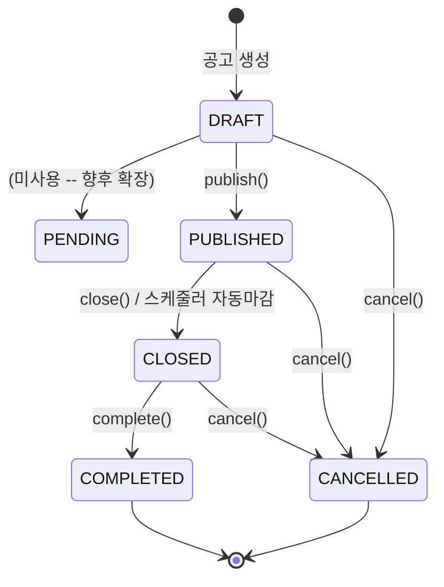
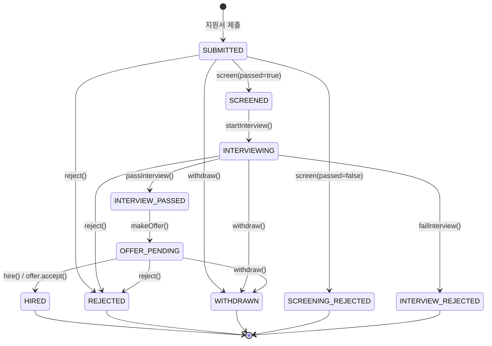
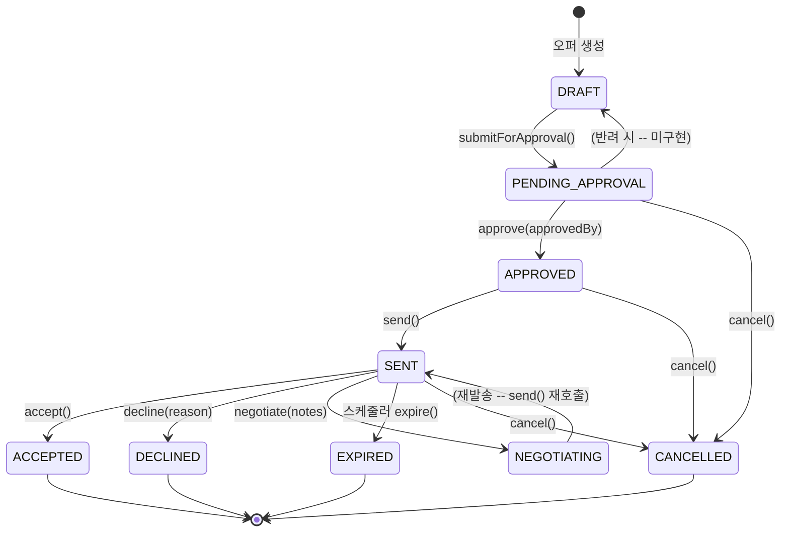
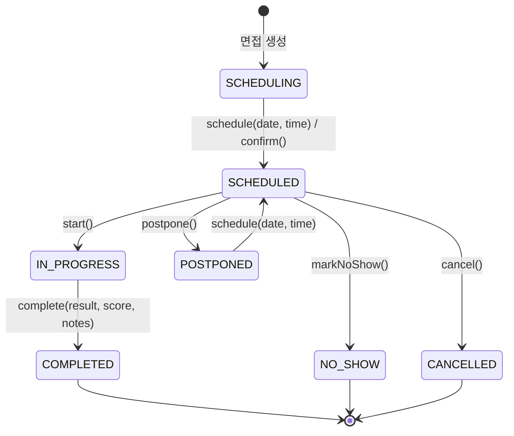
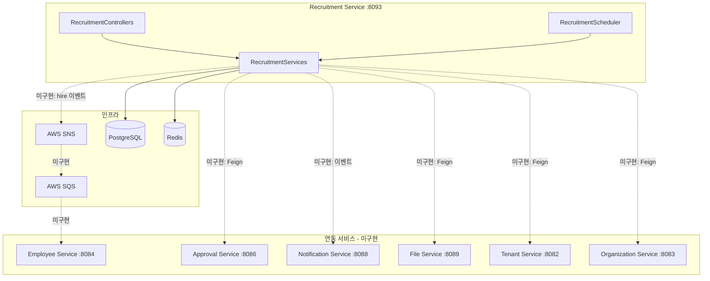
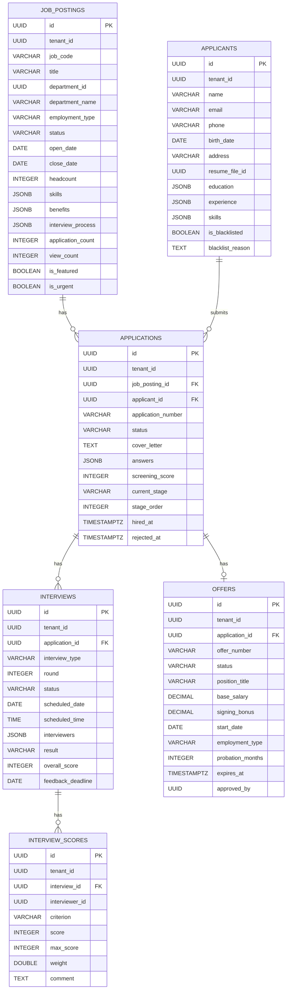

# Module 10: Recruitment Service --- PRD 및 프로덕션 정책 분석

> **최종 업데이트**: 2026-02-10
> **분석 범위**: `services/recruitment-service/`, `common/` 모듈
> **문서 버전**: v2.0 (Phase A/B/C 확장)
> **포트**: 8093
> **패키지**: `com.hrsaas.recruitment`
> **DB 스키마**: `hr_recruitment`

---

## 목차

1. [현재 구현 상태 요약](#1-현재-구현-상태-요약)
2. [정책 결정사항](#2-정책-결정사항)
3. [기능 요구사항 Gap 분석 (Phase A)](#3-기능-요구사항-gap-분석-phase-a)
4. [비즈니스 규칙 상세 (Phase B)](#4-비즈니스-규칙-상세-phase-b)
5. [서비스 연동 명세 (Phase C)](#5-서비스-연동-명세-phase-c)
6. [데이터 모델](#6-데이터-모델)
7. [API 명세](#7-api-명세)
8. [보안](#8-보안)
9. [성능](#9-성능)
10. [추적성 매트릭스](#10-추적성-매트릭스)
11. [변경 이력](#11-변경-이력)

---

## 1. 현재 구현 상태 요약

### 1.1 완료된 기능

| 기능 | 상태 | 주요 클래스 | 설명 |
|------|------|-------------|------|
| 채용공고 CRUD | ✅ 완료 | `JobPostingController`, `JobPostingServiceImpl` | 생성/수정/삭제, 상태 전이(DRAFT->PUBLISHED->CLOSED->COMPLETED) |
| 공고 검색/필터 | ✅ 완료 | `JobPostingRepository.searchByKeyword()` | 키워드 검색(제목/부서명), 상태/부서/담당자별 필터, 페이지네이션 |
| 공개 공고 API | ✅ 완료 | `JobPostingController` (`/public/active`, `/public/search`) | 비인증 사용자도 활성 공고 조회/검색 가능 |
| 공고 요약 집계 | ✅ 완료 | `JobPostingController.getSummary()` | `GET /api/v1/jobs/summary` -- 상태별 공고 수 집계 |
| 공고별 단계 집계 | ✅ 완료 | `JobPostingController.getApplicationStages()` | `GET /api/v1/jobs/{id}/applications/stages` -- 단계별 지원서 분포 |
| 지원자(Applicant) CRUD | ✅ 완료 | `ApplicantController`, `ApplicantServiceImpl` | 이메일 유니크, 개인정보 마스킹(이름/이메일/전화/주소) |
| 지원서(Application) 제출 | ✅ 완료 | `ApplicationController`, `ApplicationServiceImpl` | 중복 지원 방지, 블랙리스트 차단, 지원번호 자동채번 |
| 지원서 요약 집계 | ✅ 완료 | `ApplicationController.getSummary()` | `GET /api/v1/applications/summary` -- GROUP BY 최적화 적용 |
| 서류심사(Screening) | ✅ 완료 | `ApplicationServiceImpl.screen()` | 합격/불합격 처리, 점수(0-100) + 심사코멘트 |
| 면접(Interview) CRUD | ✅ 완료 | `InterviewController`, `InterviewServiceImpl` | 면접 생성/일정/시작/완료/취소/연기/노쇼/확인 상태관리 |
| 면접 요약 집계 | ✅ 완료 | `InterviewController.getSummary()` | `GET /api/v1/interviews/summary` -- GROUP BY 최적화 적용 |
| 내 면접 목록 | ✅ 완료 | `InterviewController.getMyInterviews()` | `GET /api/v1/interviews/my` -- JSONB jsonpath 쿼리로 면접관별 조회 |
| 내 평가 조회 | ✅ 완료 | `InterviewController.getMyScores()` | `GET /api/v1/interviews/{id}/scores/my` -- 면접관 본인 평가 |
| 면접 평가(InterviewScore) | ✅ 완료 | `InterviewServiceImpl.addScore()` | 면접관별 항목별 평가, 가중치 적용, 평균점수 산출 |
| 오퍼(Offer) 관리 | ✅ 완료 | `OfferController`, `OfferServiceImpl` | 오퍼 생성/승인/발송/수락/거절/협상/만료/취소 + 통합 응답 API |
| 오퍼 요약 집계 | ✅ 완료 | `OfferController.getSummary()` | `GET /api/v1/offers/summary` -- 상태별 집계 |
| 오퍼 통합 응답 | ✅ 완료 | `OfferController.respond()` | `POST /public/{id}/respond` -- ACCEPT/DECLINE 통합 |
| 채용 통계 DTO | ✅ 완료 | `RecruitmentStatisticsResponse` | 공고/지원/면접/오퍼 집계 + 전환율 + 소스/부서별 통계 (엔드포인트 미연결) |
| 공고 자동 마감 | ✅ 완료 | `RecruitmentScheduler.closeExpiredJobPostings()` | 매일 00:05 마감일 경과 공고 CLOSED 처리 |
| 오퍼 만료 처리 | ✅ 완료 | `RecruitmentScheduler.checkExpiredOffers()` | 매일 01:00 SENT 상태 오퍼 만료 확인 |
| RLS | ✅ 완료 | `V1__init.sql` | 전 테이블(6개) tenant_id 기반 Row Level Security |
| 개인정보 마스킹 | ✅ 완료 | `ApplicantResponse` | `@Masked` + `MaskedFieldSerializer` (NAME, EMAIL, PHONE, ADDRESS) |
| Redis 캐시 | ✅ 완료 | `JobPostingServiceImpl` | `@Cacheable("jobPosting")`, `@Cacheable("jobPostings")`, 변경 시 `@CacheEvict` |
| JSONB 컬럼 | ✅ 완료 | 각 Entity | skills, education, experience, interviewers, benefits, interviewProcess 등 |
| 공고 조회수 | ✅ 완료 | `JobPostingServiceImpl.incrementViewCount()` | 상세 조회 시 viewCount 자동 증가 |
| SecurityFilter 이중 등록 방지 | ✅ 완료 | `SecurityConfig` | `FilterRegistrationBean.setEnabled(false)` 적용 |
| 성능 인덱스 | ✅ 완료 | `V2__add_performance_indexes.sql` | skills GIN, application/interview status 인덱스 |

### 1.2 미구현 / 갭

| 갭 ID | 기능 | 우선순위 | 설명 |
|--------|------|----------|------|
| REC-G01 | 공고별 채용 단계 커스텀 | HIGH | interviewProcess JSONB 존재하나 실제 단계 검증/제어 없음 -> **정책결정: 공고별 커스텀** (S2.1) |
| REC-G02 | 면접유형별 평가항목 | HIGH | criterion 자유 문자열 -> **정책결정: 유형별 고정 세트** (S2.2) |
| REC-G03 | 입사 전환 자동화 | HIGH | hire() 호출 시 Employee Service 연동 없음 -> **정책결정: 이벤트 기반 자동 생성** (S2.3) |
| REC-G04 | 개인정보 자동 파기 | HIGH | 보존 기간 관리/자동 삭제 없음 -> **정책결정: 1년 후 자동삭제** (S2.4) |
| REC-G05 | Approval Service 연동 | HIGH | 오퍼 승인이 자체 상태변경만 -> **정책결정: Approval 엔진 연동** (S2.5) |
| REC-G06 | 그룹 공유 블랙리스트 | MEDIUM | 테넌트 단위 블랙리스트 -> **정책결정: 그룹(계열사) 간 공유** (S2.6) |
| REC-G07 | 외부 채널 연동 API | MEDIUM | 외부 채용사이트 게시 API 없음 -> **정책결정: 향후 확장 고려 설계** (S2.7) |
| REC-G08 | 면접 리마인더 | MEDIUM | `sendInterviewReminders()` TODO 스텁 -- 구현 필요 |
| REC-G09 | 피드백 리마인더 | MEDIUM | `sendFeedbackReminders()` TODO 스텁 -- 구현 필요 |
| REC-G10 | 합격기준 자동판정 | LOW | 면접 점수 기반 자동 합격/불합격 판정 없음 (수동 처리만) |
| REC-G11 | ddl-auto: update | HIGH | 프로덕션 위험 -- Flyway 사용 중인데 ddl-auto가 update (S9.2) |
| REC-G12 | 통합 통계 엔드포인트 | MEDIUM | `RecruitmentStatisticsResponse` DTO는 존재하나 컨트롤러 엔드포인트 미연결 |
| REC-G13 | 지원번호/오퍼번호 동시성 | MEDIUM | `AtomicLong` 기반 채번 -- JVM 재시작 시 리셋, 멀티 인스턴스 충돌 가능 |
| REC-G14 | Feign Client 미구현 | HIGH | `@EnableFeignClients` 선언만, 실제 Client 인터페이스 0개 |
| REC-G15 | 도메인 이벤트 미구현 | HIGH | `common-event` 의존성만, 실제 이벤트 발행/수신 클래스 0개 |
| REC-G16 | 테스트 코드 부재 | HIGH | `src/test/` 디렉토리 내 테스트 파일 0개 |
| REC-G17 | 공고 상태 전이 검증 부재 | MEDIUM | `publish()`, `close()`, `complete()`, `cancel()` 메서드에 현재 상태 검증 없음 |

---

## 2. 정책 결정사항

### 2.1 채용 프로세스 단계 커스텀 -- 결정완료

> **결정: 공고(JobPosting)별 커스텀 단계**

- JobPosting의 `interviewProcess` (JSONB `List<Map<String, Object>>`)를 **공식 채용 단계 정의**로 활용
- 구조:
  ```json
  [
    {"order": 1, "stage": "DOCUMENT", "name": "서류심사", "required": true},
    {"order": 2, "stage": "FIRST_INTERVIEW", "name": "1차 기술면접", "required": true},
    {"order": 3, "stage": "SECOND_INTERVIEW", "name": "2차 임원면접", "required": false},
    {"order": 4, "stage": "OFFER", "name": "오퍼", "required": true}
  ]
  ```
- Application의 `currentStage`와 `stageOrder`가 이 프로세스 정의를 참조
- `moveToNextStage()` 시 정의된 순서대로만 진행 가능하도록 검증 추가 필요
- **현재 상태**: `moveToNextStage(stageName, order)` 파라미터를 그대로 수용 -- 검증 없음
- **기본 템플릿**: 공고 생성 시 기본 5단계 프로세스 자동 세팅 (편의)

### 2.2 면접유형별 고정 평가항목 -- 결정완료

> **결정: 면접 유형(InterviewType)별 고정 평가항목 세트**

| 면접 유형 | 평가항목 | 배점 | 가중치 |
|-----------|---------|------|--------|
| TECHNICAL | 기술 지식, 문제 해결력, 코딩 능력, 시스템 설계, 학습 능력 | 각 10점 | 균등 |
| PERSONALITY | 소통 능력, 조직 적합도, 리더십, 동기/열정, 협업 능력 | 각 10점 | 균등 |
| FINAL_ROUND | 전략적 사고, 비전 적합도, 리더십, 조직 적합도, 종합 평가 | 각 10점 | 균등 |
| PHONE / VIDEO | 소통 능력, 기술 기본기, 관심도/열정, 경력 적합성, 종합 | 각 10점 | 균등 |
| PRESENTATION | 프레젠테이션 능력, 내용 충실도, Q&A 대응, 논리성, 종합 | 각 10점 | 균등 |
| GROUP | 토론 참여도, 리더십, 경청/협력, 논리적 표현, 종합 | 각 10점 | 균등 |

- **현재 상태**: `InterviewScore.maxScore` 기본값 5, `criterion`은 자유 문자열
- **변경 필요**: `maxScore` 기본값 5 -> 10, criterion 검증 로직 추가

### 2.3 입사 전환 자동화 -- 결정완료

> **결정: HIRED 상태 변경 시 이벤트 발행 -> Employee Service 자동 생성**

- `ApplicationServiceImpl.hire()` 실행 시 + `OfferServiceImpl.accept()` 실행 시 -> `RecruitmentHiredEvent` 발행
- 이벤트 페이로드:
  ```json
  {
    "eventType": "recruitment.hired",
    "applicationId": "...",
    "applicantName": "...",
    "applicantEmail": "...",
    "applicantPhone": "...",
    "departmentId": "...",
    "positionTitle": "...",
    "gradeCode": "...",
    "startDate": "2026-04-01",
    "employmentType": "FULL_TIME",
    "baseSalary": 55000000,
    "tenantId": "..."
  }
  ```
- **현재 상태**: `hire()` 메서드는 상태 변경만 수행, 이벤트 발행 없음
- **필요 사항**: `client/` 패키지에 Feign Client 또는 `domain/event/` 패키지에 이벤트 클래스 추가

### 2.4 개인정보 자동 파기 -- 결정완료

> **결정: 불합격/미채용 지원자 개인정보 1년 후 자동 익명화**

- 대상: Application 상태가 REJECTED, SCREENING_REJECTED, INTERVIEW_REJECTED, WITHDRAWN인 건
- 기준일: `rejectedAt` 또는 `withdrawnAt` + 365일
- 파기 범위:
  - Applicant: name, email, phone, birthDate, address -> 익명화 (`***` 처리)
  - Applicant: resumeFileId -> File Service에 삭제 요청, 필드 null 처리
  - Applicant: education, experience, certificates, languages -> 빈 배열
  - Application: coverLetter, answers -> null 처리
  - InterviewScore: comment -> null 처리
- 파기 방식: **익명화** (레코드 유지, 통계 보존) -- 물리 삭제 아님
- 스케줄러: 매일 02:00 실행, 대상자 일괄 익명화
- **현재 상태**: 스케줄러/익명화 로직 전무

### 2.5 Approval Service 연동 (오퍼 결재) -- 결정완료

> **결정: Approval Service 결재 엔진과 연동**

- 오퍼 `submitForApproval()` 호출 시:
  1. Offer 상태를 PENDING_APPROVAL로 변경
  2. Approval Service에 결재 요청 생성 (Feign Client 또는 이벤트)
  3. 결재 완료 이벤트 수신 시 Offer 상태를 APPROVED로 변경
- 결재 라인 기준: 오퍼 연봉(baseSalary) 기준 결재 라인 자동 결정
- **현재 상태**: `Offer.submitForApproval()`은 상태 변경만, `Offer.approve()`는 직접 호출 -- Approval Service 미연동

### 2.6 그룹 공유 블랙리스트 -- 결정완료

> **결정: 그룹(계열사) 간 블랙리스트 공유**

- 현재: `Applicant.blacklisted` + `blacklistReason` 필드 (테넌트 단위)
- 향후: 별도 `blacklist_entries` 테이블 분리, 그룹 ID 기반 조회
- Tenant Service 연동: group_id 조회를 위한 Feign Client

### 2.7 외부 채널 연동 설계 -- 결정완료

> **결정: Phase 2 향후 확장, 현재는 API 인터페이스만 설계**

- 현재 구현: 내부 공개 공고 API만 (`/public/active`, `/public/search`)
- Phase 2 구현 시: 어댑터 패턴으로 채널별 구현체 추가

---

## 3. 기능 요구사항 Gap 분석 (Phase A)

### 3.1 PRD 요구사항 vs 구현 매핑

PRD에서 채용 관리는 Phase 2 범위로 "채용공고, 합격자 관리"로 명시. 상세 FR은 PRD에 미정의 (Phase 2 상세 요구사항 미작성). 실제 구현은 PRD 범위를 크게 초과하여 풍부한 기능 제공.

| PRD 요구사항 | 구현 상태 | 구현 클래스 |
|-------------|----------|-------------|
| 채용공고 관리 | ✅ 구현 | `JobPostingController` (16 endpoints) |
| 합격자 관리 | ✅ 구현 | `ApplicationController.hire()`, `OfferController.accept()` |
| (확장) 지원자 관리 | ✅ 구현 | `ApplicantController` (10 endpoints) |
| (확장) 면접 관리 | ✅ 구현 | `InterviewController` (20 endpoints) |
| (확장) 오퍼 관리 | ✅ 구현 | `OfferController` (15 endpoints) |
| (확장) 평가 관리 | ✅ 구현 | `InterviewController` (score endpoints) |
| (확장) 통계/집계 | ✅ 부분 | Summary endpoints 구현, 통합 통계 미연결 |

### 3.2 리버스 엔지니어링: 구현 기능 전체 맵

```
recruitment-service/
 controller/          (5 controllers, 55+ endpoints)
   JobPostingController     -- 16 endpoints
   ApplicationController    -- 13 endpoints
   InterviewController      -- 20 endpoints
   OfferController          -- 15 endpoints
   ApplicantController      -- 10 endpoints
 service/             (5 services + 5 implementations)
   JobPostingService        -- 15 methods
   ApplicationService       -- 13 methods
   InterviewService         -- 17 methods
   OfferService             -- 14 methods
   ApplicantService         -- 10 methods
 repository/          (6 repositories)
   JobPostingRepository     -- 12 queries
   ApplicationRepository    -- 13 queries
   InterviewRepository      -- 12 queries
   InterviewScoreRepository -- 8 queries
   OfferRepository          -- 9 queries
   ApplicantRepository      -- 7 queries
 domain/entity/       (6 entities, 6 enums)
 domain/dto/request/  (10 request DTOs)
 domain/dto/response/ (10 response DTOs)
 scheduler/           (1 scheduler, 4 jobs)
 config/              (1 SecurityConfig)
 client/              (없음 -- Feign Client 미구현)
```

### 3.3 Gap 상세 분석

#### GAP-A01: Feign Client / 이벤트 인프라 부재

- **현상**: `@EnableFeignClients` 선언되어 있으나 `client/` 패키지 없음. `common-event` 의존성 있으나 `domain/event/` 패키지 없음
- **영향**: Employee Service, Approval Service, Notification Service, File Service, Tenant Service 연동 불가
- **필요 클래스**:
  - `client/EmployeeServiceClient.java` -- 입사 전환 시
  - `client/ApprovalServiceClient.java` -- 오퍼 결재 연동
  - `client/NotificationServiceClient.java` -- 리마인더 발송
  - `client/FileServiceClient.java` -- 이력서 삭제
  - `client/TenantServiceClient.java` -- 그룹 ID 조회 (블랙리스트)
  - `domain/event/RecruitmentHiredEvent.java`
  - `domain/event/RecruitmentEventPublisher.java`

#### GAP-A02: 통합 통계 엔드포인트 미연결

- **현상**: `RecruitmentStatisticsResponse` DTO (전환율, 소스별, 부서별 통계 포함)가 존재하나 이를 반환하는 컨트롤러 엔드포인트 없음
- **개별 Summary**는 구현됨: `JobPostingSummaryResponse`, `ApplicationSummaryResponse`, `InterviewSummaryResponse`, `OfferSummaryResponse`
- **필요**: 통합 대시보드용 `/api/v1/recruitment/statistics` 엔드포인트

#### GAP-A03: 상태 전이 검증 부재

- **현상**: `JobPosting.publish()`, `close()`, `complete()`, `cancel()` 메서드에 현재 상태 검증 없음
  - 예: COMPLETED 상태에서 `publish()` 호출 가능 (무방비)
  - 예: CANCELLED 상태에서 `close()` 호출 가능
- **Application**: `screen()` 만 `SUBMITTED` 상태 검증, `reject()`, `withdraw()`, `hire()` 등은 상태 무검증
- **Offer**: `send()` 만 `APPROVED` 상태 검증, 나머지 전이 메서드는 무검증
- **Interview**: 상태 전이 메서드 전부 무검증

#### GAP-A04: JPA Entity-Table 매핑 불일치

| Entity `@Table(name=)` | Flyway DDL 테이블명 | 상태 |
|-------------------------|---------------------|------|
| `job_posting` | `job_postings` | **불일치** (ddl-auto=update가 보정 중) |
| `applicant` | `applicants` | **불일치** |
| `application` | `applications` | **불일치** |
| `interview` | `interviews` | **불일치** |
| `interview_score` | `interview_scores` | **불일치** |
| `offer` | `offers` | **불일치** |

- **원인**: Entity는 단수(`@Table(name="job_posting")`), Flyway는 복수(`job_postings`)
- **현재 동작**: `ddl-auto: update`가 단수 테이블을 자동 생성하여 Flyway 테이블과 별도 공존
- **ddl-auto를 validate로 변경하면 즉시 에러 발생** -- Entity `@Table.name` 수정 또는 Flyway 마이그레이션 수정 필요

#### GAP-A05: 로드맵 우선순위

| 우선순위 | 항목 | 영향도 |
|----------|------|--------|
| P0 (즉시) | Entity-Table 매핑 수정 + ddl-auto -> validate | 프로덕션 DDL 변경 위험 |
| P0 (즉시) | 상태 전이 검증 추가 | 데이터 무결성 |
| P1 (Sprint 1) | Feign Client + Event 인프라 구축 | 서비스 연동 기반 |
| P1 (Sprint 1) | 지원번호/오퍼번호 DB 시퀀스 전환 | 동시성 안전 |
| P2 (Sprint 2) | Approval Service 오퍼 결재 연동 | 비즈니스 프로세스 |
| P2 (Sprint 2) | Employee Service 입사 전환 이벤트 | 비즈니스 프로세스 |
| P2 (Sprint 2) | 개인정보 자동 파기 스케줄러 | 법적 컴플라이언스 |
| P3 (Sprint 3) | 면접유형별 평가항목 제어 | 비즈니스 정합성 |
| P3 (Sprint 3) | 그룹 공유 블랙리스트 | 그룹사 요구사항 |
| P3 (Sprint 3) | 면접/피드백 리마인더 | UX 개선 |
| P4 (향후) | 합격기준 자동판정 | 자동화 |
| P4 (향후) | 외부 채널 연동 | 확장성 |

---

## 4. 비즈니스 규칙 상세 (Phase B)

### 4.1 채용공고 상태 머신 (JobStatus)

**enum 위치**: `domain/entity/JobStatus.java`
**값**: `DRAFT`, `PENDING`, `PUBLISHED`, `CLOSED`, `CANCELLED`, `COMPLETED`



**검증 규칙 (현재 미구현, 추가 필요)**:
- `publish()`: DRAFT 또는 PENDING 상태에서만 허용
- `close()`: PUBLISHED 상태에서만 허용
- `complete()`: CLOSED 상태에서만 허용
- `cancel()`: DRAFT, PUBLISHED, CLOSED 상태에서만 허용 (COMPLETED, CANCELLED에서 불가)

**관련 코드**:
- Entity: `JobPosting.publish()`, `close()`, `complete()`, `cancel()` -- `domain/entity/JobPosting.java`
- Service: `JobPostingServiceImpl.publish()`, `close()`, `complete()` -- `service/impl/JobPostingServiceImpl.java`
- Scheduler: `RecruitmentScheduler.closeExpiredJobPostings()` -- `scheduler/RecruitmentScheduler.java`

**isOpen() 로직**:
```java
// JobPosting.isOpen()
return this.status == JobStatus.PUBLISHED &&
       (this.closeDate == null || !this.closeDate.isBefore(LocalDate.now()));
```

### 4.2 지원서 상태 머신 (ApplicationStatus)

**enum 위치**: `domain/entity/ApplicationStatus.java`
**값**: `SUBMITTED`, `SCREENING`, `SCREENED`, `SCREENING_REJECTED`, `INTERVIEWING`, `INTERVIEW_PASSED`, `INTERVIEW_REJECTED`, `OFFER_PENDING`, `HIRED`, `WITHDRAWN`, `REJECTED`



**상태 전이 트리거**:

| 전이 | 트리거 메서드 | 호출 위치 |
|------|-------------|----------|
| SUBMITTED -> SCREENED | `Application.screen(screenedBy, score, notes, true)` | `ApplicationServiceImpl.screen()` |
| SUBMITTED -> SCREENING_REJECTED | `Application.screen(screenedBy, score, notes, false)` | `ApplicationServiceImpl.screen()` |
| SCREENED -> INTERVIEWING | `Application.startInterview()` | `InterviewServiceImpl.create()` (면접 생성 시 자동) |
| INTERVIEWING -> INTERVIEW_PASSED | `Application.passInterview()` | `InterviewServiceImpl.complete()` (result=PASS) |
| INTERVIEWING -> INTERVIEW_REJECTED | `Application.failInterview()` | `InterviewServiceImpl.complete()` (result=FAIL) |
| INTERVIEW_PASSED -> OFFER_PENDING | `Application.makeOffer()` | `OfferServiceImpl.create()` (오퍼 생성 시 자동) |
| OFFER_PENDING -> HIRED | `Application.hire()` | `ApplicationServiceImpl.hire()` 또는 `OfferServiceImpl.accept()` |
| Any -> REJECTED | `Application.reject(reason)` | `ApplicationServiceImpl.reject()` |
| Any -> WITHDRAWN | `Application.withdraw()` | `ApplicationServiceImpl.withdraw()` |

**검증 규칙 (현재 구현 상태)**:
- `screen()`: ✅ `SUBMITTED` 상태 확인 (유일한 검증)
- `reject()`: 상태 무검증 -- 이미 HIRED인 지원서도 거절 가능 (버그)
- `withdraw()`: 상태 무검증 -- 이미 HIRED인 지원서도 철회 가능 (버그)
- `hire()`: 상태 무검증 -- SUBMITTED 상태에서도 바로 HIRED 가능 (버그)

### 4.3 오퍼 상태 머신 (OfferStatus)

**enum 위치**: `domain/entity/OfferStatus.java`
**값**: `DRAFT`, `PENDING_APPROVAL`, `APPROVED`, `SENT`, `ACCEPTED`, `DECLINED`, `NEGOTIATING`, `EXPIRED`, `CANCELLED`



**검증 규칙**:
- `send()`: ✅ `APPROVED` 상태 확인 (유일한 검증)
- `submitForApproval()`: 상태 무검증
- `approve()`: 상태 무검증
- `accept()`/`decline()`: 상태 무검증

### 4.4 면접 상태 머신 (InterviewStatus)

**enum 위치**: `domain/entity/InterviewStatus.java`
**값**: `SCHEDULING`, `SCHEDULED`, `IN_PROGRESS`, `COMPLETED`, `NO_SHOW`, `CANCELLED`, `POSTPONED`



**면접 완료 시 Application 상태 연동**:
```java
// InterviewServiceImpl.complete() 내부
if ("PASS".equalsIgnoreCase(result)) {
    application.passInterview();  // -> INTERVIEW_PASSED
} else if ("FAIL".equalsIgnoreCase(result)) {
    application.failInterview();  // -> INTERVIEW_REJECTED
}
// "PENDING" 등 다른 값이면 Application 상태 변경 없음
```

### 4.5 채번 규칙 및 계산 로직

#### 지원번호 채번

- **패턴**: `APP-{yyyyMMdd}-{6자리 시퀀스}` (예: `APP-20260210-000001`)
- **구현**: `ApplicationServiceImpl.generateApplicationNumber()` -- `AtomicLong` 기반
- **위험**: JVM 재시작 시 시퀀스 1로 리셋, 날짜 동일하면 충돌 가능. 멀티 인스턴스 배포 시에도 충돌

#### 오퍼번호 채번

- **패턴**: `OFR-{yyyyMMdd}-{6자리 시퀀스}` (예: `OFR-20260210-000001`)
- **구현**: `OfferServiceImpl.generateOfferNumber()` -- `AtomicLong` 기반
- **동일한 위험**

#### 면접 평가 점수 계산

```java
// InterviewScore.getWeightedScore()
(score / maxScore) * weight * 100
// 예: score=8, maxScore=10, weight=1.0 -> 80.0

// InterviewScoreRepository.calculateAverageScore() -- 단순 평균
SELECT AVG(s.score) FROM InterviewScore s WHERE s.interview.id = :interviewId

// InterviewScoreRepository.calculateWeightedAverageScore() -- 가중 평균
SELECT SUM(s.score * s.weight) / SUM(s.weight) FROM InterviewScore s WHERE s.interview.id = :interviewId
```

**참고**: 가중 평균 쿼리(`calculateWeightedAverageScore`)는 Repository에 정의되어 있으나 Service에서 호출하지 않음. `getAverageScore()` 엔드포인트는 단순 평균만 반환.

### 4.6 데이터 생애주기 및 보존 정책

| 데이터 | 보존 기간 | 파기 방식 | 현재 상태 |
|--------|----------|----------|----------|
| 채용공고 (JobPosting) | 영구 | N/A | 삭제 API 존재 (물리 삭제) |
| 합격 지원자 (HIRED) | 직원 전환 후 영구 | N/A | 파기 대상 아님 |
| 불합격/취소 지원자 | 1년 후 익명화 | 개인정보 마스킹, 통계 유지 | **미구현** (REC-G04) |
| 이력서 파일 | 지원자 익명화 시 삭제 | File Service 삭제 요청 | **미구현** |
| 면접 평가 코멘트 | 지원자 익명화 시 null | InterviewScore.comment null 처리 | **미구현** |
| 감사 로그 | 5년 | 자동 아카이빙 | **미구현** |

### 4.7 엣지 케이스

| # | 시나리오 | 현재 동작 | 올바른 동작 |
|---|---------|----------|------------|
| 1 | COMPLETED 공고에 publish() 호출 | 상태가 PUBLISHED로 변경됨 | 예외: 완료된 공고 재게시 불가 |
| 2 | HIRED 지원서에 reject() 호출 | 상태가 REJECTED로 변경됨 | 예외: 채용 확정 건 거절 불가 |
| 3 | DRAFT 오퍼에 accept() 호출 | 상태가 ACCEPTED로 변경됨 | 예외: 발송되지 않은 오퍼 수락 불가 |
| 4 | 동일 지원서에 면접 2개 생성 | 2개 모두 생성, 두 번째에서도 startInterview() 호출 | 동일 라운드 중복 방지 또는 라운드 자동 증가 |
| 5 | 면접 complete(PASS) 후 다시 complete(FAIL) | 재완료됨 | 예외: 이미 완료된 면접 |
| 6 | JVM 재시작 후 동일 날짜에 지원 | APP-20260210-000001 중복 가능 | DB 시퀀스 기반 채번 |
| 7 | NEGOTIATING 오퍼에 send() 호출 | 예외 (APPROVED만 허용) | send()를 NEGOTIATING에서도 허용 |

---

## 5. 서비스 연동 명세 (Phase C)

### 5.1 아키텍처 개요



### 5.2 Feign Client 명세 (계획)

현재 `@EnableFeignClients` 어노테이션만 선언, 실제 Client 인터페이스 0개.

| Client | 대상 서비스 | 주요 메서드 | 용도 |
|--------|-----------|------------|------|
| `ApprovalServiceClient` | approval-service:8086 | `createApprovalRequest()` | 오퍼 결재 요청 |
| `EmployeeServiceClient` | employee-service:8084 | (이벤트 기반 대체 가능) | 입사 전환 확인 |
| `NotificationServiceClient` | notification-service:8088 | `sendNotification()` | 리마인더, 알림 |
| `FileServiceClient` | file-service:8089 | `deleteFile()` | 이력서 파기 |
| `TenantServiceClient` | tenant-service:8082 | `getGroupId()` | 블랙리스트 그룹 조회 |
| `OrganizationServiceClient` | organization-service:8083 | `getDepartment()` | 부서 정보 동적 조회 |

### 5.3 이벤트 명세 (계획)

| 이벤트 | 토픽 | 발행 시점 | 소비자 | 페이로드 |
|--------|------|----------|--------|---------|
| `RecruitmentHiredEvent` | `hr-saas-recruitment-hired` | `hire()` 또는 `accept()` | Employee Service | applicationId, applicantName, email, departmentId, startDate, baseSalary |
| `OfferApprovalRequestEvent` | `hr-saas-recruitment-offer-approval` | `submitForApproval()` | Approval Service | offerId, positionTitle, baseSalary, templateCode |
| `ApprovalCompletedEvent` | `hr-saas-approval-completed` | Approval Service | Recruitment Service | referenceId, referenceType, result, reason |
| `InterviewReminderEvent` | `hr-saas-recruitment-interview-reminder` | 스케줄러 08:00 | Notification Service | interviewId, interviewers, scheduledDate |
| `FeedbackReminderEvent` | `hr-saas-recruitment-feedback-reminder` | 스케줄러 09:00 | Notification Service | interviewId, interviewers, feedbackDeadline |
| `PrivacyPurgeEvent` | `hr-saas-recruitment-privacy-purge` | 스케줄러 02:00 | File Service | resumeFileIds (삭제 대상) |

### 5.4 현재 구현된 연동

**없음**. 모든 서비스 연동은 미구현 상태. 현재 recruitment-service는 완전히 독립적으로 동작.

### 5.5 데이터 동기화 전략

| 데이터 | 소스 | 동기화 방식 | 현재 상태 |
|--------|------|-----------|----------|
| 부서 정보 | Organization Service | Feign 실시간 또는 캐시 | `departmentName` 문자열로 직접 저장 (비정규화) |
| 직원 정보 (면접관) | Employee Service | JSONB 비정규화 | `interviewers` JSONB에 id/name 저장 |
| 직급 코드 | MDM Service | Feign 실시간 | `gradeCode/gradeName` 문자열로 직접 저장 |
| 이력서 파일 | File Service | `resumeFileId` UUID 참조 | 파일 존재 여부 미검증 |

---

## 6. 데이터 모델

### 6.1 ER 다이어그램



### 6.2 테이블 상세 (Entity-Table 매핑 불일치 주의)

| Entity `@Table(name=)` | Flyway DDL 테이블명 | 매핑 상태 |
|-------------------------|---------------------|----------|
| `job_posting` | `job_postings` | **불일치** -- ddl-auto=update가 보정 중 |
| `applicant` | `applicants` | **불일치** |
| `application` | `applications` | **불일치** |
| `interview` | `interviews` | **불일치** |
| `interview_score` | `interview_scores` | **불일치** |
| `offer` | `offers` | **불일치** |

ddl-auto를 validate로 변경하기 전에 Entity `@Table.name`을 복수형으로 수정하거나, Flyway 마이그레이션에서 단수형 테이블을 생성하도록 수정해야 함.

### 6.3 인덱스 전략

**V1__init.sql 인덱스** (35개):

| 테이블 | 주요 인덱스 | 유형 |
|--------|------------|------|
| job_postings | `idx_job_postings_status` (tenant_id, status) | B-Tree |
| job_postings | `idx_job_postings_is_featured` WHERE is_featured = TRUE | Partial |
| job_postings | `idx_job_postings_is_urgent` WHERE is_urgent = TRUE | Partial |
| applicants | `idx_applicants_email` (tenant_id, email) | B-Tree |
| applicants | `idx_applicants_is_blacklisted` WHERE is_blacklisted = TRUE | Partial |
| applications | `idx_applications_status` (tenant_id, status) | B-Tree |
| interviews | `idx_interviews_scheduled_date` (tenant_id, scheduled_date) | B-Tree |
| offers | `idx_offers_expires_at` WHERE status = 'SENT' | Partial |

**V2__add_performance_indexes.sql** (3개):

| 인덱스 | 대상 | 목적 |
|--------|------|------|
| `idx_applicants_skills_gin` | applicant.skills | GIN -- JSONB `@>` 연산자 최적화 |
| `idx_application_status` | application.status | getSummary GROUP BY 최적화 |
| `idx_interview_status` | interview.status | getSummary GROUP BY 최적화 |

### 6.4 RLS 정책

6개 테이블 전체에 RLS 활성화 (`ENABLE` + `FORCE`):

```sql
-- 패턴: get_current_tenant_safe() IS NULL이면 전체 접근 (관리자/마이그레이션)
CREATE POLICY tenant_isolation_{table} ON hr_recruitment.{table}
    FOR ALL
    USING (
        hr_recruitment.get_current_tenant_safe() IS NULL
        OR tenant_id = hr_recruitment.get_current_tenant_safe()
    );
```

---

## 7. API 명세

### 7.1 JobPosting API (16 endpoints)

| Method | URL | 인증 | 권한 | 설명 |
|--------|-----|------|------|------|
| `POST` | `/api/v1/jobs` | JWT | HR_ADMIN+ | 채용공고 생성 |
| `GET` | `/api/v1/jobs/{id}` | JWT | isAuthenticated | 상세 조회 (viewCount++) |
| `GET` | `/api/v1/jobs/code/{jobCode}` | JWT | isAuthenticated | 코드로 조회 |
| `GET` | `/api/v1/jobs` | JWT | isAuthenticated | 전체 목록 (페이지네이션) |
| `GET` | `/api/v1/jobs/status/{status}` | JWT | isAuthenticated | 상태별 목록 |
| `GET` | `/api/v1/jobs/public/active` | 없음 | permitAll | 공개 활성 공고 |
| `GET` | `/api/v1/jobs/public/search?keyword=` | 없음 | permitAll | 공개 검색 |
| `GET` | `/api/v1/jobs/department/{departmentId}` | JWT | isAuthenticated | 부서별 목록 |
| `GET` | `/api/v1/jobs/recruiter/{recruiterId}` | JWT | isAuthenticated | 담당자별 목록 |
| `GET` | `/api/v1/jobs/summary` | JWT | isAuthenticated | 상태별 집계 |
| `GET` | `/api/v1/jobs/{id}/applications/stages` | JWT | isAuthenticated | 단계별 지원서 분포 |
| `PUT` | `/api/v1/jobs/{id}` | JWT | HR_ADMIN+ | 수정 |
| `DELETE` | `/api/v1/jobs/{id}` | JWT | HR_ADMIN+ | 삭제 |
| `POST` | `/api/v1/jobs/{id}/publish` | JWT | HR_ADMIN+ | 게시 |
| `POST` | `/api/v1/jobs/{id}/close` | JWT | HR_ADMIN+ | 마감 |
| `POST` | `/api/v1/jobs/{id}/complete` | JWT | HR_ADMIN+ | 완료 |

### 7.2 Application API (13 endpoints)

| Method | URL | 인증 | 권한 | 설명 |
|--------|-----|------|------|------|
| `POST` | `/api/v1/applications/public` | 없음 | permitAll | 지원서 제출 |
| `GET` | `/api/v1/applications/{id}` | JWT | isAuthenticated | 상세 조회 |
| `GET` | `/api/v1/applications/number/{applicationNumber}` | JWT | isAuthenticated | 지원번호로 조회 |
| `GET` | `/api/v1/applications/job/{jobPostingId}` | JWT | isAuthenticated | 공고별 목록 |
| `GET` | `/api/v1/applications/applicant/{applicantId}` | JWT | isAuthenticated | 지원자별 목록 |
| `GET` | `/api/v1/applications/status/{status}` | JWT | isAuthenticated | 상태별 목록 |
| `GET` | `/api/v1/applications/stage/{stage}` | JWT | isAuthenticated | 단계별 목록 |
| `GET` | `/api/v1/applications/summary` | JWT | isAuthenticated | 상태별 집계 |
| `POST` | `/api/v1/applications/{id}/screen` | JWT | HR_ADMIN+ | 서류심사 |
| `POST` | `/api/v1/applications/{id}/reject?reason=` | JWT | HR_ADMIN+ | 불합격 |
| `POST` | `/api/v1/applications/{id}/withdraw` | JWT | isAuthenticated | 지원 취소 |
| `POST` | `/api/v1/applications/{id}/hire` | JWT | HR_ADMIN+ | 채용 확정 |
| `POST` | `/api/v1/applications/{id}/next-stage?stageName=&order=` | JWT | HR_ADMIN+ | 다음 단계 이동 |

### 7.3 Interview API (20 endpoints)

| Method | URL | 인증 | 권한 | 설명 |
|--------|-----|------|------|------|
| `POST` | `/api/v1/interviews` | JWT | HR_ADMIN+ | 면접 생성 |
| `GET` | `/api/v1/interviews/{id}` | JWT | isAuthenticated | 상세 조회 |
| `GET` | `/api/v1/interviews/application/{applicationId}` | JWT | isAuthenticated | 지원서별 면접 목록 |
| `GET` | `/api/v1/interviews/status/{status}` | JWT | isAuthenticated | 상태별 목록 |
| `GET` | `/api/v1/interviews/date/{date}` | JWT | isAuthenticated | 날짜별 목록 |
| `GET` | `/api/v1/interviews/today` | JWT | isAuthenticated | 오늘 면접 |
| `GET` | `/api/v1/interviews/summary` | JWT | isAuthenticated | 상태별 집계 |
| `GET` | `/api/v1/interviews/my` | JWT | isAuthenticated | 내 면접 목록 |
| `POST` | `/api/v1/interviews/{id}/confirm` | JWT | HR_ADMIN+ | 면접 일정 확인 |
| `POST` | `/api/v1/interviews/{id}/schedule` | JWT | HR_ADMIN+ | 일정 확정 |
| `POST` | `/api/v1/interviews/{id}/start` | JWT | isAuthenticated | 면접 시작 |
| `POST` | `/api/v1/interviews/{id}/complete` | JWT | isAuthenticated | 면접 완료 |
| `POST` | `/api/v1/interviews/{id}/cancel` | JWT | HR_ADMIN+ | 면접 취소 |
| `POST` | `/api/v1/interviews/{id}/postpone` | JWT | HR_ADMIN+ | 면접 연기 |
| `POST` | `/api/v1/interviews/{id}/no-show` | JWT | HR_ADMIN+ | 불참 처리 |
| `DELETE` | `/api/v1/interviews/{id}` | JWT | HR_ADMIN+ | 면접 삭제 |
| `POST` | `/api/v1/interviews/{interviewId}/scores` | JWT | isAuthenticated | 평가 등록 |
| `GET` | `/api/v1/interviews/{interviewId}/scores` | JWT | isAuthenticated | 평가 목록 |
| `GET` | `/api/v1/interviews/{interviewId}/scores/my` | JWT | isAuthenticated | 내 평가 |
| `GET` | `/api/v1/interviews/{interviewId}/average-score` | JWT | isAuthenticated | 평균 점수 |

### 7.4 Offer API (15 endpoints)

| Method | URL | 인증 | 권한 | 설명 |
|--------|-----|------|------|------|
| `POST` | `/api/v1/offers` | JWT | HR_ADMIN+ | 오퍼 생성 |
| `GET` | `/api/v1/offers/{id}` | JWT | isAuthenticated | 상세 조회 |
| `GET` | `/api/v1/offers/number/{offerNumber}` | JWT | isAuthenticated | 번호로 조회 |
| `GET` | `/api/v1/offers/application/{applicationId}` | JWT | isAuthenticated | 지원서별 오퍼 |
| `GET` | `/api/v1/offers/status/{status}` | JWT | isAuthenticated | 상태별 목록 |
| `GET` | `/api/v1/offers/summary` | JWT | isAuthenticated | 상태별 집계 |
| `GET` | `/api/v1/offers/pending-approval` | JWT | HR_ADMIN+ | 승인 대기 목록 |
| `POST` | `/api/v1/offers/{id}/submit` | JWT | HR_ADMIN+ | 승인 요청 |
| `POST` | `/api/v1/offers/{id}/approve?approvedBy=` | JWT | HR_ADMIN+ | 승인 |
| `POST` | `/api/v1/offers/{id}/send` | JWT | HR_ADMIN+ | 발송 |
| `POST` | `/api/v1/offers/public/{id}/accept` | 없음 | (permitAll 미등록) | 수락 (공개) |
| `POST` | `/api/v1/offers/public/{id}/decline?reason=` | 없음 | (permitAll 미등록) | 거절 (공개) |
| `POST` | `/api/v1/offers/public/{id}/respond` | 없음 | (permitAll 미등록) | 통합 응답 |
| `POST` | `/api/v1/offers/{id}/negotiate?notes=` | JWT | HR_ADMIN+ | 협상 |
| `POST` | `/api/v1/offers/{id}/cancel` | JWT | HR_ADMIN+ | 취소 |

### 7.5 Applicant API (10 endpoints)

| Method | URL | 인증 | 권한 | 설명 |
|--------|-----|------|------|------|
| `POST` | `/api/v1/applicants/public` | 없음 | permitAll | 지원자 등록 |
| `GET` | `/api/v1/applicants/{id}` | JWT | isAuthenticated | 상세 조회 |
| `GET` | `/api/v1/applicants/email/{email}` | JWT | isAuthenticated | 이메일로 조회 |
| `GET` | `/api/v1/applicants` | JWT | isAuthenticated | 전체 목록 |
| `GET` | `/api/v1/applicants/search?keyword=` | JWT | isAuthenticated | 검색 |
| `GET` | `/api/v1/applicants/blacklisted` | JWT | HR_ADMIN+ | 블랙리스트 목록 |
| `PUT` | `/api/v1/applicants/{id}` | JWT | HR_ADMIN+ | 정보 수정 |
| `DELETE` | `/api/v1/applicants/{id}` | JWT | HR_ADMIN+ | 삭제 |
| `POST` | `/api/v1/applicants/{id}/blacklist?reason=` | JWT | HR_ADMIN+ | 블랙리스트 등록 |
| `POST` | `/api/v1/applicants/{id}/unblacklist` | JWT | HR_ADMIN+ | 블랙리스트 해제 |

### 7.6 SecurityConfig permitAll 경로

```java
// SecurityConfig.java -- permitAll 등록 경로
"/actuator/**"
"/v3/api-docs/**", "/swagger-ui/**", "/swagger-ui.html"
"/api/v1/jobs/public/**"
"/api/v1/applications/public/**"
// 주의: "/api/v1/offers/public/**" 미등록 -- 403 발생 가능 (보안 이슈 #1)
// 주의: "/api/v1/applicants/public/**" 미등록 -- 현재는 applicants/public POST만 있어 403 발생
```

---

## 8. 보안

### 8.1 인증/인가

| 항목 | 구현 상태 | 설명 |
|------|----------|------|
| JWT 인증 | ✅ 완료 | `SecurityFilter` + `FilterRegistrationBean` 이중 등록 방지 |
| 역할 기반 인가 | ✅ 완료 | `@PreAuthorize` -- HR_ADMIN, TENANT_ADMIN, SUPER_ADMIN |
| RLS 데이터 격리 | ✅ 완료 | 6개 테이블 전체 tenant_id 기반 |
| 공개 API | ⚠️ 부분 | `/jobs/public/**`, `/applications/public/**` 만 permitAll 등록 |

### 8.2 개인정보 보호

| 항목 | 구현 상태 | 클래스/어노테이션 |
|------|----------|-----------------|
| 이름 마스킹 | ✅ 완료 | `ApplicantResponse.name` -- `@Masked(type = MaskType.NAME)` |
| 이메일 마스킹 | ✅ 완료 | `ApplicantResponse.email` -- `@Masked(type = MaskType.EMAIL)` |
| 전화번호 마스킹 | ✅ 완료 | `ApplicantResponse.phone` -- `@Masked(type = MaskType.PHONE)` |
| 주소 마스킹 | ✅ 완료 | `ApplicantResponse.address` -- `@Masked(type = MaskType.ADDRESS)` |
| 자동 파기 | ❌ 미구현 | 1년 경과 불합격자 익명화 미구현 (REC-G04) |
| 감사 로그 | ❌ 미구현 | 개인정보 조회/변경 이력 미기록 |

### 8.3 보안 이슈 목록

| # | 이슈 | 심각도 | 설명 |
|---|------|--------|------|
| 1 | 오퍼 공개 API 인증 우회 불가 | HIGH | `/api/v1/offers/public/**`가 SecurityConfig permitAll에 미등록 -- 지원자가 오퍼 수락/거절 시 403 |
| 2 | 지원자 공개 등록 API 인증 우회 불가 | HIGH | `/api/v1/applicants/public`가 SecurityConfig permitAll에 미등록 |
| 3 | approve() 권한 검증 부재 | MEDIUM | `approvedBy` 파라미터를 클라이언트가 전달 -- 자기 자신 승인 가능 |
| 4 | 블랙리스트 우회 가능 | MEDIUM | 동일인이 다른 이메일로 재등록 시 차단 불가 |
| 5 | viewCount 조작 | LOW | 상세 조회 시 무조건 증가 -- 봇/크롤러에 의한 조작 가능 |

---

## 9. 성능

### 9.1 캐시 전략

| 캐시명 | 대상 | TTL | Evict 조건 |
|--------|------|-----|-----------|
| `jobPosting` | `getById(id)` | 1시간 (3600000ms) | create/update/delete/publish/close/complete |
| `jobPostings` | `getActivePostings()` | 1시간 | create/update/delete/publish/close/complete |

**참고**: Application, Interview, Offer, Applicant에는 캐시 미적용.

### 9.2 설정값 목록

| 설정 | 현재 값 | 비고 |
|------|---------|------|
| `server.port` | 8093 | |
| `spring.jpa.hibernate.ddl-auto` | **update** | **validate로 변경 필수** (Entity-Table 매핑 수정 선행) |
| `spring.jpa.properties.hibernate.default_schema` | hr_recruitment | |
| `spring.jpa.open-in-view` | false | ✅ |
| `spring.flyway.schemas` | hr_recruitment | |
| `spring.cache.redis.time-to-live` | 3600000 (1시간) | |
| `spring.data.redis.host` | localhost | 환경변수 `REDIS_HOST` 오버라이드 |
| `spring.data.redis.port` | 6381 | 기본 6379와 다름 -- `REDIS_PORT` 오버라이드 |
| `spring.datasource.hikari.maximum-pool-size` | 5 | Low-traffic service |
| `spring.datasource.hikari.leak-detection-threshold` | 60000 | Dev only |
| `jwt.access-token-expiry` | 1800 (30분) | |
| `jwt.refresh-token-expiry` | 604800 (7일) | |
| `management.endpoints.web.exposure.include` | health,info,metrics,prometheus | |
| `spring.cloud.aws.sns.endpoint` | http://localhost:4566 | LocalStack |
| `spring.cloud.aws.sqs.endpoint` | http://localhost:4566 | LocalStack |

### 9.3 필요한 설정 변경/추가

| 설정 | 변경 | 사유 |
|------|------|------|
| `ddl-auto` | update -> **validate** | Flyway와 충돌, 프로덕션 DDL 자동변경 위험 (Entity @Table.name 수정 선행) |
| 개인정보 파기 cron | 추가: `recruitment.privacy.purge-cron=0 0 2 * * ?` | 매일 02:00 |
| 개인정보 보존 기간 | 추가: `recruitment.privacy.retention-days=365` | 1년 |
| 오퍼 만료 기본일 | 추가: `recruitment.offer.default-expiry-days=14` | 기본 14일 |
| 면접 리마인더 | 추가: `recruitment.interview.reminder-hours-before=24` | 24시간 전 |
| 피드백 마감 기본일 | 추가: `recruitment.interview.feedback-deadline-days=3` | 면접 후 3일 |
| 블랙리스트 기본 기간 | 추가: `recruitment.blacklist.default-duration-years=3` | 기본 3년 |

### 9.4 쿼리 최적화

| 최적화 항목 | 구현 상태 | 설명 |
|------------|----------|------|
| Application Summary GROUP BY | ✅ 완료 | `countGroupByStatus()` -- 10개 COUNT -> 1개 GROUP BY |
| Interview Summary GROUP BY | ✅ 완료 | `countGroupByStatus()` -- 8개 COUNT -> 1개 GROUP BY |
| Offer Summary | ❌ 미적용 | 여전히 9개 개별 `countByStatus()` 호출 |
| JobPosting Summary | ❌ 미적용 | 여전히 6개 개별 `countByStatus()` + 1개 `count()` 호출 |
| JSONB GIN 인덱스 | ✅ 완료 | `idx_applicants_skills_gin` -- skills 검색 최적화 |
| 면접관별 면접 조회 | ✅ 구현 | JSONB `jsonb_path_exists` 네이티브 쿼리 -- GIN 인덱스 미적용 |

### 9.5 스케줄러 실행 계획

| 스케줄러 | Cron | 구현 상태 | 설명 |
|----------|------|----------|------|
| `closeExpiredJobPostings()` | `0 5 0 * * ?` (00:05) | ✅ 완료 | PUBLISHED + closeDate < today -> CLOSED |
| `checkExpiredOffers()` | `0 0 1 * * ?` (01:00) | ✅ 완료 | SENT + expiresAt < now -> EXPIRED |
| `sendInterviewReminders()` | `0 0 8 * * ?` (08:00) | ❌ TODO | 오늘 면접 알림 |
| `sendFeedbackReminders()` | `0 0 9 * * ?` (09:00) | ❌ TODO | 피드백 기한 알림 |
| (계획) `purgePrivacyData()` | `0 0 2 * * ?` (02:00) | ❌ 미구현 | 1년 경과 개인정보 익명화 |

---

## 10. 추적성 매트릭스

### 10.1 PRD -> 구현 추적

| PRD 요구사항 | 구현 상태 | 주요 파일 |
|-------------|----------|----------|
| 채용공고 관리 (Phase 2) | ✅ 완료 | `JobPostingController`, `JobPostingServiceImpl`, `JobPosting` |
| 합격자 관리 (Phase 2) | ✅ 완료 | `ApplicationController.hire()`, `OfferController.accept()` |

### 10.2 정책 결정 -> 구현 추적

| 정책 ID | 정책 | 구현 상태 | 잔여 작업 |
|---------|------|----------|----------|
| S2.1 | 공고별 채용 단계 커스텀 | ⚠️ 부분 | `interviewProcess` JSONB 저장만 -- 검증/제어 미구현 |
| S2.2 | 면접유형별 평가항목 | ❌ 미구현 | `InterviewTypeCriteria` 설정 클래스 + 검증 필요 |
| S2.3 | 입사 전환 자동화 | ❌ 미구현 | `RecruitmentHiredEvent` + SNS 발행 필요 |
| S2.4 | 개인정보 자동 파기 | ❌ 미구현 | `PrivacyPurgeScheduler` 신규 생성 필요 |
| S2.5 | Approval 연동 | ❌ 미구현 | `ApprovalServiceClient` Feign 필요 |
| S2.6 | 그룹 공유 블랙리스트 | ❌ 미구현 | `blacklist_entries` 테이블 + 마이그레이션 필요 |
| S2.7 | 외부 채널 연동 | ❌ 미구현 (향후) | 인터페이스 설계만 |

### 10.3 Gap -> 구현 추적

| Gap ID | 설명 | 우선순위 | 상태 |
|--------|------|----------|------|
| REC-G01 | 채용 단계 커스텀 검증 | HIGH | ❌ |
| REC-G02 | 면접유형별 평가항목 | HIGH | ❌ |
| REC-G03 | 입사 전환 이벤트 | HIGH | ❌ |
| REC-G04 | 개인정보 자동 파기 | HIGH | ❌ |
| REC-G05 | Approval 연동 | HIGH | ❌ |
| REC-G06 | 그룹 공유 블랙리스트 | MEDIUM | ❌ |
| REC-G07 | 외부 채널 연동 | MEDIUM | ❌ (향후) |
| REC-G08 | 면접 리마인더 | MEDIUM | ❌ (TODO 스텁) |
| REC-G09 | 피드백 리마인더 | MEDIUM | ❌ (TODO 스텁) |
| REC-G10 | 합격기준 자동판정 | LOW | ❌ |
| REC-G11 | ddl-auto: update | HIGH | ❌ |
| REC-G12 | 통합 통계 엔드포인트 | MEDIUM | ❌ (DTO만 존재) |
| REC-G13 | 지원번호/오퍼번호 동시성 | MEDIUM | ❌ |
| REC-G14 | Feign Client 미구현 | HIGH | ❌ |
| REC-G15 | 도메인 이벤트 미구현 | HIGH | ❌ |
| REC-G16 | 테스트 코드 부재 | HIGH | ❌ |
| REC-G17 | 상태 전이 검증 부재 | MEDIUM | ❌ |

### 10.4 파일 인벤토리

| 경로 (services/recruitment-service/) | 유형 | 설명 |
|------|------|------|
| `src/main/java/.../RecruitmentServiceApplication.java` | Main | `@SpringBootApplication`, `@EnableFeignClients`, `@EnableScheduling` |
| `src/main/java/.../config/SecurityConfig.java` | Config | SecurityFilterChain, FilterRegistrationBean |
| `src/main/java/.../controller/JobPostingController.java` | Controller | 16 endpoints |
| `src/main/java/.../controller/ApplicationController.java` | Controller | 13 endpoints |
| `src/main/java/.../controller/InterviewController.java` | Controller | 20 endpoints |
| `src/main/java/.../controller/OfferController.java` | Controller | 15 endpoints |
| `src/main/java/.../controller/ApplicantController.java` | Controller | 10 endpoints |
| `src/main/java/.../service/JobPostingService.java` | Interface | 15 methods |
| `src/main/java/.../service/impl/JobPostingServiceImpl.java` | Impl | Redis 캐시 적용 |
| `src/main/java/.../service/ApplicationService.java` | Interface | 13 methods |
| `src/main/java/.../service/impl/ApplicationServiceImpl.java` | Impl | AtomicLong 채번, GROUP BY 최적화 |
| `src/main/java/.../service/InterviewService.java` | Interface | 17 methods |
| `src/main/java/.../service/impl/InterviewServiceImpl.java` | Impl | JSONB jsonpath 면접관 조회 |
| `src/main/java/.../service/OfferService.java` | Interface | 14 methods |
| `src/main/java/.../service/impl/OfferServiceImpl.java` | Impl | AtomicLong 채번, 만료 체크 |
| `src/main/java/.../service/ApplicantService.java` | Interface | 10 methods |
| `src/main/java/.../service/impl/ApplicantServiceImpl.java` | Impl | 이메일 유니크 검증 |
| `src/main/java/.../domain/entity/JobPosting.java` | Entity | `@Table(name="job_posting")` |
| `src/main/java/.../domain/entity/Applicant.java` | Entity | `@Table(name="applicant")` |
| `src/main/java/.../domain/entity/Application.java` | Entity | `@Table(name="application")` |
| `src/main/java/.../domain/entity/Interview.java` | Entity | `@Table(name="interview")` |
| `src/main/java/.../domain/entity/InterviewScore.java` | Entity | `@Table(name="interview_score")` |
| `src/main/java/.../domain/entity/Offer.java` | Entity | `@Table(name="offer")` |
| `src/main/java/.../domain/entity/JobStatus.java` | Enum | 6 values: DRAFT, PENDING, PUBLISHED, CLOSED, CANCELLED, COMPLETED |
| `src/main/java/.../domain/entity/ApplicationStatus.java` | Enum | 11 values |
| `src/main/java/.../domain/entity/InterviewType.java` | Enum | 9 types |
| `src/main/java/.../domain/entity/InterviewStatus.java` | Enum | 7 values |
| `src/main/java/.../domain/entity/OfferStatus.java` | Enum | 9 values |
| `src/main/java/.../domain/entity/EmploymentType.java` | Enum | 6 types |
| `src/main/java/.../domain/dto/request/` | DTOs | 10 request DTOs |
| `src/main/java/.../domain/dto/response/` | DTOs | 10 response DTOs |
| `src/main/java/.../repository/` | Repositories | 6 repositories |
| `src/main/java/.../scheduler/RecruitmentScheduler.java` | Scheduler | 4 jobs (2 완료, 2 TODO) |
| `src/main/resources/application.yml` | Config | Port 8093, Redis 6381, ddl-auto: update |
| `src/main/resources/db/migration/V1__init.sql` | Migration | 6 tables, 35 indexes, 6 RLS policies |
| `src/main/resources/db/migration/V2__add_performance_indexes.sql` | Migration | 3 performance indexes |
| `build.gradle` | Build | 9 common modules, OpenFeign, Testcontainers |

---

## 11. 변경 이력

| 버전 | 날짜 | 변경 내용 |
|------|------|----------|
| v1.0 | 2026-02-06 | 초기 분석 문서 작성 |
| v2.0 | 2026-02-10 | Phase A/B/C 확장: 리버스 엔지니어링 완전 재분석, Entity-Table 매핑 불일치 발견(GAP-A04), 상태 전이 검증 부재 분석(GAP-A03), 보안 이슈(오퍼/지원자 공개 API permitAll 누락) 발견, Feign Client/Event 인프라 부재 확인(GAP-A01), Mermaid 상태 다이어그램 4개 추가, ER 다이어그램 추가, API 명세 전체 재정리(74 endpoints), 성능 최적화 현황 분석, 파일 인벤토리 추가, Gap ID 17개로 확장 |
