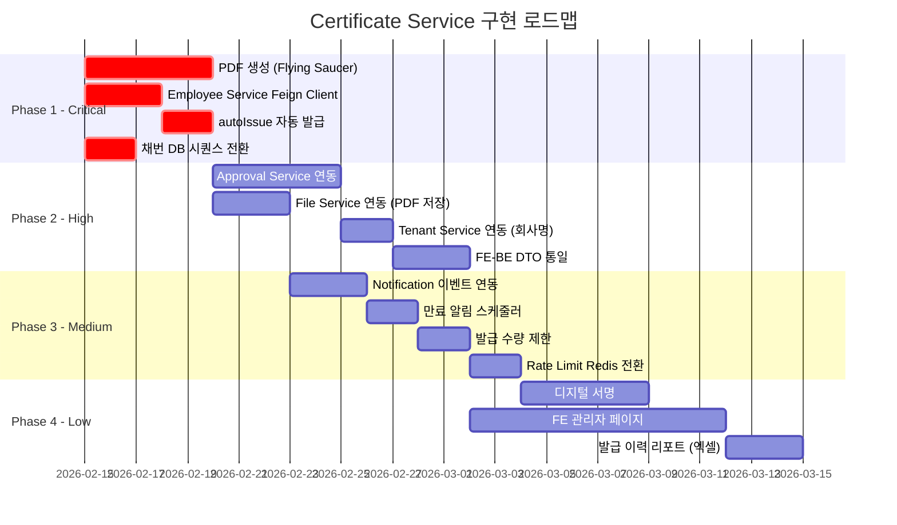
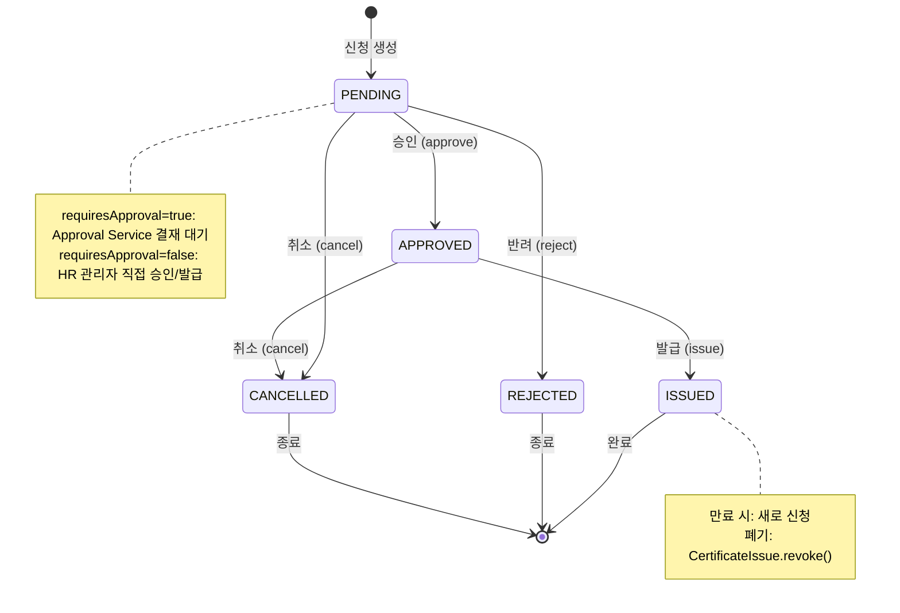
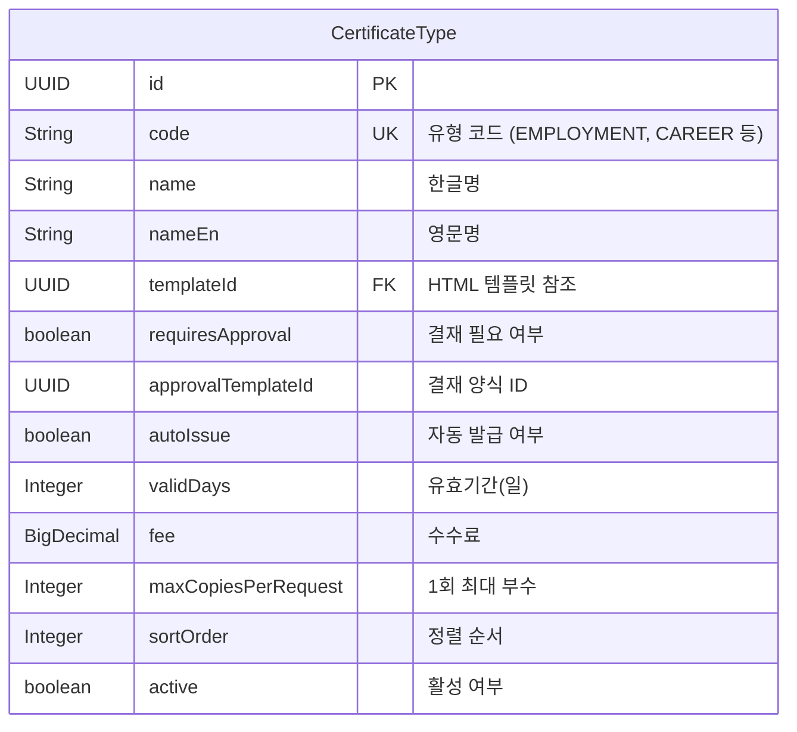
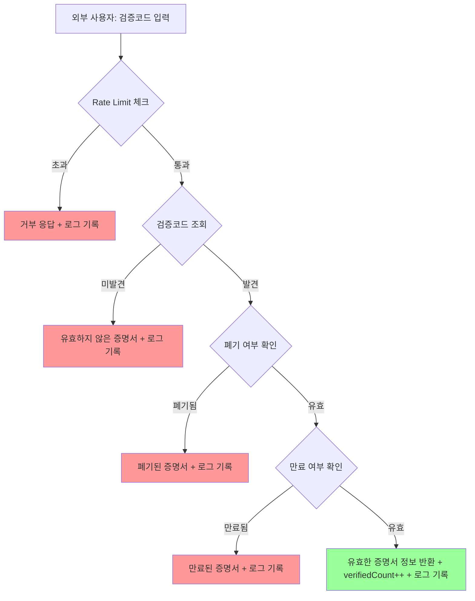
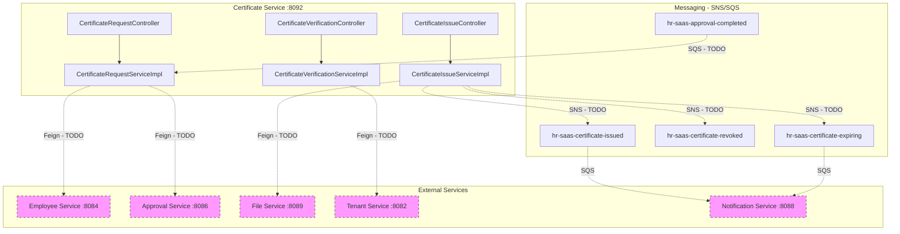

# Module 11: Certificate Service (증명서관리) — PRD 및 프로덕션 정책 분석

> **최종 업데이트**: 2026-02-10
> **분석 범위**: `services/certificate-service/`, `common/` 모듈
> **문서 버전**: v2.0 (Phase A/B/C 확장)
> **포트**: 8092
> **패키지**: `com.hrsaas.certificate`
> **DB 스키마**: `hr_certificate`

---

## 목차

- [1. 현재 구현 상태 요약](#1-현재-구현-상태-요약)
- [2. 정책 결정사항](#2-정책-결정사항)
- [3. 기능 요구사항 Gap 분석 (Phase A)](#3-기능-요구사항-gap-분석-phase-a)
- [4. 비즈니스 규칙 상세 (Phase B)](#4-비즈니스-규칙-상세-phase-b)
- [5. 서비스 연동 명세 (Phase C)](#5-서비스-연동-명세-phase-c)
- [6. 데이터 모델](#6-데이터-모델)
- [7. API 명세](#7-api-명세)
- [8. 보안/프라이버시](#8-보안프라이버시)
- [9. 성능/NFR](#9-성능nfr)
- [10. 추적성 매트릭스](#10-추적성-매트릭스)
- [11. 변경 이력](#11-변경-이력)

---

## 1. 현재 구현 상태 요약

### 1.1 구현 완료

| 기능 | 상태 | 위치 |
|------|------|------|
| 증명서 유형 CRUD | ✅ 완료 | `CertificateTypeController` / `CertificateTypeServiceImpl` |
| 유형 코드 유니크 검증 | ✅ 완료 | `CertificateTypeServiceImpl.create()` — `existsByCode()` |
| 유형 활성화/비활성화 | ✅ 완료 | `activate()` / `deactivate()` + `@CacheEvict` |
| 유형 검색 (이름/영문명) | ✅ 완료 | `CertificateTypeRepository.searchByName()` JPQL LIKE 검색 |
| 증명서 템플릿 CRUD | ✅ 완료 | `CertificateTemplateController` / `CertificateTemplateServiceImpl` |
| 템플릿 이름 유니크 검증 | ✅ 완료 | `CertificateTemplateServiceImpl.create()` — `existsByName()` |
| 템플릿 미리보기 HTML | ✅ 완료 | `generatePreviewHtml()` — CSS+헤더+본문+푸터 조합, `TEXT_HTML` 응답 |
| 증명서 신청 | ✅ 완료 | `CertificateRequestController` / `CertificateRequestServiceImpl` |
| 신청번호 자동채번 | ✅ 완료 | `REQ-{YYYYMMDD}-{000001}` — `AtomicLong` 기반 (재시작 시 리셋 위험) |
| 비활성 유형 신청 차단 | ✅ 완료 | `create()` — `!certificateType.isActive()` 검증 |
| 최대 부수 검증 | ✅ 완료 | `create()` — `copies > maxCopiesPerRequest` 검증 |
| 신청 승인/반려 | ✅ 완료 | `approve()` / `reject()` — PENDING 상태 검증, 자체 처리 |
| 신청 취소 | ✅ 완료 | `cancel()` — ISSUED 상태에서 취소 불가 검증 |
| 내 신청 목록 | ✅ 완료 | `getMyRequests()` — employeeId 기반 조회 |
| 신청 검색 (직원명/사번) | ✅ 완료 | `searchByEmployee()` JPQL LIKE 검색 |
| 증명서 발급 | ✅ 완료 | `CertificateIssueController` / `CertificateIssueServiceImpl` |
| 발급번호 자동채번 | ✅ 완료 | `CERT-{YYYYMMDD}-{000001}` — `AtomicLong` 기반 |
| 검증코드 자동생성 | ✅ 완료 | `XXXX-XXXX-XXXX` (12자리 영숫자, `SecureRandom`) |
| 콘텐츠 스냅샷 | ✅ 완료 | `createContentSnapshot()` — 발급 시점 데이터 JSONB 보존 |
| 발급 상태 검증 | ✅ 완료 | requiresApproval=true -> APPROVED만 발급, false -> PENDING/APPROVED 허용 |
| 만료일 자동계산 | ✅ 완료 | `CertificateType.validDays` 기반, 커스텀 만료일 지원 |
| 증명서 폐기 (Revoke) | ✅ 완료 | `revoke()` — 중복 폐기 방지, 폐기 사유/폐기자/폐기일 기록 |
| 다운로드 카운터 | ✅ 완료 | `markDownloaded()` — `downloadCount++` + `downloadedAt` 갱신 |
| 진위확인 (공개 API) | ✅ 완료 | `CertificateVerificationController` — 인증 불필요 (`permitAll`) |
| IP 기반 Rate Limiting | ✅ 완료 | `CertificateVerificationServiceImpl.isRateLimited()` — IP당 시간당 10회 |
| 검증 로그 | ✅ 완료 | `VerificationLog` — 모든 검증 시도 기록 (성공/실패/IP/UserAgent/기관) |
| 진위확인 결과 분기 | ✅ 완료 | 유효/만료/폐기/미발견 4가지 결과 + failureReason |
| 통계 API | ✅ 완료 | `CertificateStatisticsController` / `CertificateStatisticsServiceImpl` |
| 월별 신청/발급/검증 건수 | ✅ 완료 | `getMonthlyRequestCount()` / `getMonthlyIssueCount()` / `getMonthlyVerificationCount()` |
| 개인정보 마스킹 | ✅ 완료 | `CertificateRequestResponse.employeeName` + `CertificateIssueResponse.employeeName` — `@Masked(type=MaskType.NAME)` |
| RLS (Row Level Security) | ✅ 완료 | 4개 테넌트 테이블 RLS 적용, `verification_logs` 제외 (공개) |
| Redis 캐시 | ✅ 완료 | `certificateType`/`certificateTypes`/`certificateTemplate`/`certificateTemplates` — 변경 시 evict |
| SecurityConfig | ✅ 완료 | `FilterRegistrationBean.setEnabled(false)` — SecurityFilter 이중 등록 방지 |
| `@EnableFeignClients` | ✅ 완료 | `CertificateServiceApplication` — Feign Client 준비 완료 (인터페이스 미구현) |
| ddl-auto: update | ⚠️ 주의 | 프로덕션에서는 `validate`로 변경 필요 |

### 1.2 미구현 / TODO

| 기능 | 상태 | 구현 방향 |
|------|------|-----------|
| PDF 생성 (Flying Saucer) | ❌ TODO 스텁 | `downloadPdf()` — `return new byte[0]` -> 정책 결정 완료 (SS2.1) |
| Approval Service 연동 | ❌ 미구현 | requiresApproval=true 결재 플로우 -> 정책 결정 완료 (SS2.2) |
| Employee Service 연동 | ❌ 미구현 | 직원 정보 자동 조회 (Feign Client 인터페이스 부재) |
| Tenant Service 연동 | ❌ 미구현 | 진위확인 시 회사명 하드코딩 `"회사명"` -> Tenant 조회 필요 |
| File Service 연동 | ❌ 미구현 | PDF 저장/조회 (fileId 컬럼 존재, 실제 연동 없음) |
| Notification Service 연동 | ❌ 미구현 | 발급 완료/만료 임박 알림 이벤트 미발행 |
| 도메인 이벤트 발행 | ❌ 미구현 | SNS/SQS 이벤트 없음 (common-event 의존성은 존재) |
| 결재 이벤트 리스너 | ❌ 미구현 | Approval 완료 이벤트 수신 로직 부재 |
| 자동 발급 (autoIssue) | ❌ 미구현 | autoIssue=true & requiresApproval=false 시 즉시 발급 미구현 |
| 발급 수량 제한 (기간별) | ❌ 미구현 | 직원 1인당 월 최대 발급 제한 (countByEmployeeIdAndDateRange 쿼리 존재) |
| 만료 알림 스케줄러 | ❌ 미구현 | findExpiringSoon() 쿼리 존재, 스케줄러 미구현 |
| 만료 증명서 일괄 처리 | ❌ 미구현 | findExpired() 쿼리 존재, 상태 변경 미구현 |
| FE 관리자 페이지 | ❌ 미구현 | 유형/템플릿 관리, 승인/반려, 발급 이력, 통계 대시보드 |
| FE-BE DTO 불일치 | ⚠️ 알려진 이슈 | certificateTypeCode vs certificateTypeId 등 (SS3.2) |
| 디지털 서명 | ❌ 미구현 | Traceability Matrix에 언급, 구현 부재 |

---

## 2. 정책 결정사항

### 2.1 PDF 생성 방식 -- 결정완료

> **결정: Certificate Service 내에서 Flying Saucer(OpenHTMLtoPDF) + iText7로 직접 생성**

- **의존성 현황**: `build.gradle`에 이미 선언됨
  - `org.xhtmlrenderer:flying-saucer-pdf:9.1.22`
  - `com.itextpdf:itext7-core:7.2.5`
- **생성 프로세스**:
  1. `CertificateIssue.contentSnapshot` (JSONB)에서 데이터 추출
  2. `CertificateTemplate`의 contentHtml에 Thymeleaf 변수 바인딩 (`spring-boot-starter-thymeleaf` 의존성 존재)
  3. `headerHtml` + `contentHtml` + `footerHtml` + `cssStyles` 조합
  4. Flying Saucer로 HTML -> PDF 변환
  5. 직인/서명 이미지 삽입 (`includeCompanySeal`, `includeSignature`)
  6. 생성된 PDF를 File Service에 업로드 -> `CertificateIssue.fileId` 기록
- **페이지 설정**: `pageSize` (A4 기본), `orientation` (PORTRAIT 기본), margins (상하좌우 각 20mm)
- **폰트**: 한글 폰트 번들 포함 (NanumGothic 또는 Noto Sans KR)
- **캐시**: 생성된 PDF의 `fileId` 저장, 재다운로드 시 File Service에서 직접 반환
- **성능**: 대량 발급 시 `@Async` 비동기 처리 고려

### 2.2 Approval Service 연동 -- 결정완료

> **결정: requiresApproval=true인 증명서 유형은 Approval Service 연동**

- **연동 대상**: `CertificateType.requiresApproval = true`인 유형
  - 예: 경력증명서, 급여명세서, 퇴직증명서, 소득금액증명
- **연동 흐름**:
  1. 신청 생성 시 `requiresApproval` 확인
  2. true -> Approval Service에 결재 요청 생성 (Feign Client)
  3. 결재 완료 이벤트 수신 (SQS) -> `CertificateRequest.approve()` 실행
  4. `autoIssue=true`이면 자동 발급, `false`이면 HR 담당자가 수동 발급
  5. 결재 반려 이벤트 수신 -> `CertificateRequest.reject()` 실행
- **결재 양식**:
  ```
  제목: [증명서] {typeName} 발급 신청 - {employeeName}
  본문: 증명서 유형, 부수, 용도, 제출처, 급여포함 여부
  ```
- `autoIssue=true & requiresApproval=false`: 신청 즉시 자동 발급 (재직증명서 등)
- `CertificateType.approvalTemplateId` 활용: 결재 템플릿 지정 가능

### 2.3 만료 후 정책 -- 결정완료

> **결정: 만료 시 새로 신청**

- 만료된 증명서는 재발급 불가 -> 동일 유형으로 새로 신청
- FE: 만료 상태 표시, 다운로드 버튼 비활성화, "새로 신청" 링크 제공
- 만료 임박 알림: `expiresAt` 7일 전 Notification Service를 통해 알림 발송 (향후 구현)

### 2.4 채번 전략 -- 결정완료

> **결정: DB 시퀀스 기반으로 전환 필요**

- **현재 구현**: `AtomicLong` 기반 (서비스 재시작 시 리셋 -> 채번 충돌 위험)
  - `CertificateRequestServiceImpl.requestSequence` (신청번호)
  - `CertificateIssueServiceImpl.issueSequence` (발급번호)
- **개선 방향**: PostgreSQL SEQUENCE 기반으로 전환
  ```sql
  CREATE SEQUENCE hr_certificate.request_number_seq;
  CREATE SEQUENCE hr_certificate.issue_number_seq;
  ```
- 동시성 안전 + 서비스 재시작 안전

### 2.5 Rate Limiting 구현 방식 -- 결정완료

> **결정: DB 기반 Rate Limiting 유지, Redis 기반 전환 권장**

- **현재 구현**: `VerificationLogRepository.countByIpSince()` — DB 쿼리 기반
  - IP당 시간당 최대 10회 (하드코딩: `MAX_VERIFICATIONS_PER_HOUR = 10`)
- **개선 방향**: Redis 기반 Sliding Window Rate Limiting
  - 설정값으로 외부화: `certificate.verification.rate-limit`, `certificate.verification.rate-limit-window`

---

## 3. 기능 요구사항 Gap 분석 (Phase A)

### 3.1 PRD 요구사항 매핑

PRD에서 Certificate Service는 Phase 2 기능으로 분류되며, 구체적인 FR이 정의되지 않음. 아래는 도메인 분석 기반으로 역공학한 기능 요구사항 (RE: Reverse-Engineered).

| ID | 기능 요구사항 | PRD 매핑 | 구현 상태 | 비고 |
|----|-------------|----------|-----------|------|
| RE-CERT-001 | 증명서 유형 정의/관리 (CRUD, 활성화/비활성화) | Phase 2 | ✅ 완료 | `CertificateTypeController` |
| RE-CERT-002 | HTML 기반 증명서 템플릿 관리 (CRUD, 변수 바인딩, 미리보기) | Phase 2 | ✅ 완료 | `CertificateTemplateController` |
| RE-CERT-003 | 직원 셀프서비스 증명서 신청 (유형/부수/언어/용도 지정) | Phase 2 | ✅ 완료 | `CertificateRequestController` |
| RE-CERT-004 | 신청 승인/반려 워크플로우 | Phase 2 | ⚠️ 부분 | 자체 approve/reject만 구현, Approval Service 미연동 |
| RE-CERT-005 | 증명서 발급 (발급번호, 검증코드, 콘텐츠 스냅샷) | Phase 2 | ✅ 완료 | `CertificateIssueServiceImpl.issue()` |
| RE-CERT-006 | PDF 생성 및 다운로드 | Phase 2 | ❌ 스텁 | `downloadPdf()` — `new byte[0]` 반환 |
| RE-CERT-007 | 공개 진위확인 API (검증코드 기반) | Phase 2 | ✅ 완료 | `CertificateVerificationController` |
| RE-CERT-008 | IP 기반 Rate Limiting (악용 방지) | Phase 2 | ✅ 완료 | DB 쿼리 기반, 시간당 10회 |
| RE-CERT-009 | 증명서 폐기 (사유/폐기자 기록) | Phase 2 | ✅ 완료 | `CertificateIssueServiceImpl.revoke()` |
| RE-CERT-010 | 발급/검증 통계 (전체, 기간별, 월별) | Phase 2 | ✅ 완료 | `CertificateStatisticsServiceImpl` |
| RE-CERT-011 | autoIssue=true 시 신청 즉시 자동 발급 | Phase 2 | ❌ 미구현 | 신청 후 별도 발급 API 호출 필요 |
| RE-CERT-012 | Employee Service 연동 (직원 정보 자동 조회) | Phase 2 | ❌ 미구현 | employeeName/employeeNumber 직접 입력 |
| RE-CERT-013 | Approval Service 연동 (결재 플로우) | Phase 2 | ❌ 미구현 | Feign Client 인터페이스 부재 |
| RE-CERT-014 | File Service 연동 (PDF 저장/조회) | Phase 2 | ❌ 미구현 | fileId 컬럼 존재, 실제 연동 없음 |
| RE-CERT-015 | 만료 임박 알림 발송 | Phase 2 | ❌ 미구현 | findExpiringSoon() 쿼리만 존재 |
| RE-CERT-016 | 발급 수량 제한 (기간별) | Phase 2 | ❌ 미구현 | countByEmployeeIdAndDateRange 쿼리 존재 |
| RE-CERT-017 | 디지털 서명 | Traceability | ❌ 미구현 | Traceability Matrix에 언급 |
| RE-CERT-018 | 다국어 지원 (KO/EN/ZH_CN/ZH_TW/JA) | Phase 2 | ⚠️ 부분 | language 필드 존재, 실제 다국어 템플릿 미구현 |

### 3.2 FE-BE 불일치 분석

| 구분 | FE (예상) | BE (실제) | 조치 |
|------|----------|-----------|------|
| 신청 DTO | `certificateTypeCode` (string) | `certificateTypeId` (UUID) | BE에 code 기반 조회 추가 또는 FE에서 code->ID 변환 |
| 유형 상태 | `status: 'ACTIVE' \| 'INACTIVE'` | `active: boolean` | FE에서 boolean 변환 |
| 발급 응답 | `fileName, fileSize` 필드 기대 | BE 응답에 없음 | File Service 연동 후 추가 |
| 검증 결과 | `isValid, isRevoked, isExpired` | `valid, expired, revoked` | is 접두사 제거 방식 통일 |
| 다운로드 URL | `GET /issues/{issueNumber}/download` | `GET /issues/{id}/download` (UUID) | UUID 기반으로 통일 또는 issueNumber 지원 추가 |
| 내 신청 | SecurityContext에서 userId | `@RequestParam employeeId` | SecurityContextHolder에서 추출하도록 변경 |

### 3.3 구현 로드맵



---

## 4. 비즈니스 규칙 상세 (Phase B)

### 4.1 상태 머신 -- RequestStatus



**상태 전이 규칙** (`CertificateRequest` 엔티티 메서드):

| 현재 상태 | 전이 | 대상 상태 | 검증 조건 | 코드 위치 |
|-----------|------|-----------|-----------|-----------|
| PENDING | `approve(approvedBy)` | APPROVED | status == PENDING | `CertificateRequestServiceImpl.approve()` |
| PENDING | `reject(reason)` | REJECTED | status == PENDING | `CertificateRequestServiceImpl.reject()` |
| PENDING | `cancel()` | CANCELLED | status != ISSUED | `CertificateRequestServiceImpl.cancel()` |
| APPROVED | `issue(issuedBy)` | ISSUED | requiresApproval -> APPROVED / !requiresApproval -> PENDING or APPROVED | `CertificateIssueServiceImpl.issue()` |
| APPROVED | `cancel()` | CANCELLED | status != ISSUED | `CertificateRequestServiceImpl.cancel()` |

**EXPIRED 상태**: `RequestStatus` enum에 정의되어 있으나, 현재 코드에서 EXPIRED 전이 로직은 미구현.

### 4.2 증명서 유형 (CertificateType) 설정 체계



**기본 유형 설정 (Mock 기준)**:

| 코드 | 유형명 | requiresApproval | autoIssue | validDays | fee | maxCopies |
|------|--------|-----------------|-----------|-----------|-----|-----------|
| EMPLOYMENT | 재직증명서 | false | true | 90 | 0 | 5 |
| CAREER | 경력증명서 | true | false | 90 | 0 | 5 |
| SALARY | 급여명세서 | true | false | 30 | 1,000 | 3 |
| RETIREMENT | 퇴직증명서 | true | false | 90 | 0 | 5 |
| INCOME | 소득금액증명 | true | false | 30 | 2,000 | 3 |

**발급 플로우 분기 매트릭스**:

| requiresApproval | autoIssue | 플로우 |
|-----------------|-----------|--------|
| false | true | 신청 -> (자동) ISSUED -> PDF 생성 -> 다운로드 가능 |
| false | false | 신청 -> PENDING -> HR 수동 발급 -> ISSUED |
| true | true | 신청 -> PENDING -> 결재 승인 -> APPROVED -> (자동) ISSUED |
| true | false | 신청 -> PENDING -> 결재 승인 -> APPROVED -> HR 수동 발급 -> ISSUED |

### 4.3 진위확인 플로우



### 4.4 검증코드 생성 규칙

```java
// CertificateIssueServiceImpl.generateVerificationCode()
// 형식: XXXX-XXXX-XXXX (12자리 영대문자+숫자, 4자리 단위 하이픈 구분)
// 문자셋: ABCDEFGHIJKLMNOPQRSTUVWXYZ0123456789
// 생성: java.security.SecureRandom
// 유니크: DB UNIQUE 제약 (certificate_issues.verification_code)
```

- 조합 수: 36^12 = 약 4.7 x 10^18 (충돌 확률 극히 낮음)
- `existsByVerificationCode()` 쿼리 존재하나 generate 시 중복 검증 미구현 -> 개선 권장

### 4.5 콘텐츠 스냅샷 구조

`CertificateIssueServiceImpl.createContentSnapshot()` 이 생성하는 JSONB 데이터:

```json
{
  "employeeName": "홍길동",
  "employeeNumber": "EMP-2024-001",
  "certificateType": "재직증명서",
  "purpose": "은행 제출용",
  "submissionTarget": "OO은행",
  "language": "KO",
  "includeSalary": false,
  "periodFrom": "2020-01-01",
  "periodTo": null,
  "customFields": {},
  "issuedAt": "2026-02-10T09:00:00Z"
}
```

- **설계 의도**: 발급 시점의 데이터를 영구 보존 (원본 변경되어도 발급 당시 내용 유지)
- **누락 정보**: 부서명, 직급, 입사일 등 Employee Service 데이터 -> 연동 후 추가 필요

### 4.6 유효성 검사 규칙

| 검증 대상 | 규칙 | 구현 위치 |
|-----------|------|-----------|
| CertificateType.code | `@NotBlank`, `@Size(max=30)`, 테넌트 내 유니크 | `CreateCertificateTypeRequest` + `existsByCode()` |
| CertificateType.name | `@NotBlank`, `@Size(max=100)` | `CreateCertificateTypeRequest` |
| CertificateTemplate.name | `@NotBlank`, `@Size(max=100)`, 유니크 | `CreateCertificateTemplateRequest` + `existsByName()` |
| CertificateTemplate.contentHtml | `@NotBlank` (필수) | `CreateCertificateTemplateRequest` |
| CreateCertificateRequestRequest.certificateTypeId | `@NotNull` | DTO validation |
| CreateCertificateRequestRequest.employeeId | `@NotNull` | DTO validation |
| CreateCertificateRequestRequest.copies | `@Min(1)`, `@Max(10)`, `<= maxCopiesPerRequest` | DTO + 서비스 로직 |
| CreateCertificateRequestRequest.purpose | `@Size(max=200)` | DTO validation |
| VerifyCertificateRequest.verificationCode | `@NotBlank`, `@Size(max=20)` | DTO validation |
| RejectCertificateRequest.reason | `@NotBlank` | DTO validation |
| RevokeCertificateRequest.revokedBy | `@NotNull` | DTO validation |
| RevokeCertificateRequest.reason | `@NotBlank` | DTO validation |

### 4.7 만료일 계산 로직

```java
// CertificateIssueServiceImpl.issue()
LocalDate expiresAt = request.getExpiresAt() != null
    ? request.getExpiresAt()                                          // 사용자 지정 만료일
    : LocalDate.now().plusDays(certificateRequest.getCertificateType().getValidDays()); // 유형별 기본 유효기간
```

- 우선순위: 발급 요청의 커스텀 `expiresAt` > `CertificateType.validDays` 기반 자동 계산
- 유효성 판단: `CertificateIssue.isValid()` = `!revoked && !expiresAt.isBefore(LocalDate.now())`

### 4.8 엣지 케이스

| 시나리오 | 현재 동작 | 개선 필요 |
|---------|-----------|-----------|
| 서비스 재시작 후 채번 | AtomicLong 1로 리셋 -> 중복 가능 | DB 시퀀스 전환 |
| 동일 직원 동시 신청 | 모두 허용 (제한 없음) | 기간별 발급 제한 구현 |
| 비활성 유형에 대한 기존 신청 | 기존 PENDING 신청 처리 가능 | 비활성 시 PENDING 자동 취소 검토 |
| 템플릿 삭제 시 참조 유형 | 삭제 허용 (FK 없음 - UUID 참조) | 참조 중 삭제 차단 또는 soft delete |
| 검증코드 중복 생성 | DB UNIQUE 제약에 의존 | generate 시 중복 검사 루프 추가 |
| Rate Limit IP 스푸핑 | X-Forwarded-For 첫 번째 값 사용 | Trusted proxy 설정 검토 |
| 만료 직후 진위확인 | expired 응답 (유효하지 않음) | 정상 동작 |
| CANCELLED 상태에서 재신청 | 새 신청으로 생성 (독립) | 정상 동작 |

---

## 5. 서비스 연동 명세 (Phase C)

### 5.1 아키텍처 개요



> 점선(dashed)은 미구현 연동을 나타냄.

### 5.2 Feign Client 명세 (미구현 -- 구현 필요)

현재 `@EnableFeignClients`는 선언되어 있으나 (`CertificateServiceApplication`), 실제 Feign Client 인터페이스가 없음.

#### 5.2.1 EmployeeServiceClient (신규 필요)

```
패키지: com.hrsaas.certificate.client
용도: 신청 시 직원 정보 자동 조회
호출 시점: CertificateRequestServiceImpl.create()
```

| 메서드 | HTTP | 용도 |
|--------|------|------|
| `getEmployee(UUID employeeId)` | `GET /api/v1/employees/{employeeId}` | 직원 기본정보 (이름, 사번, 부서, 직급, 입사일) |

- **Fallback**: 직원 정보 조회 실패 시 employeeName/employeeNumber는 null 허용 (현재처럼)
- **Circuit Breaker**: Resilience4j (의존성 이미 존재)

#### 5.2.2 ApprovalServiceClient (신규 필요)

```
패키지: com.hrsaas.certificate.client
용도: requiresApproval=true 유형의 결재 요청 생성
호출 시점: CertificateRequestServiceImpl.create()
```

| 메서드 | HTTP | 용도 |
|--------|------|------|
| `createApproval(CreateApprovalRequest)` | `POST /api/v1/approvals` | 결재 요청 생성 |

- 요청 페이로드: referenceType=`CERTIFICATE_REQUEST`, referenceId=`requestId`, templateId=`approvalTemplateId`

#### 5.2.3 FileServiceClient (신규 필요)

```
패키지: com.hrsaas.certificate.client
용도: PDF 파일 저장/조회
호출 시점: CertificateIssueServiceImpl.issue() (저장), downloadPdf() (조회)
```

| 메서드 | HTTP | 용도 |
|--------|------|------|
| `uploadFile(MultipartFile)` | `POST /api/v1/files/upload` | PDF 업로드 |
| `downloadFile(UUID fileId)` | `GET /api/v1/files/{fileId}/download` | PDF 다운로드 |

#### 5.2.4 TenantServiceClient (신규 필요)

```
패키지: com.hrsaas.certificate.client
용도: 진위확인 시 회사명 조회
호출 시점: CertificateVerificationServiceImpl.verify()
```

| 메서드 | HTTP | 용도 |
|--------|------|------|
| `getTenant(UUID tenantId)` | `GET /api/v1/tenants/{tenantId}` | 테넌트 정보 (회사명) |

- 현재: `"회사명"` 하드코딩 (line 96, `CertificateVerificationServiceImpl`)

### 5.3 이벤트 명세 (미구현 -- 구현 필요)

현재 `common-event` 의존성은 있으나 이벤트 발행/수신 코드 없음.

#### 5.3.1 발행 이벤트 (Certificate -> 외부)

| 이벤트 | SNS 토픽 | 발행 시점 | 소비자 |
|--------|----------|-----------|--------|
| CertificateIssuedEvent | `hr-saas-certificate-issued` | `issue()` 완료 시 | Notification Service (발급 완료 알림) |
| CertificateRevokedEvent | `hr-saas-certificate-revoked` | `revoke()` 완료 시 | Notification Service (폐기 알림) |
| CertificateExpiringEvent | `hr-saas-certificate-expiring` | 만료 7일 전 (스케줄러) | Notification Service (만료 임박 알림) |

**이벤트 페이로드 예시 (CertificateIssuedEvent)**:

```json
{
  "eventType": "certificate.issued",
  "issueNumber": "CERT-20260210-000001",
  "requestNumber": "REQ-20260210-000001",
  "employeeId": "...",
  "employeeName": "홍길동",
  "certificateTypeName": "재직증명서",
  "issuedAt": "2026-02-10T09:00:00Z",
  "expiresAt": "2026-05-11",
  "verificationCode": "A1B2-C3D4-E5F6",
  "tenantId": "..."
}
```

#### 5.3.2 수신 이벤트 (외부 -> Certificate)

| 이벤트 | SQS 큐 | 발행자 | 처리 로직 |
|--------|--------|--------|-----------|
| ApprovalCompletedEvent | `hr-saas-certificate-approval-completed` | Approval Service | 승인 -> `approve()` + autoIssue 확인 / 반려 -> `reject()` |

**리스너 구현 방향**:

```
클래스: com.hrsaas.certificate.infrastructure.listener.ApprovalCompletedListener
어노테이션: @SqsListener("hr-saas-certificate-approval-completed")
매핑: event.referenceType == "CERTIFICATE_REQUEST" -> findByApprovalId(event.approvalId)
```

### 5.4 데이터 동기화 전략

| 데이터 | 소스 | 동기화 방식 | 현재 상태 |
|--------|------|------------|-----------|
| 직원 정보 (이름, 사번) | Employee Service | 동기 Feign 조회 + 스냅샷 저장 | ❌ 직접 입력 |
| 회사명 | Tenant Service | 동기 Feign 조회 (캐시 권장) | ❌ 하드코딩 |
| 결재 상태 | Approval Service | 비동기 이벤트 수신 (SQS) | ❌ 미구현 |
| PDF 파일 | File Service | 동기 Feign 업로드/다운로드 | ❌ 미구현 |

---

## 6. 데이터 모델

### 6.1 ER 다이어그램

```mermaid
erDiagram
    certificate_templates {
        UUID id PK
        UUID tenant_id "RLS"
        VARCHAR name "UK(tenant_id, name)"
        TEXT content_html "필수"
        TEXT header_html
        TEXT footer_html
        TEXT css_styles
        VARCHAR page_size "A4"
        VARCHAR orientation "PORTRAIT"
        INTEGER margin_top "20mm"
        INTEGER margin_bottom "20mm"
        INTEGER margin_left "20mm"
        INTEGER margin_right "20mm"
        JSONB variables
        BOOLEAN include_company_seal
        BOOLEAN include_signature
        VARCHAR seal_image_url
        VARCHAR signature_image_url
        VARCHAR sample_image_url
        BOOLEAN is_active
        TIMESTAMPTZ created_at
        TIMESTAMPTZ updated_at
    }

    certificate_types {
        UUID id PK
        UUID tenant_id "RLS"
        VARCHAR code "UK(tenant_id, code)"
        VARCHAR name
        VARCHAR name_en
        TEXT description
        UUID template_id FK
        BOOLEAN requires_approval
        UUID approval_template_id
        BOOLEAN auto_issue
        INTEGER valid_days "90"
        DECIMAL fee "0"
        INTEGER max_copies_per_request "5"
        INTEGER sort_order "0"
        BOOLEAN is_active
        TIMESTAMPTZ created_at
        TIMESTAMPTZ updated_at
    }

    certificate_requests {
        UUID id PK
        UUID tenant_id "RLS"
        UUID certificate_type_id FK
        UUID employee_id
        VARCHAR employee_name
        VARCHAR employee_number
        VARCHAR request_number "UK(tenant_id, request_number)"
        VARCHAR purpose
        VARCHAR submission_target
        INTEGER copies "1"
        VARCHAR language "KO"
        BOOLEAN include_salary
        DATE period_from
        DATE period_to
        JSONB custom_fields
        TEXT remarks
        VARCHAR status "PENDING"
        UUID approval_id
        UUID approved_by
        TIMESTAMPTZ approved_at
        TEXT rejection_reason
        TIMESTAMPTZ issued_at
        UUID issued_by
        TIMESTAMPTZ created_at
        TIMESTAMPTZ updated_at
    }

    certificate_issues {
        UUID id PK
        UUID tenant_id "RLS"
        UUID request_id FK
        VARCHAR issue_number "UK(tenant_id, issue_number)"
        VARCHAR verification_code "UNIQUE"
        UUID file_id
        JSONB content_snapshot
        UUID issued_by
        TIMESTAMPTZ issued_at
        TIMESTAMPTZ downloaded_at
        INTEGER download_count "0"
        INTEGER verified_count "0"
        TIMESTAMPTZ last_verified_at
        DATE expires_at
        BOOLEAN is_revoked
        TIMESTAMPTZ revoked_at
        UUID revoked_by
        TEXT revoke_reason
        TIMESTAMPTZ created_at
        TIMESTAMPTZ updated_at
    }

    verification_logs {
        UUID id PK
        UUID issue_id FK "nullable"
        VARCHAR verification_code
        TIMESTAMPTZ verified_at
        VARCHAR verifier_ip
        TEXT verifier_user_agent
        VARCHAR verifier_name
        VARCHAR verifier_organization
        BOOLEAN is_valid
        VARCHAR failure_reason
        TIMESTAMPTZ created_at
        TIMESTAMPTZ updated_at
    }

    certificate_templates ||--o{ certificate_types : "1:N template_id"
    certificate_types ||--o{ certificate_requests : "1:N certificate_type_id"
    certificate_requests ||--o{ certificate_issues : "1:N request_id"
    certificate_issues ||--o{ verification_logs : "1:N issue_id"
```



### 6.2 JPA Entity <-> DB 테이블 매핑

| Entity 클래스 | DB 테이블 | 상위 클래스 | tenant_id | RLS |
|--------------|-----------|------------|-----------|-----|
| `CertificateTemplate` | `hr_certificate.certificate_templates` | `TenantAwareEntity` | O | O |
| `CertificateType` | `hr_certificate.certificate_types` | `TenantAwareEntity` | O | O |
| `CertificateRequest` | `hr_certificate.certificate_requests` | `TenantAwareEntity` | O | O |
| `CertificateIssue` | `hr_certificate.certificate_issues` | `TenantAwareEntity` | O | O |
| `VerificationLog` | `hr_certificate.verification_logs` | `AuditableEntity` | X | X |

> **참고**: `VerificationLog`는 공개 진위확인 용도이므로 `AuditableEntity`를 상속하며 `tenant_id`가 없고 RLS 미적용.

### 6.3 JPA Entity <-> DB 테이블명 불일치 주의

| Entity `@Table(name=...)` | Migration SQL 테이블명 | 비고 |
|--------------------------|----------------------|------|
| `certificate_type` (단수) | `certificate_types` (복수) | **불일치** -- ddl-auto=update가 별도 테이블 생성 가능 |
| `certificate_template` (단수) | `certificate_templates` (복수) | **불일치** |
| `certificate_request` (단수) | `certificate_requests` (복수) | **불일치** |
| `certificate_issue` (단수) | `certificate_issues` (복수) | **불일치** |
| `verification_log` (단수) | `verification_logs` (복수) | **불일치** |

> **위험**: `ddl-auto: update`가 활성화되어 있으므로 Hibernate가 단수 테이블명으로 새 테이블을 생성하고, Flyway 마이그레이션으로 생성된 복수 테이블과 충돌할 수 있음. Entity의 `@Table(name=...)` 을 복수형으로 변경하거나 `ddl-auto: validate`로 전환 필요.

### 6.4 인덱스 현황 (V1__init.sql)

| 테이블 | 인덱스 | 타입 |
|--------|--------|------|
| certificate_templates | `idx_certificate_templates_tenant_id` | B-tree |
| certificate_templates | `idx_certificate_templates_is_active (tenant_id, is_active)` | B-tree |
| certificate_types | `idx_certificate_types_tenant_id` | B-tree |
| certificate_types | `idx_certificate_types_template_id` (WHERE NOT NULL) | Partial |
| certificate_types | `idx_certificate_types_is_active (tenant_id, is_active)` | B-tree |
| certificate_types | `idx_certificate_types_sort_order (tenant_id, sort_order)` | B-tree |
| certificate_requests | `idx_certificate_requests_tenant_id` | B-tree |
| certificate_requests | `idx_certificate_requests_type_id (tenant_id, certificate_type_id)` | B-tree |
| certificate_requests | `idx_certificate_requests_employee_id (tenant_id, employee_id)` | B-tree |
| certificate_requests | `idx_certificate_requests_status (tenant_id, status)` | B-tree |
| certificate_requests | `idx_certificate_requests_approval_id` (WHERE NOT NULL) | Partial |
| certificate_requests | `idx_certificate_requests_created_at (tenant_id, created_at DESC)` | B-tree |
| certificate_issues | `idx_certificate_issues_tenant_id` | B-tree |
| certificate_issues | `idx_certificate_issues_request_id (tenant_id, request_id)` | B-tree |
| certificate_issues | `idx_certificate_issues_issued_at (tenant_id, issued_at DESC)` | B-tree |
| certificate_issues | `idx_certificate_issues_expires_at` (WHERE is_revoked = FALSE) | Partial |
| certificate_issues | `idx_certificate_issues_is_revoked (tenant_id, is_revoked)` | B-tree |
| verification_logs | `idx_verification_logs_issue_id` | B-tree |
| verification_logs | `idx_verification_logs_code` | B-tree |
| verification_logs | `idx_verification_logs_verified_at DESC` | B-tree |

---

## 7. API 명세

### 7.1 Certificate Type API (`/api/v1/certificates/types`)

| HTTP | 경로 | 설명 | 권한 | 컨트롤러 메서드 |
|------|------|------|------|----------------|
| `POST` | `/` | 증명서 유형 생성 | HR_ADMIN, TENANT_ADMIN, SUPER_ADMIN | `create()` |
| `GET` | `/{id}` | 유형 상세 조회 | isAuthenticated | `getById()` |
| `GET` | `/code/{code}` | 코드로 유형 조회 | isAuthenticated | `getByCode()` |
| `GET` | `/` | 전체 유형 목록 | isAuthenticated | `getAll()` |
| `GET` | `/active` | 활성 유형 목록 | isAuthenticated | `getActiveTypes()` |
| `PUT` | `/{id}` | 유형 수정 | HR_ADMIN, TENANT_ADMIN, SUPER_ADMIN | `update()` |
| `DELETE` | `/{id}` | 유형 삭제 | HR_ADMIN, TENANT_ADMIN, SUPER_ADMIN | `delete()` |
| `PATCH` | `/{id}/activate` | 유형 활성화 | HR_ADMIN, TENANT_ADMIN, SUPER_ADMIN | `activate()` |
| `PATCH` | `/{id}/deactivate` | 유형 비활성화 | HR_ADMIN, TENANT_ADMIN, SUPER_ADMIN | `deactivate()` |
| `GET` | `/search?keyword=` | 유형 검색 | isAuthenticated | `search()` |

### 7.2 Certificate Template API (`/api/v1/certificates/templates`)

| HTTP | 경로 | 설명 | 권한 | 컨트롤러 메서드 |
|------|------|------|------|----------------|
| `POST` | `/` | 템플릿 생성 | HR_ADMIN, TENANT_ADMIN, SUPER_ADMIN | `create()` |
| `GET` | `/{id}` | 템플릿 상세 조회 | isAuthenticated | `getById()` |
| `GET` | `/name/{name}` | 이름으로 조회 | isAuthenticated | `getByName()` |
| `GET` | `/` | 전체 템플릿 목록 | isAuthenticated | `getAll()` |
| `GET` | `/active` | 활성 템플릿 목록 | isAuthenticated | `getActiveTemplates()` |
| `PUT` | `/{id}` | 템플릿 수정 | HR_ADMIN, TENANT_ADMIN, SUPER_ADMIN | `update()` |
| `DELETE` | `/{id}` | 템플릿 삭제 | HR_ADMIN, TENANT_ADMIN, SUPER_ADMIN | `delete()` |
| `PATCH` | `/{id}/activate` | 템플릿 활성화 | HR_ADMIN, TENANT_ADMIN, SUPER_ADMIN | `activate()` |
| `PATCH` | `/{id}/deactivate` | 템플릿 비활성화 | HR_ADMIN, TENANT_ADMIN, SUPER_ADMIN | `deactivate()` |
| `GET` | `/search?keyword=` | 템플릿 검색 | isAuthenticated | `search()` |
| `GET` | `/{id}/preview` | 미리보기 HTML | HR_ADMIN, TENANT_ADMIN, SUPER_ADMIN | `generatePreviewHtml()` |

### 7.3 Certificate Request API (`/api/v1/certificates/requests`)

| HTTP | 경로 | 설명 | 권한 | 컨트롤러 메서드 |
|------|------|------|------|----------------|
| `POST` | `/` | 증명서 신청 | isAuthenticated | `create()` |
| `GET` | `/{id}` | 신청 상세 조회 | isAuthenticated | `getById()` |
| `GET` | `/number/{requestNumber}` | 신청번호로 조회 | isAuthenticated | `getByRequestNumber()` |
| `GET` | `/employee/{employeeId}` | 직원별 신청 목록 | isAuthenticated | `getByEmployeeId()` |
| `GET` | `/employee/{employeeId}/status/{status}` | 직원별+상태별 조회 | isAuthenticated | `getByEmployeeIdAndStatus()` |
| `GET` | `/status/{status}` | 상태별 신청 목록 | HR_ADMIN, TENANT_ADMIN, SUPER_ADMIN | `getByStatus()` |
| `GET` | `/date-range?startDate=&endDate=` | 기간별 신청 목록 | HR_ADMIN, TENANT_ADMIN, SUPER_ADMIN | `getByDateRange()` |
| `POST` | `/{id}/approve` | 신청 승인 | HR_ADMIN, TENANT_ADMIN, SUPER_ADMIN | `approve()` |
| `POST` | `/{id}/reject` | 신청 반려 | HR_ADMIN, TENANT_ADMIN, SUPER_ADMIN | `reject()` |
| `POST` | `/{id}/cancel` | 신청 취소 | isAuthenticated | `cancel()` |
| `GET` | `/search?keyword=` | 직원 검색 | HR_ADMIN, TENANT_ADMIN, SUPER_ADMIN | `searchByEmployee()` |
| `GET` | `/my?employeeId=` | 내 신청 목록 | isAuthenticated | `getMyRequests()` |

### 7.4 Certificate Issue API (`/api/v1/certificates/issues`)

| HTTP | 경로 | 설명 | 권한 | 컨트롤러 메서드 |
|------|------|------|------|----------------|
| `POST` | `/request/{requestId}` | 증명서 발급 | HR_ADMIN, TENANT_ADMIN, SUPER_ADMIN | `issue()` |
| `GET` | `/{id}` | 발급 증명서 상세 | isAuthenticated | `getById()` |
| `GET` | `/number/{issueNumber}` | 발급번호로 조회 | isAuthenticated | `getByIssueNumber()` |
| `GET` | `/request/{requestId}` | 신청별 발급 목록 | isAuthenticated | `getByRequestId()` |
| `GET` | `/employee/{employeeId}` | 직원별 발급 목록 | isAuthenticated | `getByEmployeeId()` |
| `GET` | `/date-range?startDate=&endDate=` | 기간별 발급 목록 | HR_ADMIN, TENANT_ADMIN, SUPER_ADMIN | `getByIssuedDateRange()` |
| `GET` | `/valid` | 유효한 증명서 목록 | HR_ADMIN, TENANT_ADMIN, SUPER_ADMIN | `getValidCertificates()` |
| `GET` | `/expiring-soon?expiresDate=` | 만료 예정 목록 | HR_ADMIN, TENANT_ADMIN, SUPER_ADMIN | `getExpiringSoon()` |
| `POST` | `/{id}/revoke` | 증명서 폐기 | HR_ADMIN, TENANT_ADMIN, SUPER_ADMIN | `revoke()` |
| `GET` | `/{id}/download` | PDF 다운로드 | isAuthenticated | `downloadPdf()` |

### 7.5 Certificate Verification API (`/api/v1/certificates`)

| HTTP | 경로 | 설명 | 권한 | 컨트롤러 메서드 |
|------|------|------|------|----------------|
| `POST` | `/verify` | 진위확인 (공개) | **permitAll** | `verify()` |
| `GET` | `/issues/{issueId}/verification-logs` | 발급별 검증 로그 | HR_ADMIN, TENANT_ADMIN, SUPER_ADMIN | `getLogsByIssueId()` |
| `GET` | `/verification-logs?startDate=&endDate=` | 기간별 검증 로그 | HR_ADMIN, TENANT_ADMIN, SUPER_ADMIN | `getLogsByDateRange()` |
| `GET` | `/verification-logs/failed` | 실패 검증 로그 | HR_ADMIN, TENANT_ADMIN, SUPER_ADMIN | `getFailedLogs()` |
| `GET` | `/verification-logs/successful` | 성공 검증 로그 | HR_ADMIN, TENANT_ADMIN, SUPER_ADMIN | `getSuccessfulLogs()` |
| `GET` | `/verification-logs/organization?organization=` | 기관별 검증 로그 | HR_ADMIN, TENANT_ADMIN, SUPER_ADMIN | `getLogsByOrganization()` |

### 7.6 Certificate Statistics API (`/api/v1/certificates/statistics`)

| HTTP | 경로 | 설명 | 권한 | 컨트롤러 메서드 |
|------|------|------|------|----------------|
| `GET` | `/` | 전체 통계 | HR_ADMIN, TENANT_ADMIN, SUPER_ADMIN | `getStatistics()` |
| `GET` | `/date-range?startDate=&endDate=` | 기간별 통계 | HR_ADMIN, TENANT_ADMIN, SUPER_ADMIN | `getStatisticsByDateRange()` |
| `GET` | `/monthly/requests?year=&month=` | 월별 신청 건수 | HR_ADMIN, TENANT_ADMIN, SUPER_ADMIN | `getMonthlyRequestCount()` |
| `GET` | `/monthly/issues?year=&month=` | 월별 발급 건수 | HR_ADMIN, TENANT_ADMIN, SUPER_ADMIN | `getMonthlyIssueCount()` |
| `GET` | `/monthly/verifications?year=&month=` | 월별 진위확인 건수 | HR_ADMIN, TENANT_ADMIN, SUPER_ADMIN | `getMonthlyVerificationCount()` |

### 7.7 응답 래퍼

모든 API는 `ApiResponse<T>` 래퍼 사용 (진위확인 포함):

```json
{
  "success": true,
  "data": { "..." },
  "error": null
}
```

예외 시: `GlobalExceptionHandler`가 `BusinessException` -> ErrorCode 기반 에러 응답 생성.

---

## 8. 보안/프라이버시

### 8.1 인증/인가

| 범주 | 설정 | 구현 위치 |
|------|------|-----------|
| 인증 방식 | JWT (custom SecurityFilter) | `SecurityConfig` + `common-security` |
| 세션 정책 | STATELESS | `SecurityConfig.securityFilterChain()` |
| 공개 API | `/api/v1/certificates/verify/**`, `/actuator/**`, `/swagger-ui/**`, `/v3/api-docs/**` | `SecurityConfig` permitAll |
| SecurityFilter 이중 등록 방지 | `FilterRegistrationBean.setEnabled(false)` | `SecurityConfig` |
| 메서드 보안 | `@EnableMethodSecurity(prePostEnabled = true)` | `SecurityConfig` |

### 8.2 권한 매트릭스

| API 그룹 | SUPER_ADMIN | TENANT_ADMIN | HR_ADMIN | EMPLOYEE (isAuthenticated) | Anonymous |
|---------|-------------|--------------|----------|---------------------------|-----------|
| Type CRUD/활성화 | O | O | O | X | X |
| Type 조회/검색 | O | O | O | O | X |
| Template CRUD/활성화 | O | O | O | X | X |
| Template 조회/검색 | O | O | O | O | X |
| Template 미리보기 | O | O | O | X | X |
| 신청 생성/취소 | O | O | O | O | X |
| 신청 조회 (본인) | O | O | O | O | X |
| 신청 승인/반려 | O | O | O | X | X |
| 신청 관리자 조회 | O | O | O | X | X |
| 발급 처리 | O | O | O | X | X |
| 발급 조회 (본인) | O | O | O | O | X |
| 발급 관리자 조회 | O | O | O | X | X |
| 증명서 폐기 | O | O | O | X | X |
| PDF 다운로드 | O | O | O | O | X |
| 진위확인 | O | O | O | O | O |
| 검증 로그 조회 | O | O | O | X | X |
| 통계 | O | O | O | X | X |

### 8.3 개인정보 보호

| 보호 조치 | 적용 대상 | 구현 방식 | 코드 위치 |
|-----------|----------|-----------|-----------|
| 이름 마스킹 | `CertificateRequestResponse.employeeName` | `@Masked(type=MaskType.NAME)` + `MaskedFieldSerializer` | DTO |
| 이름 마스킹 | `CertificateIssueResponse.employeeName` | `@Masked(type=MaskType.NAME)` + `MaskedFieldSerializer` | DTO |
| 테넌트 격리 (RLS) | 4개 테넌트 테이블 | PostgreSQL RLS Policy | `V1__init.sql` |
| 공개 테이블 분리 | `verification_logs` | tenant_id 없음, RLS 미적용 | `V1__init.sql` |
| IP 로깅 | 진위확인 요청 IP | `getClientIp()` (X-Forwarded-For -> X-Real-IP -> remoteAddr) | `CertificateVerificationController` |

### 8.4 보안 취약점 체크리스트

| 항목 | 상태 | 비고 |
|------|------|------|
| SQL Injection | 안전 | Spring Data JPA 파라미터 바인딩 |
| XSS (템플릿 HTML) | 주의 | contentHtml에 사용자 입력 HTML 저장 -> PDF 렌더링 시 악성 스크립트 위험 |
| CSRF | 비활성 | Stateless JWT 기반, CSRF 불필요 |
| Rate Limiting | 적용 | 진위확인 API IP 기반 (DB 쿼리) |
| IP 스푸핑 | 부분 | X-Forwarded-For 첫 번째 값 사용, Trusted Proxy 미검증 |
| 비인증 API 범위 | 최소화 | `/verify`만 공개 |

---

## 9. 성능/NFR

### 9.1 application.yml 설정 현황

| 설정 경로 | 값 | 비고 |
|-----------|-----|------|
| `server.port` | 8092 | |
| `spring.datasource.url` | `jdbc:postgresql://${DB_HOST:localhost}:${DB_PORT:5433}/hr_saas` | |
| `spring.datasource.hikari.maximum-pool-size` | 5 | Low-traffic service |
| `spring.datasource.hikari.minimum-idle` | 5 | |
| `spring.datasource.hikari.connection-timeout` | 30000 (30s) | |
| `spring.datasource.hikari.idle-timeout` | 600000 (10min) | |
| `spring.datasource.hikari.max-lifetime` | 1800000 (30min) | |
| `spring.datasource.hikari.leak-detection-threshold` | 60000 (1min) | Dev only |
| `spring.jpa.hibernate.ddl-auto` | **update** | **프로덕션: validate 변경 필요** |
| `spring.jpa.show-sql` | false | |
| `spring.jpa.properties.hibernate.default_schema` | hr_certificate | |
| `spring.flyway.schemas` | hr_certificate | |
| `spring.data.redis.host` | `${REDIS_HOST:localhost}` | |
| `spring.data.redis.port` | `${REDIS_PORT:6381}` | |
| `spring.cloud.aws.sns.endpoint` | `${AWS_SNS_ENDPOINT:http://localhost:4566}` | LocalStack |
| `spring.cloud.aws.sqs.endpoint` | `${AWS_SQS_ENDPOINT:http://localhost:4566}` | LocalStack |
| `spring.thymeleaf.cache` | **false** | **프로덕션: true 변경 필요** |
| `jwt.access-token-expiry` | 1800 (30min) | |
| `logging.level.com.hrsaas` | DEBUG | **프로덕션: INFO 변경 필요** |
| `logging.level.org.hibernate.SQL` | DEBUG | **프로덕션: WARN 변경 필요** |

### 9.2 Redis 캐시 설정

| 캐시 이름 | 용도 | TTL | Evict 조건 |
|-----------|------|-----|-----------|
| `certificateType` | 유형 단건 조회 (`key=#id` or `key=#code`) | Spring default | CUD 시 `allEntries=true` |
| `certificateTypes` | 활성 유형 목록 (`key='active'`) | Spring default | CUD 시 `allEntries=true` |
| `certificateTemplate` | 템플릿 단건 조회 (`key=#id` or `key=#name`) | Spring default | CUD 시 `allEntries=true` |
| `certificateTemplates` | 활성 템플릿 목록 (`key='active'`) | Spring default | CUD 시 `allEntries=true` |

- **빈 컬렉션 방어**: `unless = "#result == null || #result.isEmpty()"` 적용됨 (`getActiveTypes`, `getActiveTemplates`)
- **Collectors.toList()** 사용 (mutable list) -- Redis 직렬화 호환

### 9.3 프로덕션 필요 설정 추가

| 설정 | 권장 값 | 사유 |
|------|---------|------|
| `certificate.pdf.font-path` | `classpath:fonts/NanumGothic.ttf` | 한글 PDF 폰트 경로 |
| `certificate.pdf.temp-dir` | `/tmp/certificates` | PDF 임시 생성 경로 |
| `certificate.verification.rate-limit` | 10 | 시간당 IP별 최대 검증 횟수 (현재 하드코딩) |
| `certificate.verification.rate-limit-window` | 3600 | Rate limit 윈도우 (초) |
| `certificate.expiry.notification-days-before` | 7 | 만료 전 알림 일수 |
| `certificate.issue.max-per-month` | 50 | 직원 1인당 월 최대 발급 건수 |
| `spring.jpa.hibernate.ddl-auto` | `validate` | 프로덕션 필수 |
| `spring.thymeleaf.cache` | `true` | 프로덕션 성능 |
| `logging.level.com.hrsaas` | `INFO` | 프로덕션 로그 레벨 |
| `logging.level.org.hibernate.SQL` | `WARN` | 프로덕션 로그 레벨 |

### 9.4 성능 고려사항

| 항목 | 현재 상태 | 개선 방향 |
|------|-----------|-----------|
| PDF 생성 지연 | 미구현 (TODO) | 대량 발급 시 @Async 비동기 처리 |
| 통계 쿼리 | 매 호출 시 전체 테이블 스캔 | 요약 테이블 또는 캐시 도입 |
| Rate Limiting | DB 쿼리 기반 (매 검증 시) | Redis Sliding Window 전환 |
| 만료 조회 | 전체 스캔 (`findExpired`) | Partial Index 활용 (이미 존재) |
| 검증코드 인덱스 | UNIQUE 제약 | 이미 최적화됨 |

---

## 10. 추적성 매트릭스

### 10.1 PRD -> 코드 매핑

| PRD 항목 | 상태 | 구현 위치 | 비고 |
|---------|------|-----------|------|
| Phase 2: 재직/경력증명서 발급 | 부분 완료 | `CertificateRequestController`, `CertificateIssueController` | PDF 미구현 |
| Phase 2: 증명서 (PRD line 76) | 부분 완료 | 전체 certificate-service | 서비스 연동 미구현 |
| Traceability Matrix: 테스트, PDF 생성, 디지털 서명 | 미완료 | -- | 테스트/PDF/디지털서명 모두 미구현 |

### 10.2 코드 -> 문서 매핑

| 코드 구성 요소 | 파일 수 | 문서화 상태 |
|---------------|--------|-----------|
| Entity (5개) | `CertificateType`, `CertificateTemplate`, `CertificateRequest`, `CertificateIssue`, `VerificationLog` | 본 문서 완료 |
| Enum (1개) | `RequestStatus` (6 values) | 본 문서 완료 |
| Repository (5개) | 총 50+ 쿼리 메서드 | 본 문서 완료 |
| Request DTO (10개) | Create/Update Type, Create/Update Template, CreateRequest, Approve, Reject, Issue, Revoke, Verify | 본 문서 완료 |
| Response DTO (7개) | Type, Template, Request, Issue, VerificationResult, VerificationLog, Statistics | 본 문서 완료 |
| Service Interface (6개) | Type, Template, Request, Issue, Verification, Statistics | 본 문서 완료 |
| Service Impl (6개) | 동일 | 본 문서 완료 |
| Controller (6개) | Type, Template, Request, Issue, Verification, Statistics | 본 문서 완료 |
| Config (1개) | SecurityConfig | 본 문서 완료 |
| Migration (1개) | V1__init.sql | 본 문서 완료 |
| Feign Client (0개) | -- | 부재 확인 (SS5.2에서 명세) |
| Domain Event (0개) | -- | 부재 확인 (SS5.3에서 명세) |
| Test (0개) | -- | 테스트 미구현 |

### 10.3 갭 ID 매핑 (v1.0 -> v2.0)

| v1.0 갭 ID | 설명 | v2.0 상태 | v2.0 참조 |
|------------|------|-----------|-----------|
| CERT-G01 | PDF 생성 | 정책 결정 완료 | SS2.1 |
| CERT-G02 | Approval Service 연동 | 정책 결정 완료 | SS2.2, SS5.2.2 |
| CERT-G03 | Employee Service 연동 | 명세 작성 완료 | SS5.2.1 |
| CERT-G04 | Tenant 정보 조회 | 명세 작성 완료 | SS5.2.4 |
| CERT-G05 | 만료 알림 | 이벤트 명세 추가 | SS5.3.1 |
| CERT-G06 | 발급 이력 리포트 | 로드맵 Phase 4 | SS3.3 |
| CERT-G07 | FE-BE DTO 불일치 | 분석 완료 | SS3.2 |
| CERT-G08 | ddl-auto 미확인 | **확인: update (위험)** | SS6.3, SS9.1 |
| CERT-G09 | 발급 수량 제한 | 쿼리 존재, 로직 미구현 | SS4.8 |
| CERT-G10 | 관리자 페이지 | 로드맵 Phase 4 | SS3.3 |

---

## 11. 변경 이력

| 버전 | 날짜 | 변경 내용 |
|------|------|----------|
| v1.0 | 2026-02-06 | 초기 분석: 현재 구현 상태, 정책 결정, FE-BE 불일치, 비즈니스 로직, 설정값, 갭 구현 사양, 테스트 시나리오, 엔티티 구조 |
| v2.0 | 2026-02-10 | Phase A/B/C 확장. (1) 기능 요구사항 Gap 분석 - PRD 역공학 매핑 18개 FR, FE-BE 불일치 6건 상세화, Gantt 로드맵 (2) 비즈니스 규칙 상세 - RequestStatus 상태 머신 Mermaid, 발급 분기 매트릭스, 진위확인 플로우차트, 검증코드 생성 규칙, 콘텐츠 스냅샷 구조, 유효성 검사 12개 규칙, 만료일 계산 로직, 엣지 케이스 8건 (3) 서비스 연동 명세 - 아키텍처 다이어그램, Feign Client 4개 신규 명세 (Employee/Approval/File/Tenant), SNS 이벤트 3개 + SQS 리스너 1개 명세, 데이터 동기화 전략 (4) 데이터 모델 - ER 다이어그램 5개 테이블, Entity/DB 매핑 분석, 테이블명 단수/복수 불일치 발견, 인덱스 20개 현황 (5) API 명세 - 6개 컨트롤러 45개 엔드포인트 전수 조사 (6) 보안 - 인증/인가, 권한 매트릭스 17x5, 개인정보 마스킹 5건, 보안 취약점 6건 (7) 성능/NFR - application.yml 전수 조사, Redis 캐시 4개, 프로덕션 설정 10개, 성능 이슈 5건 (8) 추적성 - PRD/코드 양방향 매핑, 갭 v1->v2 매핑 10건 (9) 신규 정책: 채번 DB 시퀀스 전환, Rate Limiting Redis 전환 |
