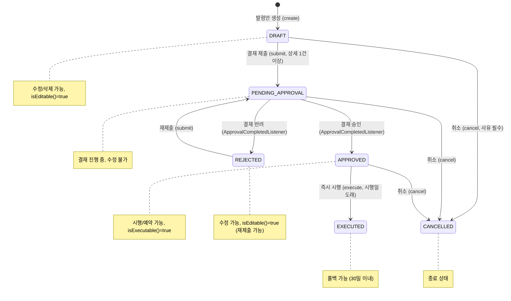
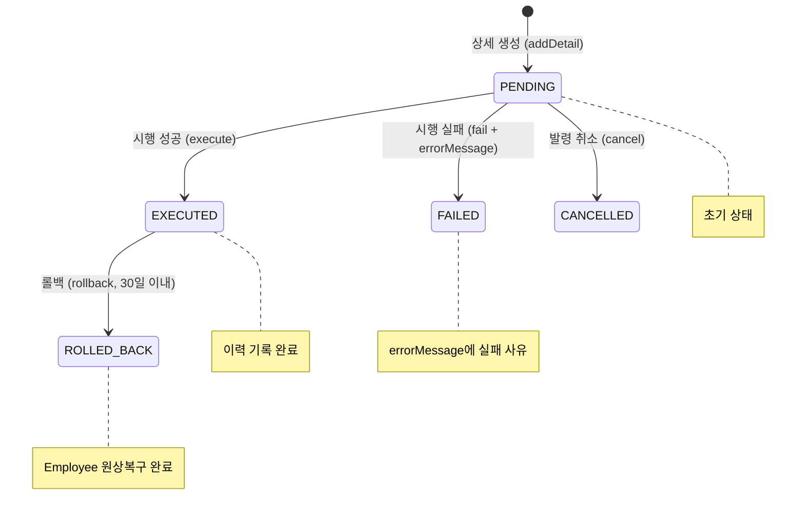
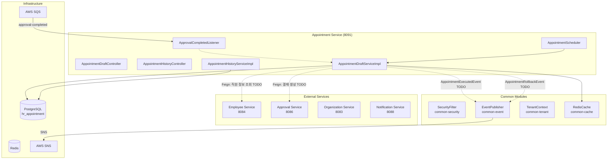
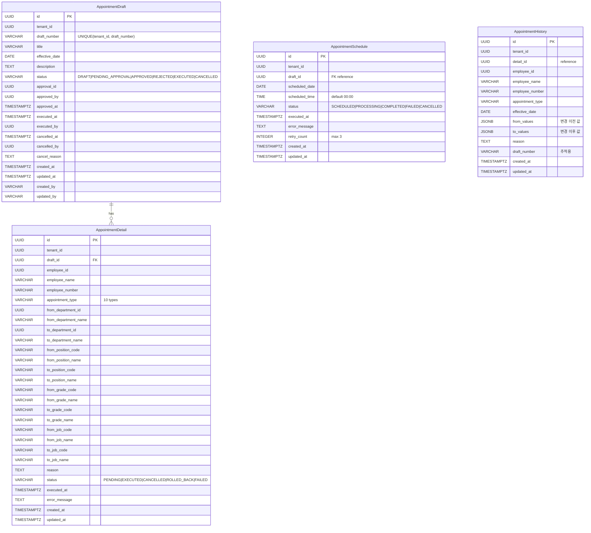

# Module 12: Appointment Service (발령관리) — PRD 및 프로덕션 정책 분석

> **최종 업데이트**: 2026-02-10
> **분석 범위**: `services/appointment-service/`, `common/` 모듈
> **문서 버전**: v2.0 (Phase A/B/C 확장)
> **포트**: 8091
> **패키지**: `com.hrsaas.appointment`
> **DB 스키마**: `hr_appointment`

---

## 목차

- [1. 현재 구현 상태 요약](#1-현재-구현-상태-요약)
- [2. 정책 결정사항](#2-정책-결정사항)
- [3. 기능 요구사항 Gap 분석 (Phase A)](#3-기능-요구사항-gap-분석-phase-a)
- [4. 비즈니스 규칙 상세 (Phase B)](#4-비즈니스-규칙-상세-phase-b)
- [5. 서비스 연동 명세 (Phase C)](#5-서비스-연동-명세-phase-c)
- [6. 데이터 모델](#6-데이터-모델)
- [7. API 명세](#7-api-명세)
- [8. 보안/프라이버시](#8-보안프라이버시)
- [9. 성능/NFR](#9-성능nfr)
- [10. 추적성 매트릭스](#10-추적성-매트릭스)
- [11. 변경 이력](#11-변경-이력)

---

## 1. 현재 구현 상태 요약

### 1.1 구현 완료

| 기능 | 상태 | 위치 |
|------|------|------|
| 발령안(Draft) CRUD | ✅ 완료 | `AppointmentDraftController` / `AppointmentDraftServiceImpl` |
| 발령번호 자동채번 (APT-{YYYY}-{NNNN}) | ✅ 완료 | `AppointmentDraftServiceImpl.generateDraftNumber()` |
| 발령상세(Detail) 관리 | ✅ 완료 | `addDetail()` / `removeDetail()` + 동일 직원+유형 중복 방지 |
| 발령유형 10종 | ✅ 완료 | `AppointmentType` enum (PROMOTION~CONCURRENT) |
| 발령안 상태 머신 | ✅ 완료 | `DraftStatus` (DRAFT→PENDING_APPROVAL→APPROVED→EXECUTED, CANCELLED) |
| 발령상세 상태 머신 | ✅ 완료 | `DetailStatus` (PENDING→EXECUTED/FAILED/CANCELLED/ROLLED_BACK) |
| 결재 제출 (submit) | ✅ 완료 | `AppointmentDraftServiceImpl.submit()` (결재 서비스 연동은 TODO 스텁) |
| 즉시 시행 (execute) | ✅ 완료 | `executeAppointment()` — Detail별 이력 저장 + 상태 전이 |
| 발령 이력 (History) | ✅ 완료 | `AppointmentHistory` — fromValues/toValues JSONB 스냅샷 |
| 예약 발령 (Schedule) | ✅ 완료 | `AppointmentSchedule` — 예약일시 설정, 자동 시행, 재시도 (최대 3회) |
| 발령 롤백 (Rollback) | ✅ 완료 | `AppointmentDraftServiceImpl.rollback()` (Employee 연동은 TODO 스텁) |
| 발령 취소 (Cancel) | ✅ 완료 | EXECUTED/CANCELLED 외 모든 상태에서 취소 가능, 예약도 함께 취소 |
| 발령 통계 | ✅ 완료 | `AppointmentHistoryServiceImpl.getStatistics()` — 연도/월별 유형별 집계 |
| 스케줄러 (예약 발령 처리) | ✅ 완료 | `AppointmentScheduler` — 매일 00:01 예약 처리, 매시 :30 실패 재시도 |
| 결재 이벤트 리스너 | ✅ 완료 | `ApprovalCompletedListener` SQS 수신 (처리 로직은 TODO 스텁) |
| 발령번호/ID 양쪽 조회 | ✅ 완료 | `getById()` + `getByDraftNumber()` |
| 발령안 검색 (상태/기간) | ✅ 완료 | `search(status, startDate, endDate, pageable)` |
| RLS (Row Level Security) | ✅ 완료 | 4개 전 테이블 tenant_id 기반 RLS 정책 |
| 개인정보 마스킹 | ✅ 완료 | `AppointmentDetailResponse`, `AppointmentHistoryResponse`에 `@Masked(type=MaskType.NAME)` |
| Redis 캐시 | ✅ 완료 | `appointment:draft` — Draft 변경 시 `@CacheEvict(allEntries=true)` |
| 에러 코드 체계 | ✅ 완료 | APT_001~012 비즈니스 예외 정의 |
| SecurityConfig | ✅ 완료 | `FilterRegistrationBean.setEnabled(false)` — SecurityFilter 이중 등록 방지 |
| ddl-auto: update | ⚠️ 주의 | 프로덕션에서는 `validate`로 변경 필요 |

### 1.2 미구현 / TODO

| 기능 | 상태 | 구현 방향 |
|------|------|-----------|
| Employee Service 연동 (시행 시 직원 정보 변경) | ❌ TODO 스텁 | 이벤트 기반 비동기 (SNS/SQS) — 정책 결정 완료 (§2.1) |
| Approval Service 연동 (결재 생성) | ❌ TODO 스텁 | Feign Client — 정책 결정 완료 (§2.2) |
| 롤백 시 Employee Service 원상복구 | ❌ TODO 스텁 | 역방향 이벤트 발행 — 정책 결정 완료 (§2.3) |
| ApprovalCompletedListener 처리 로직 | ❌ TODO 스텁 | approve/reject draft 연동 — 정책 결정 완료 (§2.4) |
| 직원 정보 자동 조회 (createDetail) | ❌ TODO 스텁 | Employee Feign Client로 현재 정보 채움 (§2.5) |
| 현재 사용자 ID (executedBy) | ⚠️ tenantId 사용 | SecurityContextHolder에서 userId 추출 |
| Summary 엔드포인트 | ❌ 미구현 | FE에서 호출하는 `GET /drafts/summary` 추가 필요 |
| FE 발령이력 페이지 | ❌ 미구현 | BE API 존재, FE 개발 필요 |
| FE 통계 대시보드 | ❌ 미구현 | BE API 존재, FE 개발 필요 |
| 일괄 발령 (엑셀/CSV) | ❌ 미구현 | 대량 발령 업로드 기능 |
| 발령 알림 | ❌ 미구현 | Notification Service 이벤트 연동 |
| FE-BE 필드명 불일치 | ⚠️ 알려진 이슈 | Code vs Id 불일치 (§3.2) |
| ddl-auto 설정 | ⚠️ `update` | 프로덕션은 `validate`로 변경 필요 |

---

## 2. 정책 결정사항

### 2.1 Employee Service 동기화 ✅ 결정완료

> **결정: 이벤트 기반 비동기 (SNS/SQS)**

- 발령 시행(execute) 시:
  1. 각 Detail별로 `AppointmentExecutedEvent` 발행 (SNS 토픽: `hr-saas.appointment.executed`)
  2. Employee Service가 이벤트 수신하여 직원 정보 변경 반영
  3. 변경 결과 이벤트 수신으로 Detail 상태 업데이트 (EXECUTED/FAILED)
- 이벤트 페이로드:
  ```json
  {
    "eventType": "appointment.executed",
    "draftNumber": "APT-2026-0001",
    "detailId": "...",
    "employeeId": "...",
    "appointmentType": "PROMOTION",
    "effectiveDate": "2026-03-01",
    "changes": {
      "departmentId": {"from": "dept-001", "to": "dept-002"},
      "gradeCode": {"from": "G4", "to": "G3"},
      "positionCode": {"from": "P02", "to": "P01"}
    },
    "tenantId": "..."
  }
  ```
- Employee Service 처리:
  - PROMOTION: grade 변경
  - TRANSFER: department 변경
  - POSITION_CHANGE: position 변경
  - JOB_CHANGE: job 변경
  - LEAVE_OF_ABSENCE: 상태를 ON_LEAVE로 변경
  - REINSTATEMENT: 상태를 ACTIVE로 복원
  - RESIGNATION/RETIREMENT: 상태를 TERMINATED로 변경 + 퇴직일 기록
  - DEMOTION: grade 변경
  - CONCURRENT: 겸직 정보 추가 (EmployeeAffiliation)
- 실패 처리: DLQ + Detail 상태 FAILED + errorMessage 기록 + HR 알림

### 2.2 Approval Service 연동 ✅ 결정완료

> **결정: Approval Service 결재 엔진과 양방향 연동**

- submit() 수정:
  1. Draft 상태를 PENDING_APPROVAL로 변경
  2. Approval Service에 결재 요청 생성 (Feign Client)
  3. 반환된 approvalId 저장
- 결재 양식:
  ```
  제목: [발령] {title}
  본문: 시행일, 대상자 수, 발령 유형별 요약
  첨부: 발령안 상세 링크
  ```
- 결재 결과 처리 (ApprovalCompletedListener):
  - 승인: `Draft.approve(approvedBy)` 실행
  - 반려: `Draft.reject()` 실행
- 결재 라인: 발령 규모(대상자 수)에 따라 자동 결정
  - 5명 이하: HR팀장 1단계
  - 10명 이하: HR팀장+인사본부장 2단계
  - 10명 초과: 3단계 (+대표이사)

### 2.3 발령 롤백 ✅ 결정완료

> **결정: 완전 롤백 — Employee Service에 원상복구 요청**

- rollback() 수정:
  1. 롤백 가능 기간 검증 (시행일 + 30일 이내)
  2. Draft의 모든 EXECUTED Detail에 대해 역방향 변경 이벤트 발행
  3. AppointmentHistory의 fromValues/toValues를 역으로 적용
  4. 이벤트 페이로드:
     ```json
     {
       "eventType": "appointment.rollback",
       "detailId": "...",
       "employeeId": "...",
       "appointmentType": "PROMOTION",
       "restoreValues": { ... fromValues 복원 ... },
       "tenantId": "..."
     }
     ```
  5. Employee Service가 수신하여 이전 상태로 복원
  6. 성공 시 Detail 상태: ROLLED_BACK
  7. 롤백 이력도 AppointmentHistory에 기록 (appointmentType + "_ROLLBACK")
- 제약: 시행일로부터 30일(설정 가능) 이내에만 롤백 가능
- 롤백도 결재 필요 여부: 향후 정책 결정 (현재는 HR 관리자 권한으로 즉시 롤백)

### 2.4 결재 완료 이벤트 처리 ✅ 결정완료

> **결정: SQS 리스너에서 Draft 상태 자동 전이**

- `ApprovalCompletedListener.handleApprovalCompleted()` 구현:
  1. `documentType=APPOINTMENT` 필터링 (기존 구현)
  2. `referenceId`로 Draft 조회 (`findByApprovalId`)
  3. 승인: `draft.approve(approvedBy)` 실행
  4. 반려: `draft.reject()` 실행 → 재제출 가능 (REJECTED → DRAFT → PENDING_APPROVAL)

### 2.5 직원 정보 자동 조회 ✅ 결정완료

> **결정: Feign Client를 통해 Detail 생성 시 현재 정보 자동 채움**

- `createDetail()` 수정:
  1. `EmployeeServiceClient.getEmployee(employeeId)` 호출
  2. 응답에서 employeeName, employeeNumber 자동 설정
  3. from 필드 (현재 부서/직급/직위/직무) 자동 채움
  4. Fallback: Employee Service 장애 시 수동 입력 허용 (from 필드 비워둠)

### 2.6 발령번호 채번 ✅ 결정완료 (코드 기반)

> **결정: 쿼리 기반 MAX+1 채번**

**현재 구현:**
```java
// AppointmentDraftServiceImpl.generateDraftNumber()
String prefix = "APT-" + Year.now().getValue();
Integer maxNumber = draftRepository.findMaxDraftNumberByPrefix(tenantId, prefix);
int nextNumber = (maxNumber != null ? maxNumber : 0) + 1;
return String.format("%s-%04d", prefix, nextNumber);  // APT-2026-0001
```

**알려진 이슈:**
- DB 시퀀스가 아닌 쿼리 기반 → 동시성 이슈 가능
- 개선 권장: `SELECT ... FOR UPDATE` 또는 DB 시퀀스 기반으로 변경

---

## 3. 기능 요구사항 Gap 분석 (Phase A)

### 3.1 PRD vs 코드 비교표

> **PRD 출처**: `docs/deprecated/PRD.md` (섹션 8.2: Phase 2 - Extended HR)
> **참고**: PRD에서 발령 관리는 Phase 2 항목으로, 상세 FR이 정의되지 않음.
> 코드 역분석을 통해 요구사항을 도출함.

| ID | 도출 요구사항 | PRD 근거 | 코드 구현 상태 | 구현 위치 | Gap |
|----|-------------|---------|---------------|----------|-----|
| FR-APT-001-01 | 발령안 생성/수정/삭제 (CRUD) | §8.2 "인사발령" | ✅ 완전 구현 | `AppointmentDraftController` CRUD | — |
| FR-APT-001-02 | 발령안에 대상 직원 추가/제거 | §8.2 "인사발령" | ✅ 완전 구현 | `addDetail()` / `removeDetail()` + 중복 검증 | — |
| FR-APT-001-03 | 발령번호 자동채번 | 운영 필수 | ✅ 완전 구현 | `generateDraftNumber()` APT-{YYYY}-{NNNN} | — |
| FR-APT-002-01 | 발령 결재 제출 | §8.2 "인사발령" + FR-APR-004-03 | 🟡 스텁 | `submit()` — random UUID 할당 | Approval 연동 필요 |
| FR-APT-002-02 | 결재 승인/반려 시 상태 자동 전이 | FR-APR-004-03 | 🟡 스텁 | `ApprovalCompletedListener` — TODO 주석 | 처리 로직 구현 필요 |
| FR-APT-003-01 | 발령 즉시 시행 | §8.2 "인사발령" | ✅ 완전 구현 | `execute()` — Detail별 이력 저장 + 상태 전이 | — |
| FR-APT-003-02 | 시행 시 직원 정보 반영 | §8.2 "승진, 전보" | ❌ TODO 스텁 | `executeAppointment()` — Employee 이벤트 미발행 | Employee 연동 필요 |
| FR-APT-003-03 | 발령 유형별 처리 (10종) | §8.2 "승진, 전보" | ✅ 완전 구현 | `AppointmentType` enum 10종 + 유형별 변경 매핑 | — |
| FR-APT-004-01 | 예약 발령 (미래 날짜 자동 시행) | 운영 필수 | ✅ 완전 구현 | `schedule()` + `AppointmentScheduler` | — |
| FR-APT-004-02 | 예약 실패 자동 재시도 (최대 3회) | 운영 안정성 | ✅ 완전 구현 | `retryFailedSchedules()` + `canRetry()` | — |
| FR-APT-005-01 | 발령 롤백 (원상복구) | 운영 필수 | 🟡 스텁 | `rollback()` — Detail 상태만 변경, Employee 미연동 | Employee 연동 필요 |
| FR-APT-005-02 | 롤백 기간 제한 (30일) | 운영 정책 | ❌ 미구현 | 기간 검증 로직 없음 | 기간 검증 추가 필요 |
| FR-APT-006-01 | 발령 이력 조회 (직원별/유형별/기간별) | 운영 필수 | ✅ 완전 구현 | `AppointmentHistoryController` 4개 엔드포인트 | — |
| FR-APT-006-02 | 발령 통계 (유형별 집계) | 운영 대시보드 | ✅ 완전 구현 | `getStatistics()` 연도/월별 유형별 집계 | — |
| FR-APT-007-01 | 발령 취소 | 운영 필수 | ✅ 완전 구현 | `cancel()` + 예약 연동 취소 | — |

**구현률**: 60% (9/15 완전 구현, 3개 부분/스텁, 3개 미구현)

### 3.2 코드에만 있는 기능 (역분석)

PRD에 명시적 요구사항이 없지만, 코드에 구현된 기능들:

| FR ID (신규) | 기능 | 구현 위치 | 비즈니스 가치 | PRD 반영 권장 |
|-------------|------|----------|-------------|--------------|
| FR-APT-EX-001 | 발령번호로 조회 | `getByDraftNumber()` | 발령번호 기반 빠른 검색 | ✅ 반영 필요 |
| FR-APT-EX-002 | 발령안 검색 (상태+기간 필터) | `search(status, startDate, endDate)` | 대량 발령 관리 효율화 | ✅ 반영 필요 |
| FR-APT-EX-003 | 이력 JSONB 스냅샷 (fromValues/toValues) | `buildFromValues()` / `buildToValues()` | 변경 이전/이후 정확한 추적 | ✅ 반영 필요 |
| FR-APT-EX-004 | 개인정보 마스킹 (employeeName) | `@Masked(type=MaskType.NAME)` | 개인정보보호법 준수 | 보안 문서에 포함 |
| FR-APT-EX-005 | 캐시 전략 (Draft 변경 시 evict) | `@CacheEvict("appointment:draft")` | 조회 성능 향상 | 아키텍처 문서에 포함 |
| FR-APT-EX-006 | Detail별 부분 실패 허용 | `try-catch` per detail in `executeAppointment()` | 대량 발령 시 전체 실패 방지 | ✅ 반영 필요 |

### 3.3 FE-BE 불일치 분석

| 구분 | FE (types) | BE (DTO/Entity) | 조치 |
|------|-----------|-----------------|------|
| Detail 목적지 | `toPositionId`, `toGradeId`, `toJobId` | `toPositionCode`, `toGradeCode`, `toJobCode` | **Code vs Id** — BE가 Code 기반 (MDM 코드), FE를 code 기반으로 통일 |
| Detail 출처 | `fromGradeId` | `fromGradeCode` | 동일 이슈 |
| Summary 응답 | `AppointmentSummary` type | BE에 summary 엔드포인트 없음 | **BE에 `GET /drafts/summary` 추가 필요** |
| Creator 정보 | `draftCreatedBy: AppointmentCreator` | 없음 (createdBy만 문자열) | **BE 응답에 creator 정보 추가 필요** |
| 검색 키워드 | `keyword` 파라미터 | BE search에 keyword 파라미터 없음 | **BE에 keyword 검색 지원 추가** |

### 3.4 FE-BE 기능 매핑

| FE 존재 | BE 존재 | 조치 |
|---------|---------|------|
| 발령안 목록 ✅ | getDrafts API ✅ | OK |
| 발령안 상세 ✅ | getDraft API ✅ | OK |
| 발령안 생성 ✅ | create API ✅ | OK |
| 발령안 수정 ✅ | update API ✅ | OK |
| 상세 추가/삭제 ✅ | addDetail/removeDetail ✅ | OK |
| 제출/시행/취소 ✅ | submit/execute/cancel ✅ | OK |
| Summary 조회 ✅ | **없음** | BE 추가 필요 |
| 발령 이력 ❌ | getHistory API ✅ | FE 페이지 개발 필요 |
| 발령 통계 ❌ | getStatistics API ✅ | FE 대시보드 개발 필요 |
| 예약 발령 UI ❌ | schedule API ✅ | FE 스케줄링 UI 개발 필요 |
| 롤백 UI ❌ | rollback API ✅ | FE 롤백 버튼/확인 UI 필요 |

### 3.5 Gap 해소 우선순위 로드맵

| 우선순위 | Gap ID | 항목 | 현재 상태 | 해소 방향 | 의존성 | 예상 복잡도 |
|---------|--------|------|----------|----------|--------|-----------|
| **HIGH** | APT-G01 | Employee Service 이벤트 발행 (시행) | TODO 스텁 | SNS 이벤트 발행 + Employee 리스너 구현 | Employee Service | 높음 |
| **HIGH** | APT-G02 | Approval Service 연동 (결재 생성) | TODO 스텁 (random UUID) | Feign Client 구현 + submit() 수정 | Approval Service | 중간 |
| **HIGH** | APT-G03 | 롤백 Employee 연동 | TODO 스텁 (상태만 변경) | 역방향 이벤트 발행 + 기간 검증 추가 | Employee Service | 높음 |
| **HIGH** | APT-G04 | ApprovalCompletedListener 처리 로직 | TODO 주석 | approve/reject draft 연동 구현 | Approval Service | 낮음 |
| **HIGH** | APT-G05 | 직원 정보 자동 조회 (createDetail) | TODO 스텁 | Employee Feign Client + from 필드 자동 채움 | Employee Service | 중간 |
| **MEDIUM** | APT-G06 | executedBy 현재 사용자 ID | tenantId 사용 | SecurityContextHolder에서 userId 추출 | Common Security | 낮음 |
| **MEDIUM** | APT-G07 | Summary 엔드포인트 | BE 미구현 | `GET /drafts/summary` 상태별 건수 집계 | — | 낮음 |
| **MEDIUM** | APT-G08 | FE-BE 필드명 불일치 | Code vs Id | FE를 Code 기반으로 통일 | Frontend | 낮음 |
| **MEDIUM** | APT-G09 | 일괄 발령 (엑셀/CSV) | 미구현 | File Service 연동 + 대량 Detail 생성 | File Service | 높음 |
| **MEDIUM** | APT-G10 | 발령 알림 | 미구현 | Notification Service 이벤트 발행 | Notification Service | 낮음 |
| **MEDIUM** | APT-G11 | 롤백 기간 제한 | 미구현 | `appointment.rollback.max-days` 설정 + 검증 로직 | — | 낮음 |
| **MEDIUM** | APT-G12 | ddl-auto: update → validate | 현재 `update` | application.yml 수정 | — | 낮음 |
| **LOW** | APT-G13 | FE 발령이력 페이지 | BE API 존재 | FE 페이지 개발 | Frontend | 중간 |
| **LOW** | APT-G14 | FE 통계 대시보드 | BE API 존재 | FE 대시보드 개발 | Frontend | 중간 |
| **LOW** | APT-G15 | FE 예약/롤백 UI | BE API 존재 | FE UI 개발 | Frontend | 중간 |
| **LOW** | APT-G16 | 발령번호 동시성 개선 | 쿼리 기반 MAX+1 | DB 시퀀스 또는 SELECT FOR UPDATE | — | 낮음 |

---

## 4. 비즈니스 규칙 상세 (Phase B)

### 4.1 상태 머신

#### 4.1.1 발령안 상태 (DraftStatus)



**상태 설명:**

| 상태 | DB 표현 | 수정 가능 | 시행 가능 | 전이 조건 |
|------|---------|----------|----------|----------|
| DRAFT | `status='DRAFT'` | ✅ (isEditable) | ❌ | 초기 생성 상태 |
| PENDING_APPROVAL | `status='PENDING_APPROVAL'` | ❌ | ❌ | submit() + 상세 1건 이상 |
| APPROVED | `status='APPROVED'` | ❌ | ✅ (isExecutable) | 결재 승인 이벤트 |
| REJECTED | `status='REJECTED'` | ✅ (isEditable) | ❌ | 결재 반려 이벤트 |
| EXECUTED | `status='EXECUTED'` | ❌ | ❌ | execute() + 시행일 도래 |
| CANCELLED | `status='CANCELLED'` | ❌ | ❌ | cancel() + 사유 입력 |

**상태별 허용 동작:**

| 상태 | 수정 | 삭제 | 제출 | 시행 | 예약 | 취소 | 롤백 |
|------|------|------|------|------|------|------|------|
| DRAFT | ✅ | ✅ | ✅ | ❌ | ❌ | ✅ | ❌ |
| PENDING_APPROVAL | ❌ | ❌ | ❌ | ❌ | ❌ | ✅ | ❌ |
| APPROVED | ❌ | ❌ | ❌ | ✅ | ✅ | ✅ | ❌ |
| REJECTED | ✅ | ✅ | ✅ | ❌ | ❌ | ✅ | ❌ |
| EXECUTED | ❌ | ❌ | ❌ | ❌ | ❌ | ❌ | ✅ |
| CANCELLED | ❌ | ❌ | ❌ | ❌ | ❌ | ❌ | ❌ |

#### 4.1.2 발령상세 상태 (DetailStatus)



#### 4.1.3 예약 발령 상태 (ScheduleStatus)

```mermaid
stateDiagram-v2
    [*] --> SCHEDULED : 예약 생성 (schedule)
    SCHEDULED --> PROCESSING : 스케줄러 실행 (processScheduledAppointments)
    PROCESSING --> COMPLETED : 시행 성공 (complete)
    PROCESSING --> FAILED : 시행 실패 (fail + retryCount++)
    FAILED --> PROCESSING : 자동 재시도 (retryCount < 3)
    SCHEDULED --> CANCELLED : 발령 취소 시 연동 취소 (cancel)

    note right of SCHEDULED : 매일 00:01 처리 대상
    note right of PROCESSING : 시행 진행 중
    note right of FAILED : canRetry() = retryCount < 3
    note right of COMPLETED : executedAt 기록
```

### 4.2 유효성 검증 규칙 카탈로그

#### 4.2.1 발령안 (AppointmentDraft)

| 필드 | 검증 규칙 | 에러 코드 | 검증 위치 |
|------|----------|----------|----------|
| title | `@NotBlank`, 200자 이내 | — | DTO |
| effectiveDate | `@NotNull` | — | DTO |
| description | 2000자 이내 (nullable) | — | DTO |
| details | `@NotEmpty` (생성 시), `@Valid` | APT_006 | DTO + Service |
| 수정/삭제 | isEditable() = DRAFT 또는 REJECTED | APT_002 | Service |
| 결재 제출 | DRAFT 또는 REJECTED + 상세 1건 이상 | APT_005, APT_006 | Service |
| 시행 | isExecutable() = APPROVED + 시행일 도래 | APT_007, APT_008 | Service |
| 취소 | EXECUTED, CANCELLED 아닌 모든 상태 | APT_011 | Service |
| 롤백 | EXECUTED 상태만 | APT_012 | Service |

#### 4.2.2 발령상세 (AppointmentDetail)

| 필드 | 검증 규칙 | 에러 코드 | 검증 위치 |
|------|----------|----------|----------|
| employeeId | `@NotNull` | — | DTO |
| appointmentType | `@NotNull` | — | DTO |
| reason | 1000자 이내 (nullable) | — | DTO |
| 중복 검증 | 동일 draftId + employeeId + appointmentType 불가 | APT_003 | Service (Repository) |
| 추가/삭제 조건 | Draft가 isEditable() 상태 | APT_002 | Service |
| toDepartmentId | nullable (유형에 따라 필요) | — | — |
| toPositionCode | nullable (유형에 따라 필요) | — | — |
| toGradeCode | nullable (유형에 따라 필요) | — | — |
| toJobCode | nullable (유형에 따라 필요) | — | — |

#### 4.2.3 예약 발령 (AppointmentSchedule)

| 필드 | 검증 규칙 | 에러 코드 | 검증 위치 |
|------|----------|----------|----------|
| scheduledDate | `@NotNull`, 미래 날짜만 | APT_009 | DTO + Service |
| scheduledTime | nullable, 기본값 00:00 | — | Entity |
| 중복 예약 | 동일 draftId에 SCHEDULED/PROCESSING 존재 시 불가 | APT_010 | Service (Repository) |
| 예약 조건 | Draft가 APPROVED 상태 (isExecutable) | APT_007 | Service |

#### 4.2.4 취소 요청 (CancelAppointmentRequest)

| 필드 | 검증 규칙 | 에러 코드 | 검증 위치 |
|------|----------|----------|----------|
| reason | `@NotBlank`, 1000자 이내 | — | DTO |

### 4.3 계산 공식/로직 명세

#### 4.3.1 발령번호 채번

```
// AppointmentDraftServiceImpl.generateDraftNumber()
prefix = "APT-" + currentYear          // "APT-2026"
maxNumber = MAX(CAST(SUBSTRING(draftNumber, 10) AS int))
            WHERE tenantId = :tenantId
            AND draftNumber LIKE prefix + "%"
nextNumber = (maxNumber ?? 0) + 1
result = prefix + "-" + format("%04d", nextNumber)    // "APT-2026-0001"
```

#### 4.3.2 발령 시행 흐름

```
// AppointmentDraftServiceImpl.executeAppointment(draft)
executedBy = TenantContext.getCurrentTenant()   // TODO: 현재 사용자 ID

FOR EACH detail IN draft.details:
    TRY:
        // 1. 이력 저장
        history = AppointmentHistory(
            detailId = detail.id,
            employeeId = detail.employeeId,
            appointmentType = detail.appointmentType,
            effectiveDate = draft.effectiveDate,
            fromValues = buildFromValues(detail),    // JSONB
            toValues = buildToValues(detail),        // JSONB
            draftNumber = draft.draftNumber
        )
        historyRepository.save(history)

        // 2. Employee Service 이벤트 발행 (TODO)
        // eventPublisher.publish(appointmentExecutedEvent)

        // 3. 상태 전이
        detail.execute()    // status = EXECUTED, executedAt = now()

    CATCH Exception:
        detail.fail(e.getMessage())    // status = FAILED, errorMessage 기록

draft.execute(executedBy)    // status = EXECUTED, executedAt = now()
```

#### 4.3.3 JSONB 값 빌딩

```
// buildFromValues(detail) → Map<String, Object>
values = {}
if detail.fromDepartmentId != null:
    values["departmentId"] = detail.fromDepartmentId
    values["departmentName"] = detail.fromDepartmentName
if detail.fromPositionCode != null:
    values["positionCode"] = detail.fromPositionCode
    values["positionName"] = detail.fromPositionName
if detail.fromGradeCode != null:
    values["gradeCode"] = detail.fromGradeCode
    values["gradeName"] = detail.fromGradeName
if detail.fromJobCode != null:
    values["jobCode"] = detail.fromJobCode
    values["jobName"] = detail.fromJobName

// buildToValues(detail) → 동일 구조, to 필드 사용
```

#### 4.3.4 예약 발령 스케줄러 흐름

```
// processScheduledAppointments() — 매일 00:01
schedules = findPendingSchedules(today)   // SCHEDULED AND scheduledDate <= today
FOR EACH schedule IN schedules:
    schedule.startProcessing()            // status = PROCESSING
    TRY:
        draftService.execute(schedule.draftId)
        schedule.complete()               // status = COMPLETED, executedAt = now()
    CATCH:
        schedule.fail(errorMessage)       // status = FAILED, retryCount++

// retryFailedSchedules() — 매시 :30
retryable = findRetryableSchedules()      // FAILED AND retryCount < 3
FOR EACH schedule IN retryable:
    processSchedule(schedule)             // 동일 흐름
```

#### 4.3.5 통계 계산

```
// getStatistics(year, month)
if month != null:
    startDate = YearMonth(year, month).atDay(1)
    endDate = YearMonth(year, month).atEndOfMonth()
    period = "{year}-{month:02d}"
else:
    startDate = LocalDate(year, 1, 1)
    endDate = LocalDate(year, 12, 31)
    period = "{year}"

results = GROUP BY appointmentType COUNT(*)
          WHERE tenantId AND effectiveDate BETWEEN startDate AND endDate

total = SUM(counts)
byType = [{type, typeName, count}, ...]
```

### 4.4 발령유형별 변경 항목

| 발령유형 | 한글명 | 변경 대상 | 필수 입력 | Employee 처리 |
|---------|--------|----------|----------|---------------|
| PROMOTION | 승진 | 직급(grade) 상향 | toGradeCode | grade 변경 |
| TRANSFER | 전보 | 부서 변경 | toDepartmentId | department 변경 |
| POSITION_CHANGE | 보직변경 | 직위 변경 | toPositionCode | position 변경 |
| JOB_CHANGE | 직무변경 | 직무 변경 | toJobCode | job 변경 |
| LEAVE_OF_ABSENCE | 휴직 | 직원 상태 변경 | reason 필수 | 상태 → ON_LEAVE |
| REINSTATEMENT | 복직 | 직원 상태 복원 | — | 상태 → ACTIVE |
| RESIGNATION | 사직 | 직원 상태 변경 | reason 필수 | 상태 → TERMINATED + 퇴직일 |
| RETIREMENT | 정년퇴직 | 직원 상태 변경 | — | 상태 → TERMINATED + 퇴직일 |
| DEMOTION | 강등 | 직급(grade) 하향 | toGradeCode | grade 변경 |
| CONCURRENT | 겸직 | 부서+직위 추가 | toDepartmentId, toPositionCode | 겸직 정보 추가 (EmployeeAffiliation) |

### 4.5 데이터 생명주기 정책

| 데이터 | 생성 시점 | 보존 기간 | 삭제 방식 | 비고 |
|--------|----------|----------|----------|------|
| AppointmentDraft | 관리자 생성 | 영구 | DRAFT/REJECTED만 하드 삭제 가능 | 시행/취소 이후 삭제 불가 |
| AppointmentDetail | Draft에 추가 시 | 영구 | Draft와 cascade 삭제 (orphanRemoval=true) | Draft 삭제 가능 상태에서만 |
| AppointmentHistory | 시행 시 자동 생성 | 영구 | 삭제 없음 | 감사 추적용 불변 데이터 |
| AppointmentSchedule | 예약 시 생성 | 영구 | 삭제 없음 | 상태만 변경 (COMPLETED/FAILED/CANCELLED) |

### 4.6 엣지 케이스 카탈로그

| # | 시나리오 | 현재 동작 | 기대 동작 | 상태 |
|---|---------|----------|----------|------|
| 1 | PENDING_APPROVAL 상태에서 수정 시도 | APT_002 예외 | 수정 차단 | ✅ 정상 |
| 2 | EXECUTED 상태에서 삭제 시도 | APT_002 예외 | 삭제 차단 | ✅ 정상 |
| 3 | 동일 직원+동일 유형 Detail 중복 추가 | APT_003 예외 | 중복 차단 | ✅ 정상 |
| 4 | 존재하지 않는 Detail 삭제 시도 | APT_004 예외 | 404 반환 | ✅ 정상 |
| 5 | APPROVED 아닌 상태에서 제출 시도 | APT_005 예외 | DRAFT/REJECTED만 제출 가능 | ✅ 정상 |
| 6 | 상세 없이 결재 제출 | APT_006 예외 | 상세 1건 이상 필요 | ✅ 정상 |
| 7 | APPROVED 아닌 상태에서 시행 시도 | APT_007 예외 | APPROVED만 시행 가능 | ✅ 정상 |
| 8 | 시행일 미도래 상태에서 즉시 시행 | APT_008 예외 | 예약 사용 안내 | ✅ 정상 |
| 9 | 과거 날짜로 예약 시도 | APT_009 예외 | 미래 날짜만 예약 가능 | ✅ 정상 |
| 10 | 동일 Draft 중복 예약 시도 | APT_010 예외 | SCHEDULED/PROCESSING 중복 방지 | ✅ 정상 |
| 11 | EXECUTED 상태에서 취소 시도 | APT_011 예외 | EXECUTED/CANCELLED 취소 불가 | ✅ 정상 |
| 12 | 비EXECUTED 상태에서 롤백 시도 | APT_012 예외 | EXECUTED만 롤백 가능 | ✅ 정상 |
| 13 | Detail 일부만 시행 실패 | 해당 Detail만 FAILED, 나머지 EXECUTED | 부분 실패 허용 | ✅ 정상 |
| 14 | 발령 취소 시 예약도 함께 취소 | SCHEDULED 상태 예약 자동 취소 | 연동 취소 | ✅ 정상 |
| 15 | 시행일로부터 30일 초과 후 롤백 | 현재: 기간 검증 없음 | 기간 초과 시 롤백 차단 | ⚠️ 미구현 (APT-G11) |
| 16 | 발령번호 동시 생성 (동시성) | 쿼리 기반 MAX+1 → 충돌 가능 | DB 시퀀스 기반 권장 | ⚠️ 알려진 이슈 (APT-G16) |
| 17 | cancel() 시 cancelledBy에 tenantId 할당 | tenantId로 기록 | 현재 사용자 ID 사용 | ⚠️ 알려진 이슈 (APT-G06) |
| 18 | REJECTED → submit() 재제출 | DRAFT/REJECTED에서 submit 허용 | 재제출 가능 | ✅ 정상 |
| 19 | 스케줄러 실패 후 3회 재시도 초과 | canRetry()=false, 수동 처리 필요 | 자동 재시도 중단 | ✅ 정상 |
| 20 | 테넌트 간 발령번호 독립 | tenantId + draftNumber UNIQUE 제약 | 테넌트별 독립 채번 | ✅ 정상 |

---

## 5. 서비스 연동 명세 (Phase C)

### 5.1 연동 아키텍처



### 5.2 REST API 연동 (Feign Client 기반 — 설계 완료, 미구현)

#### 5.2.1 Appointment → Employee Service (TODO)

| Feign Client | 메서드 | 엔드포인트 | 용도 | 호출 시점 | 폴백 전략 |
|-------------|--------|----------|------|----------|----------|
| `EmployeeServiceClient` | `getEmployee(UUID)` | `GET /api/v1/employees/{id}` | 직원 현재 정보 조회 | Detail 생성 시 | null 반환 (수동 입력 허용) |

**Feign 설정 (계획):**
- URL: `${services.employee-service.url:http://localhost:8084}`
- Fallback: `EmployeeServiceClientFallback` (직원 정보 없으면 from 필드 비워둠)

#### 5.2.2 Appointment → Approval Service (TODO)

| Feign Client | 메서드 | 엔드포인트 | 용도 | 호출 시점 | 폴백 전략 |
|-------------|--------|----------|------|----------|----------|
| `ApprovalServiceClient` | `createApproval(CreateApprovalRequest)` | `POST /api/v1/approvals` | 발령 결재 생성 | submit() 호출 시 | 예외 발생 (제출 차단) |

**Feign 설정 (계획):**
- URL: `${services.approval-service.url:http://localhost:8086}`
- Fallback: `ApprovalServiceClientFallback` (결재 서비스 장애 시 제출 차단)

#### 5.2.3 다른 서비스 → Appointment Service

| 호출자 | 용도 | 엔드포인트 |
|--------|------|----------|
| Frontend | 발령안 CRUD, 시행/예약/취소/롤백 | `/api/v1/appointments/drafts/*` |
| Frontend | 발령 이력 조회, 통계 | `/api/v1/appointments/history/*`, `/api/v1/appointments/statistics` |

### 5.3 이벤트 연동 (SNS/SQS)

#### 5.3.1 발행하는 이벤트 (설계 완료, 미구현)

| 이벤트 | SNS 토픽 | 발행 시점 | 페이로드 스키마 | 소비자 |
|--------|---------|----------|---------------|--------|
| `AppointmentExecutedEvent` | `hr-saas.appointment.executed` | 시행 시 Detail별 | `{ eventType, draftNumber, detailId, employeeId, appointmentType, effectiveDate, changes: { departmentId, gradeCode, positionCode, jobCode }, tenantId }` | Employee Service |
| `AppointmentRollbackEvent` | `hr-saas.appointment.rollback` | 롤백 시 Detail별 | `{ eventType, detailId, employeeId, appointmentType, restoreValues, tenantId }` | Employee Service |
| `AppointmentNotificationEvent` | `hr-saas.appointment.notification` | 시행/취소/롤백 시 | `{ eventType, draftNumber, employeeIds, appointmentTypes, effectiveDate, tenantId }` | Notification Service |

#### 5.3.2 소비하는 이벤트

| 이벤트 | SQS 큐 | 발행자 | 처리 로직 |
|--------|--------|--------|----------|
| `ApprovalCompletedEvent` | `appointment-service-queue` | Approval Service | `documentType=APPOINTMENT` → referenceId로 Draft 조회 → APPROVED: `draft.approve(approvedBy)`, REJECTED: `draft.reject()` (TODO: 처리 로직 미구현) |

#### 5.3.3 미구현 이벤트 (설계 완료)

| 이벤트 | 토픽 | 발행 시점 | 소비자 |
|--------|------|----------|--------|
| `RecruitmentAcceptedEvent` (소비) | `hr-saas.recruitment.accepted` | 채용 합격 시 | Appointment Service → 입사 발령 자동 생성 |
| `EmployeeChangeCompletedEvent` (소비) | `hr-saas.employee.change-completed` | Employee 변경 완료 | Appointment Service → Detail 상태 확정 (EXECUTED/FAILED) |

### 5.4 데이터 동기화 흐름

#### 5.4.1 발령 → 결재 워크플로우

```
1. Appointment → Approval: Feign POST /api/v1/approvals (동기, TODO)
   - type: APPOINTMENT
   - referenceId: draft.id
   - title: "[발령] {draft.title}"
   - 실패 시: 제출 차단

2. Approval → Appointment: SQS 이벤트 (비동기)
   - 큐: appointment-service-queue
   - documentType: APPOINTMENT
   - APPROVED: draft.approve(approvedBy)
   - REJECTED: draft.reject()
   - 최종 일관성: 결재 완료 후 비동기 처리 (수초 이내)
```

#### 5.4.2 발령 시행 → 직원 정보 반영

```
1. Appointment → Employee: SNS 이벤트 (비동기, TODO)
   - 토픽: hr-saas.appointment.executed
   - Detail별 개별 이벤트 발행 (대량 발령 시 N건)
   - 페이로드: appointmentType + changes (from/to)

2. Employee → Appointment: SNS/SQS 이벤트 (비동기, TODO)
   - 변경 성공: Detail.execute() (이미 설정됨)
   - 변경 실패: Detail.fail(errorMessage)
   - 최종 일관성: 발령 시행 후 비동기 반영 (수초 이내)
```

#### 5.4.3 발령 롤백 → 직원 정보 복원

```
1. Appointment → Employee: SNS 이벤트 (비동기, TODO)
   - 토픽: hr-saas.appointment.rollback
   - Detail별 역방향 이벤트 (fromValues 복원)
   - 롤백 이력도 AppointmentHistory에 기록

2. 제약 조건:
   - 시행일로부터 30일 이내 (설정 가능, TODO)
   - EXECUTED 상태 Detail만 롤백 대상
   - 롤백 성공 시: Detail.status = ROLLED_BACK
```

### 5.5 통합 테스트 시나리오

| # | 시나리오 | 관련 서비스 | 기대 결과 | 상태 |
|---|---------|-----------|----------|------|
| IT-01 | 발령안 생성 → 상세 2건 포함 | Appointment 단독 | DRAFT 상태, APT-{YYYY}-{NNNN} 번호, 상세 2건 | ❌ 미작성 |
| IT-02 | submit → 결재 생성 → 승인 이벤트 → APPROVED | Appointment + Approval | DRAFT→PENDING_APPROVAL→APPROVED | ❌ 미작성 |
| IT-03 | 결재 반려 → REJECTED → 수정 → 재제출 | Appointment + Approval | REJECTED→(수정)→PENDING_APPROVAL | ❌ 미작성 |
| IT-04 | 즉시 시행 → Detail별 이력 생성 → Employee 반영 | Appointment + Employee | APPROVED→EXECUTED, History JSONB 저장 | ❌ 미작성 |
| IT-05 | 시행 시 Detail 일부 실패 | Appointment 단독 | 성공 Detail: EXECUTED, 실패 Detail: FAILED + errorMessage | ❌ 미작성 |
| IT-06 | 미래 날짜 예약 → 스케줄러 당일 실행 | Appointment 단독 | SCHEDULED→PROCESSING→COMPLETED | ❌ 미작성 |
| IT-07 | 예약 실패 → 재시도 3회 초과 | Appointment 단독 | retryCount=3, canRetry()=false | ❌ 미작성 |
| IT-08 | 롤백 → Employee 원상복구 (30일 이내) | Appointment + Employee | EXECUTED Detail → ROLLED_BACK, 복원 이벤트 | ❌ 미작성 |
| IT-09 | 롤백 기간 초과 (30일 이후) | Appointment 단독 | 예외: 롤백 기간 초과 | ❌ 미작성 |
| IT-10 | 발령 취소 → 예약도 함께 취소 | Appointment 단독 | Draft: CANCELLED, Schedule: CANCELLED | ❌ 미작성 |
| IT-11 | 동일 직원+유형 중복 추가 시도 | Appointment 단독 | APT_003 에러 | ❌ 미작성 |
| IT-12 | 테넌트 간 데이터 격리 (RLS) | Appointment 단독 | 테넌트 A 발령이 테넌트 B에서 조회 불가 | ❌ 미작성 |
| IT-13 | 발령 통계 조회 (연도별/월별) | Appointment 단독 | 유형별 집계 정확, total 합산 | ❌ 미작성 |
| IT-14 | 발령번호 순차 생성 (APT-{YYYY}-0001, 0002, ...) | Appointment 단독 | 연도별 순차 번호, 테넌트별 독립 | ❌ 미작성 |

---

## 6. 데이터 모델

### 6.1 테이블 목록 (hr_appointment 스키마)

| 테이블 | 상태 | 용도 | RLS |
|--------|------|------|-----|
| `appointment_drafts` | ✅ 사용 중 | 발령안 (건 단위) | ✅ |
| `appointment_details` | ✅ 사용 중 | 발령 상세 (직원 단위) | ✅ |
| `appointment_schedules` | ✅ 사용 중 | 예약 발령 | ✅ |
| `appointment_histories` | ✅ 사용 중 | 발령 이력 (불변) | ✅ |

### 6.2 ERD



### 6.3 UNIQUE 제약 조건

| 테이블 | UNIQUE 제약 | 비즈니스 의미 |
|--------|-----------|-------------|
| appointment_drafts | (tenant_id, draft_number) | 테넌트별 발령번호 유니크 |

### 6.4 JPA Entity ↔ DB 테이블 매핑

| Entity | Table (DB) | 비고 |
|--------|------------|------|
| `AppointmentDraft` | `appointment_draft` (Entity) / `appointment_drafts` (DB) | Entity `@Table(name="appointment_draft")`, DB에는 `appointment_drafts`로 생성 |
| `AppointmentDetail` | `appointment_detail` / `appointment_details` | 동일 패턴 |
| `AppointmentSchedule` | `appointment_schedule` / `appointment_schedules` | 동일 패턴 |
| `AppointmentHistory` | `appointment_history` / `appointment_histories` | 동일 패턴 |

> **주의**: Entity `@Table` annotation의 name과 Flyway SQL의 테이블명이 다름. `ddl-auto: update` 설정으로 인해 현재는 JPA가 테이블을 자동 생성하여 동작하지만, `validate`로 변경 시 불일치가 발생할 수 있음. 마이그레이션 또는 Entity annotation 수정 필요.

### 6.5 Flyway 마이그레이션

| 버전 | 파일명 | 내용 |
|------|--------|------|
| V1 | `V1__init.sql` | 초기 스키마 — 4개 테이블 (drafts, details, schedules, histories) + 19개 인덱스 + RLS 정책 4개 + get_current_tenant_safe() 함수 |
| V2 | `V2__fix_schedule_index.sql` | 인덱스 수정 — `idx_appointment_schedules_status`를 `(tenant_id, status, scheduled_date)` 복합 인덱스로 교체 |

### 6.6 인덱스 전략

| 테이블 | 인덱스 | 주요 쿼리 패턴 |
|--------|--------|---------------|
| appointment_drafts | (tenant_id) | 테넌트별 조회 |
| appointment_drafts | (tenant_id, status) | 상태별 필터링 |
| appointment_drafts | (tenant_id, effective_date) | 기간별 조회 |
| appointment_drafts | (approval_id) WHERE NOT NULL | 결재 ID로 조회 |
| appointment_drafts | (tenant_id, created_at DESC) | 최신순 정렬 |
| appointment_details | (tenant_id, draft_id) | 발령안별 상세 조회 |
| appointment_details | (tenant_id, employee_id) | 직원별 조회 |
| appointment_details | (tenant_id, appointment_type) | 유형별 조회 |
| appointment_details | (tenant_id, status) | 상태별 조회 |
| appointment_schedules | (tenant_id, status, scheduled_date) | 예약 처리 대상 조회 (V2) |
| appointment_schedules | (tenant_id, draft_id) | Draft별 예약 조회 |
| appointment_schedules | (tenant_id, scheduled_date) | 날짜별 조회 |
| appointment_histories | (tenant_id, employee_id) | 직원별 이력 |
| appointment_histories | (tenant_id, appointment_type) | 유형별 이력 |
| appointment_histories | (tenant_id, effective_date) | 기간별 이력 |
| appointment_histories | (detail_id) WHERE NOT NULL | Detail 참조 |
| appointment_histories | (tenant_id, draft_number) | 발령번호로 이력 추적 |

---

## 7. API 명세

### 7.1 발령안 관리 (`/api/v1/appointments/drafts`)

| Method | Path | 권한 | 설명 |
|--------|------|------|------|
| POST | `/api/v1/appointments/drafts` | HR_ADMIN+ | 발령안 생성 (상세 포함) |
| GET | `/api/v1/appointments/drafts/{id}` | HR_ADMIN+ | 발령안 상세 조회 (Details 포함) |
| GET | `/api/v1/appointments/drafts/number/{draftNumber}` | HR_ADMIN+ | 발령번호로 조회 |
| GET | `/api/v1/appointments/drafts` | HR_ADMIN+ | 발령안 목록 (상태/기간 필터, 페이징) |
| PUT | `/api/v1/appointments/drafts/{id}` | HR_ADMIN+ | 발령안 수정 (DRAFT/REJECTED만) |
| DELETE | `/api/v1/appointments/drafts/{id}` | HR_ADMIN+ | 발령안 삭제 (DRAFT/REJECTED만) |
| POST | `/api/v1/appointments/drafts/{id}/details` | HR_ADMIN+ | 발령 상세 추가 |
| DELETE | `/api/v1/appointments/drafts/{draftId}/details/{detailId}` | HR_ADMIN+ | 발령 상세 삭제 |
| POST | `/api/v1/appointments/drafts/{id}/submit` | HR_ADMIN+ | 결재 제출 (상세 1건 이상) |
| POST | `/api/v1/appointments/drafts/{id}/execute` | HR_ADMIN+ | 즉시 시행 (APPROVED + 시행일 도래) |
| POST | `/api/v1/appointments/drafts/{id}/schedule` | HR_ADMIN+ | 예약 시행 (미래 날짜) |
| POST | `/api/v1/appointments/drafts/{id}/cancel` | HR_ADMIN+ | 발령 취소 (사유 필수) |
| POST | `/api/v1/appointments/drafts/{id}/rollback` | HR_ADMIN+ | 발령 롤백 (EXECUTED만) |

**요청/응답 DTO:**

| DTO | 용도 | 주요 필드 |
|-----|------|----------|
| `CreateAppointmentDraftRequest` | 발령안 생성 | title(필수), effectiveDate(필수), description, details[](필수) |
| `UpdateAppointmentDraftRequest` | 발령안 수정 | title, effectiveDate, description (모두 nullable) |
| `CreateAppointmentDetailRequest` | 상세 추가 | employeeId(필수), appointmentType(필수), toDepartmentId, toPositionCode, toGradeCode, toJobCode, reason |
| `ScheduleAppointmentRequest` | 예약 시행 | scheduledDate(필수), scheduledTime |
| `CancelAppointmentRequest` | 발령 취소 | reason(필수) |
| `AppointmentDraftResponse` | 발령안 응답 | id, draftNumber, title, effectiveDate, status, detailCount, details[], approvedAt, executedAt, cancelledAt, cancelReason |
| `AppointmentDetailResponse` | 상세 응답 | id, employeeId, employeeName(@Masked), appointmentType, appointmentTypeName, from/to fields, status, errorMessage |

### 7.2 발령 이력 (`/api/v1/appointments`)

| Method | Path | 권한 | 설명 |
|--------|------|------|------|
| GET | `/api/v1/appointments/history/employee/{employeeId}` | 인증 | 사원별 전체 이력 |
| GET | `/api/v1/appointments/history/employee/{employeeId}/paged` | 인증 | 사원별 이력 (페이징) |
| GET | `/api/v1/appointments/history/employee/{employeeId}/type/{type}` | 인증 | 사원별 유형별 이력 |
| GET | `/api/v1/appointments/history` | HR_ADMIN+ | 기간별 이력 (startDate, endDate 필수) |
| GET | `/api/v1/appointments/statistics` | HR_ADMIN+ | 발령 통계 (year 필수, month 선택) |

**응답 DTO:**

| DTO | 용도 | 주요 필드 |
|-----|------|----------|
| `AppointmentHistoryResponse` | 이력 응답 | id, employeeId, employeeName(@Masked), appointmentType, appointmentTypeName, effectiveDate, fromValues(JSONB), toValues(JSONB), draftNumber |
| `AppointmentStatisticsResponse` | 통계 응답 | period, total, byType[{type, typeName, count}] |

---

## 8. 보안/프라이버시

### 8.1 인증/인가

| 항목 | 설정 | 비고 |
|------|------|------|
| JWT 인증 | SecurityFilter (common-security) | FilterRegistrationBean으로 이중 등록 방지 |
| 발령 관리 | `@PreAuthorize("hasAnyRole('HR_ADMIN', 'TENANT_ADMIN', 'SUPER_ADMIN')")` | 발령안 CRUD, 시행, 취소, 롤백 |
| 이력 조회 (개인) | `@PreAuthorize("isAuthenticated()")` | 사원별 이력은 인증만 필요 |
| 이력 조회 (전체) | `@PreAuthorize("hasAnyRole('HR_ADMIN', 'TENANT_ADMIN', 'SUPER_ADMIN')")` | 기간별 이력, 통계 |
| CORS | SecurityConfig에서 설정 | — |
| 세션 | STATELESS | JWT 기반 |
| Swagger/Actuator | permitAll | `/actuator/**`, `/swagger-ui/**`, `/v3/api-docs/**` |

### 8.2 데이터 보호

| 데이터 | 보호 수준 | 처리 방식 |
|--------|----------|----------|
| employeeName | 개인정보 | `@Masked(type=MaskType.NAME)` + `MaskedFieldSerializer` |
| employeeNumber | 식별정보 | 원본 노출 (사번은 업무 필수) |
| 발령 사유 (reason) | 인사정보 | HR_ADMIN 이상만 접근 |
| fromValues/toValues (JSONB) | 인사 변경 정보 | RLS로 테넌트 격리 |

### 8.3 RLS (Row Level Security)

- 4개 전 테이블에 RLS ENABLE + FORCE
- 정책: `tenant_id = get_current_tenant_safe()` 또는 `get_current_tenant_safe() IS NULL` (테넌트 미설정 시 전체 접근)
- `get_current_tenant_safe()`: `app.current_tenant` 세션 변수 기반, 예외 시 NULL 반환

---

## 9. 성능/NFR

### 9.1 캐시 전략

| 캐시명 | 적용 대상 | TTL | 무효화 시점 |
|--------|----------|------|-----------|
| `appointment:draft` | AppointmentDraftServiceImpl (전체) | Redis 기본 | 모든 Draft 변경 시 `@CacheEvict(allEntries=true)` |

**주의사항:**
- 현재 `allEntries=true`로 모든 Draft 캐시를 무효화 — 대량 발령 시 캐시 효율 저하 가능
- 개선 권장: 키 기반 무효화 (`key = "#id"`) + 빈 컬렉션 방어 (`unless = "#result == null || #result.isEmpty()"`)

### 9.2 데이터베이스 설정

```yaml
spring:
  datasource:
    url: jdbc:postgresql://${DB_HOST:localhost}:${DB_PORT:5433}/hr_saas
    hikari:
      maximum-pool-size: 15    # Batch-heavy service
      minimum-idle: 5
      connection-timeout: 30000
      idle-timeout: 600000
      max-lifetime: 1800000
      leak-detection-threshold: 60000  # Dev only
  jpa:
    hibernate:
      ddl-auto: update         # ⚠️ 프로덕션은 validate로 변경 필요
    properties:
      hibernate:
        dialect: org.hibernate.dialect.PostgreSQLDialect
        default_schema: hr_appointment
  flyway:
    enabled: true
    schemas: hr_appointment
  data:
    redis:
      host: ${REDIS_HOST:localhost}
      port: ${REDIS_PORT:6381}
```

### 9.3 스케줄러 Cron 표현식

| 작업 | Cron | 실행 시점 | 상태 |
|------|------|----------|------|
| 예약 발령 처리 | `0 1 0 * * *` | 매일 00:01 | ✅ 구현 완료 |
| 실패 예약 재시도 | `0 30 * * * *` | 매시 :30 | ✅ 구현 완료 |

### 9.4 SQS 큐 설정

| 큐 | 값 | 용도 |
|----|-----|------|
| 수신 큐 | `appointment-service-queue` | 결재 완료 이벤트 수신 |
| 필터 이벤트 | `ApprovalCompletedEvent` | 결재 완료 |
| 필터 문서유형 | `APPOINTMENT` | 발령 결재 문서만 처리 |

### 9.5 비즈니스 상수

| 상수 | 값 | 위치 | 설명 |
|------|-----|------|------|
| MAX_RETRY_COUNT | 3 | `AppointmentSchedule.canRetry()` | 예약 발령 최대 재시도 (하드코딩) |
| ROLLBACK_MAX_DAYS | 30 | 미구현 (계획) | 롤백 가능 최대 기간 |
| DRAFT_NUMBER_FORMAT | `APT-{YYYY}-{NNNN}` | `generateDraftNumber()` | 발령번호 형식 |
| DEFAULT_SCHEDULED_TIME | 00:00 | `AppointmentSchedule` | 예약 기본 시간 |
| APPROVAL_LINE_SMALL | 5명 | 미구현 (계획) | 1단계 결재 기준 |
| APPROVAL_LINE_MEDIUM | 10명 | 미구현 (계획) | 2단계 결재 기준 |

### 9.6 필요한 설정 추가

| 설정 | 권장값 | 사유 |
|------|-------|------|
| `spring.jpa.hibernate.ddl-auto` | `validate` | 프로덕션 안전 설정 |
| `appointment.rollback.max-days` | 30 | 시행 후 롤백 가능 기간 (현재 하드코딩 없음) |
| `appointment.schedule.max-retry` | 3 | 예약 발령 최대 재시도 (현재 하드코딩) |
| `appointment.approval.line-threshold-small` | 5 | 1단계 결재 기준 (대상자 수) |
| `appointment.approval.line-threshold-medium` | 10 | 2단계 결재 기준 |

---

## 10. 추적성 매트릭스

### 10.1 PRD → 코드 매핑

| FR ID | 요구사항 | Controller | Service | Entity | Migration | 상태 |
|-------|---------|------------|---------|--------|-----------|------|
| FR-APT-001-01 | 발령안 CRUD | `AppointmentDraftController` | `AppointmentDraftServiceImpl` | `AppointmentDraft` | V1 | ✅ |
| FR-APT-001-02 | 발령 상세 추가/제거 | `AppointmentDraftController` | `AppointmentDraftServiceImpl` | `AppointmentDetail` | V1 | ✅ |
| FR-APT-001-03 | 발령번호 자동채번 | — | `AppointmentDraftServiceImpl.generateDraftNumber()` | `AppointmentDraft.draftNumber` | V1 | ✅ |
| FR-APT-002-01 | 결재 제출 | `AppointmentDraftController.submit()` | `AppointmentDraftServiceImpl.submit()` | — | — | 🟡 스텁 |
| FR-APT-002-02 | 결재 승인/반려 상태 전이 | — | `ApprovalCompletedListener` | — | — | 🟡 스텁 |
| FR-APT-003-01 | 즉시 시행 | `AppointmentDraftController.execute()` | `executeAppointment()` | `AppointmentDetail`, `AppointmentHistory` | V1 | ✅ |
| FR-APT-003-02 | 시행 시 직원 정보 반영 | — | `executeAppointment()` TODO | — | — | ❌ |
| FR-APT-003-03 | 발령유형 10종 | — | — | `AppointmentType` enum | V1 | ✅ |
| FR-APT-004-01 | 예약 발령 | `AppointmentDraftController.schedule()` | `AppointmentDraftServiceImpl.schedule()` | `AppointmentSchedule` | V1 | ✅ |
| FR-APT-004-02 | 예약 실패 재시도 | — | `AppointmentScheduler.retryFailedSchedules()` | `AppointmentSchedule.canRetry()` | — | ✅ |
| FR-APT-005-01 | 롤백 | `AppointmentDraftController.rollback()` | `AppointmentDraftServiceImpl.rollback()` | `AppointmentDetail.rollback()` | — | 🟡 스텁 |
| FR-APT-005-02 | 롤백 기간 제한 | — | — | — | — | ❌ |
| FR-APT-006-01 | 이력 조회 | `AppointmentHistoryController` (4 endpoints) | `AppointmentHistoryServiceImpl` | `AppointmentHistory` | V1 | ✅ |
| FR-APT-006-02 | 통계 | `AppointmentHistoryController.getStatistics()` | `AppointmentHistoryServiceImpl.getStatistics()` | — | V1 | ✅ |
| FR-APT-007-01 | 취소 | `AppointmentDraftController.cancel()` | `AppointmentDraftServiceImpl.cancel()` | `AppointmentDraft.cancel()` | — | ✅ |

### 10.2 코드 전용 기능 매핑

| FR ID | 기능 | Controller | Service | Entity | Migration |
|-------|------|------------|---------|--------|-----------|
| FR-APT-EX-001 | 발령번호로 조회 | `AppointmentDraftController.getByDraftNumber()` | `AppointmentDraftServiceImpl` | — | — |
| FR-APT-EX-002 | 상태/기간 검색 | `AppointmentDraftController.search()` | `AppointmentDraftServiceImpl` | — | — |
| FR-APT-EX-003 | JSONB 스냅샷 | — | `buildFromValues()` / `buildToValues()` | `AppointmentHistory` (JSONB) | V1 |
| FR-APT-EX-004 | 개인정보 마스킹 | — | — | `@Masked(type=MaskType.NAME)` on responses | — |
| FR-APT-EX-005 | 캐시 전략 | — | `@CacheEvict("appointment:draft")` | — | — |
| FR-APT-EX-006 | Detail별 부분 실패 | — | `executeAppointment()` try-catch per detail | `AppointmentDetail.fail()` | — |

---

## 11. 변경 이력

| 버전 | 날짜 | 변경 내용 |
|------|------|----------|
| v1.0 | 2026-02-06 | 초기 모듈 분석: 구현 상태 요약, 정책 결정 3건 (Employee 동기화, Approval 연동, 롤백), FE-BE 불일치 분석, 비즈니스 로직 사양, 갭 12개 식별 (APT-G01~G12), 테스트 시나리오, 의존성, 엔티티 구조 |
| v2.0 | 2026-02-10 | Phase A/B/C 확장: Gap 분석 (PRD 역분석 15개 FR 도출, 구현률 60%, 16개 Gap 식별 및 로드맵), 비즈니스 규칙 상세화 (3개 상태 머신, 검증 규칙 카탈로그 4종, 계산 공식 5종, 발령유형별 변경 매핑 10종, 엣지 케이스 20건), 서비스 연동 명세 (Feign Client 2개 설계, SNS/SQS 이벤트 5종, 통합 테스트 시나리오 14건), 데이터 모델 (ERD, Flyway 2건, 인덱스 17개), API 명세 (18개 엔드포인트, DTO 8종), 보안/프라이버시 (RLS 4테이블, 마스킹), 성능/NFR (캐시, HikariCP, 스케줄러, SQS), 추적성 매트릭스. 문서 구조를 11-section 표준 포맷으로 통일 |

---

## 12. 에러 코드

| 코드 | 메시지 | 발생 위치 |
|------|--------|----------|
| APT_001 | 발령안을 찾을 수 없습니다 | `findById()`, `getByDraftNumber()` |
| APT_002 | 수정/삭제할 수 없는 상태입니다 | `update()`, `delete()`, `addDetail()`, `removeDetail()` |
| APT_003 | 이미 동일한 발령 유형이 존재합니다 | `addDetail()` — 동일 직원+유형 중복 |
| APT_004 | 발령 상세를 찾을 수 없습니다 | `removeDetail()` |
| APT_005 | 결재 요청할 수 없는 상태입니다 | `submit()` — DRAFT/REJECTED 아닌 상태 |
| APT_006 | 발령 상세가 없습니다 | `submit()` — 상세 0건 |
| APT_007 | 시행/예약할 수 없는 상태입니다 | `execute()`, `schedule()` — APPROVED 아닌 상태 |
| APT_008 | 시행일이 도래하지 않았습니다 | `execute()` — effectiveDate > today |
| APT_009 | 예약일은 오늘 이후여야 합니다 | `schedule()` — scheduledDate < today |
| APT_010 | 이미 예약된 발령입니다 | `schedule()` — SCHEDULED/PROCESSING 중복 |
| APT_011 | 취소할 수 없는 상태입니다 | `cancel()` — EXECUTED/CANCELLED 상태 |
| APT_012 | 롤백할 수 없는 상태입니다 | `rollback()` — EXECUTED 아닌 상태 |

---

## 13. 주요 코드 파일 위치

```
services/appointment-service/src/main/java/com/hrsaas/appointment/
├── config/
│   └── SecurityConfig.java
├── controller/
│   ├── AppointmentDraftController.java
│   └── AppointmentHistoryController.java
├── domain/
│   ├── dto/
│   │   ├── request/
│   │   │   ├── CreateAppointmentDraftRequest.java
│   │   │   ├── CreateAppointmentDetailRequest.java
│   │   │   ├── UpdateAppointmentDraftRequest.java
│   │   │   ├── ScheduleAppointmentRequest.java
│   │   │   └── CancelAppointmentRequest.java
│   │   └── response/
│   │       ├── AppointmentDraftResponse.java
│   │       ├── AppointmentDetailResponse.java
│   │       ├── AppointmentHistoryResponse.java
│   │       └── AppointmentStatisticsResponse.java
│   └── entity/
│       ├── AppointmentDraft.java
│       ├── AppointmentDetail.java
│       ├── AppointmentHistory.java
│       ├── AppointmentSchedule.java
│       ├── AppointmentType.java
│       ├── DraftStatus.java
│       ├── DetailStatus.java
│       └── ScheduleStatus.java
├── listener/
│   └── ApprovalCompletedListener.java
├── repository/
│   ├── AppointmentDraftRepository.java
│   ├── AppointmentDetailRepository.java
│   ├── AppointmentHistoryRepository.java
│   └── AppointmentScheduleRepository.java
├── scheduler/
│   └── AppointmentScheduler.java
├── service/
│   ├── AppointmentDraftService.java
│   ├── AppointmentHistoryService.java
│   └── impl/
│       ├── AppointmentDraftServiceImpl.java
│       └── AppointmentHistoryServiceImpl.java
└── AppointmentServiceApplication.java
```
