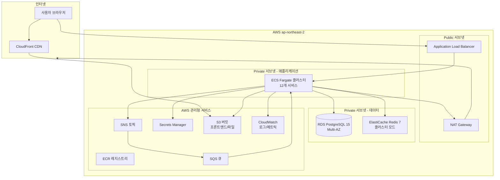
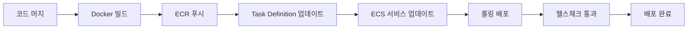

# AWS 프로덕션 인프라 가이드

> **최종 업데이트**: 2026-02-09
> **대상**: DevOps 엔지니어, 시스템 관리자

---

## 목차

- [1. 개요](#1-개요)
- [2. 아키텍처 개요](#2-아키텍처-개요)
- [3. 네트워킹 (VPC)](#3-네트워킹-vpc)
- [4. 컨테이너 오케스트레이션 (ECS Fargate)](#4-컨테이너-오케스트레이션-ecs-fargate)
- [5. 데이터베이스 (RDS PostgreSQL)](#5-데이터베이스-rds-postgresql)
- [6. 캐시 (ElastiCache Redis)](#6-캐시-elasticache-redis)
- [7. 로드밸런서 (ALB)](#7-로드밸런서-alb)
- [8. 메시징 (SNS/SQS)](#8-메시징-snssqs)
- [9. 프론트엔드 호스팅 (S3 + CloudFront)](#9-프론트엔드-호스팅-s3--cloudfront)
- [10. 컨테이너 레지스트리 (ECR)](#10-컨테이너-레지스트리-ecr)
- [11. 시크릿 관리](#11-시크릿-관리)
- [12. DNS 및 SSL](#12-dns-및-ssl)
- [13. 비용 예측](#13-비용-예측)
- [14. 배포 절차](#14-배포-절차)
- [15. 스케일링 전략](#15-스케일링-전략)
- [16. 재해 복구](#16-재해-복구)
- [17. 관련 문서](#17-관련-문서)

---

## 1. 개요

HR SaaS 플랫폼의 AWS 프로덕션 환경은 ECS Fargate를 기반으로 12개 마이크로서비스를 운영합니다. 모든 리소스는 `ap-northeast-2` (서울) 리전에 배포됩니다.

### 핵심 설계 원칙

| 원칙 | 구현 |
|------|------|
| **고가용성** | Multi-AZ 배포 (RDS, ElastiCache, ECS) |
| **보안** | Private 서브넷 배치, VPC 엔드포인트, 암호화 |
| **비용 최적화** | Fargate Spot, 예약 인스턴스, 자동 스케일링 |
| **관리 용이성** | 완전 관리형 서비스 (Fargate, RDS, ElastiCache) |
| **멀티테넌시** | 단일 인프라, RLS 기반 테넌트 격리 |

---

## 2. 아키텍처 개요



---

## 3. 네트워킹 (VPC)

### VPC 설계

| 항목 | 값 |
|------|------|
| VPC CIDR | `10.0.0.0/16` |
| 가용 영역 | `ap-northeast-2a`, `ap-northeast-2c` |

### 서브넷 구성

| 서브넷 | CIDR | AZ | 용도 |
|--------|------|-----|------|
| Public A | `10.0.1.0/24` | 2a | ALB, NAT Gateway |
| Public C | `10.0.2.0/24` | 2c | ALB (Multi-AZ) |
| Private App A | `10.0.10.0/24` | 2a | ECS Fargate |
| Private App C | `10.0.11.0/24` | 2c | ECS Fargate (Multi-AZ) |
| Private Data A | `10.0.20.0/24` | 2a | RDS, ElastiCache |
| Private Data C | `10.0.21.0/24` | 2c | RDS Standby, ElastiCache Replica |

### 보안 그룹

| 보안 그룹 | 인바운드 | 소스 |
|-----------|---------|------|
| `sg-alb` | 80, 443 | `0.0.0.0/0` |
| `sg-ecs` | 8081-8093 | `sg-alb` |
| `sg-rds` | 5432 | `sg-ecs` |
| `sg-redis` | 6379 | `sg-ecs` |

### VPC 엔드포인트 (비용 절감 + 보안)

| 엔드포인트 | 유형 | 용도 |
|-----------|------|------|
| `com.amazonaws.ap-northeast-2.ecr.dkr` | Interface | ECR 이미지 풀 |
| `com.amazonaws.ap-northeast-2.ecr.api` | Interface | ECR API |
| `com.amazonaws.ap-northeast-2.s3` | Gateway | S3 접근 |
| `com.amazonaws.ap-northeast-2.logs` | Interface | CloudWatch 로그 |
| `com.amazonaws.ap-northeast-2.secretsmanager` | Interface | 시크릿 접근 |
| `com.amazonaws.ap-northeast-2.sqs` | Interface | SQS 메시지 |
| `com.amazonaws.ap-northeast-2.sns` | Interface | SNS 발행 |

---

## 4. 컨테이너 오케스트레이션 (ECS Fargate)

### 클러스터 구성

| 항목 | 값 |
|------|------|
| 클러스터 이름 | `hr-saas-production` |
| 실행 모드 | AWS Fargate |
| 서브넷 | Private App (2a, 2c) |

### 서비스별 Task Definition

| 서비스 | vCPU | Memory | 최소 Task | 최대 Task | 우선순위 |
|--------|------|--------|----------|----------|---------|
| auth-service | 0.5 | 1 GB | 2 | 4 | 높음 |
| tenant-service | 0.5 | 1 GB | 1 | 2 | 중간 |
| organization-service | 0.5 | 1 GB | 2 | 4 | 높음 |
| employee-service | 0.5 | 1 GB | 2 | 4 | 높음 |
| attendance-service | 0.5 | 1 GB | 2 | 4 | 높음 |
| approval-service | 0.5 | 1 GB | 2 | 4 | 높음 |
| mdm-service | 0.5 | 1 GB | 1 | 2 | 중간 |
| notification-service | 0.5 | 1 GB | 1 | 2 | 중간 |
| file-service | 0.5 | 1 GB | 1 | 2 | 낮음 |
| appointment-service | 0.5 | 1 GB | 1 | 2 | 중간 |
| certificate-service | 0.25 | 0.5 GB | 1 | 2 | 낮음 |
| recruitment-service | 0.25 | 0.5 GB | 1 | 2 | 낮음 |

### Task Definition 환경변수

```json
{
  "environment": [
    { "name": "SPRING_PROFILES_ACTIVE", "value": "aws" },
    { "name": "DB_HOST", "value": "hr-saas-db.xxxx.ap-northeast-2.rds.amazonaws.com" },
    { "name": "DB_PORT", "value": "5432" },
    { "name": "REDIS_HOST", "value": "hr-saas-cache.xxxx.cache.amazonaws.com" },
    { "name": "REDIS_PORT", "value": "6379" },
    { "name": "SPRING_DATA_REDIS_SSL_ENABLED", "value": "true" },
    { "name": "AWS_REGION", "value": "ap-northeast-2" }
  ],
  "secrets": [
    { "name": "DB_USERNAME", "valueFrom": "arn:aws:secretsmanager:...:hr-saas/db:username::" },
    { "name": "DB_PASSWORD", "valueFrom": "arn:aws:secretsmanager:...:hr-saas/db:password::" },
    { "name": "REDIS_PASSWORD", "valueFrom": "arn:aws:secretsmanager:...:hr-saas/redis:password::" },
    { "name": "JWT_SECRET", "valueFrom": "arn:aws:secretsmanager:...:hr-saas/jwt:secret::" },
    { "name": "ENCRYPTION_KEY", "valueFrom": "arn:aws:secretsmanager:...:hr-saas/encryption:key::" }
  ]
}
```

### JVM 설정

Dockerfile에 정의된 JVM 옵션:

```bash
JAVA_OPTS="-XX:+UseContainerSupport \
    -XX:MaxRAMPercentage=75.0 \
    -XX:InitialRAMPercentage=50.0 \
    -XX:+UseG1GC \
    -XX:+UseStringDeduplication \
    -Djava.security.egd=file:/dev/./urandom"
```

| 옵션 | 설명 |
|------|------|
| `UseContainerSupport` | 컨테이너 메모리 제한 인식 |
| `MaxRAMPercentage=75.0` | 컨테이너 메모리의 75%를 JVM 힙으로 사용 |
| `UseG1GC` | G1 가비지 컬렉터 (지연 시간 최적화) |
| `UseStringDeduplication` | 중복 문자열 제거 (메모리 절약) |

### 헬스체크

```dockerfile
HEALTHCHECK --interval=30s --timeout=10s --start-period=60s --retries=3 \
    CMD wget --quiet --tries=1 --spider http://localhost:${SERVER_PORT}/actuator/health || exit 1
```

---

## 5. 데이터베이스 (RDS PostgreSQL)

### 인스턴스 구성

| 항목 | MVP | 프로덕션 |
|------|-----|---------|
| 엔진 | PostgreSQL 15 | PostgreSQL 15 |
| 인스턴스 클래스 | db.t3.medium | db.r6g.large |
| 스토리지 | 50 GB gp3 | 200 GB gp3 |
| Multi-AZ | 아니오 | 예 |
| 백업 보관 | 7일 | 35일 |
| 암호화 | KMS 기본 키 | KMS CMK |

### 파라미터 그룹

| 파라미터 | 값 | 설명 |
|---------|------|------|
| `max_connections` | `200` | HikariCP 총 풀 크기 (105) + 여유분 |
| `shared_buffers` | `{DBInstanceClassMemory/4}` | 메모리의 25% |
| `work_mem` | `16MB` | 정렬/해시 연산 메모리 |
| `effective_cache_size` | `{DBInstanceClassMemory*3/4}` | 메모리의 75% |
| `log_min_duration_statement` | `1000` | 1초 이상 쿼리 로그 |
| `rds.force_ssl` | `1` | SSL 강제 |

### 스키마 구조

서비스별 분리된 스키마를 사용합니다:

| 스키마 | 서비스 | 테이블 수 (예상) |
|--------|--------|--------------|
| `tenant_common` | auth, tenant | ~15 |
| `hr_core` | organization, employee, mdm | ~30 |
| `hr_attendance` | attendance | ~10 |
| `hr_approval` | approval | ~8 |
| `hr_audit` | auth (감사 로그) | ~3 |
| `hr_notification` | notification | ~5 |
| `hr_file` | file | ~3 |
| `hr_recruitment` | recruitment | ~10 |
| `hr_appointment` | appointment | ~5 |
| `hr_certificate` | certificate | ~5 |

### 커넥션 풀 전략 (HikariCP)

서비스별 차등 커넥션 풀 크기:

| 티어 | 서비스 | 풀 크기 | 합계 |
|------|--------|---------|------|
| High-traffic | auth, employee, organization | 20 | 60 |
| Standard | tenant, mdm | 10 | 20 |
| Batch-heavy | appointment | 15 | 15 |
| Low-traffic | certificate, recruitment | 5 | 10 |
| **합계** | | | **105** |

> PostgreSQL `max_connections=200`이 필요합니다. 상세 내용은 [DATABASE_PATTERNS.md](../architecture/DATABASE_PATTERNS.md) 참조

### 백업 및 복구

| 방법 | RPO | RTO | 비용 |
|------|-----|-----|------|
| 자동 백업 | 5분 (PITR) | ~30분 | 기본 포함 |
| 수동 스냅샷 | 스냅샷 시점 | ~30분 | 스토리지 비용 |
| Read Replica | 실시간 | 수 분 | 인스턴스 비용 |

---

## 6. 캐시 (ElastiCache Redis)

### 인스턴스 구성

| 항목 | MVP | 프로덕션 |
|------|-----|---------|
| 엔진 | Redis 7.x | Redis 7.x |
| 노드 유형 | cache.t3.micro | cache.r6g.large |
| 노드 수 | 1 | 2 (1 primary + 1 replica) |
| Multi-AZ | 아니오 | 예 (자동 장애 조치) |
| 전송 암호화 | 예 (TLS) | 예 (TLS) |
| 인증 | AUTH 토큰 | AUTH 토큰 |

### 캐시 용도

| 용도 | 키 패턴 | TTL |
|------|---------|-----|
| JWT 블랙리스트 | `token:blacklist:{token}` | 1800초 |
| 리프레시 토큰 | `token:refresh:{userId}` | 7일 |
| 세션 | `session:{accessToken}` | 24시간 |
| 테넌트 정보 | `tenant:{tenantId}:{id}` | 1시간 |
| 직원 정보 | `employee:{tenantId}:{id}` | 15분 |
| 공통 코드 | `mdm:commonCode:{tenantId}:{code}` | 24시간 |
| 조직 트리 | `organization:tree:{tenantId}` | 1시간 |
| 결재 양식 | `approval:template:{tenantId}:{id}` | 1시간 |

> 상세 캐시 전략은 [CACHING_STRATEGY.md](../architecture/CACHING_STRATEGY.md) 참조

---

## 7. 로드밸런서 (ALB)

### 구성

| 항목 | 값 |
|------|------|
| 유형 | Application Load Balancer |
| 스킴 | Internet-facing |
| 서브넷 | Public A, Public C |
| 보안 그룹 | `sg-alb` (80, 443) |

### 리스너 규칙

| 리스너 | 포트 | 규칙 |
|--------|------|------|
| HTTP | 80 | HTTPS로 리다이렉트 |
| HTTPS | 443 | 경로 기반 라우팅 |

### Target Group 매핑

| Target Group | 경로 패턴 | ECS 서비스 | 포트 |
|-------------|----------|-----------|------|
| tg-auth | `/api/v1/auth/*` | auth-service | 8081 |
| tg-tenant | `/api/v1/tenants/*` | tenant-service | 8082 |
| tg-org | `/api/v1/departments/*`, `/api/v1/positions/*`, `/api/v1/grades/*` | organization-service | 8083 |
| tg-employee | `/api/v1/employees/*`, `/api/v1/transfers/*` | employee-service | 8084 |
| tg-attendance | `/api/v1/attendances/*`, `/api/v1/leaves/*`, `/api/v1/overtimes/*` | attendance-service | 8085 |
| tg-approval | `/api/v1/approvals/*` | approval-service | 8086 |
| tg-mdm | `/api/v1/mdm/*`, `/api/v1/menus/*` | mdm-service | 8087 |
| tg-notification | `/api/v1/notifications/*` | notification-service | 8088 |
| tg-file | `/api/v1/files/*` | file-service | 8089 |
| tg-appointment | `/api/v1/appointments/*` | appointment-service | 8091 |
| tg-certificate | `/api/v1/certificates/*` | certificate-service | 8092 |
| tg-recruitment | `/api/v1/jobs/*`, `/api/v1/applications/*` | recruitment-service | 8093 |

### 헬스체크 설정

| 항목 | 값 |
|------|------|
| 경로 | `/actuator/health` |
| 프로토콜 | HTTP |
| 정상 임계값 | 3 |
| 비정상 임계값 | 2 |
| 타임아웃 | 10초 |
| 간격 | 30초 |

---

## 8. 메시징 (SNS/SQS)

### SNS 토픽

프로덕션에서는 LocalStack 대신 AWS 관리형 SNS를 사용합니다:

| 토픽 | 구독 큐 | 용도 |
|------|---------|------|
| `approval-completed` | attendance, appointment, employee | 결재 완료 후 후속 처리 |
| `approval-submitted` | notification | 결재 상신 알림 |
| `appointment-executed` | employee | 발령 실행 반영 |
| `employee-affiliation-changed` | organization | 소속 변경 반영 |
| `employee-created` | notification | 신규 직원 알림 |
| `leave-requested` | notification | 휴가 신청 알림 |
| `notification-send` | notification | 알림 발송 트리거 |

### SQS 큐

| 큐 | DLQ | 최대 재시도 | 가시성 타임아웃 |
|----|-----|-----------|--------------|
| `attendance-service-queue` | `attendance-service-dlq` | 3회 | 60초 |
| `appointment-service-queue` | `appointment-service-dlq` | 3회 | 60초 |
| `employee-service-queue` | `employee-service-dlq` | 3회 | 60초 |
| `organization-service-queue` | `organization-service-dlq` | 3회 | 60초 |
| `notification-service-queue` | `notification-service-dlq` | 3회 | 60초 |

### 로컬 → 프로덕션 전환

로컬(LocalStack)과 프로덕션(AWS) 환경 전환은 Spring 프로파일로 처리:

```yaml
# application-dev.yml (로컬)
spring.cloud.aws:
  sns.endpoint: http://localhost:4566
  sqs.endpoint: http://localhost:4566

# application-aws.yml (프로덕션)
spring.cloud.aws:
  region.static: ap-northeast-2
  # 엔드포인트 미설정 → AWS 기본 엔드포인트 사용
```

---

## 9. 프론트엔드 호스팅 (S3 + CloudFront)

### S3 버킷

| 항목 | 값 |
|------|------|
| 버킷 이름 | `hr-saas-frontend-{env}` |
| 리전 | `ap-northeast-2` |
| 정적 웹사이트 호스팅 | 활성화 |
| 버전 관리 | 활성화 |
| 암호화 | SSE-S3 |
| 퍼블릭 접근 | 차단 (CloudFront OAI만 허용) |

### CloudFront 배포

| 항목 | 값 |
|------|------|
| Origin | S3 버킷 |
| OAI | CloudFront Origin Access Identity |
| 캐시 정책 | Managed-CachingOptimized |
| 에러 페이지 | 404 → `/index.html` (SPA 라우팅) |
| SSL 인증서 | ACM (us-east-1) |
| 도메인 | `hr.example.com` |

---

## 10. 컨테이너 레지스트리 (ECR)

### 레포지토리 구성

서비스별 개별 ECR 레포지토리:

```
hr-saas/auth-service
hr-saas/tenant-service
hr-saas/organization-service
hr-saas/employee-service
hr-saas/attendance-service
hr-saas/approval-service
hr-saas/mdm-service
hr-saas/notification-service
hr-saas/file-service
hr-saas/appointment-service
hr-saas/certificate-service
hr-saas/recruitment-service
```

### 이미지 태깅

```bash
# 태그 규칙
{ecr-uri}/hr-saas/{service}:latest
{ecr-uri}/hr-saas/{service}:{git-sha}
{ecr-uri}/hr-saas/{service}:v{version}
```

### 이미지 빌드 및 푸시

```bash
# ECR 로그인
aws ecr get-login-password --region ap-northeast-2 | \
  docker login --username AWS --password-stdin {account-id}.dkr.ecr.ap-northeast-2.amazonaws.com

# 빌드 (ARM64 - Graviton 호환)
docker buildx build --platform linux/arm64 \
  --build-arg SERVICE_NAME=employee-service \
  -t {ecr-uri}/hr-saas/employee-service:latest \
  -f docker/Dockerfile.service .

# 푸시
docker push {ecr-uri}/hr-saas/employee-service:latest
```

### 수명 주기 정책

- 최근 10개 태그 이미지 보관
- 30일 초과 미태그 이미지 삭제

---

## 11. 시크릿 관리

### AWS Secrets Manager

| 시크릿 이름 | 키 | 용도 |
|-----------|------|------|
| `hr-saas/db` | `username`, `password` | PostgreSQL 인증 |
| `hr-saas/redis` | `password` | Redis AUTH 토큰 |
| `hr-saas/jwt` | `secret` | JWT 서명 키 |
| `hr-saas/encryption` | `key` | 개인정보 AES-GCM 암호화 키 |

### ECS에서 시크릿 참조

ECS Task Definition에서 Secrets Manager ARN을 직접 참조합니다:

```json
{
  "secrets": [
    {
      "name": "DB_PASSWORD",
      "valueFrom": "arn:aws:secretsmanager:ap-northeast-2:{account}:secret:hr-saas/db:password::"
    }
  ]
}
```

> **주의**: ECS Task Execution Role에 `secretsmanager:GetSecretValue` 권한이 필요합니다.

---

## 12. DNS 및 SSL

### Route 53

| 레코드 | 유형 | 대상 |
|--------|------|------|
| `hr.example.com` | A (Alias) | CloudFront 배포 |
| `api.hr.example.com` | A (Alias) | ALB |

### ACM (SSL 인증서)

| 도메인 | 리전 | 용도 |
|--------|------|------|
| `*.hr.example.com` | `us-east-1` | CloudFront (프론트엔드) |
| `*.hr.example.com` | `ap-northeast-2` | ALB (API) |

---

## 13. 비용 예측

### MVP 환경 (월간)

| 리소스 | 스펙 | 예상 비용 (USD) |
|--------|------|----------------|
| ECS Fargate | 7 tasks x 0.5 vCPU, 1GB | ~$80 |
| RDS PostgreSQL | db.t3.medium | ~$50 |
| ElastiCache Redis | cache.t3.micro | ~$15 |
| ALB | 1개 | ~$20 |
| S3 + CloudFront | 프론트엔드 | ~$5 |
| NAT Gateway | 1개 | ~$35 |
| ECR | 이미지 스토리지 | ~$5 |
| **합계** | | **~$210/월** |

### 프로덕션 환경 (월간)

| 리소스 | 스펙 | 예상 비용 (USD) |
|--------|------|----------------|
| ECS Fargate | 18 tasks (Multi-AZ) | ~$250 |
| RDS PostgreSQL | db.r6g.large Multi-AZ | ~$300 |
| ElastiCache Redis | cache.r6g.large (Primary + Replica) | ~$200 |
| ALB | 1개 | ~$30 |
| S3 + CloudFront | 프론트엔드 + 파일 | ~$20 |
| NAT Gateway | 2개 (Multi-AZ) | ~$70 |
| Secrets Manager | 5 시크릿 | ~$3 |
| CloudWatch | 로그/메트릭 | ~$50 |
| **합계** | | **~$923/월** |

---

## 14. 배포 절차

### 신규 배포 절차



### 서비스 배포 순서

배포 시 의존성을 고려하여 순서대로 배포합니다:

```
1단계: auth-service, tenant-service (인증/테넌트 기반)
2단계: mdm-service (기준정보)
3단계: organization-service, employee-service (핵심 HR)
4단계: attendance-service, approval-service (업무 프로세스)
5단계: notification-service, file-service (지원 서비스)
6단계: appointment-service, certificate-service, recruitment-service (확장 서비스)
```

### 롤백

```bash
# ECS 서비스를 이전 Task Definition으로 롤백
aws ecs update-service \
  --cluster hr-saas-production \
  --service employee-service \
  --task-definition employee-service:{이전-리비전} \
  --force-new-deployment
```

---

## 15. 스케일링 전략

### ECS Auto Scaling

| 메트릭 | 목표값 | 스케일 아웃 | 스케일 인 |
|--------|--------|-----------|----------|
| CPU 사용률 | 70% | +1 task | -1 task |
| 메모리 사용률 | 80% | +1 task | -1 task |

### RDS 스케일링

- **수직 스케일링**: 인스턴스 클래스 업그레이드 (다운타임 필요)
- **읽기 스케일링**: Read Replica 추가 (보고/분석 쿼리 분리)
- **스토리지**: gp3 자동 확장 설정

### ElastiCache 스케일링

- **수직 스케일링**: 노드 유형 업그레이드
- **수평 스케일링**: 클러스터 모드 활성화로 샤딩

---

## 16. 재해 복구

### RPO/RTO 목표

| 항목 | RPO (데이터 손실) | RTO (복구 시간) |
|------|-----------------|----------------|
| 데이터베이스 | 5분 | 30분 |
| 캐시 | 즉시 재생성 | 5분 |
| 애플리케이션 | 0 (Stateless) | 5분 |
| 프론트엔드 | 0 (S3 버전관리) | 5분 |

### 복구 절차

1. **RDS 장애**: Multi-AZ 자동 장애 조치 (DNS 자동 전환)
2. **ElastiCache 장애**: Replica 자동 승격
3. **ECS 장애**: Auto Scaling이 새 Task 자동 생성
4. **AZ 장애**: Multi-AZ 배포로 자동 전환
5. **리전 장애**: 수동 복구 (Cross-Region 백업에서 복원)

---

## 17. 관련 문서

| 문서 | 설명 |
|------|------|
| [DOCKER_GUIDE.md](./DOCKER_GUIDE.md) | 로컬 개발 환경 가이드 |
| [DATABASE_PATTERNS.md](../architecture/DATABASE_PATTERNS.md) | HikariCP 커넥션 풀 전략 |
| [MULTI_TENANCY.md](../architecture/MULTI_TENANCY.md) | PostgreSQL RLS 멀티테넌시 |
| [SECURITY_PATTERNS.md](../architecture/SECURITY_PATTERNS.md) | 보안 패턴 |
| [CACHING_STRATEGY.md](../architecture/CACHING_STRATEGY.md) | Redis 캐싱 전략 |
