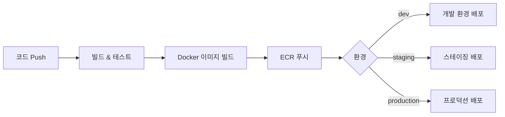

# CI/CD 파이프라인 가이드

> **최종 업데이트**: 2026-02-09
> **대상**: DevOps 엔지니어, 백엔드 개발자

---

## 목차

- [1. 개요](#1-개요)
- [2. 파이프라인 아키텍처](#2-파이프라인-아키텍처)
- [3. Gradle 빌드](#3-gradle-빌드)
- [4. Docker 이미지 빌드](#4-docker-이미지-빌드)
- [5. GitHub Actions 워크플로우](#5-github-actions-워크플로우)
- [6. 품질 게이트](#6-품질-게이트)
- [7. 배포 전략](#7-배포-전략)
- [8. 환경별 배포](#8-환경별-배포)
- [9. 시크릿 관리](#9-시크릿-관리)
- [10. 롤백 절차](#10-롤백-절차)
- [11. 관련 문서](#11-관련-문서)

---

## 1. 개요

HR SaaS 플랫폼의 CI/CD 파이프라인은 GitHub Actions를 기반으로 자동화된 빌드, 테스트, 배포 프로세스를 제공합니다.

### 파이프라인 흐름



---

## 2. 파이프라인 아키텍처

### 트리거 규칙

| 이벤트 | 브랜치 | 동작 |
|--------|--------|------|
| Push | `feature/*` | 빌드 + 단위 테스트 |
| PR | `master` | 빌드 + 테스트 + 품질 게이트 |
| Merge | `master` | 빌드 + 테스트 + Docker 빌드 + Dev 배포 |
| Tag | `v*` | 빌드 + 테스트 + Docker 빌드 + Staging/Prod 배포 |

### 서비스 감지 (변경된 서비스만 빌드)

```yaml
# 변경된 경로에 따라 영향받는 서비스 식별
paths:
  common/**:      → 전체 서비스 빌드
  services/auth-service/**:  → auth-service만 빌드
  services/employee-service/**:  → employee-service만 빌드
```

---

## 3. Gradle 빌드

### 멀티 모듈 구조

```
hr-platform/
├── build.gradle          # 루트 빌드 설정
├── settings.gradle       # 모듈 정의
├── common/               # 공통 모듈 (9개)
└── services/             # 서비스 모듈 (12개)
```

### 주요 빌드 명령

```bash
# 전체 빌드 (테스트 포함)
./gradlew build

# 테스트 제외 빌드
./gradlew build -x test

# 특정 서비스만 빌드
./gradlew :services:employee-service:bootJar

# 전체 테스트
./gradlew test

# 커버리지 리포트
./gradlew jacocoTestReport

# 의존성 확인
./gradlew :services:employee-service:dependencies
```

### 빌드 캐시

Gradle 빌드 캐시를 활용하여 반복 빌드 시간을 단축합니다:

```yaml
# GitHub Actions에서 Gradle 캐시
- uses: actions/cache@v3
  with:
    path: |
      ~/.gradle/caches
      ~/.gradle/wrapper
    key: ${{ runner.os }}-gradle-${{ hashFiles('**/*.gradle*') }}
```

---

## 4. Docker 이미지 빌드

### 멀티 스테이지 빌드

`docker/Dockerfile.service`를 사용하여 모든 서비스의 Docker 이미지를 빌드합니다:

```bash
# 단일 서비스 빌드
docker build \
  --build-arg SERVICE_NAME=employee-service \
  -t hr-saas/employee-service:latest \
  -f docker/Dockerfile.service .

# ARM64 (AWS Graviton) 크로스 빌드
docker buildx build \
  --platform linux/arm64 \
  --build-arg SERVICE_NAME=employee-service \
  -t {ecr-uri}/hr-saas/employee-service:latest \
  -f docker/Dockerfile.service .
```

### 이미지 태깅 규칙

| 태그 | 용도 | 예시 |
|------|------|------|
| `latest` | 최신 master 빌드 | `hr-saas/employee-service:latest` |
| `{git-sha}` | 특정 커밋 추적 | `hr-saas/employee-service:abc1234` |
| `v{version}` | 릴리스 버전 | `hr-saas/employee-service:v1.0.0` |

### ECR 푸시

```bash
# ECR 로그인
aws ecr get-login-password --region ap-northeast-2 | \
  docker login --username AWS --password-stdin {account-id}.dkr.ecr.ap-northeast-2.amazonaws.com

# 이미지 태그 및 푸시
docker tag hr-saas/employee-service:latest \
  {ecr-uri}/hr-saas/employee-service:latest
docker push {ecr-uri}/hr-saas/employee-service:latest
```

---

## 5. GitHub Actions 워크플로우

### 빌드 + 테스트 워크플로우 예시

```yaml
name: Build and Test

on:
  push:
    branches: [master, 'feature/**']
  pull_request:
    branches: [master]

jobs:
  build:
    runs-on: ubuntu-latest

    services:
      postgres:
        image: postgres:15-alpine
        env:
          POSTGRES_USER: hr_saas
          POSTGRES_PASSWORD: hr_saas_password
          POSTGRES_DB: hr_saas
        ports: ['5432:5432']
        options: >-
          --health-cmd pg_isready
          --health-interval 10s
          --health-timeout 5s
          --health-retries 5

      redis:
        image: redis:7-alpine
        ports: ['6379:6379']

    steps:
      - uses: actions/checkout@v4

      - name: Java 17 설정
        uses: actions/setup-java@v4
        with:
          java-version: '17'
          distribution: 'corretto'

      - name: Gradle 캐시
        uses: actions/cache@v3
        with:
          path: ~/.gradle/caches
          key: ${{ runner.os }}-gradle-${{ hashFiles('**/*.gradle*') }}

      - name: 빌드 및 테스트
        run: ./gradlew build

      - name: 커버리지 리포트
        run: ./gradlew jacocoTestReport

      - name: 커버리지 업로드
        uses: actions/upload-artifact@v4
        with:
          name: coverage-report
          path: '**/build/reports/jacoco/'
```

### 배포 워크플로우 예시

```yaml
name: Deploy

on:
  push:
    branches: [master]
    tags: ['v*']

jobs:
  deploy:
    runs-on: ubuntu-latest
    steps:
      - uses: actions/checkout@v4

      - name: AWS 인증
        uses: aws-actions/configure-aws-credentials@v4
        with:
          role-to-assume: ${{ secrets.AWS_DEPLOY_ROLE }}
          aws-region: ap-northeast-2

      - name: ECR 로그인
        uses: aws-actions/amazon-ecr-login@v2

      - name: 변경된 서비스 감지
        id: changes
        run: |
          # Git diff로 변경된 서비스 목록 생성
          echo "services=$(./scripts/detect-changes.sh)" >> $GITHUB_OUTPUT

      - name: Docker 빌드 & 푸시
        run: |
          for service in ${{ steps.changes.outputs.services }}; do
            docker buildx build \
              --platform linux/arm64 \
              --build-arg SERVICE_NAME=$service \
              -t $ECR_REGISTRY/hr-saas/$service:${{ github.sha }} \
              -f docker/Dockerfile.service . --push
          done

      - name: ECS 서비스 업데이트
        run: |
          for service in ${{ steps.changes.outputs.services }}; do
            aws ecs update-service \
              --cluster hr-saas-production \
              --service $service \
              --force-new-deployment
          done
```

---

## 6. 품질 게이트

### 테스트

| 유형 | 도구 | 목표 커버리지 |
|------|------|-------------|
| 단위 테스트 | JUnit 5 + Mockito | 80% |
| 통합 테스트 | Testcontainers | 핵심 경로 |
| API 테스트 | REST Assured | 전체 엔드포인트 |

### 코드 품질

| 항목 | 도구/규칙 | 기준 |
|------|----------|------|
| 코딩 스타일 | Google Java Style | PR에서 검사 |
| 커버리지 | JaCoCo | 80% 이상 |
| 보안 취약점 | OWASP Dependency Check | 심각 0건 |

### 테스트 명명 규칙

```java
// {메서드}_{시나리오}_{기대결과}
@Test
void getById_whenEmployeeExists_returnsEmployee() { }

@Test
void create_withDuplicateEmail_throwsConflictException() { }
```

---

## 7. 배포 전략

### 롤링 배포 (ECS)

```
기존 Task: [A] [A]
배포 시작: [A] [A] [B]     ← 새 Task 추가
헬스체크:  [A] [A] [B✓]    ← B 헬스체크 통과
드레인:    [A] [B✓]        ← 기존 A 제거
완료:      [B] [B]         ← 전체 교체
```

### 배포 파라미터 (ECS)

| 파라미터 | 값 | 설명 |
|---------|------|------|
| `minimumHealthyPercent` | 100% | 배포 중 최소 건강한 Task 비율 |
| `maximumPercent` | 200% | 배포 중 최대 Task 비율 |
| `healthCheckGracePeriodSeconds` | 60 | 시작 후 헬스체크 유예 시간 |

---

## 8. 환경별 배포

### 환경 구성

| 환경 | 트리거 | Spring 프로파일 | ECS 클러스터 |
|------|--------|----------------|-------------|
| **dev** | master push | `dev` | `hr-saas-dev` |
| **staging** | `v*-rc*` 태그 | `staging` | `hr-saas-staging` |
| **production** | `v*` 태그 | `aws` | `hr-saas-production` |

### 배포 순서

```
1단계: auth, tenant (인증/테넌트 기반)
2단계: mdm (기준정보)
3단계: organization, employee (핵심 HR)
4단계: attendance, approval (업무 프로세스)
5단계: notification, file (지원 서비스)
6단계: appointment, certificate, recruitment (확장 서비스)
```

---

## 9. 시크릿 관리

### GitHub Actions Secrets

| Secret | 용도 |
|--------|------|
| `AWS_DEPLOY_ROLE` | OIDC 기반 AWS IAM Role ARN |
| `ECR_REGISTRY` | ECR 레지스트리 URI |

### 런타임 시크릿 (AWS Secrets Manager)

| Secret | 키 |
|--------|------|
| `hr-saas/db` | `username`, `password` |
| `hr-saas/redis` | `password` |
| `hr-saas/jwt` | `secret` |
| `hr-saas/encryption` | `key` |

> 상세 내용은 [AWS_INFRASTRUCTURE.md](./AWS_INFRASTRUCTURE.md) 참조

---

## 10. 롤백 절차

### ECS 롤백

```bash
# 이전 Task Definition으로 롤백
aws ecs update-service \
  --cluster hr-saas-production \
  --service employee-service \
  --task-definition employee-service:{이전-리비전} \
  --force-new-deployment
```

### 데이터베이스 롤백

Flyway는 롤백을 지원하지 않으므로, 수동 대응이 필요합니다:

```bash
# 1. 문제 파악
./gradlew :services:employee-service:flywayInfo

# 2. 보정 마이그레이션 작성
# V{N+1}__revert_{feature}.sql

# 3. 적용
./gradlew :services:employee-service:flywayMigrate
```

---

## 11. 관련 문서

| 문서 | 설명 |
|------|------|
| [DOCKER_GUIDE.md](./DOCKER_GUIDE.md) | 로컬 개발 환경 (Docker Compose) |
| [AWS_INFRASTRUCTURE.md](./AWS_INFRASTRUCTURE.md) | AWS 프로덕션 인프라 |
| [MONITORING.md](./MONITORING.md) | 모니터링 및 알림 |
| [DATABASE_PATTERNS.md](../architecture/DATABASE_PATTERNS.md) | Flyway 마이그레이션 패턴 |
