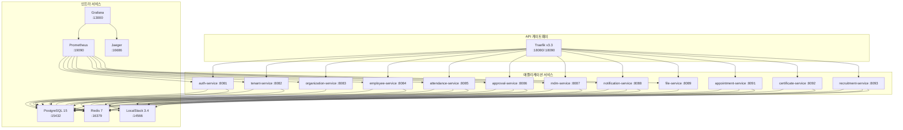
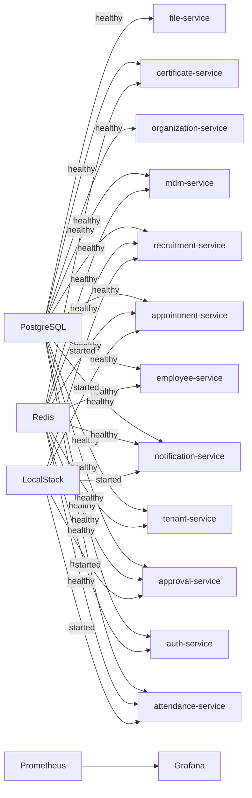

# Docker 로컬 개발 환경 가이드

> **최종 업데이트**: 2026-02-09
> **대상**: 백엔드/프론트엔드 개발자, DevOps 엔지니어

---

## 목차

- [1. 개요](#1-개요)
- [2. 사전 요구사항](#2-사전-요구사항)
- [3. 빠른 시작](#3-빠른-시작)
- [4. 인프라 서비스](#4-인프라-서비스)
- [5. 애플리케이션 서비스](#5-애플리케이션-서비스)
- [6. API 게이트웨이 (Traefik)](#6-api-게이트웨이-traefik)
- [7. 환경변수 설정](#7-환경변수-설정)
- [8. 포트 매핑](#8-포트-매핑)
- [9. 네트워크 구성](#9-네트워크-구성)
- [10. 볼륨 및 데이터 관리](#10-볼륨-및-데이터-관리)
- [11. 서비스 시작 순서와 의존성](#11-서비스-시작-순서와-의존성)
- [12. 개별 서비스 실행](#12-개별-서비스-실행)
- [13. 모니터링 도구](#13-모니터링-도구)
- [14. 트러블슈팅](#14-트러블슈팅)
- [15. 자주 사용하는 명령어](#15-자주-사용하는-명령어)
- [16. 관련 문서](#16-관련-문서)

---

## 1. 개요

HR SaaS 플랫폼의 로컬 개발 환경은 Docker Compose로 구성됩니다. 전체 인프라(PostgreSQL, Redis, LocalStack, Jaeger, Prometheus, Grafana)와 12개 마이크로서비스를 단일 명령으로 실행할 수 있습니다.

### 아키텍처 다이어그램



---

## 2. 사전 요구사항

### 필수 소프트웨어

| 소프트웨어 | 최소 버전 | 확인 명령 |
|-----------|----------|----------|
| Docker Desktop | 4.25+ | `docker --version` |
| Docker Compose | 2.20+ | `docker compose version` |
| Java (JDK) | 17 | `java -version` |
| Gradle | 8.x | `./gradlew --version` |
| Git | 2.x | `git --version` |

### 시스템 리소스

Docker Desktop에서 다음 최소 리소스를 할당해야 합니다:

| 리소스 | 최소값 | 권장값 |
|--------|-------|-------|
| CPU | 4 코어 | 6+ 코어 |
| Memory | 8 GB | 12+ GB |
| Disk | 20 GB | 40+ GB |

> **Windows 사용자**: Docker Desktop > Settings > Resources에서 WSL2 메모리 제한을 확인하세요.

---

## 3. 빠른 시작

### 전체 환경 시작

```bash
# 1. 프로젝트 루트에서 Docker 디렉토리로 이동
cd docker

# 2. 인프라 서비스만 시작 (권장 - 백엔드는 IDE에서 실행)
docker compose up -d postgres redis localstack jaeger prometheus grafana traefik

# 3. 전체 서비스 시작 (빌드 포함)
docker compose up -d --build

# 4. 상태 확인
docker compose ps
```

### 전체 환경 중지

```bash
# 서비스 중지 (데이터 보존)
docker compose down

# 서비스 중지 + 볼륨 삭제 (클린 리셋)
docker compose down -v
```

### 로그 확인

```bash
# 전체 로그
docker compose logs -f

# 특정 서비스 로그
docker compose logs -f employee-service

# 최근 100줄만
docker compose logs --tail=100 employee-service
```

---

## 4. 인프라 서비스

### 4.1 PostgreSQL 15

| 항목 | 값 |
|------|------|
| 이미지 | `postgres:15-alpine` |
| 컨테이너 이름 | `hr-saas-postgres` |
| 호스트 포트 | `15432` (내부 5432) |
| 사용자 | `hr_saas` |
| 비밀번호 | `hr_saas_password` |
| 데이터베이스 | `hr_saas` |

#### 초기화 스크립트 (`docker/postgres/init.sql`)

PostgreSQL 컨테이너 최초 시작 시 자동 실행되는 초기화 스크립트:

```sql
-- 10개 스키마 생성
CREATE SCHEMA IF NOT EXISTS tenant_common;
CREATE SCHEMA IF NOT EXISTS hr_core;
CREATE SCHEMA IF NOT EXISTS hr_attendance;
CREATE SCHEMA IF NOT EXISTS hr_approval;
CREATE SCHEMA IF NOT EXISTS hr_audit;
CREATE SCHEMA IF NOT EXISTS hr_notification;
CREATE SCHEMA IF NOT EXISTS hr_file;
CREATE SCHEMA IF NOT EXISTS hr_recruitment;
CREATE SCHEMA IF NOT EXISTS hr_appointment;
CREATE SCHEMA IF NOT EXISTS hr_certificate;

-- 확장 기능 활성화
CREATE EXTENSION IF NOT EXISTS "uuid-ossp";
CREATE EXTENSION IF NOT EXISTS "pgcrypto";

-- RLS 관련 함수 생성
-- set_tenant_context(): 테넌트 컨텍스트 설정
-- get_current_tenant(): 현재 테넌트 ID 조회
-- update_updated_at_column(): 자동 타임스탬프 트리거
```

#### 접속 방법

```bash
# Docker 내부 psql
docker exec -it hr-saas-postgres psql -U hr_saas -d hr_saas

# 호스트에서 접속 (GUI 도구 사용 시)
# Host: localhost
# Port: 15432
# Database: hr_saas
# Username: hr_saas
# Password: hr_saas_password
```

#### 스키마별 서비스 매핑

| 스키마 | 서비스 | 설명 |
|--------|--------|------|
| `tenant_common` | auth, tenant | 인증, 테넌트 공통 |
| `hr_core` | organization, employee, mdm | 조직, 인사, 기준정보 |
| `hr_attendance` | attendance | 근태/휴가 |
| `hr_approval` | approval | 전자결재 |
| `hr_audit` | - | 감사 로그 |
| `hr_notification` | notification | 알림 |
| `hr_file` | file | 파일 관리 |
| `hr_recruitment` | recruitment | 채용 |
| `hr_appointment` | appointment | 발령 |
| `hr_certificate` | certificate | 증명서 |

### 4.2 Redis 7

| 항목 | 값 |
|------|------|
| 이미지 | `redis:7-alpine` |
| 플랫폼 | `linux/amd64` |
| 컨테이너 이름 | `hr-saas-redis` |
| 호스트 포트 | `16379` (내부 6379) |
| 비밀번호 | `redis_password` |

#### 접속 방법

```bash
# Docker 내부 Redis CLI
docker exec -it hr-saas-redis redis-cli -a redis_password

# 기본 명령
PING          # PONG 응답 확인
KEYS *        # 전체 키 조회 (개발 환경만)
INFO memory   # 메모리 사용량
```

#### 용도

- JWT 토큰 블랙리스트 (`token:blacklist:{token}`)
- 리프레시 토큰 저장 (`token:refresh:{userId}`)
- 세션 관리 (`session:{accessToken}`)
- 엔티티 캐시 (`employee:{tenantId}:{id}`, `tenant:{id}` 등)
- 공통코드 캐시 (`mdm:commonCode:{tenantId}:{code}`)

> 상세 캐시 키 전략은 [CACHING_STRATEGY.md](../architecture/CACHING_STRATEGY.md) 참조

### 4.3 LocalStack 3.4 (AWS SNS/SQS 에뮬레이션)

| 항목 | 값 |
|------|------|
| 이미지 | `localstack/localstack:3.4` |
| 컨테이너 이름 | `hr-saas-localstack` |
| 호스트 포트 | `14566` |
| 활성 서비스 | `sns, sqs` |
| 리전 | `ap-northeast-2` |

#### 초기화 리소스 (`docker/localstack/init-aws.sh`)

컨테이너 시작 시 자동으로 생성되는 SNS 토픽과 SQS 큐:

**SNS 토픽 (7개)**:
| 토픽 | 이벤트 |
|------|--------|
| `approval-completed` | 결재 완료 |
| `approval-submitted` | 결재 상신 |
| `appointment-executed` | 발령 실행 |
| `employee-affiliation-changed` | 소속 변경 |
| `employee-created` | 직원 생성 |
| `leave-requested` | 휴가 신청 |
| `notification-send` | 알림 발송 |

**SQS 큐 (5개 + DLQ 5개)**:
| 큐 | 소비 서비스 |
|----|-----------|
| `attendance-service-queue` | 근태 서비스 |
| `appointment-service-queue` | 발령 서비스 |
| `employee-service-queue` | 인사 서비스 |
| `organization-service-queue` | 조직 서비스 |
| `notification-service-queue` | 알림 서비스 |

**SNS → SQS 구독 매핑**:
```
approval-completed → attendance-service-queue
                   → appointment-service-queue
                   → employee-service-queue

appointment-executed → employee-service-queue

employee-affiliation-changed → organization-service-queue

approval-submitted → notification-service-queue
leave-requested → notification-service-queue
employee-created → notification-service-queue
```

#### 검증 명령

```bash
# 토픽 목록 확인
docker exec hr-saas-localstack awslocal sns list-topics

# 큐 목록 확인
docker exec hr-saas-localstack awslocal sqs list-queues

# 구독 목록 확인
docker exec hr-saas-localstack awslocal sns list-subscriptions
```

### 4.4 Jaeger (분산 추적)

| 항목 | 값 |
|------|------|
| 이미지 | `jaegertracing/all-in-one:1.52` |
| 컨테이너 이름 | `hr-saas-jaeger` |
| UI 포트 | `16686` |
| OTLP gRPC 포트 | `14317` |
| OTLP HTTP 포트 | `14318` |

#### 접속

- **Jaeger UI**: http://localhost:16686
- 서비스별 트레이스, 의존성 그래프 확인 가능

### 4.5 Prometheus (메트릭 수집)

| 항목 | 값 |
|------|------|
| 이미지 | `prom/prometheus:v2.48.0` |
| 컨테이너 이름 | `hr-saas-prometheus` |
| 호스트 포트 | `19090` (내부 9090) |

#### 스크랩 대상

Prometheus는 15초 간격으로 각 서비스의 `/actuator/prometheus` 엔드포인트에서 메트릭을 수집합니다:

| 대상 | 엔드포인트 |
|------|-----------|
| Traefik | `host.docker.internal:8090` |
| auth-service | `host.docker.internal:8081/actuator/prometheus` |
| tenant-service | `host.docker.internal:8082/actuator/prometheus` |
| organization-service | `host.docker.internal:8083/actuator/prometheus` |
| employee-service | `host.docker.internal:8084/actuator/prometheus` |
| attendance-service | `host.docker.internal:8085/actuator/prometheus` |
| approval-service | `host.docker.internal:8086/actuator/prometheus` |
| mdm-service | `host.docker.internal:8087/actuator/prometheus` |
| notification-service | `host.docker.internal:8088/actuator/prometheus` |
| file-service | `host.docker.internal:8089/actuator/prometheus` |

#### 접속

- **Prometheus UI**: http://localhost:19090
- 주요 PromQL 쿼리는 [MONITORING.md](./MONITORING.md) (Phase 2 생성 예정) 참조

### 4.6 Grafana (모니터링 대시보드)

| 항목 | 값 |
|------|------|
| 이미지 | `grafana/grafana:10.2.0` |
| 컨테이너 이름 | `hr-saas-grafana` |
| 호스트 포트 | `13000` |
| 관리자 계정 | `admin / admin` |

#### 자동 프로비저닝된 데이터소스

| 데이터소스 | 유형 | URL |
|-----------|------|-----|
| Prometheus | prometheus | `http://prometheus:9090` (기본) |
| Jaeger | jaeger | `http://jaeger:16686` |

#### 접속

- **Grafana UI**: http://localhost:13000 (admin/admin)

---

## 5. 애플리케이션 서비스

### 서비스 목록 및 의존성

| 서비스 | 포트 | PostgreSQL | Redis | LocalStack | Traefik 라우팅 |
|--------|------|:----------:|:-----:|:----------:|---------------|
| auth-service | 8081 | O | O | - | `/api/v1/auth` |
| tenant-service | 8082 | O | O | - | `/api/v1/tenants` |
| organization-service | 8083 | O | - | - | `/api/v1/departments`, `/api/v1/positions`, `/api/v1/grades`, `/api/v1/announcements`, `/api/v1/committees`, `/api/v1/headcounts` |
| employee-service | 8084 | O | O | - | `/api/v1/employees`, `/api/v1/transfers`, `/api/v1/condolences`, `/api/v1/employee-cards`, `/api/v1/profile` |
| attendance-service | 8085 | O | O | O | `/api/v1/attendances`, `/api/v1/leaves`, `/api/v1/overtimes` |
| approval-service | 8086 | O | O | O | `/api/v1/approvals` |
| mdm-service | 8087 | O | O | - | `/api/v1/mdm`, `/api/v1/menus`, `/api/v1/admin/menus` |
| notification-service | 8088 | O | O | O | `/api/v1/notifications`, `/api/v1/announcements`, `/api/v1/help` |
| file-service | 8089 | O | - | - | `/api/v1/files` |
| appointment-service | 8091 | O | O | O | `/api/v1/appointments` |
| certificate-service | 8092 | O | O | - | `/api/v1/certificates` |
| recruitment-service | 8093 | O | O | O | `/api/v1/jobs`, `/api/v1/applications`, `/api/v1/interviews`, `/api/v1/offers` |

### 빌드 설정 (Dockerfile.service)

모든 서비스는 동일한 멀티 스테이지 `Dockerfile.service`를 사용합니다:

```dockerfile
# Stage 1: 빌드 (Amazon Corretto 17)
FROM amazoncorretto:17-alpine3.18 AS builder
# Gradle 래퍼로 서비스별 bootJar 생성
# Spring Boot layer extract로 캐시 최적화

# Stage 2: 런타임
FROM amazoncorretto:17-alpine3.18 AS runtime
# 비root 사용자 (appuser:appgroup)
# JVM 옵션: G1GC, 컨테이너 메모리 제한 인식
# 헬스체크: /actuator/health
```

#### 공통 환경변수 (`x-common-env`)

docker-compose.yml에서 모든 서비스가 공유하는 환경변수:

| 변수 | 값 | 설명 |
|------|------|------|
| `SPRING_PROFILES_ACTIVE` | `dev` | Spring 프로파일 |
| `DB_HOST` | `postgres` | DB 호스트 (Docker 네트워크) |
| `DB_PORT` | `5432` | DB 포트 |
| `DB_USERNAME` | `hr_saas` | DB 사용자 |
| `DB_PASSWORD` | `hr_saas_password` | DB 비밀번호 |
| `REDIS_HOST` | `redis` | Redis 호스트 |
| `REDIS_PORT` | `6379` | Redis 포트 (내부) |
| `REDIS_PASSWORD` | `redis_password` | Redis 비밀번호 |
| `SPRING_DATA_REDIS_SSL_ENABLED` | `false` | Redis SSL 비활성화 |
| `AWS_REGION` | `ap-northeast-2` | AWS 리전 |
| `AWS_ACCESS_KEY_ID` | `test` | LocalStack 테스트 키 |
| `AWS_SECRET_ACCESS_KEY` | `test` | LocalStack 테스트 시크릿 |
| `AWS_SNS_ENDPOINT` | `http://localstack:4566` | SNS 엔드포인트 |
| `AWS_SQS_ENDPOINT` | `http://localstack:4566` | SQS 엔드포인트 |
| `JWT_SECRET` | `hr-saas-jwt-secret-key-...` | JWT 시크릿 키 |

---

## 6. API 게이트웨이 (Traefik)

### 구성

| 항목 | 값 |
|------|------|
| 이미지 | `traefik:v3.3` |
| 컨테이너 이름 | `hr-saas-traefik` |
| 웹 포트 | `18080` (내부 8080) |
| 대시보드 포트 | `18090` (내부 8090) |

### 라우팅 규칙

Traefik은 URL 경로 기반으로 요청을 각 서비스로 라우팅합니다:

| 경로 패턴 | 대상 서비스 |
|-----------|-----------|
| `/api/v1/auth` | auth-service:8081 |
| `/api/v1/tenants` | tenant-service:8082 |
| `/api/v1/departments`, `/api/v1/positions`, `/api/v1/grades` | organization-service:8083 |
| `/api/v1/employees`, `/api/v1/transfers`, `/api/v1/condolences` | employee-service:8084 |
| `/api/v1/attendances`, `/api/v1/leaves`, `/api/v1/overtimes` | attendance-service:8085 |
| `/api/v1/approvals` | approval-service:8086 |
| `/api/v1/mdm`, `/api/v1/menus` | mdm-service:8087 |
| `/api/v1/notifications` | notification-service:8088 |
| `/api/v1/files` | file-service:8089 |
| `/api/v1/appointments` | appointment-service:8091 |
| `/api/v1/certificates` | certificate-service:8092 |
| `/api/v1/jobs`, `/api/v1/applications`, `/api/v1/interviews` | recruitment-service:8093 |

### 미들웨어

**CORS 설정** (`middlewares.yml`):
- 허용 Origin: `*` (개발 환경)
- 허용 메서드: `GET, POST, PUT, DELETE, PATCH, OPTIONS`
- 허용 헤더: `Authorization, Content-Type, X-Tenant-ID, X-Request-ID`
- Max Age: 3600초

**레이트 리밋**:
| 미들웨어 | 평균 (req/s) | 버스트 |
|---------|-------------|-------|
| `rate-limit` (일반) | 100 | 200 |
| `rate-limit-auth` (인증) | 10 | 20 |

### 대시보드 접속

- **Traefik Dashboard**: http://localhost:18090

---

## 7. 환경변수 설정

### `.env.example` 파일

`docker/.env.example` 파일을 `docker/.env`로 복사하여 사용합니다:

```bash
cp docker/.env.example docker/.env
```

| 변수 | 기본값 | 설명 |
|------|--------|------|
| `POSTGRES_USER` | `hr_saas` | PostgreSQL 사용자명 |
| `POSTGRES_PASSWORD` | `hr_saas_password` | PostgreSQL 비밀번호 |
| `POSTGRES_DB` | `hr_saas` | 데이터베이스 이름 |
| `REDIS_PASSWORD` | `redis_password` | Redis 비밀번호 |
| `GF_SECURITY_ADMIN_USER` | `admin` | Grafana 관리자 ID |
| `GF_SECURITY_ADMIN_PASSWORD` | `admin` | Grafana 관리자 비밀번호 |
| `ENCRYPTION_KEY` | (Base64 인코딩) | 개인정보 암호화 키 |

> **주의**: `.env` 파일은 절대 Git에 커밋하지 마세요. `.gitignore`에 포함되어 있습니다.

---

## 8. 포트 매핑

### 전체 포트 맵

| 서비스 | 호스트 포트 | 컨테이너 포트 | 비고 |
|--------|-----------|-------------|------|
| PostgreSQL | **15432** | 5432 | 로컬 PostgreSQL과 충돌 방지 |
| Redis | **16379** | 6379 | 로컬 Redis와 충돌 방지 |
| LocalStack | **14566** | 4566 | SNS/SQS |
| Jaeger UI | **16686** | 16686 | 분산 추적 UI |
| Jaeger OTLP gRPC | **14317** | 4317 | 트레이스 수집 |
| Jaeger OTLP HTTP | **14318** | 4318 | 트레이스 수집 |
| Prometheus | **19090** | 9090 | 충돌 방지 |
| Grafana | **13000** | 3000 | 모니터링 대시보드 |
| Traefik 웹 | **18080** | 8080 | API 게이트웨이 |
| Traefik 대시보드 | **18090** | 8090 | 라우팅 대시보드 |
| auth-service | **8081** | 8081 | |
| tenant-service | **8082** | 8082 | |
| organization-service | **8083** | 8083 | |
| employee-service | **8084** | 8084 | |
| attendance-service | **8085** | 8085 | |
| approval-service | **8086** | 8086 | |
| mdm-service | **8087** | 8087 | |
| notification-service | **8088** | 8088 | |
| file-service | **8089** | 8089 | |
| appointment-service | **8091** | 8091 | |
| certificate-service | **8092** | 8092 | |
| recruitment-service | **8093** | 8093 | |

> **참고**: PostgreSQL(15432), Redis(16379), Prometheus(19090)은 로컬에 이미 설치된 동일 소프트웨어와의 포트 충돌을 방지하기 위해 비표준 포트를 사용합니다.

---

## 9. 네트워크 구성

모든 서비스는 `hr-saas-network`라는 단일 Docker Bridge 네트워크에 연결됩니다:

```yaml
networks:
  hr-saas-network:
    name: hr-saas-network
```

### 서비스 간 통신

- Docker 네트워크 내에서는 **컨테이너 이름**으로 서비스 접근
- 예: `postgres:5432`, `redis:6379`, `localstack:4566`
- 호스트에서는 매핑된 **호스트 포트**로 접근
- 예: `localhost:15432`, `localhost:16379`, `localhost:14566`

---

## 10. 볼륨 및 데이터 관리

### Named Volumes

| 볼륨 이름 | 컨테이너 경로 | 용도 |
|-----------|-------------|------|
| `postgres_data` | `/var/lib/postgresql/data` | PostgreSQL 데이터 |
| `redis_data` | `/data` | Redis AOF/RDB |
| `prometheus_data` | `/prometheus` | Prometheus TSDB |
| `grafana_data` | `/var/lib/grafana` | Grafana 설정/대시보드 |
| `file_storage` | `/app/storage` | 파일 서비스 저장소 |

### Bind Mounts

| 호스트 경로 | 컨테이너 경로 | 용도 |
|-----------|-------------|------|
| `./postgres/init.sql` | `/docker-entrypoint-initdb.d/init.sql` | DB 초기화 |
| `../scripts/sample-data` | `/sample-data` (읽기 전용) | 샘플 데이터 |
| `./localstack/init-aws.sh` | `/etc/localstack/init/ready.d/init-aws.sh` | SNS/SQS 초기화 |
| `./prometheus/prometheus.yml` | `/etc/prometheus/prometheus.yml` | Prometheus 설정 |
| `./grafana/provisioning` | `/etc/grafana/provisioning` | Grafana 데이터소스 |
| `./traefik/traefik.yml` | `/etc/traefik/traefik.yml` (읽기 전용) | Traefik 메인 설정 |
| `./traefik/dynamic` | `/etc/traefik/dynamic` (읽기 전용) | Traefik 동적 설정 |

### 데이터 초기화

```bash
# 전체 데이터 삭제 (주의: 모든 DB 데이터 삭제됨)
docker compose down -v

# PostgreSQL 데이터만 삭제
docker compose down
docker volume rm docker_postgres_data

# Redis 데이터만 삭제
docker compose down
docker volume rm docker_redis_data
```

---

## 11. 서비스 시작 순서와 의존성

### 의존성 그래프



### 헬스체크

| 서비스 | 헬스체크 명령 | 간격 | 타임아웃 | 재시도 |
|--------|-------------|------|---------|-------|
| PostgreSQL | `pg_isready -U hr_saas` | 10초 | 5초 | 5회 |
| Redis | `redis-cli -a redis_password ping` | 10초 | 5초 | 5회 |

> **참고**: 애플리케이션 서비스는 Dockerfile 내에 `/actuator/health` 헬스체크가 정의되어 있습니다 (시작 대기 60초, 간격 30초).

---

## 12. 개별 서비스 실행

Docker Compose 대신 IDE에서 특정 서비스를 직접 실행하는 방법입니다. 인프라 서비스(PostgreSQL, Redis, LocalStack)는 Docker로 실행하고, 애플리케이션 서비스만 IDE에서 실행하는 것을 권장합니다.

### Gradle로 실행

```bash
# 인프라만 Docker로 시작
cd docker
docker compose up -d postgres redis localstack jaeger prometheus grafana traefik

# 프로젝트 루트에서 특정 서비스 실행
./gradlew :services:employee-service:bootRun

# 여러 서비스 동시 실행 (별도 터미널에서)
./gradlew :services:auth-service:bootRun
./gradlew :services:tenant-service:bootRun
./gradlew :services:organization-service:bootRun
```

### IDE에서 실행 시 환경변수

IDE에서 서비스를 직접 실행할 때, 다음 환경변수 또는 application.yml 설정이 필요합니다:

```properties
# application-dev.yml 기본값 사용 (호스트 포트로 연결)
DB_HOST=localhost
DB_PORT=15432
REDIS_HOST=localhost
REDIS_PORT=16379
REDIS_PASSWORD=redis_password
AWS_SNS_ENDPOINT=http://localhost:14566
AWS_SQS_ENDPOINT=http://localhost:14566
```

> **주의**: 호스트에서 직접 실행 시 PostgreSQL 포트는 `15432`, Redis 포트는 `16379`입니다 (Docker 매핑된 호스트 포트).

---

## 13. 모니터링 도구

### 접속 URL 요약

| 도구 | URL | 인증 |
|------|-----|------|
| Grafana | http://localhost:13000 | admin / admin |
| Prometheus | http://localhost:19090 | 없음 |
| Jaeger | http://localhost:16686 | 없음 |
| Traefik Dashboard | http://localhost:18090 | 없음 |

### 주요 메트릭

각 Spring Boot 서비스는 `/actuator/prometheus` 엔드포인트를 통해 메트릭을 노출합니다:

- **JVM**: `jvm_memory_used_bytes`, `jvm_gc_pause_seconds`
- **HTTP**: `http_server_requests_seconds`, `http_server_requests_active`
- **HikariCP**: `hikaricp_connections_active`, `hikaricp_connections_pending`
- **Tomcat**: `tomcat_threads_current`, `tomcat_threads_busy`

---

## 14. 트러블슈팅

### PostgreSQL 연결 실패

**증상**: `Connection refused` 또는 `Connection timed out`

```bash
# 1. 컨테이너 상태 확인
docker compose ps postgres

# 2. 헬스체크 확인
docker inspect hr-saas-postgres | grep -A 5 Health

# 3. 로그 확인
docker compose logs postgres

# 4. 포트 점유 확인 (Windows)
netstat -an | findstr "15432"

# 5. 컨테이너 재시작
docker compose restart postgres
```

### Redis 연결 실패

**증상**: `NOAUTH` 또는 `Connection refused`

```bash
# 비밀번호 확인
docker exec hr-saas-redis redis-cli -a redis_password PING

# 서비스 환경변수에 REDIS_PASSWORD 설정 확인
```

### 서비스 시작 실패 (OOM, BuildFailed)

**증상**: `exited with code 137` (OOM Kill)

```bash
# Docker Desktop 메모리 확인 (최소 8GB 필요)
docker system info | grep "Total Memory"

# 불필요한 서비스 중지
docker compose stop grafana prometheus jaeger

# 필요한 서비스만 실행
docker compose up -d postgres redis localstack auth-service employee-service
```

### Flyway 마이그레이션 실패

**증상**: `Found non-empty schema(s)` 또는 `Migration checksum mismatch`

```bash
# 마이그레이션 상태 확인
./gradlew :services:employee-service:flywayInfo

# 베이스라인 설정 (기존 DB에 Flyway 적용 시)
./gradlew :services:employee-service:flywayBaseline

# 클린 후 재마이그레이션 (주의: 데이터 삭제)
./gradlew :services:employee-service:flywayClean
./gradlew :services:employee-service:flywayMigrate
```

### LocalStack SNS/SQS 오류

**증상**: `Queue does not exist` 또는 `Topic not found`

```bash
# 초기화 스크립트 실행 확인
docker compose logs localstack | grep "initialization complete"

# 수동 초기화
docker exec hr-saas-localstack bash /etc/localstack/init/ready.d/init-aws.sh

# 토픽/큐 목록 확인
docker exec hr-saas-localstack awslocal sns list-topics
docker exec hr-saas-localstack awslocal sqs list-queues
```

### 403 Forbidden (JWT 인증 문제)

**증상**: JWT 토큰이 유효한데 403 응답

이 문제의 원인과 해결 방법은 [SECURITY_PATTERNS.md](../architecture/SECURITY_PATTERNS.md)의 "SecurityFilter 이중 등록 문제" 섹션을 참조하세요.

---

## 15. 자주 사용하는 명령어

### Docker Compose 기본

```bash
# 전체 서비스 시작
cd docker && docker compose up -d

# 인프라만 시작 (권장)
docker compose up -d postgres redis localstack jaeger prometheus grafana traefik

# 전체 서비스 중지
docker compose down

# 전체 서비스 중지 + 볼륨 삭제
docker compose down -v

# 특정 서비스 재시작
docker compose restart employee-service

# 이미지 재빌드 후 시작
docker compose up -d --build employee-service
```

### Gradle 빌드

```bash
# 전체 빌드
./gradlew build

# 테스트 제외 빌드
./gradlew build -x test

# 특정 서비스 빌드
./gradlew :services:employee-service:bootJar

# 특정 서비스 실행
./gradlew :services:employee-service:bootRun

# 테스트 실행
./gradlew test

# 커버리지 리포트
./gradlew jacocoTestReport
```

### 데이터베이스

```bash
# PostgreSQL 접속
docker exec -it hr-saas-postgres psql -U hr_saas -d hr_saas

# 스키마 목록
docker exec -it hr-saas-postgres psql -U hr_saas -d hr_saas -c "\dn"

# 테이블 목록 (특정 스키마)
docker exec -it hr-saas-postgres psql -U hr_saas -d hr_saas -c "\dt hr_core.*"

# Flyway 마이그레이션 상태
./gradlew :services:employee-service:flywayInfo
```

### Redis

```bash
# Redis CLI 접속
docker exec -it hr-saas-redis redis-cli -a redis_password

# 모든 키 조회
docker exec -it hr-saas-redis redis-cli -a redis_password KEYS "*"

# 캐시 전체 삭제
docker exec -it hr-saas-redis redis-cli -a redis_password FLUSHALL
```

### 샘플 데이터

```bash
# 샘플 데이터 로드 (PostgreSQL 컨테이너 내부에서)
docker exec -it hr-saas-postgres bash /sample-data/load-sample-data.sh
```

---

## 16. 관련 문서

| 문서 | 설명 |
|------|------|
| [AWS_INFRASTRUCTURE.md](./AWS_INFRASTRUCTURE.md) | AWS 프로덕션 배포 가이드 |
| [SECURITY_PATTERNS.md](../architecture/SECURITY_PATTERNS.md) | 보안 설정 패턴 |
| [MULTI_TENANCY.md](../architecture/MULTI_TENANCY.md) | PostgreSQL RLS 멀티테넌시 |
| [CACHING_STRATEGY.md](../architecture/CACHING_STRATEGY.md) | Redis 캐싱 전략 |
| [DATABASE_PATTERNS.md](../architecture/DATABASE_PATTERNS.md) | 데이터베이스 패턴 |
